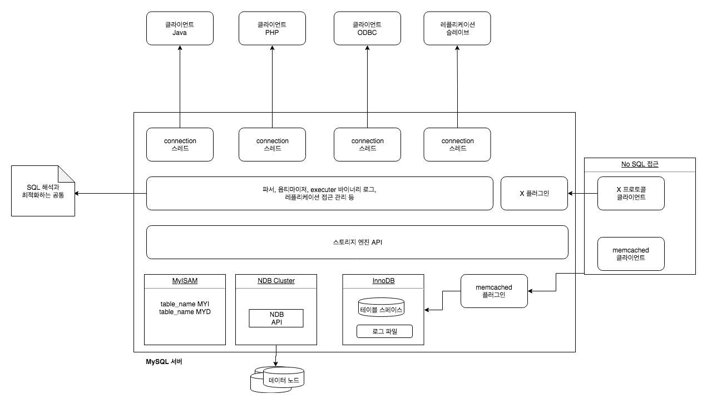
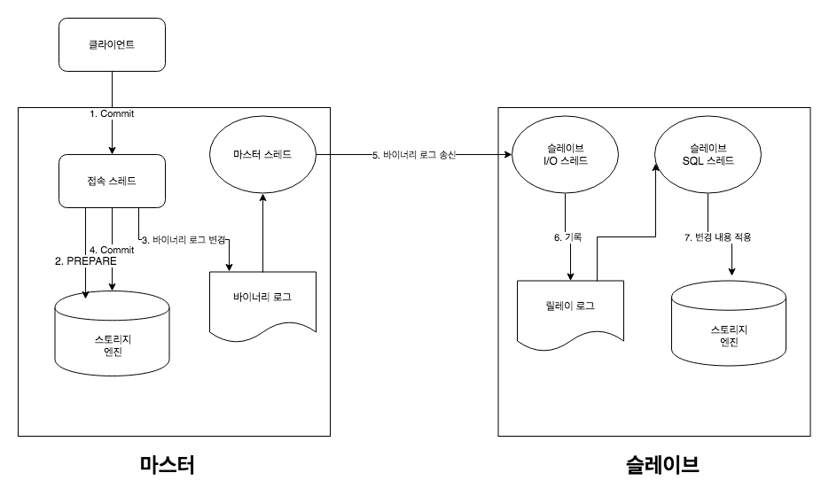
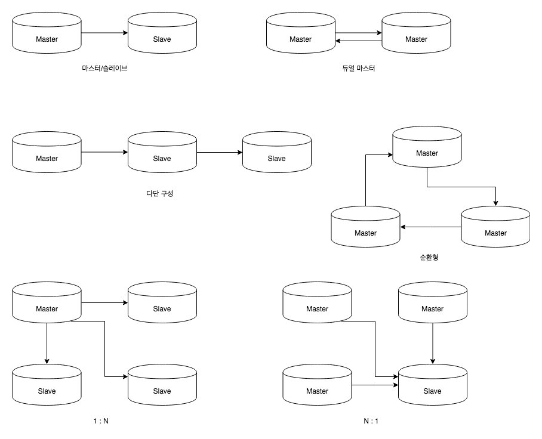
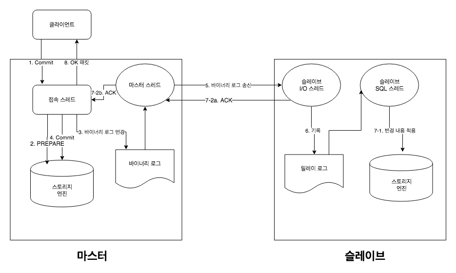
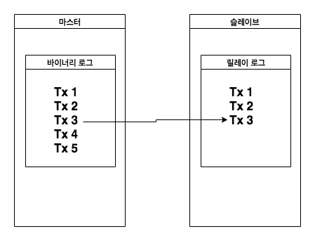
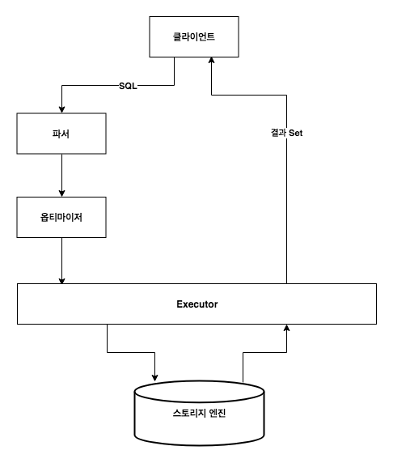
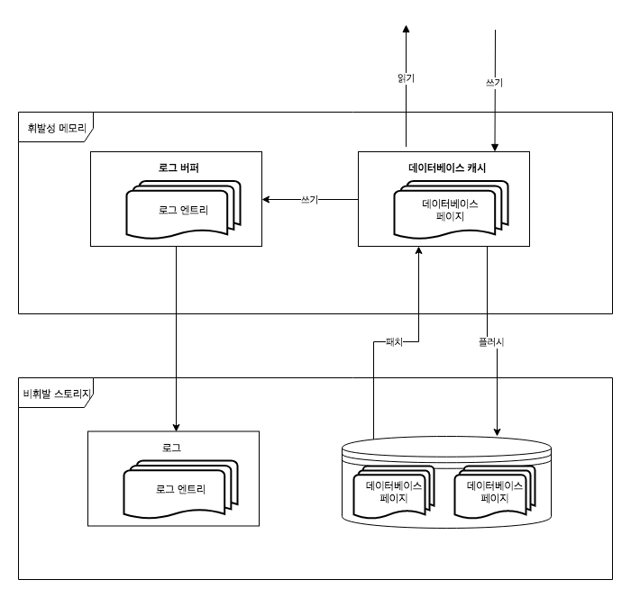

> 해당 글은 [MySQL 5.7 완벽 분석](http://www.yes24.com/Product/Goods/72270172?)을 정리한 내용입니다.

# 레플리케이션


MySQL에 국한된 것은 아니겠지만, 레플리케이션의 저변에 깔린 사고 방식은 아주 단순하다. **2개의 데이터베이스에 저장되는 데이터가 같고, 이 데이터에 가해진 변경도 같으면 결과도 같다** 는 것이다. 마스터에 일어난 변경을 연속적으로 기록해서 같은 변경을 슬레이브에 전송한다. 슬레이브에서 마스터에 보내욘 변경 이력을 연속으로 재생한다. 이렇게 하면 슬레이브의 데이터는 마스터를 따라가게 된다.



* 마스터의 변경을 기록하기 위한 바이너리 로그
* 슬레이브에 데이터를 전송하기 위한 마스터 스레드
* 슬레이브에서 데이터를 받아 릴레이 로그에 기록하기 위한 I/O 스레드
* 릴레이 로그에서 데이터를 읽어 재생하기 위한 SQL 스레드


MySQL은 이와같은 구조를 사용해 **비동기 레플리케이션을 구현하고 있다.** 비동기형은 마스터의 변경이 일어난 이후에 슬레이브에 변경 데이터를 전송해 마스터의 변경 시간과 상관없이 슬레이브에서 변경 내용을 적용하는 것을 말한다. **다시 말해 슬레이브 데이터는 마스터와 완전하게 동기화 되는 것이 아니라 약간의 시차를 두고 따라가게 되는 것이다.**

## 바이너리 로그
**바이너리 로그는 MySQL 서버에 발생한 모든 변경을 직렬화하여 기록한 파일이다.** MySQL 서버가 생성해 보관 중인 바이너로그의 정보는 바이너리 로그 인덱스 파일에 저장한다. 이 때 실제 존재하는 바이너리 로그 파일과 바이너리 로그 인덱스  파일의 내용은 반드시 같아야 한다. **바이너리 로그를 재생한다는 것은 그 SQL문을 순서대로 실행한다는 의미다.** 레플리케이션을 위해 바이너리 로그를 사용하는 경우에 한해 statement 기반 레플리케이션(SBR) 이라고 부른다. 

SRB의 문제점은 SQL 종류에 따라 실행 결과가 반드시 일치하지 않을 수 있다는 것이다. 대표적으로 UUID() 함수를 사용하는 경우가 대표적인 예다.

이와 같은 비결성 SQL문제를 극복하기 위해서 MySQL 5.1에서 row 기반 포맷, 또는 row 기반 레플리케이션 RBP 모드가 추가되었다 이는 말대로 SQL을 실행한 결과, **변경이 일어난 행의 변경 전후 값을 기록하는 방식이다.** 행 단위로 데이터를 기록하기 때문에 SBR에 비해 바이너리 로그 크키가 큰 결점이지만, SQL이 비결정성인지 아닌지에 대해 걱정할 필필요가 없다.

바이너리 로그에는 또 하나의 포맷이 존재한다. Mixed 기반 포맷, 또는 Mixed 기반 레플리케이션이 MBR 이다. 이는 SBR, RBR을 필요에 따라 나누어 사용하는 방식으로, **처음에는 SBR로 기록하다가 비결정성 SQL을 만나면 RBR 방식으로 기록한다. 따라서 비결정성 SQL로 인해 데이터 부정합성이 발생할 걱정이 없다.** 두 가지 장점을 모두 취한것이다. 


## 레플리케이션을 구성하는 스레드

### 마스터 스레드
**MySQL의 레플리케이션은 마스터가 서버이고 슬레이브가 클라이언트인 관계다.** 다시말하면, **레플리케이션을 위해 슬레이브가 마스터로 접속하는 형태다. 따라서 마스터는 슬레이브가 로그인하기 위한 계정이 필요하며, REPLICATION SALVE라는 권한을 부여 받아야 한다.**

마스터 스레드의 역할은 단 하나, 바이너리 로그를 읽어 슬레이브에게 전송 하는 것이다. 슬레이브는 단순한 클라이언트 가운데 하나로, 통상의 사용자 스레드와 어떤 차이도 없으면 로그인한 것만으로 슬레이브인지 아닌지 알 도리가 없다. 로그인 후 슬레이브가 바이너리 로그를 송신하도록 지시하고 나면 송신이 시작된다.

### 슬레이브 I/O 스레드
I/O 스레드는 마스터에 접속해 `COM_BINLOG_DUMP`, `COM_BINLOG_DUMP_GTID` 명령어로 마스터에서 연속적으로 갱신된 내용을 받으며, 받은 데이터를 릴레이 로그라는 로그파일에 보존한다.

### 슬레이브 SQL 스레드
슬레이브 SQL 스레드는 릴레이 로그에 기록된 갱신 내용을 읽어 들여 슬레이브에서 재생할 때 사용되는 스레드이다.

## 레플리케이션의 형태
MySQL 레플리케이션은 마스터-슬레이브형의 구성을 기본으로한다. 레플리케이션을 구성하기 위해서는 마스터에서 슬레이브로 바이너 로그를 보내서 슬레이브에서 재생하는 방식 구조를 충족하면 된다. 그 범위 내에 실로 다양한 레플리케이션 형태가 존재한다. 




## 레플리케이션 구축

### 마스터 설정

#### server_id 설정
MySQL 서버는 모두 공의 ID가 필요하다. server_id는 바이너리 로그에 기록된다. 그래야 바이너리 로그를 받은 슬레이브가 어떤 MySQL 서버가 변경의 발신처인지를 확인할 수 있기 때문이다.

#### 바이너리 로그 활성화
레플리케이션에서 바이너리 로그가 필수 항목이다.

#### 슬레이브 접속 계정 생성
REPLICATION SLAVE 권한을 가진 사용자를 슬레이브에서 로그인 가능한 상태로 설정 해야한다.

### 슬레이브로 데이터 복사
신규로 MySQL 서버를 설치하고, 동시에 레플리케이션을 설정하는 경우 데이터를 따로 복사할 필요가 없다. 하지만 **현존하는 MySQL 서버를 마스터로 하고 새로운 슬레이브를 추가하고 싶은 경우 마스터에서 슬레이브로 데이터를 복사해야 한다.**

먼저 마스터에서 백업을 하고 슬레이브에 복원을 한다. 백업을 하는 시점은 마스터에서 바이너 로그를 활성화한 이후여야한다. 

### 슬레이브 설정
마스터가 준비되면 슬레이브에서 마스터로 접속할 수 있다. 

#### server_id 설정
MySQL다른 서버와 중복되지 않은 공유한 server_id를 지정한다.

#### 레플리케이션 설정
레플리케이션 설정은 CHANGE MASTER 명령어로 할 수 있다.

```sql
mysql > CHANGE MASTER TO
    -> MASTER_HOST = '마스터 호스트명 또는 IP 주소',
    -> MASTER_PORT = 3306,
    -> MASTER_LOG_FILE = 'MYSQL-BIN.000777',
    -> MASTER_LOG_POS = 12345678
    -> MASTER_HEARTBEAT_PERIOD = 60;
```

## GTID의 진화
GTID는 바이너리 로그에 기록된 각각의 트랜잭션에 고유한 ID를 붙여주는 기능을 말한다.

```
발신서 MySQL 서버의 ID : 트랜잭션 ID
00018758-1111-1111-1111-11111111:1
```

트랜잭션 ID는 수의 범위로 표현하는 것도 가능하다. 예를 들어, 처음부터 9999번째까지의 일련의 트랜잭션에 1-9999와 같은 표기가 사용될 수 있다. GTID는 어떤 트랜잭션을 실행했는가를 이와 같은 트랜잭션 ID의 범위로 표현 가능하다.

**GTID는 1:N형의 레플리케이션에서 슬레이브의 자동 승격에 이용된다.** 어떤 문제로 인해 마스터를 더 이상 사용할 수 없게 된경우, 문제 없이 운영중인 슬레이브를 승격시켜 새로운 마스터로 사용하는 방법이다. GTID가 없는 5.5 이전 버전에서는 슬레이브의 승격이 굉장히 어려운 문제였다. 

슬레이브를 마스터로 승격시킬때 마스터로 승격시키려면 다음 두 가지가 필요하다.

1. 애플리케이션에서 변경할 대상의 서버 주소를 변경한다.
2. 새로운 승격된 마스터로부터 다른 슬레이브가 레플리케이션을 위해 변경 내용을 받는다.


**슬레이브가 여러 개 있다고 해도 슬레이브 사이에 어떤 연계가 있는 것은 아니다. 슬레이브는 각각의 마스터로부터 바이너리 로그를 받아 자기만의 페이스로 재생한다.**

혹시라도 I/O 스레드가 받은 바이너리 로그의 진행에 차이가 생기면 그 차이를 메우기 위한 작업이 매구 귀찮아진다. 왜냐하면 슬레이브 자신이 생성한 바이너리 로그와 마스터가 생성한 바이너리 로그 사이의 관계를 알려주는 정보가 없기 때문이다. **GTID가 있다면 바이너리 로그에 기록된 각각의 트랜잭션은 한번에 식별이 가능하므로 근본적으로 이와 같은 문제가 발생하지 않는다.**

## OK 패킷에 GTID
**MySQL의 레플리케이션은 비동기 레플리케이션이다.** 준동기 레플리케이션 모드도 있지만 이때도 동기화하는 것은 I/O 스레드까지로, **그 후 SQL 스레드가 바이너리 로그를 재생해 트랜잭션이 완료하기까지 기다리지 않는다. 그러므로 마스터에서 트랜잭션을 실행한 직후에 슬레이브에 질의하면 그 트랜잭션이 실행되기 전에 데이터만 참조하게 될 수도 있다.**

**마스터에서 커밋한 트랜잭션이 슬레이브에 전파되는 것을 기다렸다가 슬레이브에 질의하는 것**을 위해 고안된 것이 GTID를 사용해 트랜잭션이 전파되었지를 판단하는 방법이 고안되었다.

## 준동기 레플리케이션의 개선점
준동기 레플리케이션은 MySQL 5.5에서 추가된 기능으로, **마스터에서 일어난 변경이 슬레이브에 확실하게 전달되었는지를 보증하는 것을 말한다.** 준동기 레플리케이션도 버전이 올라가면서 계속 개선되어 MySQL 5.7에서는 사용이 꽤 편리해졌다.

### 준동기 레플리케이션이란
준동기 레플리케이션은 완전한 동기 레플리케이션은 아니다. 만일 완전한 동기 레플리케이션이 MySQL 서버에도 존재한다고 하면, 그것은 2단계 커밋을 의미한다. 2단계 커밋이란 PREPARE와 COMMIT의 두 단계로 나눈 것을 말한다.

준동기 레플리케이션은 전체 과정 중 어느 부분을 동기화하는 것인가? **마스터와 트랜잭션이 실행되면 COMMIT을 완료하기 전에 슬레이브 바이너리 로그의 전송을 완료함을 의미한다.**



준동기 레플리케이션에서 클라이언트에 COMMIT의 응답(4번의 응답)을 변환하기 전에 슬레이브에서 ACK(7-2a. ACK)가 반환되기를 기달린다. **7-1, 7-2a는 병렬로 실행되기 때문에 어느 쪽이 먼저 끝날지 모른다. 클라이언트에서 응답한 시점에 이미 슬레이브의 변경이 완료될 수도 있다. 하지만 완벽하게 같은 시기는 아니므로 동기라고 보증할 수 없다.**

엔진쪽에서 COMMIT이 일어나다. PREPARE가 완료한 시점에서 MySQL 서버가 손상될 경우, 재기동 후의 복구는 바이너리 로그에 트랜잭션이 남아 있다면 처음으로 COMMIT이 실행되며, 그렇지 않으면 트랜잭션 롤백을하게 된다. **다시 말해 바이너리 로그의 fsync 여부에 따라 변경 내용을 영속화할것인지 아닌지 결정하는 것이다.**

## 무손실 레플리케이션
MySQL 5.6까지의 준동기 레플리케이션에서 슬레이브가 ACK를 기다리는 시점이 클라이언트에게 응답을 반환하기 직전이었다. 하지만 이런 구조는 아주 중대한 문제가 있다. **마스터가 손상되어 슬레이브를 승격시켜야 하는데 이경우에 손상 전의 마스터에만 존재했던 데이터가 있을 수 있다는 점이다.**

1. 마스터가 데이터 X를 쓴다.
2. 데이터 X가 바이너리 로그에 씌여진다.
3. 데이터 X가 스토리지 엔진에 COMMIT 된다.
4. **이 시점에서 데이터 X에 대한 Lock이 해제되어 다른 트랜잭션은 데이터 X를 참조할 수 있게된다.**
5. 클라이언트의 응답이 정지되고 ACK를 기다리는 상태가 된다.
6. 데이터 X가 슬레이브로 전송되기 전에 마스터가 손상된다.

여기서 데이터 X라는 추상적인 표현을 사용하고 있으나 INSERT, UPDATE, DELETE 어떤 변경이든 좋다. 만일 애플리케이션에서 다른 세션으로부터 데이터 X를 참조한 경우, **애플리케이션은 데이터 X가 데이터베이스에 영구적으로 반영되어 있으리라 기대한다.** 하지만 슬레이브 중 하나를 승격하면 데이터 x는 존재하지 않는다. 다시 말해서 있을것이라고 생각한 데이터 x가 분실된것이다.

이 문제를 해결하는 방법은 ACK를 기다리는 시점을 변경 하는 것이다 MYSQL 5.7애서 COMMIT을 실행한 다음이 아니라 COMMIT을 실행하기 전에 ACK를 기다리도록 변경하는 것이다. 


**ACK를 기다리는 시점만 달라졌다.** 하지만 그 효과는 실로 방대하며, 이로 인해 마스터에서 COMMIT이 완료된 트랜잭션은 모두 슬레이브에 확실히 전달 된다. 어떤 슬레이브를 승격 시킨 다해도 데이터를 분실한 일은 없다. **이것이 무손실 레플리케이션**이다.

이와 같은 변경으로 손상 전에는 InnoDB로의 COMMIT아 완료되지 않았기 때문에 반대로 슬레이브에만 데이터가 존재하는 상황이 있지 않을까 걱정할 수 도 있다. 하지만 **이런 상태에서 마스터가 손상되어 그 이후에 재기동을 하면 손상 복구의 후처리로 PREPARE된 트랜잭션이 COMMIT되기 때문에 마스터에서도 데이터를 분실하지 않는다.**

## ACK 스레드 추가로 인한 성능 개선
MySQL 5.6에서는 마스터 스레드가 슬레이브의 바이너리 로그 전송과 ACK수신을 담당한다. 따라서 어떤 이벤트를 송신하면 그에 대한 응답으로 ACK를 수신하기전까지 다음 이벤트를 송신할 수가 없다. MySQL 5.7에서는 **새로운 스레드를 도입함으로써 이러한 문제를 해결했다. ACK를 수신하는 별도의 스레드를 두어 개선한것이다.** ACK 스레드의 도입의로 마스터의 갱신 성능은 비약적으로 개선되었다. 준동이 레플리케이션은 마스터의 변경 오버헤드가 단점이었는데 상당 부분이 해소되었다.

## ACK를 반환하는 슬레이브 수의 지정
MySQL 5.6의 준동기 레플리케이션은 슬레이브 하나에 ACK가 반환되어 돌아오면 대기가 끝나고 클라이언트에게 응답을 반환하는 형식이다.(무손실 레플리케이션에서 `7.COMMIT`이  `6.2a ACK` 응답을 할 때까지 기다리는 동기적 흐름) 이는 고가용성 관점에서 보면 최적의 선택지가 아니다. 여러 개의 머신이 동시에 망가질 가능성도 있기 때문이다. (슬레이브가 N개가 있느 경우 모든 슬레이브에서 클라이언트에게 응답을 반환할 때까지 기다리는 형식 이기 때문인거 같다. 뇌피셜임)

그래서 MySQL 5.7에서는 ACK를 반환하는 슬레이브 수를 조정할 수 있도록 했다. 1:N 형태라면 여러 슬레이브로부터 ACK 반환을 기다리는 상황을 예측할 수 있다. ACK를 반환하는 슬레이브 수는 `rpl_semi_sync_master_wait_for_salve_count`옵션으로 조정할 수 있다. 예를 들어 **2로 설정하면 적어도 2개의 슬레이브에서 ACK가 반활될 때까지 클라이언트에 COMMIT에 대한 응답을 반환하지 않는다.**

만일 현재 접속 중인 슬레이브 수가 `rpl_semi_sync_master_wait_slave_for_count`에 지정한 수보다 적은 경우 마스터가 어떤 행동을 할지 `rpl_semi_synce_master_wait_no_slave`옵션으로 ON, OFF 값중 하나를 선택할 수 있다. 기본설정 값은 ON 이다.

`ON`으로 설정하면 접속하고 있는 슬레이브의 수가 `rpl_semi_sync_master_wait_for_slave_count` 보다 적도라도 **필요한 수만큼 ACK가 반환될 때까지 기다린다. 다시 말하면 슬레이브가 부활할 때까지 기다리는 것이다.**

`OFF`의 경우, 접속하고 있는 슬레이브의 수가 **`rpl_semi_sync_master_wait_for_slave_count`보다 적으면 비동기 모드로 전환된다.**  따라서 견고함을 중시하는 경우에는 `ON`, 속도를 중시하는 경우는 `OFF`를 선택하면 된다.

## 멀티 소스 레플리케이션
MySQL 5.6까지의 레플리케이션에서는 각 슬레이브가 하나의 마스터만 둘수 있었다. 이러한 제한을 철폐하고 여러 마스터로부터 동시에 변경을 받아들이는 구조가 MySQL 5.7에 추가되었는데, **이것이 멀티 소스 레플리케이션이다.**

멀티 소스 레플리케이션은 다음과 같은 경우에 유용하다.

* 분석을 위해 여러 개의 애플리케이션에서 데이터를 집약할 때
* 여러 개의 애플리케이션으로 공통의 마스터 데이터를 배포할 때
* 샤딩에 의해 분할된 데이터를 재통합할 때


## 그룹 커밋의 제어 (성능 개선)

MySQL 5.6에서는 바이너리 로그에 대한 커밋 그룹이 가능해졌다. 트랜잭션을 COMMIT하면 그 변경이 분실되는 것을 막기 위해 로그 파일이 디스크로 동기화(sync) 된다. 디스크로의 동기화는 비용이 많이 드는 처리이다. SSD의 보급으로 충분히 빨라지긴 했지만 그래도 동기화 처리는 느리다. **그룹 커밋은 이렇게 느린 동기화 처리의 횟수를 줄일수 있도록 여려 트랜잭션의 COMMIT을 어느 정도 합친 시점에서 디스크로 동기화하게 하는 원리이다.** 이로 인해 디스크로의 접근 횟수가 줄어들면서 변경 처리 성능이 대폭 향상될 수 있는 것이다.

InnoDB는 훨씬 이전 버전인 MySQL 5.1 + InnoDB Plugin에서도 이미 그룹 커밋이 가능했지만 바이너리 로그를 기록하는 작업은 그룹 커밋이 되지 않고 `sync_binlog = 1`로 설정한 경우에는 **바이너리 로그 동기화가 트랜잭션 별로 이루어져 만족할 만한 성능을 얻지 못했다.** 그래서  **MySQL 5.6에서는 바이너리 로그 쓰기 작업에 그룹 커밋을 적용 했다.**


위 그림처럼 세 개의 트랜잭션이 같은 시간대에 COMMIT을 실행하고 있다.(2단계 커밋이 사용되고 있음) 2-Phase의 커밋의 처리 흐름은 


1. InnoDB의 PREPARE -> 바이너리 로그의 wirte
2. 바이너리 로그의 fsync -> InnoDB의 COMMIT 


순으로 이루어 진다. **MySQL 5.6 이전 버전에서는 `sync_binlog = 1`로 설정한 경우, 바이너리 로그의 wrtie와 fsync는 분리할 수 없다.** 때문에 위 그림 처럼 **여러 트랜잭션이 거의 동시에 COMMIT을 수행하면 바이너리 로그의 write와 fsync가 각각 발생한다.** 이러한 느린 처리가 트랜잭션 마다 매번 일어나게 되어 `sync_binlog = 1`의 경우 변경 처리의 효율이 매루 떨어진다.

MySQL 5.6에서는 **바이너리 로그의 그룹 커밋이 가능하게 되었다.**


그 결과 바이너리 로그의 fsync 횟수가 줄어들면서 `sync_binlog = 1`의 변경 처리가 더없이 빨라지게 된 것이다. 

### binlog_group_commit_sync_delay
그룹 커멧어서 가능한 많은 트랜잭션을 합쳐서 디스크로 동기화하는 편이효율 면에서 유리하다. **`binlog_group_commit_sync_delay`를 설정하면 하나의 트랜잭션이 COMMIT을 실행해도 바로 디스크로 동기화 하지 않고 또 다른 트랜잭션이 COMMIT이 되기를 기달린다. `binlog_group_commit_sync_delay`는 이때 기다리는 시간을 설정할 수 있는 옵션이다.** 기본 값은 0으로, 트랜잭션이 COMMIT되면 바로 디스크에 동기화하게 한다.

`binlog_group_commit_sync_delay`의 값을 너무 크게 설정하면 그만큼 COMMIT에 대한 응답속도가 느려지무로 쥐의해야 한다. **이 옵션의 의도는 응답속도를 어느정도 희생하는 대신 트랜잭션의 처리량을 향상시키는 데 있다.** 어느정도 테스트한 후 값을 결정하도록 하자. 애플리케이션의 부하 패턴이나 사용하고 있는 디스크의 종류(SSD 등)에 따라 `binlog_group_commit_sync_delay`의 값을 크게 해도 처리량이 향상되지 않을 수 있다. **처리량이 향상되지 않는다면 COMMIT 응답속도를 굳이 희생할 필요는 없다.**

### binlog_group_commit_sync_no_delay_count
**이 옵션은 그룹 커밋의 크기가 너무 커지는 것을 막기 위해 사용한다.** 대기 시간이 `binlog_grouo_commit_sync_delay`에 도달하지 않아도 함께 그룹 **COMMIT해야 할 트랜잭션 수가 `binlog_group_commit_sync_no_delay_count`에서 지정한 수에 도달하면 COMMIT을 실행하게 된다.** 이 옵션은 `binlog_grouo_commit_sync_delay`와 함께 설정해야 하며 단독으로 설정해서는 아무 효과가 없다.

그룹 크기가 너무 방대해지면 I/O 비용이 너무 커지기 때문에 COMMIT에도 시간이 걸리게 된다. 이와 같은 현상을 막기 위해 어느 정도의 크기까지 트랜잭션이 모인 시점에서 COMMIT을 실행하는 편이 좋다.

## 마스터 스레드의 메모리 효율 개선
MySQL 5.7에서는 마스터 스레드에서 일어난 비효율적인 메모리 할당과 해제가 해소되었다. **MySQL 5.6까지의 마스터 스레드에서 바이너리 로그에서 이벤트를 읽어들일 때마다 그 이벤트의 크기에 알맞는 버퍼를 할당하여 이벤트를 슬레이브에 송신한 후, 메모리 해제를 했다.** 메모리를 이렇게 이벤트별로 할당하거 해제하는 것은 비효울적이다.  메모리의 할당 및 해제는 CPU를 많이 소비하기 때문에 마스터의 CPU 사용률을 높이는 원인이 된다. **MySQL 5.7에서는 마스터 스레드의 메모리 할당 처리가 개선되어, 매번 malloc과 free를 하지 않는다.** 이전에 사용한 버퍼로 충분하면 그대로 사용하고, 그렇지 않으면 메모리를 새롭게 배치한다. 이 경우 버퍼의 메모리 할당 및 해제는 필요 없다. 이 기능은 특별한 설정 없이 바로 쓸 수 있다. 버전이 올리는 것만으로 마스터 스레드가 효율적이 된다는 것이다.


## 마스터 스레드의 Mutext 경합 개선
MySQL 5.6에서는 그룹 커밋이 도입 되었다. 이로 인해 `sync_binlog = 1`일 때의 마스터 갱신 성능이 대폭 개선됐지만, 한 가지 문제가 있다. **마스터가 손상됐을 떄 슬레이브에는 기록 되지 않은 데이터가 발생할 수 있다는 것이다.**



그룹 커밋에서 바이너리 로그를 디스클 fsync하기 전에 몇 개 트랜잭션을 묶어 바이너르 로그에 쓴다. **반면 마스터 스레드는 fsync가 끝나지 않아도 바이너리 로그가 write된 시점에서 슬레이브로 전송이 가능하다. 아직 디스크의 fsync가 끝나지 않은 바이너리 로그가 있을 때 마스터 서버가 손상되면 재기동후에 바이너리 로그의 데이터가 없어지기 때문에 변경 내용을 롤백이 되어바린 것이다. 그러나 만일 그 데이터들이 이미 슬레이브에 전송되었다면, 마스터에는 없는 데이터를 슬레이브가 갖고 있게 되어 마스터와 슬레이브 사이에 데이터 부정합이 발생한다.**

위 그림 처럼 Tx1 ~ Tx5가 하나의 그룹으로 커밋되고 있다. 만이 이 그룹 커밋에 대해 바이너리 로그가 디스크에 fsync를 하지 않은 상태에서 손상된다면 Tx1 ~ Tx5는 롤백될것이다. 그러나 Tx3까지는 슬레이브에 전송된 상태이므로 Tx1 ~ Tx3은 슬레이브에만 존재한다.

이러한 문제를 MySQL 5.6.17에서 문제를 수정하였으나 이를 위해 변경 처리 성능을 희생해야 했다. 마스터와 슬레이브의 정합성을 담보하기 위해 바이너리 로그의 그룹 커밋 전체가 `LOCK_log`라는 Mutex에 의해 보호 받도록 수정한 것이다. **LOCK_log는 마스터 스레드가 바이너리 로그를 읽어 들일 때 사용된다. 그 결과, 그룹 커밋과 마스터 스레드 사이에 Mutext를 얻으려는 경합이 발생하면서 마스터 스레드가 슬레이브로 바이너리 로그를 전송하는 효율이 대폭저하되었다.**

MySQL 5.7에서는 이 문제를 해결했다. 그룹 커밋의 도입 떄문에 생긴 마스터 손상 시 마스터와 슬레이브 간 데이터 부정합 문제를 해소하고, 슬레이브로의 로그 전송 속도를 비약적으로 끌어올리는 구조가 도입되었다. **LOCK_binlog_end_pos라는 Mutext가 고입되어 LOCK 입자의 크기가 미세해졌다. 이 Mutext는 마스터 스레드가 읽어 들인 것이 가능한 최후의 바이너리 로그의 위치를 관리한다. MySQL 5.6에서는 마스터 스레드가 EOF가 되기전까지 바이너리 로그를 읽었는데, 그럴 경우 fsync가 되지 않은 데이터까지 읽데 된다. 그래서 MySQL 5.7에서는 마스터 스레드가 fsync가 완료된 데이터만을 읽도록 읽기 가능한 포지션을 관리할 수 있게 하였다.**

## 동일 데이터베이스 내의 병렬 SQL 스레드
MySQL 5.6부터 슬레이브의 SQL 스레드를 여러 개 생성하여 바이너리 로그의 재생을 병렬로 수행할 수 있게 되었다. **이 기능을 멀티 스레드슬레이브(MTS) 라고 한다.** 레플리케이션 지연의 중요한 원인을 SQL 스레드의 지연에서 찾을 수 있다. 이런 경향은 탑재된 CPU 수가 많아질수록 현저해진다. 마스터에서는 여려 개의 코어를 남김 없이 사용해 데이터를 갱신하는 한편, **슬레이브에서는 하나의 SQL 스레드가 하나의 바이너리 로그를 재생해야 한다.** 그렇기 때문에 CPU 코어수가 늘어날숡 마스터와 슬레이브의 갱신 처리량에 격차가 벌어지는 것이다. 이와 같은 배경에서 등장한 것이 MTS이지만 매우 큰 제한이 있어 대부분 이 기능을 사용하지 않는다. **바이너리 로그를 병렬화해도 도일 데이터베이스 내에서 트랜잭션을 병렬화할 수 없기 때문이다.** 대부분의 애플리케이션은 관련 있는 테이블들을 하나의 데이터 베이스에 배치되는 것이 보통이기 때문에 MySQL 5.6의 MTS는 아무 쓸모가 없다.

MySQL 5.7에서는 이와 같은 문제를 해결하여 하나의 데이터베이스 내에서도 SQL스레드가 병렬로 변경 작업을 할 수 있게 했다.

# 옵티마이저

옵티마이저는 RDBMS의 중요한 구성요소이다. **실행 계획에 따라 쿼리의 실행 효율이 크게 변하기 때문이다.** 높은 컴퓨팅 파워를 가져도 실행 계획이 엉망이면 좋은 성능을 기대하기는 힘들다. 그래서 옵티마이저의 특성을 이해하는 것이 중요하다

## MySQL 톱티마이저의 구조
**옵티마이저는 기본적으로 `식의 등가 변환`에 의해 취할 수 있는 여려 실행 계획 중에 최적의 것을 선택하는 역할을 한다.** 등가 변환의 예를들면 부분 결합(Inner Join)의 순서를 바꾼다든지, `WHERE` 구조 조건의 평가 순서를 바꾸거나 또는 서브쿼리를 별도의 알고리즘으로 치환하는 것 등이 있다.

MySQL의 옵티마이저는 비용 기반 옵티마이저다. 어떤 실행 계획으로 쿼리를 실행했을 때 비용이 얼마나 발생했는가를 계산하여 비용이 가장 적은 것을 택한다. **단 이것은 어디까지나 추정값이므로, 정확한 비용은 실행 전까지 정확하게 가늠할 수 없다.**

### SQL 실행의 흐름
옵티마이저는 최적의 실행 계획을 선택하기 위한 기능이지만, SQL그 자체를 보고 판단하는 것은 아니다. SQL문은 먼저 서버의 구문 해석기에서 해석을 거처 콤퓨터가 다루기 쉬운 형태로 변환된다. 구체적으로 AST 형식이다. AST로 고친후 executor로 제어를 옮겨 실행한다. Executor는 옵티마이저에서 전달 받은 실행 계획을 기반으로 실제 테이블에서 행을 가져와 결과를 생성한다.



**Executor가 어느정도 작업을 해야하는지는 쿼리의 내용과 옵티마이저의 능력에 의해 결정된다.** 옵티마이저가 휼륭하면 효율이 쫗지 않은 실행 계획을 선택할 확률도 줄어들게 되므로 Executor의 작업량도 상대적으로 줄어든다.

### EXPLAIN
EXPLAIN은 MySQL 서버가 어떠한 쿼리를 실행할 것인가, **즉 실행 계획이 무엇인지 알고 싶을 떄 사용하는 기본적인 명령어이다.** 5.6 부터는 JSON 형식의 출력도할 수 있게 되었다. MySQL Workbench와의 결합으로 시각화할 수 있게 되어 더욱  편리해졌다. 


#### 표형식의 EXPLAIN 개선

```sql
explain
select
    City.Name, Countury.Code, CountryLanguage.Language 
from 
    City
join City.countrycode = Country.code and City.id = Country.capital
join CountryLanguage.countryCode = City.countryCode
```

id | select_type | table | partitions | type | possible_keys | key | key_len | ref | rows | filtered | Extra
---|-------------|-------|------------|------|---------------|-----|---------|-----|------|----------|------
1 | SIMPLE | Country | NULL | ALL | PRIMARY | NULL | NULL | NULL | 239 | 100.00 | Using where
1 | SIMPLE | City | NULL | eq_ref | PRIMARY,ConturyCode | PRIMAY | 4 | world.Country.Capital | 1 | 5.00 | Using where
1 | SIMPLE | CountryLanguage | NULL | ref | PRIMARY,ConturyCode | CountryCode | 3 | world.Country.Code | 4 | 100.00 | Using index

EXPLAIN에는 3개의 행이 있는데, 각각 테이블로의 접근을 표시한 것이다. 조인은 위에서부터 순서대로 일어난다고 생각하면 된다.

##### table
어떤 테이블에 대한 접근을 표시하고 있는지는 table 필드에 표시되어있다. 따라서 이 쿼리를 실행하면 Country -> City -> CountryLanagueage 순으로 조인하는 것을 알 수 있다.

##### id
id는 SELECT에 붙은 번호를 말한다. MySQL은 조인을 하나의 단위로 실행하기 때문에 id는 그 쿼리에 실행 단위를 식별하는 것이다. 따라서 조인만 수행하는 쿼리에서는 id는 항상 1이 된다.

##### select_type
select_type은 항상 SIMPLE 이된다. 복잡한 조인을 해도 SIMPLE이 된다. 서브뤄리나 UNION이 있으면 id와 select_type이 변한다.

##### partitions
partitions는 파티셔닝이 되어 있는 경우에 사용되는 필드이다. 이 쿼리에서 사용된 테이블을 모두 파티셔닝이 되어 있지 않기 때문에 이 필드가 모두 NULL로 출력되았다. 파티셔닝 되어 있는 경우는 반드시 이 필드를 확인하자 

##### type
type은 접근 방식을 표시하는 필드다. 접근 방식은 테이블에서 어떻게 행데이터를 가져올것인가를 가리킨다. 위 EXPLAIN에서는 ALL, eq_ref, ref가 있는데
ALL xpdlqmf tmzos, eq_ref는 조인시 기본 키나 고유키를 사용하여 하나의 값으로 접근(최대 1행만을 정확하게 패치), ref는 여러 개의 행을 패치할 가능성이 있는 접근을 의미한다. **접근 방식은 대상 테이블로의 접근이 효율적일지 여부를 판단하는 데 아주 중요한 항목이다.**

이들 접근 방식 가운데도 주의가 필요한 것은 ALL, index, ref_or_null이다. **ALL, index 두 가지는 테이블 또는 특정 인덱스가 전체 행에 접근하기 때문에 테이블 크기가 크면 효율이 떨어진다. ref_or_null의 경우 NUL이 들어있는 행은 인덱스의 맨 앞에 모아서 저장하지만 그 건수가 많으면 MySQL 서버의 작업량이 방대해진다. 다시 말해서 ALL 이외의 접근 방식은 모두 인덱스를 사용한다.**  

접근 방식이 ALL 또는 index인 경우는 그 쿼리로 사용할 수 있는 적절한 인덱스가 없다는 의미일 수도 있다. 위 쿼리에서 Country 테이블에 대한 접근은 ALL이지만 이는 WHERE 구의 조건을 지정하지 않았기 때문이다. 그러한 쿼리에서 드라이빙 테이블에 접근한다면 전체 행을 스캔 할수 밖에 없다.

접근 방식 | 설명
------|---
const | 기본 키 또는 고유키에 의한 loockup(등가비교), 조인이 아닌 가장 외부의 테이블에 접근 하는 방식, 결과는 항상 1행이다. 단 기본 키, 고유 키를 사용하고 있으므로 범위 검색으로 지정하는 경우 const가 되지 않는다
system | 테이블에 1행밖에 없는 경우의 특수한 접근 방식
ALL | 전체 행 스캔, 테이블의 데이터 전체에 잡근한다.
index | 인덱스 스캔, 테이블의 특정 인덱스의 전체 엔트리에 접근한다.
eq_ref | 조인이 내부 테이블로 접근할 떄 기본키 또는 공유 키에 의한 lookup이 일어난다. const와 비슷하지만 조인의 내부 테이블에 접근한다는 점이 다르다
ref | 고유 키가아닌 인덱스에 대한 등가비교, 여러 개 행에 접근할 가능성이 있다.
ref_or_null | ref와 마찬가지로 인덱스 접근 시 맨 앞에 저장되어 있는 NULL의 엔트리를 검색한다.
range | 인덱스 특정 범위의 행에 접근한다
fulltext | fulltext 인덱스를 사용한 검색
index_merge | 여러 개인스턴스를 사용해 행을 가져오고 그 결과를 통합한다.
unique_subquery | IN 서브쿼리 접근에서 기본 키 또는 고유 키를 사용한다. 이 방식은 쓸데 없는 오버헤드를 줄여 상당히 빠르다.
index_subquery | unique_sunquery와 거의 비슷하지만 고유한 인덱스를 사용하지 않는 점이 다르다. 이 접근 방식도 상당히 빠르다

##### possible_keys
possible_keys 필드는 이용 가능성있는 인덱스의 목록이다.

##### key 
possible_keys 필드는 이용 가능성있는 인덱스의 목록 중에서 실제로 옵티마이저가 선택한 인덱스가 key가 된다. 위 EXPLAN 에서는 County 테이블(첫 번째 행)의 **Key는 NULL 인데 이는 행 데이터를 가져오기 위해 인덱스를 사용할 수 없다는 의미이다.**

##### key_len
key_len 필드는 선택된 인덱스의 길이를 의미한다. 중요한 필드는 아니지만 인덱스가 너무 긴 것도 비효율적이므로 기억해두자.

##### rows
rows는 이 접근 방식을 사용해 몇 행을 가져왔는가를 표시한다. 최초에 접근하는 테이브,ㄹ에 대해서 쿼리 전체에 의해 접근하는 행 수, 그 이후에 테이블에 대해서는 1행의 조인으로 평균 몇 행에 접근했는가를 표시한다. 단 어디까지나 통계 값으로 계산한 값이므로 실제 행 수와 반드시 일치하지 않는다.

##### filtered
filtered는 행 데이터를 가져와 거이에서 WHERE 구의 검색 조건이 적용되면 몇행이 남는지를 표시한다. 이 값도 통계 값 바탕으로 계산한 값이므로 현실의 값과 반드시 일치하지 않는다. 

위 EXPLAN에서는 쿼리에서 톰티마이저가 City 테이블에 접근한 후 WHERE 구의 조건을 적용하게되면 5%밖에 남지 않는다고 판단한 것이다.

##### Extra
Extra 필드는 옵티마이저가 동작하는데 대해서 우리에게 알려주는 힌트다. 이 필드는 EXPLAN을 사용해 옵티마이저의 행동을 파악할때 아주 중요하다. 

Extra       설명


Extra 필드는 왜 옵티마이저가 이러한 실행 계획을 취했는가와 실행 계획의 상세를 파악하는데 중요한 정보를 제공한다. EXPLRAN을 얼마나 정확히 해설하는가는 Extra 필드를 얼마나 이해했느냐에 달려있다고 해도 과언이 아니다.

### JSON 형식 EXPLAIN의 개선
5.6 부터는 JSON으로 실행 계획을 출력하는 것이 가능해졌다.

```sql
explain format = json
select
    City.Name, Countury.Code, CountryLanguage.Language 
from 
    City
join City.countrycode = Country.code and City.id = Country.capital
join CountryLanguage.countryCode = City.countryCode
```
JSON 형식의 EXPLAIN은 기존의 표 형식 보다 출력되는 정보가 많다. 5.7 부터는 비용에 관한 정보를 부여주어서 표 형식에 비해 편리하다. JOSN 형식의 EXPLAIN에는 Extra 필드에서 Using WHERE 라고만 출력되는 것이 attacged_condition로 나와서 구체적으러 어떤 조건이 적용되는지 알 수 있다. 

### 새로운 비주얼 EXPLAIN
MySQL Workbench는 비주얼 EXPLAIN을 표시할 수 있습니다. JSON형식 보다 깔끔하고 내용도 쉽게 확인 가능합니다. 5.7 부터 가능합니다.

### 실행 중인 쿼리의 EXPLAIN
MySQL에서 아래 명령어를 통해서 장기간 실행중인 SQL을 조회할 수 있다.
```sql
SHOW PROCESSLIST
```
장기간 실행중하고 있는 SQL을 발견하면 EXPLAN 명령어를 사용하기 위해 

```sql
SHOW FULL PROCESSLIST
```
명령어로 SQL을 가져온다음에 EXPLAN을 실행 해야하는 작업은 번거롭다. Connection ID만 지정하면 실행 중인 SQL의 EXPLANIN 결과를 볼수 있게 된다.

```sql
EXPLAIN FOR CONNECTION 777 # 777 = SQL의 Connection id
```

## 새로운 비용 모델 도입
옵티마이저에 새로운 비용 모델이 도입되었다. 옵티마이저가 비용을 계산할 때의 각종 파라미터를 파악해 표준화한 것으로, 사용자가 직접 조정할수 있게 되었다.

### MySQL 옵티마이저는 비용 기반
옵티마이저는 크게 비용 기반, 규칙 기반으로 나뉜다. 규칙 기반이란 SQL 구문 이나 테이블, 인덱스의 정의, 힌트 구 등에 따라 실행계획을 결정짖는 방식으로 아주 특수해서 지금은 거의 사용하지 않는다. 실행 계획을 고려하여 SQL을 작성해야 하므로 범용성이 떨어진다. **일반적인 RDBMS는 비용 기반의 옵티마이저를 사용하고 있다. 톱티마이저라고 하면 비용 기반이라고 봐도 무방하다.** 비용 기반 옵티마이저는 하나의 SQL을 실행하는 데 취할 수 있는 실행 계획, 즉 SQL을 구문 해석하여 얻어낸 AST와 같은 결과를 가져오는 AST의 조합을 검색하여 각각의 비용을 비교한 다음 최적의 결과를 선택한다.

비용에드는 디스크에서 **페이지를 읽어오는비용, 행 데이터를 가져오는 비용, 가져온 데이터를 비교하는 비용 등이 포함된다. 그리고 테이블이나 인덱스의 통계 정보를 사용해 쿼리 전체를 실행한 경우 비용을 산출한다. 그 후 가장 비용이 저렴한 것을 최적의 실행 계획이라고 본다.** 단, 비용 기반 옵티마이저가 내놓는 답이 항상 최적인 것은 아니다. 추정이기 때문에 SQL을 실행해보기 전에 명확하게 알 수없다.

### MySQL 5.7 비용 모델의 개요
MySQL 5.7에서는 파라미터로 계수를 설정하는 것이 가능해졌다. 이러한 **변경은 비용이라는 것은 본래 하드웨어  환경에 의해 좌우되는 것이기 때문이다.** 예를 들어 디스크에서 페이지를 읽어 들일때, 디스크가 하드디스크일 떄와 SSD일 때드는 비용은 전혀다르다. 이런 차이점을 모두 동일하다고 생각하고 비용 계산하면 산출된 비용과 현실은 큰 차이를 보일 것이다. MySQL이 사용될 가능성이 이쓴ㄴ 환경은 매우 다양하기 때문에 비용 추정을 다양화하는 것이 맞다.

## 실행 계획의 개선
**MySQL의 조인 알고리즘에는 NLJ만 존재한다.** 그밖에도 조인 알고리즘으로 Sort Merge Join이나 Hash Join이 있지만 MySQL에서는 이러한 조인 알고리즘을 이용할 수 없다.

### NLJ
```java
for each row in t1 {
    for each row in t2 {
        send joined row to client
    }
}
```
NLJ는 루트로 처리되어, 테이블 수가 증가하면 루프의 중첩이 점점 깊어진다. 실제 애플리케이션에서 이와 같이 곱을 구하는 경우는 드물고, 대부분 조인의 키가 지정되거나 WHERE 구에 의한 대상 축소 작업이 일어난다. 

```java
for each row in t1 matching where condition {
    for each row in t2 matching join and where condition {
        send joined row to client
    }
}
```
이와 같은 알고리즘이기 때문에 가능한 빠른 단계에서 보다 많은 범위 축소가 일어날수록 효율적인 쿼리가 된다. 따라서 조인의 순서는 쿼리의 효율화에 아주 중요한 요인이다.

### BNLJ
BNLJ는 내부 테이블 접근 시 인덱스를 사용할 수 없을 떄 부하를 줄여준다. 인덱스를 사용할 수 없다는 것은 드라이빙 테입르 1행을 패치한 후, 그 행에 매칭되는 행을 ㅍ찾기 위해 내부 테이블 전체를 스캔한다는 의미이다. 테이블 스캔을 반복해서 실행하는 방식은 성능에 좋지 않다. 특히 내부 테이블이 큰 경우 비효율은 매우 치명적이다.

**조인의 조건이 있는데도 불구하고 유요한 인덷스가 없는 경우에는 바로 인덱스를 추가하여 스캔을 일어나지 않도록 해야한다. 하지만 하루 한번만 실행하면 되는 리포팅 등을 처리하는 것이라면 인덱스를 사용하지 않고 조인하는 것이 허용될 수 있다. 인덱스가 있으면 갱신을 위한 비용이 커지고 필요한 스토리지의 크기도 늘어나기 때믄이다. 그렇다고 NLJ에서 인덱스를 하용하지 않고 조인하는 방식은 효율이 나쁘다. 이럴 때 사용하는 것이 BNLJ 이다.**

BNLJ는 조인 버퍼라는 메모리 영여긍ㄹ 사용해서 내부 테이블이 스캔되는 횟수를 줄여주는 알고리즘이다.

# InnoDB

## InnoDB 개요
InnoDB는 아주 전통적인 트랜잭션에 대응하는 데이터 저장소이다. 트랜잭션은 여러 클라이언트가 동시에 접근할 때 배타 제어와 손상 복구를 통해 이상 증상이나 분실로부터 데이터를 보호하기 위한 구조조이다.



데이터 접근은 클라이언으 요청에 따라 트랜잭션이 개시되면서 부터 시작한다. **클라이언트의 데이터 읽고 쓰기 요청에 대한 응답은 모두 데이터베이스 캐시를 통해 일어나며, 참조 또는 변경하는 데이터가 캐시에 없으면 데이터베이스에 해당 데이터를 패치한다. 클라이언트의 요청이 데이터 변경인 경우 데이터의 변경 작업은 모두 데이터베이스 캐시에서 일어나며, 데이터베이스에 바로 쓰지는 않는다.** 데이터베이스보다 로그를 먼저 갱신해야만 하는데, 그렇게 하지 않으면 데이터의 정합성을 보증할 수 없기 때문이다.

하나의 클라이언트 트랜잭션이 시작한 후 배타 처리 등으로 방해 받지 않고 필요한 갱신을 모두 완료하면 데이터를 영구화한다. 즉 COMMIT 한다. **일단 COMMIT을 수행한 데이터는 분실하면 안되므로 COMMIT이 완료되기까지 로그버퍼를 통해 변경 내용을 로그에 기록한다.** 데이터베이스 캐시에 존재하지만 데이터베이스에는 아직 쓰여지지 않은데이터, **즉 더티 데이터는 백그라운드에서 순차적으로 데이터베이스에 기록한다.** 더티 데이터가 있는 상태에서 데이터베이스 서버가 손상되면 재기동 후에 복구해야한다. 더티 데이터는 데이터베이스에는 없지만 로그에는 존재하므로 이 내용을 재생하면 COMMIT한 변경은 모두 복원될 것이다.

**더티 데이터를 어디까지 데이터베이스에 써내렸는가를 기록하는 처리가 체크 포인트다.**

## InnoDB의 기능적인 특징
* ACID 트랜잭션
* 행 레빌의 Lock
* 4개의 Isolation 레벨 지원
* Dealock 검출
* Savepoint
* B+ 트리 인덱스
* R 트리 인덱스
* 전문 인덱스
* 외부 키 지원
* 데이터 압축
* memcached 인터페이스

온라인 상태에서 변경 작업을 하는 애플리케이션에서는 트랜잭션이 필수이기 때문에 InnoDB 이외의 선택지는 거의 없다. MyISAM의 참조 성능이 좋다고 평가하던 시기도 있었지만. 현재 InnoDB의 CPU 확장성이 우수하므러 참조만 있는 부하 상황이 라고 해서 MyISAM이 일등은 아니다. R 트리나 전문 검색 인덱스를 사용할 수도 있게되어 더욱 InnoDB가 좋다.

