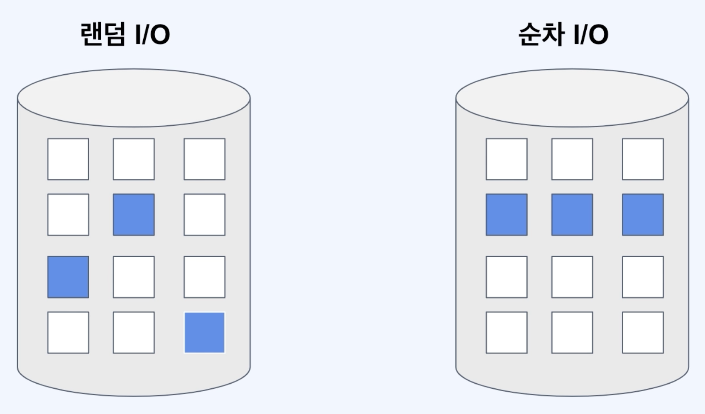
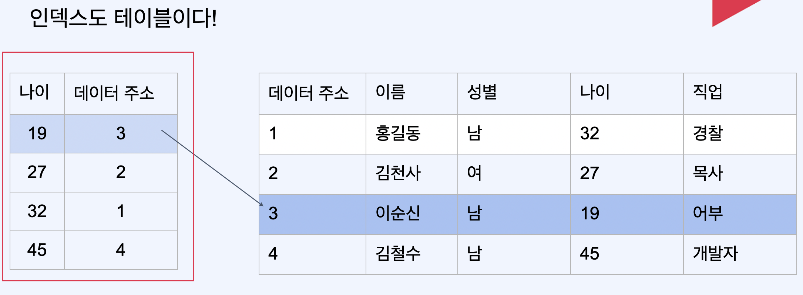
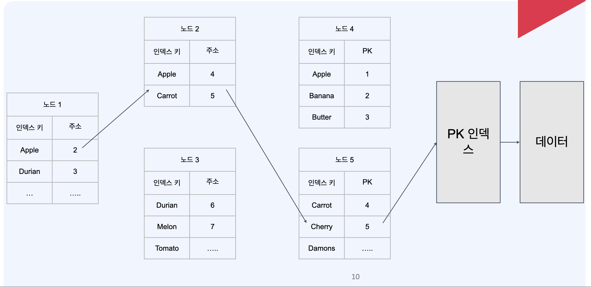
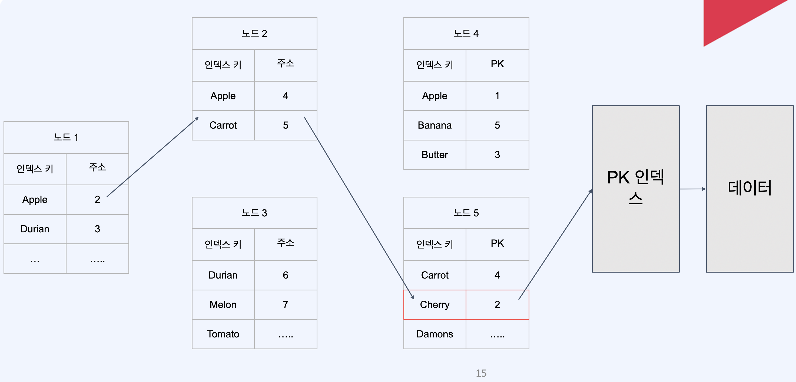
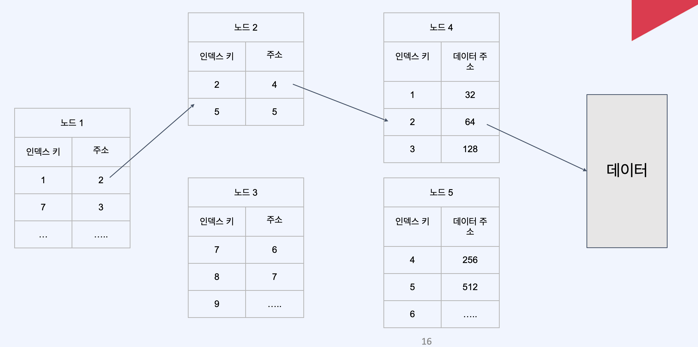
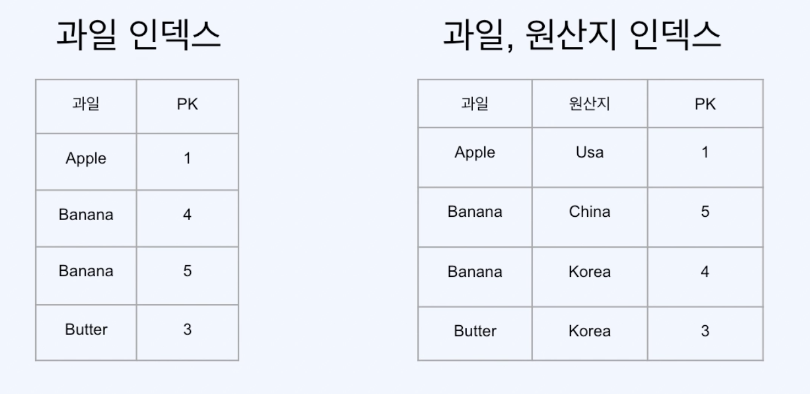

# Index

## 데이터베이스의 성능 핵심

|     | 메모리             | 디스크     |
|-----|-----------------|---------|
| 속도  | 빠름              | 느림      |
| 영속성 | 전원이 공급되지 않으면 휘발 | 영속성이 있음 |
| 가격  | 비쌈              | 저렴함     |

* 디스크는 메모리에 비해 훨씬 느리다.
* 결국 데이터베이스 성능에 핵심은 디스크 I/O을 초쇠화 하는 것

## 디스크 접근은 줄이는 방법

* 메모리에 올라온 데이터로 최대한 요청을 처리하는 것, 메모리 캐시 히트율을 높이는 것
* 심지어 쓰기도 곧 바로 디스크에 쓰지 않고 메모리에 쓴다.
* 메모리 데이터 유실을 고려해 WAL(Write Ahead Log)를 사용

### 랜덤 I/O VS 순차 I/O



* 램덤 I/O는 무작위로 데이터를 가져옴
* 순차 I/O는 연속된 데이터를 가져옴

대부분의 트랜잭션은 무작위하게 Write가 발생한다. 이를 지연시켜 랜덤 I/O 횟수를 줄이는 대신 순차적 I/O를 발생시켜 정합 성을 유지

[interactive_latency](https://colin-scott.github.io/personal_website/research/interactive_latency.html)

**결국 데이터베이스 성능에 핵심은 디스크의 랜덤 I/O을 초쇠화 하는 것**

## 인덱스의 기본 동작



* 인덱스는 정렬된 자료구조, 이를 통해 탁색범위를 초소화
* 데이터가 나이순으로 정렬되어 있어 하나만 조회하면 됨
* 인덱스도 테이블로, 인덱스를 생성하면 인덱스에 해당하는 인덱스로 정렬된 테이블이 생성된다.
* **인덱스의 핵심은 탐색(검색) 범위를 초소화 하는 하는 것**

## 인덱스 자료구조

### HashMap

* 단건 검색 속도 O(1)
* 그러나 범위 탐색인 O(N)
* 전방 일치 탐색 불가 ex) like 'AB%'

### List

* 정렬되지 않은 리스트의 탐색은 O(N)
* 정렬된 리스트의 탐색 O(logN)
* 정렬되지 않은 리스트의 정렬 시간 복잡도 O(N) ~ O(N * logN)
* 삽입 / 삭제 비용이 매우 높음

### Tree

* 트리 높이에 따라 시간 복잡도 결정됨
* 트리의 높이를 최소화 하는 것이 중요
* 한쪽으로 노드가 치우치지 않도록 균형을 잡아 주는 트리 사용
  * ex) Red-Black Tree, B+ Tree

### B+ Tree

[B+ Tree Visualization](https://www.cs.usfca.edu/~galles/visualization/BPlusTree.html)

* 산입 / 삭제시 항상 균형을 이룸
* 하나의 노드가 여러 개의 자식 노르르 가질 수 있음
* 리프노드에만 데이터가 존재
  * 연속적인 데이터 접근 시 유리



1. Cherry를 조회 조건으로 검색
2. 노드1(루트 노드)에서 Apple > Durian 즉, `A - C - D` 정렬되어 있기 때문에 A의 주소2 노드(브랜치 노드) 탐색
3. 주소2 노드(브랜치 노드)에서 Carrot의 (C로 시작하는 노드) 주소 5를 탐색
4. 노드5(리프 노드)에서 C로 시작하는 데이터중에 Cherry를 탐색 하여 PK 5를 탐색
5. PK 인덱스 테이블(인덱스를 생성하면 테이블이 생성되며 기본이되는 PK도 인덱스 이기 때문에 테이블이 생성)에 데이터 조회
6. PK 인덱스에서 데이터를 실제 조회

**MySQL에서는 PK 설정이 중요하다. PK 사이즈가 커지게 되면 하나의 노드에서 가질 수 있는 데이터의 개수가 제한적이 된다. 노드의 개수가 적어지면 B+ Tree의 리벨런싱이 자주 일어나게 되기 때문에 성능에 지장을 준다.**

B+Tree 방식의 인덱스에 대한 데이터를 추가하고, 삭제 및 수정을 하는 경우 트리 리벨런싱이 발생할 수도 있기 때문에 READ 비용이 절약되지면 Update, Delete의 기능에 대한 성능의 손실이 발생 한다.

## 클러스터 인덱스

* 클러스터 인덱스는 데이터 위치를 결정하는 키 값이다.
* MySQL의 PK는 클러스터 인덱스다.
* MySQL의 PK를 제외한 모든 인덱스는 PK를 가지고 있다.

| 클러스터 키 | 데이터 주소 |
|--------|--------|
| 1      | A      |
| 2      | B      |
| 3      | C      |
| 5      | D      |

* 클러스터 키 4번이 insert

| 클러스터 키 | 데이터 주소 |
|--------|--------|
| 1      | A      |
| 2      | B      |
| 3      | C      |
| 4      | D      |
| 5      | F      |

* 3-5번 사이에 4가 insert 되고 데이터 주소는 한 칸씩 밀리게 된다.
* 클러스터키는 정렬된 자료구조이고(인덱스와 동일), 클러스터 위치에 따라 데이터 주소가 결정된다.
* 클러스터 키 순서에 따라서 데이터 저장 위치가 변경되기 때문에 클러스터 키 삽입/갱신시에 성능이슈 발생
* PK 순서에 따라 데이터 저장 위치가 변경된다. PK 키 산입/갱신시에 성능이슈가 발생한다.
* MySQL에서 PK를 제외한 모든 인덱스는 PK를 가지는 구조이기 때문에 PK의 사이즈가 인덱스의 사이즈를 결정하게 된다.
* PK가 클러스터 인덱스이기 때문에 PK가 Insert 되거나 Update 되는 경우 데이터 주소가 변경되기 때문에 인덱스는 PK를 들고 있고 PK의 데이터 위치가 변경될때 인덱스는 계속 PK를 들고 있기 때문에 영향도를 없을 수 있다.
* 세컨더리 인덱스만으로 데이터를 찾아 갈 수 없고, PK 인덱스를 항상 검색해야 함 (인덱스가 가지고 있는건 데이터의 주소가 아니라 PK 값이기 때문에)

### PK 인덱스의 장점

* PK를 활용한 검색이 빠름, 특히 범위 검색
* 세컨더리 인덱스들이 PK를 가지고 있어 커버링에 유리

### 클러스터 인덱스 데이터 탐색 과정

#### 세컨더리(보조) 인덱스 탐색 과정



1. Cherry를 조회 조건으로 검색
2. 노드1(루트 노드)에서 Apple > Durian 즉, `A - C - D` 정렬되어 있기 때문에 A의 주소2 노드(브랜치 노드) 탐색
3. 주소2 노드(브랜치 노드)에서 Carrot의 (C로 시작하는 노드) 주소 5를 탐색
4. 노드5(리프 노드)에서 C로 시작하는 데이터중에 Cherry를 탐색 하여 PK 5를 탐색
5. PK 인덱스 테이블(인덱스를 생성하면 테이블이 생성되며 기본이되는 PK도 인덱스 이기 때문에 테이블이 생성)에 데이터 조회
6. PK 인덱스에서 데이터를 실제 조회

#### 클러스터 인덱스 탐색 과정



1. 인덱스 탐색 과정에서 Cherry의 PK를 2번으로 탐색 완료
2. 노드1(루트 노드)에서 PK가 2이기 때문에 1-7에 해당하기 때문에 인덱스 키 1의 주소 2로 이동
3. 노드2(브랜치 노드)에서 바로 주소4 으로 탐색
4. 노드4(리프 노드)에서 실제 데이터주소 64를 탐색하여 실제 데이터를 탐색 완료

**세컨더리(보조) 인덱스는 항상 PK 인덱스를 거쳐 실제 데이터를 탐색하기 때문에 세컨더리(보조) 인덱스는 항상 PK를 가지고 있음(실제 데이터 주소는 클러스터 인덱스에서 가짐)**

#### 인덱스 구조


### 클러스터 인덱스 요약

1. **클러스터 인덱스는 데이터 위츠를 결정하는 키 값이다.**
2. **MySQL의 PK는 클러스터 인덱스다.**
3. **MySQL에서 PK를 제외한 모든 인덱스는 PK를 가지고 있다.**

## 인덱스를 다룰 때 주의 해야할점

* 인덱스 필드 가공
* 복합 인덱스
* 하나의 쿼리에는 하나의 인덱스만

### 인덱스 필드 가공

```sql
-- age int type
select *
from member
where age * 10 = 1 -- (1)
    where age = '1' -- (2)
```

* (1) age에 * 10 연산이 들어가기 때문에 인덱스를 측정할 수 없음
* (2) 타입이 다르기 때문에 인덱스를 인덱스를 타지못함, age에 toString을 진행하기 때문에 B+Tree 인덱스를 타지못함
* 인덱스 필드에 가공 처리를 하면 인덱스를 타지못하는 경우가 있기 때문에 조심해야함

### 복합 인덱스



* 복합 인덱스에는 선두 컬럼(과일, 원산지 경우 선두에 이쓴ㄴ 과일)이 중요함
* 볻합인덱스는 과일 기준으(선두)로 인덱스를 정렬하고 과일 값이 동일한 경우 원산지로 추가 정렬
* 이 경우 과일 + 원산지 조회, 과일 조회는 인덱스를 태워 빠른 조회가 가능하나, 원산지만을 기준으로 인덱스를 타는 경우는 이 복합 인덱스를 타지 못함, 원산지에대한 조회만 필요한 경우 원산지 인덱스를 따로 둬야함

### 하나의 쿼리에는 하나의 인덱스만

* 하나의 쿼리에는 하나의 인덱스만 탄다. 여러 인덱스 테이블을 동시에 탐색하지 않음 (index merge hint를 사용하면 가능)
* 즉, 조회 조건이 여러개더라도 인덱스를 태울수 있는 키는 1개이다 (복합 인덱스 경우 필드개 n개로 보이지만 실제 인덱스의 키는 1개이기 때문에 1개로 봐야함)

### 마지막으로

* 의도대로 인덱스가 동작하지 않을 수 있기 때문에 explain으로 확인 필요
* 인덱스도 비용이다. 쓰기를 희생하고 조회를 얻는 것, 모든 것은 트레이드오프이다.
* 꼭 인덱스로만 해결할 수 있는 문제인가?