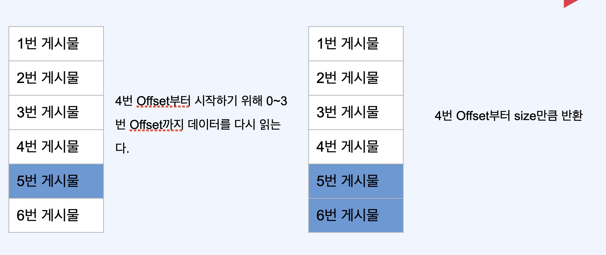
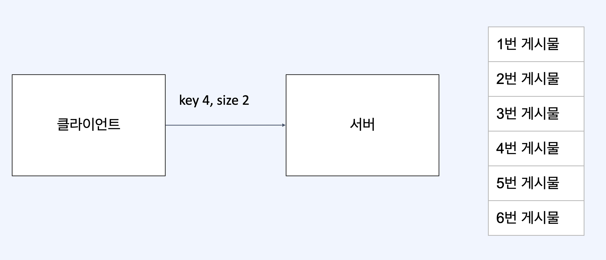
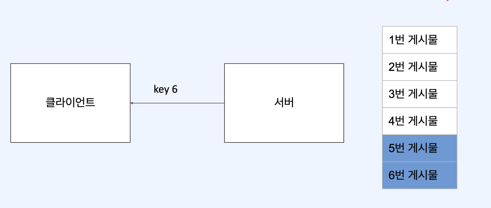
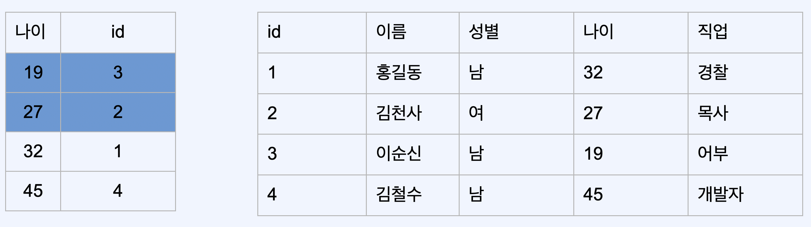

# 페이지네이션 최적화

## 페이지네이션



* 4번 offset 부터 시작하기 위해 0~3번 offset까지 데이터를 익는다.
* 4번 offset 에서 size만큼 반환
* 불필요한 데이터를 계속 읽어야 함

## 커거 기반 페이징



* 클라이언트에서 key, size를 서버로 전달



* 서버에서는 4번 데이터를 바로 읽어서 내려줌
* 서버는 클라이언트에 다시 다음 키 값을 줌
* 커서 기반 페이징은 전체 데이터를 조회 하지 않기 때문에 UI 구현이 어려움

```sql
select *
from post
where member_id = 4
  and id > ? limit ?
```

## 커버링 인덱스

* 검색조건이 인덱스에 부합한다면, 테이블에 바로 접근 하는 것보다 인덱스를 통해 접근하는 것이 매우 빠르다.
* 테이블에 접근하지 않고 인덱스로만 데이터 응답을 내려줄 순 없을까?

```sql
select 나이, id
from 회원
where 나이 < 30
```



* 인덱스에 사용하는 필드만 slice 해서 가져오면 인덱스 테이블의 정보만으로 데이터 조회가 가능하다. 이 것을 커버링 인덱스라 한다.
* 커버링 인덱스를 통해 데이터를 가져오게 되면 실제 세컨더리 인덱스를 기반으로 PK 값으로 다시 클러스터에 있는 실제 데이터의 주소까지 조회할 필요가 없기 때문에 성능적으로 이점이 있다.
* 세컨더리 인덱스를 통해 클러스터 인덱스에 접근하게 되면 I/O 작업이 랜덤 읽기로 전환 되기 때문에 더 큰 비용이 발생한다. 반면 세컨더리 인덱스를 톨해 접근하는 경우 이미 정렬이 되어있기 때문에 순차 I/O가 발생하여 더 큰 성능상의 차이가 발생한다. 즉, MySQL에서 PK는 클러스터 인덱스이기 대문에 커버링 인덱스에 유리
* 커버링 인덱스로 페이지네이션이 최적화가 가능하다.

```sql
with 커버링 as (select id
                        form 회원
where 나이
    < 30
    limit 2
    )

select 이름
from 회원
         inner join 커버링 on 회원.id = 커버링.id
```
* order by, offset, limit 절로 인한 불필요한 데이터블록 접근을 커버링 인덱스를 통해 최소화