> 해당 글은 [Real MySQL 개발자와 DBA를 위한](http://www.yes24.com/Product/Goods/6960931)을 정리한 내용입니다.

# 02 설치와 설정

## 서버 설정

### my.conf 설정 파일

#### server-id
MySQL이 내부적으로 자기 자신을 식별하는 아이디 값이다. 일반적으로 1보다 큰 정수 값을 설정하는데 하나의 복제 그룹 내에서 유일한 값이기만 하면 된다.

#### user
MySQL이 설치된 서버의 운영체제 계정을 입력한다. MySQL 서버는 입력된 운영체제 계정으로 MySQL 인스턴스를 실행한다. 일반적으로 MySQL 서버는 운영챠제의 관리자 계정으로 실행하지 않는 것이 좋은데 이는 MySQL 서버가 원격으로 해킹을 당하는 피해를 최소화 하기 위함이다.

#### basedir
MySQL 서버의 홈 디렉토리를 명시한다. `my.cnf` 설정 파일에서 여러 가지 용도의 파일에 대해 경로를 명시하게 되는ㄴ데, 특별히 절대 경로가 사용되지 않고 상대 경로나 파일명만 명시되는 경우 여기에 설정된 값이 기본 디렉터리가 된다.

#### datadir
MyISAM의 데이터 파일이 저장되는 디렉터리다. InnoDB 이외의 데이터 디레ㄱ터리를 저장하지 않는 스토리지 엔진은 이디렉터리가 데이터 디렉터리가 된다. InnoDB는 별도의 파라미터를 통해 데이터 파일의 경로를 지정한다.

#### tempdir
MySQL 서버버는 정렬이나 그룹핑과 같은 처리를 위해 내부적으로 임시 테이블을 생성한다. `temdir`은 내부 임시 테이블의 데이터 파일이 저장되는 위치이며, 이 디렉터리에 생성되는 데이터 파일은 쿼리가 종료되면 자동으로 삭제된다. 내부 임시 테이블은 사용자가 `CREATE TEMPORARY TABLE`로 생성하는 임시 테이블과는 성격이 다르며, 사용자의 의도와는 관계없이 MySQL이 내부적으로 필요에 의해 생성하는 임시 테이블을 의미한다.

#### character-ser-server, collation-server
MySQL 서버의 기본 문자집합을 설정한다. 별도의 DB나 테이블 또는 칼럼에서 사용할 문자집합을 재정의 하지 않으면 이 문자집합이 사용된다.

#### default-storage-engine
MySQL 서버 내애세 기본적으로 사용할 스토리 엔진을 정의한다. 

#### skip-name-resolve
클라이언트가 MySQL 서버에 접속하면 MySQL 서버는 해당 클라이언트가 접속 허용된 사용자인지 확인하기 위해 클라리언트의 IP주소를 이용해 역으로 DNS명을 가져와야 하는데, 이러한 작업은 생각보다 시간이 걸리는 작업이다. 이 옵션을 지정하면 빠른 접속을 위해 이러한 역 DNS 검색을 하지 않는다.

#### event-scheduler

#### sysdata-is-now

#### back_log
수많은 클라잉너트가 한꺼번에 MySQL 서버로 접속을 시도하면 MySQL 서버의 인증을 거칠 때까지 기디라게 되는데, 이때 몇 개까지의 커넥션을 대기 큐에 담아 둘지 결정하는 설정이다.

#### max_connections
MySQL 서버가 쵀대 허용할 수 있는 클라이언트 연결 수를 제안하는 설정이다. `max_connections` 설정은 동적으로 변경할 수 있으므로 커넥션이 부족하다면 그때 그때 변경해 주면 된다. 어떤 웹 서버가 20대라면 한 서버당 커넥션이 100개씩 이라고 해도 2000의 커넥션이 필요하다. 커넥션 풀에서도 적절한 커넥션 개수의 설정이 중요하다. MySQL 서버의 `max_connections` 설정은 이러한 위험을 막는 최후의 보루라는 점을 기억해야 한다.

#### thread_chace_size
MySQL 서버에서 스레드와 커넥션은 거의 같은 의미로 사용되곤 하지만 사실 **커넥션은 클라이언트와 서버의 연결 그자체를 의미하며, 스레드는 해당 커넥션으로 부터 오는 작업 요청을 처리하는 주체다.** 최초 클라이언트로 부터 접속 요청이 오면 MySQL 서버는 스레드를 준비해 그 커넥션에 작업 요청을 처리 줄 스레드를 매핑하는 형태이다.

**아무리 스레드가 경량이라 하더라도 생성하는 데는 시간과 CPU 처리가 필요하기 때문에 커넥션이 종료되어 불필요해진 스레드를 MySQL 서버는 그냥 제거하지 않고 스레드 풀(커넥션 풀과 동일한 개념)에 저장해 뒀다가 새로운 접속 요청이 오면 해당 커넥션에 스레드를 할당할 수 있게 보관한다.** `thread_chace_size` 설정 변수는 최대 몇 개까지의 스레드를 스레드 풀에 보관할지 결정한다.

요즘 웹 서버나 애플리케이션 서버는 커넥션 풀을 유지하기 때문에 한꺼번에 대량의 커넥션 요청이 발생하지는 않을것이다. 따라서 해당 값을 크게 유지할 필요는 없을 것으로 보인다. **MySQL 서버가 스레드를 캐시해 두려면 메모리가 필요하기 때문에 가능하다면 이 값을 크게 늘리는 것보다는 클라이언트 프로그램이 커넥션 풀을 사용할 수 있게 개발하는 것이 좋다.**

#### wait_timeout
MySQL 서버에 연결돤 클라이언트가 `wait_timeout`에 지정된 시간 동안 아무런 요청이 없이 대기하는 경우 MySQL 서버는 해당 커넥션을 강제료 종료해 버린다. 이 설정값은 `28800 sec`(8시간)이다. 만약 MySQL 서버 앞쪽에 L4와 같은 로드 밸런스용 장비가 있다면 그러한 장비의 `idle-timeout`도 반드시 확인해 안정적인 커넥션이 유지되느지 확인 해야한다. 이러한 네트워크의 불안정이나 예상 외의 `timeout` 시간과 관련해서는 운영체제의 `keep-alive` 설정 등도 함께 확인하는 것이 좋다.

> KeepAlive란?
> 네트워크를 통해 만들어진 TCP 커넥션을 계속 유효한 상태(살아 있게)로 유지하는 것을 의미 하는데, MySQL 서버의 커넥션도 TCP 기반이므로 운영체제의 KeepAlive 관리 대상이 된다. 운영체제에서는 커넥션이 유효한지 확인 하기 위해 원격지의 컴퓨터와 체크 메시지(HeartBeat과 같은)를 주고받는데, 이 과정을 KeepAlive 프로브 라고한다. 
> 일반적인 운영체제는 TCP 커넥션에 대해 얼마만큼의 시간 간격을 두고 KeepAlive 프로브를 실행할지, 그리고 KeepAlive 프로브가 몇번 연속 실패했을 때 해당 커넥션을 종료시킬지 등을 설정할 수 있다. 특히 MySQL 서버가 L4와 같이 사용되는 경우에는 L4에 설정된 타임아웃 시간보다 MySQL 서버가 설치된 운영체제의 KeepAlive 프로브 간경을 더 낮게 설정해주는 것이 좋다.

#### max_allowed_packet
네트워크 문제나 MySQL 서버 또는 클라이언트의 버그로 인해 잘못된 패킷이 MySQL 서버로 전달될 경우 MySQL 서버에 심각한 문제를 일으킬 수 있다. 이러한 문제점을 없애고자 MySQL 서버는 모든 클라이언트의 패킷이 `max_allowed_packet` 설정값에 지정된 크기 이하일 것으로 간주하고 처리한다. 만약 `max_allowed_packet`이 32MB로 설정된 서버에서 실행해야 할 쿼리 문장이 그 이상이 되는 경우에는 이 값을 더 큰 값으로 변경해야 한다. 이러한 문제는 `BLOB`, `TEXT` 타입의 칼럼에 상당히 큰 데이터를 지정해야하는 경우에 주로 발생한다.

**MySQL 서버와 통신 할때 클라이언트가 MySQL 서버로 쿼리 요청을 보내는 경우에는 무조건 하나의 패킷만 사용할 수있으며, 쿼리의 실행 결과는 여러 개의 패킷으로 나눠서 전달받게 된다. 그래서 이 설정값은 클라이언트가 서버로 요청하는 쿼리 문장의 길이보다 큰 값으로만 설정하기만 하면 된다.**

#### max_heap_table_size
메모리 스토리 엔진을 사용한 메모리 테이블은 힙 테이블이라고도 하기 때문에 변수의 이름에 `head_table` 이란 단어가 사용된 것이다. 만약 빠른 처리를 위해 메모리 테이블을 사용한다면 값을 그에 맞게 적절히 변경하는 편이 좋다. 여기서 메모리 테이블이라 함은 사용자가 스토리지 엔진을 Memory로 지정해 CREATE TABLE로 생성한 테이블뿐만 아니라 MySQL이 사용자의 쿼리를 처리하기 위해 내부적으로 생성하는 임시 테이블로 포함된다.

#### sort_buffer_size
MySQL에서 인덱스를 이용하거나 별도의 메모리 디스크 공간에 결과를 저장해 정렬을 수행할 수 있다. 인덱스를 이용하는 경우는 정렬된 상태로 저장된 인덱스를 순서대로 읽기만 하는 것을의미하며, 실제 정렬 알고리즘이 실행되는 것이 아니라서 당당히 빠르게 처리 된다.

일반적인 DBMS에서 가증 큰 부하를 일으키는 사용자 요청이 정렬(순수한 정렬이나 그룹핑 작업으로 인한) 작업인데, `sort_buffer_size`는 인덱스를 사용 없는 정렬에 메모리 공간을 얼마나 할당할지 결정하는 설정값이다.

#### join_buffer_size
조인 버퍼는 MySQL에서 조인이 발생할 때마다 사용되는 버퍼가 아니다. 적절한 조인 조건이 없어서 드리븐 테이블의 검색이 풀 테이블 스캔으로 유도되는 경우에 조인 버퍼가 사용된다. 일반적으로 이런 경우에는 `Using join buffer`라는 내용이 실혱 계획에 표시된다. 


#### read_buffer_size

#### read_rnd_buffer_szie

#### sort_buffer_szie, join_buffer_size, read_buffer_szie, rnd_buffer_szie

#### query_cache_szie, query_cache_limit

#### group_concat_max_len
MySQL에서는 `GROUP_CONCAT()` 이라는 함수로 `GROUP BY`된 레코드의 특정 칼럼 값이나 표현식을 구분자로 연결해 가져오는 경우 아땨 아 겂으로 지정된 ㅋ기 이상의 연결은 불가능하다. 이 버퍼 또한 세션 단위의 버퍼이므로 주의해서 적절한 값으로 설정해야한다.

#### transcation-isolation
트랜잭션의 격리 수준을 설정하는 설정 값으로 기본 값은 `REPEATABLE-READ`다.

#### innodb_buffer_pool_size
InnoDB 스토리 엔진에서 가장 중요한 옵션이다. InnoDB 스토리지 엔진의 버퍼풀 디스크의 데이터를 메모리에 캐싱함과 동시에 데이터의 변경을 버퍼링하는 역할을 수행한다. 일반적으로 innodb_buffer_pool_szie는 운영체제나 MySQL 클라이언트에 대한 서버 스레드가 사용할 메모리를 제외하고는 남는 거의 모든 메모리 공간을 설정한다.

하지만 이 예측치는 최대 사용 가능한 메모리 크기이므로 상당히 현실성이 떨어지며, 실제 사용하는 메모리는 쿼리의 특성에 따라 달라진다. 그래서 일반적으로 50 ~ 80% 까지 수준에서 inndb_buffer_pool_size를 설정한다.

#### innodb_additional_mem_pool_size

#### innodb_file_per_table
InnoDB 스토리지 엔진을 사용하는 테이블은 `*.ibd`라는 확장자로 생성되는데, 오라클과 같은 테이블 스페이스라는 개념을 사용한다. 오라클처럼 모든 테이블을 하나의 테이블 스페이스에 모아서 생성하는 방법도 가능하며,  테이블 단위로 테이블 스페이스를 할다하는 방법도 가능하다. 변수를 1로 설정하면 테이블 단위로 각각 1개씩 데이터 파일과 테이블 스페이스를 생성해 데이터를 지정한다. 0으로 설정되면 하나의 테이블 스페이스에 모든 테이블 데이터가 저장된다.

하나의 테이블 스페이스에 모든 테이블이 저장되는 경우에는 테이블이 삭제(DROP, TRUNSCATE)되어도 테이블 스페이스가 점유하던 공간을 운영체제로 반납하지 않는다, 하지만 테이블 단위의 테이블 데이터 파일과 테이블 스페이스가 할당되는 경우에는 해당 공건이 다시 반납되기 때문에 `innodb_file_per_table` 설정은 주로 1로 설정해서 사용한다.

#### innodb_data_home_dir

InnoDB 스토리 엔진을 사용하는 테이블에 대한 데이터 파일이 지정될 위치를 설정하는 옵션이다.

#### innodb_data_file_path
**InnoDB 에서 데이터는 크게 시스템 데이터와 사용자 데이터로 나눌 수 있다.** 시스템 데이터는 사용자가 생성한 각 테이블에 대한 메타 정보나 트랜잭션을 위한 Undo와 같은 InnoDB 스토리지 엔진이 임시적으로 만드러낸 것을 의미하며, 사용자 데이터는 일반적으로 SQL로 생성하고 변경하는 테이블의 데이터를 의미한다. 시스템 데이터는 항상 시스템 테이블 스페이스에 저장돠며, 시스템 테이블 스페이스는 `innodb_data_file_path`에 명시된 파일에 생성된다.

#### innodb_log_group_home_dir
**InnoDB와 같이 트랜잭션을 지원하는 RDBMS는 ACID 보장과 동시에 성능 향상을 목적으로 데이터의 변경 이력을 벼로의 파일에 순차적으로 기록 해두는데, 이를 `트랜잭션 로그` 또는 `Redo 로그`라고 한다.** 이 로그는 사람이 읽을 수 있는 로그가 아니라 MySQL 서버가 갑자기 종료됐거나 했을 때 이전의 잘못된 내용이나 종료되지 않은 트랜잭션을 InooDB 스토리지엔진이 다시 복구하기 위한 용로로 사용한다. 

#### innodb_log_buffer_size
**InooDB 스토리지 엔진에서 데이터가 변결될 때 해당 변경사항을 바로 리두 로그에 기록하면 디스크의 입출력 요청이 너무 빈번해지기 때문에 비효율적이다.** 이런 경우 메모리에 일시적으로 로그를 버퍼링하는데, 이때 사용할 버퍼의 크기를 설정하는 옵션이다. 이

#### innodb_log_file_size, innodb_log_files_in_group


#### innodb_lock_wait_timeout
InooDB에서 접근을 획득을 위해 최대한 대기할 수 있는 시간(초 단위)을 설정한다. 설정된 시간 동안 잠금을 기다리게 되며 InooDB 스토리지 엔진이 `Lock wait timeout exceed` 오류를 발생시키고 쿼리를 실패 처리하게된다. 이 오류가 발생했다 하더라도 트랜잭션 자체가 롤백되지 않기 때문에 다시 한번 쿼리를 실행하면 된다.

#### innodb_flush_log_at_trx_commit
**InooDB에서 트랜잭션이 커밋될 때마다 리두 로그를 디스크에 플러시할지 결정하는 옵션이다.** flush는 이러한 파일 동기화 함수를 호출한다는 것을 의미한다. 지금까지 프로그램을 작성하면서는  잘 느끄지 못핼 수도 있지만 작은 데이터를 상당히 빈번하게 디스크에 기록하는 시스템에서는 이 디시크 동기화 함수가 DBMS의 부하를 결정할 정도이다. **대부분의 RDBMS에서 병목은 디스크이며, 디스크의 병목을 일으키는 주원인은 빈번한 fsync(), fdatasyn() 시스템 콜이다.** 그렇다고 이 디스크 동기화가 불필요하다는 의미는 아니다. 디스크의 데이터를 동기화 하지 않으면 유사시에 사용자가 커밋한 데이터가 손실되거나 손상될 가능성이 있기 때문에 트랜잭션을 보장을 위해서 반드시 커밋할 때 디스크의 데이터를 동기화하는 것은 당연하다.

**하지만 만약 상당히 많은 양의 데이터를 처리하지만 데이터는 조금 손실돼도 무방한 DBMS라면 이 값을 0으로 설정해 디스크 입출력의 성능을 대폭 개선할 수 있다.** 물론 이 경우 운영체제에 문제가 있어 갑자기 다운되거나 한다면 4~5초 정도의 데이터는 손실될 수 있다. InnoDB 스토리지 엔진이 직접 디스크 동기화를 호출하지 않으면 **운영체제에서 적절한 시점에 데이터 동기화를 호출하는데, 이 시간이 대략 4~5초 정도다.**

#### innodb_flush_method
어떤 운영체제에서든 디스크에서 데이터를 쓰기 작업은 크게 `운영체제의 버퍼로 기록`하는 작업과 `버퍼의 내용을 디스크로 복사`하는 2단계로 나뉜다. 이 조합을 어떻게 하느냐에 따라 3 가지 관점으로 쓰기 방식을 나눠 볼 수 있다.

첫 번째로, 두 단계의 작업을 동시에 같이 실행하는 방식을 `동기(Sync) IO`라고 하며, 1단계와 2단계 작업을 각각 다른 시점에 실행하는 방식을 `비동기(Aynce) IO`라고 한다. 물론 Sync와 Async는 쓰기 함수의(커널 콜)이 언제 반환하는 지를 의미하기도 하지만 큰 맥락에서  보면 동일한 내용으로 이해하면 된다.

두 번째로, 데이터가 변경되면 그와 동시에 파일의 변경 일시와 같은 메타 정보도 함꼐 변경하는데, 이렇게 데이터와 파일의 메타데이터를 한꺼번에 변경하는 방식을 `fsync`라 하며, 파일의 메타 정보는 무시하고 순수하게 사용자의 데이터만 변경하는 방식을 `fdataasync`라고 한다.

세 번째로, 디스크 쓰기의 두 작업 중에서 `운영체제의 버퍼 기록`단계를 생략하고 바로 사용자의 데이터를 디스크로 쓰는 경우도 있는데, 이를 특별히 `다이렉트 IO`라고 한다.


#### innodb_old_locks_time

#### buffer_szie
InnoDB ㅡ토리지 엔진에서 가장 중요한 설정 값이 inno_db_buffer_pool_szie 라면 MyISAM 스토리지 엔진에서 가장 중요한 설정값은 key_buffer_size다. InnoDB의 버퍼 풀은 인덱스와 모든 데이터 페이지에 대해 캐시와 버퍼의 역할을 동시에 수행하지만 MyISAM의 키 버퍼는 주로 인덱스에 대해서만 캐시 역할을 한다. 


#### general_log, general_log_file
MySQL 에서는 DBMS 서버에서 실행되는 모든 쿼리를 로그 파일로 기록하는 기능이 있는데, 이 로그를 쿼리 로그 또는 제너럴 로그라고 한다. 5.1 버전 부터는 글로벌 동적 변수로 재기동 없이 언제든지 on, off 할 수 있다.


#### slow-query-log, long_query_time, slow_query_log_file
MySQL에서는 지정된 시간 이상으로 쿼리가 실행되는 경우 해당 쿼리를 별도의 로그로 파일로 남긴다, 이러한 로그를 슬로우 쿼리 로그라고 한다. 이 슬로우 쿼리는 어떤 쿼리를 가장 먼저 튜닝해야 할지를 알려준 중요한 자료 이기 때문에 반드시 활성화 하자. 해당 설정은 글로벌 설정으로 언제든지 키고 끌 수 있다.

#### log_slow_admin_statements
`ALTER TABLE...` 등과 같은 DDL 문장의 슬로우 쿼리 로그 기록 여부를 설정한다.

#### log-bin, max_binglog_size, expire_log_days
**MySQL에서 복제를 구축하면 반드시 바이너리 로그를 사용해야 한다. 바이너리 로그는 마스터 MySQL 서버에서만 기록하며, 슬레이브 MySQL 서버는 마스터에서 기록된 바이너리 로ㅓ그를 가져와서 재실행 하는 형태로 마스터 실르에브 간의 데이터를 동기화한다.** log-bing 옵션에는 바이너리 로그의 파일명(정확히는 바이너리 로그 파일의 Prefix를 설정)을 설정한다. `max_binglog_size`는 최대 바이너리 로그 파일의 크기를 제한하고, `expire_log_days`는 날짜 수를 입력하며, 7로 설정한 경우 일주일만 보관하고 이전 로그 파일을 모두 자동으로 삭제한다.

#### binlog_cache_size
바이너리 로그의 내용도 즉시 디스크에 기록되는 것이 아니라 메모리의 임시 공간에 잠깐 버퍼링 했다가 디스크로 기록한다. `binlog_cache_size`는 이 버퍼링용 메모리의 크기를 설정하는 변수이다. 특별히 SQL 문장이 길거나 대용량 칼럼에 대한 처리가 많지 않다면 56KB ~ 256KB가 적당하다. `binlog_cache_size`로 할당된느 메모리 공간도 커넥션별로 생성되므로, 너므 크게할당하지 않는 것이 좋다.


#### sync_binlog
**MySQL에서 성능 문제가 발생하는(특히 디스크 성능에서) 두 요소는 InnoDB 리두 로그의 동기화와 바이너리 로그의 동기화다.** 그중에서도 특히 바이너리 로그 동기화는 상당한 부히를 만들어 내는 편이다. MySQL에서 디스크로 부터 발생하는 읽기 부하는 주로 인덱스나 데이터 파일에서 발생하며, 쓰기 부하는 부하는 바이너리 로그와 리두 로그에서 발생한다.

MySQL이 복제로 구성된다고 하더라도 데이터 변경은 항상 마스터 MySQL 에서만 이뤄져야 하기 때문에 마스터 MySQL의 쓰기 부하를 분산할 수 있는 방법이 없다. 그런데 여기서 더해 마스터 MySQL에서는 바이너리 로그까지 기록해야하기 때문에 디스크 쓰기 부하가 더 커지는 것이다. **`synce_log` 옵션은 1로 설정될 경우 트랜잭션이 커밋될 때마다 바이너리 로그를 디스크에 플러시 한다. 그리고 0으로 설정하면 디스크에 기록은 하지만 MySQL 서버가 플러시를 하지 않기 때문에 운영체제의 버퍼까지만 기록하고 즉시 처리를 완료한다.(MySQL에서 플러시를 하지 않으면 대체로 4 ~ 5초 정도 간격으로 운영체제에서  자동으로 데이터를 플러시하게 된다.) 0이나 1이 아닌 양수를 설정하면 그 수만큼 트랜잭션을 모아 바이너리 로그를 디스크에 플러시 한다.**

이 값을 0으로 설정할지 1로 설정할지는 복제가 얼마나 중요한 역할을 하느냐에 따라 달라진다. 0으로 설정하면 MySQL 서버의 성능은 상당히 올라가겠지만 마스터 MySQL 서버가 다운되거나 장애가 발생했을 때 바이너리 로그가 손실되어 마스터와 슬레이브의 데이터가 달라질 사능성이 커진다. 하지만 1로 설정하면 바이너리 로그의 손실은 줄어 들지만 마스터 MySQL 서버의 서능이 떨어진다. 적절하게 선택해야한다.

#### relay-log, relay_log_purge
마스터 MySQL에서 바이너리 로그를 생한한다면 슬레이브 MySQL 에서는 마시터의 바이너리 로그를 일겅와 릴레이 로그라는 파일을 생성한다. 슬레이브 MySQL에서 `CHANGE MASTER` 명령어를 실행하면 슬레이브 MySQL은 기본 경로에 릴레이 로그를 생성하게 되는데, 이때 릴레이 로그의 경로를 변경하라면 `relay-log` 옵션으로 설정하면된다. `relay_log_purge` 옵션을 `true`로 설정하면 필요하지 않은 오래된 릴레이 로그를 자동으로 삭제하게 된다.


#### log-slave-updates
relay_log_purge 서버 복제 구성에서 하나의 relay_log_purge 서버가 슬레이브면서 동시에 마스터가 될 수 있다. 이러한 경우에는 다른 마스터로 부터 바이너리 로그를 가져와서 재실행되는 쿼리가 자기 자신의 바이너리 로그에 기록되게할지 여부를 결정하는 옵션이다.

#### read_only
일반적인 웹 서비스와 같은 relay_log_purge 복제가 사용되는 경우, 데이터의 변경은 마스터 MySQL에서 실행하고, 단순히 조회하는 트랜잭션은 슬레이브 장비에서 실행하게 된다. 이처럼 복제가 구성된 복제가 구성된 상태에서 슬레이브의 데이터가 마스터와 관계없이 변경되면 서로 충돌할 수 있기 때문에 MySQL 서버는 읽기 전용으로 만드는 것이 일반적이다. 이때 사용하는 설정 변수가 `read_only` 옵션이다. 글로벌 동적 변수라서 필요한 경우 SET 명령어로 지정할 수 있다.


### client 설정 그룹

## Mysql 서버의 시작과 종료

```
$ /etc/init.d/mysql start
$ /etc/init.d/mysql stop
```

## MySQL 복제 구축

### 설정 준비
MySQL 복제를 구축하려면 복제 그룹 내에 속한 각 MySQL 서버가 중복되지 않은 server-id 값을 가지고 있어야 한다. 또 마스터 MySQL 서버는 반드시 바이너리 로그가 활성화돼 있어야 한다. 

#### 복제 계정 준비
슬레이브 MySQL이 마스터로 부터 바이너리 로그를 가져오려면 마스터 MySQL 서버에 접속해 로그인 해야하느데. 이때 슬레이브가 사용할 계정을 복제용 계정이라 한다. 복제용 계정은 MySQL에 미리 준비돼 있어야 하며, 이 계정은 반드시 `REPLICATION SLAVE` 권한을 가지고 있어야 한다.

# 03 아키텍처


## MySQL 엔진
MySQL 엔진은 클라이언트로부터의 접속 및 쿼리 요청을 처리하는 커넥션 핸들러와 SQL 파서 및 전처리기, 그리고 쿼리의 최적화된 실행을 위한 옵티마이저가 중심을 이룬다. 그리고 성능 향상을 위해 MylSAM의 키 캐시나 InnoDB의 버퍼 풀과 같은 보조 저장소 기능이 포함돼 있다. 또한 MySQL은 표준 SQL(ANSI SQL-92) 문법을 지원하기 때문에 표준 문법에 따라 작성된 쿼리는 타 DBMS와 호환되어 실행될 수 있다.

## 스토리지 엔진
MySQL 엔진은 요청된 SQL 문장을 분석하거나 최적화하는 등 DBMS의 두뇌에 해당하는 처리를 수행하고, 실제 데이터를 디스크 스토리지에 저장하가너 디스크 스토리지로부터 데이터를 읽어오는 부분을 스토리지 엔진이 전담한다. MySQL 서버에서 MySQL 엔진은 하나지만 스토리 엔진은 여러 개를 동시에 사용할 수 있다. 

### MySQL 스레딩 구조


MySQL 서버는 프로세스 기반이 아니라 스레드 기반으로 동작하며, 크게 포그라운드 스레드외, 백그라운드 스레드로 구분할 수 있다.

#### 포그라운드 스레드 (클라이언트 스레드)
포그라운드 스레드는 최소한 MySQL 서버에 접속된 클라이언트 수만큼 존재하며, 주로 각 클라이언트 사용자가 요청하는 쿼리 문장을 처리하는 임무다. **클라이언트 사용자가 작업을 마치고 커넥션을 종료하면, 해당 커넥션을 담당하던 스레드는 다시 스레드 캐시로 되돌아 간다. 이때 이미 스레드에 캐시에 일정 개수 이상의 대기중인 스레드가 있다면 스레드 캐시에 넣지 않고 스레드를 종료시켜 일정 개수의 스레드만 스레드 캐시에 존재한다.** 이렇게 스레드의 개수를 일정하게 유지하게 만들어주는 파라미터가 `thread_cache_size` 이다.

포그라운드 스레드는 데이터를 MySQL의 데이터 버퍼나 캐시러 부터 가져오며, 버퍼나 캐시에 없는 경우엔느 직접 디스크의 데이터나 인덱스 파일러부터 데이터를 읽어와서 작업을 처리한다. MyISAM 테이블의 디스크 쓰기 작업까지 포그라운드 스레드가 처리하지만, InnoDB 테이블은 데이터 버퍼나 캐시까지만 포그라운드 스레드가 처리하고, 나머지 버퍼로부터 디스크까지 기록하는 작업은 백그라운드 스레드가 처리한다.

#### 백그라운드 스레드
MyISAM의 경우는 별로 해당 사항이 없는 부분이지만 InnoDB는 여러 가지 작업이 백그라운드 처리딘다. 대표적으로 인서트 버퍼(Insert Buffer)를 병합 하는 스레드, 로그를 디스크로부터 기록하는 스레드, InnoDB 버퍼 풀의 데이터를 디스크에 기록하는 스레드데이터를 버퍼로 읽어들이는 스레드, 그리고 기타 여러 가지 잠금이나 데드락을 모니터링하는 스레드가 있다. 이런한 모든 스레드를 총괄하는 메인 스레드도 있다.

SQL 처리 도중 데이터의 쓰기 작업은(버퍼링)되어 처리될 수 있지만 데이터의 읽기 작업은 절대 지연될 수 없다.(사용자가 SELECT 쿼리를 실행 했는데, "요청된 SELECT는 10분 뒤에 결과를 돌려주겠다" 라고 응답을 보내는 DBMS는 없다) 그래서 일반적인 사용 DBMS에는 대부분 쓰기 작업을 버퍼링해서 일괄 처리하는 기능이 참재돼 있으며 InnoDB 또한 이러한 방식으로 처리한다. 하지만 MyISAM은 그렇지 않고 사용자 스레드가 쓰기 작업까지 함께 처리하도록 설계돼 있다. 이러한 이유로 **InnoDB에서는 INSERT, UPDATE, DELETE 쿼리로 데이터가 변경되는 경우, 데이터가 디스크의 데이터파일로 완전히 저장될 때까지 기다리지 않아도 된다.** 하지만 MyISAM에서 일반적인 쿼리는 쓰기 버퍼링 기능을 사용할 수 없다.

### 메모리 할당 및 사용 구조


MySQL에서 사용되는 메모리 공간은 크게 글로벌 메모리 영역과 로컬 메모리 영역으로 구분할 수 있다. 글로벌 메모리 영역의 모든 메모리 공간은 MySQL 서버가 시작되면서 무조건 운영체제로부터 할당 된다. 운영체제의 종류에 따라 다르겠지만 요청된 메모리 공간을 100% 할당해줄 수 있고. 그 공간 만큼 예약해두고 필요할 때 조금씩 할당해주는 경우도 있다. 각 운영체제의 메모리 할당 방식은 상당히 복잡하며, MySQL 서버가 사용하고 있는 정확한 메모리 양을 측정하는 것 또한 쉽지 않다. 그냥 단순하게 MySQL의 파라미터로 설정해 둔 만큼 운영체제로부터 메모리를 할당받는 다고 생각하는 것이 좋을 듯 하다. 글로벌 메모리 영역과 로컬 메모리 영억의 처이는 MySQL 서버 내에 존재하는 많은 스레드가 공유해서 사용하는 공간인지 아닌지에 따라 구분되며 각각 다음과 같은 특성이 있다.

#### 글로벌 메모리 영역
일반적으로 클라이언트 스레드의 수와 무관하게 일반적으로 하나의 메모리 공간만 할당된다. 단 필요에 따라 2개 이상의 메모리 공간을 할당받을 수도 있지만 클라이언트의 스레드 수와 무관하며, 생성된 글로벌 영역이 N개라 하더라도 모든 스레드에 의해 공유된다.

#### 로컬 메모리 영역(세션 메모리 영역)
세션 메모리 영역이라고도 표현하며, MySQL 서버상에 존재하는 클라이언트 스레드가 쿼리를 처리하는데 사용되는 메모리 영역이다. 대표적으로 위 그림에 커넥션 버퍼와 정렬 버퍼 등이 있다. 클라이언트가 MySQL 서버에 접속하면 MySQL 서버에는 클라이언트 커넥션으로부터 요청을 처리하기 위해 스레드를 하나씩 할당하게 되는데, 클라이언트 스레드가 사용하는 메모리 공간이리고 해서 클라이언트 메모리 역영이라고도한다. 클라이언트와 MySQL 서버와의 커넥션을 세션이라고 하기 때문에 로컬 메모리 영역을 세션 메모리 영역이라고도 한다.

로컬 메모리는 각 클라이언트 스레드별로 독립적으로 할당되며 절대 공유되어 사용되지 않는다는 특징이 있다. 일반적을 글로벌 메모리 영역의 크기는 주의해서 설정하지만 소트 버퍼와 같은 로컬 메모로 여역은 크게 신경쓰지 않고 설정하는데, 최악의 경우에는 MySQL 서버가 메모리 부족으로 멈춰 버릴 수도 있으므로 적절한 메모리 공간을 설정하는 것이 중요하다. 로칼 메모로 공간의 또 한 가지 중요한 특징은 각 쿼리의 용도별로 필요할때만 공간이 할당되고 필요하지 않는 경우 MySQL이 메모리 공간을 할당조차 하지 않을 수도 있다는 점이다. 대표적으로 소트 버퍼나 조인 버퍼와 같은 공간이 그러하다. 그리고 로컬 메모리 공간은 커넥션이 열러 있는 동안 계속 할당된 상태로 남아 있는 공간도 있고 그렇지 않고 쿼리를 실행하는 순간에만 할당했다가 다시 해제하는 공간도 있다.

### 플러그인 스토리지 엔진 모델
MySQL의 독특한 구조 중 대표적인 것이 바로 플러그인 모델이다. 플러그인해서 사용할 수있는 것이 스토리지 엔진만 가능한 것이 아니다. MySQL은 기본적으로 많은 스토리 엔진을 가지고 있다. 다른 전문 개발회사 또는 여러분들이 직접 스토리지 엔진을 제작하는 것도 가능하다.

MySQL에서 쿼리가 실행되는 과정을 크게 나눈 다면 대부분의 작업은 MySQL 엔진에서 처리되고 마지막 `데이터 읽기/쓰기` 작업만 스토리지 엔진에 의해 처리 된다.

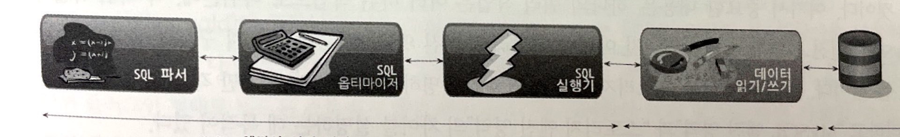

**MySQL 엔진이 각 스토리지 엔진에게 데이터를 읽어오거나 저장하도록 명령하려면 핸들러 꼭 통해야 한다.** MySQL에서 MyISAM, InnoDB와 같이 다른 스토리지 엔진을 사용하는 테이블에 대해 쿼리를 실행하더라도 MySQL의 처리 내용은 대부분 동일하며, **단순히 `데이터 읽기/쓰기` 영역의 처리만 차이가 있을 뿐이다. 실질적인 GROUP_BY나, ORDER_BY 등 많은 복잡한 처리는 스토리지 엔진 영역이 아니라 MySQL 엔진의 처리 영역인 `쿼리 실행기`에서 처리한다.**


### 쿼리 실행 구조

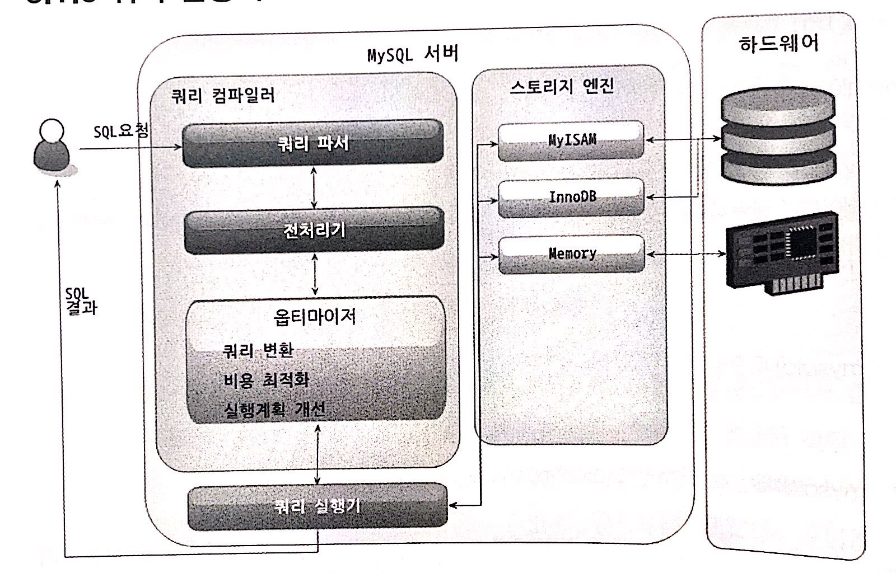

#### 파서
파서는 사용자 요청으로 들어온 쿼리 문장을 토큰(MySQL이 인식할 수 있는 최소 단위의 어휘나 기호) 등으로 분리해 트리 형태의 구조로 만들어 내는 작업을 의마한다. **쿼리 문장의 기본 문법 오류는 이 과정에서 발견되며 사용자에게 오류 메시지를 전달하게 된다.**

#### 전처리기
파서 과정에서 만들어진 파서 트리를 기반으로 쿼리 문장에서 구조적인 문제점이 있는지 확인한다. 각 토큰을 테이블 이름이나 칼럼 이름 또는 내장 함수와 같은 객체를 매핑해 해당 객체의 존재 여부와 객체의 접근권한 등을 확인하는 과정을 이 단계에서 수행한다. **실제 존재하지 않거나 권한상 사용할 수 없는 객체의 토큰은 이 단계에서 걸러진다.**

#### 옵티마이저
옵티마이저란 사용자의 요청으로 들어온 쿼리 문자을 저려한 비용으로 가장 빠르게처리할지 결정하는 역할을 담당하는데, DBMS의 두뇌에 해당한다고 볼 수 있다. 이 책에서 이야기 하고자하는 내용은 대부분 옵티마이저가 선택하는 내용을 설명하는 것이며, 어떻게 하면 옵티마이저가 더 나은 선택을 할 수 있데 유도하는 가를 알려주는 것이라도 생각해도 될 정도로 옵티마이저의 역할은 중요하고 영향 범위 또한 아주 넓다.

#### 실행 엔진
옵티마이저가 두뇌라면 실행 엔진과 헨들러는 손과 발에 비유할 수 있다. 실행 엔진이 하는 일을 더 쉽게 이해할 수 있게 간단하게 예를 들어서 옵티마이저가 GROUP BY를 처리하기 위한 임시 테이블을 사용하기로 결정했다고 해보자

1. 실행 엔진은 핸들러에게 임시 테이블을 만들라고 요청
2. 다시 실행 엔진은 WHERE 절에 일치하는 레코드를 읽어오라고 핸들러에게 요청
3. 읽어온 레코드들은 1번에 준비한 임시 테이블로 저장하라고 다시 핸들러에게 요청
4. 데이터가 준비된 임시 테이블에서 필요한 방식으로 데이터를 일거 오라고 핸들레에게 다시 요청
5. 최종적으로 실행 엔진은 결과를 사용자나 다른 모듈로 넘김

즉, 실행 엔진은 만들어진 계획대로 각 헨들러에게 요청해서 받은 결과를 또 다른 핸들러 요청의 입력으로 연결하는 역할을 수행한다.

#### 핸들러 (스토리 엔진)
MySQL 서버의 가장 밑단에서 MySQL 실행 엔진의 요청에 따라 데이터를 디스크로 저장하고 디스크로부터 읽어 오는 역할을 담당한다. 핸들러는 결국 스토리지 엔진을 의미하며, MyISAM 테이블 조작하는 경우에는 핸들러가 MyISAM 스토리지 엔진이 되고, InnoDB 테이블을 조작하는 경우에는 해들러가 InnoDB 스토리지 엔진이 된다.

### 복제


#### 마스터
기술적으로 MySQL의 바이너리 로그가 활성화되면 어떤 MySQL 서버든 마스터가 될 수 있다. 마스터 서버에서 실행되는 DML, DDL 가운데 데이터의 구조나 내용을 변경하는 모든 쿼리 문장을 바이너리 로그에 기록한다. 슬레이브 서버에서 변경 내역을 요청한 마스터 장비는 그 바이너리 로그를 읽어 슬레이브로 넘어 간다. 마스터 장비의 프로세스 가운데 `Binlog dump`라는 스레드가 이 일정 전담하는 스레드다.

#### 슬레이브
데이터를 받아 올 마스터 장비의 정보를 가지고 있는 경우 슬레이브가 된다. 마스터 서버가 바이너리 로그를 가지고 있다면 슬레이브 서버는 릴레이 로그를 가지고 있다. 일반적으로 마스터와 슬레이브의 데이터를 동일한 상태로 유지하기 위해 슬레이브 서버는 읽기 전용 `read_only`으로 설정한다.

#### 슬레이브는 하나의 마스터만 설정
MySQL의 복제에서 하나의 슬레이브는 하나의 마스터만 가질 수 있다.

#### 마스터와 슬레이브의 데이터 동기화를 위해 슬레이브는 읽기 전용으로 설정
마스터와 슬레이브로 복제가 구성된 상태에서 데이터는 마스터로 접속해서 변경해야 하는데, 사용자 실수나 애플리케이션 오류로 인해 슬레이브로 접속해서 실행하는 경우 가끔 발생한다. 이러한 사용자 실수를 막기 위해 슬레이브는 읽기 전용으로 설정하는것이 일반적이다.


#### 슬레이브 서버용 장비는 마스터와 동일한 사양이 적합
마스터 서버에서 수많은 동시 사용자가 실행한 데이터 변경 쿼리 문장이 슬레이브 서버에서는 하나의 스레드로 모두 처리돼야 한다. 그래서 변경이 매우 잦은 MySQL 서버일수록 마스터 서버의 사용보다 슬레이브 서버의 사양이 더 좋아야 마스터에서 동시에 여러 개의 스레드로 실행된 쿼리가 슬레이브에서 지연되지 않고 하나의 스레드로 처리될 수 있다. 또 슬레이브 서버는 마스터 서버가 다운된 경우 그에 대한 복구 대안으로 사용될 때도 많기 때문에 사양을 동일하게 맞추는 경우가 대부분이다.

#### 복제가 불필요한 경우는 바이너리 로그 중지
**바이너리 로그를 작성하기 위해 MySQL이 얼마나 많은 자원을 소모하고 성능이 저하가되는지 잘 몰르는 사용자가 많다. 바이너리 로그를 안정적으로 기록하기 위해 갭락을 유지하고, 매번 트랜잭션이 커밋될 때마다 데이터를 변경시킨 쿼리 문장을 바이너리 로그에 이록해야한다.** 바이너리 로그를 기록하는 작업은 AutoCommit이 활성화된 MySQL 서버에 더 심각한 부하로 나타날 때가 많다. **특히 트랜잭션을 지원하지 않는 MyISAM 테이블은 항상 AutoCommit 모드로 작동하기 때문에 InnoDB 테이블보다 바이너리 로그를 기록하는 데 더 많은 자원을 사용하게 된다.**


#### 바이너리 로그와 트랜잭션 격리 수준
바이너리 로그 파일은 어떤 내용이 기록되느냐에 따라 `STATEMENT` 포맷 방식과 `ROW` 포맷 방식이 있다. `STATEMENT` 방식은 바이너리 로그 파일에 마스터에서 실행되는 쿼리 문장을 기록하는 방식이며, `ROW` 포맷은 마스터에서 실행된 쿼리에 의해 변경된 레코드 값을 기록하는 방식이다. MySQL 5.0 이하 버전까지는 `STATEMENT` 방식만 제공했는데, 이 방식에서 마스터와 슬레이브 데이터를 일치를 위해 `REPEATABLE READ` 격리 수준만 사용 가능하다. 

> 참고
> SQL 기반의 복제는 아무리 데이터의 변경이 많이 유발하는 쿼리라 하더라도 SQL 문장 하나만 슬레이브로 전상되므로 네트워크 트래픽을 많이 유발하지 않는다. 하지만 SQL 기반의 복제가 정상적으로 동작하려면 `REPEATABLE READ` 이상의 트랜잭션 격리 수준을 사용해야하며, 그로 인해 InnoDB 테이블에서는 레코드 간의 간격을 잠그는 갭락이나 넥스트 키 락이 필요해진다. 반면 레코드 기반의; 복제는 마스터와 슬레이브 MySQL 서버 간의 네트워크 트래픽을 많이 발생킬 수 있지만 `READ-COMMITTED` 트랜잭션 격리 수준에서도 동작할 수 있으며 InnoDB 테이블에서 잠금의 경합은 줄어 든다.

### 쿼리 캐시
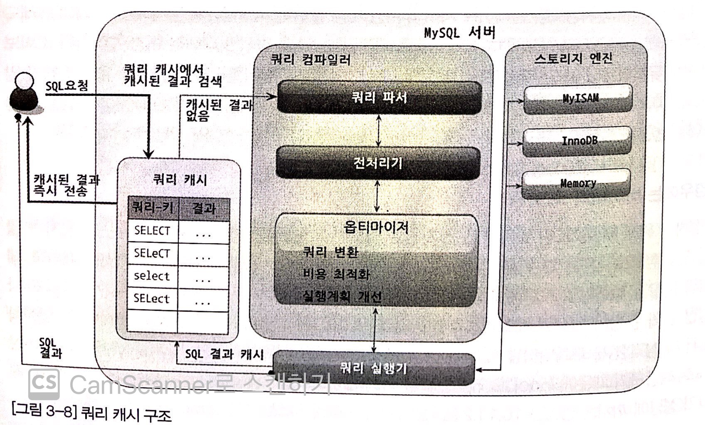

쿼리 캐시는 타 DBMS에는 없는 MySQL의 독특한 기능이다. 쿼리 캐시는 단어 의미와는 달리 SQL 문장을 캐시하는 것이 아니라 쿼리의 결과를 메모리에 캐시 해두는 기능이다. **여러 가지 복잡한 처리 절차와 꽤 큰 비용을 들어 실행된 결과를 쿼리 캐시에 담아 두고, 동일한 쿼리 요청이 왔을 때 간단하게 쿼리 캐시에서 찾아서 바로 결과를 내려 줄 수 있기 때문에 기대 이상의 효과를 거둘 수 있다.**

쿼리 캐시는 단어 의미와는 달리 SQL 문장을 캐시하는 것이 아니라 **쿼리의 결과를 메모리에 캐시해 두는 기능이다.** 쿼리 캐시의 구조는 Map과 같은 데이터 구조로 구현돼 있다. 여기서 키를 구성하는 요소 가운데 가장 중요한 것은 쿼리 문장 자체일 것이며, 값은 해당 쿼리의 실행 결과가 될 것이다. 쿼리 캐시의 결과를 내려보내주기 전에 반드시 다음과 같은 확인 절차를 거쳐야한다.

1. 요청된 쿼리 문장이 쿼리 캐시에 존재하는가?
2. 해당 사용자가 그 결과를 볼 수 있는 권한을 가지고 있는가?
3. 트랜잭션 내에서 실행된 쿼리인 경우, 그 결과가 가시 범위 내의 트랜잭션에서 만들어진 결과인가? (InnoDB 경우)
4. 쿼리에 사용된 기능(내장 함수나 저장함수 등)이 캐시돼도 동일한 결과를 보장할 수 있는가?
   1. CURRENT_DATE, SYSDATE, RAND 등과 같이 호출 시점에 따라 결과가 달라지는 요소가 있는가?
   2. 프리페어 스테이트먼트의 경우 변수가 결과에 영향을 미치지 않는가?
5. 캐시가 만들어지고 난 이후 해당 데이터가 다른 사용자에 의해 변경되지 않는가?
6. 쿼리에 의해 만들어진 결과가 캐시하기에는 너무 크지 않는가?
7. 그 밖에 쿼리 캐시를 사용하지 못하게 만드는 요소가 사용됐는가?


#### 요청된 쿼리 문장이 쿼리 캐시에 존재하는가?
캐시된 결과를 찾기 위해 쿼리 문장을 분석해서 복잡한 비교 과정을 거치는것이 아니기 때문에 아주 간단하고 빠르게 진행된다. **비교 방식은 그냥 요청된 쿼리 문장 자체가 동일한지 여부를 비교하는 것이다. 여기서 비교하는 대상으로는 공백이나 탭과 같은 문자까지 모두 포함되며, 대소문자까지 완전히 동일해야 같은 쿼리로 인식한다.** 결론적으로 애플리케이션의 전체 쿼리 가운데 동일하거나 비슷한 작업을 하는 쿼리는 하나의 쿼리로 통일해 문자열로 관리하는 것이 좋다.

#### 해당 사용자가 그 결과를 볼 수 있는 권한을 가지고 있는가?
요청한 쿼리에 대해 동일한 쿼리 결과가 쿼리 캐시에 저장돼 있더라도 이 사용자가 해당 테이블의 읽기 권한이 없다면 쿼리 캐시의 결과를보여줘서는 안 되기 때문에 이런 확인 작업이 진행된다.

#### 트랜잭션 내에서 실행된 쿼리인 경우, 그 결과가 가시 범위 내의 트랜잭션에서 만들어진 결과인가? (InnoDB 경우)
InnoDB의 모든 트랜잭션은 각 트랜잭션 ID를 갖게 된다. 트랜잭션 ID는 트랜잭션이 시작된 시점을 기준으로 순차적으로 증가하는 6바이트 숫자 값이어서 트랜잭션 ID 값을 비교해 보면 어느 쪽이 먼저 시작된 트랜잭션인지 구분할 수 있다. **InnoDB에서는 트랜잭션 격리 수준을 준수하기 위해 각 트랜잭션은 자신의 ID보다 ID 값이 큰 트랜잭션에서 변경한 작업 내역이나 쿼리 결과는 참조할 수 없다. 이를 트랜잭션의 가시 범위라고 한다.** 쿼리 캐시도 그 결과를 만들어낸 트랜잭션의 ID가 가시 범위 내에 있을 때만 사용할 수 있는 것이다.


#### 쿼리에 사용된 기능(내장 함수나 저장함수 등)이 캐시돼도 동일한 결과를 보장할 수 있는가?

##### CURRENT_DATE, SYSDATE, RAND 등과 같이 호출 시점에 따라 결과가 달라지는 요소가 있는가?
?

##### 프리페어 스테이트먼트의 경우 변수가 결과에 영향을 미치지 않는가?
프리페어 스테이트먼트(바인드 변수가 사용된 쿼리)의 경우 쿼리 문장 자체에 변수`?`가 사용되기 때문에 쿼리문장 자체로 쿼리 캐시를 찾을 수 없다. **주의해야할 점은 코드에서는 프리페어 스테이트먼트를 사용했다 하더라도 실제 MySQL 서버에서 프리페어 스테이트먼트 형태로 실행되지 않는다.** 데이터베이스 커넥션을 생성할 때 특별한 옵션을 사용 해서 서버 사이드 프리페어 스테이트먼트를 생성해야 한다.


#### 캐시가 만들어지고 난 이후 해당 데이터가 다른 사용자에 의해 변경되지 않는가?
쿼라 결과가 쿼리 캐시에 저장된 이후 데이터가 변경되면 어떻게 될까? 당연히 이미 변경된 데이터를 캐시하는 것은 의미가 없기 때문에 데이터를 제거해야한다. 따라서 쿼리 캐시에 있는 데이터를 무효화하는 작업은 레코드 단위가 아닌 테이블 단우로 처리된다. 만약 쿼리 캐시를 1GB로 아주 크게 설졍하고, 하나의 테이블로부터 조회된 데이터로 쿼리 캐시를 꽉 채웠다고 해보자. 그런데 해당 테이블에 새로운 레코드가 한건 INSERT하면 MySQL 서버는 쿼리 캐시에 채워져 있는 1GB를 모두 제거해야 할 것이다. 이 작업은 메모리 작업이라 해도 상당한 시간이 소모될 것이다.

더욱이 쿼리 캐시는 절대 여러 스레드에서 동시에 변경할 수 없기 때문에 다른 스레드는 쿼리 캐시 삭제 작업이 완료될때까지 기다려야 한다. 많은 사용자가 쿼리 캐시를 위한 메모리 공간을 무조건 크게 설정하면 좋다고 생각하지만 이러한 이유로 적절한 크기 이상으로 설정하는 경우 캐시 자체가 부하위 원인이될 가능성도 있다. 여기서 적절한 크기라 함은 일반적으로 32M ~ 64M 정도다.

#### 쿼리에 의해 만들어진 결과가 캐시하기에는 너무 크지 않는가?
쿼리 캐시의 전체 크기를 64MB로 설정했는데, 만약 어떤 쿼리 하나가 60MB 정도의 쿼리 결과를 만들어내면 하나의 쿼리 때문에 쿼리 캐시를 다 소모해 버릴 수 있다. 이러한 현상을 예방하고자 특정한 크기 미만의 쿼리 결과만 캐시 하도록 설정하는 시스템 파라미터가 있다. `query_cache_limit`이며 이 값은 1~2M 미만으로 설정하는 것이 일반적이다. 결론적으로 쿼리가 결과를 만들어내는 데 많은 시간과 자원이 필요하지만, 만들어진 결과의 크기가 작을수록 쿼리 캐시를 더 효율적으로 사용할 수 있기 때문에 GROUP BY, DISTINCT 그리고 COUNT 같은 집합 함수의 결과 쿼리 캐시를 사용하기에 아주 접합하다.

#### 그 밖에 쿼리 캐시를 사용하지 못하게 만드는 요소가 사용됐는가?

* 임시 테이블에 대한 쿼리
* 사용자 변수사용, 쿼리에 사용자 변수를 사용하면 프리페어 스테이트먼트와 동일한 효고과 발생하므로 MySQL이 쿼리 캐시를 사용하지 못하게 한다.
* 칼럼 기반의 권한 설정
* LOCK IN SHARE MODE 힌트, SELECT 문장의 끝에 붙여서 조회하는 레코드에 공유 잠금(읽기 락)을 설정한 쿼리
* FOR UPDATE 힌트, SELECT 문장의 끝에 붙여서 조회하는 레코드에 배타적 잠금(쓰기 락)을 설정하는 쿼리
* 독립적인 SELECT 문장이 아닌 일부분의 서브 쿼리
* SQL_NO_CHCHE 힌트, SELECT 문장에서 SELECT 키워드 뒤에 붙이는 힌트로써, 이 힌트가 사용되면 쿼리 캐시를 사용하지 않는다.


```sql
show global status like 'Qcache%'
```
해당 명령어로 쿼리 캐시가 얼마나 사용됐고 MySQL 서버에서 SELECT 쿼리가 얼마나 실행됐는지 등에 대한 정보를 확인할 수 있다.

| Variable\_name             | Value   |
| :------------------------- | :------ |
| Qcache\_free\_blocks       | 1       |
| Qcache\_free\_memory       | 1031832 |
| Qcache\_hits               | 0       |
| Qcache\_inserts            | 0       |
| Qcache\_lowmem\_prunes     | 0       |
| Qcache\_not\_cached        | 2348    |
| Qcache\_queries\_in\_cache | 0       |
| Qcache\_total\_blocks      | 1       |

| Variable\_name | Value |
| :------------- | :---- |
| Com\_select    | 2352  |


이 값 중에서 **`Qcache_hits`, `Com_select` 상태 값을 이용해 쿼리 캐시가 얼마나 효율적으로 사용되고 있는지 조사해 볼 수 있다. `Qcache_hits`는 쿼리 캐시로 처리된 SELECT 쿼리의 수를 의미하며, `Com_select`는 쿼쿼리 캐시에서 결과를 찾지 못해서 MySQL 서버가 쿼리를 실행한 회수를 의미한다.** 즉 `Qcache_hits`, `Com_select 이 두 값을 더하면 MySQL 서버로 요청된 모든 SELECT 문장의 총 합이 되느 것이다.

> 쿼리 캐시 히트율 `Qcache_hits`/(`Qcache_hits` *`Com_select`) * 100

**쿼리 캐시의 히트율이 20%이상만 되면 일반적으로 쿼리 캐시를 사용하는 것이 좋다고 이야기하기도 하는데, 이보다 낮은 수치가 아온 경우에도 사용하는 것이 좋을 때가 있다. 쿼리 캐시 히트율은 커리 캐시가 얼마나 실행 시간을 줄이고 컴퓨팅 자원을 절약해줬는지를 나타내는 수치가 아니기 때문이다. 1%의 쿼리 캐시 히트율이라고 하더라도 해당 쿼리가 자원이나 시간이 아주 크다면 쿼리 캐시는 그만큼 가치가 있다.**


## InnoDB 스토리지 엔진 아키텍처
**InnoDB는 MySQL에서 사용할 수 있는 스토리지 엔진 중에서 거의 유일하게 레코드 기반의 잠금을 제공하고 있으며, 때문에 높은 동시성 처리가 가능하고 또한 안정적이며 성능이 뛰어나다.**

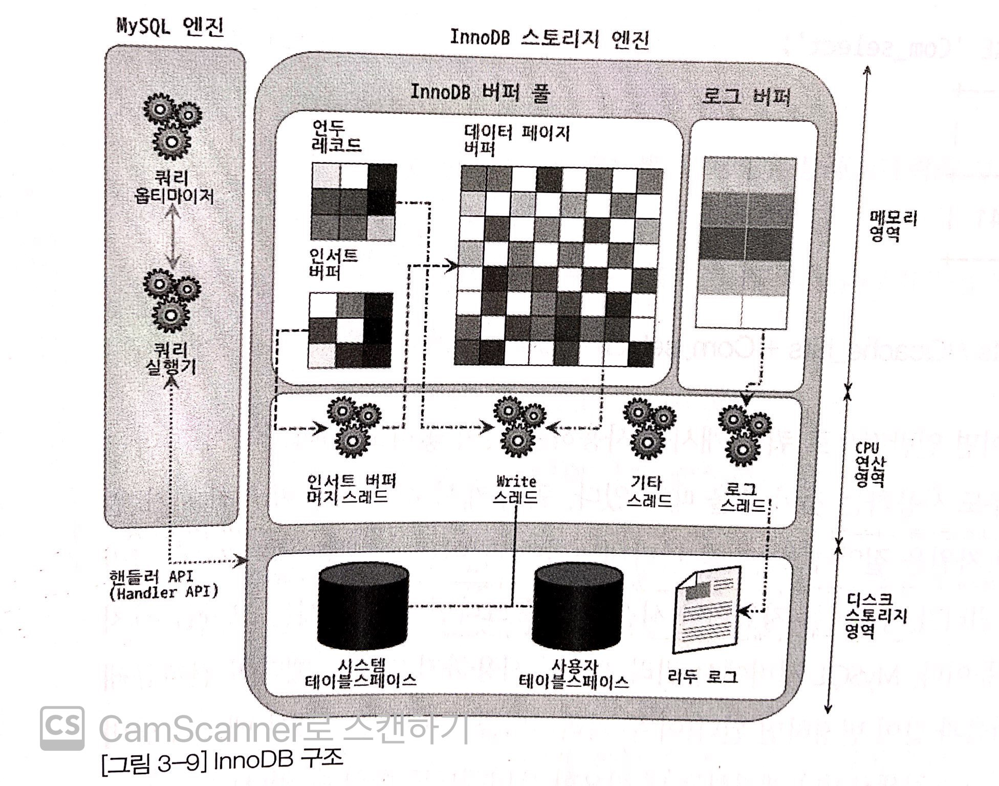

### InnoDB 스토리지 엔진의 특성

#### 프라이머리 키에 의한 클러스터링
**InnoDB의 모든 테이블들은 기본적으로 프라이머리 키를 기준으로 클러스터링되어 저장된다. 즉 프라이머리 키 값의 순서대로 디스크에 저장된다는 뜻이며, 이로 인해 프라이머리 키에 의한 레인지 스캔은 상당히 빨리 처리될 수 있다.** 결과적으로 쿼리의 실행 계획에서 프라이머리 키는 기본적으로 다른 보조 인덱스에 비해 비중이 높게 설정(쿼리의 실행 계획에서 다른 보조 인덱스보다 크라이머리 키가 선택될 확률이 높다)

#### 잠금이 필요 없는 일관된 읽기
**InnoDB 스토리 엔진은 MVCC라는 기술을 이용해 락을 걸지 않고 읽기 작업을 수행한다.** 락을 걸지 않기 때문에 InnoDB에서 읽기 작업은 다른 트랜잭션이 가지고 있는 락을 기다리지 않는다.(SERIALIZABLE 격리 수준 제외)

#### 외래 키 지원
**외래 키에 대한 지원은 InnoDB 스토리지 엔진 레벨에서 지원하는 기능이므로 MyISAM이나 MEMORY 테이블에서는 사용할 수 없다.** 외래 키는 여러 가지 제약사항 탓으로 인해 실무에서 잘 사용하지 않기 때문에 필수는 아니다.

#### 자동 데드락 감지
**InnoDB는 그래프 기반 데드락 체크 방식을 사용하기 때문에 데르락이 발생함과 동시에 바로 감지되고 감지된 데드락은 관련 트랜잭션 중에 ROLLBACK이 가장 용이한 트랜잭션(ROLLBACK을 했을 때 복구 작업이 가장 작은 트랜잭션, 즉 레코드를 가장 적게 변경한 트랜잭션)을 자동적으로 강제 종료 해버린다.** 따라서 데드락 때문에 쿼리가 Timeout에 도달하거나 슬로우 쿼리로 기록되는 경우는 많지 않다.

#### 자동화된 장애 복구
InnoDB에는 손실이나 장애로부터 데이터를 보호하기 위한 여러 가지 메커니즘이 탑재돼 있다. 그러한 메커니즘을 이용해 MySQL 서버가 시작될 때, 완료되지 못한 트랜잭션이나 디스크에 일부만 기록된 데이터 페이지(Partial write)등에 대한 인련의 복구 작업이 자동적으로 진행된다.

#### 오라클의 카키텍처 사용
**InnoDB 스토리지 엔진의 기능은 오라클 DBMS의 기능과 상당히 비슷한 부분이 많다. 대표적으로 MVCC 기능이 제공된다는 것과 Undo 데이터가 시스템 테이블 스페이스에 관리된다는 것이다.** 그리고 테이블 스페이스의 개념등이 있으며 이 외에도  상당히 흡사한 부분이 많아서 오라클에 익숙한 사용자에게는 InnoDB의 많은 부분들이 상당히 친숙할 것이다.

### InnoDB 버퍼 풀
InnoDB 스토리지 엔진에서 가장 핵심적인 부분으로, **디스크의 데이터 파일이나 인덱스 정보를 메모리에 캐시해 두는 공간이다. 쓰기 작업을 지연시켜 일괄 작업으로 처리할 수 있게 해주는 버퍼 역할도 같이한다.**  일반적인 애플리케이션에서는 INSERT, UPDATE, DELETE와 같은 데이터를 변경하는 쿼리는 데이터 파일의 이곳저곳에 위치한 레코드를 변경하기 때문에 **랜덤 디스크 작업을 발생시킨다. 하지만 버퍼 풀이 이러한 변경된 데이터를 모아서 처리하게 되면 랜덤한 디스크 작업의 횟수를 줄일 수 있다.**

**InnoDB 버퍼 풀은 데이터와 인덱스 모두 캐시하고 쓰기 버퍼링의 역할까지 모두 처리하고 있다.** 그 밖에도 InnoDB의 버퍼 풀은 많은 백그라운드 작업의 기반이 되는 메모리 공간이다. 따라서 InnoDB의 버퍼 풀 크기를 설정하는 파라미터(innodb_buffer_pool_szie)는 신중하게 설정하는 것이 좋다. 일반적으로 전체 물리적인 메모리의 80% 정도를 InnoDB의 버퍼 풀로 설정하라는 내용의 게시물도 있는데, 그렇게 단순하게 설정해서 되는 값은 아니며 운영체제와 각 클라이언트 스레드가 사용할 메모리도 충분히 고려해서 설정해야한다. **일반적으로 전체 장착된 물리 메모리 50~80% 수주에서 버퍼 풀의 메모리 크기를 결정한다.**

**InnoDB 버퍼 풀은 아직 디스크에 기록되지 않은 데이터를 가지고 있다(이러한 데이터를 가지고 있는 페이지를 더피 페이지(Dirty page)라고 한다). 이러한 더티 페이지는 InnoDB에서 주기적으로 또는 어떤 조건이 도면 체크포인트 이벤드가 발생하는데, 이 때 Write 스레드가 필요한 만큼의 더티 페이지만 디스크로 기록된다.** 체크 포인트가 발생한다고 해서 버퍼 풀의 모든 더티 페이지를 디스크로 기록하는 것은 아니다.

### 언두(Undo)로그
**언두 영역은 UPDATE 문장이나 DELETE와 같은 문장으로 데이터를 변경했을때 변경되기 전의 데이터(이전 데이터)를 보관하는 곳이다.**

```sql
UPDATE member SET name = '홍길동' WHERE member_id = '1';
```
> 매우 중요!
 
**위 문장이 실행되면 트랜잭션을 커밋하지 않아도 실제 데이터 파일(데이터/인덱스 버퍼) 내용은 '홍길동' 으로 변경된다. 그리고 변경되기 전의 값이 "박계수" 였다면, 언두 영역에는 "박계수"라는 값이 백업 되는 것이다. 이 상태에서 만약 사용자가 커밋을 하게되면 현재 상태가 그대로 유지되고, 롤백하게 되면 언두 영억의 백업된 데이터를 다시 데이터 파일(파일/인덱스 버퍼로) 복구한다.**

언두의 데이터 크게 두 가지 용도로 사용되는데, **첫 번째 용도가 바로 위에서 언급한 트랜잭션이 롤백 대비용이다. 두 번째 용도는 트랜잭션의 격리 수준을 유지하면서 높은 동시성을 제공하는 데 사용된다.** 트랜잭션의 격리 수준이라는 개념이 있는데. 이는 동시에 여러 트랜잭션이 데이터를 변경하거나 조회할 때, 한 트랜잭션의 작업 내용이 다른 트랜잭션에 어떻게 보여질지를 결정하는 수준이다.

### 인설트 버퍼(Inser Buffer)
**RDBMS에서 레코드가 INSERT 되거나 UPDATE 될 때는 데이터 파일을 변경하는 작업 뿐만 아니라 해당 테이블에 포함된 인덱스를 업데이트하는 작업도 필요하다. 그런데 인덱스를 업데이트하는 작업은 랜덤하게 디스크를 읽는 작업이 필요하므로 테이블에 인덱스가 많다면 이 작업은 상당히 많은 자원을 소모하게 된다.** 그래서 InnoDB는 변경해야 할 인덱스 페이지가 버퍼 풀에 있으면 바로 업데이트를 수행하지만. 그렇지 않고 **디스크로부 터 읽어와서 업데이트해야 한다면 이를 즉시 실행하지 않고 임시 공간에 저장해두고 바로 사용자에게 결과를 반환하는 형태로 성능을 향상시키게 되는데, 이때 사용하는 임시 메모리 공간을 인설트 버퍼라고 한다.**

사용자에게 결과를 전달하기 전에 반드시 중복 여부를 체크해야 하는 유니크 인덱스는 인서트 버퍼를 사용할 수 없다. 인서트 버퍼에 임시로 저쟁돼 있는 인덱스 레코드 조각은 이후 백그라운드 스레드에 의해 병합되는데, 이 스레드를 인서트 버퍼 머지 스레드라고 한다. MySQL 5.5 이전 버전까지는 INSERT 작업에 대해서만 이러한 버퍼링이 가능 했는데 해당 MySQL 5.5 부터는 INSERT나 DELETE로 인해 키를 추가하거나 삭제하는 작업에 대해서 버퍼링이 될 수 있게 개선됐다.

### 리두(Redo) 로그 및 로그 버퍼
**쿼리 문장으로 데이터를 변경하고 커밋하면 DBMS는 데이터의 ACCID를 보작하기 위해 즉시 변경된 데이터의 내용을 데이터 파일로 기록해야 한다. 하지만 이러한 데이터 파일의 변경 작업은 순차적으로 많은 데이터를 한꺼번에 변경하는 것이 아니고 랜덤하게 디스크에 기록해야 하기 때문에 디스크를 상당히 바쁘게 만드는 작업이다. 그래서 이러한 부하를 줄이기 위해 DBMS에는 변경된 데이터를 버퍼링해 두기 위해 InnoDB 버퍼 풀 같은 장치가 포함돼 있다.** 하지만 이 장치만으로는 ACID를 보장할 수 없는데 이를 위해 변경된 내용을 순차적으러 디스크에 기록하는 로그 파일을 가지고 있다. 더 정확한 명칭은 리두 러그이며, 일반적으로 DBMS에서 로그라 하면 이 리두 로그를 지창하는 경우가 많다.

해당 로그 파일은 눈으로 확인 할 수 있는 내용이 아니라서 편집기로 열어 볼 수 없으며, 열어볼 필요도 없다. 리두 로그 덕분에 DBMS 데이터는 버퍼링을 통해 한꺼번에 디스크에 변경된 내용을 처리할 수 있고 그로 인해 상당한 성능 향상을 기대할 수 있게 됐다. 하지만 사용량이 매우 많은 DBBMS 서버의 경우엔느 이 리두 로그의 기록 작업이 큰 문제가 되는데, 이러한 부분을 보안하기 위해 최대한 ACID 속성을 보장하는 수준에서 버퍼링을하게 된다.

### MVCC (Multi Version Concurrency Control)
**일반적으로 레코드 레벨의 트랜잭션을 지원하는 DBMS가 제공하는 기능이며, MVCC의 가장 큰 목적은 잠금을 사용하지 않는 일관된 읽기를 제공하는 데 있다. InnoDB는 언두 로그를 이용해서 이 기능을 구현한다. 여기서 멀티 버전이라 함은 하나의 레코드에 대해 여러 개의 버전이 동시에 괸리된다는 것을 의미한다.** 

> 매우 중요!

격리 수준인 READ_COMMITTED인 MySQL 서버에서 InnoDB 스토리지 엔진을 사용하는 테이블의 데이터 변경을 어떻게 처리하는지 그림으로 한번 살펴보자

```sql
CREATE TABLE member (
   m_id INT NOT NULL,
   m_name VARCHAR(20) NOT NULL,
   m_area VARCHAR(20) NOT NULL,

   PRIMARY KEY (m_id),
   INDEX ix_area (m_area)
)

INSERT INTO member (m_id, m_name, m_area) VALUES (12, '홍길동', '서울');
```

INSERT 문이 실행되면, 데이터의 상태는 아래 그림 처럼 변경된다.

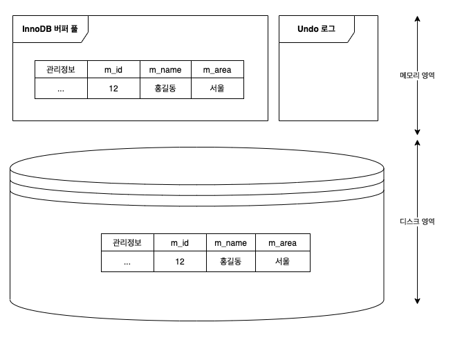
Undo 영역은 비어 있을 수도 있고 아닐 수도 있지만 여기서는 비어 있다고 가정한다.

MEMBER 테이블에 UPDATE 문장이 실행될 때의 처리 절차다.

```sql
UPDATE member SET m_area = '경기' where m_id = 12;
```

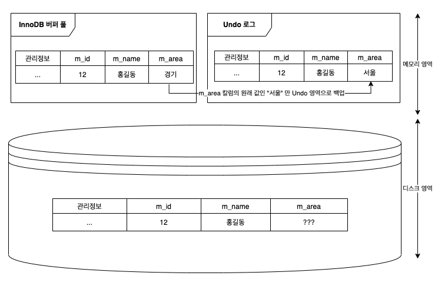

**InnoDB의 특성상 버퍼 풀의 내용을 즉시 디스크의 데이터 파일로 기록하지 않고 일정 주기로 모아서 기록하기 때문에 파일의 my_area 칼럼  값은 "서울" 이거나 "경기"일 수 있다. InnoDB의 백그라운드 스레드가 데이터로 파일로 이미 기록을 했다면 새로운 값인 "경기"로 업데이트 되어 있을 것이다.**

**UPDATE 문장이 실행되면 커밋 실행 여부와 관계 없이, InnoDB의 버퍼 풀은 새로운 값인 "경기"로 업데이트 된다. 그리고 디스크의 데이터 파일에는 체크포인트나 InnoDB Write 스레드에 의해 새로운 값으로 업데이트돼 있을 수도 있고 아닐 수도 있다.** InnoDB가 ACID를 보장하기 때문에 일반적으로 InnoDB 버퍼 풀과 데이터 파일은 동일한 상태라고 가정해도 무방하다.

**아직 COMMIT이나 ROLLBACK이 되지 않은 상태에서 다른 사용자가 다음 같은 쿼리로 작업 중인 레코드를 조회하면 더디에 있는 데이터를 조회할까?**

```sql
SELECT * FROM member WHERE m_id = 12;
```
이 질문에 대한 답은 MySQL 초기화 파라미터에 설정 격리 수준에 따라 다르다. **만약 격리 수준이 READ_UNCOMMITTED인 경우 InnoDB 버퍼 풀이나 데이터 파일로 부터 변경되지 않은 데이터를 읽어서 반환한다. 즉 데이터가 커밋뙛든 아니든 변경된 상태의 데이터를 반환한다.**

그렇지 않고 **READ_COMMITTED나 그 이상의 격리수준(REPEATABLE_READ, SERIALIZABLE)인 경우에는 아직 커밋되지 않기 때문에 InnoDB 버퍼 풀이나 데이터 파일에 있는 내용 대신 변경되기 이전의 내용을 보관하고 있는 언두 영역의 데이터를 반환한다.**

**이러한 과정을 DBMS에서는 MVCC라고 표현한다. 즉 하나의 레코드에 대해 2개의 버전이 유지되고, 필요에 따라 어느 데이터가 보여지는지 여러 가지 상황에 따라 달라지는 구조다.** 여기서는 한 개의 데이터만 가지고 설명했지만 관리해야 하는 예전 버전의 데이터는 무한히 많아질 수 있다. **트랜잭션이 길어지면 언두에서 관리하는 예전 데이터가 삭제되지 못하고 오랫동안 관리돼야 하며, 자연히 언두 영역이 저장되는 시스템 테이블 스페이스의 공간이 많이 늘어나야 하는 상황이 발생할 수도 있다.**

지금까지 UPDATE 쿼리가 실행디면 InnoDB 버퍼 풀은 즉시 새로운 데이터로 변경되며 기존 데이터는 언두로 복사되는 가정까지 살펴봤는데, **이 상태에서 COMMIT 명령어를 실행하면 InnoDB는 더 이상의 변경 작업 없이 지금의 상태를 영구적인 데이터로 만들어 버린다.** 하지만 **롤백을 실행하면 InnoDB는 언두 영역에 있는 백업된 데이터를 InnoDB 버퍼 풀로 다시 복구하고, 언두 영역의 내용을 삭제해 버린다.** 커밋이 된다고 언두 영역의 백업 데이터가 항상 바로 삭제되는 것은 아니다. **이 언두 영역을 필요로 하는 트랜잭션이 더 없을 때 비로소 삭제 된다.**


### 자금 없는 일관된 읽기 (Non-locking consistent read)
InnoDB에서 격리 수준이 SERIALIZABLE이 아닌 READ-UNCOMMITTED, READ-COMIITED, REPEATABLE-READ 수준인 경우 **INSERT와 연결되지 않은 순수한 읽기 작업은 다른 트랜잭션의 변경 작업과 관계 없이 항상 잠금을 대기하지 않고 바로 실행된다. 특정 사용자가 레코드를 변경하지 하고 아직 커밋을 수행하지 않았다 하더라도 이 변경 트랜잭션이 다른 사용자의 SELECT 작업을 방해하지 않는다. 이를 잠금 없는 일관된 읽기 라고 표현하며 InnoDB에서 변경되기 전 데이터를 읽기 위해 언두 로그를 사용한다.**

오랜 시간 동안 활성 상태인 트랜잭션으로 인해 MySQL 서버가 느려지가너 문제가 발생할 때가 가끔 있는데. 바로 이러한 일관된 읽기를 위해 언두 로그를 삭제 하지 못하고 계속 유지해야 하기 때문에 발생하는 문제다. 따라서 트랜잭션이 시작됐다면 가능한 빨리 롤백이나 커밋을 통해 트랜잭션을 완료하는 것이 좋다.

### InnoDB와 MyISAM 스토리지 엔진 비교

InnoDB 스토리이 젠인은 MyISAM과 비교할 수준이 아닐 정도로 많은 기능과 특징을 가지고 있으며 안전성 또한 MyISAM에 비할 바가 못 된다. 성능의 비교는 [MySQL 퍼퍼먼스 블로그](https://www.percona.com/blog/2007/01/08/innodb-vs-myisam-vs-falcon-benchmarks-part-1/)를 참고, MyISAM과 InnoDB의 성능 비교는 무의미해 보일 정도로 차이가 있다. 

## MySQL 로그 파일
**MySQL은 다른 사용 DBMS와 비교하면 DBA나 개발자를 위한 지단 도구가 상당히 부족한 편이다.** 그렇지만 로그 파일을 이용하면 MySQL의 상태나 부하를 일으키는 원인을 찾아서 해결할 수 있다. 

### 에러 로그 파일
MySQL 실행되는 도중에 발생하는 에러나 경고 메시지가 출력되는 로그파일이다. 에러 로그 파일으 위치는 MySQL 컨피규레이션 파일에 `log_error`라는 파라미터에 정의된 경로에 있는 파일이거나 별도로 지정하지 않은 경우에는 데이터 디렉터리에 `.err`이라는 확장자가 붙은 파일이다.

#### MySQL이 시작하는 과정과 관련련 정보성 및 에러미시지
...

#### 마지막으로 종료할 때 비정상저그올 종료된 경우 나타나는 InnoDB의 트랜잭션 복구 메시지
InnoDB의 경우에는 MySQL 서버가 비정상적으로 또는 강제적으로 종료됐다면 다시 시작되면서 **완료되지 못한 트랜잭션을 정리하고 디스크에 기록되지 못한 데이터가 있다면 다시 기록하는 재처리 작업을 하게된다.** 이 과정에 대한 간단한 메시지가 출력된다. 

#### 쿼리 처리 도중에 발생하는 문제에 대한 에러 메시지
...

#### 비정상적으로 종료된 커넥션 메시지
...

#### InnoDB의 모니터링 명령이나 상태 조회 명령의 결과 미시지

#### MySQL의 종료 메시지

### 제너럴 쿼리 로그 파일
해당 쿼리 로그를 활성화하면 모든 쿼리에 대한 기록을 저장할 수 있다.

### 슬로우 쿼리

슬로우 쿼리 로그 파일에는 컨피규레이션에 정의한 시간(long_query_time) 이상의 시간이 요소된 쿼리가 모두 기록된다.

### 바이너리 로그와 릴레이 로그
바이너리 로그 파일은 마스터 MySQL 서버에생성되고 릴레이 로그는 슬레이브 MySQL 서버에 생성된다는 것말고는 **바이너리 로그와 릴레이 로그 파일 내용이나 포멧은 동일하다.**

# 04 트랜잭션과 잠금
트랜잭션은 작업의 안전성을 보장해주는 것이다. **즉 논리적인 작업셋을 모두 완벽하게 처리하거나 또는 처리하지 못할 경우에는 원 상태로 복구해서 작업의 일부만 적용되는 현상이 발생하지 않게 만들어주는 기능이다.**

잠금과 트랜잭션은 서로 비슷한 개념 같지만 사실 **잠금은 동시성을 제어하기 위한 기능이고 트랜잭션은 데이터와 정합성을 보장 하기 위한 기능이다.** 하나의 회원정보 레코드를 여러 커넥션에서 동시에 변경하려고 하는데 잠금이 없다면 하나의 데이터를 여러 커넥션에서 동시에 변경해버릴 수 있게 된다. 결과적으로 해당 레코드의 값은 예측할 수 없는 상태가 된다. **잠금은 여러 커넥션에서 동시에 동일한 자원(레코드, 테이블)을 쵸어할 경우 순서대로 한 시점에는 하나의 커넥션만 변경할 수 있게 해주는 역할을 한다. 격리 수준이라는 것은 하나의 트랜잭션에 내에서 또는 여러 트랜잭션 강의 작업 내용을 어떻게 공유하고 차단할 것인지를 결정하는 것이다.**

## 트랜잭션
트랜잭션을 지원하지 않는 MyISAM과 트랜잭션을 지원하는 InnoDB의 처리 방식 차이를 살펴보고자 한다.

### MySQL에서의 트랜잭션

**트랜잭션은 꼭 여러 개의 변경 작업을 수행하는 쿼리가 조합됐을 때만 의미 있는 개념은 아니다. 트랜잭션은 하나의 논리적인 작업 셋에 하나의 쿼리가 있든 구 개 이상의 쿼리가 있든 관계없이 논리적인 작업 셋 자체가 100% 적용되가나 또는 아무것도 적용되지 않아야하는 함을 보장해 주는 것이다.**

```sqL
// 각 name 필드는 유니크 칼럼이며 'c'는 이미 입력되 있다. 즉 'c'를 입력하면 Duplicate 오류가 발생
INSERT INTO my_isam (name) values ('a', 'b', 'c');
INSERT INTO inno_db (name) values ('a', 'b', 'c');
```
위 두 테이블은 각각 MyISAM, InnoDB 스토리지 엔진을 사용한다. 그리고 해당 쿼리를 실행하면 중복 오류가 발생해서 실패한다. **그런데 두 테이블의 레코드를 조회 해보면 MyISAM 에는 `a`, `b` 정보가 남아 있고 InnoDB `a`, `b` 정보가 남아 있지 않다**

InnoDB는 쿼리 중 일부라도 오류가 발생하면 전체를 원상태로 만들어 둔다는 트랜잭션의 원칙대로 INSERT 쿼리 문장을 실행하기 전 상태로 그대로 복구 했다. MyISAM 테이블에서 발생하는 이러한 현상을 부분 업데이트라고 하며, **이러한 부분 업데이트 현상은 테이블의 데이터 정합성을 맞추는데 상당히 어려운 문제를 만들어낸다.(거의 사용하지 말라는 뜻인듯...)**

### 주의 사항
트랜잭션 또한 DBMS의 커넥션과 동일하게 꼭 필요한 최소의 레코드에만 적용하는 것이 좋다. **즉 프로그램 코드에서 트랜잭션의 범위를 초소화 하라는 뜻이다.**

```
1) 처리 시작
==> 데이터베이스 커넥션 생성
==> 트랜잭션 시작
2) 사용자 로그인 여부 확인
3) 사용자의 글쓰기 내용의 오류 여부 확인
4) 첨부로 업로드된 내용 확인 및 저장
5) 사용자으 입력 내용을 DBMS에 저장
6) 첨부 파일 정보를 DBMS에 저장
7) 저장된 내용 또는 기타 정보를 DBMS에 조회
8) 게시물 을록에 대한 알림 메일 발송
9) 알림 메일 발송 이력을 DBMS에 저장
<== 트랜잭션 종료(COMMIT)
<== 데이터베이스 커넥션 반납
10) 처리 완료
```
* 실제로 많은 개발자가 데이터베이스 커넥션을 생성하는 코드를 1,2 번 사이에 구현하여 그와 동시에 `START TRANSACTION` 명령으로 트랜잭션을 시작한다. 그리고 9번과 10번 사이에 트랜잭션을 COMMIT하고 커넥션을 종료한다. 실제로 DBMS에 데이터를 저장하는 작업은 5번부터 시작된다는 것을 할 수 있으며 2,3,4의 절차가 아무리 빨리 처리된다 하더라도 DBMS의 트랜잭션으로 포함 시킬 필요는 없다. 일반적으로 데이터베이스 커넥션은 개수가 제한적이라서 각 단위 프로그램이 커넥션 소유하는 시간이 길어질수록 사용 가능한 여유 커넥션의 개수는 줄어들 것이다. 그리고 어느 순간 각 단위 프로그램에서 커넥션을 가져가기 위해 기다려야하는 상황이 발생할 수 있다.
* 8번 같은 네트워크를 통해 원격서버와 통신하는 등과 같은 작업은 어떻게서든 DBMS의 트랜잭션 내에서 제거하는 것이 좋다. 해당 네트워크 통신 때문에 DBMS 서버까지 위험해지는 상황이 발생할 수도 있기 때문이다.
* 5,6 번 작업은 반드시 하나의 트랜잭션으로 묶어야하며 7번 작업은 저장돤 데이터의 단순 확인 및 조회이므로 트랜잭션에 포함 시킬 필요는 없다.


```
1) 처리 시작
2) 사용자 로그인 여부 확인
3) 사용자의 글쓰기 내용의 오류 여부 확인
4) 첨부로 업로드된 내용 확인 및 저장
==> 데이터베이스 커넥션 생성
==> 트랜잭션 시작
5) 사용자으 입력 내용을 DBMS에 저장
6) 첨부 파일 정보를 DBMS에 저장
<== 트랜잭션 종료(COMMIT)
7) 저장된 내용 또는 기타 정보를 DBMS에 조회
8) 게시물 을록에 대한 알림 메일 발송
==> 트랜잭션 시작
9) 알림 메일 발송 이력을 DBMS에 저장
<== 트랜잭션 종료(COMMIT)
<== 데이터베이스 커넥션 반납(또는 커넥션 풀에 반납)
10) 처리 완료
```
**해당 시나리오는 구현하고자 하는 업무 특성에 따라 크게 달라질 수 있다. 여기서 설명하려는 바는 프로그램의 코드가 데이터베이스 커넥션을 가지고 있는 범위와 트랜잭션이 활성화돼 있는 프로그램 범위를 초소화해야 한다는 것이다.**

## MySQL 엔진의 잠금
MySQL에서 사용되는 잠금은 크게 스토리지 엔진 레벨과 MySQL 엔진 레벨로 나눠볼 수 있다. MySQL 엔진은 MySQL 서버에서 스토리지 엔진을 제외한 나머지 부분을 이해하면되는데, **MySQL 엔진 레벨의 잠금은 모두 스토리지 엔진에 영향을 미치게 되지만 스토리지 엔진 레벨의 잠금은 스토리지 엔진 간 상호 영향을 미치치 않는다.** MySQL 엔진에서는 테이블 데이터 동기화를 위한 테이블락 말고도 사용자의 필요에 따라 맞게 사용할 수 있는 유저 락과 테이블 명에 대한 잠금을 위한 네임 락이라는 것도 제공한다. 

### 글로벌 락
**글로벌 락은 `FLUSH TABLE WRITE READ LOCK` 명령으로만 획득할 수 있으며, MySQL에서 제공하는 잠금 가운데 가장 범위가 크다. 일단 한 세션에서 글로벌 락을 획득하면 다른 세션에서 SELECT를 제외한 대부분의 DDL 문장이나 DML 문장을 실행하는 경우 글로벌 락이 해제될 때 까지 해당 문장이 대기 상태로 남는다. 글러벌 락이 영향을 미치는 범위는 MySQL 서버 전체이며, 작업 대상 테이블이나 데이터베이스가 다르더라도 동일하게 영향을 받는다.** 여러 데이터베이스에 존재하는 MyISAM, MEMORY 테이블에 mysqldump로 일관된 백업을 받아야 할 때 글로벌 락을 사용한다.

> 주의!
> 글로벌 락을 거는 `FLUSH TABLE WRITE READ LOCK` 명령은 실행과 동시에 MySQL 서버에 존재하는 모든 테이블에 잠금을 건다. `FLUSH TABLE WRITE READ LOCK` 명령어 실행되기 전에 테이블이나 레코드에 쓰기 잠금을 걸고 있는 SQL이 실행되고 있다면, 이 명령은 해당 테이블의 읽기 잠금을 걸기 위해 먼저 실행된 SQL이 완료되고 그 트랜잭션이 완료될 때까지 기다려야한다. 그런데 `FLUSH TABLE WRITE READ LOCK` 명령은 완료돼야만 테이블을 플러시하거나 잠금을 걸 수 있다. 그래서 장시간 SELECT 쿼리가 실행되고 있을 때는 `FLUSH TABLE WRITE READ LOCK` 명령은 SELECT 쿼리가 종료될 때까지 기다려야 한다.
>
> `FLUSH TABLE WRITE READ LOCK` 명령의 최악의 케이스로 실행되면 MySQL 서버의 모든 테이블에 대한 INSERT, UPDATE, DELETE 쿼리가 아주 오랜 시간 동안 실행되지 못하고 기다려야 한다. 글로벌 락은 MySQL 서버의 모든 테이블에 큰 영향을 미치기 때문에 웹 서비스용으로 사용되는 MySQL 서버에서는 가급적 사용하지 않는 것이 좋다. 또한 mysqldump 같은 백업 프로그램을 우리가 알지 못하는 사이에 이 명령을 내부적으로 실행하고 백업할 때도 있다. mysqldump를 이용해 백업을 수행한다면 mysqldump에서 사용하는 옵션에 따라 MySQL 서버에 어떤 잠금을 걸게 되는지 자세히 확인해보는 것이 좋다.

### 테이블 락
개별 테이블 단위로 설정되는 잠금이며, 명시적 또는 묵시적으로 특정 특정 테이블의 락을 획득할 수 있다 명시적으로는 `LOCK TABLE table_name [READ | WRITE]` 명령으로 특정 테이블의 락을 획득 할 수 있다. MyISAM, InnoDB 스토리지 엔진을 사용하는 테이블도 동일하게 설정할 수 있다. 명시적으로 획득한 잠금은 `UNLOCK TABLES` 명령으로 잠금을 반납할수 있다. 명시적은 테이블 락은 특별한 상황이 아니면 애플리케이션에서 거의 사용할 일이 없다. 명시적 테이블 잠그는 작업은 글로벌 락과 동일하게 온라인 작업에 상당한 영향을 미치기 때문이다.

묵시적인 테이블락은 MyISAM, MEMORY 테이블에 데이터를 변경하는 쿼리를 실행하면 발생한다. MySQL 서버가 데이터가 변경되는 테이블에 잠금을 설정하고 데이터를 변경한 후, 즉시 잠금을 해제하는 형태로 사용된다. **즉, 묵시적인 테이블 락은 쿼리가 실행되는 동안에 자동으로 획득했다가 쿼리가 완료되면 자동으로 해제된다. InnoDB는 테이블의 경우 스토리지 엔진 차원에서 레코드 기반의 잠금을 제공하기 때문에 단순 데이터 변경 쿼리로 인해 묵시적인 테이블 락이 설정되지 않는다. 더 정확히는 InnoDB 테이블도 테이블 락이 설정되지만 대부분의 데이터 변경(DML) 쿼리에서는 무시되고 스키마 변경하는(DDL)의 경우에만 영향을 미친다.**

### 유저락
`GET_LOCK()` 함수를 이용해 임의로 잠금을 설정할 수 있다. 이 잠금은 특정 대상이나 테이블이나 레코드 또는 AUTO_INCREMENT와 같은 데이터베이스 객체가 아니라는 것이다. **유저 락은 단순히 사용자가 지정한 문자열에 대해서 획득하고 반납하는 잠금이다.**

### 네임 락
데이터베이스 객체(테이블, 뷰 등)이름을 변경하는 경우 획득하는 잠금이다. 네임 락은 명시적으로 획득하거나 해제할 수 있는 것은 아니고 `RENAME TABLE table_a TO table_b`와 같이 테이블의 이름을 변경하는 경우 자동으로 획득하는 잠금이다. `RENAME TABLE` 명령의 경우 원본 이름과 변경될 이름 모두 한꺼번에 잠금을 설정한다. 또한 실시간으로 테이블을 바꿔야 하는 요건이 배피 프로그램에서 자주 발생하는데 다음 예제를 보자

```sql
-- 배치 프로그램에서 별도의 임시 테이블 (rank_new)에 서비스용 랭키 데이터를 생성
-- 랭킹 배치가 완료되면 현재 서비스용 랭킹 테이블(rank)를 rank_backu 으로 백업하고
-- 새로 만들어진 랭킹(rank_new)을 서비스용으로 대체 하고자 하는 경우
RENAME TABLE rank to rank_backup, rank_new rank;
```

위와 같이 하나의 `RENAME TABLE` 명령문으로 두 개 RENAME 작업을 한꺼번에 실행되면 실제 애플리케이션에서는 `Table not found 'rank'`와 같은 상황이 발생시키지 않고 적용하는 것이 가능하다. 하지만 이 문장을 아래 같이 2개로 나눠서 실행하면 아주 짧은 시간이지만 `rank` 테이블이 존재하지 않는 순간이 생기게 되며, 그 순간에 실행되는 쿼리는 `Table not found 'rank'` 오류를 발생 시킨다.

```sql
RENAME TABLE rank to rank_backup;
RENAME TABLE rank_new to rank
```

## MyISAM, MEMORY 스토리지 엔진의 잠금
**MyISAM, MEMORY 스토리지 엔진은 자체적으로 잠금을 가지지 않고 MySQL 엔진에사 제공하는 테이블 락을 그대로 사용한다.** 그리고 MyISAM, MEMORY 스토리지 엔진에서는 쿼리 단위로 필요한 잠금을 한꺼번에 모두 요청해서 획득하기 때문에 데드락이 발생할 수 없다.

### 잠금 획득

**읽기 잠금**
테이블에 쓰기 잠금이 걸려 있지 않으면 바로 읽기 잠금을 획득하고 읽기 작업을 시작할 수 있다.

**쓰기 잠금**
테이블에 아무런 잠금이 걸려 있지 않아야만 쓰기 잠금을 획득할 수 있고, 그렇지 않다면 다른 잠금이 해제될 때까지 대기해야 한다.

### 잠금 튜닝

```sql
SHOW STATUS LIKE 'Table%';
```

| Variable\_name          | Value |
| :---------------------- | :---- |
| Table\_locks\_immediate | 125   |
| Table\_locks\_waited    | 22    |

* `Table_locks_immediate`: 다른 잠금이 푸리기를 기다리지 않고 바로 잠금을 횟득한 횟수
* `Table_locks_waited`: 다른 잠금이 이미 해당 테이블을 사용하고 있어서 기다려야했던 누적 횟수

```
잠금 대기 쿼리 비율 = Table_locks_waited / (Table_locks_immediate + Table_locks_waited) * 100
```
22 /(125+22) *100 = 14.965986395%, 즉 100개 쿼리 중에서 14개 쿼리는 잠금 대기를 꺽고 있다는 것을 알 수 있다. 만약 이 수치가 높고 테이블 잠금 때문에 경합이 많이 발생하고 있다면 자연히 처리 성능이 영향을 받고 있음을 의미하므로 테이블을 분리한다거나 InnoDB 스토리지 엔진으로 변환하는 방법을 고려하는 것이 좋다. InnoDB 스토리지 엔진의 경우 레코드 단위로 잠금을 사용하기 때문에 집계에 포함되지 않는다. 집계된 수치는 MyISAM, MEMORY, MERGE 스토리지 엔진을 사용하는 테이블이 대상이 된다.

### 테이블 수준의 잠금 확인 및 해제
**MyISAM, MEMORY 등과 스토리지 엔진을 사용하는 테이블은 모두 테이블 단위의 잠금이므로 테이블을 해제하지 않으면 다른 클라이언트에서 그 테이블을 사용하는 것이 불가능하다. 하나의 테이블에 전혀 다른 레코드라 하더라도 동시에 변경하는 것은 불가능하기 때문에 쿼리 처리의 동시성이 떨어지게 된다.**

MySQL에서 테이블 잠금을 획득하는 방법은 LOCK TABLES 명령을 이용해 명시적으로 획득하는 방법과 SELECT, INSERT, DELETE, UPDATE 또는 (DDL 명령)쿼리 문장을 이용해 묵시적으로 획득하는 방법이 있다. **묵시적으로 잠금을 획득하는 방법은 쿼리가 실행되는 동안만 잠금을 획득하며, MyISAM, MEMORY 테이블 수준의 잠금을 사용하는 스토리지 엔진은 모두 트랜잭션을 지원하지 않으므로 하나의 쿼리가 실행되는 동안만 락이 걸렸다가 쿼리가 완료되면서 즉시 해제되는 것이다.**

```sql
create table myisam_member
(
    id   bigint auto_increment
        primary key,
    name varchar(20) not null
)
engine MyISAM
```

명시적인 방법은 `UNLOCK TABLES` 명령으로 해제하기 전에는 자동으로 해제되지 않는다.

| 커넥션1                         | 커넥션2                                           | 커넥션3                                           |
| ------------------------------- | ------------------------------------------------- | ------------------------------------------------- |
| LOCK TABLES myisam_member READ; | -                                                 | -                                                 |
| -                               | UPDATE myisam_member SET name = 'B' WHERE id = 1; | -                                                 |
| -                               | -                                                 | UPDATE myisam_member SET name = 'c' WHERE id = 1; |

위와 같이 3개의 커넥션에 순차적으로 각 쿼리를 실행해 보면 커넥션의 1의 `LOCK TABLES` 명령은테이블의 잠금을 설정하고 바로 반환될 것이다. 하지만 2, 3 커넥션은 myisam_member 테이블의 잠금이 해제되기를 기다린다. 아래 명령어를 수행 해보자

```sql
show open tables from batch_study;
show open tables from batch_study like 'myisam_member';
```

| Database     | Table                           | In\_use | Name\_locked |
| :----------- | :------------------------------ | :------ | :----------- |
| batch\_study | batch\_step\_execution\_context | 0       | 0            |
| batch\_study | myisam\_member                  | 3       | 0            |
| batch\_study | batch\_job\_execution\_params   | 0       | 0            |


| Database     | Table          | In\_use | Name\_locked |
| :----------- | :------------- | :------ | :----------- |
| batch\_study | myisam\_member | 3       | 0            |


`show open tables from batch_study;`은 MySQL 서버의 모든 테이블에 대한 잠금 여부를 보여주고, `show open tables from batch_study like 'myisam_member';`명령의 결과 출력되는 `in_use` 값은 해당 테이블을 잠그고 있는 클라이언트 수뿐만 아니라 그 테이블의 잠금을 기다리는 클라이언트 수까지 더햇서 출력된다. 그리고 `Name_locked`는 테이블 이름에 대한 네임 락이 걸려 있느는지를 표시한다.
위 결과를 보면 어떤 테이블이 잠겨있는지 알 수 있지만 어떤 클라이언트의 커넥션이 잠금을 기달리고 있는지를 보여주고 있지 않는데 이를 확인 할때는 `show processlist;`를 사용한다

| Id   | User | Host             | db           | Command | Time | State                           | Info                                                       |
| :--- | :--- | :--------------- | :----------- | :------ | :--- | :------------------------------ | :--------------------------------------------------------- |
| 1    | root | xxx.xx.0.1:59414 | batch\_study | Query   | 0    | starting                        | /\* ApplicationName=DataGrip 2021.1.3 \*/ show processlist |
| 3    | root | localhost        | batch\_study | Query   | 27   | Waiting for table metadata lock | update myisam\_member<br/>set name = 'B'<br/>where id = 1  |
| 4    | root | localhost        | batch\_study | Query   | 4    | Waiting for table metadata lock | update myisam\_member<br/>set name = 'C'<br/>where id = 1  |

id 3번인 클라이언트와 5번인 클라이언트의 `State`가 `lock` 이라는 것을 보아 테이블 락을 기달리는 것을 알수 있으며, id 1번인 클라이언트는 지금 아무것도 하고 있지 않다. 3,4 번클라이언트가 업데이트하고자 하는 테이블에 동일하게 myisam_member 테이블 잠금을 가지고 있지 않다는 것을 알 수 있다. 그러므로 1번 클라이언트가 이 잠금을 가지고 있는 것이며, 이경우에는 id 1번인 커넥션을 종료시키면 3,4 번커넥션이 차례대로 처리될 수 있다. 

## InnoDB 스토리 엔진의 잠금
InnoDB 스토리지 엔진은 MySQL에서 제공하는 잠금과는 별개로 스토리지 엔진 내부에서 레코드 기반의 잠금 방식을 탑재하고 있다. InnoDB 레코드 기반의 잠금 방식 때문에 MyISAM 보다 훨씬 뛰어난 동시성 처리를 제공할 수 있다. MySQL 서버의 `INFORMATION_SCHEMA` 테이블에 존재하는 `INNODB_TRX`, `INNODB_LOCKS`, `INNODB_LOCK_WAITS` 이라는 테이블을 조인해서 조회하면 현재 어떤 트랜잭션이 어떤 잠금을 대기하고 있고 잠금을 어느 트랜잭션이 가지고 있는지 확인할 수 있으며, 장시간 잠금을 가지고 있는 클라이언트를 종료시키는 것도 가능하다.

### InnoDB의 잠금 방식

**비관적 잠금(선점락)**
현재 트랜잭션에서 변경하고자 하는 레코드에 대한 잠금을 획득하고 변경 작업을 처리하는 방식을 비관적 잠금이라고 한다. **이 처리 방식에서 느낄 수 있듯이 현재 변경하고자 하는 레코드를 다른 트랜잭션에서도 변경할 수 있다 라는 비관적인 가정을하기 때문에 먼저 잠금을 획득한 것이다.** 높은 동시성 처리는 비관적 잠금이 유리하며 InnoDB 비관적 잠금 방식을 체택하고 있다

**낙관적 잠금(비선점)**
낙관적 잠금에서는 기본적으로 각 트랜잭션이 같은 레코드를 변경하는 가능성은 상당히 희박할 것이라고 낙관하는 것이다. 그래서 우선 변경 작업을 수행하고 마지막에 잠금 충돌이 있었는지 확인ㅇ해 문제가 있었다면 ROLLBACK 처리하는 방식을 의미한다.

#### InnoDB 잠금 종류

**레코드 락**
레코드 자체만 잠그는 것을 레코드 락이라고 하며, 다른 DBMS의 레코드 락과 동일한 역할을 한다. **한가지 중한 차이는 InnoDB 스토리지 엔진은 레코드 자체가 아니라 인덱스 레코드로 잠금다는 점이다.** 만약 인덱스가 하나도 없는 테이블이라 하더라도 내부적으로 자동 생성된 클러스터 인덱스를 이용해 잠금을 설정한다. 레크드 자체를 잠그느냐, 인덱스를 잠그느냐는 상당히 크고 중요한 차이를 만들어 내기 낸다. InnoDB에서는 대부분 보조 인덱스를 이용한 변경 작업은 넥스트 키 락, 갭 락을 사용하지만, 프라이머리 키 또는 유니크 인덱스에 의한 변경 작업은 갭 락에 대해서 잠그지 않고 레코드 자체에 대해서만 락을 건다.

**갭 락**
다른 DBMS와 또 다른 차이가 바로 랩락이다. **랩 락은 레코드 그자체가 아니라 레코드와 바로 인접한 레코드의 사이의 간격만을 잠그는 것을 의미한다. 랩 락의 력할은 레코드와 레코드 사이의 간격에 새로운 레코드가 생성(INSERT)되는 것을 제어한다.** 랩 락이라는 것은 개념일 뿐이지 자체적으로 사용되지 않고, 이어서 설명할 넥스트 키 락의 일부로 사용된다.

**넥스트 키 락**
**렠드 락과 갭락을 합쳐 놓은 형태의 잠금을 넥스트 키 락이라고 한다.** STATEMENT 포맷의 바이너리 로그를 사용하는 MySQL 서버에서는 REPEATABLE READ 격리 수준을 사용해야 한다. 또한 `innodb_locks_unsafe_for_binlog` 파라미터가 활성화되면 변경을 위해 검색하는 레코드에는 넥스트 키 락 방식으로 잠금을 걸린다, **InnoDB의 랩 락이나 넥스트 키 락은 바이너리 로그에 기록되는 쿼리가 슬레이브에서 실행될 때 마스터에서 만들어낸 결과와 동일한 결과를 만들어내도록 보장해주는 것이 주 목적이다.**

**자동 증가 락**
MySQL 에서는 자동 증가하는 숫자 값을 추출하기 위해 `AUTO_INCREMENT` 라는 칼럼 속성을 제공한다. `AUTO_INCREMENT` 칼럼이 사용된 테이블에서 동시에 여러 레코드그 INSERT되는 경우 지정되는 각 레코드는 중복되지 않고 저장된 순서대로 증가한 일련번호 값을 가져야 한다. InnoDB 스토리지 에닌에서는 이를 위해 내부적으로 `AUTO_INCREMENT` 락이라는 테이블 수준의 잠금을 사용한다.

`AUTO_INCREMENT` 락은 INSERT, REPLACE 같은 쿼리 문장과 같이 새로운 레커ㅗ드를 지정하는 쿼리에서만 필요하며 UPDATE, DELETE 등 과같은 쿼리에서는 걸리지 않는다.

### 인덱스와 잠금
**InnoDB의 잠금과 인덱스는 상당히 중요한 연관 관계가 있다. InnoDB의 잠금은 레코드를 잠그는 것이 아니라 인덱스를 잠그는 방식으로 처리된다. 즉 변경해야할 레코드를 찾기 위해 검색한 인덱스의 레코드를 모두 잠가야 한다.** 다음 UPDATE 문장을 보자

```sql
-- 데이터베이스의 member 테이블은 first_name 칼럼만, idx_first_name 이라는 인덱스가 준배돼 있따.
-- member 테이블에 first_name = 'YUN'은 전체 rows 253
-- member 테이블에 last_name = 'KIM'은 전체 rows 1
UPDATE member SET updated_at = now()
where first_name = 'KIM' and last_name = 'yun';
```
UPDATE 문장이 실행되면 1건의 레코드가 업데이트될 것이나. 하지만 1건의 업데이트를 위해 몇개의 레코드에 락을 걸어야 할까? 이 UPDATE 문장의 조건에는 인덱스를 이용할 수잇는 조건이 `first_name='YUN'`이며, `last_name` 칼럼은 인덱스에 없기 때문에 `first_name='YUN'`인 레코드 253건의 레코드가 모두 잠긴다. 이 예제는 몇 건 안되는 레코드만 잠그지만 UPDATE 문장을 위해 적절히 인덱스가 준비돼 있지 않다면 각 클라이언트의 간의 동시성이 상당히 떨어져 한 세션에서 UPDATE 작업을 하고 있는 중에 다른 클라이언트는 그 테이블을 업데이트 하지 못하고 기다려야 한다.

**만약 인덱스가 하나도 없다면, 이러한 경우에는 테이블을 풀 스캔하며 UPDATE 하는데 이 과정에서 테이블에 있는 30여 만 건의 모든 레코드를 잠그게 된다. 이것이 MySQL의 방식인 것이며, 또한 MySQL InnoDB에서 인덱스 설계가 중요한 이유 또한 이 때문이다.**

### 트랜잭션 격리 수준과 잠금
인덱스 잠금 현상은 InnoDB 넥스트 키 락 때문에 발생하는 것이다. 하지만 **InnoDB에서 넥스트 키 락을 필요하게 만드는 주 원인이 바로 복제를 위한 바이너리 로그 때문이다.**

MySQL 5.1 이상 버전에서는 바이너리 로그가 활성화되ㅏ면 최소 REPETABLE READ 이상의 격리 수준을 사용하도록 강제되고 있다. **또한 UPDATE 문장을 처리하기 위해 일치하는 레코를 인덱스를 이용해 검색할 때, 우선 인덱스만을 비교해서 일치하는 레코드에 대해서 배타적 자금을 걸게 되지만, 그 다음 나머지 조건을 비교해서 일치하지 않는 레코드는 즉시 잠금을 해제한다. 즉 인덱스만으로 일치 여부를 판단하고 1차 비교 단계에서는 `first_name='YUN'`인 레코드를 모두 잠그게 된다. 하지만 인덱스를 이용하지 않는 나머지 조건의 일치여부를 판단하는 2차 비교에서 실제 업데이트 대상이 아니라는 것을 알게 됨과 동시에 1차 비교에서 걸었던 잠금을 해제한다. 최종적으 이 쿼리는 `first_name='YUN'` AND `last_name='KIM'`인 레코드에 대해서만 배타적 잠금을 가지게 되며, 비효율적으로 불필요한 잠금이 생기는 현상은 없어지는 것이다.**

### 레코드 수준의 잠금 확인 및 해제

레코드 수준의 잠금 테이블의 레코드 각각에 잠금이 걸이므로 그 레코드가 자주 사용되지 않는다면 오랜 시간 동안 잠겨진 상태로 남아 있어도 잘 발견되지 않는다. MySQL 5.1 부터는 레코드 잠금과 잠금 대기에 대한 조회가 가능하므로 쿼리 하나만 실행해 보면 잠금과 잠금대기를 바로 확인할 수 있다.

## MySQL의 격리 수준

**트랜잭션의 격리 수준이란 동시에 여러 트랜잭션이 처리될 때, 특정 트랜잭션이 다른 트랜잭션에서 변경하거나 조회하는 데이터를 볼 수 있도록 허용할지 말지를 결정하는 것이다.** 격리 수준은 READ UNCOMMITTED, READ COMMITTED, REPEATABLE READ, SERIALIZABLE 4가지로 나뉘며, 4개의 트랜잭션 격리 수준에서 순대대로 뒤로 갈수록 각 트랜잭션 간의 데이터 격리 정도가 높아지며, 동시시성도 떨어지는 것이 일반적이라고 볼 수 있다. **격리 수준이 높아질 수록 MySQL 서버의 처리 성능이 많이 떨어질 것으로 생각하는 사용자가 많은데 사실 SERIALIZABLE 격리 수준이 아니라면 크게 성능의 개선이나 저하는 발생하지 않는다.**

| ISOLATION        | DIRY READ | NOE-REPEATABLE READ | PHANTOM READ              |
| ---------------- | --------- | ------------------- | ------------------------- |
| READ UNCOMMITTED | O         | O                   | O                         |
| READ COMMITTED   | X         | O                   | O                         |
| REPEATABLE READ  | X         | X                   | O(InnoDB는 발생하지 않음) |
| SERIALIZABLE     | X         | X                   | X                         |

SQL-92, SQL-99 표쥰에 따르면 **REPEATABLE READ 격리 수준에서는 PHANTOM READ가 발생할 수 있지만, InnoDB에서는 도특한 특성 때문에 REPEATABLE READ 격리 수준에서도 PHANTOM READ가 발생하지 않는다.** 아래의 예제는 모두 AUTO_COMMIT OFF 상태에서 테스트 할 수 있다.

### READ UNCOMMITTED

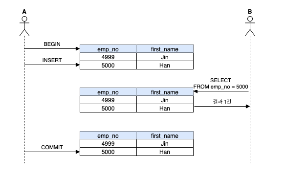

**READ UNCOMMITTED 격리 수준에서는 트랜잭션에서의 변경 내용이 COMMIT, ROLLBACK 여부와 상관 없이 다른 트랜잭션에서 보여진다.** 위 그림에서는 다른 트랜잭션이 사용자 B가 실행하는 SELECT 쿼리의 결과에 어떤 영향을 미치는지 보여준다.

1. 사용자 A는 emmp_no = 5000의 Han을 INSERT Begin
2. 사용자 B는 A가 아직 COMMIT 하기전 emmp_no = 5000 조회, **아직 COMMIT 하지 않은 emmp_no = 5000 조회성공**
3. 사용자 A는 COMMIT 완료

**여기서 문제는 3번에서 문제가 발생해 INSERT를 롤백해버리면 B는 정상적으로 조회를 해서 이후 로직을 이어가게 된다. 이런 현상을 더티 리드라 하고, 더티 리드가 허용되는 격리 수준이 READ UNCOMMITTED다.** RDBMS 표준에는 트랜잭션 격리 수준으로 인정하지 않을 정도로 정합성에 문제가 많은 격리 수준이다. MySQL을 사용한다면 최소한 READ COMMITTED 이상의 격리 수준을 사용 해야한다.

### READ COMMITTED
이 레벨에서는 위에서 언급한 더티 리드와 같은 현상은 발생하지 않는다. 어떤 트랜잭션에서 데이터를 변경했더라도 COMMIT이 완료된 데이터만 다른 트랜잭션에서 조회할 수 있기 때문이다.

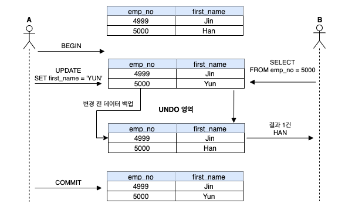

1. 사용자 A는 emp_no=5000인 사원의 first_name을 Han -> Yun으로 변경경
2. 1번 변경시 새로운 값인 **Yun은 즉시 기록되고 이전 값인 Han은 언두 영역으로 백업된다.**
3. 사용자 A가 커밋을 수행하기 전에 **사용자 B가 emp_no=5000을 조회하면 Yun이 아니라 Han으로 조회된다. 즉 언두 영역에서 데이터를 가져온 것이다.**
4. 사용자 A가 최종 적으로 COMMIT 하여 데이터를 영구적으로 반영한다.

**`READ COMMITTED` 격리 수준에서는 어떤 트랜잭션에서 변경한 내용이 커밋되기 전까지 다른 트랜잭션에서 그러한 변경 내용을 조회할 수 없다. 최종적으로 사용자 A가 변경된 내용을 커밋하면 그때 부터는 다른 트랜잭션에서도 백업된 언두 레코드가 아니라. 새롭게 변경된 데이터를 참조할 수 있게 된다.**

> 주의!
> 언두 레코드는 InnoDB의 시스템 테이블 스페이스의 언두 영역에 기록되는데, 언두 레코드는 트랜잭션의 격리 수준을 보장하기 위한 용도뿐 아니라 트랜잭션의 ROLLBACK에 대한 복구에서도 사용된다. 위 UNDO 로그 참고

**READ COMMITTED 격리 수준에서도 NON-REPEATABLE READ가 가능하여 부정합 문제가 있다. NON-REPEATABLE READ가 왜 발생하고 어떤 문제를 만들어낼 수 있는지 확인 하자.** 

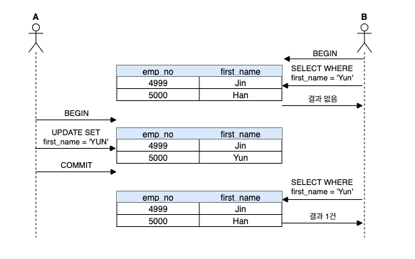

1. 사용자 B가 BEGIN 명령으로 트랜잭션을 시작하고 first_name='Yun' 검색 하여 검색결과 없음 응답 받음
2. 사용자 A가 이름을 'Yun'으로 변경하고 커밋을 실행
3. 사용자 B는 똑같이 **SELECT하면 이번에는 결과가 1건이 조회된다.**

이는 별다른 문제가 없어 보이지만, **사실 사용자 B가 하나의 트랜잭션 내에서 똑같은 SELECT 쿼리를 실행 했을 때는 항상 같은 결과를 가져와야 한다는 REPEATABLE READ 정합성에 어긋나는 것이다.**

이러한 부정합 현상은 일반적인 웹 프로그램에서는 크게 문제되지 않지만 하나의 트랜잭션에서 동일 데이터를 여러 번 읽고 변경하는 작업이 금전적인 처리와 연결되면 문제가 될 수도 있다. 예를 들어, **다른 트랜잭션에서 입금과 출금 처리가 계속 진행되고 있을 때 다른 트랜잭션에서 오늘 입금된 금액의 총합을 조회한다고 가정 해보자. 그런데 REPEATABLE READ가 보장되지 않기 때문에 총합을 계산하는 SELECT 쿼리는 실행될 때마다 다른 결과를 가져올 것이다. 중요헌 것은 사용 중인 트랜잭션의 격리 수준에 의해 실행하는 SQL 문장이 어떤 결과를 가져오게 되는지를 정확하게 에측할 수 있어야 한다는 것이다.** 

가끔 사용자 중에 트랜잭션 내에서 실행되는 SELECT 문자와 트랜잭션 없이 실행되는 SELECT 문장의 차이를 혼동하는 경우가 있다. **READ COMMITTED 격리 수준에서는 트랜잭션 내에서 실행되는 SELECT 문장과 트랜잭션 외부에서 실행되는 SELECT 문장의 차이가 별로 없다. 하지만 REPEATABLE READ 격리 수준에서는 기본적으로 SELECT 쿼리 문장도 트랜잭션 범위 내에서만 작동 하는 것이다. 즉 `BEGEN TRANSACTION`으로 트랜잭션을 시작한 상태에서 온종일 동일한 쿼리를 반복해서 실행해봐도 동일한 결과만 보게된다.(아무리 다른 트랜잭션에서 그 데이터를 변경하고자 COMMIT을 실행 한다 하더라도 말이다.)** 별로 중요하지 않는 차이처럼 보이지만 이런 문제로 데이터의 정합성이 깨지고 그로 인해 애플리케이션의 버그가 발생하면 찾아내기가 쉽지 않다.

### REPEATABLE READ

REPEATABLE READ는 MySQL의 InnoDB 스토리지 엔진에서 기본적으로 사용되는 격리수준이다. **바이너리 로그를 가진  MySQL의 장비에서는 최소 REPEATABLE READ 격리 수준 이상을 사용해야 한다.** 이 격리 수준에서는 READ COMMITED 격리 수준에서 발생하는 `NON-REPEATABLE READ` 부정합이 발생하지 않는다. **InnoDB 스토리지 엔진은 트랜잭션이 ROLLBACK될 가능성에 대비해 변경되기 전 레코드를 언두 공간에 백업해두고 실제 레코드 값을 변경한다. 이러한 변경 방식을 MVCC 라고 한다.** REPEATABLE READ는 이 MVCC를 우해 언두 영역에 백업된 이전 데이터를 이용해 동일 트랜잭션 내에서는 동일한 결과를 보여줄 수 있돌고 보장한다. **사실 REPEATABLE READ도 MVCC를 이용해 COMMIT되기 전의 데이터를 보여준다 REPEATABLE READ와 READ COMMITTED의 차이는 언두 영역에 백업된 레코드의 여러 버전 가운데 몇 번쨰 이전 버전까지 찾아 들어가야 하는지에 있다.**

**모든 InnodB 트랜잭션은 고유한 트랜잭션 번호(순차적으로 증가하는 값)를 가지며, 언두 영역에 백업된 모든 레코드에는 변경을 발생시킨 트랜잭션의 번호가 포함돼 있다. 그리고 언두 영역의 백업된 데이터는 InnoDB 스토리지 엔진이 불필요하다고 판단하는 시점에 주기적으로 삭제한다. REPEATABLE READ 격리 수준에서는 MVCC를 보장하기 위해 실행 중인 트랜잭션 가운데 가장 오래된 트랜잭션 번호보다 트랜잭션 번호가 앞선 언두 영역의 데이터는 삭제할 수 없다.** 그렇다고 가장 오랜된 트랜잭션 번호 이전의 트랜잭션에 의해 변경된 모든 언두 데이터가 필요하는 것은 아니다. 더 정확하게는 특정 트랜잭션 번호와 구간 내에서 백업된 언두 데이터가 보존돼야 한다는 것이다.

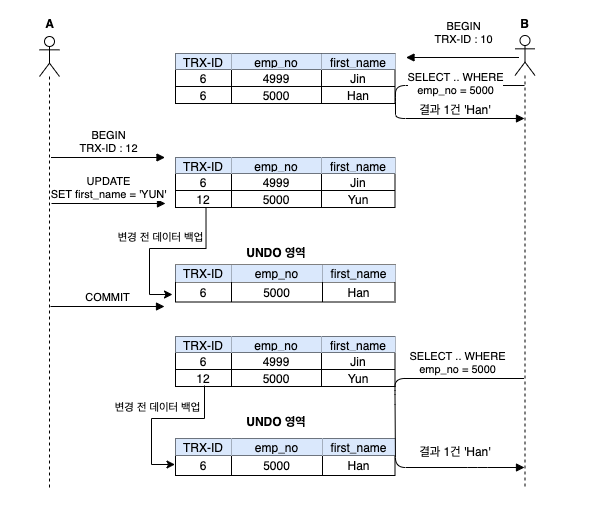

1. 이미 TRX-ID: 6 INSERT 되어 있다고 가정한다.
2. 사용자 A의 TRX-ID: 10번으로 emp_no=5000 조회, Han 응답
3. 사용자 B의 TRX-ID: 12번으로 emp_no=5000 first_name Han -> Yun 으로 변경 하고 최종 COMMIT, UNDO 영역의 이전 데이터 Yun 백업
4. **사용자 B의 TRX-ID: 10번으로 emp_no=5000 조회 다시 조회, 10번 트랜잭션 안에서 실행되는 모든 SELECT 쿼리는 트랜잭션 번호가 10보다 작은 트랜잭션 번호에서 변경한 것만 본다 즉, 동일하게 Han 응답.**

위 그림에서는 언두 영역에 백업된 데이터가 하나만 있는 것으로 표현됐지만 사실 하나의 레코드에 대해 백업이 하나 이상 얼마든지 존재할 수있다. 만약 사용자가 BEGEIN으로 트랜잭션을 시작하고 장시간 동안 트랜잭션을 종료하지 않으면 언두 영역이 백업된 데이터로 무한정 커질 수도 있다. 이렇게 언두에 백업된 레코드가 많아지만 MySQL 서버의 처리 성능이 떨어질 수 있다.

**REPEATABLE READ 격리 수준에서도 다음과 같은 부정합이 발생할 수있다. 사용자 A가 employees 테이블에 INSERT를 실행하는 도중에 사용자 B가 SELECT ... FOR UPDATE 쿼리로 employees 테이블을 조회했을 떄 다음과 같은 결과를 가져온다.**


1. B 사용자는 BEGEN 명령으로 트랜잭션을 시작 
2. B 사용자는 TRX-ID: 10 으로 emp_no=5000 조회, 결과 1건 (Han)응답
3. A 사용자는 BEGEN 명령으로 트랜잭션을 시작
4. A 사용자는 TRX-ID: 12으로 신규 데이터 Moon 등록, COMMIT 완료
5. **B 사용자는 SELECT ... FOR UPDATE 쿼리로 조회**
6. **B 사용자는 동일 트랜잭션에서 동일한 조회를 했음에도 불과하고 결과 2건(Han, Moon), 즉 REPEATABLE READ를 준수하지 못함**


동일한 트랜잭션에서는 B 사용자가 실행하는 두 번의 SELECT ... FOR UPDATE 쿼리 결과는 똑같아야 한다. 하지만 결과가 서로 다르다. 이렇게 **다른 트랜잭션에서 수행한 변경 작업에 의해 레코드가 보였다가 안 보였다가 하는 현상을 PHANTOM EAD라고 한다. SELECT ... FOR UPDATE 쿼리는 SELECT 하는 레코드에 쓰기 잠금을 걸어야 하는데, 언두 레코드에는 잠금을 걸 수 없다. 그래서 SELECT ... FOR UPDATE, SELECT .. LOCK IN SHARE MOD로 조회하는 레코드는 언두 영역의 변경 전 데이터를 가져오는 것이 아니라 현재 레코드 값을 가져오게 되는 것이다.**

### SERIALIZABLE
가장 단순한 격리 수준이지만 가장 엄격한 격리 수준이다. 또한 그만큼 동시 처리 성능도 다른 트랜잭션 격리 수준 보다 떨어진다. **InnoDB 테이블에서 기본적으로 순수한 SELECT 작업(INSERT ... SELECT, CREATE TABE ... AS SELECT ... 가 아닌)은 아무런 레코드 잠금도 설정하지 않고 실행된다. InnoDB 메뉴엘에서 자주 나타는 `Non-locking conssistent read`(잠금이 필요 없는 일관된 읽기)를 제공하는 것이다.**  하지만 트랜잭션 격리 수준이 SERIALIZABLE로 설정되면 읽기 작업도 공유 잠금(읽기 잠금)을 획득해야만 하며, 동시에 다른 트랜잭션은 그러한 레코드를 변경하지 못한다. **즉 트랜잭션에서 읽고 쓰는 레코드를 다른 트랜잭션에서 절대 접근할 수 없는 것이다.** SERIALIZABLE 격리 수준에서는 일반적인 DBMS에서 일어나는 PHANTOM READ 문제가 발생하지 않는다. 하지만 **InnoDB 스토리지 엔진에서는 REPEATABLE READ 격리 수준에서도 이미 PHANTOM READ가 발생하지 않기 때문에 굳이 SERIALIZABLE을 사용할 필요성은 없다.**

### REPEATABLE 격리 수준과 READ COMMITTED 격리 수준의 성능 비교
실제 온라인 서비스에 상황에서는 발생할 가능성이 거의 없지만 굳이 만들려고 한다면 REPEATABLE READ가 상당히 성능이 떨어지게 만들수 있다. 예를 들어 하나의 트랜잭션을 열어 그 트랜잭션에서 모든 테이블의 데이터를 SELECT한 후, 그대로 계속 나두면 InnoDB의 언두 영역이 계속 켜저서 시스템 테이블스페이스의 I/O가 유발되는 경우가 있다. 하지만 이런 의도적인 경우가 아니라면 READ COMMITTED, REPEATABLE READ 격리 수준의 성능 차이는 사실 크지 않다.

**벤치마크 결과로는 1GB와 30GB 크기의 테이블에서 REPEATABLE READ가 2% 정도 높은 성능을 보였고, 10GB 크기의 테이블에서는 READ COMMITTED가 7% 정도 높은 성능을 보이는 정도였다. 주의해야 할 점은 바이너리 로그가 활성화된 MySQL 서버에서는 READ COMMITTED 격리 수준을 사용할 수 없다라는 것이다.**


# 05 인덱스

## 디스크 읽기 방식
데이터베이스의 성능 튜닝은 어떻게 디스크 I/O를 줄이냐가 관건인 것들이 상당히 많다

### 디스크 드라이브와 솔리드 스테이트 드라이브
컴퓨터에서 CPU나 메모리 같은 주요 장치는 대부분 전자식 장치지만 디스크 드라이브는 기계식 장치다. 그래서 데이터베이스 서버에서는 항상 디스크장치가 병목 지점이 된다. 이런 기계식 디스크 드라이브를 대체하기 위해 전자식 저장 메체인 SSD가 나왔다. SSD는 기준 디스크 드라이브에서 데이터 저장용 플래터를 제거하고 대신 플레시 메모리를 저장하고 있다, 그래서 디스크 원판을 기계적으로 회전시킬 필요가 없으므로 아주 빨리 데이터를 읽고 쓸 수 있다. 플레시 메모리는 전원이 공급되지 않아도 데이터가 삭제 되지 않는다. 

### 랜덤 I/O와 순차 I/O

**랜덤 I/O라는 표현은 디스크 드라이브 플래터를 돌려서 읽어야할 데이터가 저장된 위치로 디스크 헤더를 이동시킨 다음에 데이터를 읽는 것을 의미하는데, 사실 순차 I/O 또한 이 작업은 같다. 그렇다면 무슨 차이가 있을까?**

순차 I/O는 3개의 페이지(16*3KB)를  디스크에 기록하기 위해 1번 시스템 콜을 요청했지만 랜덤 I/O는 3개의 페이지를 디스크에 기록하기 위해 3번의 시스템 콜을 요청했다. 즉 디스크에 기록해야할 위치를 찾기 위해서는 I/O는 디스크의 1번 움직였고, 랜덤 I/O는 디스크 헤드를 3번 움직인 것이다. 대략 순차 I/O는 랜덤 I/O 보다 거의 3배 정도 빠르다고 볼 수 있다. **즉 디스크의 성능은 디스크 해더의 위치 이동 없이 얼마나 많은 데이터를 한 번에 기록하냐에 의해 결정된다고 볼 수 있다.** 그래서 여러 번 쓰기 또는 읽기를 요청하는 랜덤 I/O 작업이 훨씬 작업의 부하가 커지는 것이다.

> 참고
> 랜덤 I/O나 순차 I/O 모두 파일에 쓰기를 실행하면, 반드시 동기화(fsyn, flush)가 필요하다. 그런데 순차 I/O인 경우에도 이런 파일 동기화 작업이 빈번히 발생한다면 랜덤 I/O와 같이 비효울적인 형태로 처리될 떄가 많다. 기업용으로 사용하는 데이터베이스 서버에서는 캐시 메모리가 장착된 RAID 컨트롤러가 일반적으로 사용되는데, RAID 컨트롤러의 캐시 메모리는 아주 빈번한 파일 동기화 적입이 호출되는 순차 I/O를 효율적으로 처리될 수 있게 변환하는 역할을 하게 된다.

## 인덱스란?
DBMS도 데이터베이스 테이블의 모든 데이터를 검색해서 원하는 결과를 가져오려면 시간이 오래걸린다. **그래서 칼럼의 값과 해당 레코드가 저장된 주소를 Key-Value 형태로 인덱스를 만들어 두는 것이다.** 책의 찾아보기와 DBMS의 인덱스의 중요한 공텅점은 바로 정렬이다. 책의 찾아보기도 ㄱㄴㄷ... 같은 순서로 정렬돼 있는데 **DBMS의 인덱스도 마찬가지로 칼럼의 값을  주어진 순서로 미리 정렬 해서 보관하고 있다.**

SortedList 장단점과 인덱스의 장단점은 상당히 유사하다. **DBMS의 인덱스도 인덱스가 많은 테이블은 당연히 INSERT, UPDATE, DELETE 문장의 처리가 느려진다. 하지만 정렬된 인덱스를 가지고 있기 때문에 SELECT는 매우 빠르게 처리 가능하다.**

**결론적으로 DBMS에서 인덱스는 데이터의 저장 성능을 희생하고 그 대신 데이터의 읽기 속도를 높이는 기능이다.** 여기서도 알 수 있듯이 테이블 인덱스를 하나 더 추가 할지 말지는 데이터의 저장 속도를 어디까지 희생할 수 있는지, 읽기 속도를 얼마나 더 빠르게 만들어 야 하는지의 여부에 따라 결졍돼야 한다.

인덱스를 역할별로 구분 해 본다면 프라이머리 키, 보조키로 구분해 볼 수 있다.

* 프라이머리 키는 그 레코드를 대표하는 칼럼의 값으로 만들어진 인덱스를 의미한다. 이 칼럼은 테이블에서 해당 코드를 식별할 수 있는 기준값이 되기 때문에 우리는 이를 식별자라고 부른다. 프라이머리 키는 NULL을 허용하지 않고, 중복을 허용하지 않는다.
* 프라이머리 키를 제외한 나머지는 모든 인덱스는 보조 인덱스로 분류한다. 유니크 인덱스는 프라이머리 키와 성격이 비슷하고 프라이머리 키를 대체해서 사용할 수 있다고 해서 대체 키라고도 하는데, 별도의 분류하기도 하고 그냥 보조 인덱스로 분류하기도 한다.

데이터 저장 방식 별로 구분하는 것은 사실 당당히 만흥ㄴ 뷴류가 가능하겠지만 대표적으로 B-Tree 인덱스와, Hash 인덱스로 구분할 수 있다. 그리고 새롭게 Fractal-Tree 인덱스와 같은 알고리즘도 도입했다. 

* B-Tree 알고리즘은 가장 일반적으로 사용되는 알고리즘으로서 , 상당히 오래전에 도입된 알고리즘이며 그만큼 성숙해진 상태다. **B-Tree 인덱스는 칼럼의 값을 변경하지 않고, 원래의 값을 이용해 인덱싱하는 알고리즘이다.**
* Hash 인덱스 알고리즘은 칼럼의 값으로 해시 값을 계산해서 인덱싱하는 알고리즘으로, 매우 빠른 검샥을 지원한다. **하지만 값을 변경해서 인덱싱하므로**, Prefix 일치와 같이 값의 일부만 검색하고자 할 때는 해시 인덱스를 사용할 수 없다. Hash 인덱스는 주로 메모리 기반 데이터베이스에서 많이 사용 된다.
* Fractal-Tree 알고리즘은 B-Tree의 단점을 보안하기 위해 고안된 알고리즘으로, 값을 변경하지 않고 인덱싱하며 범용적 목적으로 사용할 수 있다는 측면에서 B-Tree와 거의 비슷하지만 데이터가 저장되거나 삭제될 때 처리 비용을 상당히 줄일 수 있게 설계된 것이 특징이다.

## B-Tree 인덱스

B-Tree는 데이터베이스의 인덱싱 알고리즘 가운데 가장 일반적으로 사용돠고, 또한 가장 먼저 도입된 알고리즘이다. B-Tree의 약자는 Balanced이다. **B-Tree는 칼럼의 원래 값을 변경시키지 않고(물론 값의 앞부분만 잘라서 관리하기는 하지만) 인덱스구조체 내에서 항상 정렬된 상태로 유지하고 있다.** 전문 검색과 같은 특수한 요건이 아닌경우 대부분 인덱스의 거의 B-Tree를 사용할 정도로 일반적인 용도에 적합한 알고리즘이다.

### 구조 및 특성

**B-Tree 최상위에 하나의 루트 노드가 존재하고, 그 하위에 자식 노드가 붙어 있는 형태이다. 트리 구조의 가장 하위에 있는 노드를 리프 노드라고 하고, 트리 구조에서 루트 노드, 리프 노드도 아닌 중간 노드를 브랜치 노드라고 한다.** 데이터베이스에서 인덱스와 실제 데이터가 저장된 데이터는 따로 관리하는데, **인덱스의 리프 노드는 항상 실제 데이터 레코드를 찾아가기 위한 주소 값을 가지고 있다.**

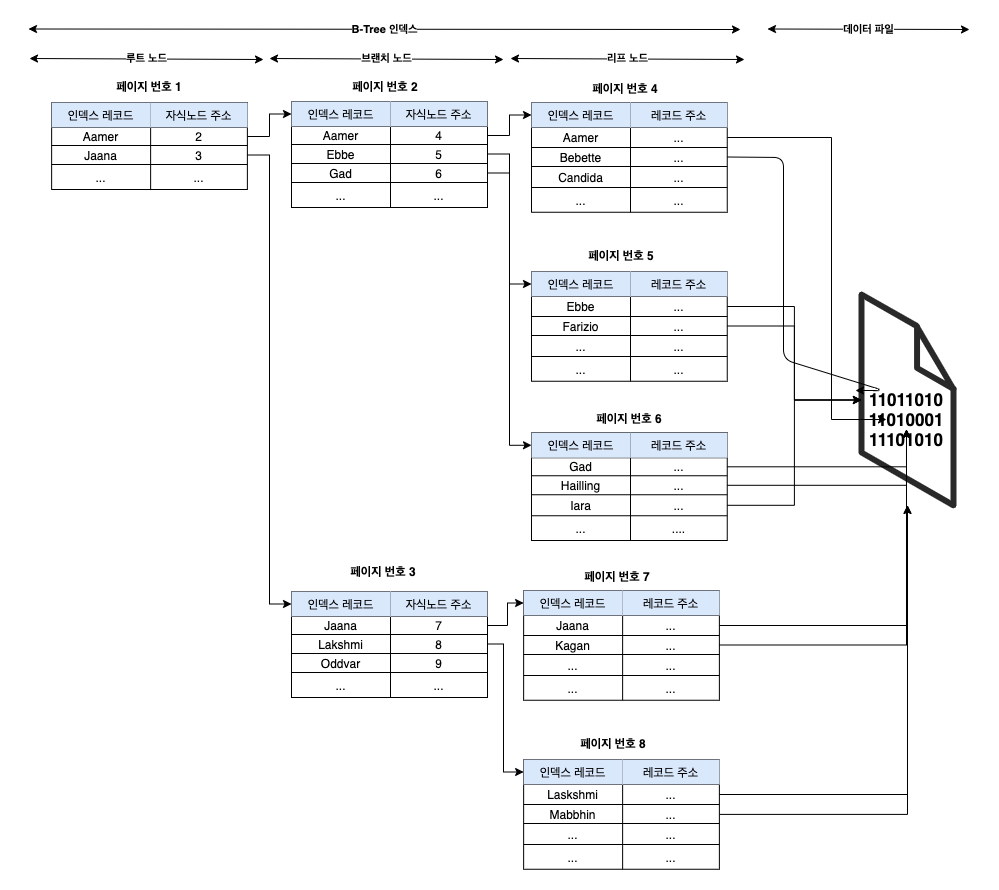

위와 같이 인덱스의 키값을 모두 정렬돼 있지만 데이터 파일의 레코드는 정렬돼 있지 않고 임이의 순서대로 저장돼 있다. 데이터 파일이 레코드의 INSERT 순서대로 저장되는 것으로 생각하지만 그렇지 않다. 만약 테이블의 렠코드를 전혀 삭제나 변경 없이 INSERT만 수행한다면 맞을 수도 있다. 하지만 레코드가 삭제되어 빈 공간이 생기면 그다음의 INSERT는 가능한 삭제된 공간을 재활용되도록 DBMS가 설계되기 때문에 항상 INSERT된 순서로 저장되는 것은 아니다.

> 참고
> 대부분의 RDBMS의 데이터 파일에서 레코드는 특정 기준으로 정렬되지 않고 임으의 순서대로 저장된다. 하지만 InnoDB 테이블에서 레코드는 클러스터되어 디스크에 저장되므로 기본적으로 프라이머리 키 순서대로 정렬되어 저장된다. 이는 오라클의 IOT, MS-SQL 클러스터 테이블과 같은 구조를 말한다. **다른 DBMS에서는 클러스터링 기능이 선택 사항이지만, InnoDB에서는 사용자가 별도의 명령이나 옵션을 선택하지 않아도 기본으로 클러스터링 테이블이 생성된다. 클러스터링이란 비슷한 값들은 최대한 모아서 저장하는 방식을 의미한다.**

**인덱스는 테이블의 키 칼럼만 가지고 있으므로 나머지 칼럼을 읽으려면 데이터 파일에서 해당 레코드를 찾아야하다. 이를 위해 인덱스의 리프 노드는 데이터 파일에 저장된 레코드의 주소를 가지게 된다.**


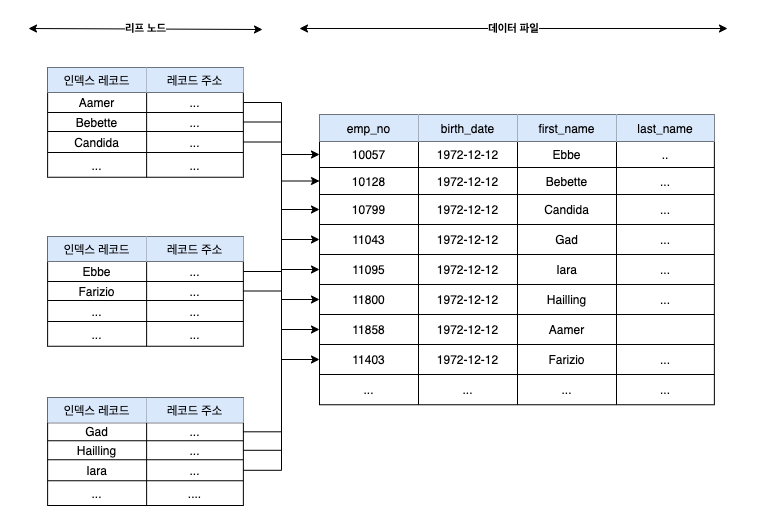

**위 그림에서 레코드 주소는 DBMS 종류나 MySQL의 스토리지 엔진에 따라 의미가 달라진다.** 오라클은 문리적인 레코드 주소가 되지만 MyISAM 테이블에서는 내부적인 레코드의 아이디 번호를 의미한다. **그리고 InnoDB 테이블에서는 프라이머리 키에 의해 클러스터링되기 때문에 프라이머리 키 값 자체가 주소역할을 한다. MySQL 테이블의 인덱스는 항상 인덱스 칼럼 값과 주소 값 (MyISAM의 레코드 아이디 값 또는 InnoDB의 프라이머리 키값)의 조합이 인덱스 레코드로 구성된다.**

### B-Tree 인덱스 키 추가 및 삭제

테이블의 레코드를 저장하거나 변경하는 경우, 인덱스 키 추가나 삭제 작업이 발생한다. 인덱스 키 추가나 삭제가 어떻게 처리 되는지 알아두면 쿼리의 성능을 쉽게 예측할 수 있다.

#### 인덱스 키 추가
새로운 키값이 B-Tree에 저장될 때 테이블의 스토리지 엔진에 따라 새로운 키값이 즉시 인덱스에 저장될 수도 있고 그렇지 않을 수도 있다. B-Tree에 저장될 때는 저장될 키값을 이용해 B-Tree상의 적절한 위치를 검색해야 한다. 저장될 위치가 결정되면 레코드의 키값과 대상 레코드의 주소 정보를 B-Tree의 리프 노드에 저장한다. **만약 리프 노드가 꽉 차서 더는 저장할 수 없을 때는 리프 노드가 분리홰야 하는데, 이는 상위 브랜치 노드까지 처리의 범위가 넒어 진다. 이러한 작업 탓에 B-Tree는 상대적으로 쓰기 작업(새로운 키를 추가하는 작업)에 비용이 많이 드는 것으로 알려져있다.**

인덱스 추가로 인해 INSERT, UPDATE 문장이 어떤 영향을 받을지 궁금해하는 사람이 많다. 하지만 이 지물에는 명확하게 답하려면 테이블의 칼럼 수, 칼럼의 크기, 인덱스 칼럼의 특성 등을 확인해야 한다. **대략적으로 계산하는 방법은 테이블에 레코드를 추가하는 작업 비용이 1이라고 가정하면 해당 테이블의 인덱스에 키를 추가하는 작업 비용을 1~1.5 정도로 예측하는 것이 일반적이다.** 일반적으로 테이블에 인덱스가 3개(테이블의 모든 인덱스가 B-Tree라느 가정하에)가 있다면 이때 테이블에 인덱스가 하나도 없는 경우는 작업 비용이 1이고, 3개인 경우에는 5.5정도(1.5 * 3 +1) 정도로 예측해 볼 수 있다. 중요한 것은 **이 비용은 대부분의 메모리와 CPU에서 처리하는 시간이 아니라 디스크로부터 인덱스 페이지를 읽고 쓰기를 해야 하기 때문에 시간이 오래걸린다는 것이다.**

MyISAM, Memory 스토리지 엔진을 사용하는 테이블에서는 INSERT 문장이 실행되면 즉시 새로운 키값을 B-Tree 인덱스에 반영한다. **즉 B-Tree에 키를 추가하는 작업이 완료될 때까지 클라이언트는 쿼리의 결과를 받지 못하고 기다리게 된다.**


**InnoDB 스토리지 엔진은 이 작업을 조금 더 지능적으로 처리하는데, 위 이미지 처럼 적적하게 인덱스 키 추가 작업을 지연시켜 나중에 처리할지, 아니면 바로 처리할지 결정한다.**

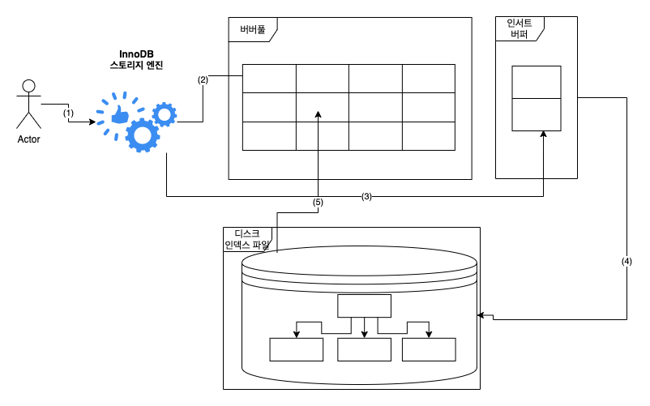

* (1) 사용자의 쿼리 실행
* (2) InnoDB의 버퍼 풀에 새로운 키값을 추가해야 할 페이지(B-Tree의 리프 노드)가 존재한다면 즉시 키 추가 작업을 처리
* (3) 버퍼 풀에 B-Tree의 리프 노드가 없다면 인서트 버퍼에 추가할 키값과 레코드의 주소를 임시로 기록해두고 작업 완료(사용자의 쿼리는 실행 완료됨)
* (4) 백그라운드 작업으로 인덱스 페이지를 읽을 때마다 인서트 버퍼에 머지해야 할 인덱스 키값이 있는지 확인한 후, 있다면 병합함(B-Tree에 인덱스 키와 주소를 저장)
* (5) 데이터베이스 서버 자원의 여유가 있다면 MySQL 서버의 인서트 버퍼 머지 스레드가 조금씩 인서트 버퍼에 임시 저장된 인덱스 키와 주소 값을 머지(B-Tree에 인덱스 키와 주소를 저장) 시킴

InnoDB 5.5 이상의 버전에서는 INSERT뿐 아니라 DELETE 등에 의한 인덱스 키의 추가 및 삭제 작업까지 버퍼링해서 지연처리할 수 있게 긴으이 확장돼 었다. 5.5 이상 부터는 간련 설정 파라미터로 `innodb_change_buffering` 설정 값을 이용해 키 추가 작업과 키 삭제 작업 중 어느 것을 지연처리할지 설정 할 수 있다.

#### 인덱스 키 삭제
B-Tree의 키값이 삭제되는 경우는 상당히 간단하다. **해당 키값이 저장된 B-Tree의 리프 노드를 찾아서 그냥 삭제 마크만 하면 작업이 완료된다. 이렇게 삭제 마킹된 인데스 키 공간은 계속 그대로 방치하거나 또는 재활용할 수 있다.** 인덱스 키 삭제로 인한 마킹 작업 또는 디스크 쓰기가 필요하므로 이 작업 역시 디스크 I/O가 필요한 작업이다. MySQL 5.5 이상 버전의 InnoDB 스토리지 엔진에서는 이 작업 또한 버퍼링되어 지연 처리가 될 수 있다. 처리가 지연된 인덱스 키 삭제 또한 사용자에게는 특별한 악영향 없이 MySQL 서버가 내부적으러 처리하므로ㅓ 특별히 걱정할 것으 없다. MyISAM, Memory 스토리지 엔진의 테이블에서는 인서트 버퍼와 같은 기능이 없으므로 인덱스 키 삭제가 완료된 후 쿼리 실행이 완료 된다.

#### 인덱스 키 변경
**인덱스의 키 값은 그 값에 따라 저장될 리프 노드의 위치가 결정되므로 B-Tree의 키값이 변경되는 경우에는 단순히 인덱스상 키값만 변경하는 것은 불가능하다. B-Tree의 키값 변경 작업은 먼저 키값을 삭제한 후, 다시 새로운 키값을 추가하는 형태로 처리된다.**

#### 인덱스 키 검색
INSERT, UPDATE, DELETE 작업을 할때 인덱스 관리에 따르는 추가 비용을 감당하면서 인덱스를 구축하는 이유는 바로 빠른 검색을 위해서다. 인덱스를 검색하는 작업은 B-Tree의 루트 노드부터 시작해서 브랜치 노드를 거쳐 최종 리프 노드까지 이동하면서 비교 작업을 수행하는데, 이 과정을 트리 탐색 이라고 한다. 인덱스 탐색은 SELECT에서만 사용하는 것이 아니라 UPDATE< DELETE 처리하기 위해 항상 해당 레코드를 먼저 검색해야 할 경우에도 인덱스가 있으면 빠른 검색이 가능하다.

**B-Tree 인덱스를 이용한 검색은 100% 일치 또는 값의 앞부분만 일치하는 경에만 사용할 수 있다. 부등호 <> 비교나 값의 뒷부분이 일치하는 경우에는 B-Tree 인덱스 이용한 검색이 불가능하다. 또한 인덱스를 이용한 검색에서 중요한 사실은 인덱스의 키 값에 변형이 가해진 후 비교되는 경우에는 절대 B-Tree의 빠른 검색 기능을 사용할 수 없다는 것이다. 이미 변형된 값은 B-Tree에 존재하는 값이 아니다. 따라서 함수나 연산을 수행한 결과로 정렬한다거나 검색하는 작업은 B-Tree 장점을 이용할 수 없으므로 주의 해야한다.**

> 중요
> 인덱스의 키값에 변형이 가해진다는 것은 SUM, Min, Max 등 연산 및 정렬 작업을 말하는 걸로 생각됨
> 결과적으로 집계같은 것을 하면 인덱스를 탈수 없는 구조

InnoDB 스토리지 엔진에서는 인덱스는 더 특별한 의미가 있다. **InnoDB 테이블에서 지원하는 레코드 잠금이나 넥스트 키 락(갭 락)이 검색을 수행한 인덱스를 잠근 후 테이블의 레코드를 잠그는 방식으로 구현돼 있다. 따라서 UPDATE, DELETE 문장이 실행될 때 테이블에 적절히 사용할 수 있는 인덱스가 없으면 불필요하게 많은 레코드를 잠근다.** 심지어 테이블의 모든 레코드를 잠글 수도 있다. InooDB 스토리지 엔진에서는 그만큼 인덱스의 설계가 중요하고 많은 부분에 영향을 미친다.

### B-Tree 인덱스 사용에 영향을 미치는 요소
B-Tree 인덱스는 인덱스를 구성하는 칼럼의 크기와 레코드의 건수, 그리고 유니크한 인덱스 키값의 개수 등에 의해 검색이나 변경 작업의 성능이 영향을 받는다.

#### 인덱스 키값의 크기
InnoDB 스토리지 엔진은 디스크에 데이터를 저장하는 가장 기본 단위를 페이지 또는 블록이라고 하며, 디스크의 모든 읽기 및 쓰기 작업의 최소 작업 단위가 된다. 또한 페이지는 InnoDB 스토리지 엔진의 버퍼 풀에서 데이터를 버퍼링하는 기본 단위이기도 하다. 인덱스도 결국은 페이지 단위로 관리되며 위 B-Tree 그림에서 루트 브랜치와, 리프 노드를 구분하는 기준이 바로 페이지 단위다.

일반적으로 DBMS의 B-Tree 자식 노드의 개수가 가변적인 구조다. MySQL의 B-Tree는 자식 노드를 몇개까지 가질지 궁금할것이다.

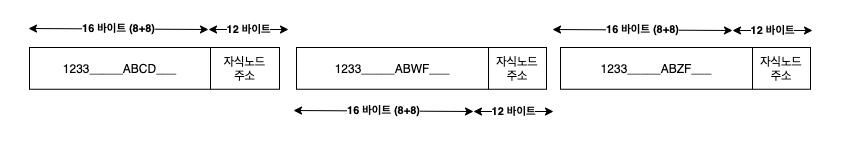

**인덱스의 페이지 크기와 키 값의 크기에 따라 결정된다. InnoDB의 모든 페이지 크기는 16KB로 고졍돼어 있다.** 자식 노드 주소라는 것은 여러 가지 복합적인 정보가 담긴 영역이먀, 페이지 정류별로 대략 6바이트에서 12바이트까지 다양한 크기의 값을 가지 수 있다. 여기서는 편의상 자식 노드의 주소 영역이 평균적으로 12 바이트라고 구성한다고 가정하자.

**하나의 인덱스 페이지(16KB)에 몇 개의 키를 저장할 수 있을까? 계산해보면 16*1024/(16+12) = 584개를 저장할 수 있다. 최종적으로 이 경우는 자식 노드를 585개를 가질 수 있는 B-Tree가 된느 것이다.**  만약 인덱스의 값이 커져 32 바이트로 늘어 나는 경우에는 16*1024/(32+12) = 372개 저장할 수있다.

**만약 SELECT 쿼리가 레코드 500개를 읽어야 한다면 전자는 인덱스 페이지를 한 번으로 해결될 수도 있지만, 후자는 최소한 2번 이상 디스크로부터 읽어야 한다.결국 인덱스를 구성하는 키값의 크기가 커지면 디스크로부터 읽어야하는 횟수가 늘어나고, 그만큼 느려진다는 것을 의미한다.**

또한 인덱스 키값의 길이가 길어진다는 것은 전체적인 인덱스의 크기가 커진다는 것을 의미한다. 하나지만 인덱스를 캐시해 두는 InnoDB의 버퍼 풀이나 MyISAM의 캐시 영역의 크기가 제한적이기 떄문에 하나의 레코드를 위한 인덱스 크기가 커지면 커질수록 메모리(버버 풀이나 키 캐시)에 캐시해 둘 수 있는 레코드 수는 줄어드는 것을 의미한다. 자연히 메모리 효율이 떨어지게 되는 결과를 가져 온다.

#### B-Tree 깊이
**B-Tree 인덱스의 깊이는 상당히 중요하지만 직접적으로 제어할 방법은 없다. 인덱스의 B-Tree의 싶이가 3인 경우 키값이 16바이트인 경우에는 최대 2억(585 * 585 *585)개 정도의 키값을 담을 수 있지만 키 값이 32바이트로 늘어나면 5천만개(372 * 372 * 372)로 줄어든다. MySQL에서 값을 검색할 때 몇번이나 랜덤하게 디스크를 읽어야하는지와 직결되는 문제다.** 결론적으로 인덱스 키값의 크기가 커지면 커질수록 하나의 인덱스 페이지가 담을 수 있는 인덱스 키값의 개수가 작아지고, 그 때문에 같은 레코드 건수라 하더라도 B-Tree의 깊이가 깊어져 디스크 읽기가 더 맘ㄴㅎ이 필요하게 된다는 것을 의미한다.

물론 실제로는 아무리 대용량의 데이터베이스라도 B-Tree의 깊이가 4~5 이상까지 깊어지는 경우는 겅의 발생하지 않는다. 


#### 선택도(기수성)
#### 읽어야 하는 레커드의 건수

### B-Tree 인덱스를 통한 데이터 읽기

#### 인덱스 레인지 스캔
#### 인덱스 풀 스캔
#### 루스 인덱스 스캔

### 다중 칼럼 인덱스

### B-Tree 인덱스의 정렬 및 스캔 방향

#### 인덱스의 정렬
#### 인덱스 스캔 방향 

### B-Tree 인덱스의 기용성과 효율성

#### 비교 조건의 종류와 효율성

#### 인덱스의 가용성
#### 가용성과 효율성 판단 


# 06 실행 계획

# 07 쿼리 작성 및 최적화

# 08 확장 기능

# 09 사용자 정의 변수

# 10 파티션

# 11 스토어드 프로그램

# 12 쿼리 종류별 잠금

# 13 프로그램 연동

## 자바
자바 프로그램 언어로 MySQL 데이터베이스에 접속해서 SQL을 실행하려면 자바에서 제공하는 표준 데이터베이스 접속 API인 JDBC를 이용 해야한다. 자바에서 제공하는 JDBC는 사실은 껍대기 Inerface일 뿐이며, 실제 각 DBMS에 접속해 필요한 작업을 하는 알맹이는 각 DBMS 제조사에서 제공하는 JDBC 드라이버다.

## MySQL Connector/J 를 이용한 개발

### MySQL 서버 접속
Connector/J를 이용해 MySQL 서버에 접속하려면 JDBC URL 이라는 개념을 알아야 한다. 여기서 URL은 일반적으로 HTTP, FTP에서 사용하는 URL이 아니라 접속할 MySQL 서버의 정보를 표준 포맷으로 조합한 문자열이다. 때로는 이를 커넥션 스트링이라고 표현하기도 한다. MySQL Connector/J를 이용해 MySQL ConntorJ를 이용해 MySQL 서버에 접속하는 예제를 보자.

```java
public class JdbcTest {

    public static void main(String[] args) throws Exception {
        final Connection con;
        try { // 6
            con = (new JdbcTest()).getConnection();
            System.out.println("Connection is ready");
            
            con.close(); // 5
        } catch (SQLException ex) { // 7
            System.out.println("Connection Failed");
        }
    }

    public Connection getConnection() throws Exception {
        final String driver = "com.mysql.cj.jdbc.Driver"; // 1
        final String url = "jdbc:mysql://localhost:3366/test_db"; // 2
        final String user = "root"; 
        final String password = "";

        Class.forName(driver).newInstance(); // 3
        return DriverManager.getConnection(url, user, password); // 4
    }
}
```

1. MySQL 서버 접속을 위해 JDBC URL을 설정
2. 현재는 없지만 성능이나 작동 방식을 변경하기 위해 Connctor/J에 별도의 옵션을 설정해야 할때 이 때는 ?를 표시히고 키/값 쌍으로 변수 값으로 사용
3. MySQL JDBC 드라이버 클래스의 로딩이 정상적으로 완료되면 DriverManager.getConnection() 명령어를 이용해 애플리케이션 MySQL 
4. 자바에서 많은 자원이나 변수가 자동으로 소멸되지만 데이터베이스 커넥션과 같은 네트워크 자원은 사용이 끝나면 즉시 해제하는 것이 좋다. 특히 데이터베이스 커넥션과 같은 자원은 프로그램 코드에서 사용 직전에 가져와서, 사용이 완료됨과 동시에 바납하는 것이 좋다.
5. `con.close()` 명령어를 이용해 커넥션을 종료 하고 있다.
6. `try-catch` 예외 처리를 한다. 오류가 발생하면 로깅이나 재처리 코드를 작성하는 것이 좋다
7. 애플리케이션을 재처리 과정을 구현할 때는 `getSQLState()`, `getErrorCode()` 함수를 이용해 지정된 에러 코드로 예외 상황을 판단하는 것이 좋다.

### select 실행
```sql
public static void main(String[] args) throws Exception {
   Connection connection = null;
   Statement statement = null;
   ResultSet resultSet = null;
   try { // 6
      connection = (new JdbcTest()).getConnection();
      System.out.println("Connection is ready");

      statement = connection.createStatement(); // (1)
      resultSet = statement.executeQuery("select *from payment limit 2;"); // (2)

      while (resultSet.next()) { // (3)
            System.out.println("["+ resultSet.getString(1) +"]" + "["+ resultSet.getString("id") +"]"); // (4)
      }

      connection.close();
   } catch (SQLException ex) {
      System.out.println("Connection Failed");
   } finally {
      try { if (resultSet != null) resultSet.close(); } catch (SQLException ex) { }
      try { if (statement != null) statement.close(); } catch (SQLException ex) { }
      try { if (connection != null) connection.close(); } catch (SQLException ex) { }
   }
}
```
**(1) Statement 객체는 JDBC를 사용하는 애플리케이션에서 모든 SQL문과 DDL 문장을 실행하는데 필요한 객체다.** 그리고 이와 비슷한 방식으로 사용하지만 프리페어 스테이트먼트를 실행할 때 사용하는 PreparedStatement 객체와 스토어드 프로시저를 실핼할 때 사용하는 CallableStatement 객체도 있다.

Statement 클래스는 `execute()`, `executeQuery()`, `excetueUpdate()`라는 세 가지 주요 함수를 제공한다. 결과 셋을 반환하 SELECT 쿠리 문장은 `executeQuery()` 함수를 사용하며, 결과 셋을 반환하지 않는 INSERT, UPDATE, DELETE, DDL 문장은 `executeUpdate()` 함수를 이용한다. 만약 실행 쿼리가 SELECT 인지 INSERT 인지 모를 때는 `exceute()` 함수를 이용할 수있다.

**(2)는 `excuteQuery()` 함수는 스토어는 프로시저에서 살펴본 커서와 거의 비슷한 기능을 제공하는 ResultSet 이라는 객체를 반환한다. 즉시 SELECT 쿼리의 결과를 필드 단위로 하나씩 페치할 수 있는 기능을 제공하는 객체다.**

ResultSet의 `next()` 함수는 결과 셋에 아직 읽지 않은 레코드가 더 있는지 확인할 수 있게 해준다. (3)만약 아직 읽지 않은 레코드가 남아 있다면 ResultSet의 `getString()`, `getInt()` 등의 함수를 이용해 칼럼 값을 가져올 수 있다. 칼럼 이름이나 SELECT 절에 나열된 칼럼의 순번을 인자로 해서 `getString()`, `getInt()` 등의 함수로 칼럼 값을 가져올 수 있다.

### INSERT/UPDATE/DELETE 실행

**SELECT 쿼리와는 달리 INSERT, UPDATE, DELETE 문장은 별도의 결과 셋을 반환하지 않으므로 `Statement.executeQuery()`함수 대신 `Statement.executeUpdate()` 함수를 사용해서 실행한다.** DDL이나 MySQL의 SET 명령과 같이 결과 셋을 변환하지 않는 SQL 명령으 모두 `excecuteUpdate()` 함수를 사용해 실행할 수 있다.

`excecuteUpdate()` 함수는 INSERT, UPDATE, DELETE 문장에 의해 변경된 레코드 건수를 반환한다. `excecuteUpdate()` 함수의 반환값은 별도로 확인하지 않고 무시해버릴 때가 많다. 하지만 실제로 DELETE 쿼리로 단 한 건만 삭제돼야 하는데, 한 건도 삭제되지 않았거나 두 건 이상의 레코드가 삭제됐다면 어떻게 해야할까? 만약 이런 상황에 문제가 될 수지가 있다면 변경된 레코드 건수를 체크해서 COMMIT이나 ROLLBACK을 수행하게 해주는 것이 좋다.

```java
public static void main(String[] args) throws Exception {
   Connection connection = null;
   Statement statement = null;
   ResultSet resultSet = null;
   int affectedRowsCount = 0;
   try {
      connection = (new JdbcTest()).getConnection();
      connection.setAutoCommit(false); // (1)
      statement = connection.createStatement();

      affectedRowsCount = statement.executeUpdate("UPDATE payment SET amount = 1.00 WHERE id = -1;"); // (2)

      if(affectedRowsCount == 1) { // (3)
            System.out.println("변경 성공");
            connection.commit();
      }else{
            System.out.println("변경 실패");
            connection.rollback();
      }

      connection.close();
   } catch (SQLException ex) {
      System.out.println("Connection Failed");
   } finally {
      try { if (resultSet != null) resultSet.close(); } catch (SQLException ex) { }
      try { if (statement != null) statement.close(); } catch (SQLException ex) { }
      try { if (connection != null) connection.close(); } catch (SQLException ex) { }
   }
}
```
`connection.setAutoCommit(false);` 함수를 먼저 호출 했다. **MySQL에서는 매 쿼리가 정상적으로 실행되면 자동으로 트랜잭션 COMMIT된다. 이를 AutoCommit 이라고 표현하는데, 별도로 AutoCommit 모드를 변경하지 않았다면 이것이 기본 작동 모드다. 만약 하나의 트랜잭션으로 여러 개의 UPDATE, DELETE 문장을 묶어서 실행하려면 AutoCommit 모드를 FALSE로 설정해야 한다.** `connection.setAutoCommit(false);` 명령은 MySQL 서버가매 쿼리마다 자동으로 COMMIT을 실행하지 않도록 AutoCommit 모드를 FALSE로 변경하는 것이다.

`executeUpdate()` 실행하고 UPDATE 문장의 실행으로 변경된 레코드 건수를 affectedRowsCount 변수에 할당한다. 위 문장은 PK 값으로 변경하기 때문에 반드시 한 건만 변경됐는지 체크하기 위해 affectedRowsCount에 할당된 값이 1인지 비교해서 최종적으로 UPDATE 작업을 COMMIT할지 ROLLBACK할지 결정한다. **만약 변경하려는 작업이 기존 값과 똑같다면 실질적인 변경 작업을 생략해버린다.**

### Statement와 PreparedStatement의 차이
Statement와 PreparedStatement의 차이를 알아보려면 우선 MySQL 서버가 쿼리를 처리하는 각 단계를 이해 해야한다. MySQL 서버가 쿼리를 실행하기 위한 테스크를 간한하게 표현하면 다음과 같다. **MySQL 서버로 쿼리를 요청하면 MySQL 서버는 쿼리를 분서해 파스 트리를 만들고 그 정보를 분석해 권한 체크나 쿼리의 최적화 작업을 수행한다. 그리고 최종적으로 준비된 쿼리의 실행을 실행 계획을 이용해 쿼리를 실행한다.**


**자바 프로그럄에서 Statement로 실행되는 쿼리는 위의 단계를 매번 거쳐 쿼리가 실행되는데, 쿼리 분석이나 최적화와 같은 작업은 상대적으로 시간이 걸리는 작업이다. 하지만 PreparedStatement를 사용하면 쿼리 분석이나 최적화의 일부 작업을 처음 한번만 수행해 별도로 저장해 두고, 다음부터 요청되는 쿼리는 저장된 분석 결과를 재사용 한다.** 이렇게 함으로써 매번 쿼리를 실행할 때 마다 거쳐야 했던 쿼리 분석이나 최적화의 일부 작업을 건너 뛰고 빠르게 처리할 수 있는 것이다.

프리페어 스테이트먼트를 사용할 때 쿼리의 분석 정보를 MySQL 서버의 메모리에 저장해둔다. 만약 당므과 같은 쿼리의 모든 부분은 똑같지만 WHERE 절의 상수 값만 다른 쿼리가 PreparedStatement를 이용해 100번을 실행한다고 가정해보자

```sql
SELECT * FROM employees WHERE emp_no = 10001;
SELECT * FROM employees WHERE emp_no = 10002;
SELECT * FROM employees WHERE emp_no = 10003;
```

**똑같은 패턴의 쿼리임에도 MySQL 서버에서는 100개의 쿼리 분석 결과를 보관해야 한다. 이런 부분을 보안 하고자 PreparedStatement에서 쿼리에 변수를 사용할 수있다.**  다음 예제에서는 WHERE 조건의 상수가 `?`로 대체된 것을 확인할 수 있다.

```sql
SELECT * FROM employees WHERE emp_no = ?;
```
PreparedStatement에서 `?`는 바인딩 변수 또는 변수 홀더라고 표현하는데, 실제 쿼리를 실핼할 때는 변수 대신에 상수 값을 대입해야 한다. **이렇게 바인딩 변수를 사용하면 쿼리를 최대한 템플릿화할 수 있고, 템플릿화된 쿼리는 상수 값을 직접 사용한 쿼리보다 쿼리 문장의 수를 대폭적으로 줄일 수 있게 만들어준다.** 상수를 직접 사용할 때는 쿼리 문장이 100개가 필요했지만 쿼리를 템플릿화한 다음에는 하나로 줄어들었다. **애플리케이션에서 사용하는 쿼리 문장의 개수가 줄어든다는 것은 MySQL 서버에서 보관해야 하는 쿼리의 분석 정보가 줄어들어 메모리 사용량을 줄일 수 있다는 의미이기도 하다.** 이렇게 변수를 사용하는 쿼리를 프리페어 스테티트먼트 또는 바인딩 쿼리라고 하고, 바인딩 변수 없이 상수만 사용하는 쿼를 동적 쿼리 또는 다이나믹 쿼리라고 한다.

```java
public static void main(String[] args) throws Exception {
   Connection connection = null;
   PreparedStatement statement = null;
   ResultSet resultSet = null;
   try {
      connection = (new JdbcTest2()).getConnection();
      statement = connection.prepareStatement("select *from payment where id = ?"); // (1)
      statement.setInt(1, 1);
      resultSet = statement.executeQuery();
      if(resultSet.next()){
            System.out.println("id: " +resultSet.getString("id"));
      }
      resultSet.close();

      statement.setInt(1, 2); // (2)
      resultSet = statement.executeQuery();
      if(resultSet.next()){
            System.out.println("id: " +resultSet.getString("id"));
      }
      resultSet.close();
      resultSet = null;

   } catch (SQLException ex) {
      ex.printStackTrace();
      System.out.println("Connection Failed");
      System.out.printf(ex.getMessage());
   } finally {
      try { if (resultSet != null) resultSet.close(); } catch (SQLException ex) { }
      try { if (statement != null) statement.close(); } catch (SQLException ex) { }
      try { if (connection != null) connection.close(); } catch (SQLException ex) { }
   }
}
```

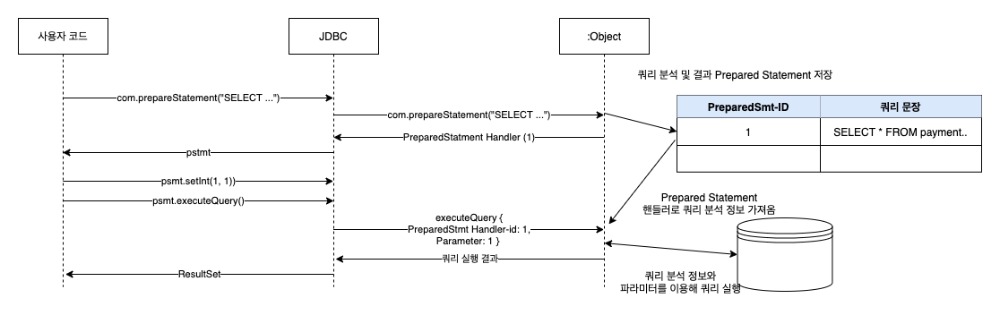

PreparedStatement를 사용할 때는 SQL 쿼리 문장을 이용해 PreparedStatement 객체를 먼저 준비 해야한다. 위 예제에서는 `connection.prepareStatement("select *from payment where id = ?")` 함수를 호출하면 Connector/J는 주어진 SQL 문장을 서버로 전송해서 쿼리를 분석하고 그 결과를 저장해서 저장해둔다.`(1)`

**그리고 MySQL서버는 쿼리의 분석 결과의 포인터와 같은 해시 값을 Connector/J로 변환한다. Connector/J는 반환 받은 해시 값을 이용해 PreparedStatement 객체를 생성한다. 이렇게 생성된 PreparedStatement는 바인딩 변수의 값만 변경하면 계속해서 사용하게 된다.`(2)` 하지만 MySQL 서버는 이미 이 쿼리 패턴에 대한 분석 정보를 가지고 있으므로 매번 쿼리를 분석하지 않고 단축된 경로로 쿼리를 실행하기 때문에 Statement 보다 빠르게 처리된다.**

애플리케이션에서 실행하려는 쿼리와 함께 preparedStatement() 함수를 호출하면 MySQL 서버는 그 쿼리를 미리 분석해서 별도로 저장해두고, 분석 정보가 저장된 주소(해시 키)를 애플리케이션으로 반환한다. **이렇게 PreparedStatement를 이용해 쿼리를 실행하면 애플리케이션에서 쿼리 문장을 서버로 전달하지 않고 분석 정보가 저장된 주소(해시 키)와 쿼리에 바인딩할 변수 값만 서버로 전달한다.** MySQL 서버는 전달받은 해시 키를 이용해 분석 정보를 찾아 전달된 바인드 변수를 결합하고 쿼리를 실행한다.

**결론적으로 PreparedStatement의 성능적인 장점은 한 번 실행된 쿼리는 매번 쿼리 분석 과정을 거치지 않고 처음 분성된 정보를 재사용한다는 점이다.** SQL 문장의 길이가 길어서 성능상의 문제가 되는 경우는 그다지 없겠지만 **매번 쿼리를 실행할 때 SQL 문장 자체가 네트워크로 전송되지 않고 바인딩할 변수 값만 전달되므로 네트워크, 트래픽 측면에서도 조금은 효율적이라고 볼 수있다.**

**PreparedStatement의 또 다른 장점은 바이너리 프로토콜을 사용한 다는 것이다.** 초기 MySQL Connctor/J 버전에서는 모든 Statement, PreparedStatement가 클라어은트(JDBC)와 서버(MySQL) 간의 통신에서 문자열 기반의 프로토콜을 사용했다. 그래서 사용자 프로그램에서 타입을 지정해서 값을 설정하더라도 내부적으로 MySQL 서버에 전송하기 위해 문자열 타입으로 데이터를 변환했으며, 서버에서는 다시 그 문자열 값을 지정된 타입으로 변환하는 과정을 거쳐야 했다. **즉 내부적으로 불 필요한 타입 변환을 수행했으며, 그로인해 데이터의 크기가 커지는 문제가 발생했던 것이다. 하지만 MySQL 5.0 이상에서는 PreparedStatement를 사용하면 별도의 타입 변환을 수행하지 않는 바이너리 통신 프로토콜을 사용하게 된다.** 하지만 Statement 객체를 사용하면 바이너리 통신 프로토콜을 사용하지 않고 예전과 같은 문자열로 변환해서 통신한다. PreparedStatement의 또 다른 장점은 SQL 인젝션의 문제도 손쉽게 해결 가능하다. **PreparedStatement를 사용해 코드를 개발하면 아스케이프 문자 처리를 MySQL Connctor/J에서 대신해 처리해 주므로 개발자가 직접 이러한 부분을 고려하지 않아도 된다.**

### 프리페어 스테이트의 종류

MySQL Connctor/J의 프리페어 스테이트먼트에서 서버 프리페어 스테이트먼트라는 기능이 있다. 그와 반대의 개념인 클라이언트 프리페어 스테이트먼르도 있다. **이전 글에서 언급한 프리페어 스테이트먼트의 장점은은 모두 서버 프리페어 스테이트먼트를 사용할 때 얻을 수 있는 장점이다.**

#### 클라이언트 프리페어 스테이트먼트
MySQL Connctor/J를 이용하는 자바 애플리케이션에서 PreparedStatement 객체를 이용해 변수가 포함된 SQL 문장을 실행할 때 Connctor/J가 자체적으로 SQL 문장을 바인딩 변수에 값을 맵핑해 하나의 완성된 SQL 문장으로 만들어 서버에 전송하는 방식이다. **이 방식을 이용하면 애플리케이션 개발자는 프리페어 스테이트먼트를 사용한다고 느기지만 실제로 MySQL 서버는 매번 쿼리 문장을 분석하고 실행 계획을 수립해 쿼리를 실 행한다.**

##### 서버 프리페어 스테이트먼트
MySQL의 서버 프리페어 스테이트먼트를 다른 DBMS에서는 일반적인 프리페어 스테이트먼트라고 표현한다. **MySQL에서 서버 프리페어 스테이트먼트를 시용하면 매번 쿼리를 실행할 때 마다 클라이언트 SQL 문장에 바인딩할 변수 값만 전송하고, MySQL 서버는 저장된 쿼리의 분석 정보에 변수 값을 바인딩해서 쿼리를 실행한다.**

**JDBC 표준에 프리페어 스테이트먼트 기능이 도입됐을 때 MySQL 서버에는 프리페어 스테이트먼트를 처리하는 기능이 없었다. 그래서 JDBC 표준의 프리페어 스테이트를 지원하기 위해 클라이언트에서 프리페어 스테이트먼트인 것처럼 에물레이트하는 기능이 필요했는데, 그것이 클라이언트 프리페어 스테이트먼트다.** MySQL 서버와 Connctor/J의 기능이 업그레이드되면서 JDBC 표준에서 제시하는 형태의 프리페어 스테이트먼트를 구현했는데, **이를 기존의 기능과 비교 하기 위해 서버 프리페어 스테이트먼트라는 이름으로 표현한 것이다.**

오라클과 같은 다른 DBMS에서는 당연히 프리페어 스테이트먼트를 사용하는 것이 효율적이지만 MySQL 에서는 그렇지 않다. **이는 MySQL의 쿼리의 분석 작업이 그다지 무겁지 않아서 프리페어 스테이트먼트를 줄어 드는 작업이 오라클보다 적기 때문이다. 또 다른 이유로는 MySQL 5.0 버전까지는 서버 프리페어 스테이트먼트를 사용하면 MySQL의 쿼리 캐시를 사용하지 못했기 때문이기도 했다.** 사실 MySQL 5.0 버전전까지는 프리페어 스테이트먼트로 얻을 수 있는 성능 햐상보다 쿼리 캐시로 얻을 수 있는 성능 향상이 더 컸다고 볼 수 있다. 하지만 MySQL 5.1 이상의 버전에서 프리페어 스테이트먼트로 실행되는 쿼리로 쿼리 캐시를 사용할 수 있게 개선됐다. **즉 프리페어 스테이트먼트의 장점과 MySQL 쿼리 캐시의 장점을 모두 활용할 수 있게 됐음으로 반드시 두 기능을 모두 사용허길 권장한다.**

한 가지 중요한것은 별도의 옵션 설정 없이 JDBC 커넥션을 생성하면 서버 프리페어 스테이트먼트 기능을 사용하지 못하고 클라이언트 프리페어 스테이트먼트로 동작한다는 것이다. 이는 MySQL에서 기존 버전과의 호환성을 위해 클라이언트 프리페어 스테이트먼트를 기본값으로 설정해 둔 탓이다.

```java
public Connection getConnection() throws Exception {
   final String driver = "com.mysql.cj.jdbc.Driver";
   final String url = "jdbc:mysql://localhost:3366/batch_study?useServerPrepStmts=true";
   final String user = "root";
   final String password = "";

   Class.forName(driver).newInstance();
   return DriverManager.getConnection(url, user, password);
}
```
서버 프리페어 스테이트먼트를 사용하려면 최초 커넥션을 생성하는 시점에 JDBC URL 부분에 `useServerPrepStmts=true` 옵션을 추가 해야한다. **MySQL Connctor/J의 커넥션 옵션을 추가하는 JDBC URL에 추가 해야한다. 이렇게 해야 서버 프리페어 스테이트먼트로 동작한다.**

### 프리페어 스테이트먼트 주의할점

**프리페어 스테이트먼트는 세션 단위로 관리되므로 애플리케이션에서 생성한 프리페어 스테이트먼트 객체는 하나의 MySQL 컨센션에서만 사용할 수 있다.** 그리고 MySQL의 프리페어 스테이트먼트에 관해 많이 잘못 이해하고 있는 부분이 있다. MySQL 서버에서는 자바나 C/C++로 개발된 애플리케이션에서 생성한 PreparedStatement 객체별로 SQL 분석 정보가 괸리된다.

```java
public static void main(String[] args) throws Exception {
      Connection connection = null;
      PreparedStatement statement = null;
      ResultSet resultSet = null;
      try {
         connection = (new JdbcTest3()).getConnection();
         PreparedStatement statement1 = connection.prepareStatement("select *from payment where id = ?");
         PreparedStatement statement2 = connection.prepareStatement("select *from payment where id = ?");
         PreparedStatement statement3 = connection.prepareStatement("select *from payment where id = ?");
      } 
      ...
   }
```

하나의 커넥션에서 똑같은 SQL 문장을 사용하는 프리페어 스테이트먼트 세 개를 생성했다. **하지만 MySQL 서버에서는 하나의 SQL의 분석 정보가 아니라 각 프리페어 스테이트먼트 별로 한 개씩 SQL 분석 정보가 생성된다.** 결국 MySQL 서버에도 똑가이 세 개의 분석 정보가 생성되는 것이다. **하나의 커넥션에서 똑같은 SQL 문장을 사용하면 MySQL 서버에서 SQL 분석 정보가 공유될 것으로 예상하지만 그렇지 않는 것이다.**

웹 프로그램에서는 사용자의 요청이 오면 요청의 종류별로 처리를 담당하는 단위 프로그램이 개발된다. 흔히 커넥션을 커넥션 풀로 사용하므로 각 단위 프로그램이 공유 되지만 Statement나 PreparedStatement는 매번 각 단위 프로그램에서 생성하고 더는 필요하지 않으면 close하는 형태로 사용된다. **위의 간단한 예제에서도 확인했듯이 각 단위 프로그램에서 매번 PreparedStatement를 생성해서 한번 쿼리를 실행하고 PreparedStatement를 폐기한다면 프리페어 스테이트먼트의 장점인 분석 정보 재활용의 효과는 얻지 못하는 것이다.**

```sql
set @@global.show_compatibility_56 = ON;

select *
from information_schema.GLOBAL_STATUS
where VARIABLE_NAME in (
                        'Com_stmt_prepare',
                        'Com_stmt_execute',
                        'Prepared_stmt_count'
    )
;
```

| VARIABLE\_NAME        | VARIABLE\_VALUE |
| :-------------------- | :-------------- |
| COM\_STMT\_EXECUTE    | 2264            |
| COM\_STMT\_PREPARE    | 798             |
| PREPARED\_STMT\_COUNT | 268             |

1. `COM_STMT_PREPARE`: 서버 사이드 프리페어 스테이트먼트에서 Connection.prepareStatement() 함수 호출에 의해 PreparedStatement 객체가 만들어진 횟수
2. `COM_STMT_EXECUTE`: 서버 사이드 프리페어 스테이트먼트에서 Connection.execute().executeUpdate().executeQuery() 함수 호출에 의해 PreparedStatement 쿼리가 실행된 횟수
3. `PREPARED_STMT_COUNT`: MySQL 서버에   현재 만들어져 있는 프리페어 스테이트먼트 객체의 수
   
이 상태 값을 이용해 위의 결과를 해석해 보면 MySQL 서버가 시작된 이후로 프리페어 스테이트먼트를 생성하기 위해 전체 798번 SQL 문장이 분석 됐다. 그리고 준비된 프리페어 스테이트먼트는 2264번 실행 됐으며 현재와 비교해 본다면 Connection.preparedStatement()가 798번 호출 됐음을 알 수 있다. 이를 자바 프로그램 언어의 함수와 비교해본다면 Connection.preparedStatement()가 789번 호출됐으며 PreparedStatement.execute()와 executeQuery(), executeUpdate() 전체가 2264번 호출됐음을 의미한다.
만약 마이바티스, 하이버네이트 등과 같은 ORM 도구나, JDBC 프레임워크를 사용한다면 이런 정보를 분석해 정상적으로 서버 프리페어 스테이트먼트를 사용하는지 알아보고, 원하는 바대로 사용되도록 튜닝하는 것이 좋다.

### 배치 처리

MySQL에서 많은 데이터를 한꺼번에 INSERRT하기 위해 배치 형태로 INSERT 문장으로 실행하는 것이 가능하다.

```sql
INSERT INTO MEMBER VALUES
   (1, "AAA"),
   (2, "BBB"),
   (3, "CCC"),
   (4, "DDD")
;
```
JDBC 드라이버에서 제공하는 `addBatch()`, `executeBatch()` 함수를 이용해 평범한 INSERT 문장을 모아서 한 번의 INSERT 문장으로 실행할 수 있다.

```java
public class JdbcTest4 {

    public static void main(String[] args) throws Exception {
        Connection connection = null;
        PreparedStatement statement = null;
        try {
            connection = (new JdbcTest4()).getConnection();
            statement = connection.prepareStatement("INSERT INTO payment (amount, order_id, created_at, updated_at) VALUES (?, ?, now(), now())"); 

            for (int i = 0; i < 10; i++){
                statement.setLong(1, 1);
                statement.setLong(2, 1);
                statement.addBatch(); // (2)
            }
            statement.executeBatch(); // (3)

        } catch (SQLException ex) {
            ex.printStackTrace();
            System.out.println("Connection Failed");
            System.out.println(ex.getMessage());
        } finally {
            try { if (statement != null) statement.close(); } catch (SQLException ex) { }
            try { if (connection != null) connection.close(); } catch (SQLException ex) { }
        }
    }

    public Connection getConnection() throws Exception {
        final String driver = "com.mysql.cj.jdbc.Driver";
        final String url = "jdbc:mysql://localhost:3366/batch_study?rewriteBatchedStatements=true&useServerPrepStmts=false"; // (1)
        final String user = "root";
        final String password = "";

        Class.forName(driver).newInstance();
        return DriverManager.getConnection(url, user, password);
    }
}
```
**JDBC 커넥션을 생성할 때 `(1)`코드 처럼 `rewriteBatchedStatements` 옵션을 true로 설정하면 MySQL Connctor/J가 `addBatch()` 함수로 누적된 레코드를 모아 다음과 같은 형태의 구문으로 실행한다.**

```sql
INSERT INTO payment (amount, created_at, order_id, updated_at)
VALUES (0.00, '2021-06-05 13:41:37', 1, '2021-06-05 13:41:37'),
       (0.00, '2021-06-05 13:41:37', 1, '2021-06-05 13:41:37'),
       (0.00, '2021-06-05 13:41:37', 1, '2021-06-05 13:41:37')
;
```
**`rewriteBatchedStatements`가 활성회 되려면 `useServerPrepStmts`는 비활성화해야 한다. 그렇지 않으면 JDBC 프로그램이 오작동을 일으킬 때가 많다.**

위의 예제에서 INSERT 문장으로 처리되는데 레코드 하나의 평군 크기는 대략 375 바이트 정도였다. 만약 애플리케이션에서 INSERT를 배치 형태로 처리할 때 는 `executeBatch()` 함수로 실제 쿼리 실행하기 전에 `addBatch()`를 몇 번 실행하냐가 중요하다. 배치를 실행할 때 한 번에 몇 개의 레코드를 배치로 실행할 것이 최적인지는 다음과 같이 간단하 계산해보며 된다.

```
배치 적정 레코드 건수 = (12 * 1024) / (평균 레코드 크기)
```
이러한 형태로 배치를 만들어 실행하는 경우 LOAD DATE INSERT 보다는 빠르진 않겠지만 상대적으로 빠른 속도로 데이터를 적재하는 배치 프로그램 만들어 낼 수도 있다.

### 트랜잭션

어떤 DBMS를 어떤 용도로 사용하든 하나의 단위 처리가 쿼리 하나로 완료되는 작업은 거의 없다. 배부분 INSERT와, UPDATE, DELETE 등 쿼리가 여러 번 사용되어 하나의 처리가 완료된다. 이 작업을 원자성으로 처리돼야 하는 것들이 일반적이다. 즉 모두 완벽하게 처리되거나 모두 변경 이전의 상태로 100% 돌아가든 둘 중 하나이다. 이는 데이터 정합성 측면에서 아주 중요한 원칙이다.

MySQL Connctor/J를 이용해 트랜잭션을 시작하고 종료하는 방법을 살펴보겠다. 기본적으로 MySQL Connctor/J를 이용할 때 트랜잭션 관련해서 아무런 설정 하지 않으면 자동적으로 AutoCommit 모드에서 트랜잭션을 처리한다. AutoCommit 모드에서 각 스토리지 엔진별로 다음과 같이 쿼리가 처리 된다. **InnoDB 테이블에 대해서는 쿼리 하나하나에 대해서 트랜잭션이 보장되지만 연속해서 실행되는 쿼리의 묶음에 대해서는 트랜잭션이 보장되지 않는다.**

**MyISAM, MEMORY 테이블은 AutoCommit의 모드와 관계 없이 항상 트랜잭션이 보장되자 않는다. 이 테이블에서 쿼리 하나에 대해서도 트랜잭션이 보장되지 않는는다.** 즉 MyISAM 테이블에서 UPDATE 쿼리 문장으로 10건의 레코드를 업데이트하는 중에 다른 커넥션에서 해당 쿼리의 실행을 중단한다거나 갑작스러운 문제로 업데이트 작업이 멈추면 반쯤 실행된 상태로 그대로 남게 된다. **일부는 변경되고 일부는 변경되지 않은 상태로 남는 것이다.**

**다음의 트랜잭션 사용 예제는 InnoDB 테이블에 대해서만 사용할 수 있으며 MyISAM, MEMORY 테이블 테이블에 대해서는 적용되지 않는다.**

```java
public static void main(String[] args) throws Exception {
   Connection connection = null;
   Statement statement = null;
   ResultSet resultSet = null;
   try {
      connection = (new JdbcTest()).getConnection();
      connection.setAutoCommit(false); // (1)
      statement = connection.createStatement();

      statement.executeUpdate("UPDATE payment SET amount = 1.00 WHERE id = 1;");
      statement.executeUpdate("UPDATE payment SET amount = 1.00 WHERE id = 2;");
      connection.commit();
   } catch (SQLException ex) {
      connection.rollback();
   } finally {
      try { if (resultSet != null) resultSet.close(); } catch (SQLException ex) { }
      try { if (statement != null) statement.close(); } catch (SQLException ex) { }
      try { if (connection != null) connection.close(); } catch (SQLException ex) { }
   }
}
```

**원자적으로 실행해야 할 여러 쿼리를 `connection.setAutoCommit(false)`와 `conn.commit()` 함수 사이에서 실행하면 그 사이의 모든 쿼리는 하나의 트랜잭션으로 묶이게 된다.** 이렇게 하나로 묶인 트랜잭션의 내의 모든 쿼리는 성공하거나 모두 실패하는 형태로만 가능해진다.

`connection.setAutoCommit(false)`를 이용해 AutoCommit 모드를 FALSE로 변경하는 작업에 대해서 조금 더 자세히 살펴보자. AutoCommit이 FALSE 상태에서는 SELECT 쿼리 문장이 있는 MySQL 서버에 어떤 영향을 미치는가에 대한 문제다. **AutoCommit FALSE 상태에서 어떤 쿼리를 실행하면 트랜잭션이 바로 시작되고, 공유한 트랜잭션 번호가 발급된다.** INSERT, UPDATE, DELETE와 같은 SQL 문장은 트랜잭션으로 COMMIT 또는 ROLLBACK을 해야 한다. 그래서 해당 SQL 같은 데이터 변경 쿼리를 실행한 다음에는 COMMIT or ROLLBACK을 잊지 않고 실행 해야한다. **하지만 SELECT 쿼리 문장은 ROLLBACK, COMMIT을 수행해도 아무런 데이터 변화가 없기 때문에 SELECT 쿼리르 사용한 후 COMMIT이나 ROLLBACK 없이 그냥 커넥션을 반납하는 형태로 많이 사용한다. 하지만 AutoCommit이 FALSE인 상태에서는 무슨 쿼리가 실행되든 트랜잭션은 시작되고, 이 커넥션이 살아 있는 동안은 그 트랜잭션은 계속 유효한 상태로 남아 있는 것이다.**


**트랜잭션 격리 수준인 REPEATABLE-READ인 MySQL 서버에서는 특정 트랜잭션이 유효한 동안에는 해당 트랜잭션이 처음 시작했던 시점의 데이터를 동일하게 보여줘야 한다.** 이것이 REPEATABLE-READ 격리 수준의 기본적인 동작 방법이다. **이렇게 REPEATABLE READ를 보장하기 위해서 InnoDB 스토리지 엔진은 다른 트랜잭션에서 그 데이터를 변경 했다 하더라도 변경하기 전의 데이터를 계속해서 쌓아 둬야 한다.** 만약 하나의 트랜잭션이 사당히 오랜 시간동안 유지된다면 **MySQL 서버는 데이터가 변경될 때마다 그 데이터를 계속 누적해서 보관해야 하므로 불필요한 자원 소모가 많이 발생하게 된다.** 그러므로 가능하다면 AutoCommit FALSE인 상태에서는 쿼리의 종류에 관계 없이 한번 실행됐다면 끝낼 때에는 COMMIT, ROLLBACK을 수행해주는 것이 좋다.

AutoCommit이 TRUE 경우 자동으로 COMMIT이 수행되기 때문에 이런 고민을 필요하지 않다. **AutoCommit이 TRUE인  상태에서도 특정 필요한 부분에서만 트랜잭션을사용하는 것이 가능하다. 아래 예제 처럼 MySQL에서 트랜잭션을 시작하는 `BEGIN`, `START TRANSACTION` 명령어를 `stmt.execute()`, `stmt.executeUpdate()` 함수로 실행하면 명시적으로 트랜잭션을 시작 할 수 있다.**

```java
public static void main(String[] args) throws Exception {
   Connection connection = null;
   Statement statement = null;
   try {
      connection = (new JdbcTest()).getConnection();
      connection.setAutoCommit(true); // (1)
      statement.execute("BEGIN");
      statement = connection.createStatement();

      statement.executeUpdate("UPDATE payment SET amount = 1.00 WHERE id = 1;");
      statement.executeUpdate("UPDATE payment SET amount = 1.00 WHERE id = 2;");
      connection.commit(); // 위 두 쿼리의 변경 내용을 영구히 적용
   } catch (SQLException ex) {
      connection.rollback();
   } finally {
      try { if (statement != null) statement.close(); } catch (SQLException ex) { }
      try { if (connection != null) connection.close(); } catch (SQLException ex) { }
   }
}
```
`connection.setAutoCommit(true);` 설정으로 AutoCommit 모드를 TRUE로 해서 트랜잭션을 벼로도 사용하지 않고 꼭 필요한 프로그램에서만 트랜잭션을 사용할 수 있다. 또 트랜잭션이 꼭 필요할 때만 `connection.setAutoCommit(false);` 함수를 실행하면 트랜잭션을 사용할 수 있다.

> 주의
> 많은 사람들이 AutoCommit의 성능에 대해서 잘못 이해하고 있다. 많은 개발자들이 AutoCommit을 TRUE로 설정하면 쿼리의 성능이 훨씬 더 빨라질 것으로 기대한다. **하지만 결과는 반대이다. MySQL InnoDB 스토리지엔진에서 COMMIT이 실행될 때마다 테이블의 데이터나 로그 파일(InnoDB의 리두 로그, MySQL 바이너리 로그)이 디스크에 동기화되도록 잘독할 때가 많다.**
> 
> 만약 하나의 프로그램에서 동시에 쿼리 100개를 실행한다고 가정해보자. **AutoCommit이 TRUE인 상태에서는 이 작업을 위해 100번 디스크에 동기화 작업(FLUSH)을 실행하지만 AutoCommit이 FALSE이거나 명시적으로 트랜잭션이 시작된 상태에서는 마지막 COMMIT 단계에서 한 번만 디스크 동기화 작업을 실행한다.** 물론 이때 트랜잭션을 사용한다고 성능이 100배가 빨라지는 것은 아니니지만 디스크 동기화 작업의 고비용을 고려한다면 AutoCommit이 FALSE일 때와 명시적으로 트랜잭션을 사용했을 때가 최초 2~3배 이상은 빨리 실행될 것이다.


### Connector/J 설정 옵션

| 옵션 이름                                     | 옵션 설명                                                                                                                                                                                                                                                                                                                                                              |
| --------------------------------------------- | ---------------------------------------------------------------------------------------------------------------------------------------------------------------------------------------------------------------------------------------------------------------------------------------------------------------------------------------------------------------------- |
| useCompressin(true/false)                   | 애플리케이션과 MySQL 서버 사이에 전송되는 데이터를 압축할지 선택하는 옵션이다. 만약 애플리케이션과 MySQL 서버가 원격지로 떨어져 있고 네트워크가 좋지 않다면 TRUE로 설정해 데이터 전송 시 압축하는 것이 좋다. 하지만 데이터 압축을 위해 CPU 작업이 예상외로 크기 때문에 같은 IDC나 네트워크 대역 내에 있다면 찹축 기능을 사용하는 않는 것이 좋다. 기본 값은 FALSE 이다. |
| allowMutiQueries(true/false)                  | 여러 개의 SQL 문장을 구분자 `,`로 구분해서 한 번에 실행할 수 있도록 허용 하는 기능이다. 기본 값은 FALSE                                                                                                                                                                                                                                                                |
| allowLoadLocalInfile(true/false)              | MySQL JDBC 드라이버 (Connctor/J)를 이용하는 자바 프로그램에서 `LOAD DATA LOCAL INFILE ...`명령어를 사용할 수 있도록 허용하는 옵션으로 기본 값은 TRUE                                                                                                                                                                                                                   |
| useCusorFech(true/false)                      | MySQL 5.0.2 이상 버전에서 사용할 수 있으며, Connector/J에서 일반적으로 사용하는 클라이언트 커서 대신 서버 커서를 사용하도록 설정한다. 기본 값은 FALSE로 옵션을 설정하지 않는다면 모두 클라이언트 커서를 사용한다. useCusorFech를 활성화 하려면 defaultFetchSize 옵션 또는 0보다 큰 값으로 설정해야 한다.                                                               |
| defaultFetchSize                              | 서버 커서를 사용할 때 MySQL 서버로부터 한 번에 몇 개씩 레코드를 읽어올지를 설정한다. 기본값은 0이며 서버 커서를 사용하지 않고 클라이언트 커서를 사용하도록 되어 있다.                                                                                                                                                                                                    |
| holdResultsOpenOverStatementClose(true/false) | 가금 Statement가 닫혔지만 그 Statement로부터 생성된 ResultSet을 참조해야 할 때 이 옵션을 활성화하면 된다. 기본 값은 FALSE이다.                                                                                                                                                                                                                                         |
| rewriteBatchedStatementstrue(true/false)      | 여러 개의 INSERT 문장을 한꺼번에 실행할 때 PreparedStatement의 addBatch() 함수로 누적된 레코드의 하나의 INSERT 으로 변환해서 누적된 레코드를 하나의 INSERT 문장으로 변환해서 실행하는 기능을 활성화 하는 옵션이다. PreparedStatement와 동시에 사용한다면 에러가 발생할 수 있의니 주의 해야한다. 기본은 FALSE 이다.                                                     |
| useServerPrepStmts(true/false)                | 서버 PreparedStatement를 사용할지 말지를 설졍하는 온셥이다. 기본은 FALSE 이므로 모든 기본 동작은 PreparedStatement는 클라이언 PreparedStatement로 동작한다.                                                                                                                                                                                                            |
| traceProtocol(true/false)                     | Connector/J가 MySQL 서버와 통신하기 위해 주고 받는 패킷을 Log4J를 이용해 로깅할 수 있다. 기본 값은 FALSE이다.                                                                                                                                                                                                                                                          |

그 밖에 다양한 설정이 있으니 [Connetor/J: Configuration Properties](https://dev.mysql.com/doc/connector-j/8.0/en/connector-j-reference-configuration-properties.html)을 참조하는 것이 좋다.

### 대량의 데이터 가져오기
JDBC 표준에서 제공하는 `Statement.setFetchSzie()`라는 함수는 MySQL 서러보부터 SELECT된 레코드를 클라이언트인 애플리케이션으로 가져올 때 한 번에 가져올 레코드의 건수를 설정하는 역할을 한다. 하지만 MySQL의 Connctor/J도 JDBC의 표준 기능을 모두 지원하고 있지 못하는데, 그 중 하나가 setFetchSize() 함수이다. 우선 MySQL Connector/J로 SELECT 쿼리를 실행하면 MySQL 서버로부터 어떻게 결과를 가져오는지 보자

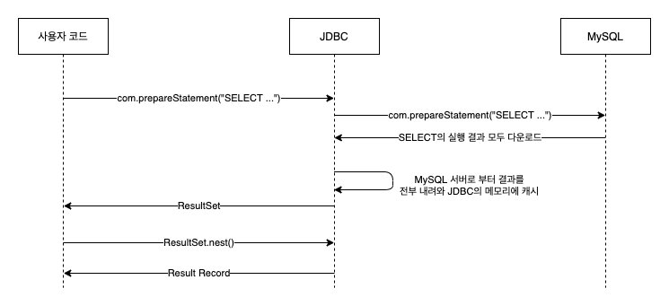

Conntor/J를 이용해 쿼리 실행(Statement.executeQuery) 하면 **Connetor/J가 SELECT 쿼리의 결과를 MySQL 서버로 부터 모두 내려 받아 Connector/J가 관리하는 캐시 메모리 영역에 그 결과를 저장한다. 이렇게 SELECT 쿼리의 결과가 다운로드되는 동안 `Statement.executeQuery()` 함수는 블록돼 있다가 Connector/J가 모든 결과 값을 내려 받아 캐시에 저장되고 나면 그때서야 비로서` Statement.executeQuery()` 함수가 SELECT 쿼리 문장의 결과(ResultSet)의 핸드러를 애플리케이션에 반환한다.** 그 이후 애플리케이션에서 `ResultSet.next()`, `ResultSet.getString()` 등과 같은 함수가 호출되면 MySQL 서버까지 그 요청이 가지 않고, Connector/J가 캐시해둔 값을 애플리케이션 쪽으로 반환한다. **클라이언트 커서라고 하는 이러한 방식은 상당히 빠르기 때문에 MySQL Connector/J의 기본 동작으로 채택돼 있다..**

그런데 이러한 방식은 한 가지 문제가 있다. **SELECT 쿼리의 결과가 너무 클 때는 클라이언트로 다운로드 하는데 만흔 시간이 걸린다. 애플리케이션의 메모리에 SELECT 쿼리의 결과를 담아야 하기 때문에 OOM이가 발생할 가능성이 높다. MySQL에서는 `Statement.setFetchSzie()`를 예약된 값(Integer.MIN_VALUE)으로 설정하면 한 번에 쿼리의 결과를 모두 다운로드 하지 않고 MySQL 서버에 한 건 단위로 읽어와서 가져가게 할 수 있다. 이러한 방식을 ResultSet Streaming 이라고 한다.**

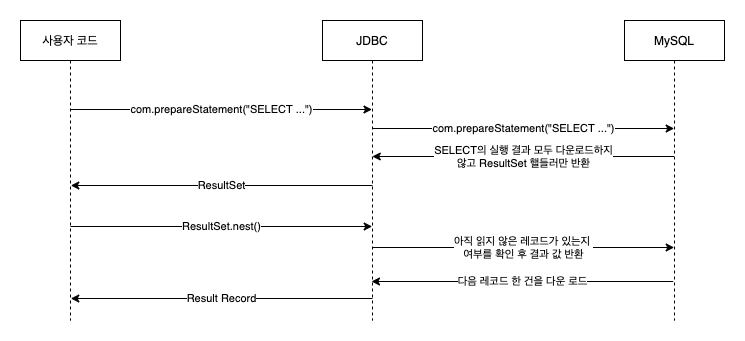

ResultSet Streaming 방식은 매번 레코드 단위로 MySQL서버와 통신 해야 하므로 Connector/J의 기본 적인 처리 방식에 비해 상당히 느리다. 하지만 레코드가 아주 대량이면 이 밥법으로 처리할 수 밖에 없을 수도 있다. 결과 셋의 스트리밍 방식을 위해서는 다음과 같이 자바 프로그램 코드를 조금 변경 해야한다.

```java
public static void main(String[] args) throws Exception {
   final Connection connection = (new JdbcTest()).getConnection();
   final Statement statement = connection.createStatement(
      ResultSet.TYPE_FORWARD_ONLY, // (1) 
      ResultSet.CONCUR_READ_ONLY // (2)
   );
   statement.setFetchSize(Integer.MIN_VALUE);
}
```
`connection.createStatement(...)` 메서드로 Statement를 생성한다 이때 `(2)` 값인 `ResultSet.CONCUR_READ_ONLY` 설정을 통해서 읽기 전용으로 으로 설정하고, `(1)` 값인 `ResultSet.TYPE_FORWARD_ONLY`으로 Statement 진행 방향을 앞쪽으로 읽을 것을 설정한다. 그리고 `statement.setFetchSize(Integer.MIN_VALUE)` 함수를 이용해 레코드의 패치 크기를 예약된 `(3)`의 값인 `Integer.MIN_VALUE`으로 설정해 주면 MySQL 서버는 클라이언트가 결과 셋을 레코드 한 건 단위로 다운로드 하리라는 것을 알아 채고 결과 셋을 준비해 둔다. 그리고 클라이언트에서 `ResultSet.next()` 함수가 호출될 때 마다 한 건씩 클라이언트로 내려 보네게 된다. **여기서 `Integer.MIN_VALUE`는 특별한 의미를 가지지 않는 그냥 지정된 값일 뿐이다. MySQL Connector/J에서는 `setFetchSzie()` 함수에 100을 설정 하거나 10을 설정한다고 해서 100건 이나 10건 단위로 데이터를 가져올 수는 없다.**


```java
public class JdbcTest8 {

    public static void main(String[] args) throws Exception {
        final Connection connection = (new JdbcTest8()).getConnection();
        // 대용량 쿼리르 실행하는 부분
    }

    public Connection getConnection() throws Exception {
        final String driver = "com.mysql.cj.jdbc.Driver";
        final String url = "jdbc:mysql://localhost:3366/batch_study?useCursorFetch=true&defaultFetchSize=100000"; // (1)
        final String user = "root";
        final String password = "";

        Class.forName(driver).newInstance();
        return DriverManager.getConnection(url, user, password);
    }
}
```
**JDBC URL 설정에서 useCursorFetch 설정 옵션을 TRUE로 변경하고 `(1)`처럼 defaultFetchSize 값을 반드시 0보다 큰 값으로 설정해야만 서버 커서 방식으로 대용량의 결과 셋을 클라이언트로 가져올 수 있다. 추가로 서버 커서 방식은 반드시 서버 PreparedStatement 방식으로 처리돼야 하기 때문에 useCursorFetch가 TRUE로 설정되면 useServerPrepStmts 설정 옵션까지 자동으로 TRUE로 변경된다.** 이 방식과 결과 셋의 스트리밍 방식의 차이는 스트리밍 방식은 한 건씩 서버에서 읽어 오지만 서버 커서 방식은 defaultFetchSzie에 명시된 레코드 건수 만큼 Connector/J의 캐시 메모리 영역에 내려 받아 애플리케이션에 제공된다. 즉 SELECT 쿼리의 건수가 100건 이상이였 다면 스트리밍 방식은 MySQL서버와 통신이 100만 건 발생하지만 서커 커서 방식은 1000번(100만/1000)에 대해서만 통신이 필요하다는 의미이다.

**ResultSet Streaming 방식과 서버 커서를 사용하는 방식의 큰 차이는 MySQL 서버가 직접 결과를 담아 둘 임시 테이블을 사용하는지 여부다.** 또한 그로 인한 장단점이 있어 상황에 맞게 필요한 방식으로 선택해서 사용하면 된다.

* 스트리밍 방식은 MySQL 서버에 임시 테이블을 생성하지 않는다는 장점이 있다. 하지만 이 때문에 JDBC 애플리케이션에서 데이터를 모두 가져갈 때까지 쿼리가 실행 중인 상태로 남아 있게 된다. 그래서 JDBC 애플리케이션에서 데이터를 모두 가져가기 전(ResultSet)에는 동일한 커넥션이 새로운 쿼리를 실행하지 못한다. 만약 이미 스트리밍 방식의 쿼리를 실행한 상태에서 다시 새로운 쿼리를 실행하면 `Streaming result set com.mysql.jdbc.RowDataDynamic is still active ...` 오류가 생한다.
* 커서 서버를 사용하는 방법은 쿼리가 실행 될 때 MySQL 서버는 그 결과를 임시 테이블로 복사해 두개 된다. 이렇게 MySQL 서버에서 데이터 복사가 완료되면 그 결과가 클라이언트로 다운로드 되지 않아도 즉시 `executeQuery()` 함수 호출은 완료된다. 하지만 MySQL 서버에 존재하는 커서를 임시 테이블 JDBC 애플리케이션에서 ResultSet의 결과 데이터를 모두 가져갔는지에 관계 없이 임시 테이블로 결과 데이터를 복사하고 쿼리는 종료되므로 대량의 쿼리를 여러번 중첩해 사용할 수 있다.

# 14 데이터 모델링

# 15 데이터 타입

# 16 베스트 프랙티스

## 페이징
LIMIT이 사용된 페이징 쿼리가 인덱스를 이용할 수 있다면 크게 성능상의 문제 없이 사용할 수 있다. **하지만 인덱스를 사용한다 하더라도 계속해서 다음 페이지로 넘어가면 조금씩 조회 쿼리가 느려질수 밖에 없는 구조다. 단순히 LIMIT의 오프셋만 변경해 다음 페이지의 레코드를 조회하는 쿼리는 실제 필요하지 않은 레코드까지 모두 읽는 방식으로 처리된다.**

예를들어 사용자가 100페이지를 조회한다고 가정하면 이쿼리는 `LIMIT (100*20), 20`와 같은 LIMIT 절을 사용해야한다. **그러면 MySQL 서버는 2000번째 레코드부터 20개의 레코드만 읽는 것이 아니라. 첫 번째 레코드 부터 20000번째 레코드까지 읽어서 버리고 그 위치에 20개의 레코드를 더 읽어서 클라이언트로 반환하는 것이다. 이 현상은 뒷 페이지로 넘어갈수록 더 심해질 것이다.**

이동하려는 페이지가 8페이지라면 MySQL 서버는 `LIMIT 70, 10`으로 사용한다

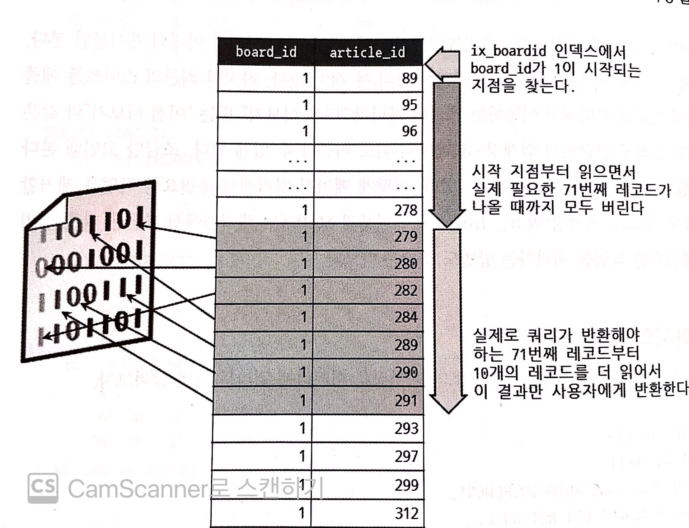

이 쿼리는 실제 필요하지 않은 70건의 레코드를 읽어서 그냥 버린다. **이 쿼리에서 WHERE 조건이 인덱스 칼럼만으로 처리(커버링 인덱스)될 수 있다면 그나마 다행이다. 하지만 페이징 쿼리가 커버링 인덱스로 처리되지 못한다면 이 쿼리는 쓸모도 없는 70건의 레코드에 대해 데이터 파일까지 읽어야 한다.** 아래 그림은 커버링 인덱스로 처리되지 못할 때 추가적으로 발생하는 부하를 표현하는데. 이는 인덱스를 통해 검색한 70건의 레코드에 대해 매번 랜덤하게 디스크를 읽는 작업이 필요하다느 것을 의미한다.

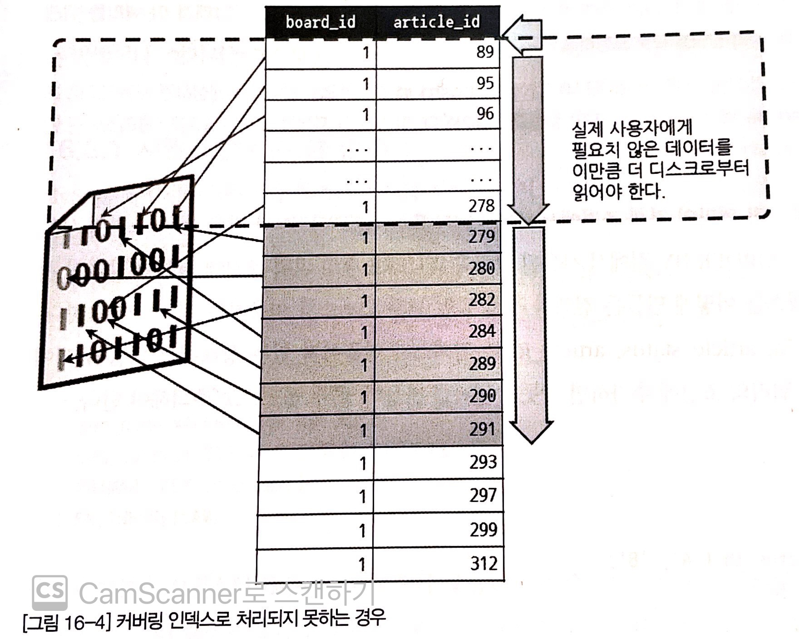

# 17 응급 처치