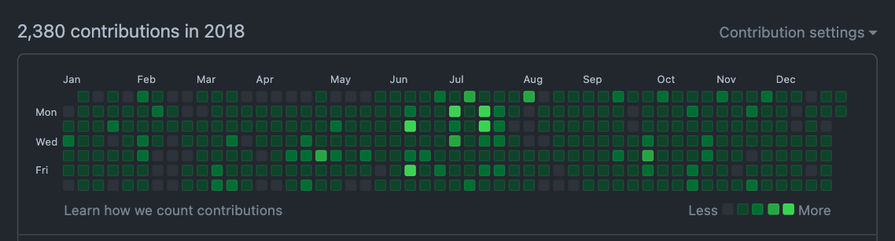
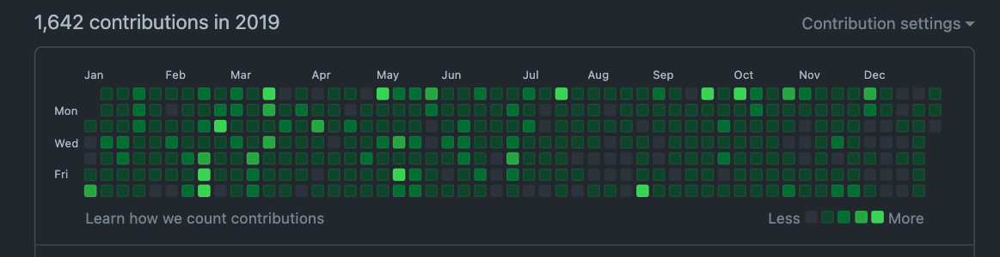

# 회고 썰 풀기

뭐 회고라고 거창하게 말하기는 어렵고 내 의식의 흐름에 맡겨 프리스타일로 해보려고 한다. Yo 비트 주세요

## 내 개발 리즈 시절

09-10의 이영호가 있었다면 18-19에는 내가 있다는 건 아니고, 주니어 개발자 시절 (지금도 주니어 이긴 한데...) 정말 열심히 공부했었던 거 같다. 지금은 왜 그때처럼 열심히 못할까라는 생각이 많이 든다.

이때는 내가 성장한다는 느낌이 많이 들었다. 많이 부족했던 때라 학습할게 많았고 학습을 하면 그래도 성장한다는 느낌을 많이 받는다. **그런데 지금은 가성비가 안 나온다.**

무언가를 더 학습하고 더 깊게 공부하려면 너무 많은 시간을 투자해야 야 해야 한다. 차라리 그 시간에 투자 공부를... 하는 게 더 좋지 않나?..라는 생각도 든다. **무엇보다 계속해서 나라는 사람의 가치를 개발자 실력으로만 쌓아야 하나?라는 생각이 든다.** 그리고 아마도 새벽이라서 새벽 감성이 들어서인지도 모르겠다.

## 그동안 포스팅한 내용

* [[4기][9주차] Batch Reader 성능 분석 4기 9주차](https://github.com/cheese10yun/posting-review/blob/master/yun/2021-06-05-spring-batch-reader-performance.md)
* [[4기][7주차] Exposed ORM 프레임워크 정리 4기 7주차](https://github.com/cheese10yun/posting-review/blob/master/yun/2021-05-20-exposed.md)
* [[4기][6주차] Docker Mysql Replication 구성하기 4기 6주차](https://github.com/cheese10yun/posting-review/blob/master/yun/2021-05-13-docker-mysql-replication.md)
* [[4기][5주차] Spring Master, Slave에서의 트랜잭션 처리 4기 5주차](https://github.com/cheese10yun/posting-review/blob/master/yun/2021-05-06-spring-transaction.md)
* [[4기][4주차] Spring With Kotlin 4기 4주차](https://github.com/cheese10yun/posting-review/blob/master/yun/2021-04-29-spring-kotlin.md)
* [[4기][3주차] Ktlint 코드 스타일 검사 3주차 4기](https://github.com/cheese10yun/posting-review/blob/master/yun/2021-04-22-ktlint.md)
* [[4기][2주차] Spring Cloud Gateway 4기](https://github.com/cheese10yun/posting-review/blob/master/yun/2021-04-15-spring-gateway.md)

8주 차 빼고는 모든 글을 작성했고 아마 스터디는 모두 참석했던 거 같다. 최근에는 메인 언어를 코틀린으로 작성하고 있어 코틀린 이야기를 많이 했던 거 같다. 사실 그동안 알게 모르게 자바를 많이 욕했지만 사실 알고 보면 좋기는 개뿔 용서하기 힘들다.

많은 사람들이 언어가 무슨 잘못이냐 그걸 잘못 쓰는 사람이 문제라고 하는데, 자바는 그런 면죄부를 얻기는 힘들어 보인다. 최근에 많은 릴리스 업을 진행했고 그 부분에 대해서 잘 알지 못하지만 아직 자바 8이 가장 점유율이 높은 것을 봐서는 다른 LTS 버전을 높이는데 큰 메리트를 못 느낀다는 반증이지 않나 싶다. 우리도 자바 11을 쓰긴 하지만 어디까지나 도 커 컨테이너에 더 적합하기 때문에 사용하는 거지 다른 큰 이유는 없다.

그래도 인정할 건 인정한다. 하위 호환을 집착 수준으로 맞춰 버전업에 안전성은 다른 언어에 비해 안전성은 높다고 느낀다. 그러기 때문에 8 버전까지는 버전업이 느렸고 이러한 이유로 자바가 세계적으로 높은 점유율을 갖는 언어가 되었기 때문에 뭐 할 말은 없다. 자바는 상위 호환의 안전성을 택한 거다. **하지만 그래도 용서는 없다. 코틀린 써서 자바 혼내줄 거다.**

그리고 다음으로 포스팅한 내용은 성능적인 부분이다. 사실 이번 회사에 와서는 다양한 방법으로 성능 개선을 해왔다. 회사 사람들과 성능 문제로 정말 다양한 토론을 했고 거의 모든 병목현상인 RDBMS에 대해서 다양한 방법으로 최적화를 시켰다.

하지만 결국 RDBMS에서는 한계가 있고 그 한계까지는 성능을 끌어올리기 위해서 많은 노력을 했다. 그리고 이로한 한계는 NoSQL 플랫폼으로 문제를 해결했다. ~~(도망친 거 아니다. 나름 천국이다)~~ 성능은 비약적으로 향상을 이루어냈다. ~~박수 짝짝짝~~ 이런 부분에 대해서 포스팅해보고 싶긴 하지만 너무 회사 관련 내용이라서 포스팅하기 어렵다... 내 개인적인 생각이지만 몇 모듈은 오픈소스화 시켜 보고 싶기도 하다. ~~(그래야지 블로그에 포스팅할 수 있...)~~

## 다음 스터디 준비

사실 나는 게으른 성격이다. 그래서 뭔가 강제적으로 하고 해야 하는 상황을 만드는 것을 좋아하는데 그게 스터디다. 특히 강의형 스터디로 예전에 스프링을 강의한 적이 있는데 그때 정말 열심히 공부했던 거 같다. 강의 자료로 대략 300 페이지가 넘는 슬라이드를 만들었다 이건 자랑 맞음

그래서 스터디를 준비중이다. 

* Real MySQL
* 쿠버네티스
* Spring Data Flow
* 카프카

대략 이 중에 1개 할 거 같다. Real MySQL을 한다면 강의 형태로 개발자 입장에서 데이터베이스에 중요한 부분에 대해서 한번 진행해보고 싶다. 사실 DBA 수준까지 하는 건 너무 어렵기 때문에... 개발자들이 이 정도까지 알면 좋을 거 같다 수준까지는 누군가 알려주면 좋지 않을까라는 생각을 좀 해봐서... 아무튼 그렇다. 혹시 위 항목 중에 스터디 관심 있으면 말씀 좀...

## 강의 준비
최근에 좋은 제안을 받아서 패스트 캠퍼스에서 강의를 진행하게 되었다. 이론 강의, 프로젝트 강의 2개를 준비 중이다. 겸손한 게 아니라 정말 솔직히 누군가를 가르친다는 거에 대해서 좀 실력적으로 부담감이 있다. 나도 결국 저 수준까지 내려가면 정확하게 이게 왜 동작하는지는 잘 모른다. 대충 이러지 않을까라는 막연한 생각 정도이다. 이렇기 때문에 뭔가 밑천이 보이지 않을까라는 두려움도 있긴 하다. **하지만 금융 치료를 받았다.** 돈 주니까 한다. 여러분들도 혹시 강의 오픈하게 되면 결제 좀...

## 마무리
정말 편하게 의식의 흐름대로 글을 써봤다. 기술 블로그에 글을 쓰긴 하지만 항상 뭔가 잘못 알고 있거나 잘못 표현하지 않나라는 생각에 자기 검열을 많이 했는데 이렇게 생각 없이 글 써보니까 이것도 나름대로 매력이 있다. 아무튼 두서는 없었지만 나의 생각이다. 이때의 나는 이런 고민과 이런 생각들을 했다는 것을 이정표처럼 남겨두는 거 같아서 만족한다.
