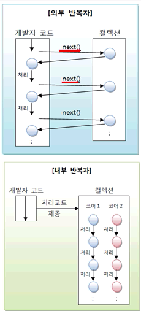
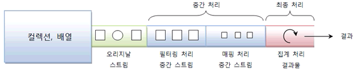
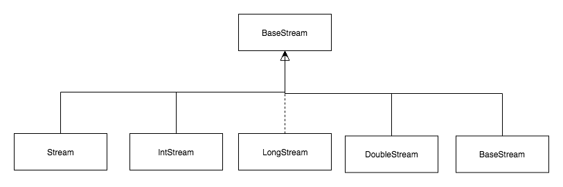
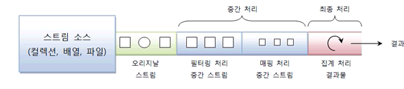
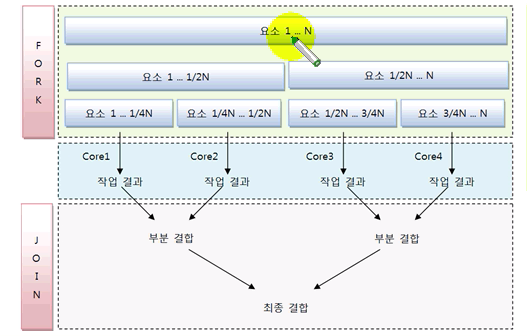
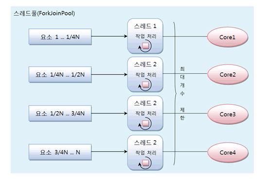

# 목차
- [목차](#%eb%aa%a9%ec%b0%a8)
- [람다식이란 ?](#%eb%9e%8c%eb%8b%a4%ec%8b%9d%ec%9d%b4%eb%9e%80)
  - [함수적 프로그래밍](#%ed%95%a8%ec%88%98%ec%a0%81-%ed%94%84%eb%a1%9c%ea%b7%b8%eb%9e%98%eb%b0%8d)
  - [자바 8부터 함수적 프로그래밍 지원](#%ec%9e%90%eb%b0%94-8%eb%b6%80%ed%84%b0-%ed%95%a8%ec%88%98%ec%a0%81-%ed%94%84%eb%a1%9c%ea%b7%b8%eb%9e%98%eb%b0%8d-%ec%a7%80%ec%9b%90)
- [람다식 기본 문법](#%eb%9e%8c%eb%8b%a4%ec%8b%9d-%ea%b8%b0%eb%b3%b8-%eb%ac%b8%eb%b2%95)
- [타켓 타입과 함수적 인터페이스](#%ed%83%80%ec%bc%93-%ed%83%80%ec%9e%85%ea%b3%bc-%ed%95%a8%ec%88%98%ec%a0%81-%ec%9d%b8%ed%84%b0%ed%8e%98%ec%9d%b4%ec%8a%a4)
  - [타겟 타입](#%ed%83%80%ea%b2%9f-%ed%83%80%ec%9e%85)
  - [함수적 인터페이스](#%ed%95%a8%ec%88%98%ec%a0%81-%ec%9d%b8%ed%84%b0%ed%8e%98%ec%9d%b4%ec%8a%a4)
  - [매개변수와 리턴값이 없는 람다식](#%eb%a7%a4%ea%b0%9c%eb%b3%80%ec%88%98%ec%99%80-%eb%a6%ac%ed%84%b4%ea%b0%92%ec%9d%b4-%ec%97%86%eb%8a%94-%eb%9e%8c%eb%8b%a4%ec%8b%9d)
- [클래스 맴버와 로컬 변수 사용](#%ed%81%b4%eb%9e%98%ec%8a%a4-%eb%a7%b4%eb%b2%84%ec%99%80-%eb%a1%9c%ec%bb%ac-%eb%b3%80%ec%88%98-%ec%82%ac%ec%9a%a9)
- [표준 API의 함수적 인터페이스](#%ed%91%9c%ec%a4%80-api%ec%9d%98-%ed%95%a8%ec%88%98%ec%a0%81-%ec%9d%b8%ed%84%b0%ed%8e%98%ec%9d%b4%ec%8a%a4)
  - [종류](#%ec%a2%85%eb%a5%98)
  - [메서드 참조](#%eb%a9%94%ec%84%9c%eb%93%9c-%ec%b0%b8%ec%a1%b0)
- [스트림](#%ec%8a%a4%ed%8a%b8%eb%a6%bc)
  - [스트림 이란 ?](#%ec%8a%a4%ed%8a%b8%eb%a6%bc-%ec%9d%b4%eb%9e%80)
    - [내부 반복자를 사용하므로 병렬 처리가 쉽다.](#%eb%82%b4%eb%b6%80-%eb%b0%98%eb%b3%b5%ec%9e%90%eb%a5%bc-%ec%82%ac%ec%9a%a9%ed%95%98%eb%af%80%eb%a1%9c-%eb%b3%91%eb%a0%ac-%ec%b2%98%eb%a6%ac%ea%b0%80-%ec%89%bd%eb%8b%a4)
    - [스트림은 중간 처리와 최종 처리를 할 수 있다.](#%ec%8a%a4%ed%8a%b8%eb%a6%bc%ec%9d%80-%ec%a4%91%ea%b0%84-%ec%b2%98%eb%a6%ac%ec%99%80-%ec%b5%9c%ec%a2%85-%ec%b2%98%eb%a6%ac%eb%a5%bc-%ed%95%a0-%ec%88%98-%ec%9e%88%eb%8b%a4)
  - [스트림의 종류](#%ec%8a%a4%ed%8a%b8%eb%a6%bc%ec%9d%98-%ec%a2%85%eb%a5%98)
  - [파이프 라인](#%ed%8c%8c%ec%9d%b4%ed%94%84-%eb%9d%bc%ec%9d%b8)
  - [필터링 : distinct(), filter()](#%ed%95%84%ed%84%b0%eb%a7%81--distinct-filter)
  - [매핑 : flatMapXXX(), mapXXX(), asXXXStream(), boxed()](#%eb%a7%a4%ed%95%91--flatmapxxx-mapxxx-asxxxstream-boxed)
  - [정렬 - sorted()](#%ec%a0%95%eb%a0%ac---sorted)
  - [루핑](#%eb%a3%a8%ed%95%91)
  - [매칭](#%eb%a7%a4%ec%b9%ad)
  - [집계](#%ec%a7%91%ea%b3%84)
  - [커스텀 집계 : reduce()](#%ec%bb%a4%ec%8a%a4%ed%85%80-%ec%a7%91%ea%b3%84--reduce)
  - [수집 : cellect()](#%ec%88%98%ec%a7%91--cellect)
- [병렬 처리](#%eb%b3%91%eb%a0%ac-%ec%b2%98%eb%a6%ac)
  - [포크조인 프레임워크](#%ed%8f%ac%ed%81%ac%ec%a1%b0%ec%9d%b8-%ed%94%84%eb%a0%88%ec%9e%84%ec%9b%8c%ed%81%ac)
  - [포크조인 풀](#%ed%8f%ac%ed%81%ac%ec%a1%b0%ec%9d%b8-%ed%92%80)
  - [병렬 스트림 생성](#%eb%b3%91%eb%a0%ac-%ec%8a%a4%ed%8a%b8%eb%a6%bc-%ec%83%9d%ec%84%b1)
  - [병렬 처리 성능](#%eb%b3%91%eb%a0%ac-%ec%b2%98%eb%a6%ac-%ec%84%b1%eb%8a%a5)
- [출처](#%ec%b6%9c%ec%b2%98)

# 람다식이란 ?

## 함수적 프로그래밍
* y = f(x) 형태의 함수로 구성된 프로그래밍 기법
  * 데이터를 매개값으로 전달하고 결과를 받는 코드들로 구성
  * 객체 지향 프로그래밍 보다 효율적인 경우
    * 대용량 데이터의 처리에 유리
      * 데이터 포장 객체를 생성후 처리하는 것보다, 데이터를 바로 처리하는 것이 속도에 유리
      * 멀티 코어 CPU에서 데이터를 병렬 처리하고 취합할 때 객체 보다 함수가 유리
    * 이벤트 지향 프로그래밍에 적합
      * 반복적인 이벤트 처리는 헨들러 객체보다 핸들러 함수가 적합
* 현대적 프로그래밍 기법
  * 객체 지향 프로그래밍 + 함수적 프로그래밍
  
## 자바 8부터 함수적 프로그래밍 지원
* 람다식을 언어 차원에서 제공
  * 람다 계산법에서 사용된 식을 프로그래밍에 접목
  * 익명함수을 생성하기 위한 식 : (타입 매개변수, ...)- > {실행 문}
* 자바에서 람다식을 수용한 이유
  * 코드가 매우 간결해진다.
  * 컬렉션 요서를 필터링 또는 매핑해서 쉽게 집계할 수 있다.

# 람다식 기본 문법
```
(타입 매개변수,...) -> { 실행문 } - > (int) -> { System.out.println(a); }
```

* 매개 타입은 런타임시에 대입 값에 따라 자동으로 인식하기 때문에 생략 가능
```java
(a) -> {System.out.println(a);}
```

* 하나의 매개변수만 있을 경우에는 괄호() 생략 가능
```java
a -> {System.out.println(a);}
```
* 하나의 실행문만 있다면 중괄호 {} 생략 가능
```java
(a) -> System.out.println(a)
```

* 매개변수가 없다면 괄호 ()를 생략할 수 없음
```
() -> { 실행문; ... }
```
* 리턴값이 있는 경우, return 문을 사용
```java
(x, y) -> { retrun x + y; }
```
* 중괄호 {}에 return 문만 있을 경우, 중괄호를 생략 가능
```java
(x, y) -> x + y
```

# 타켓 타입과 함수적 인터페이스

## 타겟 타입
* 람다식이 대입되는 인터페이스를 말한다.
* 익명 구현 객체를 만들 때 사용할 인터페이스이다.

## 함수적 인터페이스
* 모든 인터페이스는 람다식의 타겟 타입이 될 수 없다.
  * 람다식은 하나의 메서드를 정의하기 때문에 하나의 추상 메소드만 선언된 인터페이스만 타겟 타입이 될 수 있다.
* 함수적 인터페이스
  * 하나의 추상 메서드만 선언된 인터페이스를 말한다.
* @FunctionalInterface 어노테이션
* 하나의 추상 메서드만을 가지는지 컴파일러가 체크 하도록함
* 두 개 이상의 추상 메서드가 선언되 있으면 컴파일 오류 발생

## 매개변수와 리턴값이 없는 람다식

```java
@FunctionalInterface
public interface MyFunctionInterface {
    public void metohd();
}

MyFunctionInterface fi = ()->{...};
```

# 클래스 맴버와 로컬 변수 사용
* 람다식 실행 불록에는 클래스의 맴버인 필드와 메서드를 제약 없이 사용 할 수 있다.
* 람다식 실행 블록내에서는 this는 람다싯을 실행한 객체의 참조이다.

# 표준 API의 함수적 인터페이스
* 매개타입으로 사용되어 람다식을 매개값으러 대입할 수 있도록 해준다.

## 종류
* Consumer 함수적 인터페이스
  * 매개값만 있고 리턴값이 없는 추상 메서드를 가지고 있다.
  * 리턴이 없는 accpet() 메서드를 가지고있다. 단순히 매개값을 소비하는 역할만 한다.
* Supplier 함수적 인터페이스 류
  * 매개값은 없고 리턴값만 있는 추상 메서드를 가지고 있다.
  * 매개변수가 있고 리턴값이 있는 getXXX() 메서드를 가지고 있다. 이들 메서드는 실행 후 호출한 곳으로 데이터를 리턴(공급)하는 역할을 한다.
* Function 함수적 인터페이스 류
  * 매개값과 리턴값이 모두 있는 추상 메소드를 가지고 있다.
  * 주로 매개값을 리턴값으로 매핑(타입변환)을 할 경우에 사용
  * 매개변수와 리턴값이 있는 applyXXX() 메서드를 가지고 있다. 이들 메서드는 매개값을 리턴갑승로 매핑(타입 변환)하는 역할을 한다.
* Operator 함수적 인터페이스 류
  * 매개값과 리턴값이 모두 있는 추상 메서드를 가지고있다.
  * 주로 매개값을 연산하고 그 결과를 리턴할 경우에 사용
  * Function과 동일하게 매개벼수와 리턴값이 있는 applyXXX() 메서드를 가지고 있다. 하지만 이들 메서드는 매개값을 리턴값으로 매핑(타입변환) 보다는 매개값을 이용해서 연산을 수행한후 동일한 타입으로 리턴값을 제공하는 역할을 한다.
* Predicate 함수적 인터페이스 류
  * 매개값을 조사해서 true, false를 리턴할 때 사용
  * 매개변수와 boolean 리턴값이 있는 testXXX() 메서드를 가지고 있다. 이들 메서드는 매개값을 조사해서 boolean 값을 리턴하는 역할을 한다.
* andThen(), compose() 디플토 메서드
  * 함수적 인터페이스가 가지고 있는 디폴트 메서드.
  * 두 개의 함수적 인터페이스를 순차적으로 연결해서 실행한다.
  * 첫번째 리턴값을 두 번째 매개값으로 제공해서 최종 결과값을 리턴한다.
  * andThen()과 compose()의 차이점은 어떤 함수적 인터페이스를 부터 차리하냐이다.

## 메서드 참조
* 메서드를 참조해서 매개변수의 정보 및 리턴타입을 알아내어 람다식에서 불필요한 매개변수를 제거하는 것이 목적이다.
* 람다식은 메서드를 단순하게 호출만 하는 경우에 유용하다.
```java
(3, 4) -> Math.max(3, 4); // 
Math::max;
```
* 메서드 참조도 람다식과 마찬가지로 인터페이스의 익명 구현 객체로 생성됨
* 정적 메서드와 인스턴스 메서드 참조
  * 정적 메서드 참조 : 클래스::메서드
  * 인스턴스 메서드 참조 : 참조변수::메서드

# 스트림 

## 스트림 이란 ?
* 컬럭센은의 요소를 하나씩 참조해서 람다식으로 처리할 수 있는 반복자이다.
* 람다식으로 요소 처리를 제공한다.
  * 스트림이 제공하는 대부분의 요소 처리 메서드는 함수적 인터페이스(메서드가 하나인 인터페이스) 매개타입을 가진다.
  * 매개값으로 람다식 또는 메서드 참조를 대입할 수 있다.

### 내부 반복자를 사용하므로 병렬 처리가 쉽다.


```java
dobule ageAvg = list.stream() // 오리지날 스트림
    .filter(m -> m.getSex() == Member.MALE) // 중간 처리 스트림
    .mapToInt(Member::getAge) // 중간 처리 스트림
    .average() // 최종 처리
    .getAsDobule();
```

* 외부 반복자
  * 개발자가 코드로 직접 컬렉션 요소를 반복해서 요청하고 가져오는 코드 패턴
* 내부 반복자
  * 컬렉션 내부에서 요소들을 반복시키고 개발자는 요소당 처리해야할 코드만 제공하는 코드 패턴
* 내부 반복자의 이점
  * 개발자는 요소 처리 코드에만 집중
  * 멀티 코어, CPU를 최대한 활용하기 위해 요소들을 분배시켜 병렬처리 작업을 할 수 있다.
* 병렬(parallel)처리 
  * 한가지 작업을 서브 작업으로 나누고, 서브 작업들을 분리된 스레드에서 병렬적으러 처리한 후, 서브 작업들의 결과들을 최종 결합하는 방법
  * 자바는 ForkJoinPool 프레임워크를 이용해서 병렬 처리를 한다.

### 스트림은 중간 처리와 최종 처리를 할 수 있다.


* 중간 처리: 요소들의 매핑, 필터링, 정렬
* 최종 처리: 반복, 카운터, 평균, 총합

## 스트림의 종류


* BaseStream : 모든 스트림에서 사용할 수 있는 공통 메서드들이 정의 되어 있을 뿐 코드에 직접적으로 사용되지 않는다.

## 파이프 라인
* 리덕션
  * 대량의 데이터를 가공해서 축소하는 것을 말한다.
    * 합계, 평균, 카운팅, 최댓값, 최소값 등을 집계하는 것
  * 요소가 리덕션의 걀과물로 바로 집계할 수 없을 경우 장간 처리가 필요하다.
    * 중간 처리: 필터링, 매핑, 정렬, 그룹핑
  * 중간 처리한 요소를 최종 처리해서 리덕션 결과물을 산출한다.



* 스트림은 중간 처리와 최종 처리를 파이프라인으로 해결한다.
  * 파이프라인 : 스트림을 파이프처럼 이어 놓은 것을 말한다.
  * 중간 처리 메서드(필터링, 매핑, 정렬)는 중간 처리된 스트림을 리턴하고 이 스트림에서 다시 중간 처리 메서드를 호출해서 파이프라인을 형성하게 된다.
* 최종 스트림의 집계 기능이 시작되기 전까지 중간 처리는 지연(Lazy)된다.
  * 최종 스트림이 시작하면 비로서 컬럭센에서 요소가 하나씩 중간 스트림에서 처리되고 최종 스트림까지 오게된다.

## 필터링 : distinct(), filter()
필터링은 중간 처리 기능으로 요소를 걸러내는 역할을 한다.

* distinct()
  * Stream:equals() 메서드가 true가 나오면 동일한 객체로 판단하고 중복을 제거
  * IntStream, LongStream, DobuleStream: 동일한 값일 경우 중복 제거
* filter()
  * 매개값으로 주어진 Predicate가 true를 리턴하는 요소만 필터링
  
## 매핑 : flatMapXXX(), mapXXX(), asXXXStream(), boxed()
* 매핑은 중간 처리 기능으로 스트림의 요소를 다른 요소로 대체한다.
* 매핑의 메소드 종류 : flatMapXXX(), mapXXX(), asXXXStream(), boxed() 
* flatMapXXX() : 한 개의 요소를 대체하는 복수 개의 요소들로 구성된 새로운 스트림을 리턴한다.
* mapXXX() : 요소를 대체하는 요소로 구성된 새로운 스트림을 리턴한다.
* asXXXStream() : 받은 타입을 dobule 요소로 타입변환해서 DobuleStream을 생성
* boxed() : int 요소, long 요소, 등을 Boxing해서 Inter, Long 요소로 Stream을 생성

## 정렬 - sorted()
* 중간 처리 기능으로 최종 처리되기 전에 요소를 정렬한다.

## 루핑
* 중간, 최종 처리 기능으로 요소 전체를 반복하는 것을 말한다.
* peek() 중간 처리 메서드
  * 촤종 처리 메서드가 실행되지 않으면 지연되기 때문에 최종 처리 메서드가 호출되어야만 동작한다.
* forEach() : 최종 처리 메서드

## 매칭
* 최종 처리 기능으로 요소들이 특정 조건을 만족하는 조사하는 거슬 말한다.
* 매칭 메서드
  * allMatch() : 모든 요소들이 매개값으로 주어진 Predicate의 조건을 만족하는지 조사
  * anyMatch() : 최소한 한 개의 요소가 매개값으로 주어진 Predicate의 조건을 만족하는지 조사
  * nonMatch() : ahems dythemfdl aororkqtdmfh wndjwls Predicate의 조건을 만족지 않은지 조사

## 집계
* 최종 처리 기능
  * 카운팅, 합계, 평균값, 최소값 등과 같이 하나는 값으로 산출한다.
  * 대량의 데이터를 가공해서 축소하는 리덕션이라고 볼 수 있다.

## 커스텀 집계 : reduce()
* 다양한 집계(리덕션) 결과물을 만들 수 있다.

```java
List<Member> members = list.stream()
    .filter(m -> m.getSex() == Member.Sex.MALE)
    .collect(Collectors.toList());
```
* 남자 회원만 집계한다

## 수집 : cellect()
* 최종 처리 기능으로 요소들을 수집 또는 그룹핑한다.

# 병렬 처리
* 멀티 코어 CPU 환경에서 하나의 작업을 분할해서 각각의 코어가 병렬적으로 처리
  * 병렬 처리 목적 : 작업 처리 시간을 줄임
  * 자바8부터 병렬 스트림을 제공하므로 컬렉션의 전체 요소 처리를 시간을 줄여줌


* 동시성과 병렬성
  * 동시성: 멀티 스레드 환경에서 스레드가 번갈아 가며 실행하는 성질(싱글 코어 CPU)
  * 병렬성: 멀티 스레드 환경에서 코어들이 스레드를 병렬적으로 실행하는 성질(병렬 코어 CPU)

* 병렬성 구분
  * 데이터 병렬성
    * 데이터 병렬성은 한 작업 내에 있는 전체 데이터를 쪼개어 서브 데이터들로 만들고 이 서브 데이터들을 병렬 처리해서 작업을 빨리 끝내는 것을 말한다.
  * 작업 병렬성
    * 작업 병렬성은 서로 다른 작업을 병렬 처리하는 것을 말한다.
    * 작업 병렬성의 대표적인 예는 웹서버이다.
    * 웹서버는 각각의 브라우저에서 요청한 내용(다른 작업)을 개별 스레드에서 병렬로 처리한다.
* 병렬 스트림은 데이터 병렬성을 구현하는 것이다.
  * 멀티 코어 수만큼 대용량 요소를 서브 요소들로 나누고, 각 서브의 서브 요소들로 분리된 스레드에서 병렬 처리시킨다.
  * 예를들어 쿼드코어 CPU 경우 4개의 서브 요소들로 나누고, 4개의 스레드가 각각의 서브 요소들로 병럴 처리한다.
  * 병렬 스티름은 포크 조인 프레임워크를 사용한다.

## 포크조인 프레임워크


* 동작 방식
  * 포크 단계
    * 데이터를 서브 데이터로 반복적으로 분리한다.
    * 서브 데이터를 멀티 코어에서 병렬로 처리한다.
    * 코어의 수만큼 작업을 분할한다
    * 실제로 병렬 처리 스트림은 포크 단계에서 차례대로 요소를 4등분하지 않는다. 이해하기 쉽도록 이해를 돕는 그림
    * 내부적으로 서브 요소를 나누는 알고리즘이 있다. 개발자는 크게 신경쓰지 않아도된다.
  * 조인 단계
    * 서브 결과를 결합해서 최종 결과를 만들어 낸다.

## 포크조인 풀

* 위 그림은 4개의 코러를 가진 CPU일 경우
* 각각의 코어에서 서브 요소를 처리하는 것은 개별 스레드가 해야하므로 스레드 관리가 필요
* 포크조인 프레임워크는 ExecutorService의 구현 객체인 ForkJoinPool을 사용

## 병렬 스트림 생성
* parallelStream() : 컬렉션으로 부터 병렬 스트림을 바로 리턴
* parallel() : 순차 처리 스트림을 병렬 스트림으로 변환해서 리턴


## 병렬 처리 성능
* 병렬 처리 성능은 항상 바르다 ?
  * 스트림 병렬 처리가 스트림 순차 처리보다 항상 실행 성능이 좋다고 판단해서는 안된다.
* 병렬 처리에 영량을 미치는 3가지 요인
  * 요소의 수와 요소의 처리 시간
    * 컬렉션에 요소의 수가 적고 요소당 처리 시간이 짧으면 순차 처리가 오히려 병렬처리보다 빠를 수 있다.
    * 병렬 처리는 스레드 풀 생성, 스레드 생성이라는 추라적인 비용이 발생하기 때문이다.
  * 스트림 소스의 종류
    * ArrayList 배열은 랜덤 엑세스를 지원하기 때문에 포크 단계에서 쉽게 요소를 분리할 수 있어 병렬 처리 시간에 절약된다.
    * HashSet, TreeSet은 요서를 분리하기가 쉽지 않고, LinkedList는 랜덤 엑세스를 지원하지 않아 링크를 따라가야 하므로 역시 요소를 분리하기가 쉽지않다. 따라서 이들 소스들은 ArrayList 배열 보다는 상대적으로 병럴 처리가 늦다.
  * 코어의수
    * 싱글코어 CPU일 경우에는 순차 처리가 빠르다.
    * 병렬 처리를 할 경우 스레드 수만 증가하고 번갈아 가면서 스케쥴링을 해야하므로 좋지 못한 결과를 준다.
    * 코어의 수가 많으면 많을 수록 병렬 작업 처리는 속도는 빨라진다.

# 출처
* [이것이 자바다](http://www.kyobobook.co.kr/product/detailViewKor.laf?ejkGb=KOR&mallGb=KOR&barcode=9788968481475&orderClick=LAG&Kc=)
* [자바8 인 액션](http://www.kyobobook.co.kr/product/detailViewKor.laf?ejkGb=KOR&mallGb=KOR&barcode=9788968481796&orderClick=LAH&Kc=)