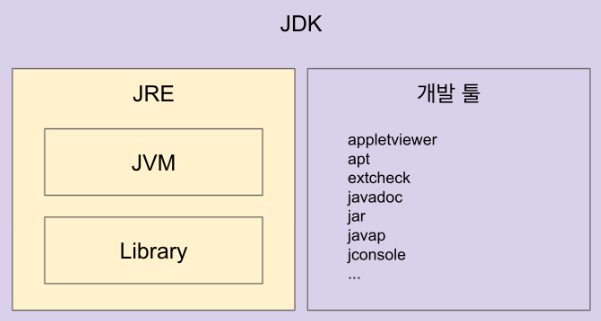
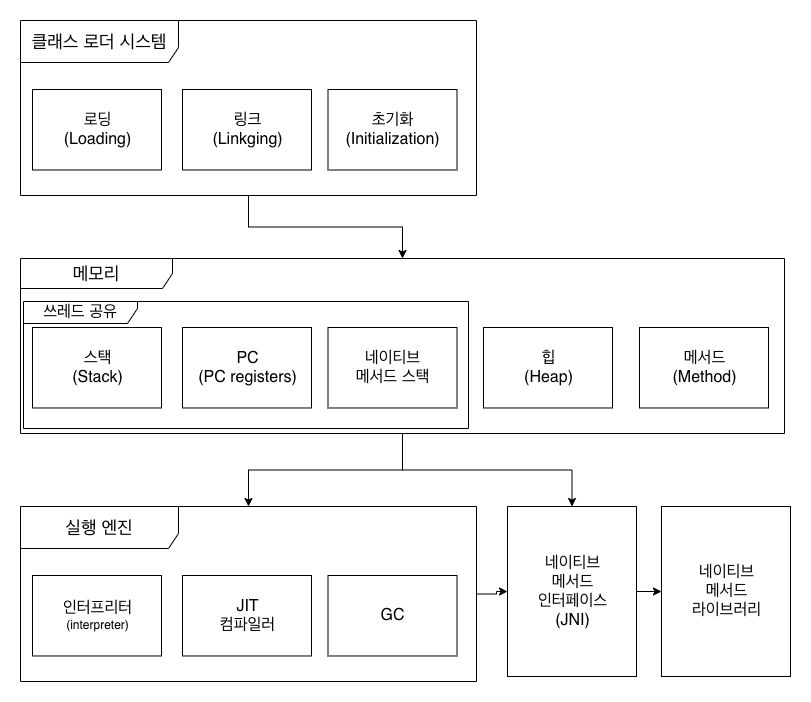
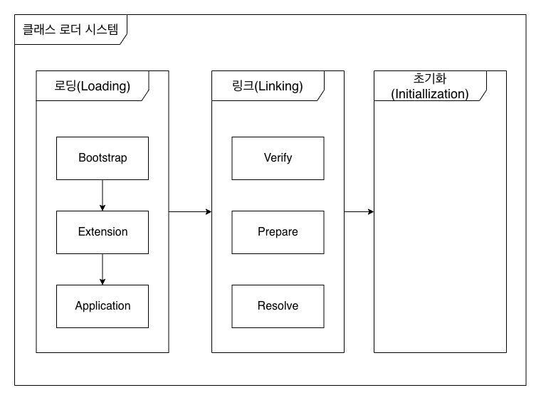
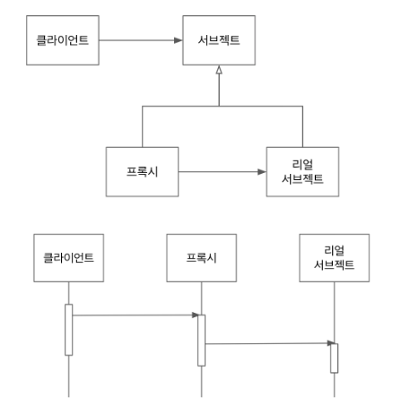

> [더 자바, 코드를 조작하는 다양한 방법](https://www.inflearn.com/course/the-java-code-manipulation/)을 보고 정리한 자료입니다.

# JVM이해하기



## JVM (Java Vertual Machine)
* 자바 가상머신으로 자바 바이트 코드(.`class` 파일을) OS에 특하된 코드로 변환 (인터프리터와 JIT 컴파일러)하여 실행한다.
* 바이트코드를 실행하는 표준(JVM 자체는 표준)이자 구현체(특정 벤더가 구현한 JVM)다
* JVM 벤더: 오라클, 아마존, Azul, ...
* 특쟁 플랫폼에 종속적

## JRE (Java Runtime Environment)
* **자바 애플리케이션을 실행할 수 있도록 수성된 배포판**
* JVM과 핵심 라이브러리 및 자바 런타임 환경에 사용하는 프로퍼티 세팅이나 리소스파일을 가지고 있다. (JVM + 라이브러리))
* 개발 관련 도구는 포함하지 않는다. (그건 JDK에서 제공)
* 자바 컴파일러는 제공하지 않는다. (javac)


```
.
├── clhsdb
├── hsdb
├── java
├── jjs
├── keytool
├── orbd
├── pack200
├── policytool
├── rmid
├── rmiregistry
├── servertool
├── tnameserv
└── unpack200
```
JRE는 자바를 실행할 수 있는 Javac를 제공하지 않는다.

## JDK (Java Development Kit)
* JRE + 개발에 필요한 툴
* 소스 코드를 작성할 때 사용하는 자바 언어 플랫폼에 독립적
* 오라클은 자바 11부터 JDK만 제공하며 JRE를 따로 제공하지 않는다.
* Write Onec Run Anywhere

## 자바
* 프로그래밍 언어
* JDK에 들어있는 자바 컴파일러(javac)를 사용하여 바이트코드(.class 파일)로 컴파일 할 수 있다.
* 자바 유료화? 오라클에서 만든 Oracle JDK 11 버전부터 상용으로 사용할 때 유료.


## JVM 언어
* JVM 기반으로 동작하는 프로그래밍언어
* 클러자, 그루비, JRuby, Jython, Kotlin, Scala

# JVM 구조


## 클래스 로더 시스템
* `.class`에서 바이트코드를 읽고 메모리에 저장
* 로딩: 실제 클래스 파일을 바이트 코드로 읽어오는 과정
* 링크: 레퍼런스를 연결하는 과정
* 초기화: static 값들 초기화 및 변수에 할당

## 메모리
* 메모리 영역에는 클래스 수준의 정보(클래스 이름, 부모 클래스 이름, 메서드, 변수) 저장, 공유 자원이다.
* 힙 영역에는 객체를 저장. 공유 자원이다.
* 메서드 영역에는 코드에서 사용되는 (`*.class`) 들을 클래스 로더로 읽어 클래스 별로 런타임 상수풀, 필드 데이터, 메서드 데이터, 메서드 코드 생성자 코드 등으로 분류해서 저장한다.
* **스택 영역에는 스레드마다 런타임 스택을 만들고, 그 안에 메서드 호출을 스택 프레임이라 부르는 블럭으로 쌓는다. 쓰레드 종료하면 런타임 스택도 사라진다.**
* PC(Program Counter) 레지스터: 쓰레드 마다 스레드 내 현재 실행할 스택 프레임을 가리키는 포인터가 생성된다
* 네이트브 메서드 스택 영역은 네이티브 메서드 인터페이스를 이용해서 C, C++로 작성된 네이티브 메서드를 사용하는 스택 영역이다.` Thread.currentThread()`가 native로 작성된 메서드이다.
  * `natvie` 키워드가 있는 메서드들이 natevie 메서드 이다.
  * 네이티브 메서드 라이브러리는 네이티브 메서드 인터페이스를 통해서만 접근이 가능하다.
* 스택, PC, 네이티브 메서드 스택 쓰레드에서만 공유되는 자원이다. 힙, 메서드 영역은 모든 영역에서 공유된다.

## 실행 엔진
* 인터프리터: 바이트 코드를 한줄 씩 실행해서 네이티브 코드로 변경해서 기계가 이해할 수 있게 해서 실행 가능하게 한다.
* JIT 컴파일러: 인터프리터 효율을 높이기 위해, 인터프리터가 반복되는 코드를 발견하면 JIT 컴파일러로 반복되는 코드를 모두 네이티브 코드로 바꾼다. 그 다음으로부터 인터프리터는 네이티브 코드로 컴파일된 코드를 바로 사용한다.
* GC(Gerbage Collector): 더이상 참조되지 않은 객체를 모아서 정리한다.

## JNI (Java Native Interface)
* 자바 애플리케이션에서 C, C++, 에셈블리로 작성된 함수를 사용할 수 있도록 방법 제공
* Native 키워드를 사용한 메서드 호출

## 네이티브 메서드 라이브러리
* C, C++로 작성 된 라이브러리

## 클래스 로더 시스템 세부



* 로딩 -> 링크 -> 초기화 순으로 진행된다.
* 로딩
  * **클래스 로더가 `.class` 파일을 읽고 그 내용에 따라 적절한 바이너리 데이터를 만들고 메서드 영역에 저장**
  * 이때메서드 영역에 저장하는 데이터
    * FQCN
    * class, interface, enum
    * 메서드 영역
* 링크
  * Verify, Prepare, Reelve(Optional) 세 단계로 나눠져있다.
  * 검증: `.class` 파일 형식이 유효한지 체크한다.
    * `.class` 파일을 임의로 조작하는 경우 발생할 수 있다
  * Preparation: 클래스 변수(static 변수) 와 기본값에 필요한 메모리
  * Resolve: 심볼릭 메서드 레퍼런스를 메서드 영역에 있는 실제 레퍼런스로 교체한다.
* 초기화
  * static 변수의 값을 할당한다. (static 블럭이 있다면 이 때 실행된다.)
  * 클래스 로더는 계층 구조로 이뤄져 있으면 기본적으로 세가지 클래스 로더가 제공된다.
  * 부트 스트랩 클래스 로더 -  `JAVA_HOME\lib`에 있는 코어 자바 API를 제공한다. 최상위 우선순위를 가진 클래스 로더
  * 플랫폼 클래스로더 - `JAVA_HOME\lib\ext` 폴더 또는 `java.ext.dirs` 시스템 변수에 해당하는 위치에 있는 클래스를 읽는다.
  * 애플리케이션 클래스로더 - 애플리케이션 클래스패스(애플리케이션 실행할 때 주는 `-classpath` 옵션 또는 `java.class.path` 환경 변수의 값에 해당하는 위치)에서 클래스를 읽는다.


# 바이트 코드 조작
* 프로그램 분석
  * 코드에서 버그 찾는 툴
  * 코드 복잡도 계산
* 클래스 파일 생성
  * 프록시
  * 특정 API 호출 접근 제한
  * 스칼라 같은 언어의 컴파일러
* 그밖에도 자바 소스 코드 건리지 않고 코드 변경이 필요한 여러 경우에 사용할 수 있다.
  * 프로파일러 (newrelic)
  * 최적화
  * 로깅

스프링이 컴포넌트 스캔을 하는 방법 (asm)
* 컴포넌트 스캔으로 빈으로 등록할 후보 클래스 정보를 찾는데 사용
* ClassPathScanningCandidateComponentProvider -> SimpleMetadataReader
* ClassReader와 Visitor 사용해서 클래스에 있는 메타 정보를 읽어온다.


# 리플랙션

## 리플랙션 API 

Class<T>에 접근하는 방법
* 모든 클래스를 로딩 한 다음 Class<T>의 인스턴스가 생긴다. “타입.class”로 접근할 수 있다.
* 모든 인스턴스는 getClass() 메소드를 가지고 있다. “인스턴스.getClass()”로 접근할 수 있다.
* 클래스를 문자열로 읽어오는 방법
  * Class.forName(“FQCN”)
  * 클래스패스에 해당 클래스가 없다면 ClassNotFoundException이 발생한다.

## 애노테이션과 리플렉션
중요 애노테이션
* @Retention: 해당 애노테이션을 언제까지 유지할 것인가? 소스, 클래스, 런타임
* @Inherit: 해당 애노테이션을 하위 클래스까지 전달할 것인가?
* @Target: 어디에 사용할 수 있는가?

리플렉션
* getAnnotations(): 상속받은 (@Inherit) 애노테이션까지 조회
* getDeclaredAnnotations(): 자기 자신에만 붙어있는 애노테이션 조회

## 나만의 DI 프레임워크 만들기
```java
public class BookService {

    @Inject
    BookRepository bookRepository;

}

public class ContainerService {

    public static <T> T getObject(Class<T> classType) {
        final T instance = createInstance(classType);

        Arrays.stream(classType.getDeclaredFields()).forEach(f -> {

            if (f.getAnnotation(Inject.class) != null) {
                final Object fieldInstance = createInstance(f.getType());
                f.setAccessible(true);
                try {
                    f.set(instance, fieldInstance);
                } catch (IllegalAccessException e) {
                    throw new RuntimeException(e);
                }
            }
        });

        return instance;
    }

    private static <T> T createInstance(Class<T> classType) {
        try {
            return classType.getConstructor((Class<?>[]) null).newInstance();
        } catch (InstantiationException | IllegalAccessException | InvocationTargetException | NoSuchMethodException e) {
            throw new RuntimeException(e);
        }
    }

}

public class ContainerServiceTest {


    @Test
    public void BookRepositoryTest() {
        final BookRepository repository = ContainerService.getObject(BookRepository.class);
        then(repository).isNotNull();
    }


    @Test
    public void BookServiceTest() {
        final BookService bookService = ContainerService.getObject(BookService.class);
        then(bookService).isNotNull();
        then(bookService.bookRepository).isNotNull();
    }
}
```

`@Inject` 어노테션을 통해서 DI를 할 수 있다

## 리플랙정 정리
리플렉션 사용시 주의할 것
* 지나친 사용은 성능 이슈를 야기할 수 있다. 반드시 필요한 경우에만 사용할 것
* 컴파일 타임에 확인되지 않고 런타임 시에만 발생하는 문제를 만들 가능성이 있다.
* 접근 지시자를 무시할 수 있다.

스프링
* 의존성 주입
* MVC 뷰에서 넘어온 데이터를 객체에 바인딩 할 때

하이버네이트
* @Entity 클래스에 Setter가 없다면 리플렉션을 사용한다.

# 다이나믹 프록시
* 스프링 데이터 JPA에서 인터페이스 타입의 인스턴스는 누가 만들어 주는것인가?
* Spring AOP를 기반으로 동작하며 RepositoryFactorySupport에서 프록시를 생성한다.

## 스프링 Data Jpa는 어떻게 동작하나 ?
스프링 데이터 JPA에서 인터페이스 타입의 인스턴스는 Spring AOP를 기반으로 동작하며 RepositoryFactorySupport에서 프록시를 생성한다.

## 프록시 패턴


* 프록시와 리얼 서브젝트가 공유하는 인터페이스가 있고, 클라이언트는 해당 인터페이스 타입으로 프록시를 사용한다.
* 클라이언트는 프록시를 거쳐서 리얼 서브젝트를 사용하기 때문에 프록시는 리얼 서브젝트에 대한 접근을 관리거나 부가기능을 제공하거나, 리턴값을 변경할 수도 있다.
* 리얼 서브젠트는 자신이 해야 할 일만 하면서(SRP) 프록시를 사용해서 부가적인 기능(접근 제한, 로깅, 트랜잭션, 등)을 제공할 때 이런 패턴을 주로 사용한다.

## 다이나믹 프록시
런타임에 특정 인터페이스들을 구현하는 클래스 또는 인스턴스를 만드는 기술, **클래스 기반의 다이나믹 프록시를 만들지 못한다. 가장 큰 단점이다.**

# 에노테이션 프로세서

## 롬복은 어떻게 동작하는 것일까?
* @Getter, @Setter, @Builder 등의 애노테이션과 애노테이션 프로세서를 제공하여 표준적으로 작성해야 할 코드를 개발자 대신 생성해주는 라이브러리

롬복 동작 원리
* 컴파일 시점에 애노테이션 프로세서를 사용하여 **소스코드의 AST(abstract syntax tree)를 조작한다.**
* **애노테이션 프로세서는 컴파일 될때 끼어들어 특정한 어노테이션이 있는 코드를 참조해서 또 다른 코드를 만들어낼 수 있다.**

논란 거리
* **공개된 API가 아닌 컴파일러 내부 클래스를 사용하여 기존 소스 코드를 조작한다.**
* 특히 이클립스의 경우엔 java agent를 사용하여 컴파일러 클래스까지 조작하여 사용한다. 해당 클래스들 역시 공개된 API가 아니다보니 버전 호환성에 문제가 생길 수 있고 언제라도 그런 문제가 발생해도 이상하지 않다.
* 그럼에도 불구하고 엄청난 편리함 때문에 널리 쓰이고 있으며 대안이 몇가지 있지만 롬복의 모든 기능과 편의성을 대체하진 못하는 현실이다.

# 마무리
* JVM 구조
* 바이트 코드 조작 - ASM 또는 Javassist, **ByteBuddy**
* 리플렉션 API - 클래스 정보 참조 (메소드, 필드, 생성자, ...)
* 다이나믹 프록시 기법 - Proxy, CGlib, **ByteBuddy**
* 애노테이션 프로세서 - AbstractProcessor, Filer, ..., AutoService, Javapoet