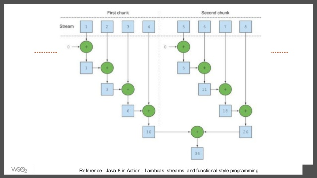
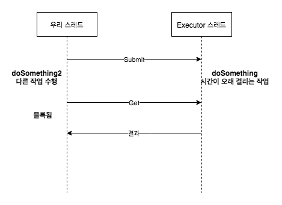

# 목차

- [목차](#목차)
- [기초](#기초)
  - [메서드 래퍼런스](#메서드-래퍼런스)
  - [람다 익명함수](#람다-익명함수)
  - [스트림](#스트림)
  - [스트림](#스트림-1)
    - [멀티 스레딩은 어렵다.](#멀티-스레딩은-어렵다)
  - [디폴트 메서드](#디폴트-메서드)
- [동작 파라미터화 코드 전덜하기](#동작-파라미터화-코드-전덜하기)
  - [요약](#요약)
- [람다 표현식](#람다-표현식)
  - [람다란 무엇인가?](#람다란-무엇인가)
  - [형식 검사, 형식 추론 제약](#형식-검사-형식-추론-제약)
    - [형식 검사](#형식-검사)
    - [같은 람다, 다른 함수형 인터페이스](#같은-람다-다른-함수형-인터페이스)
    - [지역 변수 사용](#지역-변수-사용)
    - [지역 변수의 제약](#지역-변수의-제약)
    - [메서드 레퍼런스](#메서드-레퍼런스)
    - [메서드 레퍼선스를 만드는 방법](#메서드-레퍼선스를-만드는-방법)
      - [Static 메서드 레퍼런스](#static-메서드-레퍼런스)
      - [다양한 형식의 인스턴스 메서드 레퍼런스](#다양한-형식의-인스턴스-메서드-레퍼런스)
      - [기존 객체의 인스턴스 메서드 레퍼런스](#기존-객체의-인스턴스-메서드-레퍼런스)
    - [생성자 레퍼런스](#생성자-레퍼런스)
  - [람다 표현식 조합할 수 있는 유용한 메서드](#람다-표현식-조합할-수-있는-유용한-메서드)
    - [Comparator 조합](#comparator-조합)
- [함수형 데이터 처리](#함수형-데이터-처리)
  - [스트림이란 무엇인가?](#스트림이란-무엇인가)
  - [스트림 시작하기](#스트림-시작하기)
    - [역속된 요소](#역속된-요소)
    - [소스](#소스)
    - [데이터 처리 연산](#데이터-처리-연산)
    - [파이프 라이닝](#파이프-라이닝)
    - [내부 반복](#내부-반복)
      - [filter](#filter)
      - [map](#map)
      - [limit](#limit)
      - [collect](#collect)
  - [스트림과 컬렉션](#스트림과-컬렉션)
    - [딱 한 번만 탐색할 수있다](#딱-한-번만-탐색할-수있다)
    - [외부 반복과 내부반복](#외부-반복과-내부반복)
    - [스트림 연산](#스트림-연산)
      - [중간 연산](#중간-연산)
      - [최종 연산](#최종-연산)
  - [요약](#요약-1)
- [스트림 활용](#스트림-활용)
  - [필터링과 슬라이싱](#필터링과-슬라이싱)
    - [Predicate로 필터링](#predicate로-필터링)
    - [고유 요소 필터링](#고유-요소-필터링)
    - [TAKEWHLIE 사용](#takewhlie-사용)
    - [DROPWHILE 사용](#dropwhile-사용)
    - [스트림 축소](#스트림-축소)
    - [요소 건너뛰기](#요소-건너뛰기)
  - [매핑](#매핑)
    - [스트림의 각요소에 함수 적용하기](#스트림의-각요소에-함수-적용하기)
    - [검색화 매칭](#검색화-매칭)
  - [리듀싱](#리듀싱)
    - [모든 요소의 합](#모든-요소의-합)
    - [최갯값과 최솟값](#최갯값과-최솟값)
  - [요약](#요약-2)
- [스트림으로 데이터 수집](#스트림으로-데이터-수집)
  - [컬렉터란 무엇인가?](#컬렉터란-무엇인가)
    - [미리 정의된 컬렉터](#미리-정의된-컬렉터)
  - [그룹화](#그룹화)
    - [다수준 그룹화](#다수준-그룹화)
  - [분할](#분할)
    - [분할의 장점](#분할의-장점)
  - [요약](#요약-3)
- [병렬 데이처 처리와 성능](#병렬-데이처-처리와-성능)
  - [병렬 스트림](#병렬-스트림)
    - [순사 스트림을 병렬 스트림으로 변환하기](#순사-스트림을-병렬-스트림으로-변환하기)
    - [병렬 스트림에서 사용하는 스레드 풀 설정](#병렬-스트림에서-사용하는-스레드-풀-설정)
    - [병렬 스트림 올바른 사용법](#병렬-스트림-올바른-사용법)
  - [포크/조인 프레임워크](#포크조인-프레임워크)
    - [RecursiveTask 활용](#recursivetask-활용)
    - [포크/조인 프레임워크를 제대로 사용하는 방법](#포크조인-프레임워크를-제대로-사용하는-방법)
  - [요약](#요약-4)
- [디폴트 메서드](#디폴트-메서드-1)
  - [추상 클랫와 자바 8의 인터페이스](#추상-클랫와-자바-8의-인터페이스)
  - [해석 규칙](#해석-규칙)
    - [디폴트 메서드를 제공하는 서브 인터페이스가 이긴다.](#디폴트-메서드를-제공하는-서브-인터페이스가-이긴다)
  - [요약](#요약-5)
- [Optional](#optional)
  - [null 때문에 발생하는 문제](#null-때문에-발생하는-문제)
  - [Optional 클래스 소개](#optional-클래스-소개)
  - [Optional 적용 패턴](#optional-적용-패턴)
  - [Optinal](#optinal)
  - [디폴트 액션과 Optional 언랩](#디폴트-액션과-optional-언랩)
  - [두 Optional 합치기](#두-optional-합치기)
  - [요약](#요약-6)
- [CompletableFuture](#completablefuture)
  - [Future](#future)
    - [동기 메서드를 비동기 메서드로 변환](#동기-메서드를-비동기-메서드로-변환)

# 기초

## 메서드 래퍼런스

자바8에서는 메서드 래퍼런스를 만들어 전달할 수 있게 되었다.

```java
public class FileHidden {

    public void refercenMethod() {
        final File[] hiddenFiles = new File(".").listFiles(new FileFilter() {
            @Override
            public boolean accept(File file) {
                return file.isHidden();
            }
        });
    }
    
    public void refercenMethod2(){
        File[] hiddenFiles = new File(".").listFiles(File::isHidden);
    }
}
```
* 메서드 래퍼런스를 통해서 코드를 심플하게 표현할 수 있다.

## 람다 익명함수


```java
public static boolean isGreenApple(Apple apple) {
        return "green".equals(apple.getColor());
    }

public static boolean isHeavyApple(Apple apple) {
    return apple.getWeight() > 150;
}

public interface Predicate<T> {
    boolean test(T t);
}


public static List<Apple> filterApples(List<Apple> inventory, Predicate<Apple> p) {

    final ArrayList<Apple> result = new ArrayList<>();
    for (Apple apple : inventory) {
        if (p.test(apple)) {
            result.add(apple);
        }
    }
    return result;
}

@Test
public void test() {
    final List<Apple> apples = new ArrayList<>();
    Apple.filterApples(apples, LambdaSampleCode::isGreenApple);
    Apple.filterApples(apples, LambdaSampleCode::isHeavyApple);
    Apple.filterApples(apples, (Apple a)-> a.getColor().equals("RED"));
}
```
기존에는 메서드를 값으로 전달한다 이런 방식은 유용하지만 각각의 기능들을 만들어야한다. 하지만 자바8에서는 이 문제도 익명함수를 통해(람다함수)간단하게 해결 할 수 있다.

한 번만 사용할 메서드는 따로 정의를 구현할 필요가 없이 익명함수를 이용할 수 도 있다. 물론 람다보다는 코드가 수행하는 일을 잘 설명하는 이름을 가진 메서드를 정의하고 위 예제처럼 메서드 레퍼런스를 활용 하는것이 바람직하다. 코드의 명확성이 우선시되어야 한다.


## 스트림
거의 모든 자바 애플리케이션은 컬렉션들 만들고 활용한다. 하지만 컬렉션으로 모든 문제가 해결되지는 않는다.

```java
public void lambda() {
    Map<Currency, List<Transaction>> transcationByCurrencies = transcations.stream()
    .filtet((Transcation t)-> t.getPrice() > 1000)
    .collect(groupingBy(Transcation::getCurrency));
}
```
코드의양이 심플해지고 람다식이 익숙해지면 더욱 명확해진다.

## 스트림

### 멀티 스레딩은 어렵다.
자바8은 스트림 API로 컬렉션을 처리하면서 발생하는 모호함과 반복적인 코드 문제, 멀티 코어 활용 어려움 이라는 두 가지 문제를 모두 해결했다.

## 디폴트 메서드

# 동작 파라미터화 코드 전덜하기

 동작 파라미터화를 이용하면 자주 바뀌는 요구사항에 효과적으로 대응할 수 있다. 동작 파라미터화란 아직 어떻게 실행할 것인지 결정 하지 않은 코드 블록을 의미한다. 이 코드 블록은 나중에 프로그램에서 호출한다. **즉 코드 블럭의 실행은 나중으로 미뤄진다.** 예를 들어 컬렉션을 처리할 때 다음과 같은 메서드들로 구현한다고 가정하자.

* 리스트의 모든 요소에 `어떤 동작`을 수행할 수 있음
* 리스트 관련 작업을 끝낸 다음에 `어떤 다른 동작`을 수행할 수있음
* 에러가 발생하면 `정해진 어떤 다른 동작`을 수행할 수 있음

## 요약
* 동작 파라미터화에서는 메서드 내부적으로 다양한 동작을 수행할 수 있도록 코드를 메서드 인수로 전달한다.
* 동작 파라미터화를 이용하면 변화는 요구사항에 더 잘 대응할 수 있는 코드를 구현할 수 있으며 나중에 엔지니어링 비용을 줄일 수 있다,
* 코드 전달 기법을 이용하면 동작 메서드의 인수로 전달할 수 있다. 하지만 자바 8 이전에서는 코드를 지저분하게 구현했어야했다. 이런것을 익명 클래스로 어느정도 코드를 깔금하게 제공
  
# 람다 표현식

## 람다란 무엇인가?
람다 표현식은 메서드로 전달할 수 있는 익명 함수를 단순화 한 것이라고 할 수 있다. 람다 표현식에는 이름은 없지만, 파라미터 리스트, 바디, 반환 형식, 발생할 수 있는 예외 리스트는 가질 수 있다.

* 익명 : 보통의 메서드와는 달리 이름이 없으므로 **익명**이라는 표현한다. 구현해야 할 코드에 대한 걱정거리가 줄어든다.
* 함수 : 람다는 메서드 처럼 특정 클래스에 족동되지 않으 함수라고 부른다. 하지만 메서드처럼 파라미터 리스트 바디, 변환 형식, 가능한 예외 리스트를 포함한다.
* 전달 : 람다 표현식을 메서드 인수로 전달하거나 변수로 지정할 수 있다.
* 간결성 : 익명 클래스처럼 많은 자질구레한 코드를 구현할 필요가 없다.

```java
(Apple a1, Apple a2) -> a1.getWeight().compareTo(a2.getWeight());
```
* 파라미터 리스트 : `(Apple a1, Apple a2)`
* 화살표 : 화살표 (->)는 람다의 파라미터 리스트와 바디를 구분한다.
* 람다의 바디 : `a1.getWeight().compareTo(a2.getWeight());` 람다의 반환값에 해당하는 표현식이다.

## 형식 검사, 형식 추론 제약
람다 표현식 자체에는 람다가 어떤 함수형 인터페이스를 구현하는지의 정보가 포함되어 있지 않다. 따라 람다 표현식 더 제대로 이해하려면 람다의 실제 형식을 파악해야 한다.

### 형식 검사
람다가 사용되는 Context를 이용해서 람다의 Type을 추론할 수 있다. 어떤 Context(예를 들면 람다가 전달될 메서드 파라미터나 람다가 할당되는 변수등)에서 기대되는 람다 표현식으로 형식을 대상 형식 이라고 부른다.

다음 쿼드의 형식 확인 과정을 보여준다. 다음과 같은 순서로 형식 확인 과정이 진행된다.
```java
List<Apple> haavierThan150g = filter(inventory, (Apple e) -> a.getWeight() > 150);
```

1. filter 메서드의 선언을 확인한다.
2. filter 메서드 두 번째 파라미터로 `Predicate<Apple>` 형식(대상 형식)을 기대한다.
3. `Predicate<Apple>`은 test라는 한 개의 추상 메서드를 정의하는 함수형 인터페이스다.
4. `test` 메서드는 `Apple`을 받아 `boolean`을 반환하는 함수 디스크립터를 묘사한다.
5. `filter` 메서드로 전달된 인수는 이와 같은 요구사항을 만족해야 한다.

```
1.람다가 사용된 콘텍스트는 무엇인지 확인하기 위해서 filter의 정의를 확인 한다.  filter(inventory, (Apple e) -> a.getWeight() > 150);

2. 대상 형식은 Predicate<Apple> 이다(T는 Apple로 대치됨) filter(List<Apple> inventory, Predicate<Apple> p)

3. Predicate<Apple> 인터페이스의 추상메서드는 무엇인가? boolean test(Apple apple)

4. Apple을 인수로 받아 boolean을 반환하는 test 메서드다. Apple -> boolean
```

### 같은 람다, 다른 함수형 인터페이스
대상 형식 이라는 특성 때문에 같은 람다 표현식이더라도 호환되는 추상 메서드를 가진 다른 함수형 인터페이스로 사용될 수 있다.

### 지역 변수 사용
람다 표현식에서는 익명 함수가 하는 것처럼 자유 변수를 활용 할 수 있다. 이 와 같은 동작을 람다 캡처링이라고 부른다.

```java
int portNumber = 1337;
Runnable r = () -> System.out.println(portNumber);
```
하지만 자유 변수에도 약간의 제약이 있다. 람다는 인스턴스 변수와 정적 변수를 자유롭게 캡처(자신의 바디에서 참조할 수 있도록) 할 수 있다. **하지만 그러면 지역 변수는 명시적으로 final로 선언된 변수와 똑같이 사용되어야 한다.**

예를 들어 다음 에제는 portNumber에 값을 두 번할당하므로 컴파일할 수 없는 코드다.

```java
int portNumber = 1337;
Runnable r () -> System.out.println(portNumber);
portNumber = 31337;
```

### 지역 변수의 제약
왜 지역 변수에 이런 제약이 필요한지에 대한 설명이다. 우선 내부적으로 인스턴스 변수와 지역 변수는 태생부터가 다르다. 인스턴스 변수는 힙에 저장되는 반면 지역 변수는 스택에 위치한다. 

람다에서 지역 변수에 바로 접근할 수 있다는 가정에 하에 람다가 스레드에서 실행된다면 변수를 할당한 스레드가 사라져서 변수 할당이 해제되었는데도 람다를 실행하는 스레드에서 해당 변수에 접근하려 할 수 있다. 따라사 자바 구현에서 원래 변수에 접근을 허용하는 것이 아니라 자유 지역 변수의 복사본을 제공한다. 따라서 복사본의 값이 바뀌지 않아야 하므로 지역 변수에 한 번만 값을 할당 해야한다는 제약이 생긴 것이다.

또한 지역 변수에 제약 때문에 외부 변수를 변화시키는 일반적인 명령형 프로그래밍 패턴에 제동을 걸 수 있다.

지역 변수 값은 스택에만 존재하므로 자신을 정의한 스레드와 생존을 같이 해야 하며 따라서 지역 변수는 final 이어야 한다. 가변 지역 변수를 새로운 스레드에서 캡처할 수 있다면 안전하지 않은 동작을 수행할 가능성이 생긴다(인스턴스 변수는 스레드가 공유하는 힙에 존재하므로 특별한 제약이 없다)

### 메서드 레퍼런스
메서드 레퍼런스를 이용하면 기존 메서드 정의를 재활용해서 람다처럼 전달할 수 있다. 때로는 람다 표현식보다 메서드 레퍼런스를 사용하는 것이 더 가독성이 좋으며 자연스러울 수 있다. 다음은 메서드 레퍼런스와 새로운 자바 8 API를 활용한 정렬 예제다.

```java
inventory.sort((Apple a1, Apple a2) -> a1.getWeight().compareTo(a2.getWeight()));

// 메서드 레퍼런스와 Comparator.comparing를 활용한 코드
inventory.sort(comparing(Apple::getWeight)); // 첫 번째 메서드 래퍼런스!
```

### 메서드 레퍼선스를 만드는 방법

#### Static 메서드 레퍼런스

```
(1)
람다 - > (args) Class.staticMethod(args)
메서드 레퍼런스 -> Class::staticMethod

ex)
Interger의 parseInt 메서드 `Integer::parseInt`로 표현할 수 있다.
Function<String, Integer> stringToInterger = (String s) -> Integer.parseInt(s);
Function<String, Integer> stringToInterger = Integer::parseInt;
```

#### 다양한 형식의 인스턴스 메서드 레퍼런스

```
(2)
람다 - > (arg0, rest) -> arg0.instanceMethod(rest)
메서드 레퍼런스 -> ClassName::instanceMethod

ex)
String의 length 메서드는 `String::length`로 표현할 수 있다.
BiPredicate<String<String>, String> contains = (list, element) -> list.contains(element);
BiPredicate<String<String>, String> contains = List::contains;
```
#### 기존 객체의 인스턴스 메서드 레퍼런스
```
(3)
람다 -> (args) -> expr.instanceMethod(args)
메서드 레퍼런스 -> expr::instanceMethod

ex)
Transcation 객체를 할당받은 transaction 지역 변수가 있다면 `transaction::getValue`라고 표현할 수 있다.

```

### 생성자 레퍼런스
Class::new 처럼 클래스명과 new 키워드를 이용해서 기존 생성자의 레퍼런스를 만들 수 있다. 이것은 정적 메서드의 레퍼런스를 만드는 방법과 비슷하다.

```java
Supplier<Apple> c1 = Apple::new; //디폴트 생성자 Apple()의 생성자 레퍼런스
Apple a1 = c1.get(); // Supplier의 get 메서드를 호출해서 새로운 Apple 객체를 만들 수 있다.
```


```java
Function<Intenger, String> c1 = (weight) -> new Apple(weight); // 특정 무게의 사과를 만드는 람다 포현식
```

## 람다 표현식 조합할 수 있는 유용한 메서드


### Comparator 조합

```java
Comparator<Apple> c = Comparator.comparing(Apple::getWeight);
// 역정렬
Invertory.sort(comparing(Apple:getWeight).reversed()); // 내림 차순 정렬

Invertory
    .sort(comparing(Apple:getWeight).reversed()
    .reversed()
    .thenComparing(Apple::getCountry)); // 두 사과 무게가 같으면 국가 별로 정렬
```


# 함수형 데이터 처리

## 스트림이란 무엇인가?

스트림을 이용하면 선언형, 즉 데이터를 처리하는데 임시 구현 코드 대신에 질의로 표현하는 것으로 컬렉션 데이터를 처리할 수 있다.
또한 스트림을 이용하면 멀티 스레드 코드를 구현하지 않아도 데이터를 투명하게 병렬로 처리할 수 있다.

자바 7 코드
```java
List<Dish> lowCaloriDishes = new ArrayList<>();
for(Dish d : memu){
    if(d.getCalories() < 400){
        lowCaloriDishes.add(d);
    }
}

Collections.sort(lowCaloriDishes, new Comparator<Dish>){ // 익명 클래스로 요리 정렬
    public int compare(Dish d1, Dish d2){
        return Intenger.compare(d1.getCalories(), d2.getCalories());
    }
}

List<String> lowCaloriDishesName = new ArrayList<>();
for(Dish d : memu){
    lowCaloriDishesName.add(d);
}
```
자바 8 코드

```java
List<String> lowCaloriDishesName = memu.parallelStream()
    .filter(d -> d.getCalories() < 400)
    .sorted(comparing(Dishes::getCalories))
    .map(Dish::getName)
    .collect(toList());
```

* 선언형 코드로 구현할 수 있다.
  * 루프와 if 조건문 등의 제어 블록을 사용해서 어떻게 동작을 구현할지 지정할 필요 없이 `저칼로리의 요리만 선택해라` 같은 동작의 수행을 지정할 수 있다.
  * 즉 기존 코드를 복사하여 붙여 넣는 방식을 사용하지 않고 람다 표현식을 이용해서 저칼로리 대신 고칼로리의 요리만 필터링하는 코드도 쉽게 구현할 수 있다.
  
filter같은 연산은 고수준 빌딩 블록(heigh-level building)으로 이루어져 있음으로 특정 스레드 모델에 제한되지 않고 자유롭게 어떤 상황에서든지 사용할 수 있다.

**또한 이들은 내부적으로 단일 스레드 모델에서 사용할 수 있지만 멀티코어 아키텍처를 최대한 투명하게 활용할 수 있도록 구현되어 있다. 결과적으로 우리는 데이터 처리 과정을 병렬화하면서 스레드와 락을 걱정팔 필요가 없어졌다.**

다음 코드로 더욱 간결화할 수 있다. 물론 추가적인 학습이 더 필요 하다

```java
Map<Dish.Type, List<Dish>> dishersByType = 
memu.stream().collect(groupBy(Dish::getType));
```


## 스트림 시작하기

스트림이란 **데이터 처리 연산**을 지원하도록 **소스**에서 추출된 **역속된 요소**로 정의 할 수 있다.

### 역속된 요소
* 컬렉션과 마찬가지로 스트림은 특정 요소 형식으로 이루어진 역속된 값 집합의 인터페이스를 제공한다.
* 스트림은 filter, sorted, map이 계산식을 주로 이룬다. 즉 컬렉션의 주제는 데이터고 스트림의 주제는 계산이다.

### 소스
* 스트림은 컬랙션, 배열, I/O  자원 등의 데이터 제공 소스로부터 데이터를 소비한다. 정렬된 컬렉션으로 스트림을 생성하면 정렬이 그대로 유지된다. 즉 리스트로 스트림을 만들면 스트림 요소는 리스트의 요소와 같은 순서를 유지한다.

### 데이터 처리 연산
* 스트림은 함수형 프로그래밍에서 일반적으로 지원하는 연선과 데이터베이스와 비슷한 연산을 지원한다.
* filter, map, find, match, sort 등으로 데이터를 조작할 수 있다.
* 스트림은 연산은 순차적으로 또는 병렬로 실행 할 수 있다.

### 파이프 라이닝
대부분의 스트림 연산은 스트림 연산끼리 연결해서 커다란 파이프라인을 구성할 수 있도록 스트림 자신을 반환한다. 그 덕분에 lay, 같은 촤적화도 얻을 수 있다. 

### 내부 반복
반복자를 이용해서 명시적으로 반복하는 컬렉션과 달리 스트림은 내부 반복을 지원한다.

```java
List<String> threeHighCaloricDishNames = memu.stream()
        .filter(dish -> dish.getCalories() > 300)
        .map(Dish::getName)
        .limit(3)
        .collect(Collectors.toList());

System.out.println(threeHighCaloricDishNames);
```
1. memu에서 stream 메서드를 호출해서 요리 리스트로 부터 스트림을 얻어 온다.
2. 여기서 데이터 소스는 요리 리스트(메뉴)다. 데이터 소스는 연속된 요소를 스트림에 제공한다.
3. 스트림에 filter, map, limit, collect로 이어지는 일련의 데이터 처리 연산을 적용한다.
4. collect를 호출하기전까지는 menu에 아무것도 선턱되지 않으며, 출력 결과도 없다. **즉 collect가 호출되기 전까지 메서드 호출이 저장되는 효과가 없다.**

#### filter
람다를 인수로 받아 스트림에서 특정 요소를 제외시킨다. 예제에서는 `d -> d.getCalories() > 300` 이라는 람다를 전달해서 300 칼로리 이상의 요리를 선택한다.

#### map
람다를 이용해서 한 요소를 다른 요소로 변환하거나 정보를 추출한다. 예제에서는 메서드 래퍼런스 `Dish::getName` 람다 표현식에서는 `d -> d.getName()` 전달해서 각각의 요리명을 추출한다

#### limit
정해진 개수 이상의 요소가 스트림에 저장되지 못하게 스트림 크기를 축소한다.

#### collect
스트림을 다른 형식으로 변환한다. 

## 스트림과 컬렉션
데이터를 **언제** 계산하느냐가 컬렉션과 스트림의 가장 큰 차이라고 할 수 있다. 컬렉션은 현재 자료구조가 포함된 모든 값을 메모리에 저장하는 자료구조이다. 즉 컬렉션의 모든 요소를 컬렉션에 추가하기전에 계산되어야한다. (컬렉션에 요를 추가하거나 컬렉션의 요소를 삭제할 수 있다. 이런 연산을 수행할 때마다 컬렉션의 모든 요소를 메로리에 저장해야 하며 컬렉션에 추가하려는 요소는 미리 계산되어야한다.)

반면 스트림은 이론적으로 요청할 때만 요소를 계한 하는 고정된 자료구조이다.(스트림에서 요소를 추가하거나, 요소를 제거할 수 없다.) 이러한 스트림의 특성은 프로그래밍에 큰 도움을 준다.

### 딱 한 번만 탐색할 수있다
반복자와 마찬가지로 스트림도 한 번만 탐색할 수 있다. 즉, **탐색된 스트림의 요소는 소비된다.** 반복자와 마찬가지로 한 번 탐색한 요소를 다시 탐색하려면 초기 데이터 소스에 새로운 스트림을 만들어야한다.

```kotlin
val stream = listOf("a", "b", "c", "d").stream()
stream.forEach(System.out::println) // 단어 출력 성공
stream.forEach(System.out::println) // stream has already been operated upon or closed 예외발생
```

### 외부 반복과 내부반복

컬렉션 인터페이스를 사용하려면 사용자가 직접 요소를 반복해야한다.(for-each) 이를 외부 반복 이라고 한다. 반면 스트림이라는 라이브러리는 (반복을 알아서 처리하고 결과 스트림값을 어딘가에 저장해주는) 내부 반복을 사용한다. 내부 반복을 사용하면 작업을 투명하게 병렬로 처리하거나 더 최적화된 다양한 순서로 처리할 수 있다.

```kotlin
val menus = listOf(
    Menu("치킨", false, 100, Type.MEAT),
    Menu("피자", false, 200, Type.OTHER),
    Menu("짜장면", false, 300, Type.OTHER)
)
val menuNames = mutableListOf<String>()

for (menu in menus) { // 명시적 반복 선언
    menuNames.add(menu.name)
}
```

```kotlin
val menus = listOf(
    Menu("치킨", false, 100, Type.MEAT),
    Menu("피자", false, 200, Type.OTHER),
    Menu("짜장면", false, 300, Type.OTHER)
)

menus.stream()
    .map { it.name } // map 메서드를 it.name 메서드로 파라미터화해서 요리명을 춫ㄹ
    .collect(toList()) // 파이프라인을 실행한다. 반복자는 필요 없다.
```

```
A: B, 장난감 좀 정리하렴, 방바닥에 장남감있지?
B: 네 공있어요
A: 좋아 그러면 공을 상자에 담자, 또 어떤 장남감이 있지?
B: 인형있어요
A: 그럼 인형을 상자에 담자, 또 어떤 장남감있지?
B: 책있어요
A: 그럼 책을 상자에 담자, 또 어떤 장남감이 있지?
B: 아무것도 없어요
A: 잘했어
```
위 대화처럼 컬렉션은 **외부적으로 반복**, 즉 명시적으로 컬렉션 항목을 하나씩 가져와서 처리한다. **바닥에 있는 모든 장난감을 상자에 담자**라고 말하는게 더좋다. 스트림 라이브러리의 **내부 반복은 데이터 표현과 하드웨어를 활용한 병령성 구현을 자동으로 선택한다.** 반면 for-each를 이용하는 **외부 반복에서는 병령성을 스스로 관리해야한다.**

### 스트림 연산

스트림 인터페이스의 연산을 크게 두 가지로 구분할 수 있다. 

```java
List<String> threeHighCaloricDishNames = memu.stream()
            .filter(dish -> dish.getCalories() > 300) // 중간 연산
            .map(Dish::getName) // 중간 연산
            .limit(3) // 중간 연산
            .collect(Collectors.toList()); // 최종 연산
```

```
menu -> [filter(람다) ->  map (람다) -> limit(정수)] -> [collect]
                        중간 연산                        최종연산
```

#### 중간 연산
filter, sorted같은 중간 연산은 다른 스트림을 반환한다. 따라서 여러 중간 연산을 연결해 질의를 만들 수 있다. 중간 연산의 중요한 특징은 단말 연산을 스트림 파이프라인에서 실행하기 전까지는 아무도 연산도 수행할 수없다는 것이다. **즉 Lay 하다는 것이다. 중간연산을 합친 다음에 합쳐진 중간 연산을 최종 연산으로 한 번에 처리하기 때문이다.**

#### 최종 연산
최종 연산은 스트림 파이프라인에서 결과를 도출한다. 보통 최종 연산에 의해 List, Integer, void 등 스트림 이외의 결과가 반환된다.

## 요약
* 스트림은 소스에 추출된 요소로, 데이터 처리 연산을 지원한다.
* 스트림 내부 반복을 지원한다. 내부 반복은 filter, map, sorted 등의 연산을 반복을 추상화한다
* 스트림에서 중간 연산과 최종 연산이 있다.
* 스트림의 요소는 요청할 때만 계산된다.

# 스트림 활용

## 필터링과 슬라이싱
스트림 요소를 선택하는 방법, 즉 Predicate 필터링, 고유 요소 필터링, 스트림의 일부 요소를 무시하거나 스트림을 주어진 크기로 축소하는 방법을 설명한다.

### Predicate로 필터링
스트림 인터페이스는 fiter 메서드를 지원한다. fiter 메서드는 Predicate를 함수로 받아 Predicate와 칠치하는 모든 요소를 포함하는 스트림을 반환한다. 다음 예제는 채식 요리를 필터링해서 체식 메뉴를 만들 수 있다

```java
List<String> vegetarianMenu = memu.stream()
                .filter(Dish::isVegetarian)
                .collect(toList());
```

### 고유 요소 필터링
스트림은 고유 요소로 이루어진 스트림을 변환하는 `distinct` 라는 메서드도 지원한다.


```java
List<Integer> numbers = Arrays.asList(1, 2, 3, 4);
numbers.stream()
    .filter(i -> i % 2 == 0)
    .distinct()
    .forEach(System.out::println);
```

### TAKEWHLIE 사용
```kotlin
val menus = listOf(
    Menu("치킨", false, 100, Type.MEAT),
    Menu("피자", false, 200, Type.OTHER),
    Menu("짜장면", false, 300, Type.OTHER),
    Menu("탕수육", false, 400, Type.OTHER),
    Menu("돈까스", false, 500, Type.MEAT),
    Menu("비빔밥", false, 600, Type.OTHER)
)

menus.stream()
//  .filter { it.calories < 320 }
    .takeWhile { it.calories < 320 }
    .collect(toList())
```
위 리스트는 이미 칼로리순으로 정렬되어 있다는 사실을 이용해 320 칼로리보다 크거나 같은 요리가 나왔을 때 반복 작업을 중단할 수 있다. 아주 많은 데이터를 포함하는 큰 스트림에서는 상당한 차이가 될 수 이싿. 이런 경우 takeWhile 연산을 이용하면 간단하게 처리할 수 있다.

### DROPWHILE 사용
나머지 요소를 선택하려면 `DROPWHILE`을 사용하면 된다.

### 스트림 축소
스트림은 주어진 값 이하의 크기를 갖는 새로운 스트림을 반환하는 limit 메서드를 지원한다. 

### 요소 건너뛰기
스트림은 처음 n개 요소를 제외한 스트림을 반환하는 skp 메서드를 지원한다.

## 매핑
스트림 API는 map, flatMap 메서드는 트겆 데이터를 선택하는 기능을 제공한다.

### 스트림의 각요소에 함수 적용하기

```java
final List<String> words = Arrays.asList("java8", "cheese", "In");
final List<Integer> collect = words.stream()
        .map(String::length)
        .collect(Collectors.toList());
```
인수로 제공된 함수는 각 요소에 적용하며 함수를 적용한 결과가 새로운 요소로 매핑된다. 이 과정은 기전 값을 고친다라는 개념보단 새로운 버전을 만든다는 개념에 가까우므로 변환에 가까운 매핑이라는 단어를 사용한다.

```kotlin
val listOf = listOf("Hello", "World")
val collect = listOf.stream()
    .map { a: String -> a.split("").toTypedArray() }
    .flatMap { Arrays.stream(it) }
    .distinct()
    .collect(Collectors.toList())
```
flatMap 메서드는 스트림이나 각 값을 다른 스트림으로 만든 다음에 모든 스트림을 하나의 스트림으로 연결하는 기능을 수행한다.

### 검색화 매칭

```java
final boolean isHealthy = memu.stream()
                .allMatch(dish -> dish.getCalories() < 1000);
```

스트림의 모든 요소가 주어진 Predicate와 칠치하는지 검사한다. 

## 리듀싱

스트림 요소를 조합해서 더 복잡한 질의를 표현할 수 있다. 리듀싱 연산이라고 한다.

### 모든 요소의 합

```kotlin
val listOf = listOf(1, 2, 3, 4, 5, 6)
val sum = listOf.stream()
    .reduce { a, b -> a + b }
    .get()
```

### 최갯값과 최솟값

```kotlin
val listOf = listOf(1, 2, 3, 4, 5, 6)
    listOf.stream()
    .reduce(Integer::max)
    or
    .reduce(Integer::min)
```

## 요약
* 스트림 API를 이용하면 복잡한 데이처 처리 질의를 표현할 수 있다.
* filter, distinct, skip, limit 메서드로 스트림 필터링하거나 자를 수 있다.
* findFirst, findAny 메서드로 스트림의 요소를 검색할 수 있다. allMatch, noneMatch, anyMatch 메서드를 이용해서 주어진 Predicate와 일치하는 요소를 스트림에서 검색할 수 있다.

# 스트림으로 데이터 수집

Collect와 컬렉터로 구현할 수 있는 질의 예제이다.

통화별로 트랜잭션을 그룹화한 코드
```java
Map<Currency, List<Transaction>> transcationsByCurrencies = 
    transcations.stream().cellect(groupBy(Transaction::getCurrency));
```

## 컬렉터란 무엇인가?
함수형 프로그래밍에서 `무엇`을 원하는지 직접 명시할 수 이써엇 어던 방법으로 이를 얻을지 신경 쓸 필요가 없다. 이전 예제에서 collect 메서드로 Collector 이너페이스 구현을 전달했다.  Collector 인터페이스 구현은 스트림 요소를 어떤 식으로 도출할지 지정한다. 여기서는 grouppingBy를 이용해서 `각 키 (통화)와 버킷`그리고 각 키 버킷에 대응하는 요소 리스트를 값으로 포함하는 맵을 만들라는 동작을 수행한다.

filter(sorted, map. collect) 같은 **연산은 고수준 빌딩 블록**으로 이루어져 있으므로 특정 스레딩 모델에 제한되지 않고 자유롭게 어떤 상황에서든 사용할 수있다. 또한 이들은 내부적으로 단일 스레드 모델에 사용할 수 있지만 멀티코어 아키텍처를 최대한 투명하게 활용할 수 있게 구현되어 있다. **결과적으로 우리는 데이터 처리과정을 병렬화하면서 스레드와 락을 걱정할 필요가 없다.**

### 미리 정의된 컬렉터

Collectors에서 제공하는 메서드의 기능은 크게 사가지로 구분할 수 있다.

1. 스트림 요소를 하나의 값으로 리듀스 하고 요약
2. 요소 그룹화
3. 요소 분활

## 그룹화


```java
// 고기를 포함하는 그룹, 생성을 포함하는 그룹, 나머지 그룹화를 편리하게 할 수 있다.
Map<Dish.DishType, List<Dish>> dishesByType = memu.stream()
        .collect(Collectors.groupingBy(Dish::getType));
```

### 다수준 그룹화

바깥쪽 groupingBy 메서드에서 스트림의 항목을 분류할 두 번째 기준을 정의할 내부 groupingBy를 전달해서 두 수준으로 스트림의 항목을 그룹화 할 수 있다.

```java
Map<Dish.DishType, Map<CaloricLevel, List<Dish>>> dishesByTypeCaloricLevel = memu.stream()
    .collect(
        groupingBy(Dish::getType,
            groupingBy(dish -> {
                if (dish.getCalories() <= 400) {
                    return CaloricLevel.DIET;
                } else if (dish.getCalories() <= 700) {
                    return CaloricLevel.NORMAL;
                } else {
                    return CaloricLevel.DIET;
                }
            })));
```
## 분할
분할은 분할 함수 라불리는 Predicate 분류 함수로 사용하는 특수한 그룹화 기능이다 분활 함수는 불린을 반한하므로 맵의 키 형식은 Boolean 이다 결과적으로 그룹화 맵은 최대 두 개(true or false)의 그룹은 분류된다.

채식 료이와 채식이 아닌 요리로 분류 하는 코드

```java
Map<Boolean, List<Dish>> partitionMemu = memu.stream()
        .collect(partitioningBy(Dish::isVegetarian));
```

### 분할의 장점
**분할 함수가 반환하는 참, 거짓 두 가지 요소의 스트림 리스트를 모두 유지하는 것이 분할의 장점이다.**

## 요약
* collect는 스트림 요소를 요약 결과로 누적하는 다양한 방법을 인수로 갖는 최종 연산이다.
* 스트림의 요소를 하나씩 값으로 리듀스하고 요약하는 컬렉터뿐 아니라 최솟값, 최댓값 평균값을 계산하는 켈렉터 등이 미리 정의도어 있다.
* 미리 정의된 컬렉터인 groupingBy로 스트림의 요소를 그룹화하거나, partitioningBy로 스트림 요소를 분활 할 수 있다.
* 컬렉터는 다수준의 그룹화, 분할, 리듀싱 연산에 적합하게 설계되어 있다.
* Collector 인터페이스에 정의된 메서드를 구현해서 커스텀 컬렉터를개발 할 수 있다.

# 병렬 데이처 처리와 성능

새로운 스트림 인터페이스를 이용해서 데이터 컬렉션을 선언형으로 제어하는 방법과 외부 반복을 내부 반복으로 바꾸면서 네이트브 자바 라이브러리가 스트림 요소의 처리를 제어하는 방법을 확인했다. 자바 개발자는 컬렉터 데이터 처리 속도를 높여 따로 고민할 필요가 없어졌다. 무엇보다도 컴퓨터의 멀티고어를 활용해서 파이프라인 연산을 실행할 수 있다는 점이 가장 중요한 특징이다.

자바7이 등장하기 전에는 데이터 컬렉션을 병렬로 처리하기가 어려웠다. 우선 데이터를 서브파트로 분할해야 한다. 그리고 불하된 서브파트를 각각의 스레드로 할당한다. 스레드 할당한 다음에는 의도치 않은 레이스 컨디션이 발생하지 않도록 적절한 동기화를 추가해야하며, 마지막으로 부분결과를 합처야한다. 자바 7은 더 쉽게 병렬화를 수행하면서 에러를 초소회할 수 있도록 포크/조인 프레임워크라는 기능을 제공한다.


스트림으로 데이터 컬렉션 관련 동작을 얼마나 쉽게 병렬로 실핼할 수 있는지 설명한다. 스트림을 이용해서 슨차 스트림을 병렬 스트림으로 자연스럽게 바꿀 수 있다. 어떻게 이런 마법같은 일들이 일어날 수 있는지, 더나아가 자바 7에 추가된 포크/조인 프레임워크와 내부적인 벙렬 스트림 처리는 어떤 연관관계가 있는지 살펴본다. 병렬 스트림이 내부적으로 어떻게 처리되는지 알아야만 스트림을 잘못 사용하는 상황을 피할 수 있다.

우선 청크를 병럴로 처리하기전에 벙렬 스트림이 요소를 여러 청크로 분활하는 방법을 살펴볼것이다. 이 원리를 이애하지 못하면 의도치 않은 설명하기 어려운 결과가 발생할 수 있다.


## 병렬 스트림
컬렉션에 `parallelStream`을 호출하면 병렬 스트림이 생성된다. 병렬 스트림이 각각의 스레드에서 처리할 수 있도록 스트림 요소를 여러 청크로 분할한 스트림이다. 따라서 병렬 스트림을 이용하면 모든 코어 프로세서가 각각의 청크를 처리하도록 할당 할 수 있다.

숫자 n인수를 받아서 1부터 n까지 모든 숫자의 합계를 반환하는 메서드를 구현하는 메서드이다.

```java
@Test
public void test_011() {
    int n = 10;
    final Long count = Stream.iterate(1L, i -> i + 1)
            .limit(n)
            .reduce(0L, Long::sum);
}
```
n이 커진다면 이 연산을 병렬로 처리하는 것이 좋다. 그렇다면 결과 변수는 어떻게 동기화해야할까? 몇 개의 스레드를 사용해야할까? 숫자는 어떻게 생상할까? 생성된 숫자는 누가 더 할까?

병렬 스트림을 이용하면 별다른 리소스 없이 해결할 수 있다.

### 순사 스트림을 병렬 스트림으로 변환하기
```java
@Test
public void test_011() {
    int n = 10;
    final Long count = Stream.iterate(1L, i -> i + 1)
            .limit(n)
            .parallel()
            .reduce(0L, Long::sum);
}
```
이전 코드와 다른점은 스트림이 여러 청크로 분활된다는 것이다. 사실 parallel을 호출해도 스트림 자체에는 아무 변화가 일어나지 않는다. 내부적으로 parallel을 호출하면 이후 연산이 병렬로 수행해야 함을 의미하는 불린 플래그가 설정된다. 반대로 sequential로 병렬 스트림을 순차 스트림으로 바굴 수 있다. 이 두 메서드를 이용해서 어떤 연산을 병렬로 실행하고 어떤 연산을 순차적으로 실행할 지 제어할 수 있다.


> [이미지 출처](https://www.slideshare.net/kshanth2101/what-is-new-in-java-8-concurrency)


해당 코드는 실행 환경 마다 다르지만 고전적인 `for-each` 보다 성능이 낮게 나온다. 이유는 다음과 같다.

* iterate가 발싱된 객체를 생성하므로 이를 다시 언박싱하는 과정이 필요했다.
* iterate가 병렬로 실행될 수 있도록 독립적인 청크로 분할하기가 어렵다.

```java
@Test
public void test_012() {
    int n = 10;
    final long reduce = LongStream.rangeClosed(1, n)
            .parallel()
            .reduce(0L, Long::sum);
}
```
* LognStream.rangeClosed는 기본형 long을 직접 사용하므로 박싱과 언박싱 오베헤드가 사라진다.
* LongStream.rangeClosed는 쉽게 청크로 분활할 수 있는 숫자 범위를 생상한다. 예를 들어 1-20 범위의 숫자를 각각 1-5, 6-10, 11-15, 16-20 범위로 숫자로 분할 할 수 있다.

  
### 병렬 스트림에서 사용하는 스레드 풀 설정
스트림의 parallel 메서드에서 병렬로 작업을 수행하는 스레드는 어디서 생성되는 것이며 몇개나 생성되는지, 그리고 그 과정을 어떻게 커스터마이즈할지 궁금할 것이다.

병렬 스트림은 내부적으로 FokrJoinPool을 사용한다. 기본적으로 FokrJoinPool은 프로세스 수, 즉 Runtime.getRuntime().getAvaliableProccessors()가 반환하는 값에 상응하는 스레드 갖는다.

```java
System.setProperty("java.util.concurrent.ForkJoinPool.common.parallelism", "12");
```
이 코드는 전역 설정 코드이므로 이후의 모든 병렬 스트림 연산에 영향을 준다. 현재 하나의 병렬 스트림에서 사용할 수 있는 특정한 값을 지정할 수 없다. 일반적으로 기기기의 프로세스 수와 같으므로 특별한 이유가 없다면 `ForkJoinPool`의 기본값을 그대로 사용할것을 권장한다.

### 병렬 스트림 올바른 사용법

천 개 이상의 요소가 있을 때만 병렬 스트림을 사용하라 와 같은 양을 기준으로 병렬 스트림을 사용을 결정하는 것은 적절하지 않다. 정해진 기기에서 정해진 연산을 수행할 때는 이와 같은 기준을 사용할 수 있지만 상황이 달라지면 이와 같은 기준이 제약할을 하지못한다. 그래도 어떤 상활에서 별렬 스트림을 사용할 것인지 약간의 수랑적 인트를 정의하는 것이 도움이 될때 있다.

* 확신이 서지 않는 다면 직접 측정하라. 순차 스트림을 병렬 스트림으로 쉽게 바꿀수 있다. 무족건 병럴 스트림으로 바꾸는 것이 능사는 아니다.
* 박싱을 주의하라. 자동 박싱과 언박싱은 성능을 크게 저하시킬 수 있는 요소다. 자바8은 박싱 동작을 피할 수 있도록 기본형 스트림, LongStream, IntStream, DobuleStream을 제공한다. 따라서 되도록이면 기본형 특화 스트림을 사용하는 것이 좋다.
* 순차 스트림 보다 병렬 스트림에서 성능이떨어지는 연산이 있다. 특히 limit이나 findFist 처럼 요소의 순서에 의존하는 연산을 병렬 스트림에서 수행하려면 비싼 비용을 치러야한다. 예를들어 findAny는 요소의 순서와 상관없이 연산하므로 findFirst 보다 성능이 좋다
* 스트림에서 수행하는 전체 파이프라인 연산 비용을 고려하라. 처리해야할 요소 수가 N이이고 하나의 요소를 처리하는 데 드는 비용을 Q라고 하면 전체 스트림 파이프라인 처리비용은 N*Q로 예상할 할 수 있다. Q가 높아진다는 것은 병렬 스트림으로 성능을 개선할 수 있다는 가능성이 있음을 의미한다.
* 소량의 데이터에서는 병렬 스트림이 도움되지 않는다. 소량의 데이터를 처리하는 상황에서는 병렬화 과정에서 생기는 부라 비용을 상쇄할 수 있음을 만큼의 이득을 얻지 못하기 때문이다.
* 스트림을 구성하는 자료구조가 적절한지를 확인하라. 예를들어 ArrayList를 LinkedList 보다 효율적으로 분할할 수 있다. LinkedList를 분할하면 모든 요소를 탐색하지만 ArrayList는 요소를 탐색하지 않고도 리스트르 분할할 수 있기 때문이다. 또한 range팩토리 메서드로 만든 기본형 스트림도 쉽게 분해할 수 있다.
* 스트림의 특성과 파이프라인의 중간 연산이 스트림의 트것ㅇ을 어떨게 바꾸는지 에 따라 분해 과정의 성능이 달라질 수 있다. 예를 들어 SIZED 스트림은 정확히 같은 크기의 두 리스트 스트림으로 분할할 수 있으므로 효과적으로 스트림을 병렬처리 할 수 있다. 반면 필터 연산이 있으면 스트림의 길이를 예측할 수 없으므로 효과적으로 스트림 병렬 처리할 수 있을지 알 수 없게 된다.
* 최종 연산의 병합 과정(Collector의 combiner 메서드) 비용을 살펴보라. 병합 과정의 비용이 비싸다면 병렬 스트림으로 얻은 성능의 이익이 서브스트림의 부분결과를 합치는 과정에서 상쇄될 수 있다.

소스             | 분해성
---------------|----
ArrayList      | 훌륭함
LinkedList     | 나쁨
InStream.range | 훌륭함
Stream.iterate | 나쁨
HastSet        | 좋음
TreeSet        | 좋음

## 포크/조인 프레임워크
포크/조인 프레임워크는 병렬화할 수 있는 작업을 재귀적으로 작은 작업으로 분할한 다음에 서브태스크 각각의 결과를 합쳐서 전체 결과를 만들도록 설계 되었다.


포크/조인 프레임워크에서는 서브태스크를 스레드 풀의 작업자 스레드에 분산 할당하는 ExecutorService 인터페이스를 구현한다

### RecursiveTask 활용
스레드 풀을 이용하려면 RecursiveTask<R>의 서브클래스를 만들어야 한다. 여기서 R은 병렬화된 태스크가 생성하는 결과 형식 또는 결과가 없을때는 RecursiveAction 형식이다. RecursiveTask를 정의하려면 추상 메서드 compute 메서드를 구현 해야한다.

compute 메서드는 태스크를 서브 태스크로 분할하는 로직과 더 이상 분할할 수 없을 때 개별 서브테스크의 결과를 생산할 알고리즘을 정의한다. 따라서 대부분의 compute 메서드 구현은 다음과 같은 의사 코드 형식을 유지한다.

```java
if(태스크가 충분히 작거나 더 이상 분하할 수 없으면){
    순차적으로 태스크 계산
}else{
    태스트를 두 서브태스크로 분할
    태스크가 다시 서브태스크로 분할되도록 이 메서드를 재귀적으로 호출함
    모든 서브태스크의 연산이 완료될 때까지 기다림
    각 서브태스크의 결과를 합침
}
```
이 알고리즘은 분할 후 정복 알고리즘의 병렬화 버전이다.


> [출처 Programming for beginners : Java: Fork Join framework]

* 일반적으로 애플리케이션에서는 둘 이상의 ForkJoinPool을 사용하지 않는다.
* 소프트웨어의 필요한 곳에서 언제든지 가져다 쓸 수 있도록 ForkJoinPool을 한번만 인스턴스화 해서 정적 필드에 싱글턴으로 지정한다.
* ForkJoinPool을 만들면서 인수가 없는 디폴트 생성자를 이용했는데, 이는 JVM에서 이용할 수 있는 모든 프로세서가 자유롭게 ForkJoinPool에 접근할 수 있을을 의미한다.
* 정확하넨 Runtie.avaliableProcessors의 반환값으로 풀에 사용할 스레드 수를 결정한다.


### 포크/조인 프레임워크를 제대로 사용하는 방법
* join 메서드를 태스크에 호출하면 태스크가 생산하는 결과가 준비될 때까지 호출자를 블록시킨다. 따라서 두 서브태스크가 모두 시작된 다음에 join을 호출해야한다. 그렇지 않으면 각각의 서브태스크가 다른 데스크가 끝나길 기다리는 일이 발생하며 원래 순차 알고리즘 보다 느리고 복잡한 프로그램이 되어버릴 수 있다.
* RecusiveTask 내에서 ForkJoinPool의 invoke 메서드를 사용하지 말아야한다. 대신 compute나 fork 메서드를 직접 호출 할 수 있다. 순차 코드에 병렬 계산을 시작할 때만 invoke를 사용한다.
* 서브대스크에 fork 메서드를 호출해서 ForkJoinPool의 일정을 조절할 수 있다.
* 포크/조인 프레임워크를 이용 하는 병렬 계산은 디버깅하기 어렵다. 보통 IDE로 디버깅할 때 스택 트레이스로 문제를 일어난 과정을 쉽게 확인 할 수 있는데 포크/조인 프레임워크에서 fork라는 불리는 다른 스레드에서 compute를 호출하므로 스택 트레이스가 도움되지 않는다.

## 요약
* 내부 반복을 이용하면 명시적으로 다른 스레드를 사용하지 않고도 스트림을 병렬로 처리 할 수 있다.
* 간단하게 스트림을 병렬로 처리할 수 있지만 항상 병렬 처리가 빠른것은 아니다. 병렬 소프트웨어 동작 방법과 성능은 직관적이지 않을 때가 많으므로 병렬 처리를 사용 했을 때 성능을 직접 측정해야봐야 한다.
* 병렬 스트림으로 데이터 집합을 병렬 실행할 때 특히 처리해야할 데이터가 아주 많거나 각 요소를 처리하는데 오랜 시간이 걸릴 때 성능을 높일 수 있다.
* 포크/조인 프레임워크에서 병렬화할 수 있는데 태스크를 작은 태스크로 분할한 다음에 분할된 태스크를 각각의 스레드로 실행하며 서브태스크 각각의 결과를 합쳐서 최종 결과를 생상한다.
* Spliteator는 탐색하려는 데이터를 포함하는 스트림을 어떻게 병렬화할 것인지 정의한다.


# 디폴트 메서드

## 추상 클랫와 자바 8의 인터페이스

1. 클래스는 하나의 추상 클래스만 상속 받을 수 있지만 인터페이스를 여러 개 구현할 수 있다.
2. 추상 클래스는 인스턴스 변수로 공통 상태를 가질 수 있다. 하지만 인터페이스는 인스턴스 변수를 가질 수 없다.

## 해석 규칙

```java
public interface A {
    default void hello() {
        System.out.println("Hello from A");
    }
}

public interface B {
    default void hello() {
        System.out.println("Hello from B");
    }
}

public class C implements B, A {
    public static void main(String... args){
        new C().hello();
    }
}
```

다른 클래스나 인터페이스로 부터 같은 시그니처를 갖는 메서드를 상속받을 때는 세가지 규칙을 따라야한다.

1. 클래스가 항상 이긴다. 클래스나 슈퍼클래스에서 정의한 메서드가 디폴트 메서드보다 우선권을 갖는다.
2. 1번 규칙 이외의 상황에서는 서브 인터페에스가 이간다. 상속관계를 갖는 인터페이스에서 같은 시그너치를 갖는 메서드를 정의할 때는 서브인터페이스가 이긴다. 즉 B가 A를 상속 받는다면 B가 A를 이긴다.
3. 여전히 디폴트 메서드의 우선순위가 결정되지 않았다면 여러 인터페이스를 상속받는 클래스가 명시적으로 디폴트 메서드를 오버라이드하고 호출해야한다.

### 디폴트 메서드를 제공하는 서브 인터페이스가 이긴다.

위 예제에서 hello 메서드 호출하면 서브 인터페이스가 이긴다. 즉 B마 A를 상속받았으므로 컴파일러는 B의 hello B를 선택한다.

## 요약
* 자바 8의 인터페이스는 구현 코드를 포함하는 디폴트 메서드, 정적 메서드를 정의할 수 있다.
* 디폴트 메서드의 정의는 default 키워드로 시작하며 일반 클래스 메서드처럼 바디를 갖는다.
* 공개된 인터페이스에서 추상 메서드를 추가하면 소스 호환서잉 깨진다.
* 디폴트 메서드 덕분에 라이브러리 설계자가 API를 바꿔도 기존 버전과 호환성을 유지할 수 있다,

# Optional

## null 때문에 발생하는 문제

* 에러의 근원 : NullPointException은 자바에서 가장 흔히 발생하는 에러이다.
* 코드를 어지립힌다 : 때로는 중첩된 null 확인 코드를 추가해야하므로 null 때문에 코드 가속성이 떨어진다.
* 아무 의미가 없다 : null은 아무 의미도 표현하지 않는다.
* 자바 철학에 위배된디 : 자바는 개발자로부터 모든 포인터를 숨겼다. 하지만 예외가 있는데 그것이 비로 null 포인트다.
* 형식 시스템에 구멍을 만든다: null은 무형식이며 정보를 퍼함하고 있지 않으므로 모든 레퍼런스 형식에 null 포인트

## Optional 클래스 소개
자바8은 하스켈과 스칼라의 영향을 받아서 `Optional<T>` 라는 새로운 클래스를 제공한다. `Optional`은 선택형값을 캡슐화하는 클래스다. 예를 들어 어떤 사람이 차를 소유하고 있지 않다면 Person 클래스의 Car 변수는 null을 가져온다. 

하지만 새로운 `Optional`을 이용할 수 있으므로 null을 할당하는 것이 아니라 `Optional<Car>`로 설정할 수 있다. 값이 있으면 `Optional` 클래스는 값을 감싼다. 반면 값이 없으면 `Optional.empty` 메서드로 `Optional`을 반환한다. 즉 해당 객체가 있을 수도 없을 수도 있다는 것을 캡슐화 한다.

모든 null 레퍼런스를 `Optional` 으로 대체하는 것은 바람직하다. `Optional`의 역할은 더 이해하기 쉬운 API를 설계하도록 돕는 것이다. 즉 메서드의 시그너치만 보고도 선택형 값인지 여부를 구분할 수 있다.

## Optional 적용 패턴
```java
Optional<Car> optCar = Optional.empty(); // 빈 Optional 객체
Optional<Car> optCar = Optional.of(car); // 정적 패토리 메서드로 Car Optional 생성
Optional<Car> optCar = Optional.ofNullable(car); // car가 null이면 빈 Optional 객체가 반환된다.
```

## Optinal

```java
@Test
public void Optional_not_empty() {
    final Optional<Insurance> name = Optional.of(new Insurance("name", 10));
    final Optional<Car> car = Optional.of(new Car("car", name));
    final Optional<Person> person = Optional.of(new Person("name", "address", car));

    final String result = person.flatMap(Person::getCar)
            .flatMap(Car::getInsurance)
            .map(Insurance::getName)
            .orElse("isEmpty");

    System.out.println(result); // Insurance name  출력
}

@Test
public void Optional_empty() {
    final Optional<Insurance> name = Optional.of(new Insurance("name", 10));
    final Optional<Car> car = Optional.empty();
    final Optional<Person> person = Optional.of(new Person("name", "address", car));

    final String result = person.flatMap(Person::getCar)
            .flatMap(Car::getInsurance)
            .map(Insurance::getName)
            .orElse("isEmpty"); // Insurance name  출력

    System.out.println(result);
}
```
객체 탐색을 해도  NullPointException이 발생하지 않는다. 비여 있을 경우 isEmpty가 출력된다.

## 디폴트 액션과 Optional 언랩
* `get()`은 값을 읽는 가장 간단하게 메서드면서 동시에 가장 안전하지 않은 메서드다. 메서드 get 래핑된 값이 있으면 해당 값을 반환하고 값이 없으면 NoSuchElmentException을 발생시킨다. 그래서 반드시 Optional 값이 있는 경우에만 get 메서드를 호출 해야한다.
* `orElse(T other)`를 사용했다. `orElse` 메서드를 이용하면 Optinal이 값을 포함하지 않을 때 디폴트값을 제공할 수 있다.
* `orElseGet(Suplizer<? extedns T> other)`는 orElse 메서드에 대응하는 게으른 버전으 메서드다. Optional에 값이 없을 때만 Supplier가 실행된다.
* `orElseThorw(Supplier<? extedns X>)`는 Optional이 비어있을 때 예외를 발생시킨다는 점에서 get 메서드와 비슷하다. 하지만 이 메서드는 발생시킬 예외와 종률르 선택할 수 있다.
* `ifPersent (Consumer<? super T> consumer)`를 이용하면 값이 존재할 때 인수로 넘겨준 동작을 실행할 수 있다. 값이 없으면 아무 일도 일어나지 않는다.


## 두 Optional 합치기

```java
public Optional<Insurance> nullSafeFindCheapetInsurance(Optional<Person> person, Optional<Car> car){
    if(person.isPersent() && car.isPersernt()){
        return Optional.of(findCheapestInsurance(person.get(), car.get())));
    }else{
        return Optional.empty();
    }
}
```
이 방식은 person과 car의 시그너처만으로 둘 다 아무 값도 반환하지 않을 수 있다는 정보를 명시적으로 보여 준다는 것이다. 

## 요약
* 역사적으로 프로그래밍 언어에서는 null 레퍼런스로 값이 없는 상황을 포현했다.
* 자바 8에서는 값이 있거나 없음을 표현할 수 있는 클래스 `Optional<T>`를 제공한다.
* 팩티로 메서드 `Optional.empty`, `Optional.of`, `Optional.ofNullable` 등을 이용해서 `Optional` 객체를 만들 수 있다.
* `Optional`로 값없는 상황을 적절하게 처리하도록 강제할 수 있다. `Optional`로 예상 못한 null 예외를 방지할 수 있다.
* `Optional`을 활용하면서 더 좋은 API를 설계할 수 있다. 즉, 사용자는 메서드의 시그너처만 보고 `Optional` 값이 사용되거나 반환되는지 예측할 수 있다.


# CompletableFuture


## Future
비동기 계산을 모델링하는 데 Future를 이용할 수 있으며, Future는 계산이 끝났을 때 결과에 접근할 수 있는 레퍼런스를 제공한다. 시간이 거릴 수 있는 작업 Future 내부로 설정하면 호출자 스레드가 결과를 기다리는 동안 다른 유용한 작업을 수행 할 수 있다.


```java
package study.lambda.future;

import java.util.concurrent.*;

public class Fu {

    public void fu(){
        ExecutorService executor = Executors.newCachedThreadPool(); // 스레드 풀에 태스크를 제출하려면 ExecutorServicefmf aksemfdjdi gksek

        Future<Double> future = executor.submit(new Callable<Double>() { // Callable을 ExecutorService로 제출한다
            @Override
            public Double call() throws Exception {
                return doSomething(); // 시간이 오래 걸리는 작업은 다른 스레드에서 비동기적으로 실행한다
            }
        });

        doSomething2(); // 비동기 작업을 수행하는 동안 다른 작업을 한다.

        try {
            Double result = future.get(1, TimeUnit.SECONDS); // 비동기 작업의 결과를 가져온다. 결과가 준비가되어 있지 않으면 호출 스레드가 불록된다 하지만 최대 1초까지만 기달린다.
        }catch (ExecutionException ee){
            // 계산 중 예외 발생
        }catch (InterruptedException ie){
            // 현재 스레드에서 대기 중 인터럽트 발생
        }catch (TimeoutException te){
            // Future 가 완료되지 전에 타임아울 발생
        }
    }

    private Double doSomething() {
        return 0.0D;
    }

    private void doSomething2() {

    }
}
```


ExecutorService 에서 제공하는 스레드가 자신이 오래 걸리는 작업을 처리하는 동안 우리 스레드로 다른 작업을 동시에 실행할 수 있다. 다른 작업을 처리하다가 시간이 오래 걸리는 작업의 결과가 필요한 시점이 되었을때 Futurue의 get 메서드로 결과를 가져올 수 있다. get 메서드으 호출했을 때 이미 계산이 안료되어 결과가 준비되었다면 즉시 결과를 반환하지만 준비되지 않았다면 작업이 완료 될 때까지 우리 스레드를 블록 시킨다. 만약 오래 길리는 작업이 영원히 끝나지 않는다면 get 메서드를 오버로드해서 우리 스레드가 대기할 최대 타임아웃 시간을 설정할는 것이 좋다.


### 동기 메서드를 비동기 메서드로 변환

```java
public Future<Double> getPriceAsync(String product) {
    final CompletableFuture<Double> futurePrice = new CompletableFuture<>(); // 계산 결과를 포함할 CompletableFuture 를 생성한다
    new Thread(() -> {
        double price = calculatePrice(product); // 다른 스레드에서 비동기적으로 계산을 수행한다.
        futurePrice.complete(price); // 오랜 시간이 걸리는 계산이 완료되면 Future에 값을 지정한다.
    }).start();

    return futurePrice; // 계산 결과가 완려되길 기다리지 않고 Future를 반환한다.
}
```
비동기 계산과 완료 결과를 포함하는 CompletableFuture 인스턴스를 만들었다. 실제 가격을 계산할 다른 스레드를 만들어 다음에 오래 걸리는 계산 결과를 기다리지 않고 결과를 포함하는 Future 인스턴스를 바로 반환했다. 요청한 제품의 가격 정보가 도착하면 complete 메서드를 이용해서 CompleteableFuture를 종료할 수 있다.
