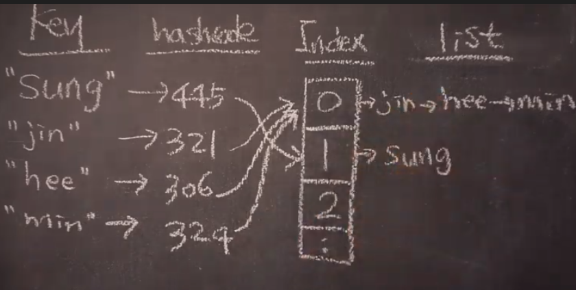
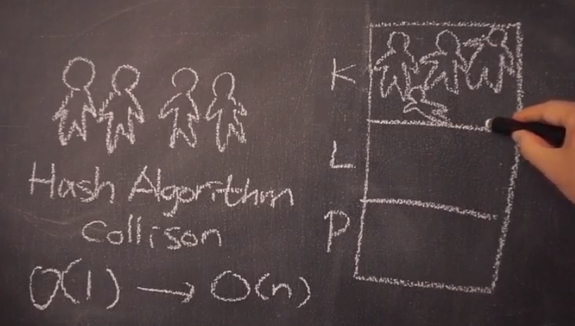
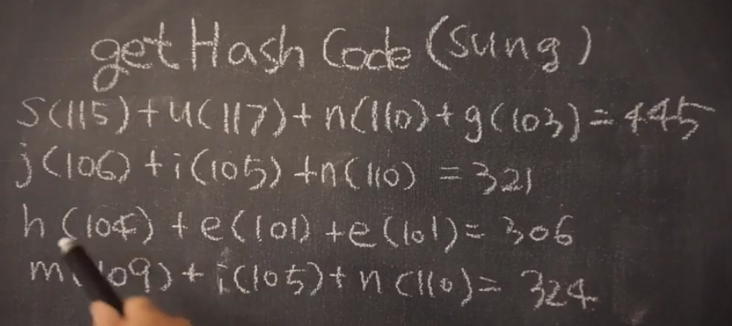
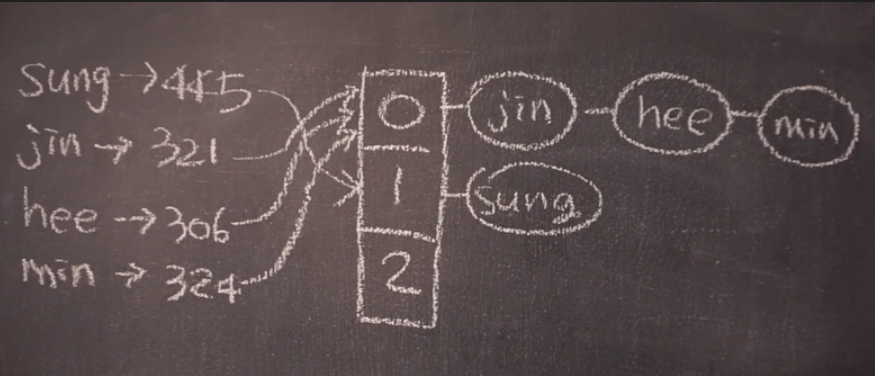

## Hast Table 이란 ?
* 검색 하고자하는 key를 입력받아서 hash 함수를 통해서 받은 hash code를 배열의 Index로 변경해서 Value를 찾는 것

## 장점

* 검색 속도가 빠르다.
* hash 함수를 통해서 생성한 hash code는 정수이다.
* 배열 공간을 미리 고정된 크기로 미리 만들고 hash code를 배열의 갯수로 나머지 연산을 해서 배열에 저장
* hash code가 배열의 index 이다

## Collision

* hash code를 최대한 중복되지 않게 골고루 분배하는 것이 중요
* 서로 다른 key 값이더라도 중복 hash code를 생성할 수 도 있음
* Collision
  * different keys -> Same Code : 다른 key값이지만 동일한 hash code를 갖는 경우
  * different code -> Same Index : 다른 code 지만 동일한 Index를 갖는 경우
  * Collision이 많이 발생하면 O(1) -> O(N) 성능이 변할 수도 있음
  * key 값은 무한한 값인 반면에 hash code는 정수게 만큼 제공되므로 중복되는 키를 피할 수는 없다.
  

## Hash Code 생성

* 간단한 예제, 실제로 이런 코드로 hash code를 생성하면 Collision 자주 발생하게 된다.

* hashCode % array-size
* hashCode가 골고루 분배되지 안항 좋은 알고리즘은 아니다.

## 출저
* [[자료구조 알고리즘] 해쉬테이블(Hash Table)에 대해 알아보고 구현하기](https://www.youtube.com/watch?v=Vi0hauJemxA&feature=youtu.be)