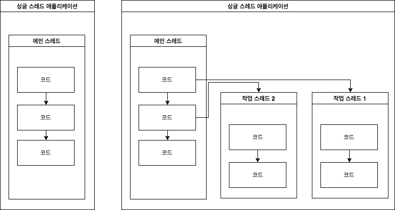
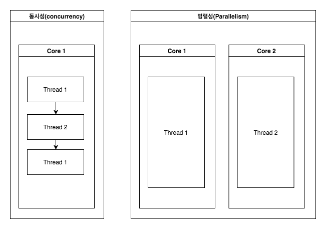

# Thread

이것이 자바다 도서를 보고 정리한 자료입니다.

# 목차

# 멀티 스레드 개념
* 멀티 프로세스 : 독립적으로 프로그램을 실행하고 여러 가지 작업을 처리
* 멀티 스레드 :  한 개의 프로그램을 실행하고 내부적으로 여러 가지 작업 처리
* 메인 스레드
  * 모든 자바 프로그램은 메인 스레드가 메인 메서드를 실행하면서 시작된다.
  * main() 메서드의 첫 코드부터 아래로 순차적으로 실행한다.
  * main() 메서드의 마지막 코드를 실행하거나, return 문을 만나면 실행이 종료된다.
  * 메인 스레드(메인 스레드는 JVM이 생성)는 작업 스레드를 만들어서 병렬로 코드들을 실행 할 수있다.

## 멀티 스레드, 싱글 스레드

* 싱글 스레드 : 메인 스레드가 종료하면 프로세스도 종료된다.
* 멀티 스레드 : 실행 중인 스레드가 하나라도 있다면, 프로세스는 정료되지 않는다.
  * 메인 스레드가 작업 스레드보다 먼저 종료되더라도 작업 스레드가 계속 실행 중이라면 프로세스는 종료되지 않는다.

# 스레드 우선 순위

## 동시성과 병렬성

* 동시성(concurrency)
  * 멀티 작업을 위해 하나의 코드에서 멀티 스레드가 번갈아 가며 실행하는 성질
  * 하나에 한 쓰레드만 실행할 수 있다. 
  * 하나의 쓰레드가 실행하면 다른 스레드는 대기 상태가 된다.
* 병렬성(Parallelism)
  * 멀티 작업을 위해 멀티 코어에서 개별 스레드를 동시에 실행하는 성질

## 스레드 스케줄링

* 스레드의 개수가 코어의 수보다 많은 경우
  * 스레드를 어떤 순서로 동시성으로 실행할것인가를 결정, **스레드 스케쥴링**
  * 스레드 스케쥴링에 의해서 스레드를 번갈아 가면서 그들의 run() 메서드를 조금씩 실행
* 자바의 스레드 스케쥴링
  * 우선순위(Priority) 방식과 순한 할당 (Round-Robin) 방식을 사용
  * 우선순위(Priority) : 우선 순위가 높은 스레드가 실행 상태를 더 많이 가지도록 스케쥴링하는 방식
  * 방식과 순한 할당 (Round-Robin) : 시간 할당량을 정해서 하나의 스레드를 정해진 시간만큼 실행하는 방식

### 우선 순위 
* 스레드들이 동시성을 가질 경우 우선적으로 실행할 수 있는 순위
* 우선 순위는 1(낮음) 부터 10(높음)까지로 부여
  * 모든 스레드들은 기본적으로 5의 우선순위를 할당
* 우선 순위 효과
  * 싱글 코어 경우
    * 우선 순위가 높은 스레드가 실행 기회를 더 많아 가지기 때문에 우선순위가 낮은 스레드보다 계산 작업을 빨리 끝낸다.
  * 멀티 코어 경우
    * 쿼드 코어 경우에는 4개의 스레드가 병렬성으로 실행될 수 있기 때문에 4개 이하의 스레드들을 실핼할 경우 우선순위 방식은 크게 영향을 미치치 못한다.
    * 최소한 5개의 스레드가 실행되어야 우선 순위의 영향을 받는다.

# 동기화 메서드와 동기화 블록

## 공유 객체를 사용할 때 중의 할 점

1. User 1 스레드 : 메모리에 100을 Calculator 객체에 저장
2. User 2 스레드 : 메모리에 50을 Calculator 객체에 저장
3. User 1 스레드 : 출력 100을 예상하지만 50이 출력
4. User 2 스레드 : 50 출력

## 동기화 메서드 및 동기화 블록 - synchronized 
* 단 하나의 스레드만 실핼 할 수 있는 메서드 또는 블록을 말한다.
  * Mutex 방식인거 같음 (뇌피셜)
* 다른 스레드는 메서드나 블록이 실행이 끝날 때까지 대기해야한다.
