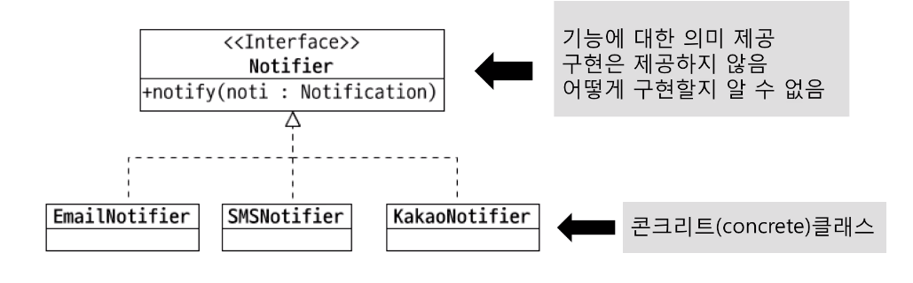
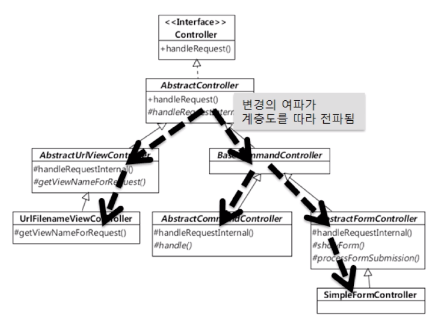
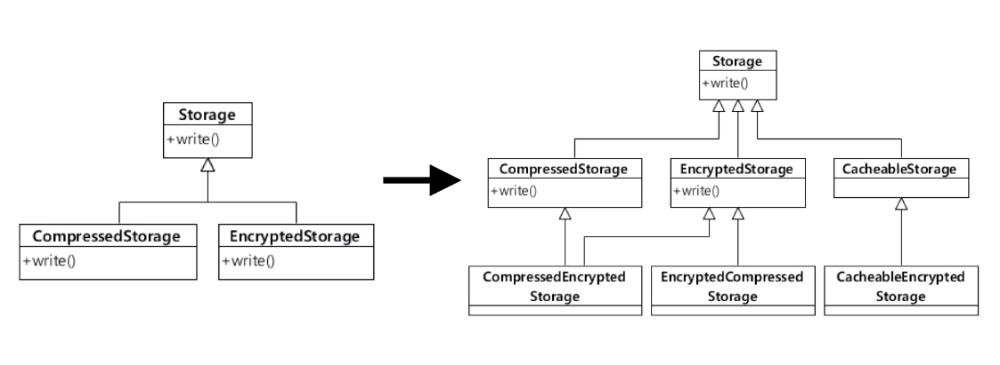
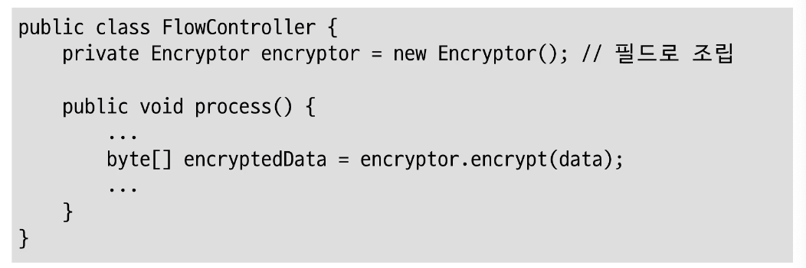

# 객체지향 프로그래밍 입문
[객체지향 프로그래밍 입문 동영상 강의](https://www.inflearn.com/course/%EA%B0%9D%EC%B2%B4-%EC%A7%80%ED%96%A5-%ED%94%84%EB%A1%9C%EA%B7%B8%EB%9E%98%EB%B0%8D-%EC%9E%85%EB%AC%B8/)

# 목차
- [객체지향 프로그래밍 입문](#%ea%b0%9d%ec%b2%b4%ec%a7%80%ed%96%a5-%ed%94%84%eb%a1%9c%ea%b7%b8%eb%9e%98%eb%b0%8d-%ec%9e%85%eb%ac%b8)
- [목차](#%eb%aa%a9%ec%b0%a8)
- [객체](#%ea%b0%9d%ec%b2%b4)
  - [절차 지향](#%ec%a0%88%ec%b0%a8-%ec%a7%80%ed%96%a5)
  - [객체 지향](#%ea%b0%9d%ec%b2%b4-%ec%a7%80%ed%96%a5)
  - [객체란 ?](#%ea%b0%9d%ec%b2%b4%eb%9e%80)
  - [클래스란 ?](#%ed%81%b4%eb%9e%98%ec%8a%a4%eb%9e%80)
  - [캐슐화](#%ec%ba%90%ec%8a%90%ed%99%94)
  - [캡슐화를 위한 규칙](#%ec%ba%a1%ec%8a%90%ed%99%94%eb%a5%bc-%ec%9c%84%ed%95%9c-%ea%b7%9c%ec%b9%99)
    - [Tell, Don't Ask : 묻지 말고 시켜라](#tell-dont-ask--%eb%ac%bb%ec%a7%80-%eb%a7%90%ea%b3%a0-%ec%8b%9c%ec%bc%9c%eb%9d%bc)
      - [Demeter's Law](#demeters-law)
    - [캡슐화 정리](#%ec%ba%a1%ec%8a%90%ed%99%94-%ec%a0%95%eb%a6%ac)
- [추상화](#%ec%b6%94%ec%83%81%ed%99%94)
  - [다형성](#%eb%8b%a4%ed%98%95%ec%84%b1)
  - [추상화](#%ec%b6%94%ec%83%81%ed%99%94-1)
    - [타입 추상화](#%ed%83%80%ec%9e%85-%ec%b6%94%ec%83%81%ed%99%94)
    - [추상화는 의존 대상이 변경하는 시점에](#%ec%b6%94%ec%83%81%ed%99%94%eb%8a%94-%ec%9d%98%ec%a1%b4-%eb%8c%80%ec%83%81%ec%9d%b4-%eb%b3%80%ea%b2%bd%ed%95%98%eb%8a%94-%ec%8b%9c%ec%a0%90%ec%97%90)
    - [추상화를 잘 하려면](#%ec%b6%94%ec%83%81%ed%99%94%eb%a5%bc-%ec%9e%98-%ed%95%98%eb%a0%a4%eb%a9%b4)
- [상속보단 조립](#%ec%83%81%ec%86%8d%eb%b3%b4%eb%8b%a8-%ec%a1%b0%eb%a6%bd)
  - [상속과 재사용의 단점](#%ec%83%81%ec%86%8d%ea%b3%bc-%ec%9e%ac%ec%82%ac%ec%9a%a9%ec%9d%98-%eb%8b%a8%ec%a0%90)
    - [상위 클래스 변경 어려움](#%ec%83%81%ec%9c%84-%ed%81%b4%eb%9e%98%ec%8a%a4-%eb%b3%80%ea%b2%bd-%ec%96%b4%eb%a0%a4%ec%9b%80)
    - [클래스 증가](#%ed%81%b4%eb%9e%98%ec%8a%a4-%ec%a6%9d%ea%b0%80)
    - [상속 오용](#%ec%83%81%ec%86%8d-%ec%98%a4%ec%9a%a9)
    - [상속의 단점 해결은 조립](#%ec%83%81%ec%86%8d%ec%9d%98-%eb%8b%a8%ec%a0%90-%ed%95%b4%ea%b2%b0%ec%9d%80-%ec%a1%b0%eb%a6%bd)
- [기능과 책임 분리](#%ea%b8%b0%eb%8a%a5%ea%b3%bc-%ec%b1%85%ec%9e%84-%eb%b6%84%eb%a6%ac)
  - [기능 분해](#%ea%b8%b0%eb%8a%a5-%eb%b6%84%ed%95%b4)
  - [기능을 누가 제공할것인가 ?](#%ea%b8%b0%eb%8a%a5%ec%9d%84-%eb%88%84%ea%b0%80-%ec%a0%9c%ea%b3%b5%ed%95%a0%ea%b2%83%ec%9d%b8%ea%b0%80)
  - [큰 클래스, 큰 메서드](#%ed%81%b0-%ed%81%b4%eb%9e%98%ec%8a%a4-%ed%81%b0-%eb%a9%94%ec%84%9c%eb%93%9c)
  - [패턴 적용](#%ed%8c%a8%ed%84%b4-%ec%a0%81%ec%9a%a9)
- [의존과 DI](#%ec%9d%98%ec%a1%b4%ea%b3%bc-di)
  - [의존](#%ec%9d%98%ec%a1%b4)
  - [의존 주입 DI](#%ec%9d%98%ec%a1%b4-%ec%a3%bc%ec%9e%85-di)
- [정리](#%ec%a0%95%eb%a6%ac)
# 객체


## 절차 지향


* 프로시저와 데이터간의 접근이 자유롭다
* 개발 초기단계에서는 편의성이 있지만 시간이 지날수록 프로시저가 어느 데이터에든 접근 할 수있어 캡슐화가 저하되있기 때문에 개발이 어려운 점이 있다.

## 객체 지향


* 처음에는 어려울 수 있음
    * 데이터 프로시저를 알맞게 묶는 것이 어려움
* 하지만 시간이 흘러갈 수록 캡슐화 이점 때문에 큰 장점이 있음

## 객체란 ?

**객체의 핵심 -> 기능 제공**
* 객체는 제공하는 기능으로 정의
  * 내부적으로 가진 필드(데이터로) 정의 하지 않음
  * 데이터(맴버 필드)가 중요하지 않음 기능 으로 정의
  * 해당 기능이 동작할때 맴버 필드 들이 변경 됨

* 객체와 객체 상호 작용: 메시지를 주고 받는 
  * 메서드를 출하는 메시지, 리턴하는 메시지, 입렙션 메시지 **클래스 간의 상호 작용이 메시지라고 정의**

## 클래스란 ?
**클래스라는 개념의 목적은 데이터를 캡슐화 하고 캡슐화한 데이터를 다루는 코드를 한 곳에서 관리하는 것이다.**

## 캐슐화
* 데이터 + 관련 된 기능 묶기
* 객체가 기능을 어떻게 구현했는지 외부에 감추는 것(정보은닉)
  * 구현에 사용된 데이터의 상세 내용을 외부에 감춤
* 정보 은닉 의미  포함
  * 최근에는 캡슐화에 정보은닉이라는 개념도 포함시켜 이야기함
  * 즉 캡슐화은 정보 은닉이라는 개념도 포함되 있다.
* **외부에 영향 없이 객체 내부 구현 변경 가능**
  * **기능의 구현을 외부에 감춤**
  * **기능을 사용한 코드에 영향을 주지 않고 내부 규현을 변경할 수 있는 유연함**


## 캡슐화를 위한 규칙 

### Tell, Don't Ask : 묻지 말고 시켜라

```java
// 묻고 있다.
if(acc.getMemberShip() == REGUAR) {...}

if (acc.hasRegularPermission()){...}
```

#### Demeter's Law
* 메서드에서 생성한 객체의 메서드만 호출
* 파라미터로 받은 객체의 메서드만 호출
* 필드로 참조하는 객체의 메서드만 호출

```java
acc.getExpDate().isAfter(now) // 안티
acc.isExpired(now) // 적절

Date date = acc.getExpDate;
data.isAfter(now); // 안티
acc.isValid(now); // 적절

```
### 캡슐화 정리
* 캡슐화 : 기능의 구현을 외부에 감춘
* 캡슐화를 통해 기능을 사용하는 코드에 영향을 주지 않고(또는 최소화) 내부 규현을 변경할 수 있는 유연함


# 추상화

## 다형성

* 다형성 : 여러 모습을 갖는 것
* 객체 지향에서는 한 객체가 여러 타입을 갖는 것
  * 즉 한 객체가 여러 타입의 기능을 제공
  * 타입 상속으로 다형성 구현 (하위 타입은 상위 타입도 됨)

## 추상화
* 데이터나 프로세스 등을 의미가 비슷한 개념이나 의미 있는 표현으로 정의하는 과정
* 두 가지 방식의 추상화
  * 특성한 성질, 공통 설징(일반회)
* 간단한 예
  * DB의 User 테이블 : 아이디, 이름, 이메일
  * Money 클래스 : 통화, 금액
  * 프린터 : HP MXXXX, 삼성 SL-M2XXX 
  * GPU: 지포스, 라데온


### 타입 추상화


* 여러 구현 클래스를 대표하는 상위 타입 도출
* 흔히 인터페이스 타입으로 추상화
* 추상화 타입과 구현 타입 상속으로 연결

### 추상화는 의존 대상이 변경하는 시점에
* 추상화 -> 추상 타입 증가 -> 복잡도 증가
  * 아직 존재하지 않은 기능에 대한 이른 추상화는 주의 : 잘못된 추상화 가능성, 복잡도만 증가
  * 실제 변경, 확장이 발생 할때 추상화

### 추상화를 잘 하려면
* 구현을 한 이유가 무엇 때문인지 생각해야함

# 상속보단 조립

## 상속과 재사용의 단점



### 상위 클래스 변경 어려움
* **상위 클래스의 변경시 하위 클래스가 비 정상적으로 동작할 가능성이 높음**
* 상위 클래스 입장에서는 어느 하위 클래스가 추가될지 알 수가 없음
* **하위 클래스는 상위 클래스의 동작 방법에 어느정도는 알아야함**
  * 상위 클래스는 하위 클래스에 대해 캡슐화가 약해지게 됨


### 클래스 증가

* 새로운 조합이 생길때마다 새로은 클래스가 생김
* 새로운 조합이 생길때 어느 클래스를 상속 받아야 할지 어려움
* CompressedStorage 압축 기능 추가 , EncryptedStorage 암호화 기능 이 있을 때 CachedableStorage 캐시 기능을 제공
  * CompressedStorage 기능과, EncryptedStorage 기능이 필요할 경우 두 클래스를 상속해서 기능 제공?
  * 새로운 조합이 생길때 마다 클래스를 만들어야함


### 상속 오용
* 상위 클래스의 메소드를 호출할 가능성이 있음
* 상위 클래스의 메소드를 호출하게 되어 생각지 못하게 동작하게됨
* 이는 실수하기 너무 좋은 구조

### 상속의 단점 해결은 조립


* **여러 갹체를 묶어서 더 복잡한 기능을 제공**
* **보통 필드로 다른 객체를 참조하는 방식으로 조립 또는 객체를 필요 시점에 생성 / 구함**
* 조립을 통한 기능 재사용, 단순 재사용의 목적으로 상속을 하는 것은 상속의 오용
* 조립을 통한 확장은 클래스 증가를 억제할 수 있음
* 상속하기 위해 앞서 조립으로 풀 수 없는 지 검토
* **진짜 하위 타입인 경우에만 상속을 사용해야 한다.**


# 기능과 책임 분리

## 기능 분해
```
            변경 대상 확인 -> 대상을 구함, 없으면 오류 응답
암호 변경 -> 
            대상 암호 변경 -> 암호 일치 여부 확인 -> 불일치 경우 예외, 일치 경우 비밀번호 변경

```
* 기능은 하위 기능으로 분해


## 기능을 누가 제공할것인가 ?
* **기능은 곧 책임**
* 분리한 각 기능을 알맞게 분배

## 큰 클래스, 큰 메서드
* 클래스나 메서드가 커지면 전차 지향의 문제 발생
  * 큰 클래스 -> 많은 필드를 많은 메서드가 공유
  * 큰 메서드 -> 많은 변수를 많은 코드가 공유
  * 여러 기능이 한 클래스 / 메서드에 썩여 있을 가능성
  * **많은 필드와 변수를 여러 기능에서 공유할 간으성이 높아짐, 서로 다른 코드가 데이터를 읽고 변경함으로써 점점 코드를 수정하기 어려운 구조가 된다.**
* 책임에 따라 알맞게 코드 분리

## 패턴 적용
* 간단한 웹
  * 컨트롤러, 서비스, DAO
* 복잡한 도메인
  * 엔티티, 베류, 레포지토리, 도메인 서비스
* AOP
  * 공통 기능
* GoF
  * 팩토리, 빌더, 전략, 템플릿 메서드, 프록시/데코레이터 등

# 의존과 DI

## 의존
* 기능 구현을 위해 다른 구성 요소를 사용하는 것
  * 의존의 예: 객체 생성, 메서드 호출, 데이터 사용
* 의존은 변경이 전파될 가능성을 의미
  * 의존하는 대상이 바뀌면 바뀔 가능성이 높아짐
  * ex) 호출하는 메서드의 파라미터가 변경
  * ex) 호출하는 메서드가 발생할 수 있는 익셉션 타입이 추가
* 순한 의존
  * 변경 연쇄 전파 가능성
  * 클래스, 패키지, 모듈 등 등 모둔 수준에서 순혼 의존 없도록

## 의존 주입 DI
* 외부에서 의존 갹체를 주입
  * 생성자나 메서드를 이용해서 주입
* DI 장점
  * 상위 타입을 사용할 경우 의존 대상이 바뀌면 조립기 설정만 변경하면됨 
* DI를 습관처럼 사용하기
  * 의존 객체는 주입받도록 코드 작성하는 습관

# 정리
* 소프트웨어의 가치는 변화
  * 적은 비용으로 변화할 수 있는 방법 중 하나 객체 지향
* 객체는 제공하는 기능으로 정의
  * ex) 회원 객체, 암호 변경 기능
* 메서드를 이용해서 기능 명세
  * 이름, 파라미터, 결과로 구성


