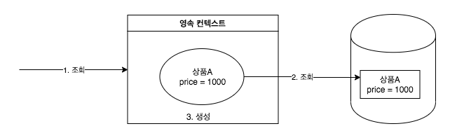
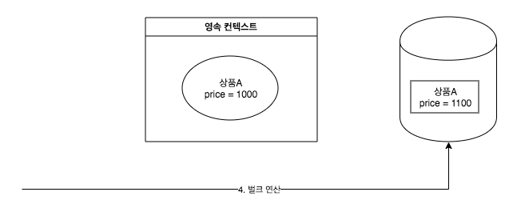
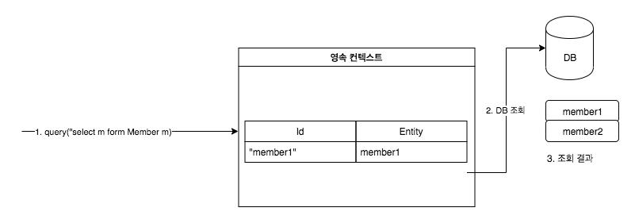
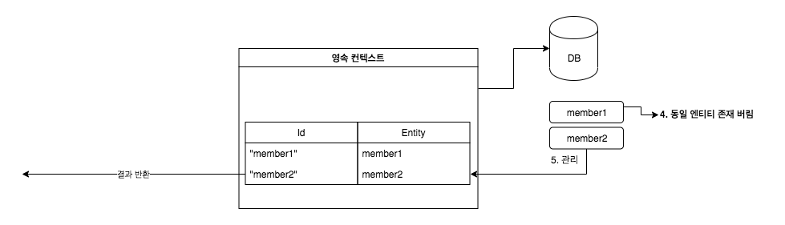
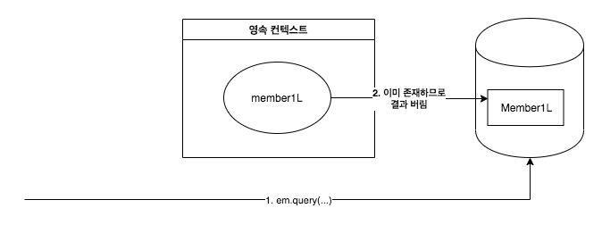
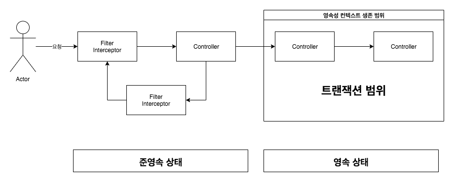
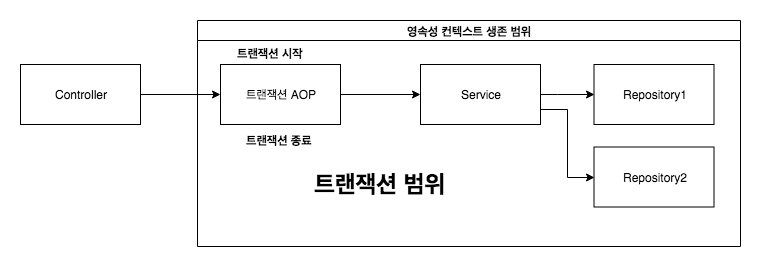
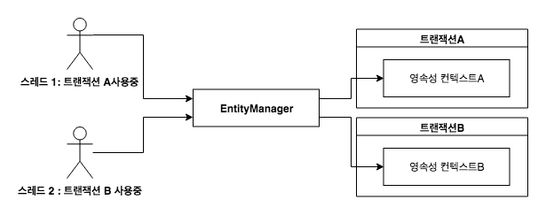

> [자바 ORM 표준 JPA 프로그래밍 ](http://www.acornpub.co.kr/book/jpa-programmig)를 보고 정리한 글입니다.


# 영속 성컨텍스트

## 영속성 컨텍스트의 특징

* 영속성 컨텍스트와 식별자 값 : 영속성 컨텍스트는 엔티티를 식별자 값(@Id)으로 구분한다. 따라서 **영속 상태는 식별자 값이 반드시 있어야한다.**
* 영속성 컨텍스트와 데이터베이스 저장 : JPA는 보통 트랜잭션을 커밋하는 순간 영속성 컨텍스트에 새로 저장된 엔티티를 데이터베이스에 반영하는데 이것을 **플러시**라 한다.
* 영속성 컨텍스트가 엔티티를 관리하면 다음과 같은 장점이 있다.
  * 1차 캐시
  * 동일성 보장
  * 트랜잭션을 지원하는 쓰기 지연
  * 변경 감지
  * 지연 로딩

## 엔티티 조회

### 1차 캐시 조회


`em.find()`를 호출하면 우선 1차 캐시에서 식별자 값으로 엔티티를 찾는다. 만약 찾는 엔티티가 있다면 데이터베이스를 조회하지 않고 메모리에 있는 1차 캐시에서 엔티티를 조회한다.

### 데이터베이스 조회


만약 `em.find()`를 호출했는데 엔티티가 1차 캐시에 없으면 엔티티 매니저는 데이터 베이스를 조회해서 엔티티를 생성한다. 그리고 1차캐시에 저장한 후에 영속성 상태의 엔티티를 반환한다.

1. `em.find(Member.class, "member2")`를 실행한다.
2. member2가 1차 캐시에 없음으로 데이터베이스에 조회한다.
3. 조회한 데이터로 member2 엔티티를 생성해서 1차 캐시에 저장한다.
4. 조회한 엔티티를 반환한다.

### 영속 엔티티의 동일성 보장

```java
Member a = em.find(Member.class, "member1");
Member b = em.find(Member.class, "member1");

System.out.println(a == b) // 동일성 비교 결과 : true
```
**영속성 컨텍스트는 1차 캐시에 있는 같은 엔티티 인스턴를 반환한다. 따라서 둘은 같은 인스턴스고 결과는 당연히 true이다. 영속성 컨텍스트는 성능상 이점과 엔티티의 동일성을 보장한다.**

## 엔티티 등록

```java
EntityMaanger em  = emf.createEnttiyManager();
ENtityTranscation transaction = em.getTransaction();
// 엔티티 매니저는 데이터 변경 시 트랜잭션을 시작해야한다.

transaction.begin();

em.persist(memberA);
em.persist(memberB);

// 여기까지 Insert SQL을 데이터베이스에 보내지 않는다.

// Commit을 하는 순간 데이터베이스에 Insert SQL을 보낸다
transaction.commit();
```
엔티티 매니저는 트랜잭션을 커밋하기 직전까지 데이터베이스에 엔티티를 저장하지 않고 내부 쿼리 저장소에 INSERT SQL을 모아둔다. 그리고 트랜잭션을 커밋할 때 모아둔 쿼리를 데이터베이스에 보내느데 이것을 트랜잭션을 지원하는 쓰기 지연 이라 한다.


회원 A를 영속화 했다. 영속성 컨텍스트는 1차 캐시에 회원 엔티티를 저장하면서 동시에 회원 엔티티 정보로 등록 쿼리를 만든다. 그리고 만들어진 등록 쿼리를 쓰기 지연 SQL 저장소에 보관한다.


다음으로 회원 B를 영속화했다. 마찬가지로 회원 엔티티 정보로 등록 쿼리를 생성해서 쓰지 지연 SQL 저장소에 보관한다. 현재 쓰기 지연 SQL저장소 에는 등록 쿼리가 2건이 저장되어 있다.


마지막으로 트랜잭션을 커밋했다. **트랜잭션을 커밋하면 엔티티 매니저는 우선 영속성 컨텍스트를 플러시한다. 플러시는 영속성 컨텍스트의 변경 내용을 데이터베이스에 동기화하는 작업인데 이때 등록, 수정, 삭제한 엔티티를 데이터베이스에 반영한다.**

즉, 쓰기 지연 SQL 저장소에 모인 쿼리를 데이터베이스에 보낸다. 이렇게 영속성 컨텍스트의 변경 내용을 데이터베이스에 동기화한 후에 실제 데이터베이스 트랜잭션을 커밋한다.

:bangbang:
flush가 먼저 동작하고 (데이터베이스에 동기화한 후에) 실제 데이터베이스 트랜잭션을 커밋한다.

### 트랜잭션을 지원하는 쓰기 지연이 가능한 이유

```
begin(); // 트랜잭션 시작

save(A);
save(B);
save(C);

commit(); // 트랜잭션 커밋
```

1. 데이터를 저장하는 즉시 등록 쿼리를 데이터베이스에 보낸다. 예제에서 save() 메서드를 호출할 때 마다 즉시 데이터베이스에 등록 쿼리를 보낸다. 그리고 마지막에 트랜잭션을 커밋한다.
2. 데이터를 저장하면 등록 쿼리를 **데이터베이스에 보내지 않고 메모리에 모아 둔다.** 그리고 트랜잭션을 커밋할 때 모아둔 등록 쿼리를 데이터베이스에 보낸다.

트랜잭션 범위 안에서 실행되므로 둘다 결과는 같다. A, B, C 모두 트랜잭션을 커밋하면 함께 저장되고 롤백하면 함께 저장되지 않는다. **등록 쿼리를 쓸때 그때 데이터베이스에 전달해도 트랜잭션을 커밋하지 않으면 아무 소용이 없다.** 어떻게든 커밋 직전에만 데이터베이스에 SQL을 저장하면 된다. 이것이 트랜잭션을 지원하는 쓰기 지연이 가능한 이유다. 이 기능을 잘 활용하면 모아둔 등록 쿼리를 데이터베이스에 한 번에 전달해서 성능 최적화할 수 있다.

:bangbang:
1, 2이든 결국 commit 액션이 없으면 데이터베이스에 반영되지 않으니 쿼리를 한 번에 모아놓고 한 번에 전달하는 것이 차이다. 트랜잭션 단위는 1, 2 번 모두 동일하다.

## 엔티티 수정

### 수정 쿼리의 문제점
수정 쿼리는 비지니스 요구사항에 맞게 지속적으로 늘어난다 그리고 비지니스 로직을 분석하기 위해서는 SQL을 계속 확인해야한다. 결국 직접적이든 간접적이든 비지니스 로직이 SQL에 의존하게 된다.

### 변경 감지
```java
EntityMaanger em  = emf.createEnttiyManager();
ENtityTranscation transaction = em.getTransaction();
transaction.begin(); // 트랜잭션 시작

// 영성속 텐티티 조회
Member memberA = em.find(Member.class, "memberA");

// 영속성 엔티티 데이터 수정

memberA.setUsername("hi");
memberA.setAge(10);

//em.update(member) 이런 코드가 있어야하지 않을까?

transaction.commit(); // 트랜잭션 커밋
```

JPA로 엔티티를 수정할 때는 단순히 엔티티를 조회해서 데이터만 변경하면 된다. `emm.update` 같은 메서드를 실행해야할거 같지만 이런 메서드는 없다. **엔티티의 변경사항을 데이터베이스에 자동으로 반영하는 기능을 변경 감지(dirty checking) 이라 한다.**


JPA는 엔티티를 영속성 컨텍스트에 보관할 때, **최초 상태를 복사해서 저장해두는데 이것을 스냅샷이리고 한다.** 그리고 플러시 시점에서 스냡샵과 엔티티를 비교해서 변경된 엔티티를 찾는다.

1. **트랜잭션을 커밋하면 엔티티 매니저 내부에서 먼저 플러시가 호출된다.**
2. 엔티티와 스냅샵을 비교해서 변경된 엔티티를 찾는다.
3. **변경된 엔티티가 있으면 수정 쿼리를 생성해서 쓰기 지연 SQL 저장소에 보낸다.**
4. 쓰기 지연 저장소의 SQL을 데이터베이스에 보낸다.
5. 데이터베이스 트랜잭션을 커밋한다.

**변경 감지는 영속성 컨텍스타 관리하는 영속 상태의 엔티티에만 적용된다.** 비용속, 준영속처럼 영속성 컨텍스트의 관리를받지 못하는 엔티티는 값을 변경해도 데이터베이스에 반영되지 않는다.


실제로 반영되는 수정 SQL은 아래와 같다.
```sql
// 수정된 데이터만 반영할 것으로 예상
UPDATE MEMBER
SET 
    name = ?,
    age = ?,
WHERE
    id = ?

// 실제 엔티티의 모든 필드를 수정에 반영
UPDATE MEMBER
SET 
    name = ?,
    age = ?,
    grade = ?
    ...
WHERE
    id = ?
```
이렇게 모든 필드를 사용하면 데이터베이스에 보내는 데이터 전송량이 증가하는 단점이 있지만, 다음과 같은 장점으로 인해 모든 필드를 업데이트한다.

* 모든 필드를 사용하면 수정 쿼리가 항상 같다. 따라서 애플리케이션 로딩 시점에 **수정 쿼리를 미리 생성해두고 재사용할 수 있다.**
* **데이터베이스에 동일한 쿼리를 보내면 데이터베이스는 이전에 한 번 파싱된 쿼리를 재사용할 수 있다.**

필드가 많거나 저장되는 내용이 너무 크면 수정된 데이터만 사용해서 동적으로 UPDATE SQL을 생성하는 전략을 선택하면 된다.

```java
@Entity
@org.hibernate.annotations.DynamicUpdate
@Table(name "member")
```

위 `@DynamicUpdate` 어노테이션을 사용하면 수정된 데이터만 사용해서 동적으로 UPDATE SQL을 생성한다. 데이터를 저장할 때 필드만을 INSERT SQL을 동적으로 생성하는 `@DynamicInsert`도 있다.

### 엔티티 삭제
엔티티를 삭제하려면 먼저 삭제 대상 엔티티를 조회해야한다.

```java
Member meberA = em.find(Member.class, "memberA"); // 삭제할 대상 엔티티 조회
em.remove(memberA); // 엔티티 삭제
```
em.remove()에 삭제 대상 엔티티를 넘겨주면 엔티티를 삭제한다. 물론 엔티티를 즉시 삭제하는 것이 아니라 엔티티 등록과 비슷하게 삭제 쿼리를 쓰기 지연 데이터베이스에 삭제 쿼리를 전달한다. 

**em.remove()를 호출하는 순간 memberA는 영속성 컨텍스트에서 제거된다. 이렇게 삭제된 엔티티는 재사용하지 말고 자연스럽게 가비지 컬렉션의 대상이 되도록 두는 것이 좋다.**

## 플러시
**플러시는 영속성 컨텍스의 변경 내용을 데이터베이스에 반영한다.** 플러시를 실행하면 구체적으로 다음과 같은 일이 일어난다.

1. 변경 감자기 동작해서 영속성 컨텍스트에 있는 모든 엔티티를 스냅샷과 비교 해서 수정된 엔티티를 찾는다. 수정 엔티티는 수정 쿼리를 만들어 쓰기 지연 SQL 등록한다.
2. 쓰기 지연 SQL 의 저장소의 쿼리를 데이터베이스에 전송한다. (등록, 수정, 삭제 쿼리)


영속성 컨텍스트를 플러시 하는 방법은 3가지다.

1. em.flush()를 직접 호출한다.
2. 트랜 잭션 커밋 시 플러시가 자동 호출된다.
3. JPQL 쿼리 실행 시 플러시가 자동 호출된다.

### 직접 호출
엔티티 매니저의 flush() 메서드를 직접 호출해서 영속성 컨텍스트를 강제로 플러시 한다. **테스트나 다른 프레임워크와 JPA 함께 사용할 때는 제외하고 거의 사용하지 않는다.**

### 트랜잭션 커밋 시 플러시 자동 호출
데이터베이스에 변경 내용을 SQL로 전달하지 않고 트랜잭션만 커밋하면 어떤 데이터도 데이터베이스에 반영되지 않는다. 따라서 **트랜잭션을 커밋하기 전에 꼭 플러시를 호출해서 영속성 컨텍스트의 변경 내용을 데이터베이스에 반영해야 한다.** JPA는 이런 문제를 예방하기 위해서 트랜잭션 커밋할 때 **플러시를 자동으로 호출한다.**

### JPQL 쿼리 실행시 플러시 자동 호출
JPQL이나 QueryDSL 같은 객체지향 쿼리를 호출할 플러시가 실행된다. 

```java
em.persist(memberA);
em.persist(memberB);
em.persist(memberC);

query = em.createQuery("select m from Member m", Member.class);
List<Member> member query.getResultList();
```
1. `em.persist()`를 호출해서 엔티티 memberA, memberB, memberC를 영속 상태로 만듬
2. 이 엔티티들은 영속성 컨텍스트에 있지만 아직 데이터베이스에 반영되지 않았다.(플러시가 호출되지 않았음으로)
3. `select m from Member m` 조회 쿼리는 아직 데이터베이스 commit이 이루어지지 않았다면 조회되지가 않는다.


이런 결과가 나오기 때문에 **쿼리를 실행하기 직전에 영속성 컨텍스트를 플러시해서 변경 내용을 데이터베이스에 반영해야 한다.** JPA는 이런 문제를 예방하기 위해서 JPQL을 실행할 때도 플러시르 자동 호출한다. **참고로 식별자를 기준으로 조회하는 find() 메서드는 호출되지 않는다.**


:exclamation: 식별자로 찾는 경우에는 영속성 컨텍스트에 있는 경우 리턴하고, 없는 경우 데이터베이스에 들려서 조회하면 되기 때문에 플러시를 동작 시키지 않는거 같다. 반면 대상이 대상이 명확지 않은 조건에는 일단 플러시를 방동시키고 데이터베이스에 반영하고 그 후 조회 SQL을 실행하는 같다.


### 플러시 모드 옵션
* FlushModType.AUTO: 커밋이나 쿼리를 실행할 때 플러시(기본값)
* FlushModType.COMMIT: 커밋할 때만 플러시

## 준영속
영속성 컨텍스트가 관리하는 영속 상태의 엔티티가 영속성 컨텍스트에서 분리된 detach 준영속 상태라 한다. 준영속 상태의 엔티티는 영속성 컨텍스트가 제공하는 기능을 사용할 수 없다.

1. `em.detach(entity)`: 특정 엔티티만 준영속 상태로 전환한다.
2. `em.clear()`: 영속성 컨텍스트를 완전히 초기화한다.
3. `em.close()`: 영속성 컨텍스트를 종료한다.

### 엔티티를 준영속 상태로 전환: detach()
```java
public void testDetached() {
    // 회원 엔티티 생성, 비용속 상태
    Member member = new Member();
    member.setId("memberA");
    member.setUsername("회원A");

    // 회원 엔티티 영속 상태
    em.persist(member);

    // 회원 엔티티를 영속성 컨텍스트에 분리, 분영속 상태
    em.detach(member);

    transaction.commit(); // 트랜잭션 커밋
}
```


영속성 컨텍스트에 대해서 memberA에 대한 모든 정보를 삭제한다. **영속 상태였다가 더는 영속성 컨텍스트가 관리하지 않은 상태를 준영속 상태라 한다**. 이미 준영속 상태 이므로 영속성 컨텍스트가 지원하는 기능은 동작하지 않는다. **심지어 지연 SQL 저장소에 저장된 SQL로 제거어 데이터베이스에 저장되지 않는다.**  준영속 상태라는 것은 영속성 컨텍스트로 부터 분리 detached된 상태이다.

### 영속성 컨텍스트 초기화: clear()
```java
// 엔티티 조회, 영속 상태
Member member = em.find(Member.class, "memberA");

em.clear(); // 영속성 컨텍스트 초기화

// 준영속 상태
member.setUsername("changeName");
```


**모든 영속성 컨텍스트에 있는 것이 초기화 된다. 이것은 영속성 컨텍스트를 제거하고 새로 만든 것과 같다.** 영속성 컨텍스트에 있던 기존 엔티티들은 준영속 상태가 된다.

그리거 준영속 상태이므로 영속성 컨텍스트가 지원하는 변경 감지는 동작하지 않는다. 따라서 이름을 변경해도 반영되지 않는다.

### 영속성 컨텍스트 종료: close()
```java
public void closeEntityManager() {
    EntityManagerFactory emf = Persistnxe.createEntityManagerFactory("book");

    EntityManager em = em.createEntityManager();
    EntityTransaction transaction = em.getTransaction();

    transaction.begin(); // 트랜잭션 시작

    Member memberA = em.find(Member.class, "memberA");
    Member memberB = em.find(Member.class, "memberB");

    transaction.commit(); // 트랜잭션 커밋

    em.close(); // 영속성 컨텍스트 종료
}
```


모든 영속성 켄텍스트가 종료되어 더는 memberA, memberB가 관리되지 않는다.

### 준영속 상태의 특징

#### 거의 비용속성 상테에 가깝다
영속성 컨텍스트가 관리하지 않음으로 1차 캐스, 쓰기 지연, 변경 감자, 지연로딩을 포함한 영속성 컨텍스트가 제공하는 어떠한 기능도 동작하지 않는다.

#### 식별자 값을 가지고 있다.
비용속 상태는 식별자 값을 없을수도 있지만 준영속 상태는 이미 한 번 영속 상태 였음으로 반드시 식발져 값을 가지고 있다.

#### 지연 로딩 할 수 없다.
레이지 로딩은 실제 객체 대신 프록시 객체를 로딩해두고 해당 객체를 실제 사용할 때 영속성 컨텍스트를 통해 데이터를 불러오는 방법이다. 하지만 준영속 상태는 영속성 컨텍스트가 더는 관리하지 않으므로 지연 로딩 시 문제가 발생한다. 

### 병합: merge()
준영속 상태의 엔티티를 다시 영속 상태로 변경하려면 병합을 사용하면 된다. **merge() 메서드는 준영속 상태의 엔티티를 바당서 그 정보로 새로운 영속 상태의 엔티티를 반환한다.**

# 프록시와 연관관계 관리
* 프록시와 즉시로딩, 지연로딩: 객체는 객체 그래프로 연관된 객체를 탐색한다. 그런데 객체가 데이터베이스에 저장되어 있으므로 연관된 객체를 마음껏 탐색하기는 어렵다. JPA 구현체들은 이 문제를 해결하고자 프록시라는 기술을 사용한다. 프록시를 사용하면 영관된 객체를처음부터 데이터베이스에서 조회하는 것이 아니라, 실제 사용하는 시점에 데이터베이스에서 조회할 수 있다. 하지만 자주 함께 사용하는 객체들은 조인을 사용해서 함께 조회하는 것이 효과적이다. **JPA는 즉시 로딩과 지연 로딩이라는 방법으로 둘을 모두 지원한다.**
* 영속성 전이와 고아 객체: JPA는 연관된 객체를 함께 저장하거나 함께 삭제할 수 있는 영속성 전이와 고와 객체를 제거라는 편리한 기능을 제공한다.

## 프록시

### 프록시 기초
엔티티를 실제 사용하는 시좀 까지 데이터베이스 조회를 미루고 싶다면 `Member meber = em.getReference(Member.class, "member");` 이 메서드를 호출할 때 JPA는 데이터베이스를 조회하지 않고 실제 엔티티 객체도 생성하지 않는다. 대신 데이터베이스 접근을 위임한 프록시 객체를 반환한다.

#### 프록시 객체의 특징
프록시 클래스는 실제 클래스를 상속 받아서 만들어지므로 실제 클래스와 겉모양이 같다. 따라서 사용하는 입장에서는 이것이 진짜 객체인지 프록시 객체인지 구분하지 않고 사용하면 된다.

#### 프록시 객체의 초기화
!

**프록시 객체는 실제 객체에 대한 참조(Target)를 보관한다. 프록시 객체의 메소드를 호출하면 프록시 객체는 실제 객체의 메서드를 호출한다.** 프록시 객체는 `member.getName()` 처럼 실제 사용될 때 데이터베이스를 조회해 실제 엔티티 객체를 생성하는데 이것을 프록시 객체의 초기화라 한다.


```java
// Proxy 객체 반환
Member member = em.getReferecne(Member.class, "id1");
member.getName(); // 1. geName()

// 프록시 클래스 예상 코드
class MemberProxy extends Member{

    Member target = null; // 실제 엔티티 참조

    if(target == null) {
        // 2. 초기화 진행
        // 3. DB조회
        // 4. 실제 엔티티 생성 및 참조 보관
        this.target = ...;
    }
    // 5. target.getName();
    return target.getName();
}
```
1. 프록시 객체에 `member.getName()`을 호출해서 실제 데이터를 조회한다.
2. **프록시 객체는 실제 엔티티가 생성되어 있지 않으면 영속성 컨텍스트에 실제 엔티티 생성을 요청 하는데 이것을 초기화라 한다.**
3. 영속성 컨텍스트는 데이터베이스를 조회해서 실제 엔티티 객체를 생성한다.
4. 프록시 객체는 생성된 실제 엔티티 객체의 참조를 Member target 멤버변수에 보관한다.
5. 프록시 객체는 실제 엔티티 객체의 `getName()`을 호출해서 결과를 반환한다.

#### 프록시의 특징
1. **프록시 객체는 처음 사용할 때 한번만 초기화 된다.**
2. 프록시 객체를 초기화한다고 프록시 객체가 **실제 엔티티로 바뀌는 것은 아니다. 프록시 객체가 초기화되면 프록시 객체를 통해서 실제 엔티티에 접근할 수있다.**
3. 영속성 컨텍스트에 찾는 엔티티가 이미 있다면 데이터베이스를 조회할 필요가 없음으로 `em.getReferecne()`를 호출해도 프록시가 아닌 실제 엔티티를 반환한다.
4. 초기화는 영속성 컨텍스트의 도움을 받아야 가능하다. 따라서 영속성 컨텍스트의 도움을 받을 수 없는 준영속 상태의 프록시를 초기화한다면 문제가 발생한다. 하이버네이트는 org.hibernate.LazyInitializationException예외가 발생

## 즉시 로딩과 지연 로딩
* 즉시 로딩
  *  엔티티를 조회할 때 연관된 엔티티도 함께 조회 된다.
  *  `em.find(Member.class, "member1")`를 호출할 때 회원 엔티티와 연관된 팀 엔티티도 함께 조회한다.
*  지연로딩
   *  연관된 엔티티를 실제 사용할때 조회한다.
   * `member.getTeam().getName()` 처럼 조회한 팀 엔티티를 실제 사용하는 시점에 JPA가 SQL을 호출해서 팀 엔티티를 조회한다.

### 즉시 로딩
즉시 로딩은 `@ManyToOne(FetchType.EAGER)`로 지정한다. **JPA 구현체는 즉시 로딩을 최적화하기 위해서 가능하면 조인 쿼리를 사용한다.**

```sql
SELECT
    M.MEMBER_ID AS MEMBER_ID,
    M.TEAM_ID AS TEAM_ID
    T.TEAM_ID AS TEAM_ID
    T.NAME AS NAME
FROM
    MEMBER M LEFT OUTER JOIN TEAM T ON M,TEAM_ID = T.TEAM_ID
WHERE 
    M.MEMBER_ID = 'MEMBER1'
```

### nullabel 설정에 따른 조인 전략
* @JoinColumn(nullable = true): null 허용(기본값) , 와부 조인을 사용
* @JoinColumn(nullable = false): null 허용하지 않음(기본값) , 내부 조인사용

### FetcchType.EAGER 설정에 따른 조인 전략
* @ManyToOne, @OneToOne
  * (optional = false) : 내부 조인
  * (optional = true) : 외부 조인
* @OneToMany, @ManyToMany
  * (optional = false) : 외부 조인
  * (optional = true) : 외부 조인

  
### 지연 로딩
위 그림 처럼 실제 데이터가 필요한 순간이 되어서야 데이터베이스를 조회해서 프록시 객체를 초기화한다. `em.findMember(Member.class, "member1")` 호출 시 실행되는 SQL은 다음과 같다

```sql
SELECT * FROM MEMBER
WHERE MEMBER_ID = 'MEMBER1'

# team.getName() 호출로 프록시 객체가 초기화되면서 실행되는 SQL은 다음과 같다

SELECT * FROM TEAM
WHERE TEAM_ID = 'TEAM1'
```

### 프록시와 컬렉션 레퍼
엔티티를 지연 로딩하면 프록시 객체를 엔티티에 컬렉션이 있으면 컬렉션을 추적하고 관리할 목적으로 **원본 컬렉션을 하이버네이트가 제공하는 내장 컬렉션으로 변경하는데 이것을 컬렉션 레퍼라고 한다.**
`member.getOrders()`를 호출해도 컬렉션은 초기화되지 않는다. 컬렉션은 `member.getOrders().get(0)` 처럼 컬렉션에 실제 데이터를 조회할 때 데이터베이스를 조회해서 초기화한다.

## 영속성 전이: CASECADE
**특정 엔티티를 영속 상태로 만들 때 연관된 엔티티도 함께 영속 상태로 만들고 싶으면 영속성 전이 기능을 사용하면 된다.** JPA는 CASECADE 옵션으로 영속성 전이를 제공한다.

### 영속성 전이: 저장
```java
@Enttiy
public class Parent {
    @Id @GeneratedValu
    private Long id;

    @OneToMany(mappedBy = "parent", casecade = CascadeType.PERSIST)
    private List<Child> children = new ArrayList<Child>();
}

@Entity
public class {

    @Id @GeneratedValu
    private Long id;

    @MayToOne
    private Parent parent;
}

public void saveEntityWithCasecade(EnttiyManager em) {

    Child child1 = new Child();
    Child child2 = new Child();

    Parent parent = new Parent();

    child1.setParent(parent);
    child2.setParent(parent);

    parent.getChildren().add(child1);
    parent.getChildren().add(child2;
}
```
위 같이 CASECADE 옵션을 주면 간편하게 부모와 자식 엔티티를 한 번에 영속화 할 수 있다. **영속성 전이는 연관관계를 매핑하는 것과는 아무 관련이 없다. 단지 엔티티를 영속화할 때 연관된 엔티티도 같이 영속화하는 편리함을 제공할 뿐이다.**


### 영속성 전이: 삭제
방금 저장한 부모와 자식 엔티티를 모두 제거하려면 다음과 같은 코드로 각각 제거해야한다.

```java
Parent findParent = em.find(Parent.class, 1L);

Child findChild1 = em.find(Child.class, 1L);
Child fundChild2 = em.find(Child.class, 2L);

em.remove(findParent);
em.remove(findChild1);
em.remove(findChild2);
```
CascadeType.REMOVE로 설정하고 다음 코드처럼 부모 엔티티만 삭제하면 연관된 자식 엔티티도 함께 삭제된다.

```java
Parent findParent = em.find(Parent.class, 1L);
em.remove(findParent);
```
코드를 실행하면 DELETE SQL을 3 번샐행하고 부모는 물론 연관된 자식 모두 삭제된다. **삭제 순서는 왜래 키 제약조건을 고려해서 자식을 먼저 삭제하고 부모를 삭제한다.**

부모만 삭제하려고 할 경우 데이터베이스는 부모 로우를 삭제하는 순간 자식 엔테이블에 결려 있는 왜래 키 제약조건으로 인해, **데이터베이스에서 외래키 무결성 예외가 발생한다.**

:exclamation: 물리적인 외래키 제약조건을 걸지 않은 경우 조회 조인 쿼리를 하는 경우 JPA에서는 예외가 발생한다.(OneToOne, FK 조건이 not null 인경우는 무조건 조회되어야함) 하지만 위와 같은 삭제 쿼리에 대해서는 어떻게 될까? (Blog 작성하자)


## 고아 객체
**JPA는 부모 엔티티와 연관관계가 끊어진 자식 엔티티를 자동으로 삭제하는 기능을 제공한다.** 이것을 고아 객체 제거라 한다. **부모 엔티티의 컬렉션에서 자식 엔티티의 참조만 제거하면 자식 엔티티가 자동으로 삭제된다.**

```java
@Enttiy
public class Parent {
    @Id @GeneratedValu
    private Long id;

    @OneToMany(mappedBy = "parent", orphanRemoval = true)
    private List<Child> children = new ArrayList<Child>();
}

public void remvoe() {
    Parent parent1 = em.find(Parent);

    parent1.getChildren().remove(0); // 자식 엔티티를 컬렉션에서 제거
}
```
위와 같은 코드를 실행하면

```sql
DELETE FROM CHILD WHERE ID = ?
```
`orphanRemoval = true` 옵션으로 인해 컬렉션에서 엔티티를 제거하면 데이터베이스의 데이터도 삭제된다. 고아 객체를 제거 기능은 영속성 컨텍스트를 플러시할 때 적용되므로 플러시시점에서 DELETE SQL 실행된다.

만약 모든 자식 엔티티를 제거하고 싶다면 아래 코드처럼 사용할 수 있다.
```java
parent1.getChildren().clear();
```

**고아 겍체 제거는 참조가 제거된 엔티티는 다른 곳에서 참조하지 않는 고아 객체로 보고 삭제하는 기능이다. 따라서 이 기능은 참조하는 곳이 하나일 때만 사용해야 한다.** 쉽게 이야기 해서 특정 엔티티가 개인 소유하는 엔티티에만 이 기능을 적용해야 한다. **만약 삭제한 엔티티를 다른 곳에서 참조한다면 문제가 될 수 있다. 이러 한 이유로 orphanRemoval은 `@OneToOne`, `@OneToMany`에서만 사용할 수 있다.**

# 객체지향 쿼리 언어

## JPQL 조인

### 내부 조인
```java
String query = "select m from Member m inner join m.team t where t.name :teamName"

List<Member> members = em.createQuery(query, Member.class)
    .getParameter("teamName", teamName)
    .getResultCount();
```

### 외부조인
```sql
SELECT m
FROM Member m LEFT [OUTER] JOIN t.team t
```

### 컬렉션 조인
일대다 관계나 다대다 관계처럼 컬렉션을 사용하는 곳에 조인을하는 것을 컬렉션 조인이라 한다.

### 세타조인
WHERE 절을 사용해서 세타 저인을 할 수 있다. **세타 조인은 내부 조인만 지원한다.**

```sql

# JQPL
select count(m) from Member m, Team t
where m.username = t.name

# SQL
SELECT COUNT(M.ID)
FROM 
    MEMBER M CROSS JOUNT TEAM T
WHERE 
    M.USERNAME = T.NAME
```

### 페치 조인
패치 조인은 SQL에서 이야기하는 조인의 종류는 아니고 JPQL에서 성능 최적화를 위해 제공하는 기능이다. 이것은 연관된 엔티티나 컬렉션을 한 번에 같이 조회하는 기능인데 joint fetch 명령어로 사용할 수 있다.

#### 엔티티 페치 조인
```sql
# SQL
select m
from Member m join fetch m.team

# SQL
SELECT 
    M.*, T.*
FROM MEMBER T
INNER JOIN TEAM T ON N.TEAM_ID = T.ID
```
**회원을 조화할 때 패치조인을 사용해서 팀도 함께 조회하는 경우 연관된 팀 엔티티는 프록시가 아닌 실제 엔티티다.** 즉 연관관계 객체까지 한번의 쿼리로 가져온다. 프로시가 아닌 실제 엔티티이므로 회원 엔티티가 영속성 컨텍스트에 분리되어 준영속 상태가 되어도 연관된 팀을 조회할 수 있다.

#### 컬렉션 페치 조인
# JPQL
```sql
select t
from Team t join fetch t.members
where t.name = '팀A'

# SQL
SELECT
    T.*, M.*
FROM TEAM T
INNER JOIN MEMBER M ON T.ID = M.TEAM_ID
WHERE T.NAME = '팀A'
```

```java
String jqpl "select t from team t join fetch t.members where t.name = '팀A'";
List <Team>  teams = em.createQuery(jqpl, Team.class).getListList();

for (Team team: teams) {
    
    System.out.println("teamnae = " + team.getName() + "team = " + team);

    for (Member member: team.getMembers()){

        System.out.println("->username = " + member.getUsername()+ "member = " + member);
    }
}

teamname = 팀A, team = Team@0x100
-> username = 회원1, member = Member@0x200
-> username = 회원2, member = Member@0x300
teamname = 팀A, team = Team@0x100
-> username = 회원1, member = Member@0x200
-> username = 회원2, member = Member@0x300
```
조회 결과를 보면 `팀A`가 2건 조회된것을 확인할 수있다.  조회된 `팀A`의 주소값은 동일하다, 영속성 컨텍스트에거 가져왔기 때문이다.

#### 페치 조인과 DISTINCT
SQL의 DISTINCT는 중복된 결과를 제거하는 명령어다. JPQL에서 사용 가능하다 애플리케이션에서 한 번 더 중복을 제거한다.

```sql
select distinct t
from Team t join fetch t.members 
where t.name = '팀A'
```

위 예제를 distinct 기반으로 실행하면 아래 처럼 중복된 값은 제거된다.

```
teamname = 팀A, team = Team@0x100
-> username = 회원1, member = Member@0x200
-> username = 회원2, member = Member@0x300
teamname = 팀A, team = Team@0x100
```

#### 페치 조인과 일반 조인 차이

```sql
# JPQL
select  t
from Team t join t.members 
where t.name = '팀A'

# SQL
SELECT
 T.*
FROM TEAM T
INNER JOIN MEMBER M ON T.ID = M.TEAM_ID
WHERE T.NAME = '팀A'
```
위 JPQL에서 팀과 회원 컬렉션을 조인했으므로 회원 컬렉션도 함께 조회할 것으로 기대해선 안된다. **JPQL은 결과를 반환할 때 연관관계까지 고려하지 않는다 단지 SELECT 절에 지정한 엔티티만 조회할 뿐이다.** 따라서 팀 엔티티만 조회하고 연관된 회원 컬렉션은 조회하지 않는다. 그래서 **프록시나 아직 초기화하지 않은 컬렉션 레퍼를 반환한다. 즉시로딩 같은 경우 회원 컬렉션을 즉시 로딩하기 위해 쿼리르 한 번더 실행 한다.**

#### 패치 조인의 특성과 한계
패치 조인을 사용하면 SQL 한 번으로 연관된 엔티티들을 함께 조회할 수 있어서 SQL 호출 횟수를 줄여 성능을 최적화할 수 있다. **패치 조인은 글로벌 로딩 전략보다 우선 한다. 글로벌 로딩 전략을 지연 로딩으로 설정해도 JPQL에서 페치 조인을 사용하면 페치 조인을 적용해서 함께 조회한다.** 또 한 패치 조인은 사용하면 연관된 엔티티를 쿼리 시점에 조화하므로 지연 로딩이 발생하지 않는다. 따라서 준영속 상태에서 객체 그래프를 탙ㅁ색할 수 있다. 페치 조인은 다음과 같은 한계가 있다.

##### 페치 조인 대상에는 별칭을 줄 수 없다.
* 페치 조인에 병칭을 정의할 수 없다 **따라서 SELECT, WHERE, Sub Query에 페치 조인 대상을 사용할 수 없다.**
* **JPA 표준에서는 지원하지 않지만 하이버네이트를 포함한 몇몇 구현체들은 페치 조인에 병칭을 지원한다.** 하지만 병ㅇ칭을 잘못 사용하면 연관된 데이터수가 달라져서 데이터 무결성이 깨질 수 있으므로 소심해야한다.

##### 둘 이상 컬렉션을 페치할 수 없다.
구현체에 따라 다르긴하지만 컬렉션의 카테시안 곱이 만들어지므로 주의해야한다. 하이버네이트는 `...fetch muliple bags`예외가 발생한다.

##### 컬렉션을 페치 조인하면 페이징AP(setFirstResult, setMaxResults)을 사용할 수없다
* 컬렉션이 아닌 단일 값 연관 필드 (일대일, 다애일)들은 페치 조인을 사용해도 페이징 API를 사용할 수있다.
* 하이버네이트에서 컬렉션을 페치 조인하고 페이징 API를 사용하면 **메모리에서 페이징 처리를 한다. 데어터가 많으면 성능 이슈과 메모리 촤과 예외가 발생할 수 있어어 위험하다.**(FULL SCAN해서 모든 데이터를 가져온후 limit에 맞게 짜른다.)

**여러 테임을 조인해서 엔티티가 가진 모양이 아닌 전혀 다른 결과를 만들어 내야 한다면 억지러 페치 조인을 사용하는 것보다 여러 테이블에서 필요한 필드를 조회해서 DTO로 변환 한는 것이 더 효과적일 수 있다.**


## 객체지향 쿼리 심화

### 벌크 연산
수백 개 이상의 엔티티를 하나씩 처리하기에는 시간이 너무 오래 걸린다. 이 때 여러 건을 한번에 수정하거나 삭제하는 벌크 연산을 사용 할 수 있다.

```java
// 재고가 10개 미만인 모든 상품의 가격을 10% 상승시키는 업데이츠
public void bulkUpdate() {
    String sql = "update Product set p.price = p.price * 1.1 where p.stockAmount < :stockAmount";

    int resultCount = em.createQuery(sql)
                        .setParameter("stockAmount", 10)
                        .executeUpdate();
}

// 100원 미만 상품을 삭제하는 코드
public void bulkDelete() {
    String sql = "delete from Product p where p.price < :price"

    int resultCount = em.createQuery(sql)
                        .setParameter("price", 100)
                        .executeUpdate();
}

// JPA 표준은 아니지만 하이버네이트는 INSERT 벌크 연산도 지원한다.
// 100원 미만의 ㅁ든 상품을 선태갷서 ProducutonTemp에 저장한다
public void bulkInsert() {
    String sql = "insert into ProductTemp(id, price, stockAmount) select p.id, p.name, p.price, p.stockAmount from Product p where p.price < :price"

    int resultCount = em.createQuery(sql)
                        .setParameter("price", 100)
                        .executeUpdate();
}
```
벌크 연산은 `executeUpdate()` 메서드를 사용한다. 이 메서드는 별크 연산으로 영향을 받은 엔티티 건수를 반환한다.

### 벌크 연산 주의점
**벌크 연산을 사용할 때 벌크 연산이 영속성 컨텍스트를 무시하고 데이터베이스에 직접 쿼리한다는 점에 저의해애 한다.** 


```java
// 벌크 연산 시 주의점 예제
public void bulkTest() {
    // (1) 상품A의 가격은 1000 이다.
    Product product = em.createQuery("select p from Product p where p.name = :name", Product.class)
                        .setParameter("name", "productA")
                        .getSingleResult();

    // 출력 결과 : 1000
    System.out.println("Product 수정전 : " + productA.getPrice());

    // (2) 벌크 연산 수행으로 모둔 상품 가격 10% 상승
    em.createQuery("update Product p set p.price = p.price * 1.1")
                        .executeUpdate();

    // (3) 출력 결과 : 1000
    System.out.println("Product 수정후 : " + productA.getPrice());
}
```
* (1) 가격이 1000원인 상품A를 조회했다. 조회된 상품A는 영속성 컨텍스트에서 관리 된다.
* (2) 벌크 연산으로 모든 상품의 가격을 10% 상승시켰다. 따라서 상품A의 가격은 1100원이 되어야 한다.
* 벌크 연산을 수행한 후에 상품 A의 가격을 출력하면 기대했던 1100원이 아니라 1000원이 출력된다.

> 벌크 연산 수행전 


위 그림은 벌크 연산 직전의 상황을 나타낸다. 상품 A를 조회했으므로 가격이 1000원인 상품 A가 영속성 컨텍스트에 괸리된다.

> 벌크연산 수행 후


벌크 연산은 영속성 컨텍스트를 통하지 않고 데이터베이스에 직접 쿼리한다. 따라서 **영속성 컨텍스트에 있는 상품A와 데이터베이스에 있는 상품A의 가격이 다를 수 있다.**

### 해결 방법

#### em.refresh() 사용
벌크 연산을 수행한 직후에 정확한 상품A 엔티티를 사용해야 한다면 em.refresh()를 사용해서 데이터베이스에서 상품A를 다시 조회하면 된다.
`em.refresh(productA);` 데이터베이스에 상품A를 다시 조회한다.

#### 벌크 연산 먼지실행
갖아 실용적인 해결책은 벌크 연산을 가장먼저 실행하는 것이다.

#### 벌크 연산 수행 후 영속성 컨텍스트 초기화
벌크 연산을 수행한 직후에 바로 영속성 컨텍스트를 초기화해서 영속성 컨텍스트에 남아있는 엔티티를 제거하는 방법도 있다. **영속성 컨텍스트가 초기화되면 다시 데이터베이스에서 값을 가져오기 때문에 변경된 이후의 값을 가져올 수 있다.**

## 영속성 컨텍스트와 JPQL

### 쿼리 후 영속 상태인 것과 아닌 것
JPQL의 조회 대상 엔티티, 임베디드 타입, 타입 같이 다양한 종류가 있다. 

```sql
select m from Member m // 엔티티 조회 -> 영속성 컨텍스트에서 관리 O
select o.address from Order o // 임베디드 타입 조회 -> 영속성 컨텍스트에서 관리 X
select m.id, m.username from Member m // 단순 필드 -> 영속성 컨텍스트에서 관리 X
```
**조회한 엔티티만 영속성 컨텍스트가 관리한다**

### JPQL로 조회한 엔티티와 영속성 컨텍스트

```java
public void test() {
    em.fiend(Member.class, "member1"); // 회원1 조회

    // 엔티티 쿼리 조회 결과 : 회원1, 회원2
    List<Member> members = em.createQuery("select m from Member m", Member.class).getResultList();
}
```

> 회원1 조회 (단일)


> 회원1, 회원2 조회 (리스트)
> 

1. JPQL을 사용해서 조회를 요청한다. 
2. **JPQL은 SQL로 변환 되어 데이터베이스를 조회한다. (:exclamation:영속성 컨텍스트 부터 가는 것이 아니라 데이터베이스부터 간다)**
3. **조회한 결과와 영속성 컨텍스트를 비교한다.**
4. 식별자 값을 기준으로 member1은 이미 영속성 컨텍스트에 있으므로 버리고 기존에 있던 member1이 반환 대상이 된다.
5. 식별자 값을 기준으로 member2는 영속성 컨텍스트에 없으므로 영속성 컨텍스트에 추가한다.
6. 쿼리 결과인 member1, member2를 반환한다. 여기서는 member1은 쿼리 결과가 아닌 영속성 컨텍스트에 있던 엔티티다.

다음 사실로 2가지를 확인할 수 있다,
* JPQL로 조회한 엔티티는 영속 상태다.
* 영속성 컨텍스트에 이미 존재하는 엔티티가 있다면 기존 엔티티를 반환한다.

하지만 왜 영속성컨텍스트에 넣지 않고 버리는 것일가?

1. 새로운 엔티티 영속성 컨텍스트에 하나 더 추가한다.
2. 기존 엔티티를 새로 검색한 엔티티로 대체한다
3. 기존 엔티티는 그대로 두고 새로 검색한 엔티티를 버린다.

`(1)` 같은 경우는 기본 키 값을 기준으로 엔티티를 관리하기 때문에 해당하지 않고 `(2)`번이 합리적인거 같지만, **영속성 컨텍스트에 수정 중인 데이터가 사라질 수 있으므로 위험하다.** 영속성 컨텍스트는 엔티티의 동일성을 보장하므로 영속성 컨텍스트는 `(3)`으로 동작한다.

### find() vs JPQL
em.find() 메서드는 엔티티를 영속성 컨텍스트에서 먼저 찾고 없으면 데이터베이스에서 찾는다. 따라서 해당 엔티티가 영속성 컨텍스트에 있으면 메모리에서 바로 찾는 성능상 이점이 있다. (그래서 1차 캐시라고 부른다.)

```java
// 초최 초죄 -> 데이터베이스에서 조회
Member member1 = em.find(Member.class, 1L);
// 두 번째 조회 -> 영속성 컨텍스트에 있으므로 데이터베이스를 조회하지 않음
Member member2 = em.find(Member.class, 1L);

// member1 == member2는 주소값이 같은 인스턴스
```

```java
// 첫 번째 호출: 데이터베이스에서 조회
Member member 1 =
    em.cceateQuery("select m from Member m where m.id = :id", Member.class)
    .setParameter("id", 1L)
    .getSingleResult();

// 두 번째 호출: 데이터베이스에서 조회
Member member 2 =
    em.cceateQuery("select m from Member m where m.id = :id", Member.class)
    .setParameter("id", 1L)
    .getSingleResult();

// member1 == member2는 주소값이 같은 인스턴스
```
`em.find()`를 2번 사용한 로직과 마찬가지로 주소 값이 같은 인스턴스를 반환하고 결과도 같다. 하지만 내부 동작은 다르다. **JPQL은 항상 데이터베이스에 SQL을 실행해서 결과를 조회한다.**



1. 첫 번쨰로 JPQL을 호출하면 데이터베이스에서 회원 엔티티를 조회 이후 영속성 컨텍스트에 등록한다.
2. 두 번쨰로 JPQL을 호출하면 데이터베이스에서 같은 회원 엔티티르르 조회한 한다. 이후 영속성 컨텍스트에는 이미 존재하는 엔티티이므로 존재하는 결과는 버린다.

왜 이렇게 동작하는 것일가?

JPA 구현체 개발자 입장에서 `em.find()` 메서드는 파라미터로 식별자 값을 넘기기 때문에 영속성 컨텍스트를 조회하기 쉽지만, **JPQL을 분석해서 영속성 컨텍스트를 조회하는 것도 쉬운 일은 아니었을 것이다.** 따라서 JPQL로 쿼라한 결과 값을 사용한다.

#### JPQL의 특징
* JPQL은 항상 영속성 컨텍스트보다 데이터베이스를 먼저 조회한다.
* JPQL로 조회한 엔티티는 영속 상태다.
* 영속성 컨텍스트에 이미 존재하는 엔티티가 있으면 기존 엔티티를 반환한다. JPQL으로 가져온 데이터는 버린다.

# 웹 애플리케이션과 영속성 관리

## 스프링 컨테이너 기본 전략
**스프링 컨테이너는 트랜잭션 범위의 영속성 컨텍스트 전략 전략을 기본으로 사용한다.** 트랜잭션의 범위와 영속성 컨텍스트의 생존 범위가 같다는 뜻이다. 즉 **트랜잭션을 시작할 때 영속성 컨텍스트를 생성하고 트랜잭션이 끝날 때 영속성 컨텍스트를 종료한다.**



`@Transaction` 어노테이션을 선언해서 트랜잭션을 시작한다. `@Transaction`이 있는 경우 메소드를 실행하기 직전에 스프링의 트랜잭션 AOP가 먼저 동작한다.



**스프링 트랜잭션 AOP는 대상 메서드를 호출하기 직전 트랜잭션을 시작하고, 대상 메소드가 정상 종료되면 트랜잭션을 커밋하면서 종료한다.** 트랜잭션을 커밋하면 JPA는 영속성 컨텍스트를 플러시해서 변경 내용을 데이터베이스에 반영한 후에 데이터베이스 트랜잭션을 커밋한다.

### 트랜잭션이 같은 영속성 컨텍스트를 사용하는 경우

트랜잭션 범위의 영속성 컨텍스트 전략은 다양한 위치에서 엔티티 메니저를 주입받아 사용해도 **트랜잭션이 같으면 같은 영속성 컨텍스트를 사용한다.**


**동일한 `트랜잭션A`를 사용하기 때문에 엔티티 매니저는 달라도 같은 영속성 컨텍스트를 사용한다.**

### 트랜잭션이 다르면 다른 영속성 컨텍스트를 사용한다.



**여러 스레드에서 동시에 요청이 와서 같은 엔티티 매니저를 사용해도 트랜잭션에 따라 접근하는 영속성 컨텍스트가 다르다.** **스프링 컨테이너는 스레드마다 각각 다른 트랜잭션을 할당한다.** 따라서 같은 엔티티 매니저를 호출해도 접근하는 영속성 컨텍스트가 다르다 멀티스레드 상황에 안전하다.

## 준영속 상태와 지연 로딩
스프링은 트랜잭션 범위의 영속성 컨텍스트 전략을 기본으로 사용한다. **트랜잭션은 보통 서비스 계층에서 시작함으로 서비스 계층이 끝나는 지점에 트랜잭션이 종료되면서 영속성 컨텍스트도 함께 종료된다. 따라서 조회한 엔티티가 서비스와 레포지토리 계층에서는 영속성 컨텍스트에 관리되면서 영속성 상태를 유지하지만 컨트롤러나 뷰 같은 프리젠테이션 계층에서는 준영속 상태가 된다.**

```java
@Entity
public class Order {
    @Id @GeneratedValue
    private Long id;

    @ManyToOne(fetch = FetchType.LAZY) // 지연 로딩
    private Member member; // 주문 회원
}

class OrderCOntroller {

    public String view(Long orderId) {
        Order order = orderService.findOne(orderId);
        Member member = order.getMember();
        member.getName(); // 지연 로딩시 예외 발생
    }
}
```
**트랜잭션 범위의 영속성 컨텍스트 전략을 사용하면 트랜잭션이 없는 프리젠테이션 계층에서 엔티티는 준영속 상태다.** 따라서 변경감지와 지연로딩이 동작하지 않는다. 위 같은 코드에서는 지연 로딩 시점에 예외가 발생한다.

### 준영속 상태와 변경 감지
변경 감지 기능은 영속성 컨텍스트가 살아 있는 서비스 계층(트랜잭션 범위)까지만 동작하고 영속성 컨텍스트가 종료된 프리젠테이션 계층에서는 동작하지 않는다. 프리젠테이션 계층에서 데이터를 수정하는 일은 하지 않는 것이 좋다. 그렇지 않으면 애플리케이션 계층이 가지는 책임이 모호해지고 무엇보다 어디서 어떻게 변경했는지 프리젠테이션 계층까지 다 확인해야한다. **비지니스 로직은 서비스 계층에서 끝내고 프리젠테이션 계층은 데이터를 보여주는 데 집중해야 한다.** 따라서 변경 감지 기능이 프리젠테이션 계층에서 동작하지 않는 것은 특별히 문제가 되지 않는다.

### 준영속 상태와 지연로딩
준영속 상태의 가장 문제는 지연 로딩이 동작하지 않는 다는 것이다. 준영속 상태는 영속성 컨테스트가 없으므로 지연로딩을 할 수 없다. 이때 지연로딩을 시도하면 `LazyInitializationException`이 발생한다.

준영속 상태의 지연 로딩 문제 해결 방법으로는 2가지 정도가 있다.

* 뷰가 필요한 데이터를 미리 로딩해두는 방법
* OSVI를 사용해서 엔티티를 항상 영속 사태로 유지하는 방법(아래에 다시 정리)

### 뷰가 필요한 데이터를 미리 로딩해두는 방법

#### 글로벌 페치 전략 수정 
지연로딩에서 즉시 로딩으로 변경하는 방법이다. 이 방법을 사용하느 경우에는

* 사용하지 않은 엔티티를 로딩한다.
  * 글로벌 전략이기 때문에 모든 경우에 엔티티를 즉시 로딩으로 가져오기 때문에 비효율적이다.
* N + 1 문제가 발생한다.
  * **JPA가 JPQL을 분석해서 SQL을 생성할 때는 글로벌 페치 전략을 참고하지 않고 오직 JPQL 자체만 사용한다.**
  * 그래서 즉시 로딩이든 지연 로딩이든 구분하지 않고 JPQL 쿼리 자체에 충실하게 SQL을 만든다.

```java
List<Order> orders = 
    em.createQuery("select o from Order o", Order.class).getResults(); // 연관된 모든 엔티티를 조회한다.
```

```sql
# 위 코드의 실행된 SQL
select * from order // JPQL로 실행된 SQL

select * from Member where id = ? // EAGER로 실행된 SQL
select * from Member where id = ? // EAGER로 실행된 SQL
select * from Member where id = ? // EAGER로 실행된 SQL
select * from Member where id = ? // EAGER로 실행된 SQL
select * from Member where id = ? // EAGER로 실행된 SQL
... (List의 겟수 만큼 실행된다. N + 1 번 쿼리가 실행되기 때문에 N + 1 이라 한다)
```

1. `select from Order o` JPQL을 분석해서 SQL을 생성한다.
2. 데이터베이스에서 결과를 받아 order 엔티티 인스턴스를 생성한다.
3. Order.member의 글로벌 페치 전략이 즉시 로딩이므로 order를 로딩하는 즉시 연관된 member도 로딩해야한다.
4. 연관된 member를 영속성 컨텍스트를 찾는다.
5. **만약 영속성 컨텍스트에 없으면 `select * from member where id = ?` SQL을 조회한 order 엔티티 수만큼 실행한다.**


#### JPQL 페치 조인 
```sql
# JPQL
select o
from Order o
join fetch o.member

# SQL
select o.*, m.*
from order o
join member m on o.member_id = m.member_id
```
페치 조인을 사용하면 SQL JOIN을 사용해 페치 조인 대상까지 함께 조회한다. 따라서 N + 1문제가 발생하지 않는다. 연관된 엔티티를 이미 로딩했으므로 글로벌 페치 전략은 무의미 한다.


페치 조인의 단점으로는 무분별하게 사용하면 화면에 맞춘 레포지토리 메소드가 증가된다. 결국 프리젠테이션 계층이 알게 모르게 데이터 접근 계층을 침법하는 것이다. 

* 화면 A를 위해 order만 조회하는 `repository.findOrder()`
* 화면 B를 위해 order와 연관된 member를 페치 조인하는 `repository.findOrderWithMember()`

이런 경우 적절한 타협점을 찾는 것이 중요하다.

#### 강제 초기화
```java
class OrderService {

    @Transacional
    public Order findOrder(id) {
        Order order = orderRepository.findOrder(id);
        order.getMember().getName(); // 프록시 객체를 강제로 초기화한다.
        return order;
    }
}
```
글로벌 페치 전략을 지연 로딩으로 설정하면 **연관된 엔티티를 실제 엔티티가 이닌 프록시 객체로 조회한다.** 프록시 객체는 실제 사용하는 시점에 초기화된다. `order.getMember()` 까지만 호출되면 단순히 프록시 객체만 반환하고 아직 초기화 하지 않는다. **프록시 객체는 `member.getName()` 처럼 실제 값을 사용하는 시점에 초기화 된다.**


FACADE 계층 추가
파사드 계층을 추가해서 뷰를 위한 프록시를 초기화는 이곳에서 담당하고, 서브스 계층은 프리젠테이션 계층을 위해 프록시를 초기화 하지 않아도된다. **FACADE 계층을 도입해서 서비스 계층과 프리젠테이션 계층 사이에 논리적인 의존성을 분리할 수 있다.**

**하지만 실용적인 관점에서 볼때 프리젠테이션 계층과 비지니스 로직 계층에 한 계층이 추가된 것이다. 코드가 많아 지고 구조가 복잡해지는 단점이 존재한다.**


