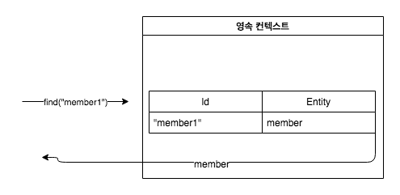
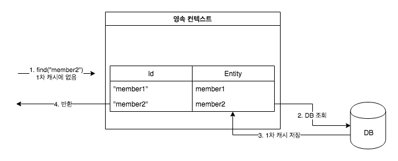
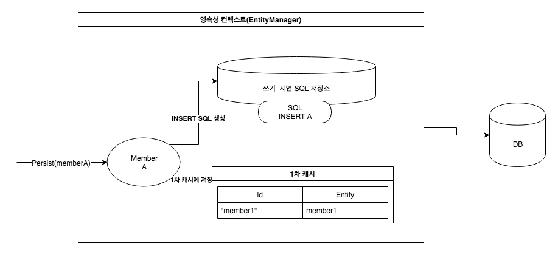
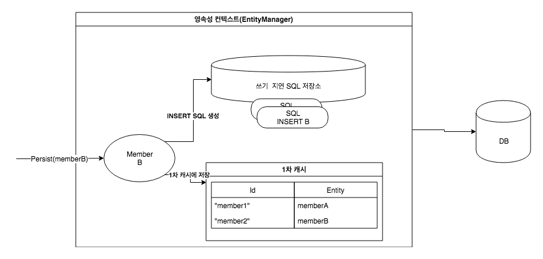
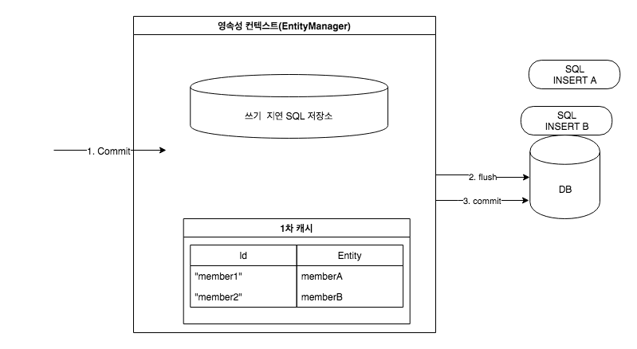
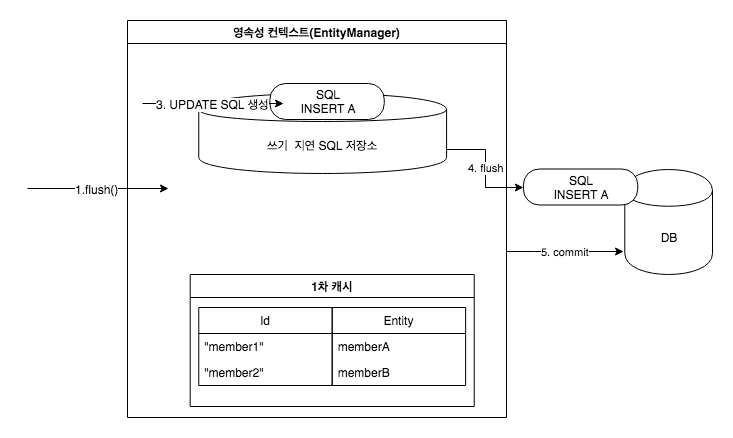
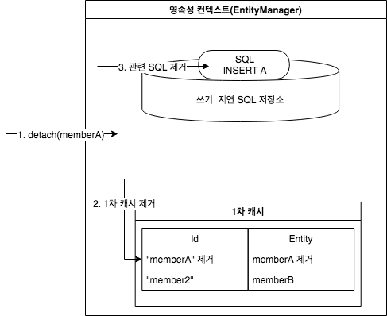
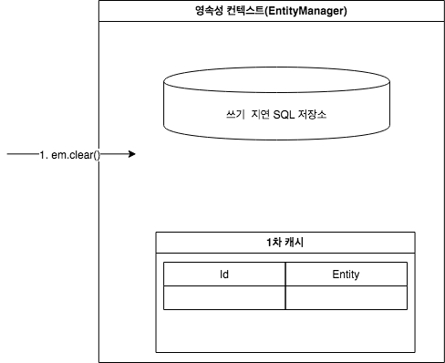
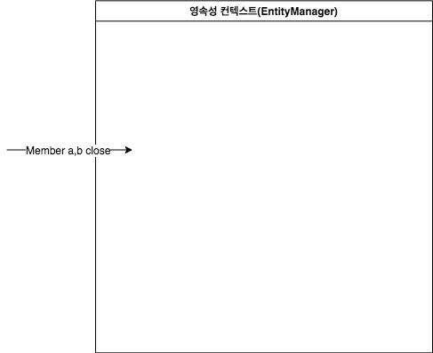
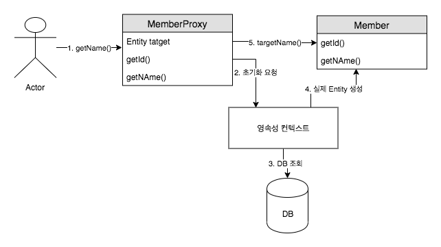

> [자바 ORM 표준 JPA 프로그래밍 ](http://www.acornpub.co.kr/book/jpa-programmig)를 보고 정리한 글입니다.


# 영속 성컨텍스트

## 영속성 컨텍스트의 특징

* 영속성 컨텍스트와 식별자 값 : 영속성 컨텍스트는 엔티티를 식별자 값(@Id)으로 구분한다. 따라서 **영속 상태는 식별자 값이 반드시 있어야한다.**
* 영속성 컨텍스트와 데이터베이스 저장 : JPA는 보통 트랜잭션을 커밋하는 순간 영속성 컨텍스트에 새로 저장된 엔티티를 데이터베이스에 반영하는데 이것을 **플러시**라 한다.
* 영속성 컨텍스트가 엔티티를 관리하면 다음과 같은 장점이 있다.
  * 1차 캐시
  * 동일성 보장
  * 트랜잭션을 지원하는 쓰기 지연
  * 변경 감지
  * 지연 로딩

## 엔티티 조회

### 1차 캐시 조회


`em.find()`를 호출하면 우선 1차 캐시에서 식별자 값으로 엔티티를 찾는다. 만약 찾는 엔티티가 있다면 데이터베이스를 조회하지 않고 메모리에 있는 1차 캐시에서 엔티티를 조회한다.

### 데이터베이스 조회



만약 `em.find()`를 호출했는데 엔티티가 1차 캐시에 없으면 엔티티 매니저는 데이터 베이스를 조회해서 엔티티를 생성한다. 그리고 1차캐시에 저장한 후에 영속성 산태의 엔티티를 반환한다.

1. `em.find(Member.class, "member2")`를 실행한다.
2. member2가 1차 캐시에 없음으로 데이터베이스에 조회한다.
3. 조회한 데이터로 member2 엔티티를 생성해서 1차 캐시에 저장한다.
4. 조회한 엔티티를 반환한다.

### 영속 엔티티의 동일성 보장

```java
Member a = em.find(Member.class, "member1");
Member b = em.find(Member.class, "member1");

System.out.println(a == b) // 동일성 비교 결과 : true
```
**영속성 컨텍스트는 1차 캐시에 있는 같은 엔티티 인스턴를 반환한다. 따라서 둘은 같은 인스턴스고 결과는 당연히 true이다. 영속성 컨텍스트는 성능상 이점과 엔티티의 동일성을 보장한다.**

## 엔티티 등록

```java
EntityMaanger em  = emf.createEnttiyManager();
ENtityTranscation transaction = em.getTransaction();
// 엔티티 매니저는 데이터 변경 시 트랜잭션을 시작해야한다.

transaction.begin();

em.persist(memberA);
em.persist(memberB);

// 여기까지 Insert SQL을 데이터베이스에 보내지 않는다.

// Commit을 하는 순간 데이터베이스에 Insert SQL을 보낸다
transaction.commit();
```
엔티티 매니저는 트랜잭션을 커밋하기 직전까지 데이터베이스에 엔티티를 저장하지 않고 내부 쿼리 저장소에 INSERT SQL을 모아둔다. 그리고 트랜잭션을 커밋할 때 모아둔 쿼리를 데이터베이스에 보내느데 이것을 트랜잭션을 지원하는 쓰기 지연 이라 한다.



회원 A를 영속화 했다. 영속성 컨텍스트는 1차 캐시에 회원 엔티티를 저장하면서 동시에 회원 엔티티 정보로 등록 쿼리를 만든다. 그리고 만들어진 등록 쿼리를 쓰기 지연 SQL 저장소에 보관한다.



다음으로 회원 B를 영속화했다. 마찬가지로 회원 엔티티 정보로 등록 쿼리를 생성해서 쓰지 지연 SQL 저장소에 보관한다. 현재 쓰기 지연 SQL저장소 에는 등록 쿼리가 2건이 저장되어 있다.


마지막으로 트랜잭션을 커밋했다. **트랜잭션을 커밋하면 엔티티 매니저는 우선 영속성 컨텍스트를 플러시한다. 플러시는 영속성 컨텍스트의 변경 내용을 데이터베이스에 동기화하는 작업인데 이때 등록, 수정, 삭제한 엔티티를 데이터베이스에 반영한다.**

즉, 쓰기 지연 SQL 저장소에 모인 쿼리를 데이터베이스에 보낸다. 이렇게 영속성 컨텍스트의 변경 내용을 데이터베이스에 동기화한 후에 실제 데이터베이스 트랜잭션을 커밋한다.

:bangbang:
flush가 먼저 동작하고 (데이터베이스에 동기화한 후에) 실제 데이터베이스 트랜잭션을 커밋한다.

### 트랜잭션을 지원하는 쓰기 지연이 가능한 이유

```
begin(); // 트랜잭션 시작

save(A);
save(B);
save(C);

commit(); // 트랜잭션 커밋
```

1. 데이터를 저장하는 즉시 등록 쿼리를 데이터베이스에 보낸다. 예제에서 save() 메서드를 호출할 때 마다 즉시 데이터베이스에 등록 쿼리를 보낸다. 그리고 마지막에 트랜잭션을 커밋한다.
2. 데이터를 저장하면 등록 쿼리를 **데이터베이스에 보내지 않고 메모리에 모아 둔다.** 그리고 트랜잭션을 커밋할 때 모아둔 등록 쿼리를 데이터베이스에 보낸다.

트랜잭션 범위 안에서 실행되므로 둘다 결과는 같다. A, B, C 모두 트랜잭션을 커밋하면 함께 저장되고 롤백하면 함께 저장되지 않는다. **등록 쿼리를 쓸때 그때 데이터베이스에 전달해도 트랜잭션을 커밋하지 않으면 아무 소용이 없다.** 어떻게든 커밋 직전에만 데이터베이스에 SQL을 저장하면 된다. 이것이 트랜잭션을 지원하는 쓰기 지연이 가능한 이유다.

이 기능을 잘 활용하면 모아둔 등록 쿼리를 데이터베이스에 한 번에 전달해서 성능 최적화할 수 있다.

:bangbang:
1, 2이든 결국 commit 액션이 없으면 데이터베이스에 반영되지 않으니 쿼리를 한 번에 모아놓고 한 번에 전달하는 것이 차이다. 트랜잭션 단위는 1, 2 번 모두 동일하다.

## 엔티티 수정

### 수정 쿼리의 문제점
수정 쿼리는 비지니스 요구사항에 맞게 지속적으로 늘어난다 그리고 비지니스 로직을 분석하기 위해서는 SQL을 계속 확인해야한다. 결국 직접적이든 간접적이든 비지니스 로직이 SQL에 의존하게 된다.

### 변경 감지
```java
EntityMaanger em  = emf.createEnttiyManager();
ENtityTranscation transaction = em.getTransaction();
transaction.begin(); // 트랜잭션 시작

// 영성속 텐티티 조회
Member memberA = em.find(Member.class, "memberA");

// 영속성 엔티티 데이터 수정

memberA.setUsername("hi");
memberA.setAge(10);

//em.update(member) 이런 코드가 있어야하지 않을까?

transaction.commit(); // 트랜잭션 커밋
```

JPA로 엔티티를 수정할 때는 단순히 엔티티를 조회해서 데이터만 변경하면 된다. `emm.update` 같은 메서드를 실행해야할거 같지만 이런 메서드는 없다. **엔티티의 변경사항을 데이터베이스에 자동으로 반영하는 기능을 변경 감지(dirty checking) 이라 한다.**


JPA는 엔티티를 영속성 컨텍스트에 보관할 때, **최초 상태를 복사해서 저장해두는데 이것을 스냅샷이리고 한다.** 그리고 플러시 시점에서 스냡샵과 엔티티를 비교해서 변경된 엔티티를 찾는다.

1. **트랜잭션을 커밋하면 엔티티 매니저 내부에서 먼저 플러시가 호출된다.**
2. 엔티티와 스냅샵을 비교해서 변경된 엔티티를 찾는다.
3. **변경된 엔티티가 있으면 수정 쿼리를 생성해서 쓰기 지연 SQL 저장소에 보낸다.**
4. 쓰기 지연 저장소의 SQL을 데이터베이스에 보낸다.
5. 데이터베이스 트랜잭션을 커밋한다.

**변경 감지는 영속성 컨텍스타 관리하는 영속 상태의 엔티티에만 적용된다.** 비용속, 준영속처럼 영속성 컨텍스트의 관리르 받지 못하는 엔티티는 값을 변경해도 데이터베이스에 반영되지 않는다.


실제로 반영되는 수정 SQL은 아래와 같다.
```sql
// 수정된 데이터만 반영할 것으로 예상
UPDATE MEMBER
SET 
    name = ?,
    age = ?,
WHERE
    id = ?

// 실제 엔티티의 모든 필드를 수정에 반영
UPDATE MEMBER
SET 
    name = ?,
    age = ?,
    grade = ?
    ...
WHERE
    id = ?
```
이렇게 모든 필드를 사용하면 데이터베이스에 보내는 데이터 전송량이 즐가하는 단점이 있지만, 다음과 같은 장점으로 인해 모든 필드를 업데이트한다.

* 모든 필드를 사용하면 수정 쿼리가 항상 같다. 따라서 애플리케이션 로딩 시점에 **수정 쿼리를 미리 생성해두고 재사용할 수 있다.**
* **데이터베이스에 동일한 쿼리를 보내면 데이터베이스는 이전에 한 번 파싱된 쿼리를 재사용할 수 있다.**

필드가 많거나 저장되는 내용이 너무 크면 수정된 데이터만 사용해서 동적으로 UPDATE SQL을 생성하는 전략을 선택하면 된다.

```java
@Entity
@org.hibernate.annotations.DynamicUpdate
@Table(name "member")
```

위 `@DynamicUpdate` 어노테이션을 사용하면 수정된 데이터만 사용해서 동적으로 UPDATE SQL을 생성한다. 데이터를 저장할 때 필드만을 INSERT SQL을 동적으로 생성하는 `@DynamicInsert`도 있다.

### 엔티티 삭제
엔티티를 삭제하려면 먼저 삭제 대상 엔티티를 조회해야한다.

```java
Member meberA = em.find(Member.class, "memberA"); // 삭제할 대상 엔티티 조회
em.remove(memberA); // 엔티티 삭제
```
em.remove()에 삭제 대상 엔티티를 넘겨주면 엔티티를 삭제한ㄷ. 물론 엔티티를 즉시 삭제하는 것이 아니라 엔티티 등록과 비슷하게 삭제 쿼리를 쓰기 지연 데이터베이스에 삭제 쿼리를 전달한다. 

**em.remove()를 호출하는 순간 memberA는 영속성 컨텍스트에서 제거된다. 이렇게 삭제된 엔티티는 재사용하지 말고 자연스럽게 가비지 컬렉션의 대상이 되도록 두는 것이 좋다.**

## 플러시
**플러시는 영속성 컨텍스의 변경 내용을 데이터베이스에 반영한다.** 플러시를 실행하면 구체적으로 다음과 같은 일이 일어난다.

1. 변경 감자기 동작해서 영속성 컨텍스트에 있는 모든 엔티티를 스냅샷과 비교 해서 수정된 엔티티를 찾는다. 수정 엔티티는 수정 쿼리를 만들어 쓰기 지연 SQL 등록한다.
2. 쓰기 지연 SQL 의 저장소의 쿼리를 데이터베이스에 전송한다. (등록, 수정, 삭제 쿼리)


영속성 컨텍스트를 플러시 하는 방법은 3가지다.

1. em.flush()를 직접 호출한다.
2. 트랜 잭션 커밋 시 플러시가 자동 호출된다.
3. JPQL 쿼리 실행 시 플러시가 자동 호출된다.

### 직접 호출
엔티티 매니저의 flush() 메서드를 직접 호출해서 영속성 컨텍스트를 강제로 플러시 한다. **테스트나 다른 프레임워크와 JPA 함께 사용할 때는 제외하고 거의 사용하지 않는다.**

### 트랜잭션 커밋 시 플러시 자동 호출
데이터베이스에 변경 내용을 SQL로 전달하지 않고 트랜잭션만 커밋하면 어떤 데이터도 데이터베이스에 반영되지 않는다. 따라서 **트랜잭션을 커밋하기 전에 꼭 플러시를 호출해서 영속성 컨텍스트의 변경 내용을 데이터베이스에 반영해야 한다.** JPA는 이런 문제를 예방하기 위해서 트랜잭션 커밋할 때 **플러시를 자동으로 호출한다.**

### JPQL 쿼리 실행시 플러시 자동 호출
JPQL이나 QueryDSL 같은 객체지향 쿼리를 호출할 플러시가 실행된다. 

```java
em.persist(memberA);
em.persist(memberB);
em.persist(memberC);

query = em.createQuery("select m from Member m", Member.class);
List<Member> member query.getResultList();
```
1. `em.persist()`를 호출해서 엔티티 memberA, memberB, memberC를 영속 상태로 만듬
2. 이 엔티티들은 영속성 컨텍스트에 있지만 아직 데이터베이스에 반영되지 않았다.(플러시가 호출되지 않았음으로)
3. `select m from Member m` 조회 쿼리는 아직 데이터베이스 commit이 이루어지지 않았다면 조회되지가 않는다.


이런 결과가 나오기 때문에 **쿼리를 실행하기 직전에 영속성 컨텍스트를 플러시해서 변경 내용을 데이터베이스에 반영해야 한다.** JPA는 이런 문제를 예방하기 위해서 JPQL을 실행할 때도 플러시르 자동 호출한다. **참고로 식별자를 기준으로 조회하는 find() 메서드는 호출되지 않는다.**


:exclamation: 식별자로 찾는 경우에는 영속성 컨텍스트에 있는 경우 리턴하고, 없는 경우 데이터베이스에 들려서 조회하면 되기 때문에 플러시를 동작 시키지 않는거 같다. 반면 대상이 대상이 명확지 않은 조건에는 일단 플러시를 방동시키고 데이터베이스에 반영하고 그 후 조회 SQL을 실행하는 같다.


### 플러시 모드 옵션
* FlushModType.AUTO: 커밋이나 쿼리를 실행할 때 플러시(기본값)
* FlushModType.COMMIT: 커밋할 때만 플러시

## 준영속
영속성 컨텍스트가 관리하는 영속 상태의 엔티티가 영속성 컨텍스트에서 분리된 dached을 준영속 상태라 한다. 준영속 상태의 엔티티는 영속성 컨텍스트가 제공하는 기능을 사용할 수 없다.

1. `em.detach(entity)`: 특정 엔티티만 준영속 상태로 전환한다.
2. `em.clear()`: 영속성 컨텍스트를 완전히 초기화한다.
3. `em.close()`: 영속성 컨텍스트를 종료한다.

### 엔티티를 준영속 상태로 전환: detach()람
```java
public void testDetached() {
    // 회원 엔티티 생성, 비용속 상태
    Member member = new Member();
    member.setId("memberA");
    member.setUsername("회원A");

    // 회원 엔티티 영속 상태
    em.persist(member);

    // 회원 엔티티를 영속성 컨텍스트에 분리, 분영속 상태
    em.detach(member);

    transaction.commit(); // 트랜잭션 커밋
}
```


영속성 컨텍스트에 대해서 memberA에 대한 모든 정보를 삭제한다. **영속 상태였다가 더는 영속성 컨텍스트가 관리하지 않은 상태를 준영속 상태라 한다**. 이미 준영속 상태 이므로 영속성 컨텍스트가 지원하는 기능은 동작하지 않는다. **심지어 지연 SQL 저장소에 저장된 SQL로 제거어 데이터베이스에 저장되지 않는다.**  준영속 상태라는 것은 영속성 컨텍스트로 부터 분리 detached된 상태이다.

### 영속성 컨텍스트 초기화: clear()
```java
// 엔티티 조회, 영속 상태
Member member = em.find(Member.class, "memberA");

em.clear(); // 영속성 컨텍스트 초기화

// 준영속 상태
member.setUsername("changeName");
```

**모든 영속성 컨텍스트에 있는 것이 초기화 된다. 이것은 영속성 컨텍스트를 제거하고 새로 만든 것과 같다.** 영속성 컨텍스트에 있던 기존 엔티티들은 준영속 상태가 된다.

그리거 준영속 상태이므로 영속성 컨텍스트가 지원하는 변경 감지는 동작하지 않는다. 따라서 이름을 변경해도 반영되지 않는다.

### 영속성 컨텍스트 종료: close()
```java
public void closeEntityManager() {
    EntityManagerFactory emf = Persistnxe.createEntityManagerFactory("book");

    EntityManager em = em.createEntityManager();
    EntityTransaction transaction = em.getTransaction();

    transaction.begin(); // 트랜잭션 시작

    Member memberA = em.find(Member.class, "memberA");
    Member memberB = em.find(Member.class, "memberB");

    transaction.commit(); // 트랜잭션 커밋

    em.close(); // 영속성 컨텍스트 종료
}
```


모든 영속성 켄텍스트가 종료되어 더는 memberA, memberB가 관리되지 않는다.

### 준영속 상태의 특징

#### 거의 비용속성 상테에 가깝다
영속성 컨텍스트가 관리하지 않음으로 1차 캐스, 쓰기 지연, 변경 감자, 지연로딩을 포함한 영속성 컨텍스트가 제공하는 어떠한 기능도 동작하지 않ㄹ는다.

#### 식별자 값을 가지고 있다.
비용속 상태는 식별자 값을 없을수도 있지만 준영속 상태는 이미 한 번 영속 상태 였음으러 반드시 식발져 값을 가지고 있다.

#### 지연 로딩 할 수 없다.
레이지 로딩은 실제 객체 대신 프록시 객체를 로딩해두고 해당 객체를 실제 사용할 때 영속성 컨텍스트를 통해 데이터를 불러오는 방법이다. 하지만 준영속 상태는 영속성 컨텍스트가 더는 관리하지 않으므로 지연 로딩 시 문제가 발생한다. 

### 병합: merge()
준영속 상태의 엔티티를 다시 영속 상태로 변경하려면 병합을 사용하면 된다. **merge() 메서드는 준영속 상태의 엔티티를 바당서 그 정보로 새로운 영속 상태의 엔티티를 반환한다.**

# 프록시와 연관관계 관리

* 프록시와 즉시로딩, 지연로딩: 객체는 객체 그래프로 연관된 객체를 탐색한다. 그런데 객체가 데이터베이스에 저장되어 있으므로 연관된 객체를 마음껏 탐색하기는 어렵다. JPA 구현체들은 이 문제를 해결하고자 프록시라는 기술을 사용한다. 프록시를 사용하면 영관된 객체를처음부터 데이터베이스에서 조회하는 것이 아니라, 실제 사용하는 시점에 데이터베이스에서 조회할 수 있다. 하지만 자주 함께 사용하는 객체들은 조인을 사용해서 함께 조회하는 것이 효과적이다. **JPA는 즉시 로딩과 지연 로딩이라는 방법으로 둘을 모두 지원한다.**
* 영속성 전이와 고아 객체: JPA는 연관된 객체를 함께 저장하거나 함께 삭제할 수 있는 영속성 전이와 고와 객체를 제거라는 편리한 기능을 제공한다.

## 프록시

### 프록시 기초
엔티티를 실제 사용하는 시좀 까지 데이터베이스 조회를 미루고 싶다면 `Member meber = em.getReference(Member.class, "member");` 이 메서드를 호출할 때 JPA는 데이터베이스를 조회하지 않고 실제 엔티티 객체도 생성하지 않는다. 대신 데이터베이스 접근을 위임한 프록시 객체를 반환한다.

#### 프록시 객체의 특징
프록시 클래스는 실제 클래스를 상속 받아서 만들어지므로 실제 클래스와 겉모용이 같다. 따라서 사용하는 입장에서는 이것이 진짜 객체인지 프록시 객체인지 구분하지 않고 사용하면 된다.

#### 프록시 객체의 초기화
!

**프록시 객체는 실제 객체에 대한 참조(Target)를 보관한다. 프록시 객체의 메소드를 호출하면 프록시 객체는 실제 객체의 메서드를 호출한다.**

프록시 객체는 `member.getName()` 처럼 실제 사용될 때 데이터베이스를 조회해 실제 엔티티 객체를 생성하는데 이것을 프록시 객체의 초기화라 한다.


```java
// Proxy 객체 반환
Member member = em.getReferecne(Member.class, "id1");
member.getName(); // 1. geName()

// 프록시 클래스 예상 코드
class MemberProxy extends Member{

    Member target = null; // 실제 엔티티 참조

    if(target == null) {
        // 2. 초기화 진행
        // 3. DB조회
        // 4. 실제 엔티티 생성 및 참조 보관
        this.target = ...;
    }
    // 5. target.getName();
    return target.getName();
}
```
1. 프록시 객체에 `member.getName()`을 호출해서 실제 데이터를 조회한다.
2. **프록시 객체는 실제 엔티티가 생성되어 있지 않으면 영속성 컨텍스트에 실제 엔티티 생성을 요청 하는데 이것을 초기화라 한다.**
3. 영속성 컨텍스트는 데이터베이스를 조회해서 실제 엔티티 객체를 생성한다.
4. 프록시 객체는 생성된 실제 엔티티 객체의 참조를 Member target 멤버변수에 보관한다.
5. 프록시 객체는 실제 엔티티 객체의 `getName()`을 호출해서 결과를 반환한다.

#### 프록시의 특징
1. **프록시 객체는 청므 사용할 때 한번만 초기화 된다.**
2. 프록시 객체를 초기화한다고 프록시 객체가 **실제 엔티티로 바뀌는 것은 아니다. 프록시 객체가 초기화되면 프록시 객체를 통해서 실제 엔티티에 접근할 수있다.**
3. 영속성 컨텍스트에 찾는 엔티티가 이미 있다면 데이터베이스를 조회할 필요가 없음으로 `em.getReferecne()`를 호출해도 프록시가 아닌 실제 엔티티를 반환한다.
4. 초기화는 영속성 컨텍스트의 도움을 받아야 가능하다. 따라서 영속성 컨텍스트의 도움을 받을 수 없는 준영속 상태의 프록시를 초기화한다면 문제가 발생한다. 하이버네이트는 org.hibernate.LazyInitializationException예외가 발생

## 즉시 로딩과 지연 로딩
* 즉시 로딩
  *  엔티티를 조회할 때 연관된 엔티티도 함께 조회 된다.
  *  `em.find(Member.class, "member1")`를 호출할 때 회원 엔티티와 연관된 팀 엔티티도 함께 조회한다.
*  지연로딩
   *  연관된 엔티티를 실제 사용할때 조회한다.
   * `member.getTeam().getName()` 처럼 조회한 팀 엔티티를 실제 사용하는 시점에 JPA가 SQL을 호출해서 팀 엔티티를 조회한다.

### 즉시 로딩
즉시 로딩은 `@ManyToOne(FetchType.EAGER)`로 지정한다. **JPA 구현체는 즉시 로딩을 최적화하기 위해서 가능하면 조인 쿼리를 사용한다.**

```sql
SELECT
    M.MEMBER_ID AS MEMBER_ID,
    M.TEAM_ID AS TEAM_ID
    T.TEAM_ID AS TEAM_ID
    T.NAME AS NAME
FROM
    MEMBER M LEFT OUTER JOIN TEAM T ON M,TEAM_ID = T.TEAM_ID
WHERE 
    M.MEMBER_ID = 'MEMBER1'
```

### nullabel 설정에 따른 조인 전략
* @JoinColumn(nullable = true): null 허용(기본값) , 와부 조인을 사용
* @JoinColumn(nullable = false): null 허용하지 않음(기본값) , 내부 조인사용

### FetcchType.EAGER 설정에 따른 조인 전략
* @ManyToOne, @OneToOne
  * (optional = false) : 내부 조인
  * (optional = true) : 외부 조인
* @OneToMany, @ManyToMany
  * (optional = false) : 외부 조인
  * (optional = true) : 외부 조인

  
### 지연 로딩
위 그림 처럼 실제 데이터가 필요한 순간이 되어서야 데이터베이스를 조회해서 프록시 객체를 초기화한다. `em.findMember(Member.class, "member1")` 호출 시 실행되는 SQL은 다음과 같다

```sql
SELECT * FROM MEMBER
WHERE MEMBER_ID = 'MEMBER1'

# team.getName() 호출로 프록시 객체가 초기화되면서 실행되는 SQL은 다음과 같다

SELECT * FROM TEAM
WHERE TEAM_ID = 'TEAM1'
```

### 프록시와 컬렉션 레퍼
엔티티를 지연 로딩하면 프록시 객체를 엔티티에 컬렉션이 있으면 컬렉션을 추적하고 관리할 목적으로 **원본 컬렉션을 하이버네이트가 제공하는 내장 컬렉션으로 변경하는데 이것을 컬렉션 레퍼라고 한다.**
`member.getOrders()`를 호출해도 컬렉션은 초기화되지 않는다. 컬렉션은 `member.getOrders().get(0)` 처럼 컬렉션에 실제 데이터를 조회할 때 데이터베이스를 조회해서 초기화한다.

## 영속성 전이: CASECADE
**특정 엔티티를 영속 상태로 만들 때 연관된 엔티티도 함께 영속 상태로 만들고 싶으면 영속성 전이 기능을 사용하면 된다.** JPA는 CASECADE 옵션으로 영속성 전이를 제공한다.

### 영속성 전이: 저장
```java
@Enttiy
public class Parent {
    @Id @GeneratedValu
    private Long id;

    @OneToMany(mappedBy = "parent", casecade = CascadeType.PERSIST)
    private List<Child> children = new ArrayList<Child>();
}

@Entity
public class {

    @Id @GeneratedValu
    private Long id;

    @MayToOne
    private Parent parent;
}

public void saveEntityWithCasecade(EnttiyManager em) {

    Child child1 = new Child();
    Child child2 = new Child();

    Parent parent = new Parent();

    child1.setParent(parent);
    child2.setParent(parent);

    parent.getChildren().add(child1);
    parent.getChildren().add(child2;
}
```
위 같이 CASECADE 옵션을 주면 간편하게 부모와 자식 엔티티를 한 번에 영속화 할 수 있다. **영속성 전이는 연관관계를 매핑하는 것과는 아무 관련이 없다. 단지 엔티티를 영속화할 때 연관된 엔티티도 같이 영속화하는 편리함을 제공할 뿐이다.**


### 영속성 전이: 삭제
방금 젖아한 부모와 자식 엔티티를 모두 제거하려면 다음과 같은 코드로 각각 제거해야한다.

```java
Parent findParent = em.find(Parent.class, 1L);

Child findChild1 = em.find(Child.class, 1L);
Child fundChild2 = em.find(Child.class, 2L);

em.remove(findParent);
em.remove(findChild1);
em.remove(findChild2);
```
CascadeType.REMOVE로 설정하고 다음 코드처럼 부모 엔티티만 삭제하면 연관된 자식 엔티티도 함께 삭제된다.

```java
Parent findParent = em.find(Parent.class, 1L);
em.remove(findParent);
```
코드를 실행하면 DELETE SQL을 3 번샐행하고 부모는 물론 연관된 자식 모두 삭제된다. **삭제 순서는 왜래 키 제약조건을 고려해서 자식을 먼저 삭제하고 부모를 삭제한다.**

부모만 삭제하려고 할 경우 데이터베이스는 부모 로우를 삭제하는 순간 자식 엔테이블에 결려 있는 왜래 키 제약조건으로 인해, **데이터베이스에서 외래키 무결성 예외가 발생한다.**

:exclamation: 물리적인 외래키 제약조건을 걸지 않은 경우 조회 조인 쿼리를 하는 경우 JPA에서는 예외가 발생한다.(OneToOne, FK 조건이 not null 인경우는 무조건 조회되어야함) 하지만 위와 같은 삭제 쿼리에 대해서는 어떻게 될까? (Blog 작성하자)


## 고아 객체
**JPA는 부모 엔티티와 연관관계가 끊어진 자식 엔티티를 자동으로 삭제하는 기능을 제공한다.** 이것을 고아 객체 제거라 한다. **부모 엔티티의 컬렉션에서 자식 엔티티의 참조만 제거하면 자식 엔티티가 자동으로 삭제된다.**

```java
@Enttiy
public class Parent {
    @Id @GeneratedValu
    private Long id;

    @OneToMany(mappedBy = "parent", orphanRemoval = true)
    private List<Child> children = new ArrayList<Child>();
}

public void remvoe() {
    Parent parent1 = em.find(Parent);

    parent1.getChildren().remove(0); // 자식 엔티티를 컬렉션에서 제거
}
```
위와 같은 코드를 실행하면

```sql
DELETE FROM CHILD WHERE ID = ?
```
`orphanRemoval = true` 옵션으로 인해 컬렉션에서 엔티티를 제거하면 데이터베이스의 데이터도 삭제된다. 고아 객체를 제거 기능은 영속성 컨텍스트를 플러시할 때 적용되므로 플러시시점에서 DELETE SQL 실행된다.

만약 모든 자식 엔티티를 제거하고 싶다면 아래 코드처럼 사용할 수 있다.
```java
parent1.getChildren().clear();
```

**고아 겍체 제거는 참조가 제거된 엔티티는 다른 곳에서 참조하지 않는 고아 객체로 보고 삭제하는 기능이다. 따라서 이 기능은 참조하는 곳이 하나일 때만 사용해야 한다.** 쉽게 이야기 해서 특정 엔티티가 개인 소유하는 엔티티에만 이 기능을 적용해야 한다. **만약 삭제한 엔티티를 다른 곳에서 참조한다면 문제가 될 수 있다. 이러 한 이유로 orphanRemoval은 `@OneToOne`, `@OneToMany`에서만 사용할 수 있다.**


