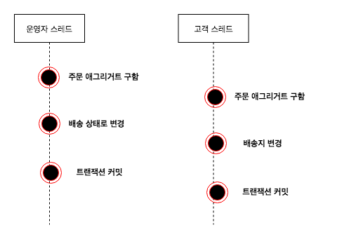
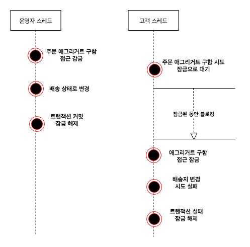

> 해당 자료는 DDD Start를 보고 정리한 자료입니다.

# 트랜잭션 잠금

한 주문 애그리거트에 대해 운영자는 배송 준비 상태로 변경할 때 사용자는 배송지 주소를 변경하면 어떻게 될까?

운영자와 고객이 동시에 한 주문 애그리거트를 수정하는 과정을 보여준다. 



운영자 스레드와 고객 스레드는 같은 주문 애그리거트를 나타내는 다른 객체를 구하게 된다 (트랜잭션(요청 스레드) 마다 리포지토리라는 새로운 애그리거트를 생성한다.)

운영자 스레드와 고객 스레드는 개념적으로 동일한 애그리거트이지만 물리적으로 서로 다른 애그리거트 객체를 사용한다.

때문에 운영자 스레드가 주문 애그리거트 객체 배송 상태로 변경하더라도 고객 스레드가 사용하는 주문 애그리거트 객체에는 영향을 주지 않는다. 고객 스레드 입장에서 주문 애그리거트 객체는 아직 배송 상태 전이므로 배송지 정보를 변경할 수있다.

이 상황에서 두 스레드는 각각 트랜잭션을 커밋할 떄 수정한 내용을 DBMS에 반영한다. 즉 배송 상태로 바뀌고 배송지 정보로 바뀌게 된다. 이 순서의 문제점은 운영자는 기존 배송지 정보를 이용해서 배송 상태로 변경했는데 그 사이 곡객은 배송지 정보를 변경했다는 점이다. 즉 애그리거트의 일관성이 깨지는 것이다.

이런 문제가 발생하지 않도록 하려면 다음 두 가지 중 하나를 해야한다.
* 운영자 배송지 정보를 조회하고 상태를 변경하는 동안 고객이 애그리거트를 수정하지 못하게 막는다. (수정하지 못하는 것보다 조회까지 막아야 된다고 생각함)
* 운영자가 배송지 정보를 조회한 이후 고객이 정보를 변경하면 웅영자가 애그리거트를 다시 조회한 뒤 수정하도록 한다.

이 두 가지는 애그리거트 자체의 트랜잭션과 관련이 있다. DBMS가 지원하는 트랜잭션과 함께 애그리거트를 위한 추가적인 트랜잭션 처리 기법이 필요하다. **애그리거트에 대해 사용할 수 있는대표적인 트랜잭션 처리 방식에는 선점 잠금과 비선점 잠금의 두 가지 방식이 있다.**


## Isolation REPEATABLE_READ 으로 해결 못하는 이유

REPEATABLE_READ은 트랜잭션이 지속되는 동안 다른 트랜잭션이 해당 필드를 변경할 수 없는 격리 레벨이다. **이것으로 위의 문제를 해결할 수 있지는 않다.**


1. 운영자 스레드가 주문 애그리거트를 구함 (배송 이전 상태)
2. 고객 스레드가 주문 애그리거트를 구함 (배송 이전 상태) REPEATABLE_READ 속성이므로 select 트랜잭션이 진행중에 있더라도 select는 진행됨
3. 운영자 스레드가 주문의 상태를 배송 상태로 변경
4. 고객 스레드가 배송지를 변경
5. 운영 스레드 트랜잭션 커밋
6. 고객 스레드는 REPEATABLE_READ 격리 레벨임으로 트랜잭션 임으로 운영 스레드 트랜잭션 커밋 이후 커밋 됨


운영자는 배송 상태로 변경하고, 고객은 배송지를 변경이 모두 데이터베이스에 반영된다는 것이다. **2번 고객 스레드가 주문 애그리거트를 구하는것을 Lock 해야 이 문제를 해결 할 수 있다.**


## 선점 잠금
선점 잠금은 먼저 애그리거트를 구한 스레드가 애그리거트 사용이 끝날 때까지 다른 스레드가 해당 애그리거트를 수정하는 것을 막는 방식이다.


스레드1 선점 잠금방식으로 애그리거트를 구한 뒤 이에서 스레드2가 같은 애그리거트를 구하고 있는데, 이 경우 스레드2는 스레드1이 애그리거트에대한 잠금을 해제할 때 까지 블로킹된다.

스레드1이 애그리거트를 수정하고 트랜잭션을 커밋하면 잠금을 해제한다. 이 순간 대기하고 있던 스레드2가 애그리거트에 접근하게 된다. 스레드1이 트랜잭션을 커밋 뒤에 스레드2가 애그리거트를 구하게 되므로 스레드2는 스레드1이 수정한 애그리거트의 내용을 보게된다.


한 스레드가 애그리거트를 구하고 수정하는 동안 다른 스레드가 수정할 수 없음므로 동시에 애그리거트를 수정할 때 발생하는 데이터 충돌 문제를 해소할 수 있다. 

### 선점 감금 적용



1. 운영자 스레드가 먼저 선점 잠금 방식으로 주문 애그리거트를 구함
2. 고객 스레드는 운영자 스레드가 잠금을 해제할 때까지 고객 스레드는 대기 상태
3. 운영자 스레드가 배송 상태로 변경한 뒤에 트랜잭션을 커밋하면 잠금을 해제한다.
4. 잠금이 해제된 시점에 고객 스레드가 구하는 주문 애그리거트는 운영자 스레드가 수정한 배송 상태의 주문 애그리거트이다. 배송 상태이므로 주문 애그리거트는 배송지 변경 시 에러를 발생하거 트랜잭션이 실피패한다.
5. 고객은 `이미 배송이 시작되어 배송지를 변경할 수 없습니다.`와 같은 안내 문구를 받게 됨


선점 감은은 보통 DBMS가 제공하는 행 단위 잠금을 사용해서 구현한다. 오라클을 비롯한 다수 DBMS가 for update와 같은 쿼리를 상ㅇ해서 특정 레코드에 한 사용자만 접근할 수 있는 잠금 장치를 제공한다.

JPA의 EntityManager는 LockModeType을 인자로 받는 `find()` 메서드를 제공하는데, `LockModeType.PESSIMISTIC_WRITE`를 값으로 전달하면 해당 엔티티와 매핑된 테이블을 이용해서 선점 잠금 방식을 적용할 수 있다.

```java
Order order = entityManager.find(Order.class, orderNo, LockModeType.PESSIMISTIC_WRITE)
```

JPA 프로바이더와 DBMS에 따라 잠금 모드의 구현이 다른데, 하이버네티으의 경우 `PESSIMISTIC_WRITE`를 잠금 모드로 사용하면 `for update` 쿼리를 사용해서 선점 잠금을 구현한다.

## 선점 잠금과 교착상태
선점 잠금 기능을 사용할 떄는 잠금 순서에 따른 교착 상태가 발생하지 않도록 주의해야 한다. 예를 들어, 다음과 같은 순서로 두 스레드가 선점 잠금을 시도를 한다고 해보자

1. 스레드 1: A 애그리거트에 대한 선점 잠금 구함
2. 스레드 2: B 애그리거트에 대한 선점 잠금 구함
3. 스레드 1: B 애그리거트에 대한 선점 잠금 시도
4. 스레드 2 : A 애그리거트에 대한 선점 잠금 시도

이 두 스레드는 상대방 스레드가 먼저 선점한 잠금을 구할수 없어 더 이상 다음 단계를 진행하지 못하게 된다. **즉 스레드 1과 스레드 2는 교착상태에 빠지게 된다.**

선점 잠그에 따른 교착 상태는 상대적으로 사용자 수가 많을 떄 발생할 가능성이 높고, 사용자 수가 많아지면 교착 상태에 빠지는 스레드가 더 빠르게 증가하게 된다. 더 많은 스레드가 교착 상태에 빠질수록 시스템은 점점 아무것도 할 수 없는 상황에 이르게 된다.

이런 문제가 발생하지 않도록 하려면 잠금을 구할 때 최대 대기 시간을 지정해야한다. JPA에서 선점 잠금을 시도할 떄 최대 대기 시간을 지정하려면 다음과 같이 힌트를 사용하면 된다.

```java
Map<String, Object> hints = new HashMap<>();
hints.put("javax.persistence.lock.timeout", 2000);
Order order = entityManager.find(Order.class, orderNo, LockModeType.PESSIMISTIC_WRITE, hints);
```

JPA의 `javax.persistence.lock.timeout` 힌트는 잠금을 구하는 대기 시간을 밀리초 단위로 지정한다. 지정한 시간이내에 잠금을 구하지 못하면 익셉션을 발생 시킨다. 이 힌트를 사용할 떄 주의할 점은 DBMS에 따라 힌트가 적요되지 않는 다는 점이다. 이 힌트를 이용할 때에는 사용중인 DBMS가 관련 기능을 지원하는지 확인해야 한다.

## 비선점 잠금


```puml
Alice -> Bob : message 1
Alice -> Bob : message 2

newpage

Alice -> Bob : message 3
Alice -> Bob : message 4

newpage A title for the\nlast page

Alice -> Bob : message 5
Alice -> Bob : message 6
```