> 해당 글은 [실전 아파치 카프카](http://www.hanbit.co.kr/media/books/book_view.html?p_code=B8503179529)를 보고 정리한 내용 입니다.

# 아파치 카프카 개요

## 아파치 카프카
아파치 카프카는 여러 대의 분산 서버에서 대량의 데이터를 처리하는 분산 메시징 시스템이다. 메시지(데이터)를 받고, 받은 메시지를 다른 시스템이나 장치에 보내기 위해 사용된다.

카프카는 대량의 데이터를 **높은 처리량**과 **실시간**으로 취급하기 위한 제품으로 다음 4가지를 실현할 수 있다.
1. 확장성: 여러 서버로 확장 구성을 할수 있기 때문에 데이터 양에 따라 시스템 확장이 가능하다.
2. 영속성: 수신한 데이터를 **디스크에 유지**할수 있기 때문에 언제라도 데이터를 읽을 수 있다.
3. 유연성: 연계할 수 있는 제품이 많기 때문에 제품이나 시스템을 연결하는 허브 역할을 한다.
4. 신뢰성: **메시지 전달 보증**을 하므로 데이터 분실 걱정하지 않아도 된다.

카프카는 원래 높은 처리량으로 데이터를 실시간 처리하는 처리 성능에 초점을 두었고, 이후 기능과 신뢰성을 향샹시켜 현재는 종합 스트림 처리를 위한 플랫폼이 되고 있다.

## 카프카로 요구사항 실현하기
기존 링크드인의 요구사항을 총족시키지 못했기 때문에 카프카 개발을 시작하게 되었다. 해당 요구사항은 다음과 같다.

요구 사항
1. 높은 처리량으로 실시간 처리한다.
2. 임이의 타이밍에 데이터를 읽는다.
3. 다양한 제품과 시스템에 쉽게 연동한다.
4. 메시지를 잃지 않는다.

실현 수단
1. 메시징 모델과 스케일 아웃형 아키텍처
2. 디스크로의 데이터 영속화
3. 이해하기 쉬운 API 제공
4. 전달 보증

### 메시지 모델과 스케일 아웃
카프카에서는 다음과 같은 요구 사항을 만족시켜야 했다.

1. 높은 처리량으로 실시간 처리한다.
2. 임이의 타이밍에 데이터를 읽는다.
3. 다양한 제품과 시스템에 쉽게 연동한다.

이러한 요구 사항을 해결 하기 위해 카프카에서는 메시징 모델을 채용 했다. 일반적으로 메시징 모델은 다음 세 가지 요소로 구성된다.

* Producer: 메시지 생산자
* Brokcer: 메시지 수집/전달 역할
* Consumer: 메시지 소비자

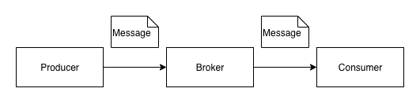
카프카 메시징 모델을 설명하는데 있어 기존의 메시징 모델인 큐잉 모델과 Publish/Subscribe 메시징 모델 두 가지 모델을 먼저 보자. **카프카는 이 둘의 특증을 겸비한 셩태로 만들어 졌다**

#### 큐잉 모델
브로커 안에 큐를 준비해, 프로듀서에서 메시지가 큐에 담기고, 컨슈머가 큐에서 메시지를 추출한다. 하나의 큐에 대해 컨슈머가 여러개 존재하는 것을 생각할 수 있다. 이 모델은 컨슈머를 여러 개 준비함으로써 컨슈머에 의한 처리를 확장 시킬 수 있이며, 컨슈머가 메시지를 받으면 다른 컨슈머는 메시지를 받을 수 없다.

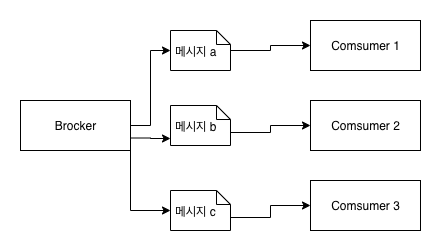
* 큐에서 여러 개의 컨슈머가 메시지를 추출할 수 있어 컨슈머에 의한 처리가 병렬로 가능하다.
* 큐에서 추출된 메시지는 컨슈머에 도달하면 사라진다. 즉 하나의 메세지는 여러 컨슈머 중 어느 하나에서 처리한다.


#### 펍/섭 메시징 모델
메시지 생산자를 프로듀서를 퍼플리셔, 메시지 소비자의 해당 컨슈머를 서브스크라이버 라고 한다.

**퍼블리셔가 서브스크라이브에게 직접 메시지를 보내는 것이 아니라 브로커를 통해 전달한다.** 퍼블리셔는 누가 메세지를 수신하는지 알수 없고 브로커에 있는 토픽이라고 불리는 카테고리 안에 메시지를 등록 시킨다.

한편 서브스크라이버는 여러 개 존재하는 톡픽 중 하나를 선책하여 메시지를 받는다. 여러 서브스크라이버가 동일한 토픽을 구독하기로 결정한다면, 이 여러 서브스크라이버는 동일한 메시지를 받는다.


* 서브스크라이버는 브로커 내의 토픽에서 자신이 흥미 있는 것을 선택한다.
* **큐잉 모델과 달리 같은 토픽을 구독하는 여러 서브스크라이버에게는 동일한 메시지가 전달된다.**

서브 스크라이버는 여러 개 존재하는 토픽 중 하나를 선택하여 메시지를 받는다. 여러 서브스크라이버가 동일한 토픽을 **구독하기로 결정한다면, 이 여러 서브스크라이버는 동일한 메시지를 받는다.**

펍/섭 메시징 모델은 TV나 라디오 전파 수신을 상상하면 이해하기 쉽다. **TV 방속국과 라디오 방송국은 개별 가정에서 누가 수신하고 있는지 고려하지 않고 방송 전파를 반신하며, 각 가정은 자신이 보고 싶은 프로그램만 선택하여 방송을 수신한다.**

#### 프로듀서/컨슈머 사이의 브로커를 끼우는 장점
큐잉 모델이든, 펍/섭 메시징 **모델이든 모두 브로커를 사이에 끼우는 형태이다.** 이 모델을 이용하면 변경에 강한 시스템 아키턱처를 만들 수 있다느 장점이 있다.

##### 프로듀서/컨슈머 모두 접속처를 하나로 할 수 있다.
프로듀서는 누구에게 메세지를 전동하면 좋을지 생각할 필요 없이 브로커로 보내기만 하면 된다. 마찬 가지로 컨슈머도 단순히 브로커에서만 수신하면 된다.

##### 프로듀서/컨슈머 증감에 대응 할 수 있다.
**프로듀서/컨슈머 모두 서로의 존재를 몰라도 되기 때문에 증감에 유연하게 대응할 수 있다.** 프로듀서를 증가시키려면 브로커에만 접속하면 되고, 컨슈머도 접속하려면 새로운 수신을 시작할 수 있다.

#### 펍섭 모델 vs 큐잉 모델
1개의 토픽에 주목한 경우 큐일 모델과 비교하면 여럿이 존재하는 모든 서브스크라이버는 동일한 메시지를 받게 된다. 병렬로 동작하는 복수의 서브스크라이버에 전달할 수 있다는 장점 이 있지만, 동일한 메세지에 대한 처리이기 때문에 브로커의 토픽에 축적되는 메시지 그룹 입장에서 보면 처리 능력을 높이는 효과는 없다. 따라서 큐잉 모델과 펍/섭 메시징 모델은 장점과 단점이 공존한다.


### 카프카 메시징 모델
카프카에서는 큐잉 모델에서 실현한 **여러 컨슈머가 분산 처리로 메세지를 소비**하는 모델과 펍/섭 메시징 모델에서 실현한 **여러 서브스크라이버에 동일한 메세지를 전달하고, 토픽 기반으로 전달 내용을 변경** 하는 모델로 되어 있다. 이 모델을 실현 하기 위해 컨슈머 그룹 이라는 개념을 도입 하여 컨슈머를 확장 구성할 수 있도록 설계계 하고 있다.

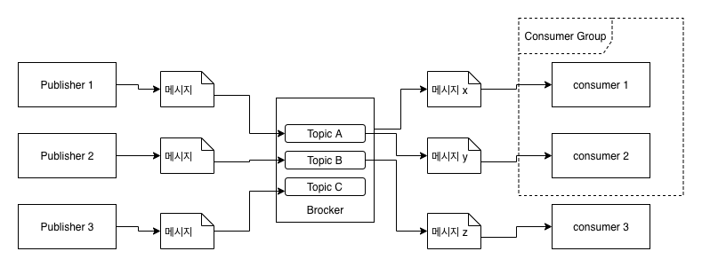
* 펍/섭 메시지 모델을 기반으로 여러 컨슈머가 분선 처리하기 위해 컨슈머 그룹이라는 개념을 도입했다.

여러 커슈머가 동일 토픽을 분산하여 메시지를 읽음으로써 처리의 확장성을 담보한다. 시스템 구성상 브로커가 1대라면 그곳이 병목이 되기도 쉽다. 따라서 **브로커도 복수 구성으로 동작하도록 되어있으며,** 결과적으로 전체적으로 확장 구성을 하고 있는 셈이다.

## 디스크로의 영속화
* 임이의 타이밍에 데이터를 읽는다.
* 메시지를 잃지 않는다. (고장에 의한 최근 메시지 손실 회피 목적은 아님)

메시지 큐에서도 데이터 영속화를 하는 제품도 있지만 실시간 접속에만 중점을 두고 있는 경우가 많으며 기본적으로 장기 보존하지 않는다. 배치 처리의 경우 데이터를 일정 기간마다 모아야 할 필요가 있기 때문에 데이터를 메모리에만 유지하는 것은 용량 면에서 불가능하다. 따라서 **카프카의 메시지 영속화는 디스크에 이루어진다. 카프카는 디스크에 영속화 함에도 불구하고 높은 처리량을 제공 한다.** 

데이터를 받아들이면서 한 묶음으로 장기 보전을 목적으로 영속화 할 수 있기 때문에 **카프카를 스토리 시스템으로도 간주 할 수 있다.**

> **카프카에서 영속화 목적**
> 
> 일반적으로 데이터 영속화라고 하면 데이터를 읽지 않은, 즉 데이터 자체에 대한 내장에성 향상을 위한 수단으로 여기는 경우가 많다. 하지만 카프카에서는 브로커의 메모리에 실리면 송신 완료(메모리에서 디스크로의 flush는 OS에 맟김)라는 사상을 가지고 있기 때문에, 카프카에 있어서 데이터 영속화는 반드시 내장애성을 의식한 것은 아니라고 할 수 있다. 카프카는 단일 브로커의 고장이 발생하더라도 즉시 데이터 손실로 이어지지 않도록 복제 구조를 갖추고 있다. 따라서 브로커 내애서의 최근 데이터 손실 방지는 메시지의 복제로 구현한다고 파악하는 것이 자연스럽다.


## 전달 보증
* 메시지를 잃지 않는다.

메세지는 생산자 입장에서 매우 당여한 요구인 메시지를 읽지 않고 전달하는 데 있어 카프카는 전달 보증 기능을 제공한다.

| 종류            | 개요            | 재전송 유무 | 중복 삭제 유무 | 비고                                         |
| ------------- | ------------- | ------ | -------- | ------------------------------------------ |
| At Most Once  | 1회는 전달시도 해본다. | X      | X        | 메시지는 중복되지 않지만 상실될 수도 있다.                   |
| At Least Once | 적어도 1회는 전달한다  | O      | X        | 메시지가 중복될 가능성은 있지만, 상실되지 않는다.               |
| Exactly Once  | 1회만 전달한다      | O      | O        | 중복돠거나 상실되지 않고 확실하게 메시지가 도달하지만, 성능이 나오기 힘들다 |

**메시지 큐에서는 `Exactly Once` 수준을 목적으로 하는 경우가 많다. 따라서 트랜잭션 관리를 위한 케커니즘이 마련돼 있다.** 그러나 카프카 개발 초기에는 성능을 중시하는, 즉 높은 처리량을 구현해야 했기 때문에 `Exactly Once` 수준의 보증은 미루고 최소한 메시지 분실 방지를 위한 `At Least Once` 수준으로 전달을 보증했다.

`At Least Once`를 실현하기 위해 Ack와 오프셋 커밋 이라는 개념을 도입하고 있다. Ack는 브로커가 메시지를 수신했을 때 프로듀서에게 수신 완료했다는 응답을 뜻한다. 이것을 이용해 프로듀서가 Ack를 받지 못한 경우 재전송을 해야 한다고 판단할 수 있다.

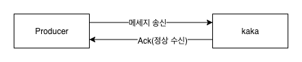
* 브로커가 프로듀서로부터 메시지를 **정상 수신했다면 Ack를 반환한다.**

컨슈머가 브로커로부터 메시지를 받을 때 **컨슈머가 어디까지 메시지를 받았는지를 관리하기 위한 오프셋이 있으며**, 이를 이용한 **전달 범위 보증의 구조를 오프셋 커밋**이라고 한다. 오프셋 커밋은 메시지를 받아 정상적으로 처리를 완료한 다음 오프셋을 업데이트함으로써 어딘가 잘못된 문제로 메시지를 재전송할 때도 어디부터 재전송하면 되는지 판단할 수 있다.

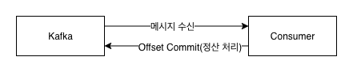
* 컨슈머가 수시한 메시지를 **정상 처리했다면 처리(수신) 완료 기록을 브로커에 남긴다.**

### Exactly Once 실현
초기 카프카는 `At Least Once` 수준의 전달을 보증하는 제품을 출시 했지만, 카프카의 유용성이 높아지면서 `Exactly Once` 수준의 전달을 보증하고자 하는 요구가 높아 졌다. 그러다 보니 카프카에 트랜잭션 개념을 도딥하여 전달을 보증한다.

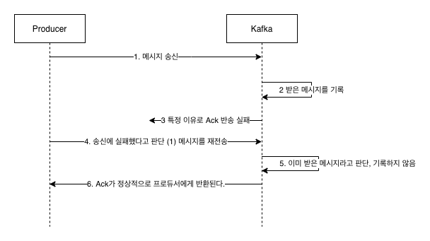

**프로듀서와 브로커의 상호 교환 사이를 살펴보면 양쪽 모두에서 시퀀시 번호를 관리해 중복되는 실행을 제거하는 방법을 사용한다**

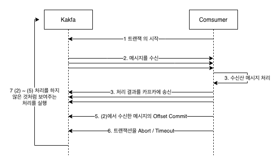

브로카와 컨슈머 간 교환에 있어서는 컨슈머에 대해 트랜잭션의 범위를 해석하고, **트랜잭션 중단 시 중단까지의 처리를 파기하는 기능이 있다.**

`Exactly Once` 수준의 전달을 보증하려면 카프카 뿐만 아니라 프로듀서에 해당하는 상류 시스템과 컨슈머에 해당하는 하류 시스템에도 상태 관리를 요구하게 된다. 따라서 **카프카 단독으로 전달 보증을 실현하긴 어렵다.** 하지만 **적어도 카프카는 트랜잭션 관리 메커니즘을 갖추고 있기 때문에 상류와 하류 시스템 사이에서 필요로 하는 상태 관리를 위한 조건이 갖추어지면 전달은 보증된다.**

# 카프카 기초
이 장의 주요 내용은 다음과 같다.

1. 메시지 송수신 기본
2. 시스템 구성
3. 부산 메시징을 위한 구조
4. 데이터 견고함을 담보하는 복제의 구조

**카프카를 이용한 애플리케이션 개발자나 카프카를 이용한 메시징 시스템의 사용자라면 1~3을 내용을 중심으로 파악하고,** 카프카를 이용한 플랫폼을 설계, 구축, 운용하는 엔지니어인 경우 4의 내용도 포함하여 파악하는 것이 좋다.

## 메시지 송수신 기본

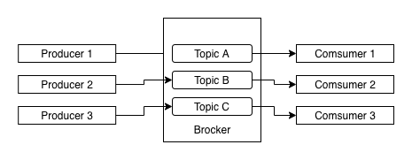

* 브로커
  * 데이터를 수신, 전달하는 서비스
* 메시지
  * 카프카에서 다루는 데이터의 최소단위, 카프카가 중계하는 로그의 한 줄 한 줄과 센서 데이터 등이 이에 해당
  * 메시지는 Key, Value를 갖게 되며 메시지 전송할 때 파티셔닝에 이용됨
* 프로듀서
  * 데이터의 생산자이며 브로커에 메세지를 보내는 애플리케이션
* 컨슈머
  * 브로커에 메세지를 취득하는 애플리케이션
* 토픽
  * 메시지를 종류(토픽)별로 관리하는 스토리지, 브로커에 배치되어 관리된다.
  * 프로듀서와 컨슈머는 특정 토픽을 지정하여 메시지를 송수신함으로써 단일 카프카는 클러스터에 여러 종류의 메시지를 중계한다.

## 시스템 구성

### 브로커
브로커는 하나의 서버(또는 인스턴스) 당 하나의 데몬 프로세스로 동작하여 메시지 수신/전달 요청을 받아들인다. 이것을 여러 대의 클러스터로 구성할 수 있으며 브로커(리소스)를 추가함으로써 수신/전달의 처리향상(스케일 아웃)이 가능하다. 브로커에서 받은 데이터는 모두 디스크로 내보내기(영속화)가 이루어져 디스크의 총 용량에 따라 장기간 데이터를 보존할 수 있다.

### 프로듀서
브로커에 데이터를 송신하기 위해 구현된 애플리케이션이다. 

### 컨슈머
브로커에 메시지를 취득하도록 구현된 애플리케이션이다. 브로커는 메시지를 디스크에 영속화하기 위해 브로커에 도달하는 즉시 컨슈머에 취득해야하는 제약이 없이 디스크에 보관되어 있는 동안은 메시지 취득이 가능하다.

> **PUSH 형, PULL 형**
> 
> 카프카 시스템에서의 메시지는 **`프로듀서 -> 브로커 -> 컨슈머`** 흐름으로 이동한다. **`프로듀서 -> 브로커`의 메시지 송신은 프로듀서가 주체가 되어 브로커에게 전송하는 PUSH형이다.** 한편 **`브로커 -> 컨슈머`** 의 데이터 흐름에서 **메시지 송신 요청은 컨슈머에서의 패치 요청을 계기로 메시지가 송신된다. 즉 브로커에서 볼때 PULL 형이다**
> 
> **브로커 -> 컨슈머** 송신을 컨슈머에서 PULL 형으로 함으로써 시스템 운영상의 큰 장점은 컨슈머 시스템이 고정이나 유지보수로 정지한 경우에 브로커에 미치는 영향이 적은 것이 있다.

### 주키퍼
카프카의 브로커에 있어 분산 처리를 위한 관리 도구로 아파치 주키퍼가 필요하다.

### 카프카 클라이언트
토픽 작성 등 카프카의 동작 및 운영 상에 필요한 조작을 실행하는 서버다. **메시지 송수신을 처리하는 서버가 아니다.**

### 카프카 클러스터
카프카는 여러 대의 브로커 서버, 주키퍼 서버로 이루어진 클러스터링 메시징 중계 기능과 메시시 송수신을 위한 라이브러리그룹(Producer API / Consumer API)으로 구성된다.

## 분산 메시징을 위한 구조
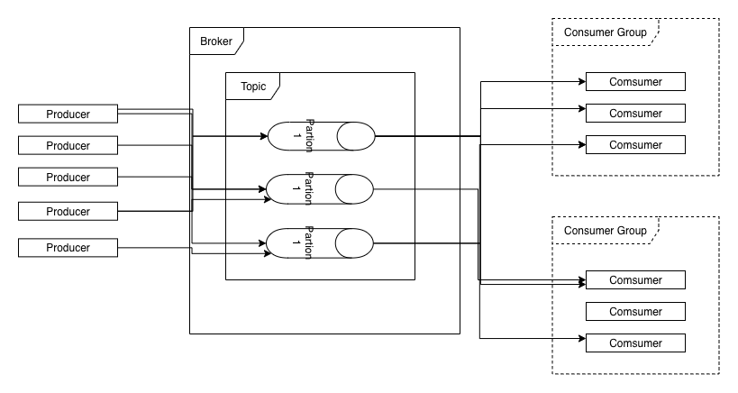

### 파티션
**토픽에 대한 대량 메시지 입출력을 지원하기 위해, 브로커상의 데이터를 읽고 쓰는 것을 파티션이라는 단위로 분할되어 있다.** 토픽을 구성하는 파티션은 브로커 클러스터 안에 분산 배치되어 프로듀서에서의 메시지 수신, 컨슈머로의 배달을 분산해서 실시함으로써 하나의 토픽에 대한 대구모 데이터 수신과 전달을 지원한다.

각 파티션을 브로커에 어떻게 배치하는가에 대한 정보는 브로커 측에 유지된다. **그러기 때문에 프로듀서/컨슈머에서는 토픽만을 지정하고, 구현 시에 송신처 파티션을 의식할 필요가 없다.**

### 컨슈머 그룹
카프카는 컨슈머에서 분산 스트림 처리도 고려해 설계되어 있다. **단일 어플리케이션 안에서 여러 컨슈머가 단일 토픽이나 여러 파티션에서 메시지를 취득하는 방법으로 컨슈머 그룹이라는 개념이 존재한다.**

카프카 클러스터 전체에서 글로벌 ID를 컨슈머 그룹 전체에 공유하고 여러 컨슈머는 자신이 속한 컨슈머 그룹을 식별해, 읽어들인 파티션을 분류하고 재시도를 제어한다.

### 오프셋
각 파티션에서 수신한 메시지에는 각각 일련번호가 부여되어 있어 파티션 단위로 메시지 위치를 나타내는 오프셋 이라는 관리 정보를 이용해 컨슈머가 취득하는 메시지의 범위 및 제시도를 제어 한다.

| 용어                  | 설명                        |
| ------------------- | ------------------------- |
| Log-End-Offset(LEO) | 퍼티션 데이터의 끝을 나타낸다          |
| Current Offset      | 컨슈머가 어디까지 메시지를 읽었는가를 나타낸다 |
| Commit Offset       | 컨슈머가 어디까지 커밋했는지를 나타낸다     |

**LEO는 브로커에 의해 파티션에 관한 정보로 관리 및 업데이트 된다. Commit Offset은 컨슈머 그룹마다 보간되어 관리, 업데이트 된다.Current Offset은 컨슈머에의해 데이터 취득을 계기로 업데이트 된다.**

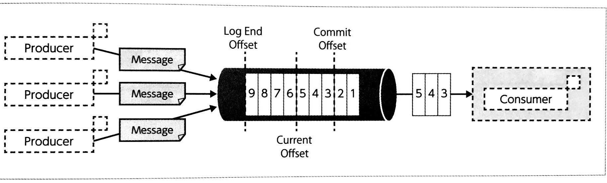

Commit Offset은 컨슈머로 부터 '여기까지의 오프셋은 처리했다'는 것을 확인하는 Offset Commit 요청을 계기로 업데이트 된다. **특정 토픽에 대해 여러 컨슈머 그룹이 메시지를 취득하는 경우 파티션에 대한 Commit Offset도 컨슈머 그룹 숫자만큼 존재한다.**

### 메시지 송수신
카프카에서는 송수신 처리량을 높이기 위해 어느정도 메시지를 축적하여 배치 처리로 송수신하는 기능을 제공한다.

##### 프로듀서의 메시시 송신
프로듀서가 토픽의 파티션에 메시지를 송신할 때 버퍼 기능 처럼 프료듀서의 메모리를 이용하여 일정량을 축적 후 송신할 수 있다. 데이터의 송신에 대해서는 지정한 크기까지 메시지가 축적되거나, 지정한 대기 시간에 도달하는 것 중 하나를 트리거로 전송한다.

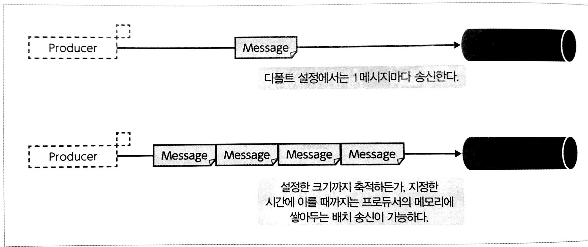

기본 설정으로 하나의 메시지는 1회 송신되지만, 수 바이트에서 수십 바이트의 작은 메시지를 **대량으로 브로커에 송신하는 상황에서 네트워크 지연이 처리량에 영향을 주는 경우도 있어 메시지를 배치로 송신함으로써 처리량을 향상시킨다.**

#### 컨슈머의 메시지 취득
컨슈머는 취득 대상의 토픽과 파티션에 대해 Current Offset으로 나타나는 위치에 마지막으로 취득한 메시지로부터 브로커에서 보관하는 최신 메시지까지 모아서 요청 및 취득을 실시하고, 그것을 반복함으로써 계속적인 메시지 취득을 진행한다.

##### 작은 범위로 요청을 하는 경우
요청으로 하나의 메시지를 취득하는 경우 하나의 메세지 마다 Current Offset을 업데이트 한다.
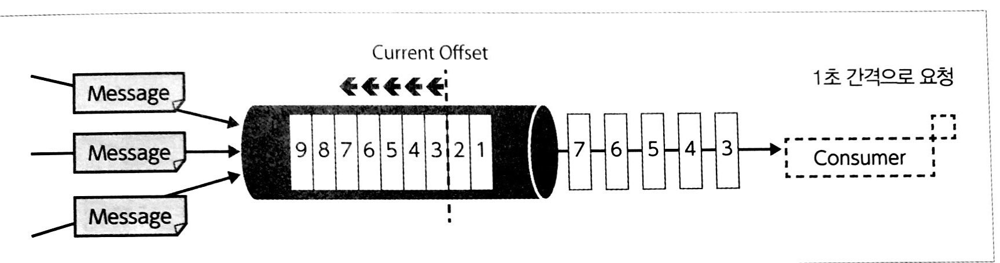

##### 일정 간격을 두고 요청하는 경우
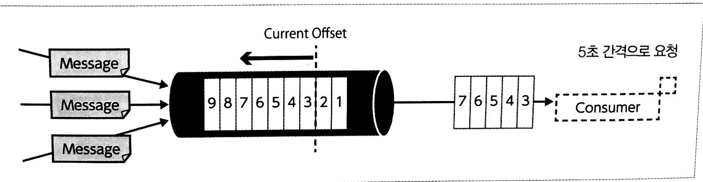

프로듀서, 컨슈머에도 어느 정도 메시지를 모아 배치 처리함으로써 처리량을 향상시키는 효과는 기대할 수 있지만 **프로듀서 송신과 컨슈머 수신 처리 지연 시간은 증가한다.** 그러므로 배치 처리의 간격에 대해서는 처리량과 대기 시간의 트레이드 오프를 고려한 설계가 필요하다.

### 컨슈머 롤백
Offset Commit의 구조를 이용해 컨슈머 처리 실패, 고장 시 롤백 메시지 재취득을 실형한다. **프로듀서에서 메시지가 송신되는 상황에서 컨슈머에 의한 데이터 취득이 2회 발생하는 시나리오로 두 번째 취득에서 장애가 발생한 때의 동작을 설명하고 있다.**

* (1) Offset 2까지 취득해 Offset Commit이 끝난 단계에서 Offset 3, 4, 5의 메세지를 취득 한다
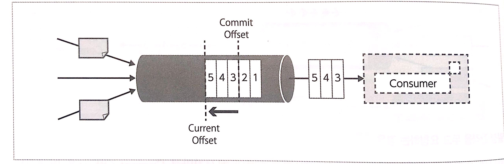
* (2) 컨슈머 쪽 처리가 끝나 Offset Commit을 실행하고, Commit Offset을 5까지 진행한다.
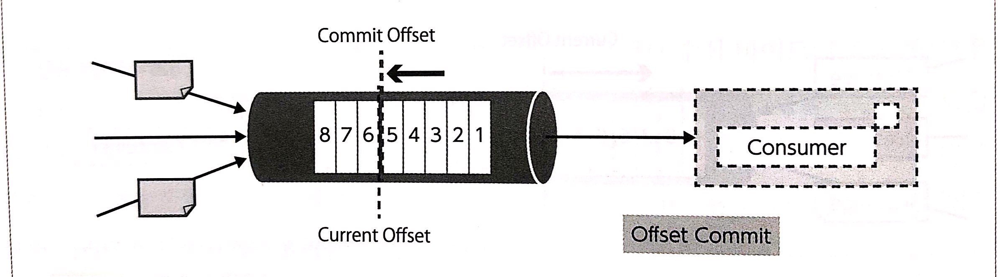
* (3) 컨슈머 쪽에서 처리 중 Offset Commit을 실행하기 전에 컨슈머에서 장애가 발생한다.
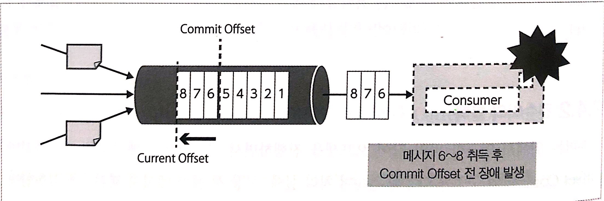
* (4) 컨슈머가 장애에서 복구되면 Commit Offset 부터 재개 한다
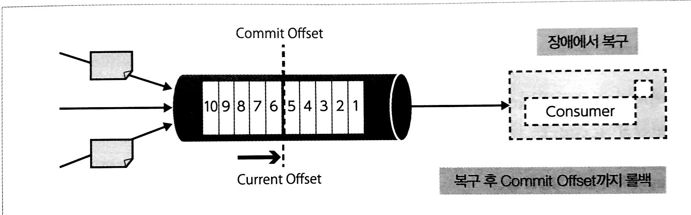
* (5) 메시지를 재취득 한다.


**Commit Offset 까지 되돌아온 오프셋 간 메시지에 대한 대처는 후속 애플리케이션에 맡긴다는 점이다. 메시지를 처리 완료 생테에서 Commit Offset 업데이트 직전의 고장의 경우 동일한 메시지가 재전송되고, 메시지 중복 처리(또는 중복 허용)가 필요하다.**

**이 재시도는 Exactly Once(빠짐없이 중복이 없는 송신)가 아니라 At Least Once(최소 1번)로 송신하는 구조다. 고장 감지, 복구에 대해서도 카프카에서 제공되는 것은 아니기 때문에 Comsummer API를 이용한 애플리케이션 쪽에서 대처가 필요하다.**

다행이도 Spark Steaming 등 카프카 연계 기능을 제공하는 대부분의 분산 처리 프레임워크는 컨슈머의 고장이나 장애를 감지하여 재실항하는 메커니즘이 있으므로 일반 사용자가 감지하여 재실행하는 경우는 드물다.

### 메시지 전송 시 파티셔닝
프로듀서에서 송신하는 메시지를 어떻게 파티션으로 보낼지 결정하는 파티셔닝(분활) 기능이 제겅되고 있다. 보내는 메시지에 포함된 Key, Value 중 Key가 명시적인 지정 여부에 따라 다음 두가지 패턴 로직으로 송신된다.

#### Key의 해시 값을 사용한 송신 

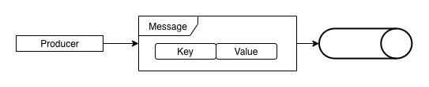

**메시지의 Key를 명시적으로 지정함으로써 Key에 따라 송신처 파티션을 결정하는 로직이 된다. 동일한 Key를 가진 메시지는 동일한 ID를 가진 파티션에 송신된다.**

#### 라둔드 로빈에 의한 송신
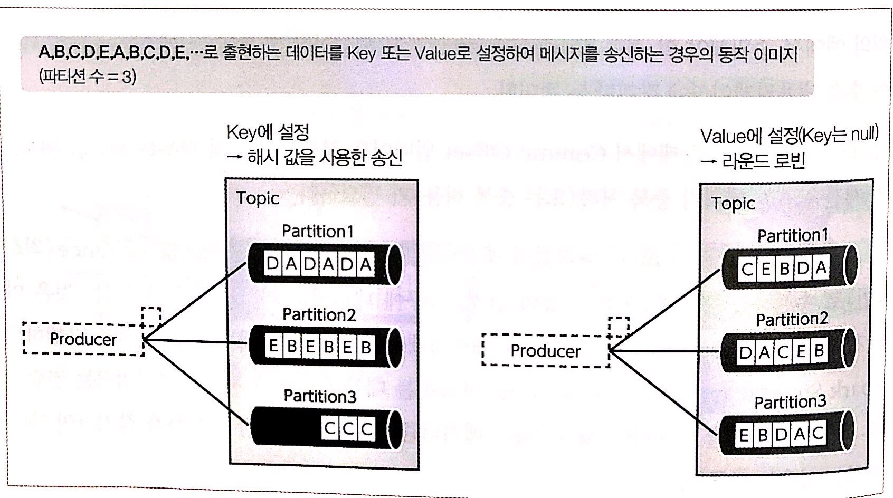
**메시지 Key를 지정하지 않고 Null로 한 경우 여러 파티션으로의 메시지 송신을 라운드 로빈 방식으로 실행한다.**

해시에 의한 파티셔닝을 이용함으로써 동일한 Key를 가진 메시지는 동일한 컨슈머에 취득 하여 처리하는 식으로 제어할 수있다. 그러나 파티셔닝을 이용하는 경우 데이터 편차에 따라른 파티션 편향에 주의를 기울어야 한다.

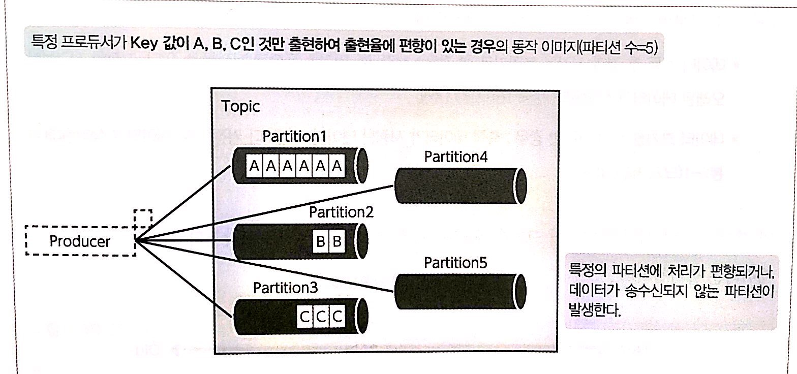

## 데이터 견고성을 높이는 복제 구조
카프카는 메시지를 중계함과 동시에 서버가 고장 났을 때에 수신한 메시지를 잃지 않기 위해 복제 구조를 갖추고 있다.

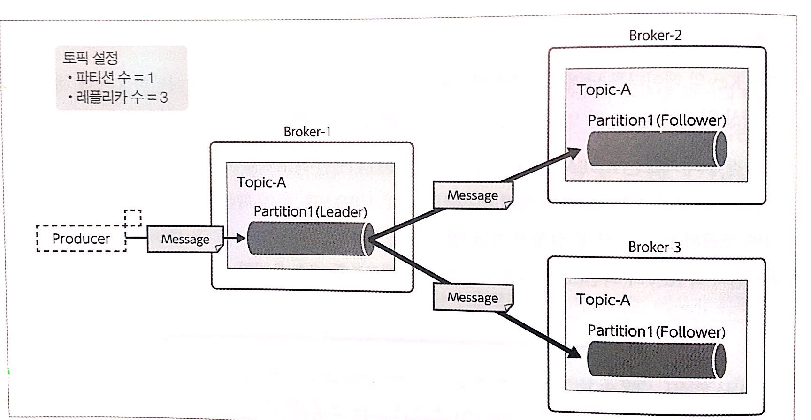
파티션은 단일 또는 여러 개 레플리카로 구성되어 토픽 단위로 레플리카 수를 지정할 수 있다. 레플리카 중 하나는 Leader이며, 나머지는 Fllower라고 불린다. Follower는 그 이름대로 Leader로 부터 메시지를 계속적으로 취득하여 복제를 유지하도록 동작한다. 다판 프로듀서/컨슈머의 데이터의 교환은 Leader가 맡고 있다.

### 복제 완료 최신 오프셋
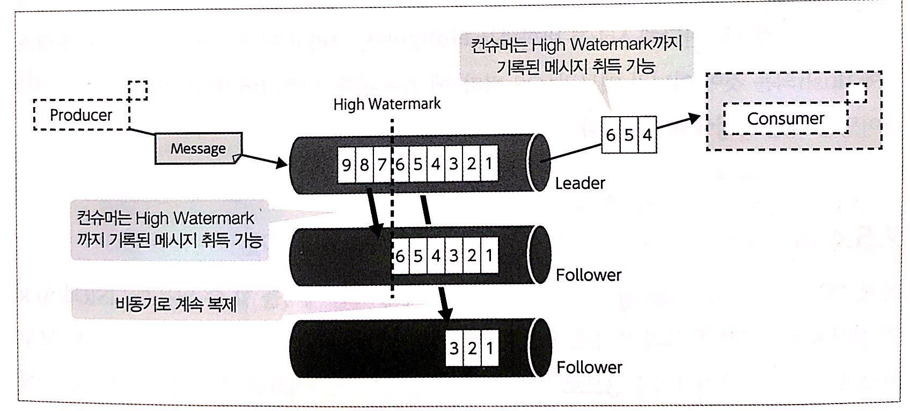

복제 사용시 오프셋 관리는 LEO 이외의 High Watermakr 라는 개념이 있다. High Watermakr는 복제가 완료된 오프셋이며, 그 성질에 반드시 Log End Offset과 동일하거나 오래된 오프셋을 나타낸다.

### 프로듀서의 메시지 도달 보증 수준
브로커에서 프로듀서로 메시지가 송신된 것을 나타내는 Ack를 어느 타이밍에 송신할 것인지를 제어하는 것은 성능과 내장애성(브로커 서버 고장 시 데이터 분실 방지)에 큰 영향을 준다.

| Ack 설정 | 설명                                      |
| ------ | --------------------------------------- |
| 0      | 프로듀서는 메시지 송신 Ack를 기다리지 않고 다음 메시지를 송신한다. |
| 1      | Leader Replica에 메세지가 전달되면 Ack를 반환한다.    |
| ALL    | 모든 ISR의 수만큼 복제되면 Ack를 반환한다.             |


# 카프카 설치

## 컨플루언트 플랫폼 리포지터리 등록
```
$ sudo rpm --import https://packages.confluent.io/rpm/5.0/archive.key
$ cd /etc/yum.repos.d
$ touch confluent.repo
$ vi confluent.repo
```

```config
[Confluent.dist]
name=Confluent repository (dist)
baseurl=https://packages.confluent.io/rpm/5.0/7
gpgcheck=1
gpgkey=https://packages.confluent.io/rpm/archive.key
enabled=1

[Confluent]
name=Confluent repository
baseurl=https://packages.confluent.io/rpm/5.0
gpgcheck=1
gpgkey=https://packages.confluent.io/rpm/archive.key
enabled=1
```
* yum 리포지터리 등록을
```
$ yum clean all
```
* yum 리포지터리 기존 캐시 삭제


```
$ yum list | grep confluent

...
avro-c.src                                           1.8.0_confluent5.0.3-1.el7                        Confluent.dist
avro-c.x86_64                                        1.8.0_confluent5.0.3-1.el7                        Confluent.dist
avro-c-debuginfo.x86_64                              1.8.0_confluent5.0.3-1.el7                        Confluent.dist
avro-c-devel.x86_64                                  1.8.0_confluent5.0.3-1.el7                        Confluent.dist
...
```
* yum 으로 사용 가능한 패키지 목록에 컨플루언트 플랫폼이 포함되어 있는지 여부를 확인
* 좀 오래 기달려 야함

## 카프카 설치
```
$ sudo yum install confluent-platform-oss-2.11
```
* 등록한 컨플루언트 플랫폼 리포지터리에서 카프카를 실행하기 위해 필요한 패키지를 설치 한다.
* 컨플루언트 플랫폼은 잘게 구분된 여러 패키지가 조재하는데, 이 `confluent-platform-oss-2.11` 그중 컨플루언트 플랫폼 OSS 버전의 패키지를 설치하기 위한 것이다.

## 브로커의 데이터 디렉토리 설정

`/etc/kafka/server.properties` 열어 다음과 같이 수정한다

```
# log.dirs=/var/lib/kafka
log.dirs=/var/lib/kafka/data
```
`log.dirs=/var/lib/kafka` -> `log.dirs=/var/lib/kafka/data` 으로 변경

`log.dirs`는 브로커에서 사용하는 데이터 디렉터리를 설정하는 항목이다. 컨플루언트 플랫픔의 기본 값은 `/var/lib/kafka`로 설정되어 있는데 Oracle JDK를 사용하는 경우 이를 변경 해야한다.

다음으로는 브로커가 사용하는 데이터 디렉터리를 만든다. `/var/lib/kafka/data`를 이용하므로 이 디렉터리를 만든다. 컨플루언트 플랫폼에 포함되어 있는 스크립트로 브로커를 시작하는 절차에서는 브로커를 시작하는 사용자가 cp-kafka 이므로 디렉터리의 소유자도 여기에 맞게 변경한다.

```
$ sudo mkdir /var/lib/kafka/data
$ sudo chown cp-kafka:confluent /var/lib/kafka/data
```

## 카프카 실행과 동작 확인

### 카프카 클러스터 실행
구축한 카프카 클러스터를 실행한다. 주키퍼와 브로커 중에 주키퍼를 먼저 실행한 후에 브로커를 실행 해야 한다.

```
$ sudo systemctl start confluent-zookeeper
$ sudo systemctl start confluent-kafka
```

우선 주키퍼를 실행 하기 위해 주키퍼 실행 명력을 입력한다. 여러 대의 서버에서 카프카 클러스터를 구축하고 있는 경우 주피커가 설치된 모든 머신에 실행된다. 여러 대의 서버에서명령을 실행할 때 주키퍼 서버 간 명령 실행 순서는 상관 없다.


* 주키퍼의 로그는 `/var/log/kafka/zookeeper.out`
* 브로커의 로그는 `/var/log/kafka/server.log`

### 카프카 클러스터 동작확인

카프카에 들어 있는 도구 Kafka Console Producer와 Kafka Console Consumer를 이용하여 실제 메시지를 전송하고, 카프카 클러스터가 제대로 동작하는지 송수신 여부를 확인 한다.

동작을 확인 하기 위해서는 송수신을 하기위한 토픽을 작성한다. 카프카 클라어은트에서 다음 명령을 실행한다.

```
$ kafka-topcis --zookeeper kafka-brokcer01:2181 --create --topic --first-test --partitions 3 --replication-factor 3
```


### 카프카 클러스터 종료
```
$ sudo systemctl stop confluent-kafka
$ sudo systemctl stop confluent-zookeeper
```

종료할 때는 실행한 것과 반대로 브로커부터 종료하고, 그 다음 주키퍼를 종료한다.

# 자바 API를 사용하여 애플리케이션 만들기

## 프로듀서 애플리케이션
```java
public class FirstAppProducer {

    private static String topicName = "first-app";

    public static void main(String[] args) {
        // (1) KafkaProducer에 필요한 설정
        final Properties conf = new Properties();

        conf.setProperty("bootstrap.servers", "kafka-broker01:9092,kafka-broker02:9092,kafka-broker03:9092");
        conf.setProperty("key.serializer", "org.apache.kafka.common.serialization.IntegerSerializer");
        conf.setProperty("value.serializer", "org.apache.kafka.common.serialization.StringSerializer");

        // (2) 카프카 클러스터에서 메시지를 송신(Produce) 하는 객체 생성
        final Producer<Integer, String> producer = new KafkaProducer<>(conf);

        int key;
        String value;

        for (int i = 1; i <= 100; i++) {
            key = i;
            value = String.valueOf(i);

            // (3) 송신 메시지 생성
            final ProducerRecord<Integer, String> record = new ProducerRecord<>(topicName, key, value);

            // (4) 메시지를 송신하고 Ack를 받을 때 실행할 작업 (Callback) 등록
            producer.send(record, (metadata, e) -> {
                if (metadata != null) {
                    // 송신에 성공한 경우의 처리
                    String infoString = String
                        .format("Success partition:%d, offset:%d", metadata.partition(), metadata.offset());
                    System.out.println(infoString);
                } else {
                    // 송신에 실패한 경우의 처리
                    String infoString = String.format("Failed:%s", e.getMessage());
                    System.err.println(infoString);
                }
            });
        }
        // (5) KafkaProducer를 클로즈하여 종료
        producer.close();
    }
}
```

### KafkaProducer 객체 작성

```java
// (1) KafkaProducer에 필요한 설정
final Properties conf = new Properties();

conf.setProperty("bootstrap.servers", "kafka-broker01:9092,kafka-broker02:9092,kafka-broker03:9092");
conf.setProperty("key.serializer", "org.apache.kafka.common.serialization.IntegerSerializer");
conf.setProperty("value.serializer", "org.apache.kafka.common.serialization.StringSerializer");

// (2) 카프카 클러스터에서 메시지를 송신(Produce) 하는 객체 생성
final Producer<Integer, String> producer = new KafkaProducer<>
```

bootstrap.servers에서 작성할 kafkaProducer가 접속하는 브로커의 호스트명과 포트 번호를 지정한다.

`key.serializer`, `value.serializer`

카프카에서는 모든 메시지가 직렬화된 상태로 전송된다. `key.serializer`, `value.serializer`는 이 직렬화 처리에 이용되는 시리얼라이즈 클래스를 지정한다.

`key.serializer`는 Key를 직렬화하는 데 사용되고, `value.serializer`는 메시지의 value를 직렬화하는데 사용된다.

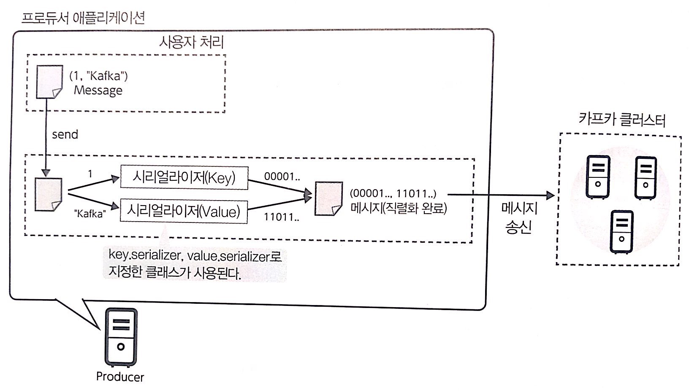


### 메시지 송신하기
```java
producer.send(record, (metadata, e) -> {
    if (metadata != null) {
        // 송신에 성공한 경우의 처리
        String infoString = String
            .format("Success partition:%d, offset:%d", metadata.partition(), metadata.offset());
        System.out.println(infoString);
    } else {
        // 송신에 실패한 경우의 처리
        String infoString = String.format("Failed:%s", e.getMessage());
        System.err.println(infoString);
    }
});
```
여기서는 ProducerRecod 객체 뿐만 아니라 Callback 클래스를 구현하여 KafkaProducer에 전잘하고 있다. 이 Callback 클래스에 구현하고 있는 onCompletion 메서드에서는 송신을 완료했을 때 실행되어야 할 처리를 하고 있다.

**KafkaProducer의 송신 처리는 비동기적으로 이루어지기 때문에 send 메서드를 호출했을 때 발생하지 않는다. send 메서드의 처리는 KafkaProducer의 송신 큐에 메시지를 넣을 뿐이다. 송신 큐에 넣은 메시지는 사용자의 애플리케이션과 다른 별도의 스레드에서 순차적으로 송신된다.**

메시지가 송신된 경우 카프카 클러스테엇 Ack가 반환된다. Callback 클래스의 메서드는 그 Ack를 수신했을 때 처리된다.

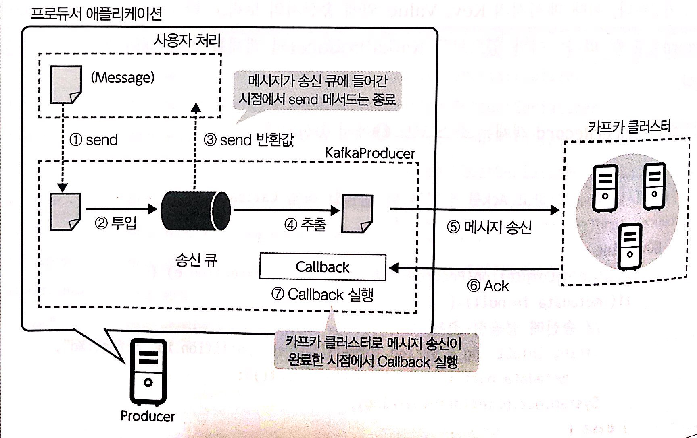

Callback 클래스의 메서드는 메시지가 송신에 성공했을 때와 실패했을 때 동일한 ㅐㄴ용이 로출된다. 메시지가 송신에 성공했을 때는 RecodeMetadata가 null이 아닌 객체이며 Exception은 null이 된다. 메시지 송신에 실패 했을 때는 RecodeMetadata가 null이 되고 Exception은 null 이외의 객체가 된다.

```java
// (5) KafkaProducer를 클로즈하여 종료
  producer.close();
```
close 메서드 호출로 KafkaProducer 안의 송신 큐에 남아 있는 메시지도 송신되어 안전하게 애플리케이션을 종료할 수 있다.

## 컨슈머 애플리케이션 개발

```java
public class FirstAppConsumer {

    private static String topicName = "first-app";

    public static void main(String[] args) {

        // (1) KafkaConsumer에 필요한 설정
        final Properties conf = new Properties();
        conf.setProperty("bootstrap.servers", "kafka-broker01:9092,kafka-broker02:9092,kafka-broker03:9092");
        conf.setProperty("group.id", "FirstAppConsumerGroup");
        conf.setProperty("enable.auto.commit", "false");
        conf.setProperty("key.deserializer", "org.apache.kafka.common.serialization.IntegerDeserializer");
        conf.setProperty("value.deserializer", "org.apache.kafka.common.serialization.StringDeserializer");

        // (2) Kafka클러스터에서 Message를 수신(Consume)하는 객체를 생성
        final Consumer<Integer, String> consumer = new KafkaConsumer<>(conf);

        // (3) 수신(subscribe)하는 Topic을 등록
        consumer.subscribe(Collections.singletonList(topicName));

        for (int count = 0; count < 300; count++) {
            // (4) Message를 수신하여, 콘솔에 표시한다
            ConsumerRecords<Integer, String> records = consumer.poll(1);
            for (ConsumerRecord<Integer, String> record : records) {
                String message = String.format("key:%d, value:%s", record.key(), record.value());
                System.out.println(message);

                // (5) 처리가 완료한 Message의 Offset을 Commit한다
                TopicPartition tp = new TopicPartition(record.topic(), record.partition());
                OffsetAndMetadata oam = new OffsetAndMetadata(record.offset() + 1);
                Map<TopicPartition, OffsetAndMetadata> commitInfo = Collections.singletonMap(tp, oam);
                consumer.commitSync(commitInfo);
            }
            try {
                Thread.sleep(1000);
            } catch (InterruptedException ex) {
                ex.printStackTrace();
            }
        }

        // (6) KafkaConsumer를 클로즈하여 종료
        consumer.close();
    }
}
```
### KafkaComsumer 객채 작성
```java
// (1) KafkaConsumer에 필요한 설정
final Properties conf = new Properties();
conf.setProperty("bootstrap.servers", "kafka-broker01:9092,kafka-broker02:9092,kafka-broker03:9092");
conf.setProperty("group.id", "FirstAppConsumerGroup");
conf.setProperty("enable.auto.commit", "false");
conf.setProperty("key.deserializer", "org.apache.kafka.common.serialization.IntegerDeserializer");
conf.setProperty("value.deserializer", "org.apache.kafka.common.serialization.StringDeserializer");
```
* group.id: 작성할 KafkaComsumer가 속한 Consumer Group을 지정한다.
* enable.auto.commit: 오프셋 커밋을 자동으로 실행할지 여부를 지정한다. 여기서는 커밋을 수동으로 하기 때문에 false
* key.deserializer, value.deserializer: 컨슈머의 사용자 처리에 전달되기 전에 실시되는 디시얼라이즈 처리에 이용되는 역질렬화 클래스를 지정한다.

### 메시지를 수신하기
subscribe 메서드를 호출하믕로서 수신하는 토픽을 구독한다.

```java
// (3) 수신(subscribe)하는 Topic을 등록
consumer.subscribe(Collections.singletonList(topicName));
// (4) Message를 수신하여, 콘솔에 표시한다
ConsumerRecords<Integer, String> records = consumer.poll(1);
```
토픽을 수신한 후에 메시지를 받는다.


```java
// (5) 처리가 완료한 Message의 Offset을 Commit한다
TopicPartition tp = new TopicPartition(record.topic(), record.partition());
OffsetAndMetadata oam = new OffsetAndMetadata(record.offset() + 1);
Map<TopicPartition, OffsetAndMetadata> commitInfo = Collections.singletonMap(tp, oam);
consumer.commitSync(commitInfo);
```
컨슈머에서 지정한 Manual Offset Commit을 하고 있기 때문에 애플리케이셔ㅓㄴ에서 적절한 타이밍에 오프셋 커밋을 명시적으로 실핼할 필요가 있다. 여기서는 하나의 메시지를 처리가 완료 될 때마다 오프셋 터밋을 한다. Auto Offset Commit을 설정의 경우 해당 코드는 필요하지 않다.

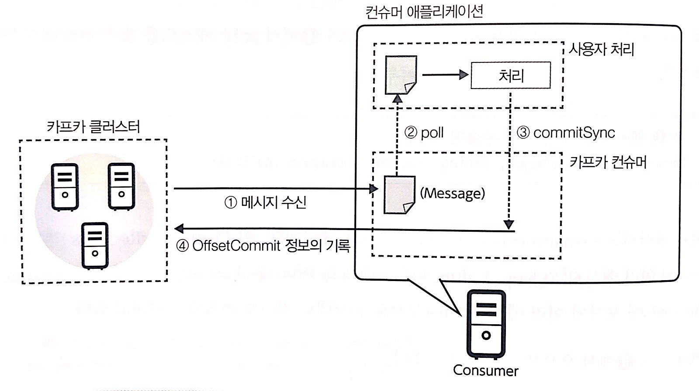

# 카프카 사례

## 카프카 대표적인 기능

* 데이터 허브: 여러 시스템 사이에서 데이터를 상호 교환한다.
* 로그 수집: BI 도구를 이용한 리포팅과 인공지능 분석을 위해 여러 서버에서 생성된 로그를 수집하고 축적할 곳에 연결 한다.
* 웹로그 활동 분석: 실시간 대시보드와 이상/부정 검출 등 웹에서의 사용자 활동을 실시간으로 파악한다.
* 사물 인터넷: 센서 등 다양한 디바이스에서 보낸 데이터를 수신해 처리한 후 디바이스에 송신한다.
* 이벤트 소싱: 데이터에 대한 이벤트를 순차적으로 기록하고 CQRS 방식으로 대량의 이벤트를 유연하게 처리한다.

## 카프카 적용 사례

### 카프카 특징 복습
카프카는 대량의 데이터를 **높은 처리량**으로 **실시간** 처리하기 위한 제품이다. **카프카의 아키텍처는 변한없이 데이터 상호 교환을 위한 기반으로 발전해왔다. 현재는 카프카가 데이터를 전달하는 파이프라인 그 자체를 구성하기 위한 기반이라고 말할 정도다.**

카프카로 실현할 수 있는 4가지를 살펴보자

1. 확장성: **여러 서버로 확장(스케일 아웃)** 구성할 수 있기 때문에 데이터 양에 따라 시스템과 확장이 가능하다.
2. 영속성: 수신한 데이터를 **디스크에 유지**할 수 있기 때문에 언제라도 데이터를 읽을 수 있다.
3. 유연성: **연계할 수 있는** 제품이 많기 때문에 제품이나 시스템을 연결하는 허브 역할을 한다.
4. 신뢰성: **메시지 전달 보증**을 하므로 데이터 분식을 걱정하지 않아도 된다.

카프카의 기능과 다른 제품을 결합으로써 실시간으로 높은 처리량의 데이터를 처리할 수 있다. 간혈적으로 발생하는 데이터를 수신하여 그때 마다 순차 처리하는 스트림 처리의 기반으로 카프카를 사용할 수 있다.

카프카는 대량의 데이터를 처리해야 하는 전제하에, 카프카의 각 기능과 특징이 중시되는 상황을 정리하면 다음과 같다.

| 특징        | 설명                                                                 |
| --------- | ------------------------------------------------------------------ |
| 실시간       | 긴급성이 요구되거나 데이터를 즉시 사용하는 경우                                         |
| 동보성       | 하나의 동일한 데이터를 후속의 여러 시스템에서 사용하는 경우. 데이터를 전잘하는 관계 시스템이 단계적으로 증가하는 경우 |
| 영속성       | 데이터를 버퍼링해야 하는 경우 처리 시간 간격이 다른 복수의 처리와 관련된 경우                       |
| 다수의 제휴 제품 | 사용되는 제품이나 균일하지 않고 다양한 접속을 필요로 하는 경우                                |
| 송수신의 보증   | 데이터 손실이 허용되지 않는 경우                                                 |
| 순서 보증     | 데이터 소스에 있어 데이터의 생성 순서를 증시하여 순서에 따른 판단과 제어를 수반하는 경우                 |

### 카프카 특징과 사례 대응
| 사례      | 실시간 | 동보 전송 | 영속성 | 다수의 제휴 제품 | 송수신 보증 | 순서 보증 |
| ------- | --- | ----- | --- | --------- | ------ | ----- |
| 데이터 허브  | X   | O     | O   | O         | O      | X     |
| 로그수집    | X   | X     | O   | O         | O      | X     |
| 웹 활동 분석 | O   | X     | X   | O         | O      | O     |
| 사물인터넷   | O   | X     | X   | O         | X      | X     |
| 이벤트 소싱  | O   | X     | O   | X         | O      | O     |

## 데이터 허브
**데이터 허브란 여러 곳의 데이터소스가 되는 시스템에서 데이터를 수집하여 여러 시스템에 전잘하는 아키텍처를 의미한다.**

### 데이터 허브에서 해결해야할 과제
독린된 시스템이 만흔 회사는 시스템 간 데이터 연계라는 큰 과제가 있다. 다음 같은 사항을 고려해야 한다.

* 데이터 형식은 CSV로 좋은지
* 송신 타이밍은 1일 1회로 좋은지
* 상대 시스템이 유지보수하는 동안 어떻게 할 것인지
* 장애가 발생했을 때 데이터를 잃지 않기 위해 어떻게 할지

예를 들어 어떤 스스템에 있는 데이터를 3개의 시스템으로 전송해야하는 경우 3개의 시스템 별로 데이터 연계 방식을 조정해야한다. 이러한 것을 시스템 특성을 고려하라면 상당한 노력이 필요하다.

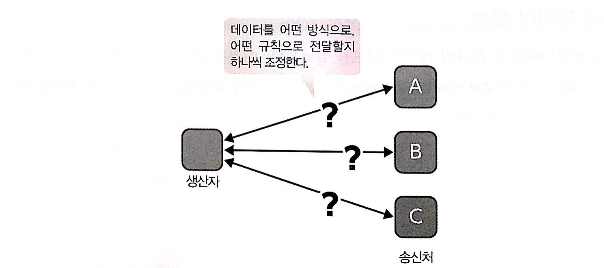

1년 후에는 연계 시스템이 늘어날 수 도 있다.

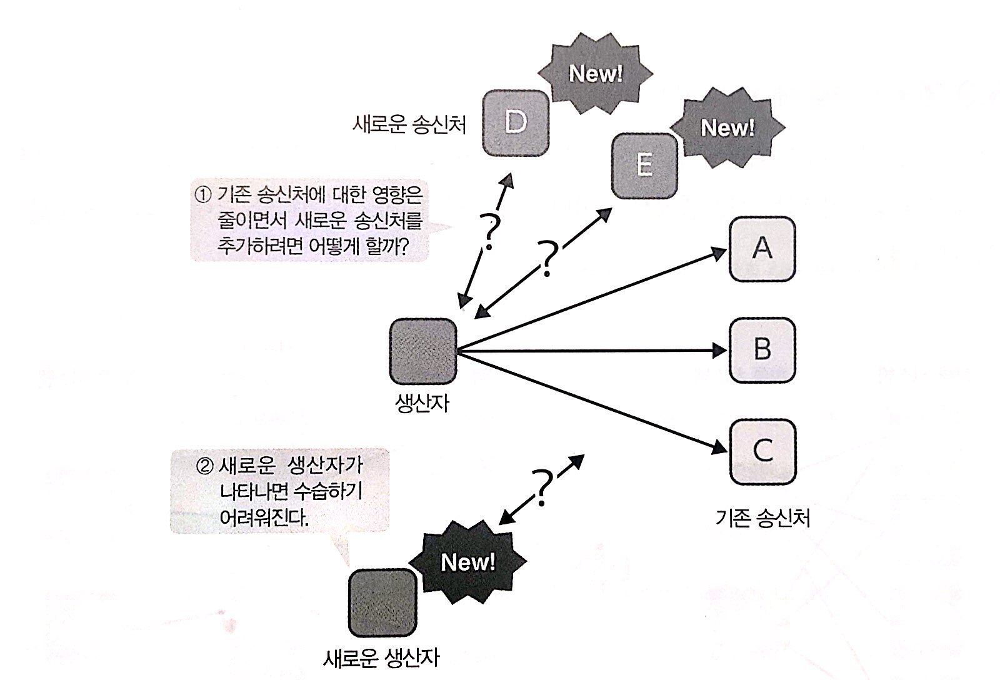

시스템이 많으면 많을수록 시스템 간의 접속 패턴과 변형이 많아져서 좀처럼 수습하기가 어렵다. 시스템 사일로화에 의한 접속수 증가에 따라 다음과 같은 과제를 해결해야 한다.

* 데이터 소스에서 생성된 동일한 데이터를 여러 시스템에서 이용한다.
* 수속 시스템마다 데이터를 필요로 하는 시기와 빈도가 다르다.
* 접속원이나 연결 시스템에서 이용되는 연계 방식이 제각각이다. (FTP 전송에 의한 파일 연계 규칙, JDBC 접속으로 연결되는 DBMS 제품)
* 데이터 분식을 허용하지 않는다.

### 카프카로 데이터 허브 구현하기
사일로화를 해결하기 위한 개념의 하나로 데이터 허브 아키턱처가 있다. 데이터 허브 아키텍처란 **데이터 소스가 되는 시스템에서 데이터를 수집하여 해당 데이터를 여러 시스템에 전잘하는 아키텍처다.**

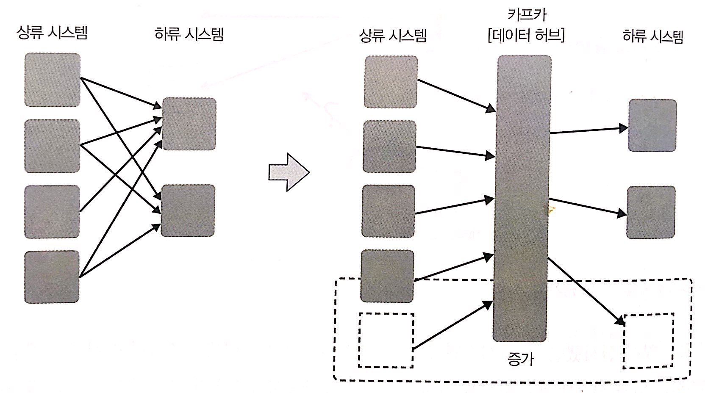

* 카프카로 사일로화된 시스템 접속을 간소화할 수 있다.
* 상류 시스템/하류 시스템 모두 증가하거나 감소한다고 해도 데이터 허브와의 접속만 고려하면 된다.

데이터 허브 아키텍처에서는 시스템을 일대일로 연결하는 대신 모든 **시스템이 데이터 허브에 데이터를 보내고 데이터 허브에서만 데이터를 받을 수 있도록 되어있다.** 이렇게 하면 시스템은 데이터를 데이터 허브에 보내는 것만 생각하면 되고, 데이터를 수신하는 시스템도 데이터 허브에서 데이터를 받는 것만 생각하면 된다.

카프카를 데이터 허브로 시용함으로써 다대다(M:N) 접속을 **모든 시스템은 카프카에 연결하기만 하면 된다**는 형태로 해결할 수 있다.

| 특징        | 설명                                                                                                       |
| --------- | -------------------------------------------------------------------------------------------------------- |
| 동보 전송     | 데이터 소스에서 생성된 동일 데이터를 여러 시스템에서 이용할 수 있다. 이는 펍/섭 메시징 모델로 착안했기 때문에 실현 가능하다.                                 |
| 영속화       | 데이터를 필요로 하는 시기와 빈도가 후속 시스템마다 다른 문제에 대해 카프카는 데이터를 영속화하고 버퍼링함으로써 임의의 시기에 추출할 수 있다.                         |
| 다수의 연계 제품 | Kafka Connect로 연계할 수 있는 제품이 다수 있기 때문에 접속원이나 연결 시스템에서 사용하는 제품이 다수라고 하더라도 이에 대응할 수 있는 가능성이 높다.             |
| 송수신 보증    | 카프카는 데이터 분실이 허용되지 않는 요구 사항에 대해 송수신을 보증한다. `At Least Once`, `Exactly Once` 등 서로 다른 수준의 송수신 보증에도 대응할 수 있다. |

## 이벤트 소싱

### 이벤트 소싱이란?
이벤트 소싱은 상태의 변화 하나하나를 이벤트로 취급하여 발생하는 이벤트를 순서대로 기록해두는 것이다. 사용자는 기록된 이벤트에서 도메인 객체를 구체화할 수 있으며 경위도 확인할 수있다. 알기 쉽게 설명하면 DBMS의 트랜잭션 로그의 레코드 쓰기를 상상하면 좋을것이다. **카프카는 데이터를 모두 추상적인 로그로 취급하고 받은 메시지는 로그에 순차적으로 기록되기 때문에 카프카의 아키텍처 그 자체가 이벤트 소싱에 접합하다는 것을 알 수 있다.** 또한 이벤트 소싱과 더블어 이해햐야 하는 것이 CQRS다.

### CROS란 ?
CQRS (Command Query Responsibility Segregation, 커멘드 쿼리 책임 분리)란 데이터의 생신과 문의 처리를 분리하는 아키첵처다. Command란 데이터의 Create/Update/Delete 등 데이터 갱신 처리에 해당한다. 쿼리란 데이터의 문의, 즉 참조 처리애 해야한다. **CQRS는 Command(갱신), Query(참조)의 책임을 분리 한다는 의미다.** 커멘드 쪽인 갱신 처리는 데이터가 갱신되는 것에만 책임지고 처리한다. **갱신 처리 시 참조 결과에 대해서는 반환하지 않으며 그 데이터가 어떻게 참조 되는지에 대해서도 관여하지 않는다. 쿼리 쪽은 참조 처리는 적절한 결과를 반환하는 책임만 있다.**

### 이벤트 소싱 +  CQRS에서 카프카 사용하기
CQRS 개념인 갱신 처리와 참조 처리의 분리를 위해 카프카를 아키첵처로 사용한다. 카프카는 이벤트를 지정하는 저장소이며, 이벤트를 전잘하는 허브로 간주할 수 있다. CQRS는 다음과 같은 형태로 구현한다.

* 카프카가 데이터 소스에서 시계열 데이터를 받아 기록한다. 이것은 커맨드 쪽 역할을 한다.
* 카프카가 데이터 싱크에 데이터를 전잘한다. 받은 쪽은 자신의 쿼리에 있어 참조 효율이 좋은 형식으로 데이터를 변환하여 사용한다.
* 이렇게 해서 커멘드와 쿼리의 분리가 가능 해진다.

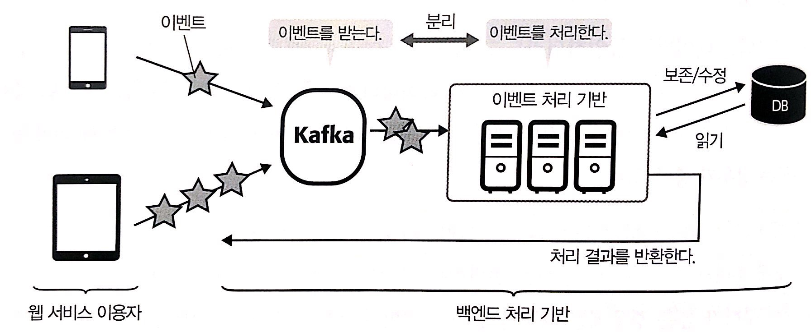

카프카는 커맨드에 해당하는 갱신 ㅓ리로 이벤트를 받은 역할을 한다. 쿼리에 해당하는 참조를 처리하기 위한 형식 변환은 카프카와 분리된 별도 기반에서 담당한다. 참조를 위한 DBMS를 뒤편에 준비해 카프카와 분리했다. 이때 카프카는 커멘드의 순차 기록과 데이터 허브로서 데이터를 전잘하는 두 가지 역할을 담당한다.

# 카프카 데이터 파이프라인 구축에 필요한 사전 지식

## 카프카를 이용한 데이터 파이프라인의 구성 요소

### 데이터 파이프라인이란 ?
카프카는 분산 메시징 시스템으로 다른 시스템이나 도구에서 보낸 메시지를 받아 다른 시스템이나 도구의 요청에 근거해 메시지를 전잘하는 기능을 제공하고 있다. 카프카는 데이터의 발생, 수집, 가공, 저장 출력에 이르는 일련의 과정에서 도구와 스스템을 연결하는 역할을 한다. **이 데이터가 전달되는 경로나 처리를 위한 기반 전체를 데이터 파이프 라인이라고 한다.**

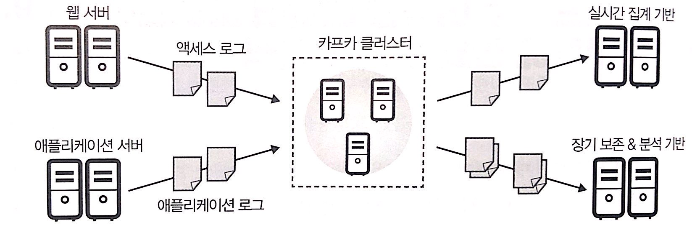
간단한 예로 웹 서비스의 사용자 분석을 위한 데이터 파이프라인이다. 이때 카프카를 중심으로 하는 데이터 파이프 라인과 분석 모습은 위 와 같다.

카프카가 하나 이상의 브로커로 된 카프카 클러스터, 프로듀서, 컨슈머, 카프카 클라이언트로 구성되어 있다고 소개했다. 이 중에 **데이터 파이프라인의 일부가 되는 것은 카프카 클러스터, 프로듀서, 컨슈머다.**

### 데이터 파이프라인의 프로듀서 구성 요소
카프카를 이용한 데이터 파이프라인의 프로듀서 쪽은 데이터를 생성하고 송신하는 미들웨어가 카프카에 대응하고 있는지에 따라 다음의 두 가지 패턴을 뷴류할 수 있다.

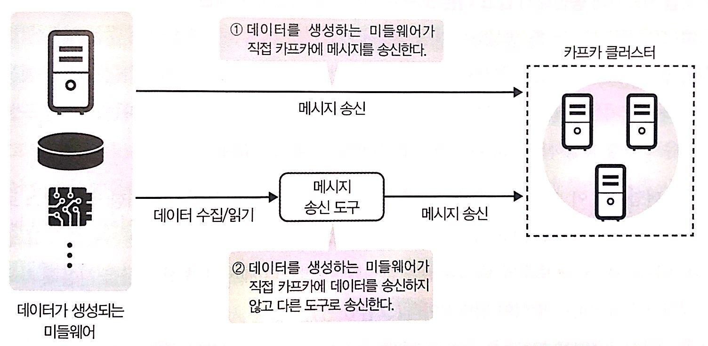

1. 미들웨어가 직접 카프카에 메시지를 송신하는 패턴
2. 미들웨어가 직접 카프카에 데이터를 송신하지 않고 다른 도구로 메시지를 송신하는 패턴

#### 미들웨어가 직접 카프카에 메시지를 송신하는 패턴
말 그대로 사용하는 미들웨어가 카프카에 메시지를 송신하는 패턴이다. 이 경우 미들웨어 기능을 이용하여 카프카에 필요한 메시지를 송신할 수 있으므로 비교적 쉽게 카프카로 데이터 파이프라인을 구출할 수 있다. 최근 카프카로 메시지 송신을 지원하는 미들웨어도 늘고 있다. 카프카는 Kafka Streams라는 스트림 처리를 구현하기 위한 라이브러리가 포함되어 있다. 기본적으로 카프케에서 사용할 수 있다.


#### 미들웨어가 직접 카프카에 데이터를 송신하지 않고 다른 도구로 메시지를 송신하는 패턴
이 패턴은 주로 데이터를 생성하는 미들웨어가 카프카로 메시지를 송신하지 않은 경우 해당한다. 일단 특정 형식으로 데이터를 출력하고, 데이터를 생성하는 미들웨어와는 별개로 메시지 송신 도구를 이용하여 카프카에 전송한다.

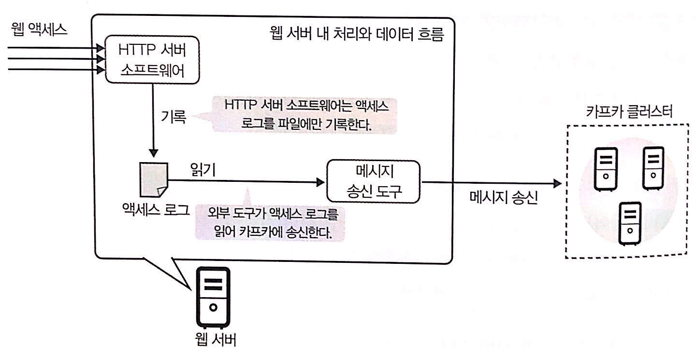
일반적인 HTTP 서버는 액세스 로그를 카프카에 직접 송신하는 기능을 갖고 있지 않다. 이 경우는 일단 로컬의 로그 파일에 출력한 뒤 별도의 메시지 송신 도구를 사용해 카프카에 메시지로 송신하는 방식이 일반적이다.

### 데이터 파이프라인의 컨슈머 구성 요소
프로듀서 쪽과 마찬가지로 컨슈머도 두 가지 패턴으로 분류할 수 있다.

1. 미들웨어가 직접 카프카에서 메시지를 취득해 처리하는 패턴
2. 미들웨어가 다른 도구를 통해 카프카에서 메시지를 취득해 처리하는 패턴

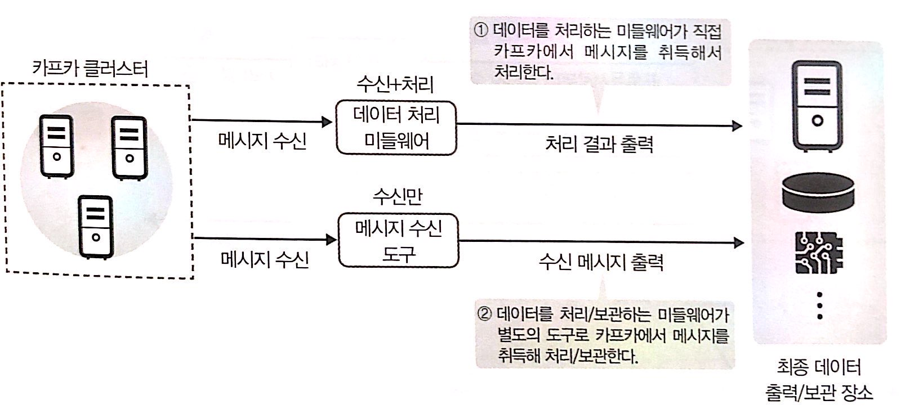

#### 미들웨어가 직접 카프카에서 메시지를 취득해 처리하는 패턴
데이터를 처리하거나 기록하는 미들웨어가 카프카에서 메시지를 수신하는 패턴이다. 이 패턴은 배치 처리와 스트림 처리를 모두 대응할 수 있지만 카프카 스트림 데이터를 취급하는 기반이기 때문에 특히 스트림 처리에서 많이 볼 수 있다.

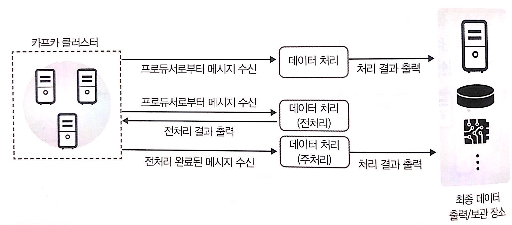

#### 미들웨어가 다른 도구를 통해 카프카에서 메시지를 취득해 처리하는 패턴
이 패턴은 데이터를 처리하고 기록하는 시스템 또는 미들웨어가 **카프카에서 메시지 수신을 지원하지 않아 다른 도구로 카프카에서 메시지를 수신한 후 원하는 시스템에 데이터를 전잘하는 방식이다.**

> Kafka Connect와 Kafka Streams에 의한 데이터 파이프라인
>
> 카프카와 연계하여 사용할 수 있는 도구와 미들웨어가 늘어 다양한 형태의 데이터 파이프라인 디자인 패턴이 제한되고 있다. 그리고 이러한 디자인 패턴의 하나로 컨플루언트는 Kafka Connect와 Kafka Streams를 이용한 데이터 파이프라인을 제시하고 있다.

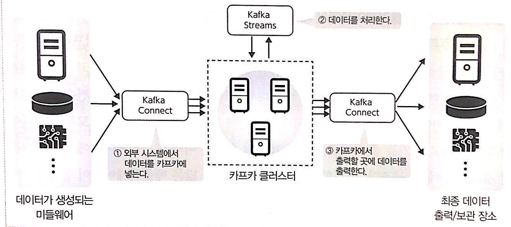

1. Kafka Connect를 이용하여 외부에서 카프카로 데이터를 송신한다.
2. Kafka Streams를 이용하여 필요한 데이터를 처리하고 처리 결과를 카프카에게 전송한다.
3. Kafka Streams를 이용하여 연계 시스템에 데이터를 출력한다.

## 데이터 파이프라인에서 취급하는 데이터

### 데이터 파이프라인에서 처리 특성

**여러 미들웨어나 애플리케이션에서 데이터를 읽고 쓴다.**

여러 미들웨어나 애플리케이션에서 데이터를 읽고 쓴다는 것은 데이터 파이프라인의 특성이다. 카프카를 중심으로 하는 데이터 파이프라인에는 프로듀서와 컨슈머가 있고 프로듀서가 송신한 데이터를 컨슈머가 수신해 이용한다. 프로듀서 쪽이 출력하는 데이터와  컨슈머 쪽이 전제로 하는 데이터는 일관성이 있어야 한다. (스키마가 호환성을 지켜야한다)

**애플리케이션은 항상 실행 상태로 데이터를 처리한다.**

이것은 스트림 데이터나 스트림 처리의 특성이다. 스트림 데이터는 계속 생성되기 때문에 디이터를 수신하는 애플리케이션도 계속 처리 해야한다. 특히 다루는 데이터의 양이 많아지만 항상 파이프라인에 데이터가 흘러가므로 스트림 처리가 이루어지고 있는 상태가 된다.

이러한 데이터 파이프라인에서의 처리 방법은 파이프라인을 구성하는 기반이나 애플리케이션, 추깁하는 데이터를 설계할 때 고려해야 한다. 그 중에서도 많은 구성 요소에 영향을 미치는 3가지 요소를 소개한다.

1. 메시지 데이터 형태
2. 스키마 구조를 갖는 데이터 형태 및 스키마 에볼루션
3. 데이터 표현 방법

### 메시지 데이터 형태
카프카를 이용한 데이터 파이프라인에서는 카프카를 경우하여 메시지를 송수힌하는데, 이 메시지의 데이터 형태는 프로듀서와 컨슈머에서 불일치하지 않도록 해야한다.

메시지는 프로듀서에서 처리되고 데이터 파이프라인 안의 카프카 클러스터로 송신된다. 이 때 프로듀서에서 송신되는 메시지의 Key, Value 데이터 형태가 각각 프로듀서 애플리케이션에서 지정되고 데이터를 직렬화해서 송신한다. 그리고 컨슈머는 미리 프로듀서에서 보낸 메시지의 Key, Value 데이터 형태와 포함된 데이터를 감안하여 설계하고 구현해야 한다.


이 처럼 데이터를 송신하는 쪽과 데이터를 수신하는 쪽에서 데이터 형태가 일치 해야 한다는 것은 스트림 데이터를 다루는 곳에 국한된 것은 아니다.


컨슈머뿐만 아니라 송신하는 프로듀서에서도 매시지 데이터 형태에 주의가 필요하다. **따라서 컨슈머에서 보낸 메시지의 데이터 형태를 변경하려면 그에 해당하는 컨슈머도 변경해야 한다. 그러나 애플리케이션은 항상 데이터를 처리하고 있어 쉽게 중단시킬 수 없는 경우가 있다.**

이러한 데이터의 불일치를 방지하기 위해 데이터 형태나 관리나 향후 확장을 위한 변경 방법에 대해서는 스키마 구조를 갖는 데이터 형태를 이용하는 것도 좋은 대책 중 하나다.

### 스키마 구조를 갖는 데이터 형태
데이터 스트림과 스트림 처리에서는 JSON이나 Apache Avro와 같은 구조화된 데이터가 자주 사용된다. 여러 칼럼을 가진 스키마를 정의하여 하나의 메시지 안에 여러 값을 포함할 수 있게 된다.

### 스키마 에볼류션
애플리케이션 수정이나 기능 추가에 따라 정의를 변경해야 하는 경우가 많다. **스키마 정의를 운용 중 변경하는 것은 스키마 에볼루션 또는 스키마 진화라고 한다.**

데이터 파이프라인의 스티림 처리에서 계속적으로 발생하는 데이터를 처리하기 때문에 애플리케이션을 마음대로 중지시킬 수 없는 경우가 많다. 그러므로 **스키마 에볼루션에 동반하여 정지할 애플리케이션의 수나 정지 시간을 최소화해야 하는 경우가 많다** 다음은 스키마 호환성을 고려한 스키마 애볼루션의 예를 보여준다.


기존 칼럼을 변경하지 않고 새로운 칼럼을 추가하고 있다. 이 경우 스키마 정의를 변경한 후에도 기존 컨슈머 애플리케이션은 원하는 칼람에서 원하는 데이터를 얻을 수 있다. **한편 기존 칼람을 제거하거나, 데이터 형태가 변경될 경우 원래의 데이터 처리는 계속될수 없다.**


### 데이터 표현 방법
데이터 표현 방법이란 각 정보를 표현하는 방법을 의미한다. 예를 들어 날짜를 표현하는 경우에도 다양한 문자열 포멧이 있다. 이러한 정보를 데이터 파이프 안의 카프카에서 다룰 때는 올바른 데이터 형탤 직렬화하면 송신은 가능하지만 각각의 표현 방법에 맞는 처리가 필요해 데이터  활용에 방해될 수도 있다.

# 카프카 능숭하게 사용하기

## 컨슈머 그룹

### 컨슈머 그룹이란 ?
카프카에서는 컨슈머가 카프카 클러스테에서 메시지를 얻어 처리한다. **이때 컨슈머는 컨슈머 그룹이라 불리는 하나 이상의 컨슈머들로 이루어진 그룹으을 형성하여 메시지를 얻는다.** 컨슈머 그룹은 Group ID라는 ID로 구분된다. 

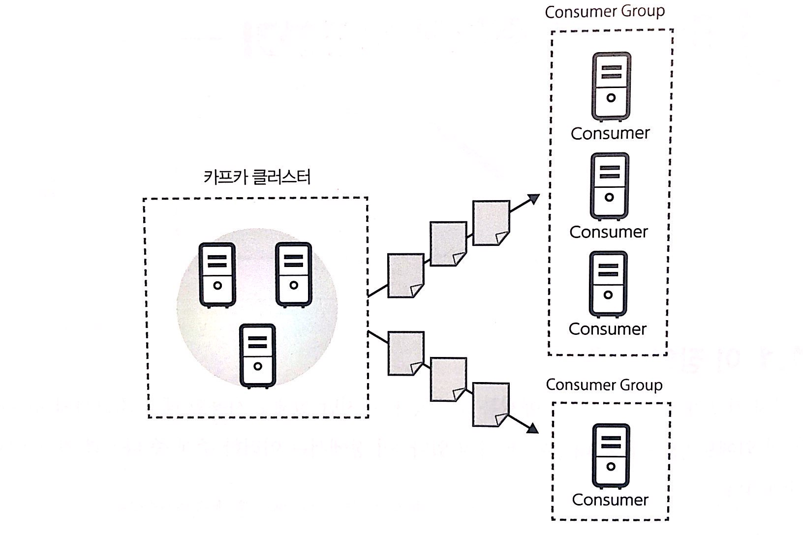
**컨슈머 그룹은 Group ID가 동일한 컨슈머끼리 형성된다.** 참고로 특정 컨슈머는 여러 컨슈머 그룹에 속하지 않고 항상 하나의 컨슈머 그룹에 속한다.

카프카 클러스터에서 수신할 메시지는 컨슈머 그룹 안에서 어느 하나의 컨슈머가 수신한다. 바꿔 말하면, **카프카 클러스터에서 수신할 메시지를 동일한 컨슈머 그룹에 속하는 컨슈머 사이에서 분산하여 수신한다.**

### 컨슈머에서 파티션 할당

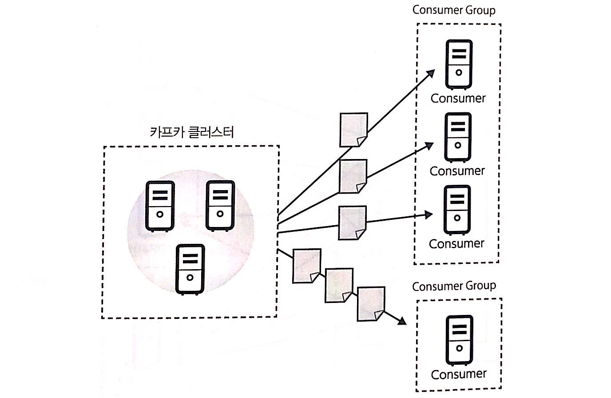

**어떤 메시지를 컨슈머 그룹의 어느 컨슈머가 수신하는가에 대한 할당은 수신할 토픽에 존재하는 파티션과 그룹 내 컨슈머를 매핑함으로써 가능하다.** 카프카 클러스터에서 다루는 메시지는 특정 토픽 중 특정 파티션에 반드시 포함된다. 메시지는 컨슈머 그룹에서 각 파티션에 매핑되는 컨슈머가 수신하게 된다.

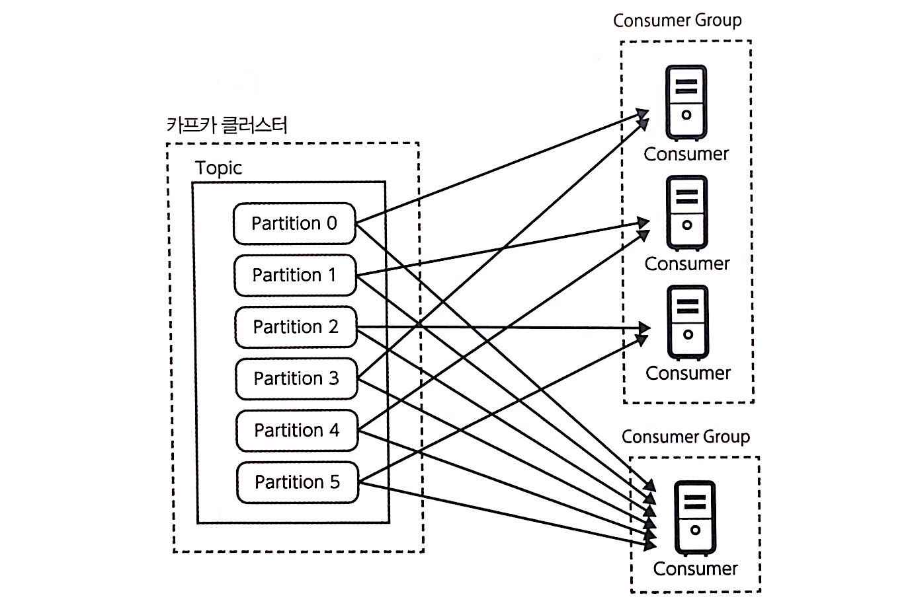

컨슈머와 파티션의 매핑은 각 파티션에 반드시 하나 이상의 컨슈머가 매핑된다. 반대로 파티션 수에 따라 하나의 컨슈머에 여러 파티션이 할당되는 경우가 있다. 특정 파티션에 기록되는 메시지는 매핑된 컨슈머가 처리하는 것으로 되어 있기 때문에 컨슈머 그룹 내의 특정 컨슈머가 반드시 처리하게 된다. 따라서 메시지를 수신하는 토픽의 파티션보다 컨슈머 쪽이 많은 경우 타티션이 할당되지 않은 컨슈머가 발생할 수 있다.

컨슈머 그룹에 새로운 컨슈머가 가입한 경우 필요에 따라 그때그때 결정된다. **이 결정은 컨슈머가 설정되어 있는 어사이너로직에 따라 실시된다.**

어사이너 | 클래스 | 할당 방법
-----|-----|------
RoundRobin | RoundRobinAssignor | 매핑할 파티션을 컨슈머에 하나씩 차례로 매핑 한다. | 
Range | RangeAssignor | 매핑할 파티션을 나열하고 컨슈머 수로 영역을 분할하여 할당한다.
Sticky | StickyAssignor | 최대한 균형있게 할당하고 재할당 시에는 원래의 매핑에서 변경되지 않도록 할당한다.

## 오프셋 커밋
카프카를 사용하는 시스템에서는 컨슈머가 카프카 클러스터에서 메시지를 얻어 처리한다. **이 때 컨슈머는 어느 메시지까지 처리를 완료했는지 카프카 클러스터에 기록을 남길수 있다.(정확하게는 다음 수신 및 처리해야할 메시지의 오프셋틀 기록한다.) 이 기록을 남기는 처리를 오프셋 커밀이라고 한다. 이 오프셋 커밋은 각 컨슈머가 카프카 클러스터에 기록을 요청함으로써 실행한다.** 이 오프셋 커밋은 각 컨슈머가 카프카 클러스터에 기록을 요청함으로써 실행한다.

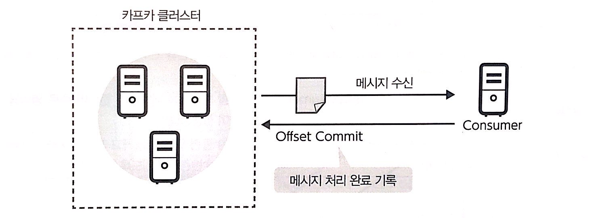

**오프셋 커밋의 기록은 컨슈머 그룹 단위로 이루어진다. 컨슈머 그룹 마다 각 토픽의 파티션에서 어느 오프셋까지 처리 완료 했는지 정보를 기록한다. 오프셋 커밋은 처리 완료 여부를 메시지마다 기록하는 것이 아니라 처리를 완료한 메시지 중에 최대의 오프셋을 기록하는 형태로 이루어진다.** 이것은 카프카가 임의로 메시지를 처리하는 것이 아니라 파티션 안의 메시지를 연속적으로 처리하는 것을 가정학 있기 때문이다.

오프셋 커밋 정보에 의해 컨슈머는 **카프카에서 메시지를 처리를 개재할 때 어던 메시지부터 재개해야 하는지 알 수 있다.** 여기서는 우지보수 등 계획된 정지에서 재개하는 것 외에도 **장애에 의한 비정상적인 정지에서의 재개도 포함된다.** 재개 후에 새로운 메시지만이 처리되므오써 처리되지 않은 메시지와 동일 메시지 재처리를 방지하거나 그 영향을 줄일 수 있다.

**커밋된 오프셋 정보는 `__consumer_offsets`라는 전용 토픽에 기록한다. 이 토픽은 일반 토픽 처럼 파티션과 복제본의 구조를 하고 있다. 이 메커니즘에 의해 카프카 클러스터는 오프셋 커밋 처리를 분산할 수 있이며, 여러 대의 브로커가 정지해도 데이터 손실 없이 처리할 수 있다.** 오프셋 커밋 방법에는 Auto Offset Commit, Manual Offset Commut 이 있다.

### 자동 오프셋 커밋 
자동 오프셋 커밋은 일정 간격마다 자동으로 오프셋 커밋을 하는 방식이다. 컨슈머의 옶션 `enable.auto.commit`을 true로 설정하여 사용할 수 있다. 오프셋 커밋의 간격은 `auto.commit.interval.ms`로 지정 할 수 있이며, 기본 값은 5초이다.

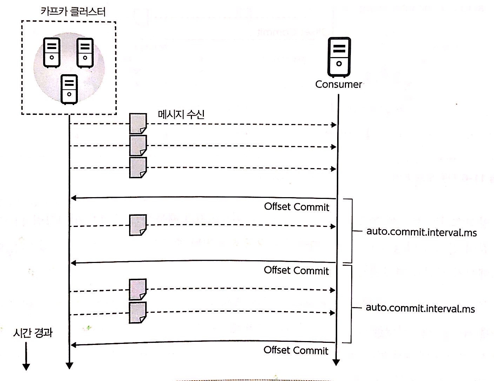

자동 오프펫 커밋의 장점은 컨슈머 애플리케이션에서 오프셋 커밋을 명시적으로 실시할 필요가 없다는 점이다. 수동 오프셋에서는 항상 오프셋 커밋을 처리를 해야 하지만 이 방법에서는 **그럴 필요가 없이 컨슈머 애플리케이션이 간결해진다. 반면 컨슈머에 장애가 발생했을 때 메시지가 손실되거나, 여러 메시지의 재처리(메시지 중복)가 발생할 수 있다는 단점이 있다.**

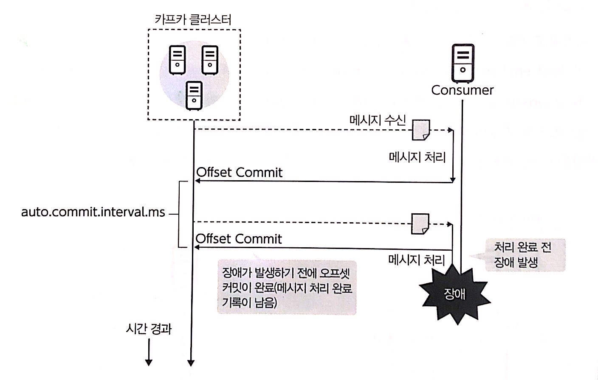

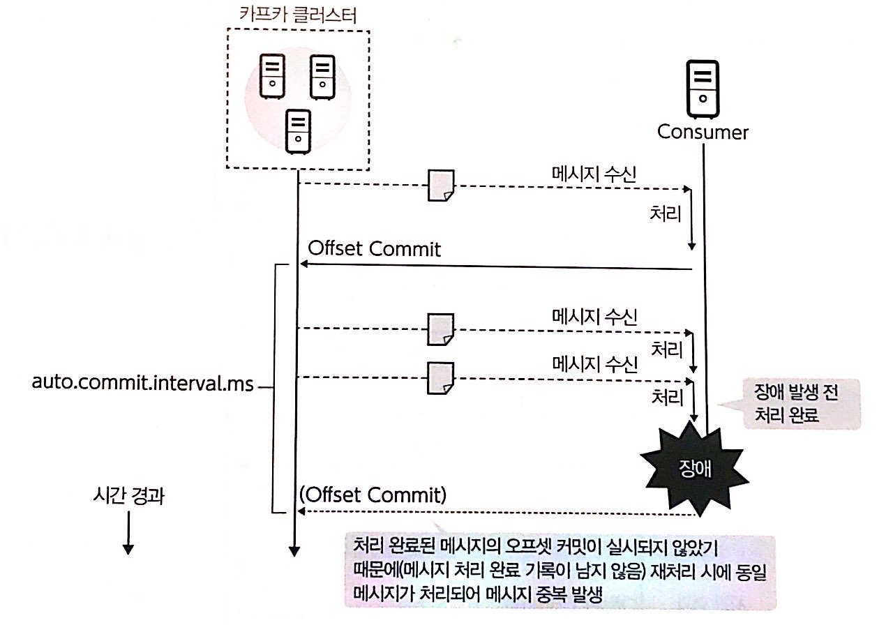

이 방식에서는 오프셋 커밋이 일정한 간격으로 이루어지기 때문에 장애가 발생한 타이밍에 따라 오프셋 커밋된 메시지가 처리가 완료되지 않거나 여러 메시지 처리가 완료됐지만 오프셋 커밋이 이루어지고 있지 않은 경우가 발생할 수 있다.

이 분에 전자는 장애가 발생했을 때 처리 중이던 메시지까지 오프셋 커밋이 이루어지고 있기 때문에 **처리를 재키시켰을 때 장애가 발생한 때의 메시지가 처리되지 않게 된다.** 후자는 **장애가 발생 시 처리가 완료된 여러 메시지에 대해 오프셋 커밋이 이루어 지지 않았으므로 처리를 재개했을 때 동일 메시지를 여러 번 처리하게 된다.**

### 수동 오프셋
수동 오프셋 커밋은 컨슈머 애플리케이션 안에서 Kafka Comsumer의 commitSync 또는 commitAsync라는 메서드를 이용하여 오프셋 커밋을 실행한다. 스트림 처리 프레임워크 등을 이용하고 있는 경우 이 메서드들을 직접 사용하지 않을 수도 있다.

수동 오프셋 커밋의 장점은 구조를 이해하고 적절히 사용함으로써 메시지 손실을 발생하지 않도록 할 수 있다는 점이다. 카프카 클러스터에서 메시지 취득 후 메시지 처리가 완료한 시점에서 커밋을 할 수 있다. 해당 메시지 처리는 완료되어 있기 때문에 메시지 손실이 발생하지 않는다.

또한 수동 오프셋 커밋에서 컨슈머 장애가 발생 시 메시지 중복을 최소화 할 수 있다. **자동 오프셋 커밋에서 컨슈머 장애 발생 시에 여러 메시지가 커밋되지 않은 경우가 있으며 그로 인하여 여러 메시지의 중복이 발생한다.** **수동 오프셋 커밋에서는 장애가 발생 했을 때 처리 중에 메세지의 붕복 가능성이 남아 있지만, 이미 처리 완료된 메시지를 포함한 메시지 중복을 피할 수 있다.**

단 메시지 양에 따라 다르지만 수동 오프셋 커밋이 자주 커밋 처리를 실시하므로 카프카 클러스터 부하가 높아진 다는 점에는 주의가 필요 하다.

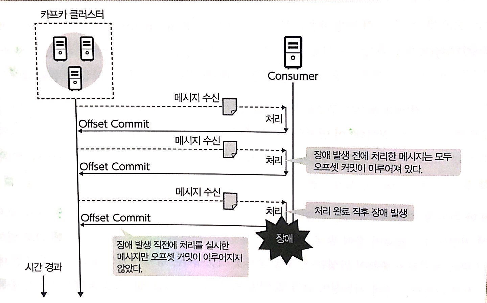

* 수동 오프셋 커밋으로는 메시지를 처리 완료할 때마다 오프셋 커밋을 실시 한다.

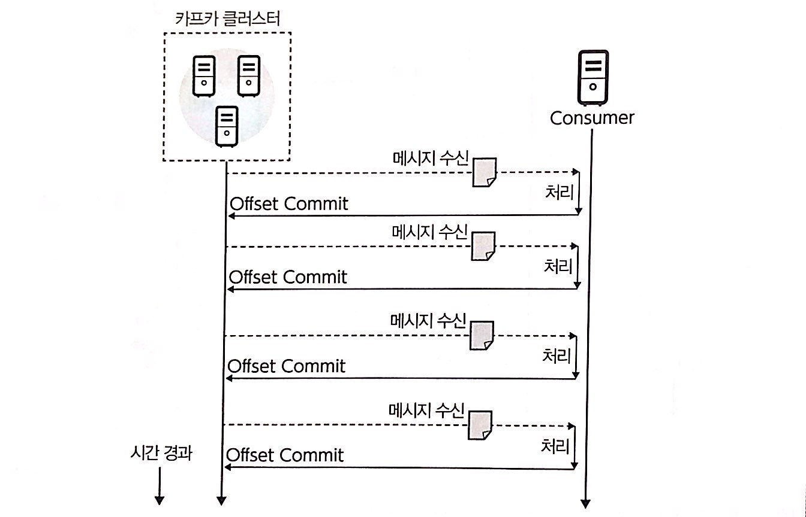
* 컨슈머 장애 발생 시 수동 오프셋 터밋의 영향

카프카에서 송신된 모든 메시지는 반드시 1회 이상 컨슈머에서 수신되는 것을 보장한다는 뜻이다. 카프카의 이러한 성질을 `At Least Once` 라고 한다.

### 자동 오프셋 리셋
오프셋 커밋 정보를 참조하여 메시지 처리를 시작할 오프셋을 결정한다. **그러나 시작할 때 오프셋 커밋 기록이 존재하지 않는 경우나 기록되어 있는 오프셋이 유효하지 않은 경우는 지정된 정책에 따라 초기화를 실시하여 메시지 처리할 오프셋을 결정 한다. 이 초기화 처리를 자동 오프셋 리셋 이라고 한다.**

정책 | 자동 오프셋 리셋의 동작
---|--------------
latest | 해당 파티션의 가장 새로운 오프셋으로 초기화된다. 따라서 카프카 클러스터에서 이미 존재하는 메시지는 처리되지 않는다.
earliest | 해당 파티션에 존재하는 가장 오래된 오프셋으로 치기화된다. 카프카 클러스터에 이미 존재하는 메시지 모두에 대해 처리를 실시한다.
none | 유효한 오프셋 커밋 정보가 없는 경우 예외가 발생한다.

## 파티션 재배치
**카프카에서의 파티션은 하나 이상의 복제본을 가지며, 카프카 클러스터 중 어느 하나의 브로커에 보관되어 있다.** 일반적으로 복제본은 작성된 때 배치된 브로커에서 계속 보관되지만 특정 이유로 배치를 변경하고 싶은 경우가 있다.

**본제본의 배치를 변경하는 주된 이유는 카프카 클러스터의 브로커를 증감시키는 경우다. 카프카에서 계획적인 정지나 장애로 인한 정지를 불문하고 브로커가 보유하고 있던 보제본이 다른 브로커로 자동으로 이동되지 않는다.**

**브로커를 추가하여 클러스터를 확장시킬 경우에도 새로 추가한 브로커에 복제본을 배치하여 메시지의 송수신 부하를 균등하게 배분해야 한다. 이렇게 파티션 각 복제본을 임의의 브로커에 재배치하는 작업을 파티션 재배치라고 한다.**


```
/usr/local/kafka/bin/kafka-topics.sh --zookeeper peter-zk001:2181/peter-kafka --replication-factor 1 --partitions 1 --topic peter-topic --create
```

```
/usr/local/kafka/bin/kafka-topics.sh --zookeeper peter-zk001:2181/peter-kafka --topic peter-topic --delete
```

```
/usr/local/kafka/bin/kafka-console-producer.sh --broker-list localhost:9092 --topic yun
```

```
/usr/local/kafka/bin/kafka-console-consumer.sh --bootstrap-server localhost:9092 --topic yun --from-beginning
```


```
tickTime=2000
dataDir=$ZK_DATA_DIR
clientPort=2181
initLimit=5
syncLimit=2

### HOSTS
#server.1=zk-1:2888:3888
#server.2=zk-2:2888:3888
#server.3=zk3:2888:3888
```


```
[Unit] 
Description=ZooKeeper Service 
Documentation=http://zookeeper.apache.org 
Requires=network.target 
After=network.target 

[Service]
Type=forking 
User=root 
Group=root 
SyslogIdentifier=zookeeper
WorkingDirectory=/usr/local/zookeeper
RestartSec=0s
Restart=always
ExecStart=/usr/local/zookeeper/bin/zkServer.sh start /usr/local/zookeeper/conf/zoo.cfg
ExecStop=/usr/local/zookeeper/bin/zkServer.sh stop /usr/local/zookeeper/conf/zoo.cfg
ExecReload=/usr/local/zookeeper/bin/zkServer.sh restart /usr/local/zookeeper/conf/zoo.cfg

[Install] 
WantedBy=default.target
```


```
$ cd /usr/local
$ wget http://mirror.navercorp.com/apache/kafka/2.3.1/kafka_2.12-2.3.1.tgz
$ ln -s kafka_2.12-2.3.1 kafka
$ sudo mkdir -p $/usr/local/lib/kafka/data/kafka-logs

```

"PLAINTEXT://localhost:9092"


offsets.topic.replication.factor


export KAFKA_HOME=$PWD 
export KAFKA_DATA_DIR=/usr/local/lib/kafka/data 
export KAFKA_BROKER_ID=1 
export KAFKA_ZK_CONNECT=localhost:2181 
export KAFKA_OFFSETS_TOPIC_REPLICATION_FACTOR=1 
export KAFKA_ADVERTISED_LISTENERS="PLAINTEXT://localhost:9092"


[Unit]
Description=kafka-server 
After=network.target

[Service]
Type=simple
User=root
Group=root
SyslogIdentifier=kafka-server
WorkingDirectory=/usr/local/kafka
Restart=no
RestartSec=0s
ExecStart=/usr/local/kafka/bin/kafka-server-start.sh /usr/local/kafka/config/server.properties
ExecStop=/usr/local/kafka/bin/kafka-server-stop.sh

[Install]
WantedBy=multi-user.target