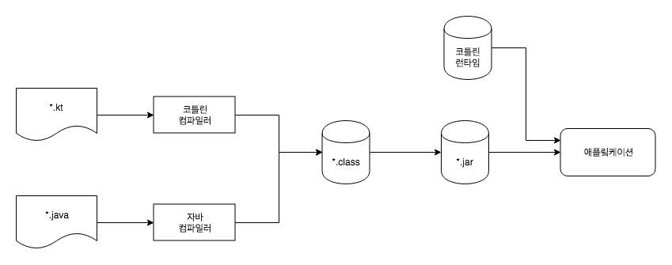

> 해당 글은 [Kotlin in Action](http://www.yes24.com/Product/Goods/55148593?Acode=101)을 정리한 내용입니다.

# 목차
- [목차](#%eb%aa%a9%ec%b0%a8)
- [01 코틀린이란 무엇이며 왜 필요한가 ?](#01-%ec%bd%94%ed%8b%80%eb%a6%b0%ec%9d%b4%eb%9e%80-%eb%ac%b4%ec%97%87%ec%9d%b4%eb%a9%b0-%ec%99%9c-%ed%95%84%ec%9a%94%ed%95%9c%ea%b0%80)
  - [정적 타입 지정 언어](#%ec%a0%95%ec%a0%81-%ed%83%80%ec%9e%85-%ec%a7%80%ec%a0%95-%ec%96%b8%ec%96%b4)
  - [간결성](#%ea%b0%84%ea%b2%b0%ec%84%b1)
  - [안전성](#%ec%95%88%ec%a0%84%ec%84%b1)
  - [코틀린 빌드 과정](#%ec%bd%94%ed%8b%80%eb%a6%b0-%eb%b9%8c%eb%93%9c-%ea%b3%bc%ec%a0%95)
- [02 코틀린 기초](#02-%ec%bd%94%ed%8b%80%eb%a6%b0-%ea%b8%b0%ec%b4%88)
  - [변수](#%eb%b3%80%ec%88%98)
  - [문자열 템플릿](#%eb%ac%b8%ec%9e%90%ec%97%b4-%ed%85%9c%ed%94%8c%eb%a6%bf)
  - [클래스와 프로퍼티](#%ed%81%b4%eb%9e%98%ec%8a%a4%ec%99%80-%ed%94%84%eb%a1%9c%ed%8d%bc%ed%8b%b0)
    - [프로퍼티](#%ed%94%84%eb%a1%9c%ed%8d%bc%ed%8b%b0)
    - [커스텀 접근자](#%ec%bb%a4%ec%8a%a4%ed%85%80-%ec%a0%91%ea%b7%bc%ec%9e%90)
  - [선택 표현과 처리: enum, when](#%ec%84%a0%ed%83%9d-%ed%91%9c%ed%98%84%ea%b3%bc-%ec%b2%98%eb%a6%ac-enum-when)
    - [enum 클래스](#enum-%ed%81%b4%eb%9e%98%ec%8a%a4)
    - [when으로 enum 클래스 다루기](#when%ec%9c%bc%eb%a1%9c-enum-%ed%81%b4%eb%9e%98%ec%8a%a4-%eb%8b%a4%eb%a3%a8%ea%b8%b0)
    - [when과 임이의 객체를 함께 사용](#when%ea%b3%bc-%ec%9e%84%ec%9d%b4%ec%9d%98-%ea%b0%9d%ec%b2%b4%eb%a5%bc-%ed%95%a8%ea%bb%98-%ec%82%ac%ec%9a%a9)
    - [스마트 캐스트: 타입 검사와 타입 캐스트를 조합](#%ec%8a%a4%eb%a7%88%ed%8a%b8-%ec%ba%90%ec%8a%a4%ed%8a%b8-%ed%83%80%ec%9e%85-%ea%b2%80%ec%82%ac%ec%99%80-%ed%83%80%ec%9e%85-%ec%ba%90%ec%8a%a4%ed%8a%b8%eb%a5%bc-%ec%a1%b0%ed%95%a9)
  - [대상을 이터레이션: while과 for 루프](#%eb%8c%80%ec%83%81%ec%9d%84-%ec%9d%b4%ed%84%b0%eb%a0%88%ec%9d%b4%ec%85%98-while%ea%b3%bc-for-%eb%a3%a8%ed%94%84)
    - [수에 대한 이터레이션: 범위와 수열](#%ec%88%98%ec%97%90-%eb%8c%80%ed%95%9c-%ec%9d%b4%ed%84%b0%eb%a0%88%ec%9d%b4%ec%85%98-%eb%b2%94%ec%9c%84%ec%99%80-%ec%88%98%ec%97%b4)
    - [맵에 대한 이터레이션](#%eb%a7%b5%ec%97%90-%eb%8c%80%ed%95%9c-%ec%9d%b4%ed%84%b0%eb%a0%88%ec%9d%b4%ec%85%98)
    - [in으로 컬렉션이나 범위의 원소 검사](#in%ec%9c%bc%eb%a1%9c-%ec%bb%ac%eb%a0%89%ec%85%98%ec%9d%b4%eb%82%98-%eb%b2%94%ec%9c%84%ec%9d%98-%ec%9b%90%ec%86%8c-%ea%b2%80%ec%82%ac)
  - [코틀린의 예외 처리](#%ec%bd%94%ed%8b%80%eb%a6%b0%ec%9d%98-%ec%98%88%ec%99%b8-%ec%b2%98%eb%a6%ac)
    - [try, catch, finally](#try-catch-finally)
  - [try를 식으로 사용](#try%eb%a5%bc-%ec%8b%9d%ec%9c%bc%eb%a1%9c-%ec%82%ac%ec%9a%a9)
- [03 함수 정의와 호출](#03-%ed%95%a8%ec%88%98-%ec%a0%95%ec%9d%98%ec%99%80-%ed%98%b8%ec%b6%9c)
  - [코틀린에서 컬렉션 만들기](#%ec%bd%94%ed%8b%80%eb%a6%b0%ec%97%90%ec%84%9c-%ec%bb%ac%eb%a0%89%ec%85%98-%eb%a7%8c%eb%93%a4%ea%b8%b0)
  - [함수를 호출해서 쉽게 만들기](#%ed%95%a8%ec%88%98%eb%a5%bc-%ed%98%b8%ec%b6%9c%ed%95%b4%ec%84%9c-%ec%89%bd%ea%b2%8c-%eb%a7%8c%eb%93%a4%ea%b8%b0)
  - [디폴트 파라미터 값](#%eb%94%94%ed%8f%b4%ed%8a%b8-%ed%8c%8c%eb%9d%bc%eb%af%b8%ed%84%b0-%ea%b0%92)
  - [메서드를 다른 클래스에 추가: 확장 함수와 확장 프로퍼티](#%eb%a9%94%ec%84%9c%eb%93%9c%eb%a5%bc-%eb%8b%a4%eb%a5%b8-%ed%81%b4%eb%9e%98%ec%8a%a4%ec%97%90-%ec%b6%94%ea%b0%80-%ed%99%95%ec%9e%a5-%ed%95%a8%ec%88%98%ec%99%80-%ed%99%95%ec%9e%a5-%ed%94%84%eb%a1%9c%ed%8d%bc%ed%8b%b0)
    - [확장 함수로 유틸리티 함수 정의](#%ed%99%95%ec%9e%a5-%ed%95%a8%ec%88%98%eb%a1%9c-%ec%9c%a0%ed%8b%b8%eb%a6%ac%ed%8b%b0-%ed%95%a8%ec%88%98-%ec%a0%95%ec%9d%98)
  - [코드 다듬기: 로컬 함수와 확장](#%ec%bd%94%eb%93%9c-%eb%8b%a4%eb%93%ac%ea%b8%b0-%eb%a1%9c%ec%bb%ac-%ed%95%a8%ec%88%98%ec%99%80-%ed%99%95%ec%9e%a5)
- [04 클래스, 객체, 인터페이스](#04-%ed%81%b4%eb%9e%98%ec%8a%a4-%ea%b0%9d%ec%b2%b4-%ec%9d%b8%ed%84%b0%ed%8e%98%ec%9d%b4%ec%8a%a4)
  - [클래스 계층 정의](#%ed%81%b4%eb%9e%98%ec%8a%a4-%ea%b3%84%ec%b8%b5-%ec%a0%95%ec%9d%98)
    - [코틀린 인터페이스](#%ec%bd%94%ed%8b%80%eb%a6%b0-%ec%9d%b8%ed%84%b0%ed%8e%98%ec%9d%b4%ec%8a%a4)
    - [open, final, abstract 변경자: 기본적으로 final](#open-final-abstract-%eb%b3%80%ea%b2%bd%ec%9e%90-%ea%b8%b0%eb%b3%b8%ec%a0%81%ec%9c%bc%eb%a1%9c-final)
    - [가시성 변경자: 기본적으로 공개](#%ea%b0%80%ec%8b%9c%ec%84%b1-%eb%b3%80%ea%b2%bd%ec%9e%90-%ea%b8%b0%eb%b3%b8%ec%a0%81%ec%9c%bc%eb%a1%9c-%ea%b3%b5%ea%b0%9c)
    - [내부 클래스와 중첩된 클래스: 기본적으로 중첩 클래스](#%eb%82%b4%eb%b6%80-%ed%81%b4%eb%9e%98%ec%8a%a4%ec%99%80-%ec%a4%91%ec%b2%a9%eb%90%9c-%ed%81%b4%eb%9e%98%ec%8a%a4-%ea%b8%b0%eb%b3%b8%ec%a0%81%ec%9c%bc%eb%a1%9c-%ec%a4%91%ec%b2%a9-%ed%81%b4%eb%9e%98%ec%8a%a4)
    - [봉인된 클래스 계층 정의 시 계층 확장 제한](#%eb%b4%89%ec%9d%b8%eb%90%9c-%ed%81%b4%eb%9e%98%ec%8a%a4-%ea%b3%84%ec%b8%b5-%ec%a0%95%ec%9d%98-%ec%8b%9c-%ea%b3%84%ec%b8%b5-%ed%99%95%ec%9e%a5-%ec%a0%9c%ed%95%9c)
  - [뻔하지 않은 생성자와 프로퍼티를 갖는 클래스 선언](#%eb%bb%94%ed%95%98%ec%a7%80-%ec%95%8a%ec%9d%80-%ec%83%9d%ec%84%b1%ec%9e%90%ec%99%80-%ed%94%84%eb%a1%9c%ed%8d%bc%ed%8b%b0%eb%a5%bc-%ea%b0%96%eb%8a%94-%ed%81%b4%eb%9e%98%ec%8a%a4-%ec%84%a0%ec%96%b8)
    - [클래스 초기화: 주 생성자와 초기화 블록](#%ed%81%b4%eb%9e%98%ec%8a%a4-%ec%b4%88%ea%b8%b0%ed%99%94-%ec%a3%bc-%ec%83%9d%ec%84%b1%ec%9e%90%ec%99%80-%ec%b4%88%ea%b8%b0%ed%99%94-%eb%b8%94%eb%a1%9d)
    - [게터와 세터에서 뒷받침하는 필드에 접근](#%ea%b2%8c%ed%84%b0%ec%99%80-%ec%84%b8%ed%84%b0%ec%97%90%ec%84%9c-%eb%92%b7%eb%b0%9b%ec%b9%a8%ed%95%98%eb%8a%94-%ed%95%84%eb%93%9c%ec%97%90-%ec%a0%91%ea%b7%bc)
    - [접근자의 가시성 변경](#%ec%a0%91%ea%b7%bc%ec%9e%90%ec%9d%98-%ea%b0%80%ec%8b%9c%ec%84%b1-%eb%b3%80%ea%b2%bd)
  - [컴파일러가 생성한 메서드: 데이터 클래스와 클래스 위임](#%ec%bb%b4%ed%8c%8c%ec%9d%bc%eb%9f%ac%ea%b0%80-%ec%83%9d%ec%84%b1%ed%95%9c-%eb%a9%94%ec%84%9c%eb%93%9c-%eb%8d%b0%ec%9d%b4%ed%84%b0-%ed%81%b4%eb%9e%98%ec%8a%a4%ec%99%80-%ed%81%b4%eb%9e%98%ec%8a%a4-%ec%9c%84%ec%9e%84)
    - [모든 클래스가 정의해야 하는 메서드](#%eb%aa%a8%eb%93%a0-%ed%81%b4%eb%9e%98%ec%8a%a4%ea%b0%80-%ec%a0%95%ec%9d%98%ed%95%b4%ec%95%bc-%ed%95%98%eb%8a%94-%eb%a9%94%ec%84%9c%eb%93%9c)
      - [문자열 표현: toString()](#%eb%ac%b8%ec%9e%90%ec%97%b4-%ed%91%9c%ed%98%84-tostring)
      - [객체의 동등성: equals()](#%ea%b0%9d%ec%b2%b4%ec%9d%98-%eb%8f%99%eb%93%b1%ec%84%b1-equals)
      - [해시 컨테이너: hashCode()](#%ed%95%b4%ec%8b%9c-%ec%bb%a8%ed%85%8c%ec%9d%b4%eb%84%88-hashcode)
  - [데이터 클래스: 모든클래스가 정의해아 하는 메서드 자동 생성](#%eb%8d%b0%ec%9d%b4%ed%84%b0-%ed%81%b4%eb%9e%98%ec%8a%a4-%eb%aa%a8%eb%93%a0%ed%81%b4%eb%9e%98%ec%8a%a4%ea%b0%80-%ec%a0%95%ec%9d%98%ed%95%b4%ec%95%84-%ed%95%98%eb%8a%94-%eb%a9%94%ec%84%9c%eb%93%9c-%ec%9e%90%eb%8f%99-%ec%83%9d%ec%84%b1)
  - [클래스 위임: by 키워드 사용](#%ed%81%b4%eb%9e%98%ec%8a%a4-%ec%9c%84%ec%9e%84-by-%ed%82%a4%ec%9b%8c%eb%93%9c-%ec%82%ac%ec%9a%a9)
  - [object 키워드: 클래스 선언과 인스턴스 생성](#object-%ed%82%a4%ec%9b%8c%eb%93%9c-%ed%81%b4%eb%9e%98%ec%8a%a4-%ec%84%a0%ec%96%b8%ea%b3%bc-%ec%9d%b8%ec%8a%a4%ed%84%b4%ec%8a%a4-%ec%83%9d%ec%84%b1)
    - [객체 선언: 싱글턴 쉡게 만들기](#%ea%b0%9d%ec%b2%b4-%ec%84%a0%ec%96%b8-%ec%8b%b1%ea%b8%80%ed%84%b4-%ec%89%a1%ea%b2%8c-%eb%a7%8c%eb%93%a4%ea%b8%b0)
    - [동반 객체: 팩토리 메서드와 정적 멤버가 들어갈 장소](#%eb%8f%99%eb%b0%98-%ea%b0%9d%ec%b2%b4-%ed%8c%a9%ed%86%a0%eb%a6%ac-%eb%a9%94%ec%84%9c%eb%93%9c%ec%99%80-%ec%a0%95%ec%a0%81-%eb%a9%a4%eb%b2%84%ea%b0%80-%eb%93%a4%ec%96%b4%ea%b0%88-%ec%9e%a5%ec%86%8c)
    - [동반 객체를 일반 객체 처럼 사용](#%eb%8f%99%eb%b0%98-%ea%b0%9d%ec%b2%b4%eb%a5%bc-%ec%9d%bc%eb%b0%98-%ea%b0%9d%ec%b2%b4-%ec%b2%98%eb%9f%bc-%ec%82%ac%ec%9a%a9)
      - [동반 객체에서 인터페이스 구현](#%eb%8f%99%eb%b0%98-%ea%b0%9d%ec%b2%b4%ec%97%90%ec%84%9c-%ec%9d%b8%ed%84%b0%ed%8e%98%ec%9d%b4%ec%8a%a4-%ea%b5%ac%ed%98%84)
      - [동반 객체 확장](#%eb%8f%99%eb%b0%98-%ea%b0%9d%ec%b2%b4-%ed%99%95%ec%9e%a5)
    - [객체 식: 무명 내부 클래스를 다른 방식으로 작성](#%ea%b0%9d%ec%b2%b4-%ec%8b%9d-%eb%ac%b4%eb%aa%85-%eb%82%b4%eb%b6%80-%ed%81%b4%eb%9e%98%ec%8a%a4%eb%a5%bc-%eb%8b%a4%eb%a5%b8-%eb%b0%a9%ec%8b%9d%ec%9c%bc%eb%a1%9c-%ec%9e%91%ec%84%b1)
- [05 람다로 프로그래밍](#05-%eb%9e%8c%eb%8b%a4%eb%a1%9c-%ed%94%84%eb%a1%9c%ea%b7%b8%eb%9e%98%eb%b0%8d)
  - [람다 식과 멤버 참조](#%eb%9e%8c%eb%8b%a4-%ec%8b%9d%ea%b3%bc-%eb%a9%a4%eb%b2%84-%ec%b0%b8%ec%a1%b0)
    - [람다 소개: 코드 블록을 함수 인자로 넘기기](#%eb%9e%8c%eb%8b%a4-%ec%86%8c%ea%b0%9c-%ec%bd%94%eb%93%9c-%eb%b8%94%eb%a1%9d%ec%9d%84-%ed%95%a8%ec%88%98-%ec%9d%b8%ec%9e%90%eb%a1%9c-%eb%84%98%ea%b8%b0%ea%b8%b0)
    - [람다와 컬렉션](#%eb%9e%8c%eb%8b%a4%ec%99%80-%ec%bb%ac%eb%a0%89%ec%85%98)
    - [람다 식의 문법](#%eb%9e%8c%eb%8b%a4-%ec%8b%9d%ec%9d%98-%eb%ac%b8%eb%b2%95)
      - [람다 파라미터 타입 제거하기](#%eb%9e%8c%eb%8b%a4-%ed%8c%8c%eb%9d%bc%eb%af%b8%ed%84%b0-%ed%83%80%ec%9e%85-%ec%a0%9c%ea%b1%b0%ed%95%98%ea%b8%b0)
    - [현재 영역에 있는 변수에 접근](#%ed%98%84%ec%9e%ac-%ec%98%81%ec%97%ad%ec%97%90-%ec%9e%88%eb%8a%94-%eb%b3%80%ec%88%98%ec%97%90-%ec%a0%91%ea%b7%bc)
      - [함수 파라미터를 람다 안에서 사용하기](#%ed%95%a8%ec%88%98-%ed%8c%8c%eb%9d%bc%eb%af%b8%ed%84%b0%eb%a5%bc-%eb%9e%8c%eb%8b%a4-%ec%95%88%ec%97%90%ec%84%9c-%ec%82%ac%ec%9a%a9%ed%95%98%ea%b8%b0)
        - [변경 가능한 변수 포획하기: 자세한 구현 방법](#%eb%b3%80%ea%b2%bd-%ea%b0%80%eb%8a%a5%ed%95%9c-%eb%b3%80%ec%88%98-%ed%8f%ac%ed%9a%8d%ed%95%98%ea%b8%b0-%ec%9e%90%ec%84%b8%ed%95%9c-%ea%b5%ac%ed%98%84-%eb%b0%a9%eb%b2%95)
    - [멤버 참조](#%eb%a9%a4%eb%b2%84-%ec%b0%b8%ec%a1%b0)
  - [컬렉션 함수형 API](#%ec%bb%ac%eb%a0%89%ec%85%98-%ed%95%a8%ec%88%98%ed%98%95-api)
- [06 코틀린 타입 시스템](#06-%ec%bd%94%ed%8b%80%eb%a6%b0-%ed%83%80%ec%9e%85-%ec%8b%9c%ec%8a%a4%ed%85%9c)
  - [널 가능성](#%eb%84%90-%ea%b0%80%eb%8a%a5%ec%84%b1)
    - [널이 될수 있는 타입](#%eb%84%90%ec%9d%b4-%eb%90%a0%ec%88%98-%ec%9e%88%eb%8a%94-%ed%83%80%ec%9e%85)
    - [타입의 의미](#%ed%83%80%ec%9e%85%ec%9d%98-%ec%9d%98%eb%af%b8)
    - [안전한 호출 연산자 : ?.](#%ec%95%88%ec%a0%84%ed%95%9c-%ed%98%b8%ec%b6%9c-%ec%97%b0%ec%82%b0%ec%9e%90)
    - [엘비스 연산자 : ?:](#%ec%97%98%eb%b9%84%ec%8a%a4-%ec%97%b0%ec%82%b0%ec%9e%90)
    - [안전한 캐스트: as?](#%ec%95%88%ec%a0%84%ed%95%9c-%ec%ba%90%ec%8a%a4%ed%8a%b8-as)
    - [널아님 단언: !!](#%eb%84%90%ec%95%84%eb%8b%98-%eb%8b%a8%ec%96%b8)
    - [let 함수](#let-%ed%95%a8%ec%88%98)
  - [나중에 초기화할 프로퍼티](#%eb%82%98%ec%a4%91%ec%97%90-%ec%b4%88%ea%b8%b0%ed%99%94%ed%95%a0-%ed%94%84%eb%a1%9c%ed%8d%bc%ed%8b%b0)
    - [널이 될 수 있는 타입 확장](#%eb%84%90%ec%9d%b4-%eb%90%a0-%ec%88%98-%ec%9e%88%eb%8a%94-%ed%83%80%ec%9e%85-%ed%99%95%ec%9e%a5)
    - [타입 파라미터의 널 가능성](#%ed%83%80%ec%9e%85-%ed%8c%8c%eb%9d%bc%eb%af%b8%ed%84%b0%ec%9d%98-%eb%84%90-%ea%b0%80%eb%8a%a5%ec%84%b1)
    - [널 가능성과 자바](#%eb%84%90-%ea%b0%80%eb%8a%a5%ec%84%b1%ea%b3%bc-%ec%9e%90%eb%b0%94)
      - [상속](#%ec%83%81%ec%86%8d)
  - [코틀린의 원시 타입](#%ec%bd%94%ed%8b%80%eb%a6%b0%ec%9d%98-%ec%9b%90%ec%8b%9c-%ed%83%80%ec%9e%85)
    - [원시 타입: Int, Boolean](#%ec%9b%90%ec%8b%9c-%ed%83%80%ec%9e%85-int-boolean)
    - [널이 될 수 잇는 원시 타입: Int?, Boolean? 등](#%eb%84%90%ec%9d%b4-%eb%90%a0-%ec%88%98-%ec%9e%87%eb%8a%94-%ec%9b%90%ec%8b%9c-%ed%83%80%ec%9e%85-int-boolean-%eb%93%b1)
    - [숫자 변환](#%ec%88%ab%ec%9e%90-%eb%b3%80%ed%99%98)
    - [Any, Any?: 최상위 타입](#any-any-%ec%b5%9c%ec%83%81%ec%9c%84-%ed%83%80%ec%9e%85)
    - [Unit 타입: 코틀린의 void](#unit-%ed%83%80%ec%9e%85-%ec%bd%94%ed%8b%80%eb%a6%b0%ec%9d%98-void)
    - [Nothing 타입 : 이 함수는 결코 정상적으로 끝나지 않는다.](#nothing-%ed%83%80%ec%9e%85--%ec%9d%b4-%ed%95%a8%ec%88%98%eb%8a%94-%ea%b2%b0%ec%bd%94-%ec%a0%95%ec%83%81%ec%a0%81%ec%9c%bc%eb%a1%9c-%eb%81%9d%eb%82%98%ec%a7%80-%ec%95%8a%eb%8a%94%eb%8b%a4)
  - [컬렉션과 배열](#%ec%bb%ac%eb%a0%89%ec%85%98%ea%b3%bc-%eb%b0%b0%ec%97%b4)
    - [널 가능성과 컬렉션](#%eb%84%90-%ea%b0%80%eb%8a%a5%ec%84%b1%ea%b3%bc-%ec%bb%ac%eb%a0%89%ec%85%98)
    - [읽기 전용과 변경 가능한 컬렉션](#%ec%9d%bd%ea%b8%b0-%ec%a0%84%ec%9a%a9%ea%b3%bc-%eb%b3%80%ea%b2%bd-%ea%b0%80%eb%8a%a5%ed%95%9c-%ec%bb%ac%eb%a0%89%ec%85%98)
- [07 연산자 오버로딩과 기타 관례](#07-%ec%97%b0%ec%82%b0%ec%9e%90-%ec%98%a4%eb%b2%84%eb%a1%9c%eb%94%a9%ea%b3%bc-%ea%b8%b0%ed%83%80-%ea%b4%80%eb%a1%80)
  - [산술 연산자 오버로딩](#%ec%82%b0%ec%88%a0-%ec%97%b0%ec%82%b0%ec%9e%90-%ec%98%a4%eb%b2%84%eb%a1%9c%eb%94%a9)
    - [코틀린 이항 연산자에 사응하는 함수 이름표](#%ec%bd%94%ed%8b%80%eb%a6%b0-%ec%9d%b4%ed%95%ad-%ec%97%b0%ec%82%b0%ec%9e%90%ec%97%90-%ec%82%ac%ec%9d%91%ed%95%98%eb%8a%94-%ed%95%a8%ec%88%98-%ec%9d%b4%eb%a6%84%ed%91%9c)
    - [오버로딩할 수 있는 단항 연술 연산자표](#%ec%98%a4%eb%b2%84%eb%a1%9c%eb%94%a9%ed%95%a0-%ec%88%98-%ec%9e%88%eb%8a%94-%eb%8b%a8%ed%95%ad-%ec%97%b0%ec%88%a0-%ec%97%b0%ec%82%b0%ec%9e%90%ed%91%9c)
  - [비교 연산자 오버로딩](#%eb%b9%84%ea%b5%90-%ec%97%b0%ec%82%b0%ec%9e%90-%ec%98%a4%eb%b2%84%eb%a1%9c%eb%94%a9)
    - [동등성 연산자: equals](#%eb%8f%99%eb%93%b1%ec%84%b1-%ec%97%b0%ec%82%b0%ec%9e%90-equals)
    - [순서 연산자: compareTo](#%ec%88%9c%ec%84%9c-%ec%97%b0%ec%82%b0%ec%9e%90-compareto)
- [09 제네릭스](#09-%ec%a0%9c%eb%84%a4%eb%a6%ad%ec%8a%a4)
  - [제니릭 타입 파라미터](#%ec%a0%9c%eb%8b%88%eb%a6%ad-%ed%83%80%ec%9e%85-%ed%8c%8c%eb%9d%bc%eb%af%b8%ed%84%b0)
    - [제니릭 함수와 프로퍼티](#%ec%a0%9c%eb%8b%88%eb%a6%ad-%ed%95%a8%ec%88%98%ec%99%80-%ed%94%84%eb%a1%9c%ed%8d%bc%ed%8b%b0)
    - [타입 파라미터 제약](#%ed%83%80%ec%9e%85-%ed%8c%8c%eb%9d%bc%eb%af%b8%ed%84%b0-%ec%a0%9c%ec%95%bd)


# 01 코틀린이란 무엇이며 왜 필요한가 ?

코틀린은 자바 플랫폼에서 돌아가는 새로운 프로그래밍 언어다. 코틀린은 간결하고 실용적이며, 자바 코드와의 상호운용성을 중시한다. 현재 자바가 사용 중은 곳이라면 거의 대부분 코틀린을 활용할 수 있다. 코틀린은 주목적은 현재 자바가 사용되고 있는 모든 용도에 적합하면서도 더 간결하고 생상적이며 안전한 대체 언어를 제공하는 것이다.

## 정적 타입 지정 언어
코틀린도 정적 타입 지정 언어디. 정적 타입 지정이라는 말은 모든 프로그램 구성 요소의 타입을 컴파일 시점에서 알 수 있고 프로그램 안에서 객체 필드나 메서드를 사용할 때마다 컴파일러가 타입을 검증해준다는 뜻이다. 동적 타입 지정 언어에서는 타입과 관계 없이 모든 값을 변수에 넣을 수 있고, 메서드나 필드 접근에 대한 검증이 실행 시점에 일어나며, 그에 따라 코드가 더 짧아지고 데이터 구조를 더 유연하게 생성하고 사용할 수 있다. 하지만 컴파일 시 걸러내지 못하고 실행 시점에 오류가 발생한다.

한편 자바와 달리 코틀린에서는 모든 변수의 타입을 프로그래머가 직접 명시할 필요가 없다. 코틀린은 컴파일러가 문맥으로 부터 변수 타입을 자동으로 유추할 수 있기 때문이다.


정적 타입의 지정의 장점은 다음과 같다.
* 성능 - 실행 시점에 어떤 메서드를 호출할지 알아내는 과정이 필요 없음으로 메소드 호출이 더 빠르다.
* 신뢰성 - 컴파일러가 프로그램 정확성을 검증하기 때문에 실행 시 프로그램 오류로 중단될 가능성이 더 적어진다.
* 유지보수 - 코드에서 다르는 객체가 어떤 타입에 속하는지 알수 있기 때문에 처음 보는 코드를 다룰 때도 더 쉽다.
* 도구 지원 - 정적 타입 지정을 활용하면 더 안전하게 리팩토링 할 수 있고, 도구는 더 정확한 코드 완성 기능을 제공할 수 있으며, IDE의 다른 지원 기능도 더 잘 만들수 있다.

## 간결성
코틀린을 만들면서 프로그래머가 작성하는 코드에서 의미가 없는 부분을 줄이고, 언어가 요구하는 구조를 만들 만족시키기 위해 별 뜻 없지만 프로그램에 꼭 넣어야하는 부수적인 요소를 줄이기 위해 많은 노력을 기울렸다. getter, setter 생성자 파라미터를 필드에 대입하기 위한 로직 등 자바에 존재하는 여러 가지 번거로운 준비 코드를 코틀린은 묵시적으로 제공하기 때문에 코틀린 코드는 그런 준비 코드로 인해 지저분 해지는 일이 없다.


## 안전성
코틀린은 JVM에서 실행한다는 사실은 이미 상당한 안전서응ㄹ 보장할 수 있다는 뜻이다. 코틀린은 타입 시스템은 null이 될수 없는 값을 추적하며, 실행 시점에 NullPointerException이 발생할 수 있는 연산을 사용하는 코드를 금지한다. 

```kotlin
var s2: String? = null // null이 될 수 있음
var s2: String = "" // null이 될 수 없음
```

## 코틀린 빌드 과정



코틀린 컴파일러로 컴파일한 코드는 코틀린 런타임 라이브러리에 의존 한다.


# 02 코틀린 기초

* 함수를 최상위 수준에 정의할 수 있다. 반드시 클래스 안에 함수를 넣어야 할 필요가 없다.
* `System.out.println` 대신에 `println()`이라고 쓴다. 코틀린 표준 라이버러리는 여러 가지 표준 자바 라이브러리 함수를 간결하게 사용할 수 있게 감싼 래퍼를 제공한다.
  
> 문(statement)과 식(expression)의 구분
> 코틀린에서 if는  식이지 문이아니다. **식은 값을 만들어 내며 다른 식의 하위 요소로 계산에 참여**할 수 있는 반면에 문은 자신을 둘러싸고 있는 가장 안쪽 블록의 최상위 요소로 존재하며 **아무런 값을 만들어내지 않는다.**

## 변수

```kotlin
val answer = 42 // 타입을 명시 하지 않아도 됨
val answer: Int = 42 // 타입명시 
val yeaerToCompute = 7.5e6
```
타입을 지정하지 않으면 컴파일러가 초기화 식을 분석해서 초기화 식의 타입 변수 타입으로 지정한다.

```kotlin
var result = 10; // 변경 가능한 참조를 저장
val result = 10; // 변경 불가능한 참조를 저장

val str = "String"
str.add("string") // 값변경 가능
```
`val` 참조는 자체는 불면일지라도 그 참조가 가리키는 객체의 내부 값은 변경될 수 있다.

## 문자열 템플릿

```kotlin
fun main(args: Array<String>) {
    val name = if(agrs.szie > 0) args[0] else "kotlin"
    println("Hello, $name!")
}
```
인자가 없는 경우, 있는 경우에 따라 간단한 문자열 템플릿 만들수 있다.


## 클래스와 프로퍼티
**클래스라는 개념의 목적은 데이터를 캡슐화하고 캡슐화한 데이터를 다루는 코드를 한 주체 아래에 가두는 것이다.** 자바에서는 필드와 접근자를 한데 묶어 프로퍼티라고 부른다.


### 프로퍼티
```kotlin
class Person (

    val name: Strung, // 읽기 전용 프로퍼티로, 코틀링은 비공개 필드와 필드를 읽는 단순한 공개 게터를 말들어 낸다.
    var isMarrried: Boolean // 읽기, 쓰기 프로퍼티로, 코틀린은 (비공개) 필드, 공개 개터, 공개 세터를 만들어 낸다.
)

fun main(args: Array<String>){
    val person = Person("name", true)
    println(person.name) // name
    println(person.isMarried) // true
}
```

### 커스텀 접근자
```kotlin
class Rectangle(val height: Int, val width: Int) {

    val isSquare: Boolean
        get() { // 프로퍼티 게터 선언
            return height == width
        }
}
```
 
## 선택 표현과 처리: enum, when

### enum 클래스
```kotlin
 enum class Color(
    val r: Int, val g: Int, val b: Int
) {
    RED(255, 0, 0),
    ORANGE(255, 165, 0),
    YELLOW(255, 255, 0),
    GREEN(0, 255, 0),
    BLUE(0, 0, 255); // 코틀린에서 유일하게 `;` 이 필요한 곳이 enum이다.

    fun rgb() = (r * 256 * g) * 256 + b
}
```
코틀린에서 enum은 **소프트 키워드**라 부르는 존재다. enum은 class 앞에 있을 때 특별한 의미를 지니지만 **다른 곳에서 이름에 사용할 수 있다**. 반면 클래스는 키워드다. 따라서 class라는 이름을 사용할 경우 clazz나 aClass라는 이름을 사용 한다.

### when으로 enum 클래스 다루기
```kotlin
fun getMnemonic(color: Color) = // 함수 반환 값으로 when 식을 직접 사용 가능
    when (color) {
        Color.RED -> "Richard"
        Color.ORANGE -> "Of"
        Color.YELLOW -> "York"
        Color.GREEN -> "Gave"
        Color.BLUE, Color.INDIGO -> "Battle"
    }
```
자바의 switch에 해당하는 것이 코틀린의 when이다. if와 마찬가지로 **when도 값을 만들어내는 식이다.** 따라서 식이 본문인 함수에 when을 바로 사용할 수 있다.(식이니 값을 가질수 있기 때문에) 자바와 달리 각 분기의 끝에 break를 넣지 않아도 된다.


### when과 임이의 객체를 함께 사용
코틀린에서 when은 자바의 switch보다 훨씬 더 강력하다. 분기 조건에 상수(enum 상수나 숫자 리터럴)만을 사용할 수있는 자바 switch와 달리 코틀린 when의 분기 조건은 임이의 객체를 허용 한다.

```kotlin
fun mix(c1: Color, c2: Color) =
    when (setOf(c1, c2)) {
        setOf(Color.RED, Color.YELLOW) -> Color.ORANGE
        setOf(Color.YELLOW, Color.BLUE) -> Color.GREEN
        else -> throw IllegalArgumentException("argument is invalid")
    }
```
c1, c2가 RED, YELLOW라면 그 둘을 혼합한 결과는 ORANGE다. 이를 구현해서 집합 비교를 사용한다.

**when의 분기 조건 부분에 식을 넣을 수 있기 때문에 많은 경우 코드를 더 간결하고 아름답게 작성 할 수 있다.**


### 스마트 캐스트: 타입 검사와 타입 캐스트를 조합
```kotlin
fun eval(e: Expr): Int =
    when (e) {
        is Num -> e.value
        is Sum -> eval(e.right) + eval(e.left)
        else -> throw IllegalArgumentException("unknown")
    }
```
**어떤 변수나 원하는 타입인자를 일단 is로 검사하고 나면 굳이 변수를 원하는 타입으로 캐스팅 하지 않아도 마치 처음부터 그 변수가 원하는 타입으로 선언된 것처럼 사용할 수 있다.** 하지만 실제로는 컴파일러가 캐스팅을 수행해준다. 이를 **스마트 캐스트**라고 한다.

## 대상을 이터레이션: while과 for 루프

### 수에 대한 이터레이션: 범위와 수열
루프의 가장 흔한 용례인 초깃값, 증가 값, 최종 값을 사용한 루프를 대신하기 위해 코틀린에서는 범위를 사용한다. 범위는 기본적으로 두 값으로 이뤄진 구간이다. 보통 그 두 값을 정수 등의 숫자 타입이며, `..` 연산자로 시작 값과 끝 값을 연결해서 범위를 만든다.

```kotlin
fun main(args: Array<String>) {

    val oneToTen = 1..10

    println(oneToTen)

    for (i in 1..100){
        println(fizzBuzz(i))
    }

    for (i in 100 downTo 1 step 2){
        println(fizzBuzz())
    }
}

fun fizzBuzz(i: Int) = when {
    i % 15 == 0 -> "FizzBuzz"
    i % 3 == 0 -> "Fizz"
    i % 5 == 0 -> "Buzz"
    else -> "$i"
}
```

### 맵에 대한 이터레이션
```kotlin
val binaryReps = TreeMap<Char, String>()

for (c in 'A'..'F') { // A ~ F까지 이터레이션
    val binary = Integer.toBinaryString(c.toInt()) // 아스키 코드를 2진표현으로 
    binaryReps[c] = binary // c를 키로 c의 2진 표현을 맵에 put
}

for ((letter, binary) in binaryReps) { // 맵에 대한 이터레이션, 맵의 키와 값을 두 변수에 각각 대입한다.
    println("$letter = $binary")
}
```

키를 사용해 맵의 값을 가져오거나 키에 해당 하는 값을 넣는 작업인 get, put을 사용 하는 대신에 `map[key]` `[key] = value`

### in으로 컬렉션이나 범위의 원소 검사
```kotlin
fun isLetter(c: Char) = c in 'a'..'z' || c in 'A'..'Z'

fun isNotDigit(c: Char) = c !in '0'..'9'
```
`in` 연산자를 사용해 어떤 값이 범위에 속하는지 검사할 수 있다. 반대로 `!in`을 사용하면 어떤 값이 범위에 속하지 않는지 검사 할 수 있다.


```kotlin
fun reconize(c: Char) = when (c) {
    in '0'..'9' -> "number"
    in 'a'..'z', in 'A'..'Z' -> "string"
    else -> "what ? "
}
```

## 코틀린의 예외 처리
코틀린의 예외처리 방식은 자바와 비슷하다. 발생한 예외를 함수 호출 단에서 처리(catch)하지 않으면 함수 호출 스택을 거슬러 올라가면서 예외를 처리하는 부분이 나올 때까지 예외를 다시 던진다 (throw)


### try, catch, finally
```kotlin
fun readNumber(reader: BufferedReader): Int?{
    try {
        val line = reader.readLine()
        return Integer.parseInt(line)
    } catch (e: NumberFormatException){
        return null
    } finally {
        reader.close()
    }
}
```
자바 코드와 가장 큰 차이는 **throw 절이 코드에 없다는 점이다.** 자바에서는 체크 예외인 경우에는 함수를 작성할 때 함수 선언 뒤에 throw IOExecption을 붙여야 한다. **자바에서는 체크 예외를 명시적으로 처리해야 한다.**

**코틀린은 체크 예외외 언체크 예외를 구분하지 않는다.** 자바는 체크, 언체크 예외를 의미적으로 구분짓지만 실제 개발에서는 이것을 의미 있게 구분하지 않거니와 체크드 예외를 `try catch` 으로 감싸고 다음 로직을 이어가는 코드를 작성하는 경우도 흔하게 있다. 이런 부분들 때문에 예외를 처리하는데 불편함과, 실수를 발생시킨다.


## try를 식으로 사용
```kotlin
fun readNumber (reader: BufferedReader) {
    var number = try {
        Integer.parseInt(reader.readLine())
    } catch (e: NumberFormatException) {
        return
        // null catch 블록도 값으로 만들면 그 다음 동작이 실행된다.
    }
    println (number) // catch 블록 다음이기 때문에 이 코드는 실행되지 않는다.
}
```
코틀린의 try 키워드는 if when과 마찬가지로 **식이다**. 따라서 try의 값을 변수에 대입할 수 있다. 

위 예제처럼 **catch 블록안에서 return문을 사용한다.** 예외가 발생한 경우 catch 블록 다음의 코드는 실행되지 않는다.

# 03 함수 정의와 호출

## 코틀린에서 컬렉션 만들기

```kotlin
val hashSetOf = hashSetOf(1, 7, 53)
println(hashSetOf) // [1, 53, 7]

val arrayListOf = arrayListOf(1, 7, 53)
println(arrayListOf) // [1, 7, 53]

val hashMapOf = hashMapOf(1 to "one", 7 to "seven", 53 to "fifty-three")
println(hashMapOf) // {1=one, 53=fifty-three, 7=seven}

println(hashSetOf.javaClass) // class java.util.HashSet
println(arrayListOf.javaClass) // class java.util.ArrayList
println(hashMapOf.javaClass) // class java.util.HashMap
```
코틀린은 위 처럼 간단하게 컬랙션을 사용할 수 있다. **여기서 `to`는 언어가 제공하는 특별한 키워드가 아니라 일반 함수이다.**

`javaClass`는 자바의 `getClass()`에 해당하는 코틀린 코드다. 이 코드는 코틀린이 자신만의 컬렉션 기능을 제공하지 않는 다는 뜻이다. 

코틀린이 자체 컬렉션을 제공하지 않는 이유는 표준 자바 컬렉션을 활용하면 자바 코드와 상호작용하기가 훨씬 쉽기 때문이다. 자바에서 코틀린 함수를 호출하거나 코틀린에서 자바 함수를 호출할 때 자바와 코틀린 컬렉션을 서로 변환할 필요가 없다. **코틀린 컬렉션은 자바 컬렉션과 똑같은 클래스다.** 하지만 코틀린에서는 자바보다 더 많은 기능을 쓸 수 있다.

```kotlin
val strings = listOf("first", "second", "third")
println(strings.last()) // third

val numbers = setOf(1, 14, 2)
println(numbers.max()) // 14
```

위 코드 처럼 컬렉션에서 많은 기능들을 제공해준다.

## 함수를 호출해서 쉽게 만들기

```kotlin

fun <T> joinToString(
    collection: Collection<T>,
    separator: String,
    prefix: String,
    postfix: String
): String {
    val result = StringBuilder(prefix)
                                        
    for ((index, element) in collection.withIndex()) {
        if (index > 0) result.append(separator)
        result.append(element)
    }

    result.append(postfix)
    return result.toString()
}
return result.toString()


val hashSetOf = hashSetOf(1, 7, 53)
println(joinToString(arrayListOf, "; " ,"(",")")) // (1; 7; 53)
println(joinToString(arrayListOf, separator = "; " ,prefix = "(", postfix = ")")) // // (1; 7; 53)
```
위 코드 처럼 코틀린으로 작성한 함수를 호출할 때는 함수에 전달하는 인자 중 일부의 이름을 명시할 수 있다. 이런 코드는 가독성이 좋은 장점이 있다. **호출 시 인자 중 어느 하나라도 이름을 명시하고 나면 혼동을 막기 위해 그 뒤에 오는 모든 인자는 이름을 꼭 명시해야 한다.**

## 디폴트 파라미터 값
코틀린의 디폴트 파라미터 값을 이용하면 자바의 오버로딩이 많아 지는 문제를 해결 할 수 있다.

```kotlin
fun <T> joinToString(
    collection: Collection<T>,
    separator: String = ", ",
    prefix: String = "",
    postfix: String = ""
): String {
    val result = StringBuilder(prefix)

    for ((index, element) in collection.withIndex()) {
        if (index > 0) result.append(separator)
        result.append(element)
    }

    result.append(postfix)

    return result.toString()
}

println(joinToString(arrayListOf, separator = ", ")) // 1, 7, 53
println(joinToString(arrayListOf, separator = "; ")) // 1; 7; 53
```
함수의 디폴트 파라미터 값은 함수를 호출하는 쪽이 아니라 함수 선언 쪽에서 지정된다. 그레서 디폴트 값을 변경하면 이미 작성된 코드중에 값을 지정하지 않은 모든 인자는 자동으로 바뀐 디폴트 값으로 적용 받는다.

## 메서드를 다른 클래스에 추가: 확장 함수와 확장 프로퍼티
**확장 함수를 함수는 어떤 클래스의 멤버 메소드인 것처럼 호출할 수 있지만 그 클래스 밖에 선언된 함수다.**

```kotlin

// String = 수신 객체 타입, this. = 수신 객체 (this는 자기자신, 즉 함수를 의미한다) 
fun String.lastChar(): Char = this.get(this.length - 1);
```
확장 함수를 만들려면 추가하려는 함수 이름 앞에 그 함수가 확장할 클래스의 이름을 덧붙이기만 하면 된다. **클래스 이름을 수신 객체 타입, 확장 함수가 호출되는 대상이 되는 값을 수신 객체라고 부른다.**


### 확장 함수로 유틸리티 함수 정의
```kotlin
fun <T>Collection<T>.joinToString2(
    separator: String = ", ",
    prefix: String = "",
    postfix: String = ""
): String {
    val result = StringBuilder(prefix)

    for ((index, element) in this.withIndex()) {
        if (index > 0) result.append(separator)
        result.append(element)
    }
    result.append(postfix)
    return result.toString()
}

print(arrayListOf.joinToString2("; ", "#", "@")) // #1; 7; 53@
```
확장 함수로 유틸리티 함수를 편리하게 사용할 수 있다. **주위 해야할것은 확장 함수는 오버라이드 할 수 없다는 것이다.**

## 코드 다듬기: 로컬 함수와 확장
코틀린에서는 함수에서 추출한 함수를 원 함수 내부에 중첩시킬 수 있다. 그렇게 되면 문법적인 부가 비용을 들이지 않고도 깔끔하게 코드를 조작할 수 있다.

```kotlin
fun saveUser(user: User) {

    if (user.name.isEmpty()) {
        throw IllegalArgumentException("${user.name}: ..")
    }

    if (user.address.isEmpty()) {
        throw IllegalArgumentException("${user.address}: ...")
    }

    // user database save....
}
```
흔하게 발생하는 중복 적인 코드이다. 

```kotlin
fun saveUser2(user: User) {
    fun validate(value: String, fieldName: String) {
        if (value.isEmpty()) {
            throw IllegalArgumentException("${user.id} : empty $fieldName")
        }
    }

    validate(user.name, "name")
    validate(user.address, "Address")
}
```
로컬 함수로 분리하면 중복을 없애는 동시에 코드 구조를 깔끔하게 유지할 수 있다. **로컬 함수는 자신이 속한 바깥 함수의 모든 파라미터와 변수를 사용할 수 있다.**

```kotlin
fun User.validateBeforeSave() {

    fun validate(value: String, fieldName: String) {
        if (value.isEmpty()) {
            throw IllegalArgumentException("$id: empty $fieldName")
        }
    }

    validate(name, "Name")
    validate(address, "Address")
}

fun saveUser4(user: User) {
    user.validateBeforeSave()
}
```

이 경우 검증 로직은 User를 사용하는 다른 곳에서 쓰이지 않을 기능이기 때문에 User에 포함시키고 싶지는 않고 User를 간결하게 유지하려면 검증 로직을 확장 함수로 작성할 수 도 있다.

# 04 클래스, 객체, 인터페이스
코틀린의 클래스와 인터페이스는 자바 클래스, 인터페이스와는 약간 다르다. 예를들어 인터페이스에 프로퍼티 선언이 들어갈 수 있다. 중첩 클래스는 기본적으로 내부 클래스가 아니다. 즉, 코틀린 중첩 클래스에는 외부 클래스에 대한 참조가 없다. 코틀린에서 클래스를 data로 선언하면 컴파일러가 일부 표준 메서드를 생성해준다. 

## 클래스 계층 정의

### 코틀린 인터페이스
코틀린 인터페이스 안에는 추상 메서드 뿐 아니라 구현이 있는 메서드도 정의할 수 있다. (자바8의 Default Method 와 비슷) 다만 인터페이스에는 아무런 상태도 들어갈 수 없다.


```kotlin
interface Clickable {
    fun click()
}

class Button : Clickable {
    override fun click() = println("I was clicked")
}
```
자바에서는 extends와 Implements 키워드를 사용하지만, **코틀린에서는 클래스 이름 뒤에 콜론`:`을 붙이고 인토페이스와 클래스 이름을 적는 것으로 클래스 확장과 인터페이스 구현을 모두 처리한다.**

자바의 `@Override` 애노테이션과 비슷한 `override` 변경자는 상위 클래스나 상위 인터페이스에 있는 프로퍼티나 메서드를 오버라이드한다는 표시이다. **코틀린에서는 `override`는 반드시 사용해야한다.** `override` 변경자는 실수로 상위 클래스의 메서드를 오버라이드하는 것을 방지해준다.


### open, final, abstract 변경자: 기본적으로 final
자바에서는 final로 명시적으로 상속을 금지하지 않은 모든 클래스를 다른 클래스가 상속 수 있다. 이러한 경우 많은 문제가 있다. 취약한 기반 클래스 라는 문제는 하위클래스가 기반 클래스에 대해 가졌던 가정이 기반 클래스를 변경함으로써 깨져버린 경우에 생긴다. **어떤 클래스가 자신을 상속하는 방법에 대한 정확한 규칙(어떤 메소드를 어떻게 오버라이드 해야하는 지 등)을 제공하지 않는다면 그 클래스의 클라이언트는 기반 클래스를 작성한 사람의 의도와 다른 방식으로 오버라이드할 위험이 있다.**

**Effective Java에서는 상속을 위한 설계와 문서를 갖추거나, 그럴 수 없다면 상속을 금지하라는 조언을 한다. 이는 하위 클래스에서 오버라이드하게 의도된 클래스와 메소드가 아니라면 모두 final로 만들라는 뜻이다.**


```kotlin
open class RichButton : Clickable {

    fun disable() {} // 이 함수는 final이다. 하위 클래스가 이 메서드를 오버라이드할 수 없다.
    
    open fun animate() {} // 이 함수는 open이다. 하위 클래스에서 오버라이드 할 수 있다. 
    
    override fun click() {} // 이 함수는 열려있는 메서드를 오버라이드한다. 오버라이드한 메서드는 기본적으로 open 이다. 오버라이드하는 메서드를 구현을 하위 클래스에서 오버라이드 못하게 금지하려면 final 명시해야 한다.
}
```

```kotlin
abstract class Animated { // 이 클래스는 추상클래스다. 이 클래스의 인스턴스를 만들 수 없다.

    abstract fun animate() // 이함수는 추상 함수다. 이 함수에는 구현이 없다 하위 클래스에서는 이 함수를 반드시 오버라이드해야 한다.

    open fun stopAnimating() {} // 추상 클래스에 속했더라도 비추상 함수는 기본적으로 final이지만 open으로 오버라이드를 허용할 수 있다.

    fun animateTwice() {} // 추상 클래스 함수는 기본적으로 final이다.

}
```
인터페이스 멤버의 경우 final, open, abstract를 사용하지 않는다. 인터페이스 멤버는 항상 open 이며, final으로 변경할 수 없다.

변경자      | 이 변경자가 붙은 멤버는...               | 설명
---------|--------------------------------|------------------------------------------------------------
final    | 오버라이드할 수 없음                    | 클래스 멤버의 기본 변경자다.
open     | 오버라이드 할 수 있음                   | 반드시 open을 명시해야 오버러이드할 수 있다.
abstract | 반드시 오버라이드 해야함                  | 추상 클래스의 멤버에만이 변경자를 붙일 수 있다. 추상 멤버에는 구현이 있으면 안된다.
override | 상위 클래스나 상위 인스턴스의 멤버를 오버라이드하는 중 | 오버라이드하는 멤버는 기본적으로 열려있다. 항위 클래스의 오버러이드를 금지하려면 final을 명시해야한다.

### 가시성 변경자: 기본적으로 공개
기본적으로 코틀린 가시성 변경자는 자바와 비슷하다. 자바와 같은 public, protected, private 변경자가 있다. 하지만 코틀린의 기본 가시성은 자바와 다르다. 아무 변경자도 없는 경우 모두 public이다.

**자바의 기본 가기성인 패키지 전용 pckage-private은 코틀린에 없다. 코틀린은 패키지를 네임스페이스를 관리하는 용도로만 사용한다. 그래서 패키지를 가시성 제어에 사용하지 않는다.**

변경자            | 클래스 멤버              | 최상위 선언
---------------|---------------------|-------------------
public(기본 가시성) | 모든 곳에서 볼 수 있다.      | 모든 곳에서 볼 수 있다.
internal       | 같은 모듈 안에서만 볼 수 있다.  | 같은 모듈 안에서만 볼 수 있다.
protected      | 하위 클래스 안에서만 볼 수 있다. | 최상위 선언에 적용할 수 없다.
private        | 같은 클래스 안에서만 볼 수 있다. | 같은 파일 안에서만 볼 수 있다.


```kotlin
internal open class TalkativeButton {
    private fun yell() = println("Hey!")

    protected fun whisper() = print("Let talk")
}

fun TalkativeButton.giveSpeech() { // 오류 : pulbic 멤버가 자신의 internal 수신 타입인 TalkativeButton을 노출함
    yell() // 오류: yell 접근할 수 없음, yell은 private 멤버임
    whisper() // 오류: whisper 접근할 수 없음, whisper는 protected 임
}
```

**자바에서는 같은 패키지안에서 protected는 멤버에 접근할 수 있지만, 코틀린에서는 그렇지 않다는 점에서 자바와 코틀린의 protected가 다르다. 코틀린의 protected는 오직 어떤 클래스나 그 클래스를 상속한 클래스 안에서만 접근 가능하다.**

### 내부 클래스와 중첩된 클래스: 기본적으로 중첩 클래스
클래스안에 다른 클래스를 선언하면 도우미 클래스를 캡슐화하거나 코드 정의를 그 코드를 **사용하는 곳 가까이 두고 싶을 때 유용하다.** 자바와의 차이는 코틀린의 중첩 클래스는 명시적으로 요청하지 않으면 바깥쪽 클래스 인스턴스에 대한 접근 권한이 없다는 점이다.


```kotlin
interface State : Serializable

interface View {
    fun getCurrentState(): State
    fun restoreState(state: State)
}
```
Button 클래스의 상태를 저장하는 클래스는 Button 클래스 내부에 선언하면 편하다. 자바에서 그런 선언을 하려면 아래 코드와 같다

```java
pulbic class Buttoin implements View {

    @Override
    public State getCueentState() {
        return new ButtonState();
    }
    
    @Override
    public void restoreState(State state) {...}

    public class ButtonState implements {...};

}
```

해당 코드는
```
java.io.NotSerializeableException:Button 
```
오류가 발생한다. **자바에서는 다른 클래스 안에 정의한 클래스는 자동으로 Inner Class가 된다. 이 예제는 ButtonState 클래스는 바깥쪽 Button 클래스에 대한 참조를 묵시적으로 포함한다. 그 참조로 인해 ButtonState를 직렬화할 수 없다. Button을 직렬화할 수 없음으로 버튼에 대한 참조 ButtonState의 직렬화를 방해한다.**

이 문제를 해결하려면 ButtonState를 static으로 선언해야 한다. **자바에서 중첩 클래스를 static으로 선언하면 그 클래스를 둘러싼 바깥쪽 클래스에 대한 묵시적인 참조가 사라진다.**

코틀린에서 중첩된 클래스가 기본적으로 동작하는 방식은 지금 설명한 것과 정반대다.

```kotlin
class Button : View {

    override fun getCurrentState(): State {}

    override fun restoreState(state: State) {}

    class ButtonState : State {} // 이 클래스는 자바 중첩(static class) 클래스와 대응한다

}
```
**코틀린 중첩 클래스에 아무런 변경자가 붙지 않으면 자바 static 중첩 클래스와 같다. 이를 내부 클래스로 변경해서 바깥쪽 클래스에 대한 참조를 포함하게 만들고싶다면 inner 변경자를 붙여야한다.**

클래스 B 안에 정의된 클래스 A              | 자바에서는          | 코틀린에서는
--------------------------------|----------------|--------------
중첩 클래스(바깥쪽 클래스에 대한 참조를 지정하지 않음) | static class A | class A
내부 클래스(바깥쪽 클래스에 대한 참조를 지정함)     | class A        | ineer class A

```kotlin
class Outer {
    inner class Inner {
        fun getOuterReference(): Outer = this@Outer
    }
}
```
**코틀린에서 바깥쪽 클래스의 인스턴스를 가리키는 참조를 표기하는 방법도 자바와는 다르다. 내 부클래스 Inner 안에서 바깥쪽 클래스 Outer의 참조를 접근하려면 `this@Outer`라고 써야 한다.**

### 봉인된 클래스 계층 정의 시 계층 확장 제한

```kotlin
interface Expr
class Num(val value: Int) : Expr
class Sum(val left: Expr, val right: Expr) : Expr

fun eval(e: Expr): Int =
    when (e) {
        is Num -> e.value
        is Sum -> eval(e.left) + eval(e.right)
        else -> throw IllegalArgumentException("")
    }
```
코틀린 컴파일러는 when을 사용해서 Expr 타입의 값을 검사할 때는 **꼭 디폴트 분기인 else 분기를 덧붙이게 강제한다**. else 분기는 반환할 만한 의미 있는 값이 없을때 예외를 던진다. **이는 안정성있는 코드이지만 항상 디폴트 분기를 추가해주는게 편리하지는 않다. 이러한 경우 sealed 클래스를 활용할 수 있다.**

```kotlin
sealed class Expr { // 기반 클래스를 sealed으로 봉인한다.
    class Num(val value: Int) : Expr() // 기반 클래스의 모든 하위 크래스를 중첩 클래스로 나열한다.
    class Sum(val left: Expr, val right: Expr) : Expr()
}


fun eval(e: Expr): Int =
    when (e) {
        is Expr.Num -> e.value // `when` 식이 모든 하위 클래스를 검사하므로 별도의 `else` 분기가 필요 없다.
        is Expr.Sum -> eval(e.left) + eval(e.right)
    }
```

**when 식에서 sealed 클래스의 모든 하위 클래스를 처리한다면 디폴트 분기가 필요 없다.** sealed class는 자동적으로 open이다.

## 뻔하지 않은 생성자와 프로퍼티를 갖는 클래스 선언

**코틀린은 주(primary) 생성자(보통 주 생성자는 클래스를 초기화할 때 주로 사용하는 간략한 생성자로, 클래스 본문 밖에서 정의한다.) 부 생성자(클래스 본문안에 정의한다)를 구분한다. 또 코틀린에서는 초기화 블록을 통해 초기화 로직을 추가할 수 있다.**

### 클래스 초기화: 주 생성자와 초기화 블록

```kotlin
class User constructor(_nickname: String) { // 주 생성자
    val nickname: String

    init { // 초기화 불록
        nickname = _nickname
    }
}
```
클래스 이름 뒤에 오는 괄호로 둘러싸인 코드를 주 생성자 라고 부른다. 주 생성자는 생성자 파라미터를 지정하고 그 생성자 파라미터에 의해 초기화되는 프로퍼티를 정의하는 두 가지 목적에 쓰인다.

constructor 키워드는 주 생성자나 부 생성자 정의를 시작할 때 사용한다. init 키워드는 초기화 블록을 시작한다. 초기화 블록에는 클래스의 객체가 만들어질때(인스턴스화할 때) 실행될 코드가 들어간다. **주 생성자는 제한적이기 때문에 별도의 코드를 포함할 수 없기 때문에  초기화 블록이 필요하다.**

```kotlin
class USer(_nickname: String) { // 파라미터가 하나뿐인 주 생성자
    val nickname = _nickname // 파라미터를 주 생성자의 파라미터로 초기화한다.
}
```

이러한 경우 constructor를 선택해도 된다.

```kotlin
class User (val nickname: String) // val은 이 파라미터에 상응하는 프로퍼티가 생성된다는 뜻이다.

class User (val nickname: String, val isSubscribed: Bollean = true) // isSubscribed 파라미터에 디폴트 값제공

>>> var yun = User("Yun")
>>> println(yun.isSubscribed) // true
>>> var wan = User("wan", false) // 모든 인자를 파라미터 선언 순서대로 지정할 수도 있다.
>>> var wan = User("wan", isSubscribed = false) // 생성자 인자 중 일부에 대해 이름을 지정할 수 있다.
```

기반 클래스를 초기화하려면 기반 클래스 이름 뒤에 괄호를 치고 생성자 인자를 넘긴다.

```kotlin
open class User (val nickname: String) {...}
class TwitterUser(nickname: String): User(nicname) {...}
```
클래스를 정의할 때 별도 생성자를 정의하지 않으면 컴파일러가 자동으로 아무 일도 하지 않은 인자 없는 디폴트 생성자를 만들어 준다. Button의 생성자는 아무런 인자도 받지 않지만, Buttoin 클래스를 상속한 하위 클래스는 반드시 Buttoin 클래스의 생성자를 호출해야 한다.

```kotlin
class RadioButtoin: Buttoin()
```
이 규칙으로 인해서 기반 클래스의 이름 뒤에는 꼭 빈 괄호가 들어간다. 반면 인터페이스는 생성자가 없기 때문에 어떤 클래스가 인터페이스를 구현하는 경우 그 클래스의 상위 클래스 목록에 있는 인터페이스 이름 뒤에는 아무 괄호도 없다.

어떤 클래스를 클래스 외부에서 인스턴스화하지 못하게 막고 싶다면 모든 생성자를 private으로 만들면 된다.

```kotlin
class Secretive private constructor() {...} // 이 클래스의 유일한 주 생성자는 비공개다.
```
Secretive 클래스 안에서 주 생성자 밖에 없고 그 주 생성자는 비공개이므로 외부에서 Secretive를 인스턴스화할 수 없다.

### 게터와 세터에서 뒷받침하는 필드에 접근

```kotlin
class User(val name: String) {
    var address: String = "unspecified"
        set(value: String) {
            println(
                """
                Address was changed for $name:
                "$field" -> "$value".""".trimIndent()
            )
            field = value
        }
}

>> Address was changed for yun:
"unspecified" -> "신림역".
>> Address was changed for yun:
"신림역" -> "낙성대".
```
접근자의 본문에서 field라는 특별한 식별자를 통해 뒷받침하는 필드에 접근할 수있다. 게터에서는 값을 일을 수만 있고, 세터에서는 field 값을 읽거나 쓸수 있다.

### 접근자의 가시성 변경
```kotlin
class LengthCounter {
    var counter: Int = 0
        private set
    
    fun addWord(word: String) {
        counter += word.length
    }
}
```
접근자의 가지성은 기본적으로 프로퍼티의 가시성과 같다. 하지만 **원한다면 get, set 앞에 가시성 변경자를 추가해서 접근자의 가기성을 변경할 수 있다.**

## 컴파일러가 생성한 메서드: 데이터 클래스와 클래스 위임
자바에서는 클래스가 equals, hashCode, toString 등의 메소드를 구현해야 한다. **코틀린에서는 메서드를 기계적으로 생성하는 작업을 보이지 않은 곳에서 해준다. 따라서 코드를 깔끔하게 유지할 수 있다.**

### 모든 클래스가 정의해야 하는 메서드
자바와 마찬가지로 코틀린 클래스에서도 toString, equals, hashCode 등을 오버라이드 할 수 있다.

```kotlin
class Client(val name: String, val postalCode: Int) {

    override fun toString(): String {
        return "Client(name='$name', postalCode=$postalCode)"
    }

    override fun equals(other: Any?): Boolean {
        if (this === other) return true
        if (other !is Client) return false

        if (name != other.name) return false
        if (postalCode != other.postalCode) return false

        return true
    }

    override fun hashCode(): Int {
        var result = name.hashCode()
        result = 31 * result + postalCode
        return result
    }
}
```
#### 문자열 표현: toString()
자바의 ToString과 동일하다.

#### 객체의 동등성: equals()
> **동등성 연산애 ==를 사용함**
> 
> 자바에서 == 원시 타입과 참조 타입을 비교할 때 사용한다. 코틀린에서 == 연산자가 두 객체를 비교하는 기본적인 방법이다 ==는 내부적으로 equals를 호출해서 객체를 비교한다. 따라서 클래스가 equals를 오버라이드하면 ==를 통해서 안전하게 클래스의 인스턴스륿 비교할 수 있다. 참조 비교를 위해서는 === 연산자를 사용할 수 있다. === 연산자는 자바에서 객체의 참조를비교할 때 사용하는 == 연산자와 같다.

#### 해시 컨테이너: hashCode()

HashSet은 원소를 비교할 때 비용을 줄이기 위해 먼저 객체의 해시 코드를 비교하고 해시코드가 같은 경우에만 실제 값을 비교한다. **즉 원소 객체들이 해시 코드에 대한 규칙을 지키지 않은 경우 HashSet은 제대로 작동할 수 없다. 그러기 위해서 hashCode를 구련해야 한다.**

## 데이터 클래스: 모든클래스가 정의해아 하는 메서드 자동 생성

코틀린에서는 data라는 변경자를 클래스 앞에 붙이면 필요한 메서드를 컴파일러가 자동으로 만들어 준다. data 변경자가 붙은 클래스를 데이터 클래스라고 한다.


```kotlin
data class Client(val name: String, val postalCode: Int)
```
data class는 아래 메서드를 자동으로 만들어준다.
* 이스턴스 간 비교를 위한 equals
* HashMap과 같은 해시 기반 컨테이너에서 키로 사용할 수 있는 hashCode
* 클래스의 각 필드를 선언 순서대로 표시하는 문자열 표현을 만들어주는 toString

## 클래스 위임: by 키워드 사용
...

## object 키워드: 클래스 선언과 인스턴스 생성
코틀린에서 object 클래스를 정의 하면서 동시에 인스턴스를 생성한다는 공통점이 있다. 

* 객체 선언은 싱글턴을 정의하는 방법 중 하나다.
* 동반 객체는 인스턴스 메서드는 아니지만 **어떤 클래스와 관련 있는 메서드와 팩토리 메서드를 담을 때 쓰인다.** 동반 객체 메서드에 접근할 때는 동반 객체가 포함된 클래스의 이름은 사용할 수 있다.
* 객체 식은 자바의 **무명 내부 클래스** 대신에 쓰인다.

### 객체 선언: 싱글턴 쉡게 만들기
코틀린은 객체 선언 기능을 통해 싱글턴을 언어에서 기본 지원한다. 객체 선언은 클래스 선언과 그 클래스에 대한 **단일 인스턴스의 선언을 합친 것이다.**

```kotlin
object Payroll {
    val allEmployees = arrayListOf<Person>()
    fun calculateSalary() {
        for (person in allEmployees) { }
    }
}
```
객체 선언은 클래스를 정의하고 그 클래스의 인스턴스를 만들어서 변수에 저장하는 모든 작업을 단 한문장으로 처리한다. 일반 클래스 인스턴스와 달리 싱글턴 객체는 객체 선언문이 있는 위치에서 생성자 호출 없이 즉시 만들어진다. 따라서 객체 선언에는 생성자 정의가 필요 없다.

### 동반 객체: 팩토리 메서드와 정적 멤버가 들어갈 장소
코틀린 클래스 안에는 정적 멤버가 없다. 코틀린 언어는 자바 static 키워드를 지원하지 않는다. **그 대신 코틀린에서는 패키지 수준의 최상 함수(자바의 정적 메서드 역할을 거의 대신 할 수 있다,)와 객체 선언(자바의 정적 메서드 역할 중 코틀린 최상위 함수가 대신할 수 없는 역할이나 정적 필드를 대신할 수 있다.) 대부분의 경우 최상위 함수를 활용 하는 편을 더 권장한다.** 


클래스 안에 정의된 객체 중 하나에 **companion이라는 특별한 표시를 붙이면 그 클래스의 동반 객체러 만들 수 있다.** 동반 객체의 프로퍼티나 메서드에 접근하려면 그 동반 객체가 정의된 클래스 이름을 사용한다.

```kotlin
class A {
    companion object {
        fun bar() {
            print("bar...")
        }
    }

    fun foo() {
        print("foo..")
    }
}

fun asd(){
    A.bar() // 접근 가능
    A.foo() // 접근 불가능
}
```

### 동반 객체를 일반 객체 처럼 사용

```kotlin
class User private constructor(val nickname: String) {
    companion object {
        fun newSubscribingUser(email: String) = User(email.substringBefore('@'))
        fun newFacebookUser(accountId: Int) = User(getFacebookName(accountId))
    }
}

fun newInstance() {
    User.newSubscribingUser("asd@asd.com")
    User.newFacebookUser(1)
}
```
간결하게 자바의 static factory method 방식을 구현 할 수 있다.

#### 동반 객체에서 인터페이스 구현 
다른 객체 선언과 마찬가지로 동반 객체도 인터페이스를 구현 할 수 있다.

```kotlin
interface JsonFactory<T> {
    fun fromJson(jsonText: String): T
}

class Person(val name: String) {
    companion object : JsonFactory<a4.Person> {
        override fun fromJson(jsonText: String): a4.Person {
            return a4.Person("....")
        }
    }
}
```

#### 동반 객체 확장
Person 클래스는 핵심 비즈니스 로직 모듈이다. 하지만 그 비즈니스 모듈이 특정 데이터 타입에 의존하기를 원치 않는다. **따라서 역직렬화 함수를 비즈니스 모듈이 아니라 클라인트/서버 통신을 담당하는 모듈 안에 포함시키고 싶다. 이때 확장 함수를 사용하면 아래와 같이 구조를 가질 수 있다.**

‼️ 자바에서 많이 고민 했던 부분이다. 좋은 해결인거 같다.

```kotlin
// 비즈니스 로직 모듈 : 해당 객체
class Person(val firstName: String, val lastName: String) {
    companion object {}
}

// 클라이언트, 서버 통신 모듈
fun Person.Companion.fromJson(json: String): a4.Person {
    return Person("firstName", "lastNameL`")
}

val person = Person.fromJson(json)
```
**마치 동반 객체 안에서 fromJson 함수를 정으힌 것처럼 함수를 호출할 수 있다.** 동반 객체에 대한 확장 함수를 작성할 수 있으려면 **원래 클래스에 동반 객체를 꼭 선언 해야한다.**


### 객체 식: 무명 내부 클래스를 다른 방식으로 작성
object 키워드를 싱글턴과 같은 객체를 정의하고 그 객체에 이름을 붙일 때만 사용하지 않는다. 무명 객체를 정의할 때도 object 키워드를 쓴다. 무명 객체는 자바의 무명 내부 클래스를 대신한다.

```kotlin
val listener = object : MouseAdapter() {
    override fun mouseClicked(e: MouseEvent?) {
        super.mouseClicked(e)
    }
    override fun mouseEntered(e: MouseEvent?) {
        super.mouseEntered(e)
    }
}
```

# 05 람다로 프로그래밍
**람다 식 또는 람다는 기본적으로 다른 함수에 넘길 수 있는 작은 코드 조각을 뜻한다.**

## 람다 식과 멤버 참조

### 람다 소개: 코드 블록을 함수 인자로 넘기기
이전 자바에서는 **무명 내부 클래스를 사용하면 코드를 함수에 넘기거나 변수에 저장할 수 있기는 하지만 상당히 번거롭다.** 코틀린에서 클래스를 선언하고 그 클래스의 인스턴스를 함수에 넘기는 대신 함수형 언어에서 함수를 직접 다른 함수에 전달할 수있다.

```java
// 자바
button.setOnclickListener(new OnClickListener() {
    @Override
    public void onClick(View view) {
        // 클릭 시 수행할 동작
    }
});
```
`new OnClickListener(){...}` 무명 내부 클래스를 함수를 넘기는 방식이다.

### 람다와 컬렉션
```kotlin
val person = listOf(Person("yun", 29), Person("wan", 28))

fun main() {
    print(person.maxBy { it.age }) // 람다를 사용해 컬렉션 검색하기
    println(person.maxBy(Person::age)) // 멤버 참조를 사용해 컬렉션 검색하기

}
```
maxBy는 가장 큰 원소를 찾기 위해 비교에 사용할 값을 돌려주는 함수를 인자로 받는다.

### 람다 식의 문법
**람다는 값처럼 여기저기 전달할 수 있는 동작의 모음이다. 람다를 따로 선언해서 변수에 저장할 수도 있다. 하지만 함수에 인자로 넘기면서 바로 람다를 정의하는 경우가 대부분이다.**

```
{x: Int, y: int -> x + y}

x: Int, y: in : 파라미터
x + y : 본문
```

#### 람다 파라미터 타입 제거하기
```kotlin
person.maxBy { p: Person -> p.age }
person.maxBy { p -> p.age}
```
로컬 변수처럼 컴파일러는 람다 파라미터의 타입도 추론할 수 있다. 따라서 파라미터 타입을 명시할 필요가 없다. `maxBy` 함수의 경우 파라미터의 타입은 항상 컬렉션 원소 타입과 같다.

### 현재 영역에 있는 변수에 접근
람다 함수 안에서 정의하면 함수의 파라미터뿐 아니라 람다 정의의 앞에서 선언된 로컬 변수까지 람다에서 모두 사용할 수 있다.

#### 함수 파라미터를 람다 안에서 사용하기
```kotlin
fun printMessageWithPrefix(message: Collection<String>, prefix: String) {
    message.forEach {
        print("$prefix $it")
    }
}
```
자바와 다르 점 중 중요한 한 가지는 **코틀린 람다 안에서 파이널 변수가 아닌 변수에 접근할 수 있단다는 점이다. 또한 람다 안에서 바깥의 변수를 변경해도 된다.**

```kotlin
fun printProblemCounts(responses: Collection<String>) {
    var clientErrors = 0 // 람다에서 사용할 변수를 정의한다.
    var serverErrors = 0 // 람다에서 사용할 변수를 정의한다.

    responses.forEach {
        if (it.startsWith("4")) {
            clientErrors++ // 람다 안에서 람다 밖의 변수를 변경한다.
        } else if (it.startsWith("5")) {
            serverErrors++ // 람다 안에서 람다 밖의 변수를 변경한다.
        }
    }

    println("$clientErrors client errors, $serverErrors server errors")
}
```
**코틀린에서는 자바와 달리 람다에서 람다 밖 함수 있는 파이널 아닌 변수에 접근할 수 있고, 그 변수를 변경할 수 있다.** 람다 안에서 사용하는 외부 변수를 **람다가 포획한 변수**라고 한다

파이널 변수를 포획한 경우에는 람다 코드를 변수 값과 함께 저장한다. 파이널 아닌 변수를 포획한 경구에는 변수를 특별한 래퍼로 감싸서 나중에 변경하거나 읽을 수 있게 한 다음 래퍼에 대한 참조를 람다 코드와 함께 저장한다.

##### 변경 가능한 변수 포획하기: 자세한 구현 방법
자바에서는 파이널 변수만 포획할 수 있다. 하지만 교모한 속임수를 통해 변경 가능한 변수를 포획할 수 있다. **그 속임수는 변경 가능한 변수를 저장하는 원소가 단 하나뿐인 배열을 선언하거나, 변경 가능한 변수를 필드로 하는 클래스를 선언하는 것이다.**

```kotlin
class Ref<T> (val value: T) // 변경 가능한 변수를 포획하는 방법을 보여주기 위한 클래스
>>> val count = Ref(0) 
>>> val inc = { counter.Value++ } // 공싱적으로 변경 불가능한 변수를 포홱했지만 그 변수가 가리키는 객체의 멤버 필드 값을 바꿀수 있다.
```

### 멤버 참조
**코드가 이미 함수로 선언된 경우 함수를 직접 넘길 수 있다.** 이때 이중 콜론 `(::)`을 사용한다.

```kotlin
val getAge = Person::age
```
`::`룰 사용하는 식을 멤버 참조 라고 부른다. **멤버 참조는 프로퍼티나 메서드를 단 하나만 호출하는 함수 값을 만들어준다. `::`는 클래스 이름과 여러분이 참조하려는 멤버(프로퍼티나 메서드) 이름 사이에 위치한다**

```
Person::age

Person -> 클래스
age -> 멤버
:: 으로 구분 
```

```kotlin
person.maxBy(Person::age)
person.maxBy( p -> p.age )
person.maxBy( it.age)
```
멤버 참조는 그 멤버를 호출하는 람다와 같은 타입이다.

```kotlin
>> val createPerson = :: Person // "person"의 인스턴스를 만드는 동작을 값으로 저장한다.
>> val p = createPErson("yun", 29) 
>> println(p)
Person(name="yun", age=10)
```
확장 함수도 멤버 함수와 똑같은 방식으로 참조할 수 있다.


## 컬렉션 함수형 API
...


# 06 코틀린 타입 시스템


## 널 가능성
널 가능성(NPE)를 피할 수 있게 돕기 위한 코틀린 타입 시스템의 특징이다. 코틀린을 비롯한 최신 언어에서 null에 대한 접근 방법은 가능한 이 문제를 실행 시점에서 컴파일 시점으로 옮기는 것이다.

### 널이 될수 있는 타입
코틀린은 메서드 널을 리턴하는 메서드 호출을 금지함으로써 많은 오류를 방지할 수 있다.

```java
int strLen (String s) {
    return s.length();
}
```
이 함수에 NULL을 넘기면 NPE이 발생한다. **널인자로 넘어올 수 없다면 코틀린에서는 다음과 같은 함수를 정의할 수 있다.**

```kotlin
fun strLen(s: String) = s.length
```
strLen에 null이거나 널이 될 수 있는 인자를 넘기는 것은 금지되며, 혹시 그런 값을 넘기면 컴파일 시 오류가 발생한다.


**strLen 함수에서 파리미터는 s의 타입은 String인데 코틀린에서는 이는 s가 항상String 인스턴스여야 한다느 뜻이다.** 이때 컴파일러는 널이 될 수 있는 값을 strLen에게 인자로 넘기지 못하게 막는다. 따라서 **strLen 함수가 결코 실행 시점에 NullPointerException을 발생시키지 않으리라 장담할수 있다.**

`String?, Int?, MycustomType?` 등 어떤 타입이든 타입 이름 뒤에 물읖표를 붙이면 그 타입의 변수나 프로퍼티에 null 참조를 저장할 수 있다는 뜻이다.


널이 될 수 있는 타입의 변수가 있다면 그에 대해 수행할 수 있는 연산이 제한된다.

```kotlin
fun strLen(s: String) = s.length() -> 호출 X
```

**널이 될 수 있는 타입인 변수에에 x.메서드() 처럼 메소드를 직접 호출할 수는 없다.** 일단 null과 비교하고 나면 컴파일러는 그 사실을 기억하고 null이 아님이 확실한 영역에서 해당 값을 널이 될 수 없다는 타입의 값처럼 사용할 수 있다.

### 타입의 의미 
**타입은 분류로 ... 타입은 어떤 값이 가능한지와 그 타입에 대해 수행할 수 있는 연산의 종류를 결정한다.** 따라서 dobule 타입의 변수가 있고 그 변수에 대한 연산을 **컴파일러가 통과시킨 경우 그 연산이 성공적으로 실행되디란 사실을 확신할 수 있다.**


### 안전한 호출 연산자 : ?.
코틀린에서 제공하는 가장 유욜한 도구 중 하나가 안전한 호출 연산자인 `?.`이다. **`?.`은 null 검사와 메서드 호출을 한 번의 연산으로 수행한다.**

호출하려는 값이 null이 아니라면 `?.`은 일반 메서드 처럼 작동한다. 호출하려는 값이 null이면 이 호출은 무시되고  null이 결과 값이 된다.


```kotlin
fun Person.ContryName(): String {
    val contry = this.company?.address?.contry
    return if(contry != null) contry else "Unkown" // 여러 안전한 호출 연산자를 연쇄 사용한다.
}
```
코틀린에서는 훨씬 간결하게 널 검사를 할 수 있다. 

### 엘비스 연산자 : ?:
코틀린은 null 대신 사용할 디폴트 값을 지정할 때 편리하게 사용할 수있는 연산자를 제공한다. 그 연산자를 엘비스 연산자라고 한다.


```kotlin
fun foo(s: String?){
    val t: String = s ?: "" // `s`가 null이면 빈문자열 
}
fun strLenSafe(S: String?): Int = s?.length ?:0
```

코틀린에서는 return이나 throw 등의 연산자도 식이다. **따라서 엘리스 연산자의 우항에 return, throw 등의 연산을 넣을 수 있고, 엘비스 연산자를 더욱 편리하게 사용할 수 있다.** 그런 경우 엘비스 연산자의 좌항이 널이면 함수가 즉시 어떤 값을 변환하거나 예외를 던진다.


```kotlin
fun printShppingLabel(person: Person){
    var address = person.company?.address?: throw IllegalArgumentException() // 주소가 없으면 예외를 발생 시킨다.
    with(address){
        println(streetAddress)
    }
}
```

### 안전한 캐스트: as?

**`as?` 연산자는 어떤 값을 지정한 타입으로 캐스트한다. `as?`는 값을 대상 타입으로 변환할 수 었으면 null을 리턴한다.** 즉 타입 캐스트 연산자는 값을 주어진 타입으로 변환하려 시도하고 타입이 맞지 않으면 null을 반환한다. 이 패턴은 equals를 구현할 때 유용하다.

```kotlin
class Person2(val firstName: String, val lastName: String) {
    override fun equals(o: Any?): Boolean {
        val otherPerson = o as Person2 ?: return false // 타입이 서로 일치하지 않으면 false를 반환한다.
        return otherPerson.firstName == firstName && otherPerson.lastName == lastName; // 안전한 캐스트를 하고 나면 otherPerson이 Person 타입으로 스마트 캐스트 된다.
    }
}
```
**이 패턴을 사용하면 파라미터 받은 값이 원하는 타입인지 쉽게 검사하고 캐스트할 수 있고, 타입이 만지 않으면 쉽게 false를 반환할 수 있다.**

### 널아님 단언: !!
널 아님 단언은 코틀린에서 타입의 값을 다룰 때 사용할 수있는 도구이다. **느김표를 이중으로 `!!`으로 사용하면 어떤 값이든 널이 될 수 없는 타입으로(강제로) 바꿀 수 있다. 실제 널에 대해서 !!를 적용하면 NPE가 발생한다.**

```kotlin
fun ignoreNulls(s: String?) {
    val sNotnull: String = s!! // 예외는 이 지점을 가리킨다.
    print(sNotnull.length)
}
```

`sNotnull.length` NPE이 발생할거 같지만 컴파일러는 `!!`는 `나는 이 값이 null이 아님을 잘알 고 있어, 내가 잘못 생각했다면 예외가 발생해도 감수하겠다`라고 말하는 것이다.

어떤 함수가 값이 널인지 검사한 다음 다른 함수를 호출한다고 해도 컴파일러는 호출된 함수 안에서 안전하게 그 값을 사용할 수 있음을 인식할 수 없다. 하지만 이런 **경우 호출된 함수가 언제나 다른 함수에서 널이 아닌 값을 전달받는다는 사실이 분명하다면 굳이 널검사를 다시 수행하거 싶지 않을 것이다. 이럴 때 널 아님 단언문을 쓸 수 있다.**


### let 함수
let 함수를 사용하면 널이 될수 있는 식을 더 쉽게 다룰 수 있다. let 함수를 안전한 호출 연산자와 함께 사용하면 원하는 식을 평가해서 결과가 널인지 검사한 다음에 그결과를 변수에 넣을 작업을 간단한 식을 사용해 한꺼번에 처리할 수 있다.

**let을 사용하는 가장 흔한 용례는 널이 될 수 있는 값을 널이 아닌 값만 인자로 받는 함수에 넘기는 경우다.**


```kotlin
fun sendEmailTo(email: String) {...} // 이 함수는 널이 될수 있는 타입의 값을 넘길 수 없다.

// 인자를 넘기기 전에 주어진 값이 널인지 검사 해야한다.
if (email != null) sendtoEmail(email)
```

하지만 let함수를 통해 인자를 전달할 수 있다. let 함수는 자신의 주신 객체를 인자로 전달받은 람다에게 넘긴다. **널이 될 수 있는 값에 대해 안전한 호출 구문을 사용해 let을 호출하되 널이 될 수 없는 타입을 인자로 받는 람다를 let에 전달한다. 이렇게 하면 널이 될 수 있는 타입의 값을 널이 될 수 없는 타입의 값으로 바꿔서 람다에게 전달하게 된다.** 즉 let을 안전하게 호출하면 수신 객체가 널이 아닌 경우 람다를 실행해준다. 

```kotlin

email?.lent { email -> sendEmailTo(email) }

email?.let { sendEmailTo(it) } // 더 간결하게 가능하다 
```
**email null인 경우 `sendEmailTo` 람다 식은 실행되지 않는다.** 여러 값이 널인지 검사해야 하는 let 호출을 중첩시켜서 처리할 수 있다. 그렇게 let을 중접 시키면 코드가 복잡해져서 알아보기 어렵다. 이런 경우 일반적인 if를 사용해 모든 값을 한꺼번에 검사하는 편이 낫다.

## 나중에 초기화할 프로퍼티
객체 인스턴스를 일단 생성한 다음에 나중에 초기화하는 프레임워크가 많다. 하지만 **코틀린에서 클래스 안의 널이 될 수 없는 프로퍼티를 생성자 안에서 초기화하지 않고 특별한 메서드 안에서 초기화할 수 없다. 코틀린에서는 일반적으로 생성자에서 모든 프로퍼티를 초기화해야 한다.** 게다가 프로퍼티는 타입이 널이 될 수 없는 타입이라면 반드시 널이 아닌 값으로 그 프로퍼티를 초기화 해야한다. **그런 초기화 값을 제공할 수 없으면 널이 될 수 있는 타입을 사용할 수밖에 없다.** 

```kotlin
class MyService {
    fun performAction(): String = "foo"
}

class MyTest {
    private var myService: Myservice? = null // null로 초기화하기 위해 널이 될 수 있는 타입인 프로퍼티를 선언한다.
    
    @Before fun setUp() {
        myService = MyService() // setUp 메서드 안에서 진짜 초깃값을 지정한다.
    }

    @Test fun testAction() {
        Assert.assertEquals("foo", myService!!.performAction()) // 반드시 널 가능성에 신겅 써야한다. !!나 ? 을 꼭 써야 한다.
    }
}
```
**이런 문제를 해결하기 위해 프로퍼티를 lateinit 변경자를 붙이면 프로퍼티를 나중에 초기화할 수 있다.**


```kotlin
class MyService {
    fun performAction(): String = "foo"
}

class MyTest {
    private lateinit var myService: Myservice? = null // 초기화하지 않고 널이 될수 없는 프로퍼티를 선언한다.
    
    @Before fun setUp() {
        myService = MyService() // setUp 메서드 안에서 진짜 초깃값을 지정한다.
    }

    @Test fun testAction() {
        Assert.assertEquals("foo", myService.performAction()) // 널 감사를 수행하지 않고 프로퍼티를 사용한다.
    }
}
```
**나중에 초기화하는 프로퍼티는 항상 var 여야 한다.** val 프로퍼티는 final 필드로 컴파일되며, 생성자 안에서 반드시 초기화해야 한다. 따라서 생성자 밖에서 초기화해야 하는 나중에 초기화하는 프로퍼티는 항상 var여야 한다. **그렇지만 나중애 초기화하는 프로퍼티는 널이 될 수 없는 타입 이라 해도 더 이상 생성자 안에 초기화할 필요가 없다** 그 프로퍼티를 초기화하기 전에 프로퍼티에 접근 하면 `lateinit property myService has not bean initlaized` 예외가 발생한다 NPE 보다 훨씬 구체적인 예외이다.


### 널이 될 수 있는 타입 확장

```kotlin
fun verifyUserInput(input: String?) {
    if(input.isNullOrBlank()) { // 안전한 호출을 하지 않아도 된다.
        println("Please fill in the required fields")
    }
}
>>> verifyUserInput(" ")
Please fill in the required fields

>>> verifyUserInput(null)
Please fill in the required fields // null을 넘겨줘도 NPE이 발생하지 않는다.
```

**안전한 호출 없이도 널이 될 수 있는 수신 객체 타입에 대해 선언된 확장 함수를 호출 가능하다.**
```kotlin
fun String?.isNullOrBlank(): Boolean =  // 널이 될 수 있는 String의 확장
    this == null || this.isBlank() // 두번째 this에는 스마트 캐스트가 적영 된다.
```
그 함수 내부에서는 this는 널이 될 수 있다. 따라서 명시적으로 널 여부를 검새해야한다. **자바에서는 메서드 안에 this는 그 메서드가 호출된 수신 객체를 가리키므로 항상 널이 아니다. 코틀린에서는 널이 될 수 있는 타입의 확장 함수 안에서는 this가 널이 될 수 있다는 점이 자바와 다르다.**

### 타입 파라미터의 널 가능성
코틀린에서는 함수나 클래스의 모든 타입 파라미터는 기본적으로 널이 될 수 있다. 널이 될 수 있는 타입을 포함하는 어떤 타입이라도 타입 파라미터를 대신할 수 있다.

```kotlin
fun <T> printHashCode(t: T){ // `t`가 nullㅇ 될수 있으므로 안전한 호출을 써애 한다.
    printlng(t?.hashCode())
}

>>> printHashCode(null)
null
```
**타입 파라미터 T에 대해 추론한 타입은 널이 될 수 있는 Any? 타입이다. t 파라미터의 타입 이름 T에는 물음표가 붙어있지 않지만 t는 null을 받을 수 있다.** 타입 파라미터가 널이 아님을 확실히 하려면 널이 될 수 없는 타입 상한를 지정해야 한다 **널이 될수 없는 타입 상한을 지정하면 널이 될 수 있는 값을 거부하게 된다.**

```kotlin
fun <T: Any> printHashCode(t: T) { // 이제 `T`는 널이 될 수 없는 타입이다.
    println(h.hashCode())
}
>>> printHashCode(null) // 이 코드는 컴파일되지 않는다.
Error: Type parameter bound for `T` is not satisfied

>>> printHashCode(42)
42
```

### 널 가능성과 자바
자바와 코틀린을 조합하면 null에 대한 검사에 대한 방법을 알아보자. 

**첫째로 자바 코드에 애노테이션을 활용하는 방법이다 `@Nullable String`은 코틀린 쪽에서 볼 때 `String?`와 같고 자바의 `@NotNull String`은 코틀린쪽에서 볼때 `String`과 같다. 이렇게 JSR-304표준 애노테이션을 활용하는 방법이다.**

#### 상속
코틀린에서 자바 메서드를 오버라이드 할 때 그 메서드의 파라미터와 반환 타입을 널이 될 수 있는 타입으로 선언할지 널이 될 수 없는 타입으로 선언할지 결정해야 한다.

```java
interface StringProcessor {
    void process(String value);
}
```

```kotlin
class StringPrint: StringProcessor {
    override fun process(value: String) {
        println(value)
    }
}

class NullableStringPrinter: StringProcessor {
    override fun process (value: String?) {
        if (value != null){
            println(value)
        }
    }
}
```
**자바 클래스나 인터페이스를 코틀린에서 구현할 경우 널가능 성을 제대로 처리하는 일이 중요하다.**
구현 메서드는 다른 코틀린 코드가 호출할 수 있으므로 코틀린 컴파일러는 널이 될 수 없는 타입으로 선언한 모든 파라미터에 대해 널이 아님을 검사하는 단언뭉을 만들어준다. **자바 코드가 그 메서드에 널 값을 넘기면 이 단언문일 발동돼 예외가 발생한다.**

## 코틀린의 원시 타입


### 원시 타입: Int, Boolean
자바는 원시 타입과 참조 타입으로 구분한다. 원시 타입의 변수에는 그 값을 직접 들어가지만, 참조 타입의 변수에는 메모리상의 객체 위치가 들어간다.

자바는 참조 탕비이 필요한 경우 특별한 래퍼 타입으로 원시 타입 값을 감싸서 사용한다.(Collection 객체를 다룰 때)**코틀린은 원시 타입과 래퍼 타입을 구분하지 않음으로 항상 같은 타입을 사용한다.**

```kotlin
val i : Int = 1
val list: List<Int> = listOf(1, 2, 3)
```

**코틀린에서는 숫자 타입 등 원시 타입의 값에 대해 메서드를 호출할 수 있다.**

```kotlin
fun showProgress(progress: Int) {
    val percent = progress.coerecIn(0, 100)
    println("We re ${percent}% done!")
}

>>> showProgress(146)
We re 100% done!
```
**원시 타입과 참조 타입이 같다면 항상 객체로 표현하는 경우 비효울작일것이다. 코틀린은 그러지 않는다. 실행 시점에 숫자 타입은 가능한 가장 효율적인 방식으로 표현된다.** 대부분의 경우 코틀린의 Int 타입은 자바 int 타입으로 컴파일된다. **이런 컴파일이 불간으한 경우는 컬렉션과 같은 제네릭 클래스를 사용하는 경우뿐이다.**

예를들어 Int 타입을 컬렉션의 타입 파라미터로 넘기면 그 컬렉션ㅇ서 Int의 래퍼 타입에 해당하는 java.lang.Integer 객체라 들어 간다.

**Int와 같은 코틀린 타입에서는 널 참조가 들어갈 수 없기 때문에 쉽게 그에 상응하는 자바 원시 타입으로 컴파일 할 수 있다. 반대로 자바 원시 타입의 값은 결코 널이 될 수없으므로 자바 원시타입을 코틀린에 사용할 때도 널이 될 수 없는 타입으로 취급할 수 있다.**

### 널이 될 수 잇는 원시 타입: Int?, Boolean? 등
null 참조를 자바의 참조 타입의 변수에만 대입 할 수 있기 때문에 널이 될 수 있는 코틀린 타입은 자바 원시 타입으로 표현할 수 없다. **따라서 코틀린에서 널이 될 수 있는 원시 타입을 사용하면 그 타입은 자바의 래퍼 타입으로 컴파일 된다.**


```kotlin
class Person(val age: Int? = null) {
    
    fun isOlderThan(other: Person): Boolean? {
        if(age == null || other.age == null)
            return null
        
        return age > other.age
    }
}
```
**널이 될 가능성이 있으므로 Int? 타입ㅇ의 두 값을 직접 비교할 수 없다. 먼저 두 값이 ㅁ두 널이 아닌지 검사해야한다. 컴파일러는 널 검사를 마친 다음에 두 값을 일반적인 값처럼 다루게 허용한다.** (null 검사를 하지 않으면 syntax error 발생한다.)

### 숫자 변환
**코틀린은 한타입의 숫자를 다른 타입의 숫자로 자동 변환하지 않는다.** 결과 타입이 허용하는 숫자의 범위가 원래 타입의 범위보다 넓은 경우조차도 자동으 변환은 불가능 하다. 다음 코드는 코틀린 컴파일러가 거부한다.

```kotlin
// 코틀린 컴파일러가 거부한다.
val i = 1
val l : Long = i

// 아래와 같이 작성해 야한다.
val i = 1
val l = i.toLong()
```
**코틀린은 모든 원시 타입에 대한 변환 함수를 제공한다.** 어떤 타입을  더 표현 범위가 넓은 타입으로 변환하는 함수도 있고 타입을 범범위가 더 표현 범위가 좁은 타입을 변환하면서 값을 벗어나는 경우(일부를 잘라낸다) 함수도 있다.

:bangbang: 박스 타입을 비교하는 경우 문제가 많다. 두 박스 타입의 equals 메서드는 각 안에 들어있는 값이 아니라 박스 타입 객체를 비교한다.

```java
new Integer(42).eqauls(new Long(42)) // false -> 인스턴스 타입을 비교하기 때문에
```

코틀린의 경우 다음과 같다.
```kotlin
val x = 1 // Int 타입인 변수
val list = listOf(1L, 2L, 3L) // Long 값으로 이뤄진 리스트
x int List // 묵시적 타입 변환으로 인해 false

// 아래처럼 같은 타입으로 변환 이후 비교 해야한다.
val x = 1
x.toLong() in listOf(1L, 2L, 3L) // true
```
해당 코드는 false이다 이런 것들을 일반적으로 유추하기가 어렵다. 따라서 `x in list`는 컴파일되면 안된다. **코틀린에서는 타입을 명시적으로 변환해서 같은 타입의 값으로 만든후 비교 해야한다.**

### Any, Any?: 최상위 타입
자바에서는 `Object`가 클래스 계층 최상위 타입이듯 **코틀린에서는 `Any`가 타입이 모든 널이 될 수 없는 타입의 최상위 타입이다.**

자바에서는 참조 타입만 Object를 최상위 타입 계층에 포함되며, 원시 타입은 그런 계층에 들어가지 않는다. 자바에서는 `Object` 타입의 객체가 필요할 경우 int와 같은 원시 타입을 java.lang.Integer 같은 래퍼 타입으로 감싸야만 한다는 뜻이다. **코틀린에서는 `Any`가 `Int` 등의 원시 타입을 포함하는 모든 타입의 최상위 타입이다.**

**`Any`가 널이 될수 없는 타입에 유의하라.** 코틀린에서 널을 포함하는 모든 값을 대입할 변수를 선언하면 `Any?` 타입을 사용해야 한다.

### Unit 타입: 코틀린의 void
코틀린의 Unit 타입은 자바 void와 같은 기능을 한다. **Unit은 모든 기능을 갖는 일반적인 타입이며, void와 달리 Unit을 타입 인자로 쓸 수 있다. Unit 타입에 속한 값은 단 하나뿐이며 그 이름도 Unit이다.** 다음과 같은 제네릭 파라미터를 반환하는 함수를 오버라이드하면서 반환 타입으로 Unit을 쓸 때 유용하다.

```kotlin
interface Processor<T> {
    fun processor(): T
}

class NoResultProcessor: Processor<Unit> { // `Unit`을 반환하지만 타입을 지정할 필요는 없다.
    orverride fun process() {
        // 업무처리 코드, 해당 코드에서는 return을 명시할 필요가 없다.
    }
}
```
**인터페이스의 시그니처는 process 함수가 어떤 값을 반환하라고 요구한다. Unit 타입도 Unit 값을 제공하기 때문에 메서드에서 Unit 값을 반환하는 데 아무 문제가 없다.** Unit를 명시적으로 반환할 필요없이 컴파일러가 묵시적으로 `return Unit`을 넣어준다.

### Nothing 타입 : 이 함수는 결코 정상적으로 끝나지 않는다.
테스트 라이브러리들은 fail이라는 함수를 제공하는 경우가 많다. fail 특별한 메세지가 들어 있는 예외를 던져 현재 테스트를 실패시킨다. 다른 예로는 무한 루프를 도는 함수도 값을 반환하며, 정상적으로 끝나지 않는다.

그런 함수를 호출하는 코드를 분석하는 경우 함수가 정상저그올 끝나지 않는다는 사실을 알면 유용하다. 그런 경우를 표현하기 위해서 코틀린에서는 `Nothing` 이라는 특별한 반환 타입이 있다.

```kotlin
fun faul(message: String): Nothing {
    throw IllegalStateException(message)
}

>>> fail("Error...")
java.lang.IllegalArgumentException: Error occurred
```
`Nothing` 타입은 아무 값도 포함하지 않는다. 컴파일러는 `Nothing` 이 반환 타입 함수가 결코 정상 종료되지 않음을 알고 그 함수를 호출하는 코드를 분석할 때 사용한다.

## 컬렉션과 배열

### 널 가능성과 컬렉션
컬렉션 안에 널 값을 넣을 수 있는지 여부를 어떤 변수의 값이 널이 될 수 있는지 여부와 마찬가지로 중요하다.  `List<Int?>`는 `Int?` 타입의 값을 저장할 수 있다. 즉 그 리스트에는 `Int`, `null`을 지정할 수 있다.

**널이 될 수 있게 만들 때 널이 될 수 있는게 컬렉션의 원ㅅ인가 컬렉션 자체인가?** 첫 번째 경우 리스트는 항상 널이 아니다. 하지만 리스트에 들어있는 각 원소는 널이 될 수도 있다. 두 번째 의 경우 리스트를 가리키는 변수에는 널이 들어갈 수 있지만 리스트 안에는 널이 아닌 값만들어 간다.

경우에 따라서 널이 될 수 있는 값으로 이뤄진 넌ㄹ이 될 수 있는 리스트를 정의 할 때는 물음표 2개를 사용한다. `List<Int?>?`

### 읽기 전용과 변경 가능한 컬렉션
코틀린 컬렉션의 가장 중요한 특성 하나는 코틀린에서는 컬렉션안의 데이터에 접근하는 인터페이스와 컬렉션 안의 데이터를 변경하는 인터페이스를 분리 했다는 것이다. (`kotlin.collection.Collection`, `kotlin.collection.MutableCollection`)

**코드에서는 가능하면 항상 읽기 전용 인터페이스를 사용하는 것을 일반적인 규칙으로 삼아라. val  var의 구별하는 마찬가지로 컬렉션의 읽기 전용 인터페이스와 변경 가능 인터페이스를 구별하는 이유는 프로그램에서 데이터에 어떤 일이 벌어지는지를 더 쉽게 이해하기 위함이다.**

같은 컬렉션 객체를 가리키는 다른 타입의 참조(읽기 전용리스트, 변경 가능 리스트)이 가능하기 때문에 읽기 전용 컬렉션이 항상 Thread Safe하지는 않다는 것을 명심해야 한다.

# 07 연산자 오버로딩과 기타 관례

## 산술 연산자 오버로딩
```kotlin
data class Point(val x: Int, val y: Int) {
    operator fun plus(other: Point): Point { // `plus`라는 이름의 연산자 함수를 정의한다
        return Point(x + other.x, y + other.y)
    }
}
>>> val p1 = Point(10, 20)
>>> val p1 = Point(30, 40)
>>> println(p1 +  p2) // + 로 계산하면 "plus" 함수가 호출된다.
Potin(x=40, y=60)
```
plus 함수 앞에 operator 키워드를 붙여야 한다. 연산자를 오버로딩하는 함수 앞에는 꼭 operator를 붙여야한다.

### 코틀린 이항 연산자에 사응하는 함수 이름표

식     | 함수 이름
------|---------------
a * b | times
a / b | div
a % b | mod(1.1부터 rem)
a + b | plus
a - b | minus

### 오버로딩할 수 있는 단항 연술 연산자표
식        | 함수 이름
---------|-----------
+a       | unaryPlus
-a       | unaryMinus
!a       | not
++a, a++ | inc
--a, a-- | dec

**직접 정의한 함수를 통해 구현하더라도 연산자 우선순위는 언제나 표준 숫자 타입에 대한 연산자의 우선순위와 같다.**

## 비교 연산자 오버로딩
모든 객체에 대해 비교연산을 수핼할 수 있다. equals나 compareTo를 호출해야 하는 자바와 달리 코틀린에서는 == 비교 연산자를 직접 사용할 수 있어서 비교코드가 equals나 compareTo를 사용한 코드보다 간결하며 이애하기 쉽다.

### 동등성 연산자: equals

```kotlin
data class Point(val x: Int, val y: Int) {

    override fun equals(other: Any?): Boolean { // Any에 정의된 메소드를 오버라이딩한다.
        if (this === other) return true // 최적화: 파라미터 `this`와 같은 객체인지 살펴본다
        if (other !is Point) return false // 파라미터 타입을 검사한다.

        if (x != other.x) return false
        if (y != other.y) return false
        return true
    }
}
```
`===`는 자신의 두 피연 연사자가 서로 같은 객체를 가리키는지 비교한다. equals를 구현할 떼는 `====`를 사용해 자기 자신의 비교를 최적화하는 경우가 많다. **`===`를 오버로딩할 수 없다.**

### 순서 연산자: compareTo
**비교 연산자 (<, >, <=, >=)는 compareTo 호출로 컴파일된다. compareTo가 반환하는 값은 Int다**

```kotlin
data class Point(val x: Int, val y: Int) : Comparable<Point> {
    override fun compareTo(other: Point): Int {
        return compareValuesBy(this, other, Point::x, Point::y)
    }
}
```
코틀린 표준 라이브러리의`compareValuesBy`함수를 사용해 `compareTo`함수를 통해 구현한다.

# 09 제네릭스
선언 지점 변성을 사용하면 기저 타입은 같지만 타입 인자가 다른 두 제네릭 타입 `Type<A>` `Type<B>`가 있을 때 타입 인자 A와 B의 상위/하위 타입 관계에 따라 두 제네릭 타입의 상위/하위 타입 관계가 어떻게 되는지 지정할 수 있다. 예를 들어 List<Any>를 인자로 받는 함수에게 List<Init> 타입의 값을 전달할 수 있는지 여부를 선언 지점 변선을 통해 지정할 수 있다.

## 제니릭 타입 파라미터

### 제니릭 함수와 프로퍼티
```kotlin
fun <T> List<T>.slice(indices: IntRange): List<T> // 제네릭 함수인 slice는 T를 타입 파라미터로 받는다.

>>> val letters = ('a'..'z').toList()
>>> println(letters.slice<Char>(0..2)) // 타입 인자를 명시적으로 지정한다.
[a, b , c]
```

### 타입 파라미터 제약
**어떤 타입을 제니릭 타입의 타입 파라미터에 슈퍼 타입으로 지정하면 그 제네릭 타입을 인스턴스화할 때 사용하는 타입 인자는 반드시 수퍼타입이거나 그 서브 타입어야아 한다.**

```kotlin
fun <T: Number> List<T>.sum(): T

`<T: Number>`:  T -> 타입 파라미터, Number -> 슈퍼 파라미터
```

```kotlin
fun <T: Number> oneHalf(value: T) : Dobule { // Number를 타입 파라미터의 슈퍼 타입으로 지정
    return value.toDobule() / 2.0  // Number 클래스에 정의된 메서드를 호출
}
```