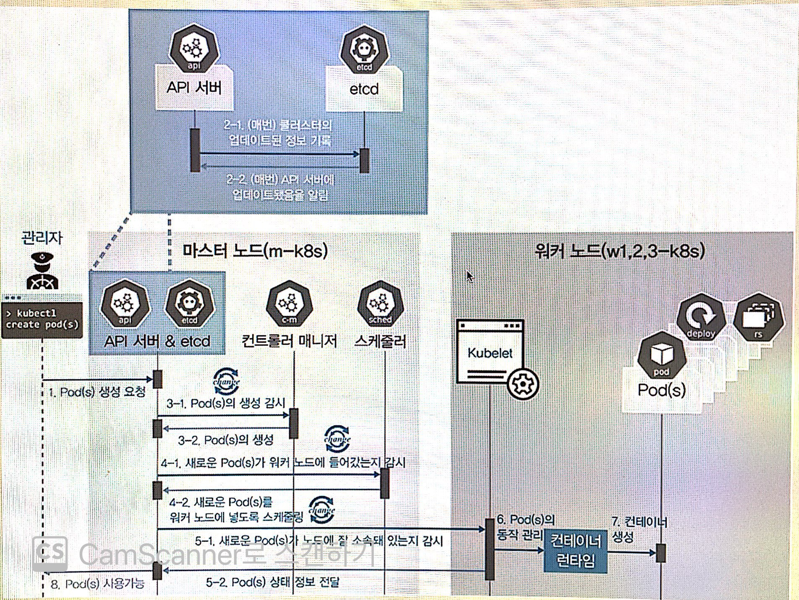
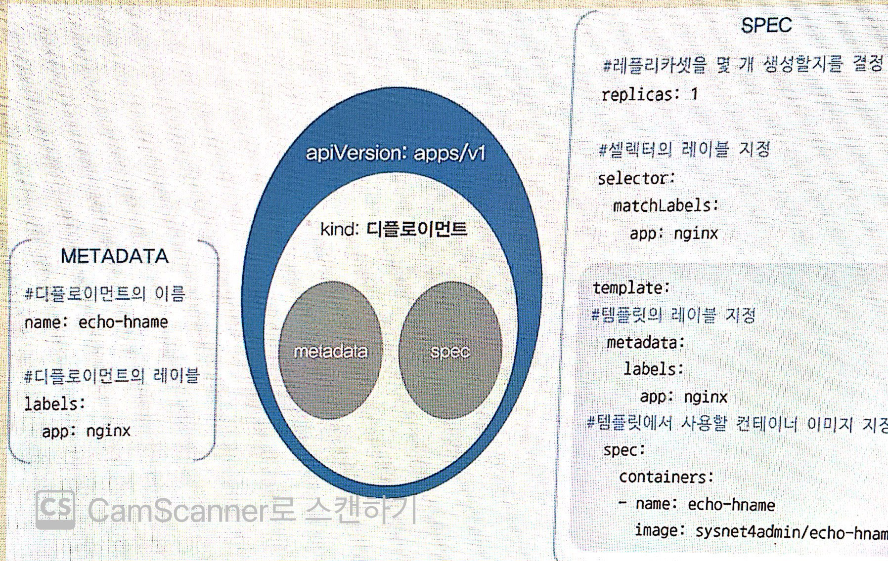

> [컨테이너 인프라 환경 구축을 위한 쿠버네티스/도커](http://www.yes24.com/Product/Goods/102099414)


# 3장 컨테이너를 다루는 표준 아키텍처, 쿠버네티스

## 3.1 쿠버네티스 이해하기

### 쿠버네티스 구성 요소 간 통신


* 0. kubctl: 쿠버네티스 클러스터에 명령을 내리는 역할을 합니다. 다른 구성 요소들과 다르게 바로 실행되는 명령 형태인 바이너리로 배포되기 때문에 마스터노드에 있을 필요는 없습니다. 하지만 통상적으로 API 서버와 주로 통신하므로 이 책에서는 API가 위치한 노드에 구성되어 있음
* 1. API 서버: 쿠버네티스 클러스터의 중심 역할을 하는 통로, 주로 상태 값을 저장하는 etcd와 통신 하지만 그 밖에 요소들 또한 API 서버를 중심에 두고 통신하므로 API 서버의 역할이 매우 중요합니다.
* 2. etcd: 구성 요서들의 상태 값이 모두 저장되는 곳입니다. 회사의 관리자가 모든 보고 내용을 기록하는 노트라고 생각하면 됩니다. 실제 etcd 외의 다른 구성 요소는 상태 값을 관리하지 않습니다. 그러므로 etcd의 정보만 백업돼 있다면 긴급한 장애 상황에서도 쿠버네티스 클러스터는 복수할 수 있습니다. 또한 etcd는 분산 저장 가능한 key-value 저장소이므로, 복제해 여러 곳에 저장해 두면 하나의 etcd에서 장애가 나더라도 시스템의 가용성을 확보할 수 있습니다.
* 3. 컨트롤러 매너저: 컨트롤러 매니저는 쿠버네티스 클러스터의 오브젝트 상태를 관리합니다. 예를 들어 워커 노드에서 통신이 되지 않는 경우, 상태 체크와 복구하는 컨트롤러 매니저에 속한 노드 컨트롤러에서 이루어집니다.
* 4. 스케줄러: 노드의 상태와 자원, 레이블, 요구 조건 등을 고려해 파드를 어떤 워커 노드에 생성할 것인지를 결정하고 할당합니다. 스케줄러라는 이름에 걸맞게 파트를 조건에 맞는 워커 노드에 지정하고, 파드가 워커 노드에 할당되는 일정을 관리하는 역할을 함당합니다.


### 워커 노드

* 5. kubelet: 파드 구성 내용(PodSpec)을 받아서 컨테이너 런타임으로 전달하고, 파드 안의 컨테이너들이 정상적으로 동작하는지 모니터링 합니다.
* 6. 컨테이너 런타임: 파드를 이루는 컨테이너의 실행을 담당합니다. 파드안에서 다양한 종류의 컨테이너가 문제 없이 작동하게 만드는 표준 인터페이스 입니다.
* 7. 파드: 한 개 이상의 컨테이너로 단일 목적의 일을 하기 위해서 모인 단위 입니다. 즉 웹서버 역할을 할 수도 있고 로그나 데이터를 분석할 수도 있씁니다. 여기서 중요한 것은 파드는 언제라도 죽을 수 있는 존래하는 것입니다. 쿠버네티스에서는 파드가 언제라도 죽을 수 있다고 가정하고ㅓ 설계됐기 때문에 쿠버네티스는 여러 대안을 디자인 했습니다.

### 파드의 생명 주기로 쿠버네티스 구성 요소 살펴보기



1. kubctl을 통해 API 서버에 파드를 생성 요청합니다.
2. API 서버에 전달된 내용이 있으면 API 서버는 etcd에 전달된 내용을 모두 기록해 클러스터의 상태 값을최신으로 유지합니다. 따라서 각 요소가 사앹를 업데이트할 때 마다 모두 API 서버를 통해 etcd에 기록됩니다.
3. API 서버에 파드가 생성이 요청된 것을 컨트롤러 매니저가 인지하면 컨트롤러 매니저는 파드를 생성하고, 이 상태를 API 사바에 전달합니다.
4. API 서버에 파드가 생성됐다는 정보를 수케줄러가 인지합니다. 스케줄러는 생성된 파드를 어떤 워크 노드에 적용할지 조건을 고려해 결저 하고 해당 워커 노드에 파드를 띄우도록 요청합니다.
5. API 서버에 전달된 정보대로 지정한 워커 노드에 파드가 속해 있는지 스키줄러가 kubelet로 확인합니다.
6. kubelet에서 컨테이너 런타임으로 파드를 생성 요청합니다.
7. 파드가 생성됩니다.
8. 파드가 사용 가능한 상태가 됩니다.
   


## 3.2 쿠버네티스 기본 사용법 배우기

### 스팩을 지정해 오브젝트 생성하기

오브젝트 스팩은 일반적으로 야물 문법으로 작성됩니다. 

```yml
apiVersion: apps/v1 # API 버전
kind: Deplotment # 오브젝트 종류
metadata:
    name: echo-hname
    lables:
        app: nginx
spec:
    replicas: 3 # 몇 개의 파드를 생설할지 결정
    selector:
    matchLables:
        app: nginx
    template:
        metadata:
            lable:
                app: nginx
    spec:
        containers:
            - name: echo-hname
            image: sysne4admin/echo-hname # 사용되는 이미지
```

파일 구조를 정리하면 다음과 같습니다.




## 3.3 쿠버네티스 연결을 담당하는 서비스

## 3.4 알아두면 쓸모 있는 쿠버네티스 오브젝트