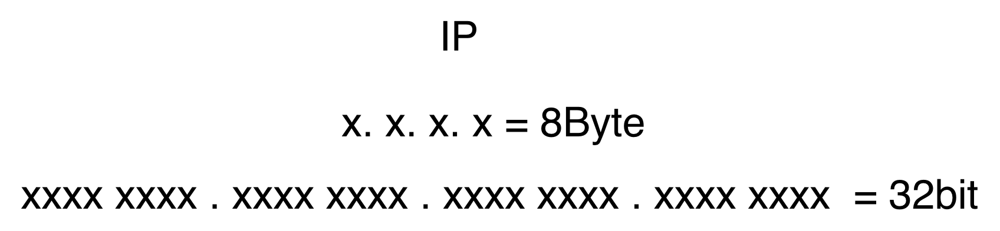
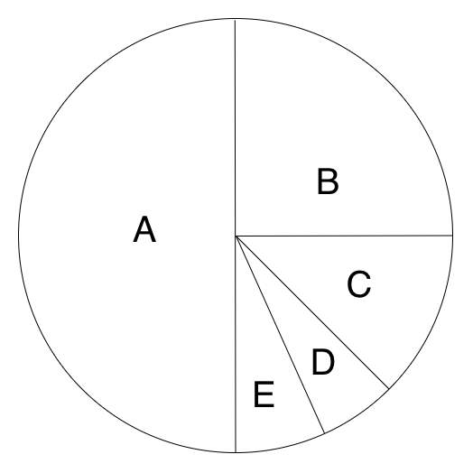
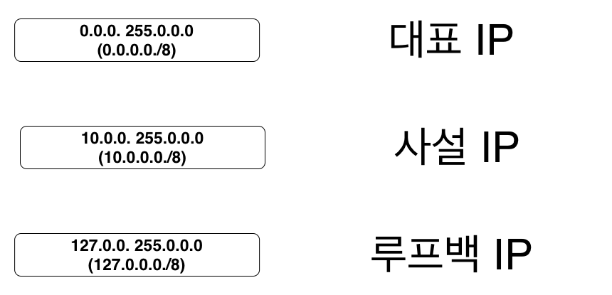
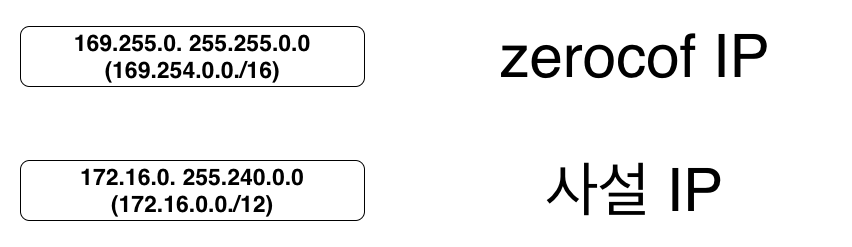

## 네트워크 IP


* IP 주소 -> 8Byte -> 32Bit 으로 이루어져 있음
* IP 주소는  0~255 . 0~255 . 0~255 . 0~255 = 2^32 = 4,294,967,296 개수가 가질 수 있음


## 네트워크 클래스


* Class = IP의 크기의 단위로 나눈것
* A 클래스는 모든 IP 주소의 반절 (1/2)
  * 0000 0000 0111 1111 -> 0 127
  * 0.0.0.0 ~ 127.255.255.255
* B 클래스는 A 클래스 제외하고 남은 반절 (1/4)
  * 1000 0000  1011 1111
  * 128.0.0.0 191.255.255.255
* C 클래스는 A, B 클래스 제외하고 남은 반절 (1/8)
* D, E 클래스는 A, B, C 클래스를 제외하고 남은 반절 씩 (1/16)

## 비공인 네트워크

### Reserved IP In A Class

* 국가나, 초대형 기업에 할당됨

### Reserved IP In B Class


### Reserved IP In C Class

*  개인이나 소규모 기업에서 

### Reserved IP In E, D Class
* E class 멀티케스팅 용도
* D Class 연구용으로 사용
* 개인이 사용할 수 없음

## 네트워크 서브넷팅
* SUB + Network 네트워크를 부분 부분 나눈 것을 의미
* A,B,C,D Class를 흥청망청 뿌린 결과 개인, 기업들이 사용할 IP가 부족해지는 현상이 발생, 그래서 IETF에서 다시 A,B,C,D Class를 회수해서 Subnet으로 IP를 쪼개서 분배함

```
서브넷 마스크 255. 255. 255. 0
255. 255. 255. 0 -> 1111 1111. 1111 1111. 1111 1111. 0 bit
```
SUBNET -> Network bit + HOST bit

### Network bit
```
NAME : Network Bit
Purpose : NetWork ID
Mark : bit 1
Example : 192.168.0.1 / 8
```
* Network bit는 같은 네트워크에서 식별하기 위함

### Hoist Bit
```
NAME : Host Bit
Purpose : Host ID
Mark : bit 0
Form : Various
```
* Host ID는 단말기마다 부여

### 네트워크 첫 주소 /변하지 않은 주소
```
192.168.1.000 00000 ~ 000 1111
192.168.1.0 ~ 192.168.1.31
```

### 대표 아이피, 브로드캐스트 아이피
* 대표 아이피 : 네트워크의 IO
```
대표 아이피 : 네트워크의 ID
192.168.0/24 -> 192.168.0.0
네트워크       -> 대표 아이피
```
* 브로드캐스트 아이피: 네트워크 아이피
* 아이피의 실제 주소를 알기 위해서 Broadcasting 해서 실제 위치를 찾아간다.
```
대표 아이피 : 네트워크의 ID
브로드캐스트 아이피 : 네트워크 방송용
```
