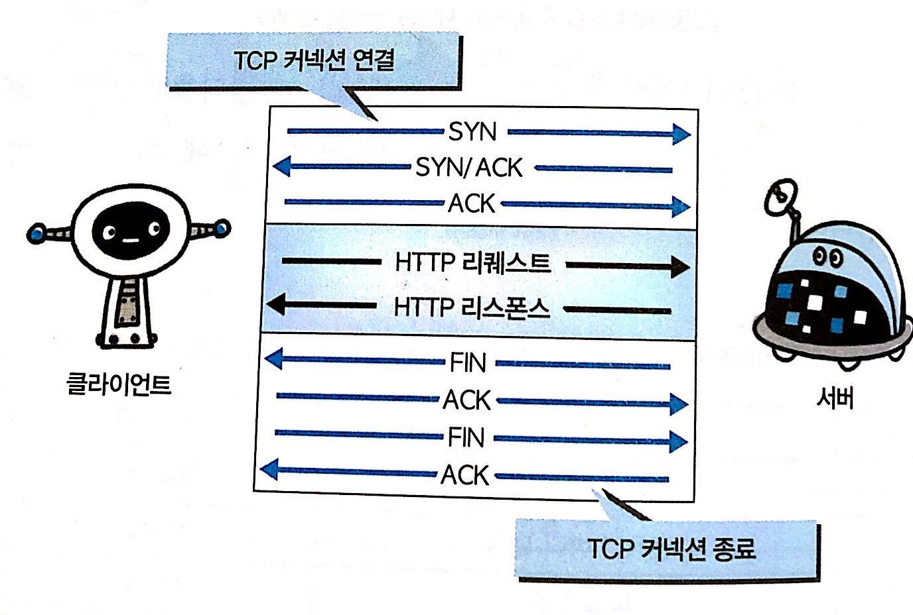
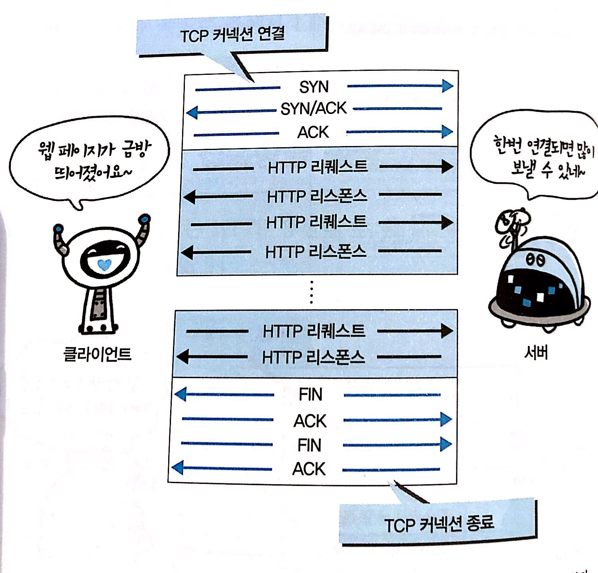
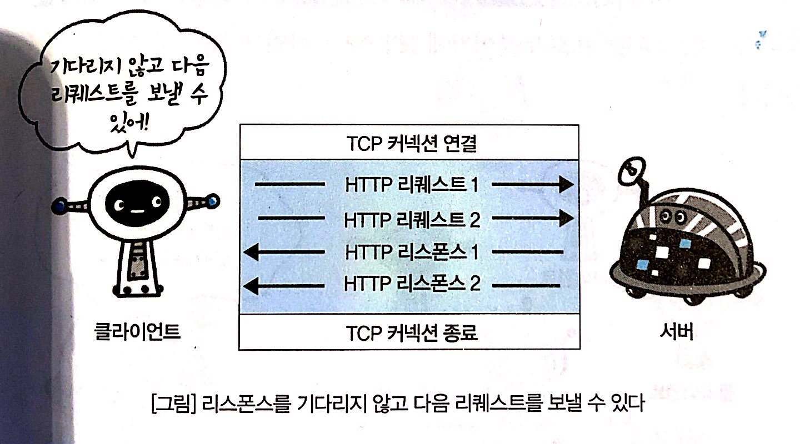
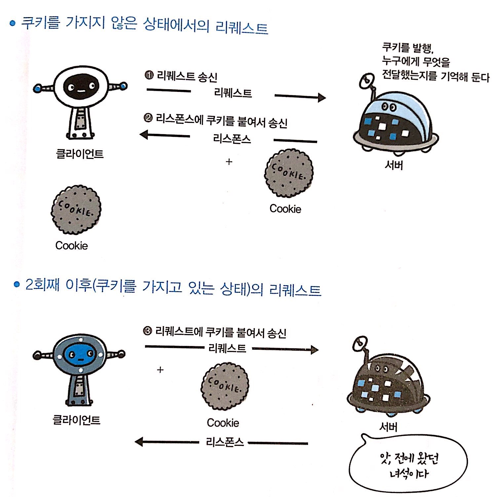
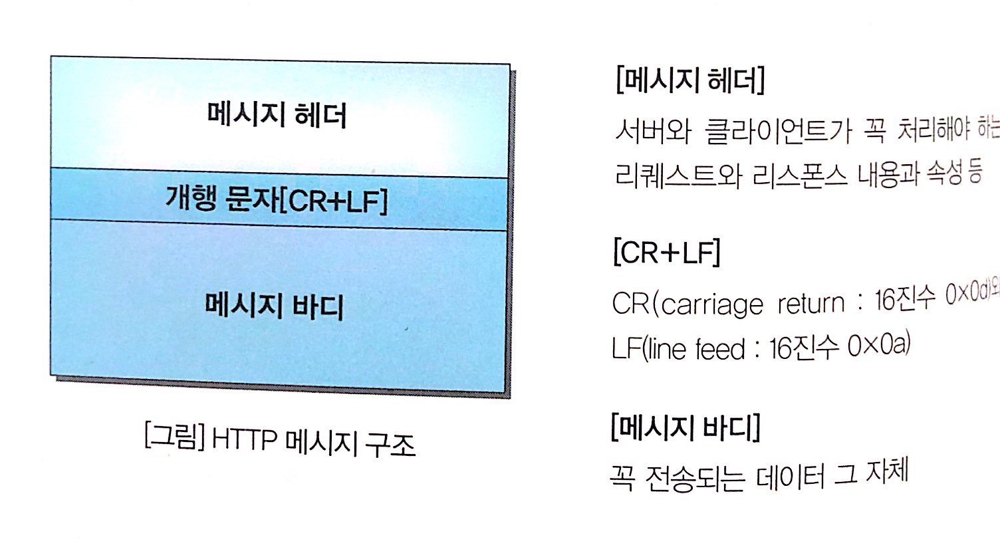
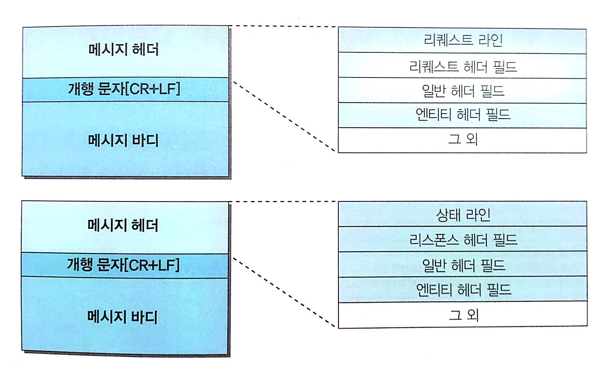
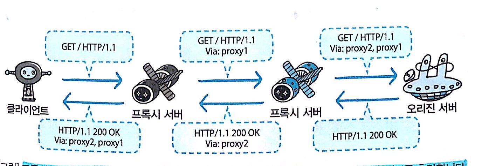

> 해당 글은 [그림으로 배우는 HTTP & Network](http://www.yes24.com/Product/Goods/15894097)를 보고 정리한 내용 입니다.


# 1장 웹과 네트워크의 기본에 대해 알아보자

## 네트워크의 기본은 TCP/IP

### 계층으로 관리하는 TCP/IP

* TCIP/IP에서 중요한 개념 중 하나가 계층입니다. TCIP/IP는 애플리케이션 계층, 전송 계층, 네트워크 계층, 링크 계층 이렇게 4 계츠으로 나뉘어 있습니다.
* TCIP/IP가 계층화된 것은 메리트가 있기 때문입니다. 예를 들면 인터넷이 하나의 프로토콜로 되어 있다면 어디선가 사양이 변경되었을 때 전체를 바꾸지 않으면 안되지만, 계층화되어 있으면 사양이 변경된 해당 계층만 바꾸면 됩니다. 각 계층은 계층이 연결되어 있는 부분만 결정되어 있어, 각 계층의 내부는 자유롭게 설계할 수 있습니다.
* 계층화하면 설계를 편하게 할 수 있습니다. 애플리케이션 층에서 애플리케이션은 자기 자신이 담당하는 부분을 고려하면 되고, 상대가 어디에 있는지 어떤 루트로 메시지를 전달하는지, 전달할 메시지가 확실하게 전달되고 있는지는 고려 안해도 됩니다.


| 계층  | 계층명       | 주요 관심사                             |
| --- | --------- | ---------------------------------- |
| 4   | 애플리케이션 계층 | 애플리케이션 사용하는 통신의 움직임 결정             |
| 3   | 전송 계층     | 노드 간의 연결을 제어, 데이터를 전송의 신뢰성을 담당     |
| 2   | 네트워크 계층   | 통신 노드 간의 IP패킷을 전송하는 기능과 라우팅 기능을 담당 |
| 1   | 링크 계층     | 하드웨어 신호를 읽는 기능 담당                  |


### 애플리케이션 계층
애플리케이션 계층은 유저에게 제공되는 애플리케이션에서 사용하는 통신의 움직임을 결정하고 있습니다.
TCIP/IP에는 여러 가지의 공통 애플리케이션이 준비되어 있습니다. 예를 들면, FTP, DNS 등도 애플리케이션의 한 가지입니다. HTTP도 이 계층에 포함됩니다. 

### 전송 계층
전송 계층은 애플리케이션 계층에 네트워크로 접속되어 있는 2대의 컴퓨터 사이의 데이터 흐름을 제공합니다. 전송 계층에서 서로 다른 설징을 가진 TCP, UDP두 가지 프로토콜이 있습니다.

**TCP는 대용량의 데이터를 보내기 쉽게 작게 분해하여 상대방에게 보내고, 정확하게 도착했는지 확인하는 역할을 담당하고 있습니다.** 전송 계층(TCP)애서는 애플리케이션 계층에서 받은 데이터(HTTP 메시지)를 통신하기 쉽게 조각내어 안내 번호와 포트 번호를 붙여 네트워크 계층으로 전달합니다

### 네트워크 계층
네트워크 계층은 네트워크 상에서 패킷의 이동을 다룹니다. 패킷이란 전송하는 데이터의 최소 단위입니다. 이 계층에서 어떠한 경로를 거처 상대방의 컴퓨터까지 패킷을 보낼지를 결정하기도 합니다. 인터넷의 경우라면 상대 컴퓨터에 도달하는 동안에 여러 대의 컴퓨터랑 네티워크 기기를 거쳐 상대방에게 배송됩니다. **그러한 여러 가지 선택지 중에서 하나의 길을 결정하는 것이네트워크 계층의 역할입니다.**

### 링크 계층
네티워크에 접속하는 하드웨어적인 면을 다룹니다. 운영체제가 하드웨어를 제어하기 때문에 디바이스 드라이버와 네티워크 인터페이스 카드(NIC)를 포함합니다. 그리고 케이블 등과 같이 물리적으로 보이는 부분도 포함합니다. 하드웨어적 측면은 모두 링크 계층의 역할입니다.

### TCP/IP 통신의 흐름


TCP/IP로 통신할 때 계층을 순서대로 거쳐 상대와 통신합니다. 송신하는 측은 애플리케이션 계층에서 부터 내려가고, 수신하는 측은 애플리션 계층으로 올라갑니다.

1. 클라이언트의 애플리케이션 계층에서에서 HTTP 리퀘스트를 지시합니다.
2. 전송 계층(TCP)애서는 애플리케이션 계층에서 받은 데이터(HTTP 메시지)를 통신하기 쉽게 조각내어 안내 번호와 포트 번호를 붙여 네트워크 계층으로 전달합니다.
3. 네트워크 계층(IP)에서는 수진지 MAC 주소를 추가해서 링크 계층에 전달합니다. 이로써 네트워크를 통해 송신할 준비가 되었습니다.
4. 링크 계층에서 데이터를 받아들여 순서대로 위의 계층에 전달하여 애플리케이션 계층까지 도달합니다. 애플리케이션 계층에 도달하게 되면 드디어 클라이언트가 발신했던 HTTP 리퀘스트 내용을 수신할 수 있습니다.


각 계층이 거칠 때는 반드시 헤더로 불리는 해당 계층마다 해당 계층에 필요한 정보를 추가합니다. 반대로 수신측에서 각 계층을 거칠 때마다 반드시 해당 계층의 헤더를 삭제합니다. 이렇게 정보를 감싸는 것을 캡슐화라고 부릅니다.

## HTTP와 관계가 깊은 프로토콜 IP/TCP/DNS


### 배송을 담당하는 IP
* IP는 계층으로 말하자면 네트워크 계층에 해당됩니다.
* IP의 역할은 개개의 패킷을 상대방에게 전달하는 것입니다.
* 상대방에게 전달하기까지 여러 가지 요소가 필요합니다. 이 중에서도 **IP 주소와 MAC 주소가 중요합니다. IP주소는 결국 MAC주소와 결부됩니다.**

### 통신은 ARP를 이용하여 MAC 주소에서 한다.
* IP 통신은 MAC 주소에 의존해서 통신을 합니다. 인터넷에서 통신 상대가 같은 랜선 내에 있을 경우 적어서 여러 대의 컴퓨터와 네트워크 기기를 중계 해서 상대방에게 도착합니다.
* **중계하는 동안에는 다음으로 중계할 곳의 MAC 주소를 사용하여 목적지를 찾아가는 것입니다. 이때 ARP이라는 프로토콜이 사용됩니다.**
* ARP는 주소를 해결하기 위한 프로토콜 중 하나인데, 수신지의 IP주소를  바탕으로 MAC 주소를 조사할 수 있십니다.
```
1. 192.0.43.10 IP 주소에 패킷을 보냄
2. ARP를 사용해서 조사한 결과 우선 10-EW-C6...에 보냅니다.
3. 라우터는 MAC 주소 00-XX-C6... 으로 보냅니다.
4. 또 라우터는 MAC 주소 11-K1-C6... 으로 보냅니다.
5. 결국 수신측으로 전달됩니다.
```

### 신뢰성을 담당하는 TCP
TCP는 계층으로 말하자면 전송 계층에 해당하는데, 신뢰성 있는 바이트 스트림 서비스를 제공합니다. 바이트 스트림 서비스란 용량이 큰 데이터를 보내기 쉽게 TCP 새그먼트라고 불리는 단위 패킷으로 작게 분해햐여 관리하는 것을 말하고, 신뢰성 있는 서비스는 상대방에게 보내는 서비스를 의미합니다. 결국 **TCP는 대용량의 데이터를 보내기 쉽게 작게 분해하여 상대방에게 보내고, 정확하게 도착했는지 확인하는 역할을 담당하고 있습니다.**

#### 상대에게 데이터를 확실하게 보내는 것이 일이다.
상대에게 확실하게 데이터를 보냐기 위해서는 TCP는 `쓰리웨이 핸드세이킹` 이라는 방법을 사용하고 있습니다. 이 방법은 패킷을 보내고 바로 끝내는 것이 아니라 보내졌는지 여부를 상대방에게 확인하러 갑니다. 이것은 `SYN`, `ACK`라는 TCP 플래그를 사용합니다.

* 송신측에서 최초 `SYN` 플래그로 상대방에게 접속함과 동시에 패킷을 보내고, 수신측에서 `SYN/ACK` 플래그로 송신측에 접속함과 동시에 패킷을 수신한 사실을 전합니다.
* 마지막으로 송신측이 `ACK` 플래그를 보내 패킷 교환이 완료되었을을 전달합니다.
* 이 과정에서 어디선가 통신이 도중에 끊어지면 TCP는 그와 동시에 같은 수순으로 패킷을 재전송합니다.

# 재 2장 간단한 프로토콜 HTTP
* HTTP는 상태를 계속 유지하지 않은 스테이트리스 프로토콜입니다. 
* HTTP 프로토콜 독자적으로, 리퀘스트와 리스폰스를 교환하는 동안에 상태를 관리하지 않습니다. 결국 **HTTP 프로토콜 레벨에서 이전에 보냈던 리퀘스트나 이미 되돌려준 리스폰스에 대해서는 전혀 기억하지 않습니다.**
* HTTP에서는 새로운 리퀘스트가 보내질 때 마다 새로운 리스폰스가 생성됩니다. 프로토콜로서는 과거의 리퀘스트나 리스폰스 정보를 전혀 가지고 있지 않습니다.
* **HTTP/1.1은 상태를 유지하지 않은 프로토콜입니다. 그래서 상태를 계속 유지하고 싶은 욕구에 부응하기 위해서 쿠키라는 기술이 도입되었습니다.**

## HTTP는 상태를 유지하지 않는 프로토콜

**HTTP는 상태를 계속 유지하지 않는 스테이트레스(stateless) 프로토콜입니다.** HTTP 프로토콜 독자적으로, 리퀘스트 리스폰스를 교환하는 동안에 상태(status)를 관리하지 않습니다. 결국 HTTP 프로토콜 레벨에는 이전에 보냈던 리퀘스트나 이미 돌러준 리스펀스에 대해서는 전혀 기억하지 않습니다.

이는 많은 데이터를 매우 빠르고 확실하게 처리하는 범위성을 확보하기 위해서 이와 같이 간단하게 설계되어 있는 것입니다. 하지만 웹이 진화함에 따라서 상태를 관리해야할 필요성이 증가되었고, 그래서 **상태를 계속 유지하고 싶은 요구에 부응하기 위해서 쿠키라는 기술이 도입되었습니다.**

## 서버에 임무를 부여하는 HTTP 메서드

### Options: 제공하고 있는 메서드의 문의
Options 메서드는 리퀘스트 URI로 지정한 리소스가 제공하고 있는 메소드를 조사하기 위해서 사용됩니다.

| 구분       | 설명                                                    |
| -------- | ----------------------------------------------------- |
| Request  | OPTIOPNS* HTTP /1.1 <br> Host: www.harck.jp           |
| Response | HTTP /1.1 200 OK <br> Allow: GET, POST, HEAD, OPTIONS |

### Trace: 경로 조사
TRACE 메서드는 Web 서버에서 접속해서 **자신에게 통신을 되돌려받는 루프백(Loop back)을 발생 시킵니다.**

리퀘스트를 보낼때 `Max-Forwards` 라는 해더 필드에 수치를 포함시켜 서버를 통과할 때 마다 그 수치를 줄여갑니다. 수치가 0이 되는 곳을 끝으로, 리퀘스트를 마지막으로 수신한 곳에서 상태 코드 200 OK 리스폰스를 돠돌려 줍니다.

클라이언트는 TRACE 메서드를 사용함으로써, 리퀘스트를 보낸 곳에 어떤 리퀘스트가 가공되어 있는지를 등을 조사할 수 있습니다.

이것은 프록시 등을 중계하여 오리진 서버에 접소갛ㄹ 때 그 동작을 확인 하기 위해서 사용되고 있습니다. 다만, TRACE 메서드는 거의 사용되지 않는데다 크로스 사이트 트레이싱(XST)과 같은 공격을 일으키는 보안 상의 문제도 있기 때문에 보통은 사용되고 있지 않습니다.

## 지속 연결로 접속량을 절약


HTTP 초기 버전에서는 **HTTP 통신을 한 번 할 때마다 TCP에 의해 연결과 종료**를 할 필요가 있었습니다. 하지만 다량의 이미지를 포함한 문서 등이 늘어 남아 따라서 리퀘스트를 보낼 때마다 매번 TCP 연결과 종료를 하게 되는 쓸모 없는 일이 발생되어 통신량이 늘어나게 됩니다.


### 지속 연결


HTTP/1.1와 HTTP/1.0에서는 TCP 연결 문제를 해결하기 위해서 지속 연결이라는 방법을 고안하였습니다. 지속 연결의 특징은 어느 한 쪽이 명시적으로 연결을 종료하지 않은 이상 TCP 연결을 계속 유지합니다. **지속 연결은 1회의 TCP 컨넥션 연결로 리퀘스트와 리스폰스 교환을 여려 번 한다.**

지속 연결을 하는 이점은 TCP 컨넥션의 연결과 종료를 반복되는 오버헤드를 줄여주기 때문에 서버에 대한 부하가 경감됩니다.

### 파이프라인화


지속 연결은 여려 리퀘스트를 보낼 수 있도록 파이프라인화를 가능하게 합니다. 파이프라인화에 의해서 이전에는 리퀘스트 송신 후에 리스폰스를 수신할 때까지 기다린 뒤에 리퀘스트를 발행하던 것들을 리스폰스를 기다리지 않고 다음 리퀘스트를 보낼 수 있습니다.

## 쿠키를 사용한 상태관리

HTTP 프로토콜은 스테이트리스 프로토콜이기 때문에, 과거에 교환했던 리퀘스트와 리스폰스 상태를 관리하지 않습니다. 결국, 과거 상태를 근거로 현재 리퀘스트를 처리한다는 것은 불가능 합니다. **물론 스테이트리스 프로토콜 이점도 있습니다. 상태를 유지하지 않는 다는 점에서 서버의 CPU나 메모리 같은 리소스의 소비를 억제할 수 있습니다.**




스테이트리스 프로토콜이라는 특징은 남겨준 채, 이와 같은 문제 해결하기 위해 쿠키라는 시스템이 도입되었습니다. **쿠키는 리퀘스트와 리스폰에 쿠키 정보를 추가해서 클라이언트의 상태를 파악하기 위한 시스템입니다.** 

쿠키는 서버에서 리스폰스로 보내진 Set-Cookie라는 헤더 필드에 의해 쿠키를 클라이언트에 보존하게 됩니다. 다음 번에 클라이언트가 같은 서버로 리퀘스트를 보낼 때, 자동적으로 쿠키 값을 넣어서 송신합니다. 서버는 클라이언트가 보내온 쿠키를 확인해 어느 클라이언트가 접속 했는지 체크하고 서버 상의 기록을 확인해 이전 상태를 알 수 있습니다.

```
1. Request(쿠키를 가지고 있지 않은 상태)
GET /reader/ HTTP 1.1
Host www.xxxx.com
*헤더 필드에 쿠키는 없다

2. Response (서버가 쿠키를 발행)
HTTP /1.1 200 OK
Data: Thu 12 Jul 2012 07:00:00 GMT
<Set-Cooke: sid=102030203; path=/;expires=Wed, => 10-Oct-12 07:12:00 GTM
Content-Type: text/plain; charset=UTF-8

3. Request
GET /image/ HTTP /1.1
Host: www.xxxx.com
Cooke: sid=102030203
```


# 3장 HTTP 정보는 HTTP 메시지에 있다.
HTTP에서 교환하는 정보는 HTTP 메시지라고 불리는데 리퀘스트 측 HTTP 메세지를 **리퀘스트 메시지**, 리스폰스 측 HTTP 메시지를 **리스폰스 메시지**라고 부릅니다.

HTTP 메세지는 크게 구분함녀 메시지 헤더와 메시지 바디로 구분되어 있고, 최초의 개행 문자(CR+LF)로 메시지 헤더와 메시지 바디를 구분합니다. 이 안에는 메시지 바디가 항상 존재한다고는 할 수 없습니다.



## 리퀘스트 메시지와 리스폰스 메시지의 구조


* 리퀘스트 라인 : 리퀘스트에 사용하는 메소드와 리퀘스트 URI와 사용하는 HTTP 버전이 포함됩니다.
* 상태 라인 : 리스폰스 결과를 나타내는 상태 코드와 설명, 사용하는 HTTP 버전이 포함됩니다.
* 헤더 필드 : 리퀘스트와 리스폰스의 여러 조건과 속성 등을 나타내는 각종 헤더 필드가 포함됩니다. 

## 인코딩으로 전송 효율을 높이다.
HTTP로 데이터를 전송할 경우 그 대로 전송할 수 오 있지만 전송할 때에 인코딩을 실시함으로써 전송 효율을 높일 수 있습니다.

### 메시지 바디와 엔티티 바디의 차이
* 메시지 : HTTP 통신의 기본 단위로 옷쳇 시퀀스(8비트)로 구성되고 통신을 통해 전성됩니다.
* 엔티티 : 리퀘스트와 리스폰스의 페이로드로 전성되는 정보로 엔티티 헤더 필으와 엔티티 바디로 구성됩니다.

HTTP 메세지 바디와 역할은 리퀘스트랑 리스폰스에 관한 엔티티 바디를 운반하는 일입니다. 기본적으로 메시지 바디와 엔티티 바디는 같지만 **전송 코딩이 적용되는 겨웅 엔티티와 바디의 내용이 변화하기 때문에 메시지 바디와 달라집니다.**

### 압축해서 보내는 콘텐츠 코딩
메일에 파일을 첨부해서 보낼 경우 같이 영량을 줄이기 위해서 파일을 zip으로 압축하고 나서 첨부해서 보내느 일이 있습니다. HTTP에는 이와 같은 일이 가능한 **콘텐츠 코딩** 이라고 불리는 기능이 구햔되어 있습니다.

콘텐츠 코딩은 엔티티에 적용하는 인코딩을 가리키는데 엔티티 정보를 유지한채로 찹축합니다. 컨텐츠 코딩된 엔티티는 수신한 클라이언트 측에서 디코딩합니다. 주요 콘텐츠 압축에는 다음과 같은 것이 있습니다.

* gzip(GNU zip)
* compress(UNIX 표준 압축)
* deflate(zip)
* identity(인코딩 없음)

### 분해해서 보내는 청크 전송 코딩
HTTP 통신에는 리퀘스트했던 리소스 전부에서 엔티티 바디의 전송이 완료됴ㅣ지 않으면 브라우저에 표시되지 않습니다. **사이즈가 큰 데이터를 전송하는 경우 데이터를 분할**해서 조금씩 표시할 수 있습니다. 이렇게 엔티티 바디를 분할하는 기능을 **청크 전송 코딩** 이라고 부릅니다.

청ㅋ크 전송 코딩은 엔티티 바디으를 청크로 분해합니다. 다음 청크 사이즈를 16진수로 사용해서 단락을 표시하고 엔티티 바디 끝에는 원래의 엔티티 바디로 디코딩 합니다. HTTP /1.1에는 전송 코딩이라는, 어떤 인코딩 방식에 따라서 전송하는 구조가 마련되어 있지만 전송 코딩에는 청크전송 코딩만 정의되어 있습니다.

## 여러 데이터를 보내는 멀티 파트
HTTP도 멀티파트에 대응하고 있어 하나의 메시지 바디 내부에 엔티티를 여러 개 포함시켜 보낼수 있습니다.주로 이미지나 텍스트 파일 등을 업로드할때 사용되고 있습니다.

*  multipart/form-data : web 폼으로 부터 파일 업로드에 사용됩니다.
```
Content-Type: multipart/form-data: boundary=AaB03X 
--AaB03x
Content-Disposition: form-data; name="field1" 
Joe Blow 
--AaB03x
...
```
*  multipart/byteranges: 상태 코드 206 리스폰스 메시지가 복수 범위 내용을 포함하는 때에 사용됩니다.
```
HTTP/1.1 206 Partial Content
Data: Fri 13...
Content-Type: multipart/byteramges: boundary=HTIS_STRING_SEPARATES
```

### 일부분만 받는 레인지 리퀘스트
엔티티의 범위를 지정해서 다운로드할 필요가 있습니다. **이와 같이 범위를 지정하여 리퀘스트 하는 것을 레인지 리퀘스트 라고 부릅니다.**

레인지 리퀘스트를 사용하면 전체 10,000 바이트 정도 크기의 리소스에서 5,001 ~ 10,000 바이트 범위 만을 리퀘스트 할 수 있습니다. 레인지 리퀘스트 할 때에는 Range 헤더 필드를 사용해서 리소스의 바이트 렝니지를 지정합니다.

```
# 5,001 ~ 10,000 바이트
Ragne: bytes = 5001-10000

# 5,001 이상
Ragne: bytes = 5001

# 처음부터 3,000 바트까지, 그리고 5,000 ~ 7,000 바이트까지의 복수 범위 지정
Ragne: bytes = -3000, 5000-7000
```
레인지 리퀘스트에 대한 리스폰스 상태 코드 206 이라는 리스폰스 메시지가 되돌아 옵니다. 

### 최적의 콘텐츠를 돌려주는 콘텐츠 네고시에이션

콘텐츠 네고시에이션이란 클라이언트와 서버가 제공하는 리소스의 냉욜에 대해서 교섭하는 것입니다. 클라이언트에 더욱 적합한 리소스를 제공하기 위한 구조입니다

콘텐츠 네고에이션은 제공하는 리소ㅓ스를 언어와 문자 세트, 인코딩 방식 등을 기준으로 판단하고 있습니다. 판단 기준은 리퀘스트 메시지에 포함된 다음과 같은 리퀘스트 헤더 필드입니다.
* Accept
* Accept-Charset
* Accept-Encoding
* Accept-Language
* Content-Language

콘텐츠 네고에이션에는 다음과 같은 종류들이 있습니다.

#### 서버 구동형 네고에이션
서버 측에서 콘텐츠 네고에이션을 하는 방식입니다. 서버 측에서 리퀘스트 헤더 필드의 정보를 참고해서 자동적으로 처리를 합니다.

#### 에이전트 구동형 네고시에이션
클라이언트 측 에서 콘텐츠 네고에이션을 하는 방식입니다. 브라우저에 표시된 선택지중에서 유저수가 수동으로 선택합니다.

#### 트랜스스페어런트 네고시에이션
서버 구동형과 에이전트 구동형을 혼합한 것으로 서버와 클라이언트가 각각 컨텐츠 네고시에이션을 하는 방식입니다.

# 5장 HTTP와 연계하는 웹서버

## 1대로 멀티 도메인을 가능하게 하는 가상 호스트
HTTP /1.1 에서는 하나의 HTTP 서버에 여러 개의 웹 사이트를 실행할 수 있습니다. 예를 들면 웹 호스팅을 제공하는 있는 사업자는 1대의 서버에 여러개의 웹 사이트를 넣읋 수 있습니다. 고객마다 다른 도메인을 가지고, 다른 사이트를 실행할 수 있습니다. 이를 위해 **가상 호스트**라는 개념을 사용하고 있습니다.

가상 호스트 기능을 사용하면 물리적으로 서버가 1대지만 가상으로 여러대가 있는 것처럼 설정하는 것이 가능합니다.

인터넷에서 도메인 명은 DNS에 의해서 IP 주소로 변한되고 나서 엑세스하게됩니다. 결국 **리퀘스트가 서버에 도착한 시점에는 IP 주소를 기준으로 액세스하게 됩니다.**

이 때 1대의 서버 안에 www.tricoder.jp 이외에 www.hackr.jp 라는 도메인이 있는 경우, 어느 쪽에 대한 엑세스인지를 알 수가 없습니다.

같은 IP 주소에서 다른 호스트명과 다른 도메인 명을 가진 여러 개의 웹사이트가 실행되고 있는 가상 호스트의 시스템이 있기 때문에, HTTP 리퀘스트를 보내는 경우 **호스트명과 도메인 명을 완전하게 포함한 URI를 지정하거나, 반드시 Host 헤더 플드에 지정해야 합니다.**

## 통신을 중계하는 프로그램 : 프록시, 게이트웨이, 터널

프록시, 게이트웨이, 터널 과 같은 통신을 중계하는 프로그램과 서버를 연계하는 것도 가능합니다. 이러한 프로그램과 서버는 그 다음에 있는 다른 서버에 리퀘스트를 중계하고, 그 서버로부터 받은 리스폰스를 클아이언트에 반환하는 역할을 담당합니다.

### 프록시
서버와 클라이언트 양쪽 역할을 중계하는 프로그램으로, 클라이언트로 부터 리퀘스트를 서버에 전소앟고, 서버로부터 리스폰스를 클라이언트에 전송합니다.

프록시 서버의 기본적인 동작은 클라이언트로 부터 받은 리퀘스르를 다른 서버에 전송하는 것입니다. 클라이언트로 부터 받은 리퀘스트 URI를 변경하지 않고 그 다음의 리소스를 가지고 있는 서버로 보냅니다.



HTTP 통신을 할 때, 프록시 서버를 여러 대 경유하는 것도 가능합니다. 체인과 같이 여러 대 경유해서 리퀘스트랑 리스폰스ㅡㄹㄹ 중계해 갑니다. 중계할 때에는 Via 헤더 필드에 경유한 호스트 정보를 추가해야 합니다.

캐시를 사용해서 네티워크 대역 등을 효율적으로 사용하는 것과 조직 내에 특정 웹 사이트에 대한 엑세스 재한, 액새스 로그를 획득하는 경책을 철저하게 지키려는 목적으로 사용되는 경우도 있습니다.

#### 캐싱 프록시
프록시로 리스폰스를 중계하는 때에는 프록시 서버 상에 리소스를 캐시를 보존해 두는 타입의 프록시입니다.

프록시에 다시 같은 리소스에 리퀘스트가 온 경우, 오리진 서버로부터 리소스를 획득하는 것이 아니라 캐시를 리스폰스로 되돌려주는 것이 있습니다.

#### 투명 프록시
프로시로 리퀘스트와 리스폰스를 중계를 할 때 메시지 변경을 하지 않는 타입의 프록시를 투명 프록시라고 합니다. 반대로 메시지에 변경을 가하는 타입의 프록시를 비투과 프록시라고 합니다.

### 게이트웨이
다른 서버를 중계하는 서버로, 클라이언트로 부신한 리퀘스트를 리소스를 보유한 서버인 것처럼 수신합니다. 경우에 따라서 클라이언트는 상대가 게이트웨이라는것을 알지 못하는 경우도 있습니다. 게이트웨이 사이를 암오화하는 등 으로 안전하게 접속함으로써 통신의 안전성읖 높이는 역할 등을 합니다.

### 터널
서로 떨어진 두 대의 클라이어트와 서버 사이를 중계하며 접속을 주선하는 중계 프로그램입니다. 터널은 요구게 따라서 다른 서버와의 통신 경로를 확힙합니다. 이 때 클라이언트는 SSL 같은 암호화 통신을 통해 서버와 안전하게 통신을 하기 위해서 사용합니다. 터널 자체는 HTTP 리퀘스트를 색헉하려고 하지 않습니다. 결국 리퀘스트를 그대로 다음 서버에 중계합니다. 그리고 터널은 통신하고 있는 양쪽 끝 접속이 끊어질 때 종료합니다.

## 리소르를 보관하는 캐시
캐시를 사용하면 리소스를 가진 서버의 액세서를 줄이는 것이 가능하기 때문에 통신량과 통신 시간을 절약할 수 있습니다. 캐시 서버의 장점은 캐시를 이용함으로써 같은 데이터를 몇 번이고 오리진 서버에 전송할 필요가 없다는 것입니다.

### 캐시는 유효기간이 있다
캐시를 가지고 있더라도 클라이언트의 요구나 캐시의 유효 시간 등에의해서 오리진 서버에 리소스의 유효성을 확인하거나 새로운 리소스를 다시획득하러 가게 되는 경우가 있습니다.

### 클라이언트 측에더 캐사가 있다
클라이언트가 사용하고 있는 브라우저에더 캐시를 가질 수 있습니다. 브라우저가 유요한 캐시를 가지고 이쓴ㄴ 경우, 같은 리소스의 액세스를 서버에 액새스하지 않고로컬 디스크로부터 불러옵니다. 리소스가 오래된 것으로 판단되는 경우 오리진 서버에 리소스의 유효성을 확인하러 가거나 새로운 리소스를 다시 획득하로 가는 일이 있습니다.