> [빅데이터 저장 및 분석을 위한 NoSQL & Redis](http://m.yes24.com/goods/detail/71131862) 내용 정리

# 2 Redis 설치 및 데이터 처리

```
$ docker pull redis
$ docker run --name redis-study -d -p 6379:6379 redis
$ docker run -it --link redis-study:redis --rm redis redis-cli -h redis -p 6379
```


## 데이터 처리

### 용어 설명

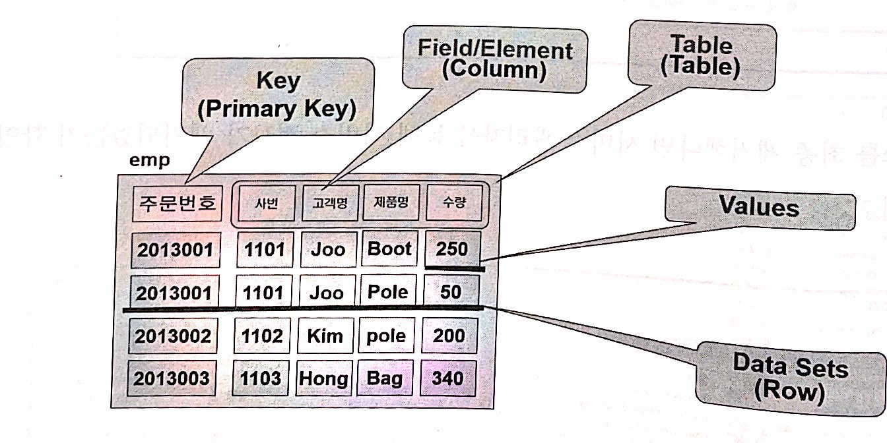

| 용어      | 설명                                                                                                            |
| --------- | --------------------------------------------------------------------------------------------------------------- |
| Table     | 하나의 DB에사 데이터를 저장하는 논리적인 구조                                                                   |
| Data Sets | 테이블을 구성하는 논리적 단위입니다. 하나의 데이터-셋은 하나의 KEY와 한 개 이상의 `FIELD/ELEMENT`로 구성됩니다. |
| Key       | 하나의 KEY는 하나 이상의 조합된 값으로 표현 가능합니다. 예를들어 주문번호 또는 주문번호+순번, 년월일+순번       |
| Values    | 해당 Key에 대한 구체적인 데이터를 값으로 펴햔합니다. 벨류는 하나 이상의 `Field, Element`로 구성됩니다.          |

### 데이터 입력/수정/삭제/조회

| 종류      | 내용                                            |
| --------- | ----------------------------------------------- |
| set       | 데이터를 저장할때(key, value)                   |
| get       | 저장된 데이터를 검색할 때                       |
| rename    | 저장된 데이터 값을 변경할 때                    |
| randomKey | 지정된 Key 중에 하나의 Key를 랜덤하게 검색할 때 |
| Keys      | 지정된 모든 Key를 검색할 때                     |
| exits     | 검색 대상 Key가 존재하는지 여부를 확인할 때     |
| mset/mget | 여러 개의 Key와 Value를 한번 저장하고 검색할 때 |

Redis DB에 데이터를 입력/수정/삭제/조회 하기 위해서는 반드시 Redis 서버에서 제공하는 명령어를 사용해야 하며 데이터를 조장할 때는 Key에 대한 하나 이상의 Field 또는 Element로 표현해야합니다.


### 실습

```
redis:6379> set 1111 "Yun" # 해당 키값으로 벨류 저장
redis:6379> get 1111 # 해당 키에대한 데이터 검색
redis:6379> keys * # 저장되어 있는 모든 key 출력
redis:6379> keys *2 # 저장되어 있는 key 중에 2로 끝나는 key 검색 
redis:6379> rename 1111 1112 # key 1111 -> 1112 변경
redis:6379> rename 1111 1112 # key 1111 -> 1112 변경
redis:6379> randomkey # 현재 key중에서 랜덤 key 검색
redis:6379> exists 1116 # 키존재 여부 존재하는 경우 1
redis:6379> strlen 1111 # 해당 키 값의 value 길이길이
redis:6379> flushall # 저장되어 있는 모든 key 삭제
redis:6379> setex 123 30 "asd" # 일정시간 동안만 저장
redis:6379> ttl 123 # 현재 남아있는 시간
redis:6379> mset 111 "111" 123 "123" # 여러 개 필드를 한 번에 저장
redis:6379> mget 111 123 # Mset에 저장된 값을 한번에 다중 검색
1) "111"
2) "123"
redis:6379> mget 111 123 11 noneexisting # 존재하지 않는 경우 nil 출력
1) "111"
2) "123"
3) (nil)
4) (nil)
redis:6379> append 111 "asdasd" # 현재 value에 value 추가
(integer) 9
redis:6379> get 111
"111asdasd"
redis:6379> save # 현재 입력한 key/value 값을 파일로 저장
OK
redis:6379> info # Redis 서버 설정 상태 조회
# Server
redis_version:6.2.1
...

```

### 데이터 타입

| 종류             | 내용                                                         |
| ---------------- | ------------------------------------------------------------ |
| strings          | 문자, Binary 유형 데이터를 저장                              |
| List             | 하나의 Key에 여러 개의 배열 값을 저장                        |
| Hash             | 하나의 Key에 여러 개의 Fields와 Value로 구성된 테이블을 저장 |
| Set / Sorted set | 정령되지 않은 String 타입 / Set과 Hash를 결합한 타입         |
| Bitmaps          | `0,1`로 표현하는 데이터 타입                                 |
| HyperLogLogs     | Element 중에 Unique 한 개수의 Element 만 계산                |
| Geospatial       | 좌표 데이터를 저장 및 관리하는 데이터 타입                   |


#### Hash 타입

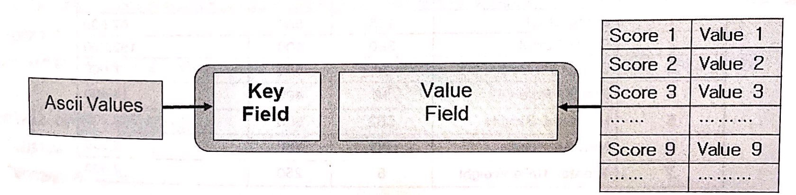

하나의 Key와 하나 이상의 `Field/Element` 값으로 저장할 수 있습니다. Value에는 기본적으로 Strings 데이터를 저장할 수 있으며 추가로 컨테이너 타입의 데이터들을 저장할 수 있습니다.

타입의 데이터들은 저장할 수 있습니다. 컨테이너 타입에는 Hash, List, Set/Sorted Set 4가지 유형이 있습니다. 다음 설명은 Hash에 대한 설명입니다.

* Hash 타입은 기존 관계형 DB에서 Primary-key와 하나 이상의 커럶으로 구성된 테이블 구조와 매우 흡사한 데이터 유형입니다.
* 하나의 Key는 오브젝트명과 하나 이상의 필드 값을 콜론 `:` 기호로 결합하여 표현할 수 있습니다. ex order:201809123, order_detial:201809123:01
* 문자 값을 저장할 때는 잉용부호를 `""`를 사용하여 숫자 값을 저장할 때는 잉용부호가 필요하지 않습니다
* 기본적으로 필드 개수는 제한 없습니다.
* Hash 타입의 데이터를 처리할 때는 `hmset`, `hget`, `hgetall`, `hkey`, `hlen` 명령어를 사용합니다.

#### 실습

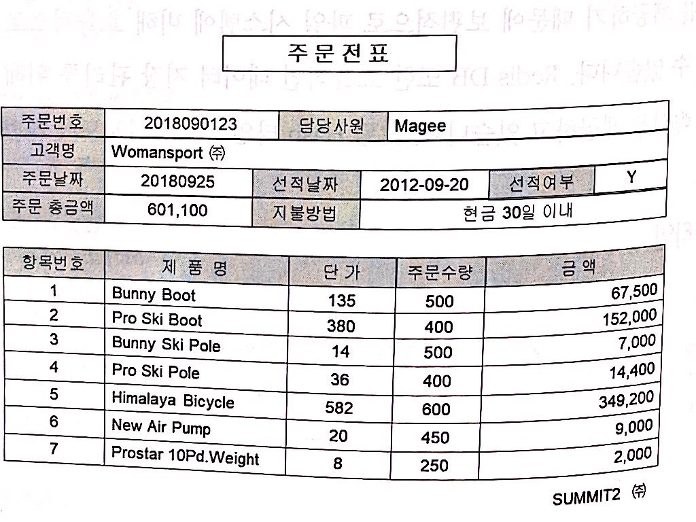

```
$ hmset order:201809123 customer_name "Woman & Sports" emp_name "Manage" total 601100 peyment_type "Credit" order_filled "Y" ship_date 20180925
# Hash 타입은 하나의 Key에 여러 개의 field와 value를 저장할 수 있음

$ hget order:201809123 customer_name
"Woman & Sports"
# hget order:201809123 key에 대한 customer_name 필드와 value 값 검색

$ hget order:201809123 ship_date
"20180925"
# hget order:201809123 key에 대한 ship_date 필드와 value 값 검색

$ hgetall order:201809123
 1) "customer_name"
 2) "Woman & Sports"
 3) "emp_name"
 4) "Manage"
 5) "total"
 6) "601100"
 7) "peyment_type"
 8) "Credit"
 9) "order_filled"
10) "Y"
11) "ship_date"
12) "20180925"
# order:201809123 모든 key에 대한 모든 필드와 value 값 검색

$ hexists order:201809123 product_name
(integer) 0
# product_name 필드가 존재하는지 여부 확인

$ hkeys order:201809123
1) "customer_name"
2) "emp_name"
3) "total"
4) "peyment_type"
5) "order_filled"
6) "ship_date"
# order:201809123 키에 대한 모든 필드명 출력

$ hvals order:201809123
1) "Woman & Sports"
2) "Manage"
3) "601100"
4) "Credit"
5) "Y"
6) "20180925"
# order:201809123 키에 대한 모든 


$ hmget order:201809123 emp_name total
1) "Manage"
2) "601100"

해당 Key에 정의된 특정 필드의 value만 출력
```

#### List 타입

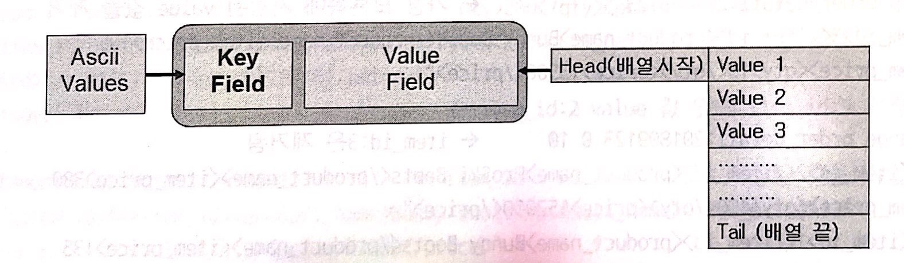

* List 타입은 기존의 관계형 테이블에 존재하지 않은 데이터 유형이며 일반적인 프로그래밍 언어에서 데이터를 처리할 때 사용되는 배열 변수와 유사한 데이터 구조입니다.
* 기본적으로 String 타입의 경우 배열에 저장할 수 있는 데이터 크기는 512M 입니다.
* List 타입의 데이터를 처리할 때는 `lpush`, `lrange`, `rpus`, `rpop`, `llen`, `lindex` 명령어를 사용 합니다.

#### 실습

```
$ lpush order_detail:201809123 "<item_id>1</item_id><product_name>Bunny Boots</product_name><item_price>135</item_price><qty>500</qty><price>67000</price>" "<item_id>2</item_id><product_name>Pro Ski Boots</product_name><item_price>380</item_price><qty>400</qty><price>152000</price>"

$ lpush order_detail:201809123 "<item_id>3</item_id><product_name>ProSki Boots</product_name><item_price>380</item_price><qty>10</qty><price>13500</price>"
# 기존 저장된 데이터의 오른쪽(마지막 인덱스) 부분에 새로운 value 저장

$ rpop order_detail:201809123
# 가장 마지막 인덱스에 저장된 value 제거

$ lrange order_detail:201809123 0 10 
# 0~10 index 값 조회

$ llen order_detail:201809123
# 저장된 value의 count

$ lindex order_detail:201809123 0
# index에 저장된 데이터 검색
```

#### Set 타입

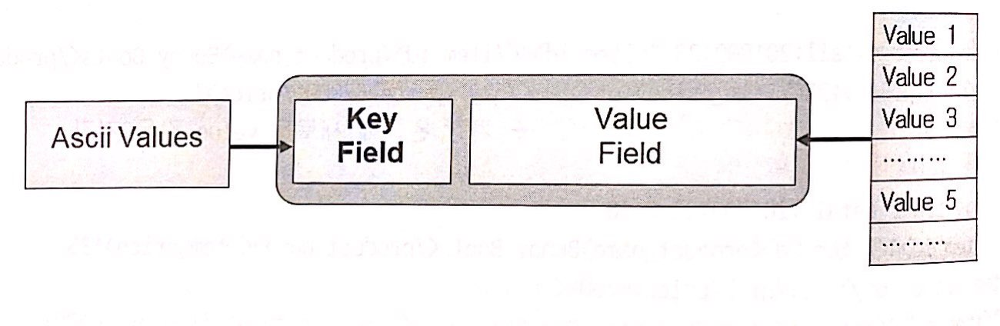

* List 타입은 하나의 필드에 여러 개의 배열 값을 저장할 수 있는 데이터 구조라면 Set 타입은 배열 구조가 아닌 여러 개의 엘리먼트로 데이터 값을 표현하는 구조입니다.
* Set 타입의 데이터를 처리할 때는 `sadd`, `smembers`, `scard`, `sdfiff`, `sunion` 명령어를 사용 합니다.

#### 실습

```
$ SADD product "id:11, product_name:Sky Pole, item_price:55, qty: 100, price:5500" "id:12, product_name:Bunny Boots, item_price:135, qty: 500, price:67000"

$ SADD product "id:13, product_name:Pants, item_price:10, qty: 200, price:2000"

$ SMEMBERS product
1) "id:13, product_name:Pants, item_price:10, qty: 200, price:2000"
2) "id:1, product_name:Bunny Boots, item_price:135, qty: 500, price:67000"
3) "id:11, product_name:Sky Pole, item_price:55, qty: 100, price:5500"
# product에 저장되어 있는 Element 조회

$ SCARD product
(integer) 3
# 저장된 value 개수

# SADD product_old "id:91, product_name:Old Sky Pole"

$ SDIFF product_old product
1) "id:91, product_name:Old Sky Pole"
# product와 product_old 중에 product_old에 만 있는 value 

$ SDIFFSTORE product_diff product prodct_old
# prodct와 product_old 중에 product에 만 있는 value Sets를 product_diff에 저장

$ SUNION product product_old
# product와 product_old를 union한 결과

$ SUNIONSTORE product_new product product_old
# union한 결과를 product_new에 저장

$ SREM product_new "id:11, product_name:Sky Pole, item_price:55, qty: 100, price:5500"
$ 지정해서 제거

$ SADD product.id.index 1 13

```

#### Sorted Set 타입

* Sorted Set 타입은 Set 타입과 동일한 데이터 구조이며 차이점은 저장된 데이터 값이 분류된 상태이며 Sorted Set 타입이고 분류되지 않으면 Set 타입입니다.
* 데이터를 처리할 때는 `zadd`, `zrange`, `zcard`, `zacount`, `zrank`, `zrevrank` 명령어를 사용합니다.


#### Bit 타입

* 일반적으로 사용자가 표현하는 데이터는 문자, 숫자, 날짜인데 이를 Ascii 값이라고 표현하는데 컴퓨터는 이를 최종적으로 0,1로 변환하여저장합니다. Redis에서 제공되는 Bit 타입은 사용자의 데이터를 0,1로 표현하며 컴퓨터가 가장 빠르게 저장할 수 있도록 해석할 수 있도록 표현하는 구조입니다.
* 데이터를 처리할 때는 setbit, gebit, bitaccount 명령어릂 사용합니다.

##### Geo 타입

* Redis DB의 Geo 타입은 위치정보 데이터를 효율적으로 저장 관리할 수 있으며 이를 활용한 위치 정보 데이터 분석 및 검색에 사용할 수 있습니다.
* 데이터를 처리할 때는 `geoadd`, `gerpops`, `geodist`, `georadius`, `geohash` 명령어를 사용합니다.

##### HyperLogLogs 타입

* HyperLogLogs 타입은 관계형 DB의 테이블 구조에서 Check 제약조건과 유사한 개념의 데이터 구조입니다. 관계형 DB에서 check 제약조건을 사용하는 이유는 해당 칼럼에 반드시 저장되오야 할 데이터 값 만을 저장할 수 있또록 제한을 가하는 것입니다. Redis DB에서도 동일하게 특정 필드 또는 엘리먼트에 저장되오야 할 데이터 값을 미리 생성하여 저장한 후 필요에 따라 연결하여 사용할 수 있는 데이터 타입입니다.
* 데이터를 처리할 때는 `pfadd`, `pfcount`, `pfmerge` 명령어를 사용합니다.

## Redis 확장 Module

많은 개발자들이 Redis Server의 소스를 이용한 다양한 기능들을 개발하여 배포하게 되었는데 이를 Redis 확장 모듈 이라고 합니다. 


* REJSON: JSON 데이터 타입을 이요한 데이터를 처리할 수 있는 모듈
* RedisSQL: Redis Server에서 SQLite(관계형 DB)로 데이터를 저장할 수 있는 모듈
* RedisSearch: Redis DB 내에 저장된 데이터에 대한 검색엔진을 사용할 수 있는 모듈

# 트랜잭션 제어 & 사용자 관리

NoSQL로 분류되는 모든 제품이 트랜잭션을 제어할 수 있고 일관성과 공유 기능을 제공하는 것은 아닙니다. 맣은 제품들 중에 관계형 DB의 Commit, Rollback 명령어처럼 트랜젝션 제어가 가능한 제품이 몇되지 않은데 그 중 하나가 Redis 입니다. **하지만 관계형 DB 처럼 Commit, Rollback을 수해앟게 되면 초딩 100,000 ~ 200,000건 이상 데이터의 쓰기와 읽기 작업에 좋은 성능을 기대할 수는 없게 되는 문제점이 발생하게 되는데 이를 보완하기 위해 Redis는 Read Committed 타입의 트랜잭션 제어 타입도 제공하고 있습니다.**

일반적으로 관계형 DB 또는 대부분의 NoSQL 기술은 위 그림처럼 5가지 유형의 락-메커니즘을 제공하는데 Redis 4.0 버전은 데이터-셋 레벨의 락 메커니즘을 제공하고 있습니다.

## CAS (Check and Set)

```
> WATCH         -> 다중 트랜잭션 모니터링 시작
> MULTI         -> 트랜잭션 시작
OK              
> Set 1 jmjoo   
QUEUED          -> 임시 저장
> Sest 2 yhjoo  
QUEUED          -> 임시 저장
>
> EXEC          -> 트랜잭션 종료
Error ....
```
**하나의 트랜잭션에 의해 데이터가 변경되는 시점에 다른 트랜잭션에 의해 동일한 데이터가 먼저 변경되는 경우 일관성에 문제가 발생할 수 있다.** Redis는 이ㅘ 같은 경우 `Watch` 명령어에 의해 트랜잭션을 취소할 수 있습니다.

데이터 일관성과 공유(동일한 데이터를 동시 여러 명의 사용자가 수정, 삭제 하는 경우 발생하는 충돌을 피하기 위한 기술)을 위해서 동시 처리가 발생할 때 먼저 **작업을 요구한 사용자에게 우선권을 보장하고 나중에 작업을 요구한 사용자의 세션에서는 해당 트랜잭션에 충돌이 발생했음을 인지할 수 있도록 해야하는데 이를 Redis DB에서는 CAS 라고 합니다.**


### 실습

```
redis:6379> WATCH a # 다중 트랜잭션이 발생하는지 여부를 모니터링 시작함
OK
redis:6379> MULTI # 트랜잭션 시작
OK
redis:6379(TX)> Set 1 jmjoo
QUEUED # 임시 저장
redis:6379(TX)> Set 2 yhjoo
QUEUED # 임시 저장
redis:6379(TX)> EXEC # 트랜잭션 종료
1) OK
2) OK
```

## commit & rollback

Redis 서버에서 트랜잭션을 사용자가 직접 제어하는 방법입니다. 변경한 데이터를 최종 저장할 때 EXEC, 취소할 때 DISCARD 명령어를 실행합니다.

```
redis:6379> WATCH a
OK
redis:6379> MULTI
OK
redis:6379(TX)> Set 1 jmjoo
QUEUED
redis:6379(TX)> Set 2 yhjoo
QUEUED
redis:6379(TX)> EXEC # 트랜잭션 Commit
1) OK
2) OK

redis:6379> FLUSHALL # 데이터 초기화
redis:6379> MULTI
OK
redis:6379> Set 3 jmjoo
QUEUED
redis:6379> Set 4 yhjoo
QUEUED
>
> DISCARD # 트랜잭션 Rollback
OK
```

## Index 유형 및 생헝

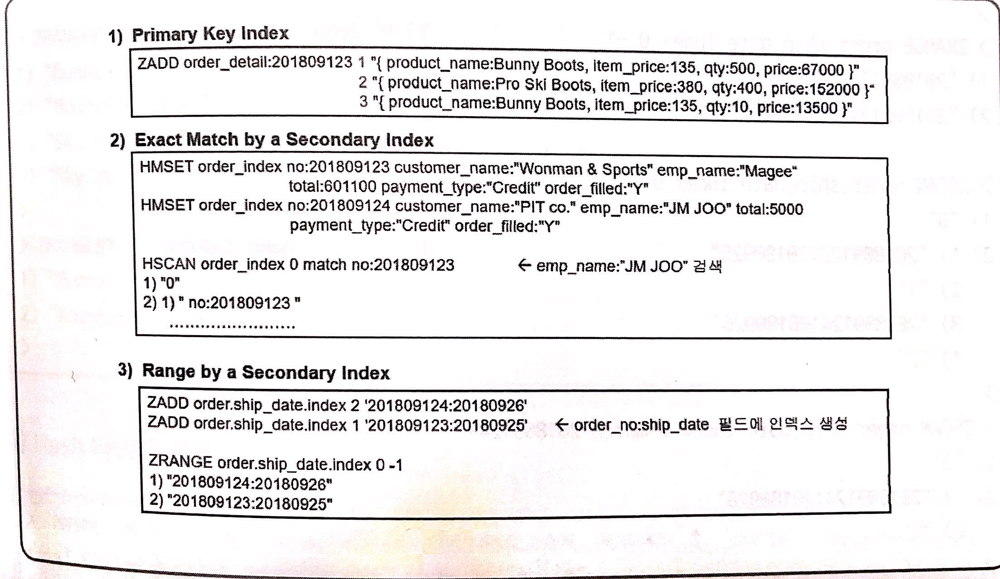

Redis DB는 기본적으로 하나의 Key와 하나 이상의 Field/Element 값으로 구성되는데 **해당 Key에 빠른 검색을 위해 기본적으로 인덱스가 생성됩니다. 이를 Primary Key Index라고 합니다. 또한 사용자의 필요에 따라 추가적인 인덱스를 생성할 수 있는데 이를 Secondary Index라고 합니다.**


인덱스 키를 통해 검색할 때 유일한 값을 검색하는 경우에 `Exact Match By a Secondary Index`라고 하며 일정 범위의 값을 검색 조건으로 부여하는 경우를 `Range By Secondary Index` 라고합니다.

### Sorted Set 타입 인덱스

```
redis:6379> ZADD order.ship_date.index 2 '201809124:20180926'
(integer) 1
redis:6379> ZADD order.ship_date.index 2 '201809123:20180925' # order 테이블, order_no:ship_date 필드에 인덱스 생성
(integer) 1
redis:6379> ZRANGE order.ship_date.index 0 -1
1) "201809123:20180925"
2) "201809124:20180926"
redis:6379> ZSCAN order.ship_date.index 
1) "0"
2) 1) "201809123:20180925"
   2) "2"
   3) "201809124:20180926"
   4) "2"
```

## 사용자 생성 및 인증/보안/Roles

### Access Control 권한
* DBMS의 가장 보편적인 인증 방식으로 미리 사용자 계정과 암호를 생성한뒤 이 계정명과 암호를 정확히 입력하면 사용자를 이증하는 방식 ex `vi redis.config`, `requirepass manager`
* Redis에 접속할때 Access Control을 선탳갛ㄹ 수 있습니다. `vi config`, `masterauth redis123`

### OS 인증 & Internal 인증
* Redis에서는 해당 시스템의 IP-Address로만 접속을 허용하는 Network 인증 방식을 제공합니다. `vi redis.conf`, `bind_ip 192,168.0.10`
* Auth command를 이용하여 인증하는 방법입니다. `auth manager`

# Redis Data Modeling

## 키-벨류 데이터 모델링 개념

### 용어 설명

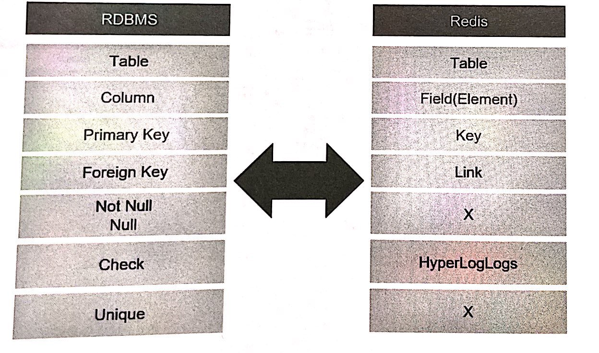
관계형 DB에서 데이터를 저장하는 논리적 구조를 테이블 이라고 펴한하는 것 처럼 키벨류 DB에서도 테이블 이라고 합니다. 하나의 테이블을 구성하고 있는 요소들을 칼럼이라고 표현하는데 키벨류 DB에서는 필드 또는 엘리먼트라고 표현합니다. 하나의 관계형 테이블은 반드시 하나의 식별키의 필드 또는 엘리먼트로 구성됩니다. 관계형 테이블은 NOT NULL, CHECK, UNIQUE와 같은 제약조건을 통해 원치않은 데이터가 특정 칼럼에 지정되는것을 방지할 수 있지만 키벨류 DB는 이와 같은 케약조건 기능을 제공되지 않고 있습니다. 다만 관계형 DB에서 CHECK 조건을 만족하는 데이터 만을 저장장 하기 위해 사용되는 것처럼 키벨류 DB는 `HYPRELOGLOGS` 데이터 속성을 통해 조건의 데이터를 저장, 관리할 수 있습니다. 

### Redis 데이터 모델링 가이드라인

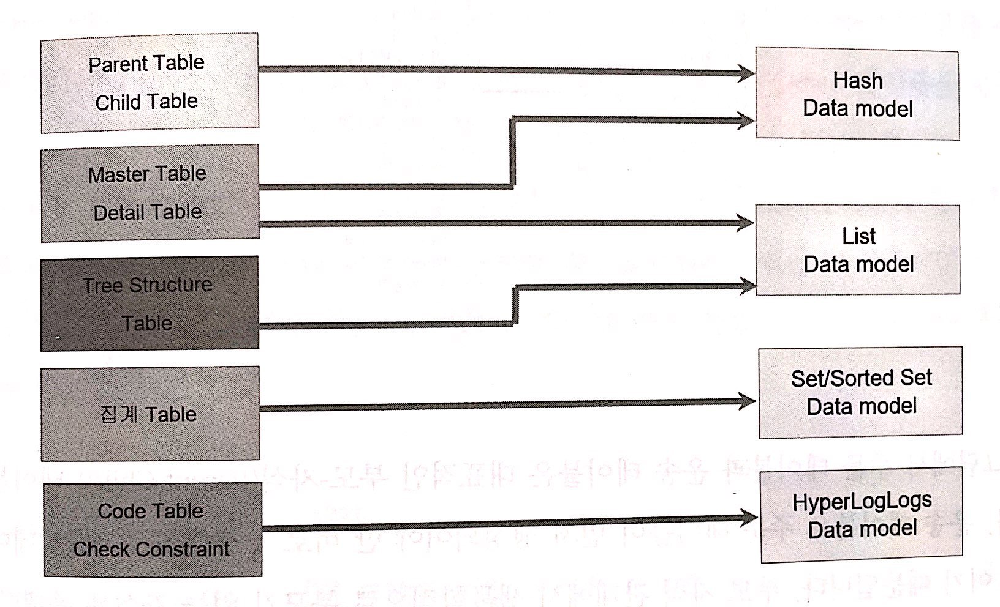

#### Hash 데이터 모델

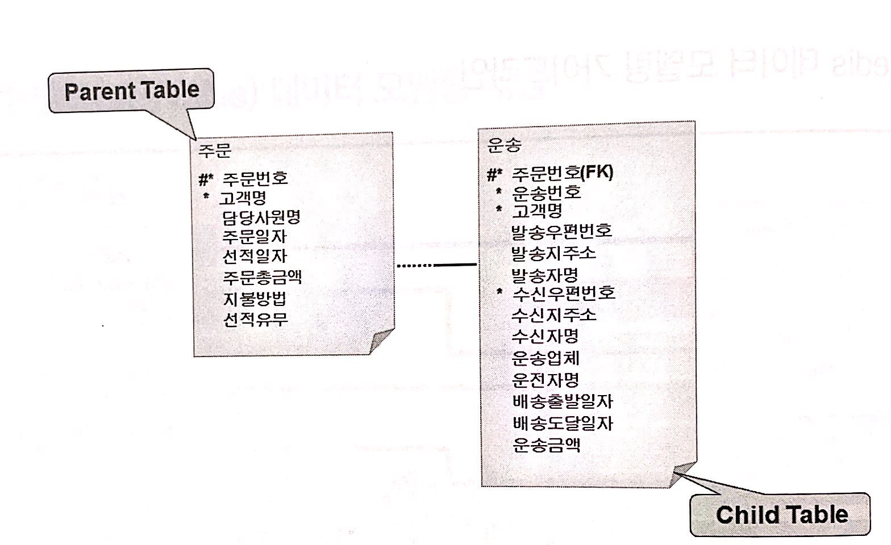

Redis의 Hash 데이터 모델과 가장 유사한 관계형 DB의 데이터 모델은 부모-자식 테이블에 해당됩니다. 운송 테이블은 주문 테이블이 먼저 생성되어야 만 비로서 생성될 수 이쓴ㄴ 데이터 구조이기 때문입니다. 즉 부모가 있어야만 자식이 존재할 수 있는 구조입니다. 이런 데이터 관계를 Redis에서는 Hash 모델을 사용합니다.

#### List 모델 테이블 

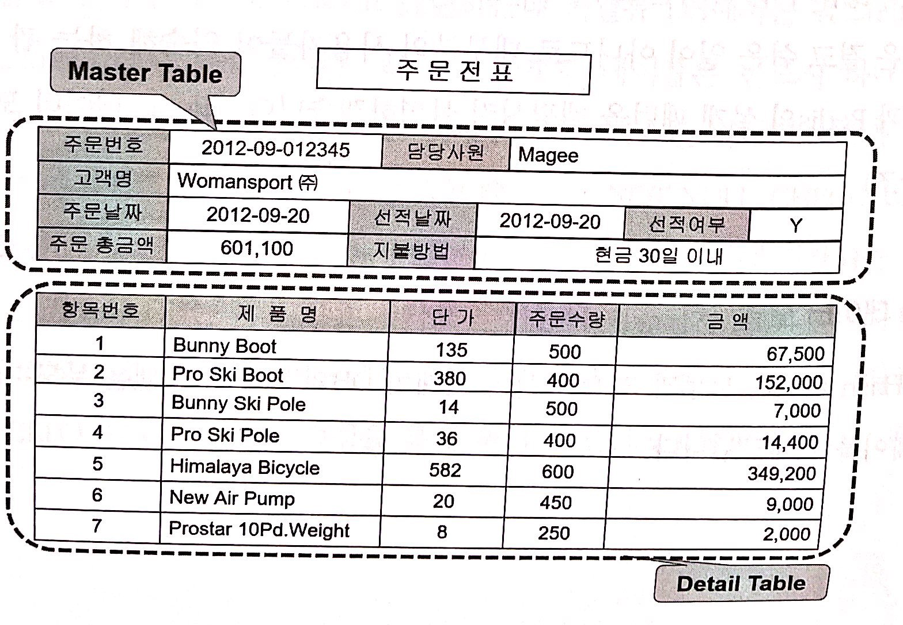

관계형 DB의 모델은 마스터-디테일 테이블에 해당 됩니다. 위 그림처럼 주문전표를 관계형 DB의 분석/설계 과정을 거치면 주문 공통 테이블과 주문 상세 테이블로 설계할 수 있는데 이 과 같은 구조를 마스터-디테일 관계 테이블 이라고 합니다. **이과 같은 데이터 관계를 Redis DB에서 구현할 때 `Hash-List` 모델을 선택합니다.**


#### Set/Sorted 데이터 모델

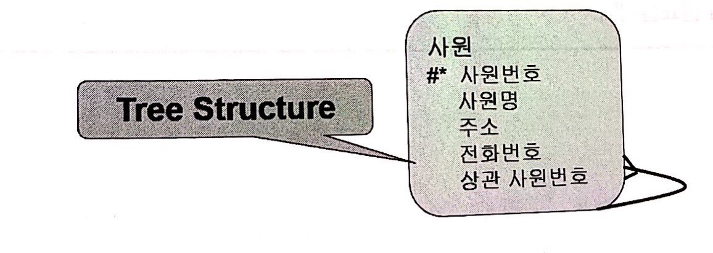

Redis의 Set/Sorted Set 데이터 모델과 가장 유사한 관계형 DB의 데이터 모델은 계층형 테이블에 해당 됩니다. 위 그름에서 사원 테이블은 사원번호가 식별-키이며 상관사원번호 칼럼은 같은 테이블 내에 식별-키인 사원번호를 참조하는 관계형 구조를 가지고 있습니다. 이와 같은 데이터 구조를 관계형 DB에서 `Self-Reference` 관계형 테이블이라고 표현하는데 Redis DB에서 구현할 때 `Set/Sorted Set` 모델을 선택하시면 됩니다.


#### HperLongLogs 데이터 모델

Redis에 `HperLongLogs` 데이터 모델과 가장 유사한 관게형 DB의 데이터 모델은 Check-제약조건에 해당됩니다. 일반적으로 관계형 테이블의 특정 칼럼에 제한된 값만 정해야 하는 경우 3가지 방법을 통해 구현할 수 있습니다. 애플리케이션에서 데이터를 조정하는 방법, 특종 조건 데이터 값을 임의의 테이블에 미리 저장한 이후 해당 테이블에 데이터를 입력 및 수정할 때 임이의 테이블과 식별키와 외부키로 검증하는 방식 입니다. 임시 테이블을 만드는 방식이 `HperLongLogs`dhk rkxdms qkdtlrdlqslek.


### 데이터 모델

Redis 서버에서 설계할 수 있는 데이터 모델 유형은 크게 5가지가 있습니다. 

1. Hash-Hash Data Model
2. Haash-List Data Model
3. List-List Data Model
4. Set/Sorted Set List Data Model
5. HyperLogLogs Data Model

#### Hash-Hash Data Model
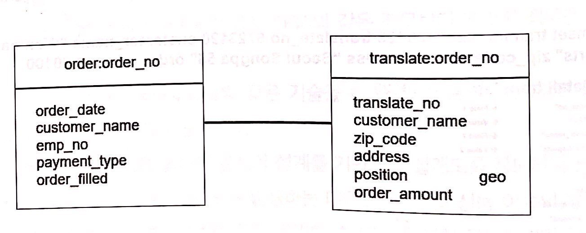

위 그림과 같은 구조를 Redis DB의 Hash-Hash 데이터 모델로 표현할 수 있습니다.

```
redis:6379> hset order:201809123 customer_name "Woman & Sports" emp_name "Message" total 60110 payment_type "Credit" order_filled "Y"
(integer) 5
redis:6379> hgetall order:201809123
 1) "customer_name"
 2) "Woman & Sports"
 3) "emp_name"
 4) "Message"
 5) "total"
 6) "60110"
 7) "payment_type"
 8) "Credit"
 9) "order_filled"
10) "Y"
redis:6379> hmset translate:2020180912320 translate_no 672310 customer_name "Woman & Sports" zip_code 15881 address "Seoul Songpa 58" order_amount 60100
OK
redis:6379> hgetall translate:2020180912320
 1) "translate_no"
 2) "672310"
 3) "customer_name"
 4) "Woman & Sports"
 5) "zip_code"
 6) "15881"
 7) "address"
 8) "Seoul Songpa 58"
 9) "order_amount"
10) "60100"
```

#### Haash-List Data Model

#### List-List Data Model

#### Set/Sorted Set List Data Model

#### HyperLogLogs Data Model

## 논리적 DB 설계


기본적으로 논리적 데이터 베이스를 16개를 생성할 수 있는데 필요에 따라 더 많은 수의 데이터베이스를 생성할 수도 있습니다. 여러 개의 데이터베이스를 설계 및 생성해야하는 이유는 다음과 같습니다.

사용자가 생성하는 수십~수백개의 테이블은 데이터 성격, 비지니스 룰, 관리 방안, 성능이수에 따라 여러 개의 논리적 DB에 분산 저장하는 것이 원칙입니다. 이와 **같은 분산 저장기술을 스트라이핑** 기법이라고 하며 가장 보편적인 설계 및 저장 기술입니다. 

데이터베이스 기술은 데이터를 입력, 수정 삭제, 조회할 때 발생하는 **다양한 락 현상으로 인해 성능 이슈가 발생할 수 있습니다.** 이를 최소화하기 위해서는 논리적으로 어러 개의 데이터베이스로 분산 설계하고 구축하는 것이 좋습니다. 

## swapDB 설계

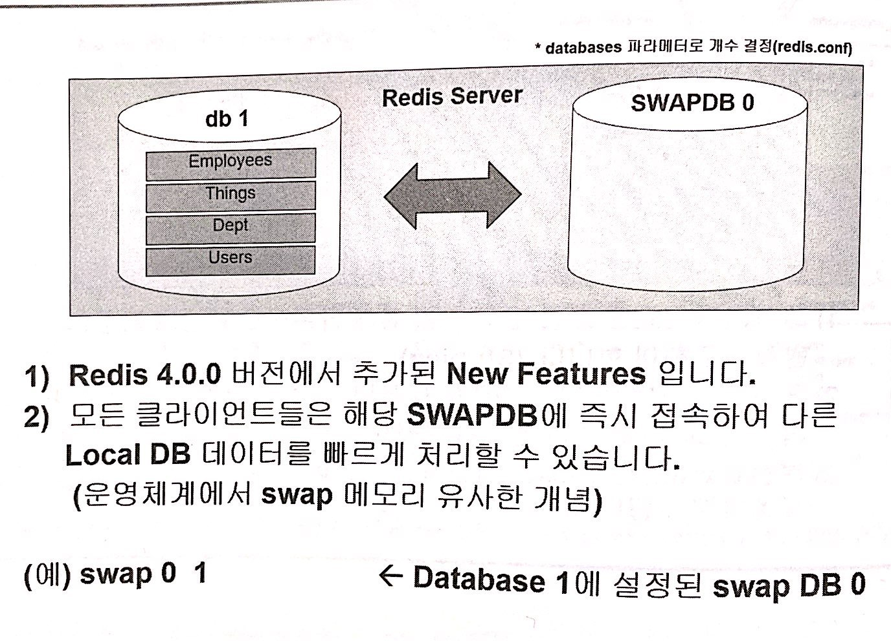

Redis는 인-메모리 기반의 데이터 처리 및 저장기술로 수만~수십 만 건의 데이터를 저장할 수 있으며 동시 읽기 작업을 통해 빅데이터 분석 및 가공 처리를 목적으로 사용되는 기술입니다. 이런 경우 메모리 부족으로 인한 일시적인 성능 지연 문제들이 발생할 수 있습니다. 이를 보완하기 위해 Redis 4.0 부터는 swapDB 기능을 제공하고 있씁니다. 이는 기존 관계형 데이터베이스에서 제공하는 ㅇ미시 테이블페이스 또는 임시 데이터베이스와 유사한 구조 입니다.

# 5 Redis 아키텍처

## Redis 아키텍처

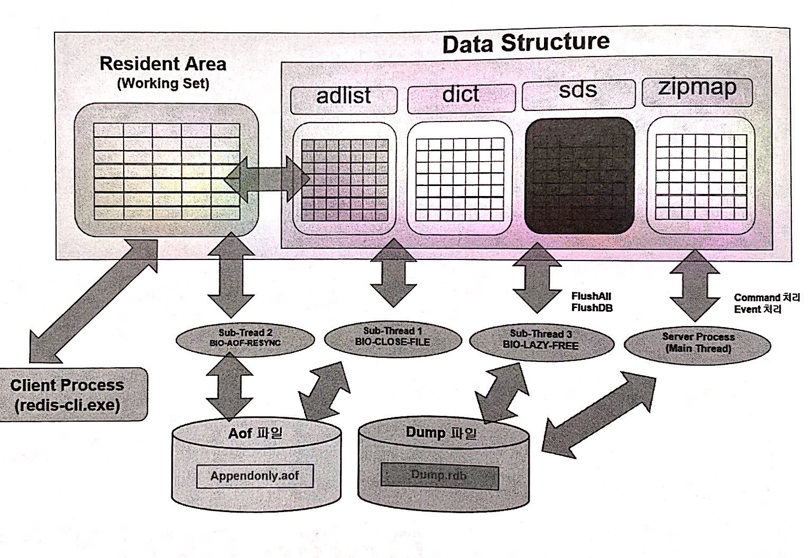

Redis 서버의 기본 아키텍처는 3가지 영역으로 구성되어 있습니다.

### 메모리 영역
* Resident Area: 이 영역은 사용자가 Redis 서버에 접속해서 처리하는 모든 데이터가 가장 먼저 저장 저장더ㅣ는 ㅇ영역이며 실제 작업이 수행되는 공간이고 WorkingSet 영역이라고 표현 합니다.
* Data Structure: Redis 서버를 운영하다 보면 발생하는 다양한 정버와 서버 상태를 모니터링하기 위해 수집한 상태 정보를 저장하고 관리하기 위한 메모리 공간 입니다.

### 파일 영역
* AOF 파일: 중요한 데이터의 경우 사용자의 필요에 따라 지속적으로 저장해야 할 필요가 있는데 이를 위해 제공되는 디스크 영역이 AOF 파일입니다.(스냅샷 데이터)
* DUMP 파일: AOF 파일과 같은 사용짜 데이터를 디스크 상에 저장할 수 있지만 소량의 데이터를 일시적으로 저장할때 사용되는 파일입니다.

### 프로세스 영역
* Server Process: `redis-server.exe`, `redis-setinel.exe` 실행 코드에 의해 활성화되는 프로세스를 서버 프로세스라고 하며 Redis 인스턴스를 관리해 주며 사용자자가 요구한 작업을 수행하는 프로세스 입니다. **Redis Server 프로세스는 4개의 멀티 쓰레드로 구서성되는데 `main thread`, `sub thread 1(BIO-Close-File)`, `sub thread 2(BIO-AOF-Resync)`, `sub thread 3(BIO-LAZY-Free)` 입니다.**
* Client Process: `redis.cli.exe` 또는 사용자 애플리케이션에 의해 실행된느 명령어를 실행하기 위해 제공되는 프로세스 입니다.

### 멀티 쓰레드
1. `main thread` : 해당 스레드는 Redis 서버에 수행되는 대부분의 명령어와 이벤트를 처리하는 역활을 수행
2. `sub thread 1(BIO-Close-File)`: AOF에 데이터를 Rewirte할 때 기존 파일을 close하고 새로운 AOF 파일에 Write할 때 사용됩니다.
3. `sub thread 2(BIO-AOF-Resync)`: AOF에 쓰기 작업을 수행할 때 사용됩니다.
4. `sub thread 3(BIO-LAZY-Free)`: `UNLINK`, `FLUSHALL`, `FLUSHDB` 명령어를 실행할 때 따른 성능을 보장하기 위해 백그라운드에서 사용됩니다.


```
redis:6379> info MEMORY
# Memory
used_memory:872248 # 현재 할당된 Redis 서버 크기
used_memory_human:851.80K # 사용자가 사용중인 Redis 메모리 크기
used_memory_rss:7643136
used_memory_rss_human:7.29M
used_memory_peak:936616 # Redis에 할당되있던 최데 메모리 크기
used_memory_peak_human:914.66K
used_memory_peak_perc:93.13%
used_memory_overhead:830440 # 사용자 메모리 킈기에 대한 orverhead
used_memory_startup:809824 # 최초 할당되었던 Redis 메모리 크기
used_memory_dataset:41808 # 사용자 데이터가 ㅓ장된 메모리 크기
used_memory_dataset_perc:66.97%
allocator_allocated:864056
allocator_active:1130496
allocator_resident:3493888
total_system_memory:2085687296 # 시스템 모미리 총 크기
total_system_memory_human:1.94G # 사용자가 사용 가능한 메모리 크기
used_memory_lua:37888
used_memory_lua_human:37.00K
used_memory_scripts:0
used_memory_scripts_human:0B
number_of_cached_scripts:0
maxmemory:0 # maxmemory 파라미터에 설정된 메모리 크기
maxmemory_human:0B # 사용자가 실제 사용 가능한 Redis 크기
maxmemory_policy:noeviction
allocator_frag_ratio:1.31
allocator_frag_bytes:266440
allocator_rss_ratio:3.09
allocator_rss_bytes:2363392
rss_overhead_ratio:2.19
rss_overhead_bytes:4149248
mem_fragmentation_ratio:9.19 # 메모리 단편화 상태율
mem_fragmentation_bytes:6811904
mem_not_counted_for_evict:0
mem_replication_backlog:0
mem_clients_slaves:0
mem_clients_normal:20504
mem_aof_buffer:0
mem_allocator:jemalloc-5.1.0
active_defrag_running:0
lazyfree_pending_objects:0
lazyfreed_objects:0
```


## 시스템 & Disk 사양

| 내용                 | 최소사양 | 권장사양     |
| -------------------- | -------- | ------------ |
| of nodes per cluster | 3 nodes  | >= 3nodes    |
| of coress per node   | 4 cores  | >= 8nodes    |
| RAM                  | 15GB     | >= 30 GB     |
| storage              | SATA     | SSD          |
| Persistent           | Storage  | RAM 크기 * 3 | >= RAM 크기 * 6 |
| Network              | 1G       | >= 10G       |

### 노드수 (of nodes per cluster)

마스터와 1대와 슬레이브 1대는 이중 복제이기 때문에 크리티컬한 비지니스 환경에서는 필요에 따라 삼중 복제 시스템이 요구될 수 도 있습니다. 결론적으로 스탠드얼론 또는 클러스터 서버를 구축하는 경우 하나의 복제 시스템 구축을 위해서 요구되는 최소 서버 대수는 마스터 서버 1대, 슬레이브서버 1대, 센티럴 서버 1대로 구성되어야 합니다.

### CPU Core 수 (of coress per node)

초당 10만건~20만건 이상의 데이터를 빠르게 쓰기/읽기/ 작업을 수행하는 비지느스 환경에서는 일반적으로 CPU Core 수가 몇 개 이상이어야한다는 정답은 없지만 최소 가이드는 다음과 같습니다.

* Small Business: 환경: 4 Core 이하
* Medium Business: 환경: 4 Core ~ 8 Core
* Big Business: 환경: 8 Core ~ 16 Core

### RAM 크기

Redis 서버를 위한 최소 권장 사양은 14~15GB 입니다. 이 크기는 하나의 시스템이 총 16GB 메모리 크기를 가지고 있다면 기중 90~95% 공간을 Redis 서버가 사용할 수 있어야 한다느 것을 의미합니다.

* Small Business: 환경: 16GB 이하
* Medium Business: 환경: 32GB ~ 64GB
* Big Business: 환경: 64 GB ~ 128 GB

#### 스토리지 타입
빅데이터 플랫폼 환경은 어떤 환경보다 많은 데이터를 빠른 시간 내에 처리 해야하는 것이 목표이기 때문에 SSD 타입의 저장장치 사용을 적극 권장합니다. 하지만 Redis 서버의 아키텍처는 인 메모리 기반이므로 스토리지에 장치에 과도한 비중을 둘 필요는 없습니다.

#### 스토리지 크기 (Persitent Storage)

* 최소 스토리지 크기 = 사용자 데이터의 총 크기 + (RAM 크기 * 3)
* 권장 스토리지 크기 = 사용자 데이터의 총 크기 + (RAM 크기 * 6)

#### 네트워크

Redis 서버를 웅ㄴ형 하기 위해 요구되는 최소 네트워크 환경은 1G 환경이며 권장 환경은 10G 이상입니다.

## 메모리 운영 기법

Redis 서버도 사용자의 필요에 따라 중요한 데이터를 디스크 저장 장치에 DUMP. AOF 형태로 저장할 수 있습니다. 하지만 파일 시스템 기반의 젖아 관리 메커니즘과는 기본 동작 방식이 많이 다르기 때문에 파일 시스템 기반이라는 표현을 하지는 않습니다.

Redis 서버는 인-메모리 기반의 데이터 저장 관리기술을 제공하지만 시스템 모키리 크기는 제한적일 수 밖에 없고 상대적으로 사용자 데이터는 이보다 훨씬 더 클 수밖에 없습니다. 그러기 때문에 모든 데이터를 메모리에서 저장 관리할 수 없습니다. 이런 문제를 해결하기 위해서 `LUR`, `LFU` 알고리즘이 4.0 부터 제공하고 있습니다.

### LRU (Last Recently Used) 알고리즘

LRU 알고리즘은 가장 최근에 처리된 데이터를 메모리 영역에 최대한 재 배치시키는 알고리즘 입니다. 즉 사용할 수 있는 메모리 크기는 정해져 있는데 그 공간에 데이터를 저장해야 한다면 가장 최근에 엡력,수정, 삭제 조회된 데이터를 저장하고 오래전 처리된 데이터는 메모리부터 제거하여 최근 사용된 데이터들이 최대한 메모리 상에 존재할수 있도록 운영하는 것입니다.

### LFU (Last Frequently Used) 알고리즘

자주 참조되는 데이터 만 배치하고 그렇지 않은 데이터들을 메모리부터 제거하여 자주 참조되는 데이터들이 배치될 수 있도록 운영하는 방법 LFU 알고리즘 이라고 합니다.


## LazyFee 파라미터

Redis 인스턴스에게 할당된 메모리 영역이 최대 임계치 도달하게 되는데 이 경우, 연속적인 범위 키 값이 동시에 삭제되는 오퍼레이션이 실행되면 메모리 부족과 프로세스의 지연 처리로 인해 성능 지연문제가 발생하게 됩니다.

이와 같은 성능 지연 문제를 해소할 수 있는 방법은 Redis 인스턴슬 위한 메모리 영역의 크기를 충분히 할당하는 것과 **LazyFee 파라메터를 설정해 주는 것입니다. LazyFee 파라메터는 별도의 백그라운드 쓰레드를 통해 입력과 삭제 작업이 지연되기 않고 연속적으로 수행될 수 있도록 해 줍니다.** LazyFee 쓰레르 앞서 Redis 아키텍처에서 소개되었던 서버 프로세스의 4개의 쓰레드중 하나입니다.

```
vi redis_5000.conf

lazyfee-lay-eviction        no # yes 권장 (unlink로 삭제하고 새 키 저장)
lazyfee-lay-expire          no # yes 권장 (unlink로 만기 된 키 삭제)
lazyfee-lay-server-del      no # yes 권장 (unlink로 데이터 변경)
slave-lazy-flush            no # yes 권장 (복제 서버가 삭제 후 복제할 때 FlashAll async 명령어로 삭제)
```

### lazyfee-lay-eviction

메모리 영역이 Full 되었을 때 연속적으로 범위의 Key 값을 삭제하면 기존 메모리 영역에 저장되 있던 데이터는 DEL 명령어에 의해 삭제하는데 이 작업은 **서버 프로세스의 main thread에 의해 실행되면서 블로킹 현상이 발생합니다. 이 값을 `YES`로 설정하면 DEL명령어가 아닌 UNLINK 명령어가 실행되고 서버 프로세스의 `sub tread 3`에 백그라운드에서 수행되기 때문에 블로킹 현상을 피할 수 있게 됨으로써 성능을 향상시킬 수 있습니다.** 

### lazyfee-lay-expire

`EXPIRTE` 명령어를 실행하면 메모리 상에 무효화된 키 값을 삭제하는데 내부적으로 DEL 명령어가 실행되면서 블로킹 현상이 일어난다. **이 값을 `YES`로 설정하면 `UNLINK` 명령어가 실행되면서 블로킹 현상을 피할 수 있습니다.**

### lazyfee-lay-server-del

메모리 상에 이미 저장되어 있는 키 값에 대해 `SET` 또는 `RENAME` 명령어를 실행하면 내부적으로 DEL 명령어가 실핻되면서 블로킹 현상이 발생합니다. 이를 피하기 위해서는 파라미터 값을 `YES`로 설정 해야 합니다.

### lazyfee-lay-flush

Master-Slave 또는 `Partition-Replication` 서버 환경에서 복제 서버는 마스터 서버의 데이터를 복제할 때 변경된 부분에 대해서 만 부분 복제하는 경우도 있지만 때에 따라서는 **기본 데이터를 모두 삭제한 후 다시 복제하는 경우도 있습니다. 이 경우, 기존 복제 데이터를 빠른 ㅣ간 내에 삭제하고 동시에 다시 복제 작업을 빠르게 수행해야합니다. 이때 이 값을 `YES`로 설정하면 빠른 동기화 작업을 수행할 수 있습니다.**

## 데이터 Persistence

사용자의 필요 에 따라 숮용한 데이터를 지속적으로 저장관리해야 할 필요거 있는데 이와같으 경우 디스크 저장 장치에 파일을 저장할 수 있습니다. 또한 Redis 서버를 재시작한 후 파일에 저장해둔 데이터를 다시 메모리 업-로드 할 수 도 있습니다. 데이터를 지속적으로 저장하는 방법에는 다음과 같은 `SAVE` 명령어를 이용하는 방법과 `AOF` 명령어로 저장하는 방식이 있습니다.

### RDB(SnapShot) 파일을 이용하여 저장하는 방식

```
redis:6379> keys *
1) "translate:2020180912320"
2) "order:201809123"
redis:6379> save
OK
redis:6379>

/data/dump.rdb
```


`SAVE` 명령어를 이용하여 일정 주기 마다 일정한 개수의 Key 데이터-셋 r값을 dump.rdb 파일로 저장하는 방법 입니다. **사용자가 저장 주기와 저장된 단위를 결정할 수 이쏙 시스템 자원이 최소한으로 요구된다는 최대 강점이 있지만 데이터를 최종 저장한 이후 새로운 저장이 수해되는 시점 전에 시스템 장애가 발생하는 경우 데이터 유실이 발생할 수 있기 때문에 지속성이 떨어지는 단점이 있습니다.**

### AOF(Append Only File) 명려어를 이용하여 저장하는 방법

AOF 명령어를 이요해서 디스크 상에 `appendonly.aof` 파일로 저장하는 방법입니다. 이 방법은 `redis-shell` 상에서 `bgrewriteaof` 명령어를 실행한 이후 입력, 수정, 삭제 도니느 모든 데이터를 저장해 줍니다.

### 비교

AOF | RDS
----|----
시스템 자원이 집중적으로 요구 | 시스템 자원이 최소한으로 요구
마지막 시점까지 데이터 복구 가능 | 지속성이 떨어짐
대용량 데이터 파일로 복구 작업시 복구 성능이 떨어짐 | 복구 시간이 빠름
저장 공간이 압축되지 않기 때문에 데이터 양에 따라 크기 결정 | 저장 공간이 압축되기 때문에 최소 필요

## Copy on Write

**메모리 상에 로더되어 있든 데이터를 하나의 부모 프로세스가 참조하고 있는 와중에 자식 프로세스가 동시에 참조 관계를 가지게 되는 경우 서버 프로세스는 별도의 젖아관에 이를 복제하게 되는데 이와 같은 경우를 `Copy on Write`라고 표현합니다.** `Copy on Write` 가 빈번하게 발생하게 되면 해당 오퍼레이션은 지연되며 이는 Redis Server 전체의 성능 지연 문제로 이어집니다. 이런 문제가 발생하지 않도록 데이터를 처리하고 설사 발생했다 허더라도 지연 문제가 덜 발생하고 빨리 해소될 수 있드록 충분한 메모리 영역을 확보하는 것도 매우 중요한 성능 포인트 입니다. 다음은 `Copy on Write`가 발생하는 경우들 입니다.

### SAVE 파라메터에 의해 주기적으로 RDB 파일을 생헝 할때

`SAVE` 명령어를 또는 관리 파라메터는 Redis 워킹세트 영역에 저장되어 있는 데이터를 디스크 dump.rdb 파일로 저장할 때 사용됩니다. 이 경우는 `Copy on Write`가 발생하는 대표적인 경우라고 볼 수 있습니다. 

### BGSAVE 명령어에 의해 RDB 파일로 저장할 때

`SAVE` 명령어와 함께 `BGSAVE` 명령어로 동일한 방법으로 `Copy on Write`가 발생합니다.

### BGREWRITEAOF 명령어의 의해 AOF 파일을 저장할 때

`SAVE`, `BGSAVE는` `dump.rdb` 파일에 쓰기 작업이 발생한다면 `BGREWRITE`는 `appendonly.aof` 파일에 쓰기 작업이 발생하는 경우이며 `Copy on Write`가 발생합니다.

### auto-aof-rewirte-percentage 파라미터에 의해 AOF 파일을 재정할 할 때 

AOF 파일이 가득 채워진 상태에서 계속저긍로 데이터를 저장하는 경우, AOF 파일을 비우고 처음부터 다시 쓰기 작업을 수행하는 경우도 발생합니다. 성능 이슈가 발생하는 비지니스 환경에서 해당 파라미터의 적극적인 사용은 권장하지 않습니다.

### Master-Slave, Partition-Replication Server 환경으로 구동 할 때

Master-Slave, Partition-Replication Server 환경에서는 Master 서버의 데이터를 Slave 서버에 복제 할 때 `Copy on Write`가 발생합니다. 

## 관리 명령어

Parameter | 설명
----------|---
info | Redis Server의 현재 상태 확인
select | Redis Server 내에 생성되어 있는 DB로 Switch 할 때
dbsize | 현재 데이터베이스에 생성되어있는 Keys | tn
swapdb | 현재 데이터베이스에 할댕할 swap DB 생성
flushall / flushdb | 현재 생성되어 있는 모든 Keys /DB | tkrwp
client list / client getname / cluent kill | 현재 Redis Server에 접속되어 있는 Client 조회 / Client 명 조회 / Client 제거
time | Redis Server의 현재 시간