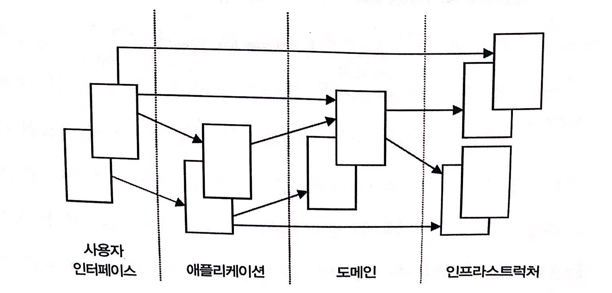

> [도메인 주도 설계란 무엇인가](http://www.yes24.com/Product/Goods/5445597)를 보고 정리한 내용입니다.

# 도메인 주도 설계

## 계층형 아키텍처
소프트웨어 애플리케이션을 만들때, 응용 시스템의 상당 부분은 도메인과 직접적인 관련이 없다. 오히려 인프라스트럭처나 소프트웨어를 지원하는 제반 환경에 대한 것들이 소픝웨어의 큰 부분을 차지한다. 도메인이 다른 부분에 비해 상대적으로 작은 부분이 되기도하다.

위 그림처럼 도메인과 관련된 코드가 다른 레이어와 썩여 있다면, 다른 사람이 코드를 읽고 이해하기 매우 어렵다. 따라서 복잡한 프로그램을 **레이어** 로 분할해야 한다. 각 레이어는 내부에서 설계를 숳ㅇ하여 응집도를 높이고 자기 하위 레이어만 의존하도록 만들어야 한다. 또한 상위 레이어에 대한 결합도를 찾추려면 표준적인 아키텍처를  패턴을 따라야한다. 하나의 레이어에 도메인 과 관련된 모든 코드를 집중시켜서, 사용자 인터페이스, 애플리케이션, 인프라스트럭처 코드로부터 독립적으로 만들어야 한다. **도메인 객체들은 스스로 정보를 보여주고 저장하고 애플리케이션 작업을 관리하는 등의 부가적인 책임에서 자유롭게 두고, 대신 도메인 모델 자체를 표현하는 것에만 집중할 수 있도록 한다.**

레이어 주도 설계를 위한 공통 아키텍처 수준의 해결은 다음 네가지 개념적 레이어를 포함한다.

레이어 이름| 설명
-------|---
사용자 인터페이스 | 사용자에게 정보를 보여주고 사용자이 명령을해서하는 책임을 진다.
애플리케이션 레이어 | 애플리케이션 활동을 조율하는 얇은 레이어다. 업무 로직을 포함하지 않는다. 비지니스 객체의 상태를 보관하지 않지만. 애플리케이션 작업의 처리 상태는 보관한다.
도메인 레이어 | 도메인 정보를 포함한다. 업무 소프트웨어의 심장에 해당한다. 비지니스 객체의 상태를 포함한다. 비지니스 객체와 이 객체의 상태 정보중가능한 부분의 영속성에 대한 책임은 인프라스트럭처 레이어로 위임된다.
인프라스트럭처 레이어 | 다른 레이어 모두를 지원하는 라이브러리로 동작한다. 레이어 간의 통신을 제공하고 비지니스 객체의 영속성을 구현하고 사용자 인터페이의 라이브러리를 포함한다.

애플리케이션을 분할된 레이어로 나누고 레이어 간의 상호작용 규칙을 수립하는 일은 중요하다. **코드가 레이어로 깔끔하게 분할되지 않는다면 순간에 서로 매우 밀접하져서, 변경하고 관리하기가 어려워진다.** 한 영역에 속한 코드의 한 부분에서 단순한 변경이 하나 일어나면, 다른 영역에 기대하지 않았고 바라지도 않았던 결과가 일어날것이다. **도메인 레이어는 핵심 도메인 이슈에만 집중해야 한다. 인프라스트럭처의 해동에 관여해서는 안된다.**

## 엔티티
소프트웨어가 여러 사앹를 거치는 동안에도 동일한 값을 유지하는 식별자를 지닌 유형의 객체가 있다. 객체지향 언어들은 객체의 인스턴스를 메모리에 보관하고 각 객체에 참ㅈ나 메모리 주소를 할당한다. 이 참조는 특정 시점에서는 각 객체에 대해 유일하다. **하지만 이 참조가 계속 유지되디라는 보장은 없다. 사실은 그 반대다. 객체들은 메모리에 생성되었다가 사라지기를 반복한다.**
이러한 문제를 해결하기 위해서 영속화를 시켜야한다. 엔티티란 식별 가능한(메모리에서 사라지더라도) 값을 가지고 영속성을 가진 객체를의미한다.

## 값 객체
하나의 객체가 도메인의 어떠한 측면을 표현하는 데 사용되지만, **식별자가 없는** 경우이며, 우리는 이것을 값 객체라고 부른다.

엔티티 객체와 값 객체를 구분할 필교가 있다. 통일성을 위해 모든 객체를 엔티티를로 만들어 버리는 것은 그다지 도움되지 않는다. **엔티티의 정의에 부합하는 객체만을 엔티티로 선택하기를 권한다. 그리고 나머지는 값 객체로 만들어라**

**식별자가 없는 값 객체는 쉽게 생성되고 폐기할 수 있다. 아무도 식별자의 생성에 신경 쓰지 않아도 되고, 해당 객체가 더 이상 참조 되지 않는 시점에 이르면 가비지 콜렉터가 소멸 시킬 것이다.** **그래서 값 객체는 설계를 매우 단순하게 만든다. 값 객체는 수정할 수 없게 만들어야 한다.** 생성자를 통해 값 객체를 생성하고 나며 생명 주기 동안 상태가 변경되지 않는다 다른 값을 지닌 객체가 필요하다면 다른 값 객체를 하나 만들기만 하면된다. 수종은 불가능하며 식별자가 없는 값 객체는 공유될 수 있다. 변경 불가능한 객체는 중요한 성능 문제를 함께 해결할 수 있고, 데이터 무결성 같은 무결성 문제를 명학하게 드러낸다.

## 서비스
우리가 도메인을 분석하여 모델을 구성하는 주요 객체를 정의하려고 할 때 도메인의 어떤 부분들은 객체로 쉽게 매핑될 수 없다는 사실을 발견하게 된다. 객체는 속성과 객체가 관리하는 내부 상태 정보와 밖으로 드러나느 행위를 가지고 있다. 유비쿼터스 언어를 정의할 때 도메인의 핵심 개념이 나타나면 명사는 쉽게 객체로 매핑할 수 있다. 명사와 연건되어 해당 객체의 행위를 나타내는 동사는 보통 객체의 행위 부분이 된다. 그러나 **도메인의 행위 가운데 어떤 행동이나 일부 동사는 어느 객체어도 속하지 않는다.** 그들은 도메인의 아주 중요한 행동이어서 가볍게 무시하거나 간단히 하나의 엔티티 혹은 값 객체에 집어넣어 버릴 수도 없다. **이러한 행위를 어떤 객체에 추가하면 그 객체에 속하지도 않은 기능을 추가하는 셈이라 결과적으로 그 객체를 망칠 수 있다.**

**그럼에도 불구하고, 객체지향 언어를 사용할 때에는, 우리는 객체를 행위를 포괄하는 용도로 사용해야만 한다.** 그 기능을 그 제차로만 따로 때어놓고 선언할 수는 없다. **행위는 한 객체에 포함되어야만 한다.** 때때로 이런 유형의 행위가 여러개의 서로 다른 클래스의 객체에 걸처서 동작하기도한다.

예를 들어 한 계좌에서 다른 계좌로 돈을 보내는 경우를 생각해보자. 이러한 기능은 보내는 계좌와 받는 계좌 중 어느 쪽에 존재햐아할까? **이것은 양쪽 어디에두 두어도 잘못된 것이다.**

이러한 유형의 행위가 도메인에서 식별되었을 때, **가장 좋은 해결 방법은 이러한 행위를 서비스로 정의하는 것이다. 서비스 객체는 내부적인 상태를 가지지 않으며, 단순히 도메인에 기능을 제공하는 목적을 지닌다.** 서비스가 제공하는 기능은 매주웅요하고, 서비스는 엔티티와 값 객체에 기여하는 기능을 묶을 수 있다. 서비스는 하나의 개념을 캡슐화하여도 도메인에서 명확하게 구분되어 만들어지기 때문에, 명시적으로 선언하는 편이 훨씬 좋다. 엔티티나 값객체에 이런 기능을 넣는다면 해당 객체의 의미를 불분명하게 만들어 혼란스러워질 것이다.

서비스는 포레이션을 제공하는 인터페이스와 비슷하게 동작한다. 서비스는 일반적으로 기술 프레임워크에서 흔히 볼 수있지만. 도메인 레이어에서 사용되기도 한다. **서비스는 서비스를 수행하는 객체 자신이 아니라 오퍼레이션 수행하는 대상이나, 목적이 되는 객체와 관련이 있다.** 서비스는 이러한 방식으로 많은 객체와 관계를 맺는 지점이 된다. **따라서 처음부터 서비스의 행위들은 도메인 객체에 포함될 수 없는 것이다.**

일반적으로 서비스는 도메인 객체에 속하는 오페리이션을 대신해서는 안 된다. 다시 말해 오페리션이 도메인에 중요한 개념을 표현하고 있다만. 그것을 표현할 서비스를 생성히애 한다. 다음은 사비스의 세 가지 특징이다.

1. 서비스에 의해 수행되는 오페리이션은 일반적으로 엔티티 또는 값 객체 속할 수 없는 도메인의 개념을 나타낸다.
2. 수행되는 오페리이션은 도메인의 다른 객체를 참조한다.
3. 오페이션은 상태를 저장하지 않는다.

도메인에서 주요 처리나 변경을 수행하는 작업을 발견 했는데. 엔티티나 값 객체의 책임은 아니라면, 이를 서비스로서 독립적인 인터페이스의 오퍼레이션 으로 추가한다.

서비스를 사요할 때 도메인 레이어를 분리시켜야 한다는 점은 매우 중요하다. 서비스가 도메인 레이어나 인프라스트럭처 레이어 중 어느 쪽에 속하는지 혼동하기 쉽다. 서비스는 또한 애플리케이션 레이어에 속할 수도 있는데 그러면 좀더 복잡해진다. 이러한 서비스들은 더메인 레이어에 의존하는 서비스들과 구분하기는 매우 어렵다. **설계 단계 동안 모델에서 작업하면서, 도메인 레벨이 다른 레벨과 확실히 분리시킬 필요가있다.**

## 모듈
규모가 크고 복자한 애플리케이션의 경우 그 모델은 점점 더 커지는 경향이 있다. 어떤 지점에 다다르면 모델 전체를 가지고 이야기 하는 것이 힘들어지고 작은 부분들 간의 관계나 상호작용을 이해하기도 어려워진다. 이러한 이유로 인해, 모델은 모듈로 나누어 구조화할 필요가 있다. **모듈화란, 관련된 개념과 작업을 조직화하여 복잡도를 감소시키는 기법이다.**

**모듈을 사용하는 또 하나의 이유는 코드의 품질 때문이다.** 코드가 높은 응집도와 낮은 겨합도를 추구해야 한다는 것은 널리 알려진다는 사실이다. 응집도가 클래스와 메서드 레벨에서 시작하지만 모듈 레벨에도 적용될 수 있다. 응집도를 가능한 최대화하기 위해서 밀접한 관계를 지닌 클래스들을 하나의 모듈로 정의하는 방법이 권장된다. 응집도에는 여러 종류가 있다. **널리 사용되는 것은 통신 응집도와 기능 응집도다.**

시스템을 잘 설명할 수 있고, 응집도 높은 개념의 집합으로 구성되도록 모듈을 선정하라. 모듈에 이름을 부여하라. 이 이름은 유비쿠터ㅓ스 언어를 구성할 것이다. 도메인에서 얻어지는 통찰이 모듈과 그 이름을 통해 도메인 내부로 반영되도록 이름 짓기에 신중을 기해야 한다.

## 집합
집합은 객체의 소유관과 경계를 정의하는 데 사용되는 패턴이고, 팩티리와 레파지토리는 객체의 생성과 저장을 도와주기 위한 설계 패턴이다. 

**집합은 데이터를 변경할 때 하나의 단위로 간주되는 관련된 객체들의 집합이다.** 집합은 하나의 객체의 외부와 내부를 가르는 경계를 정해 구분한다. 집합은 하나의 root를 지닌다. root는 엔티티이고 외부에서 접근할 수 있는 창구다. root는 집합된 다른 객체들을에 대한 참조를 담고 있으며, 다른 객체들은 서로 관계를 맺고있다. 그러나 **객체의 외부에서는 root 객체를 통해서만 참조할 수 있다.** 그 경계 안에 다른 엔티티가 있다면 이러한 엔티티의 식별자는 직역적이어서 집합 내부에서만 의미가 있다.

집합이 어떻게 데이터 무결성을 보장하고 불변식을 강제할 수있을까?바로 다른 객체들은 root에 대한 참조만 지니기 때문이다. 다시 말해 다른 객체들은 집합에 속한 객체들을 변경할 수 없다는 말이다. 다른 객체들은 root를 바꾸거나, root에게 어떤 행동을 수행하라고 요청할 수 있을 뿐이다. 그리고 root에게 어떤 행동을수행하라고 요청할 수 있을 뿐이다. **그리고 root는 다른 객체들을 변경할 수 있지만 이러한 변경은 집합 안에 포함된 오퍼레이션이고, 이 오퍼레이션은 제어가 가능하다. 만약 root가 삭제된다면 집합속에 다른 모든 객체도 삭제된다.** 왜냐하면 내부 객체들 참조하는 외부의 다른 객체가 존재하지 않기 때문이다. 왜내하며ㅑㄴ 내부ㅡ 객체를 참조하는 외부의 다른 객체가 존재하지 않기 때문이다. root에 변경이 가해질 때 집합에 있는 모든 객체에 간섭적으로 영향을 주게 되며, root가 변경을 처리하는 작업을 수행하기 때문에 불변성을 강제하기가 쉽다.

**만약 집합의 객체들이 데이터베이스에 저장되어 있다면 질으문을 통해서 얻을수 있는 유일한 객체는 root 뿐이다.** 다른 객체들은 관계를 따라가면서 얻어야 한다. 엔티티와 값 객체들 집합 내부에 포함시키고 각 집합 간 경계를 설정하라. 엔티티를 하나 선정하여 각 집합의 root로 삼고, 경계 내부의 객체들에는 root를통해서만 접근하도록 제어하라. 외부 객체들은 root에 대해서만 참조할 수 있어야 한다.

엔티티와 값 객체를 집합 내부에 포함시키고 각 집합 간에 경계를 설정하라, 엔티티를 하나 선정하여 각 집합의 root로 삼고 경계내부의 객체들에는 root를 통해서만 접근하도록 제어하라. 외부 객체들은 root에 대해서만 참조할 수 있어야 한다. 내부 멤버에 대한 임시 참조는 단일 오퍼레이션 내부에서만 사용하도록 설잘한다. 왜냐하면 root가 접근을 제어해야 하기 때문인데, 내부를 변경하여 root가 취약점이 되서는 안된다.  이유에서다. 이러한 방식의 제어권 할당은 집합 내부 객체들 및 전체 집합 자체가 어떠한 상태 변화에도 전체적으로 분변식을 보장할 수 있다는 실용적인 방안이다. 

## 팩토리
**엔티티와 집합은 종종 root 엔티티의 생성자를 통해 생성하기는 너무 크고 복잡하다.** 사실 복잡한 집합을 자신의 생성자를 이용해 만들어 내려는 시도는, 실제 도메인 처리 방식과는 정반대 방식이다. 실제 도메인에서는 (조립라인에서 전자 제품을 마든느 것처럼) 사물이 외부 다른 사물에 의해 성성된다. **자신의 생성자를 통해 스스로를 생성하려는 시도는 마치 프린터가 자기 자신을 생성하려고 하는 것과도 같다.**

객체를 생성하도록 요청한 Customer 객체가 생성될 객체에 대해 특별한 지식을 지녀야만 될것 이라는 의미다. 그러나 이러한 지식을 포함하려면 도메인 객체의 캡슐화와 집합의 캡슐화에 위배된다. 만약 고객이 애플리케이션 레이어에 속한다면 도메인 레이어의 일부 정보를 레이어밖으로 보내는 결과를 가져올 것이고, 전체 설계는 뒤죽 박죽이게 된다.

**하나의 객체를 생성하는 것은 그 자체로 주요 오퍼레이션에 해당 하지만, 복잡하게 조합된 오페링션을 이미 생성된 객체가 부담하게 하는 것은 적절하지 않다. 따라서 복잡한 객체 생성의 절차를 캡슐화할 수 있다는 새로운 개념이 도입될 필요가 있다. 이것이 팩토리다.** 팩토리는 객체 생성에 필요ㅕ한 지식을 캡슐화하는데 사용되며 집합을 생성하는 데 측히 유용하다. 집합의 root가 생성될 때 집합에 포함된 모든 객체는 root에 따라서 생성되고 모든 불변식이 강제된다.

**중요한 것은 생성 절차를, 쪼갤 수 없는 원자적인 상태로 만들어야 한다는 점이다.** 만약 그렇제 못하면 생성 절차가 절반 정도만 수행되어 일부 객체의 상태가 정의되지 않은 상태로 남아 있읏 수도 있다. 이것은 집합의 경우는 더욱 그렇다. root가 생성될 때 모든 객체가 불변식에 맞게 생성되어야 한다. 그렇지 않으면 불변식이 보장되어 있지 않는다. 펙토리 메서드는 다른 객체를 생성하는 데 필요한 지식을 포함하지만, 외부에 드러내지 않는 객체 메서드다. 이 메서드는 집합에 속한 객체를 생성하고자 할 때 매우 유용하다.

패토리가 필요하지 않고 단순하게 생성자로 족한 경우도 있다. 다음과 같은 경우에는 팩토리 대신 생성자를 사용한다.

* 생성 작업이 복잡하지 않다.
* 객체의 생성이 다른 객체의 생성과 연관되어 있지 않으며 모든 속성이 생성자를 통해 전달되어야 한다.
* 클라이언트가 구현에 관심이 있어, 사용할 전략 패턴을 선택하려고 한다.
* 클래스가 바로 해당 타입이다. 관련된 계층 구조가 없어서 concrete 구현 목록에서 선탣할 필요가 없다.

## 레파지토리
데이터베이스는 인프라스트럭처의 일부를 구성한다. 클라이언트가 데이터베이스 접근에 대해 세부 사항까지 알 필요가 있다는 것은 좋지 않은 해결책이다. **많은 클라이언트가 데이터베이스로부터 직접 객체를 생생성하면, 이러한 코드들은 도메인 전체에 산재하게 된다.** 이렇게 되면 도메인 모델은 위태로워진다. 이러한 형태의 설계에서는 도메인 모델도 도메인 개념자체보다는 인프라스트럭처와 관련된 부분을 상세하게 다룰 수 밖에 없다.

# 깊은 통찰을 향한 리팩터링

## 지속적인 리팩터링
모델이 복잡하고 다양할수록 기계적인 방식으로 모델링을 수행하기란 불가능하다. 좋은 모델이란 깊은 생각과 통찰, 경험 그리고 천부적인 재능의 결과이기 때문이다.  모델링에 대해서는 우리가 제일 먼저 베운 것은 비지니스 명세를 읽고 명사와 동사를 찾는 것이다, 명사는 클래스로, 동사는 메서드로 변환된다. 이것은 심한 단순화하여 결국 편헙한 모델만을 만들어 낼 뿐이다. 모든 모델은 초기에 깊이와 얕을 수 밖에 없으나 모델이 점점 깊은 통찰력을 가지도록 개선(리팩토링) 해야한다.

정교한 도메인 모델이란, 도메인 전문가와 이 도메인에 대하 관심있는 개발자들이 밀접하게 엮인 조직이 반복적으로 리팩터링 할 수행하지 않는다면 만들어질 수 없다.

# 도메인 무결성 보존

어떤 누구도 전체 모델을 완벽하게 이해하고 있지 못하기 때문에, 이런 일은 쉽게 발생할 수 있다. **누구나 그 자신만의 영역을 가지고 있이며 다른 분야에 대해서는 필요한 만큼 자세하게 알고 있지 못한다. 좋은 모델에서 출발하여 불일치가 많은 쪽으로 변질되기는 쉽다.** 모델의 내부적 일관성을 통일성 이라고한다. 기업 규모 프로젝트에서는 기업 도메인은 전체를 다루는 모순이 없고, 겨지지 않은 용어를 담은 하나의 모델을 가진다. 기업 규모의 통일 된 모델이라는 것은 성취하기 어려운 이상적인 목표라서, 때론 심지어 그러한 모델을 만들려고 시도하는 것조차 뮈의미할 수 있다. 이러한 프로젝트는 많은 팀의 홥합된 노력이 필요하다.