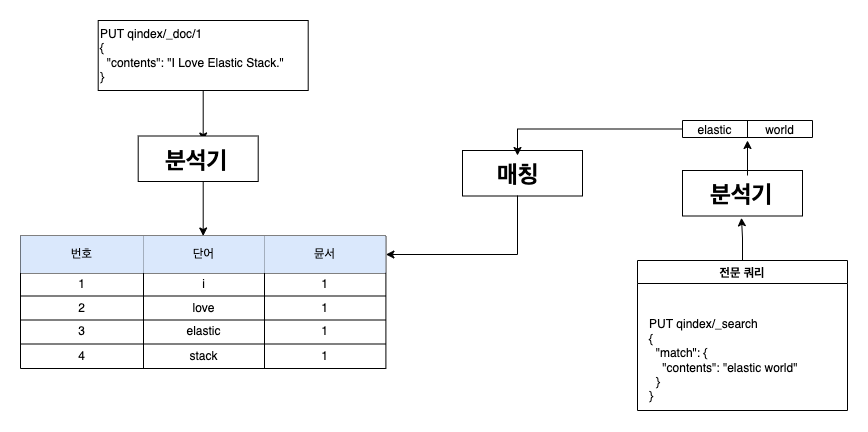
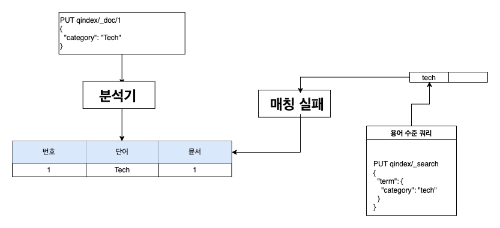
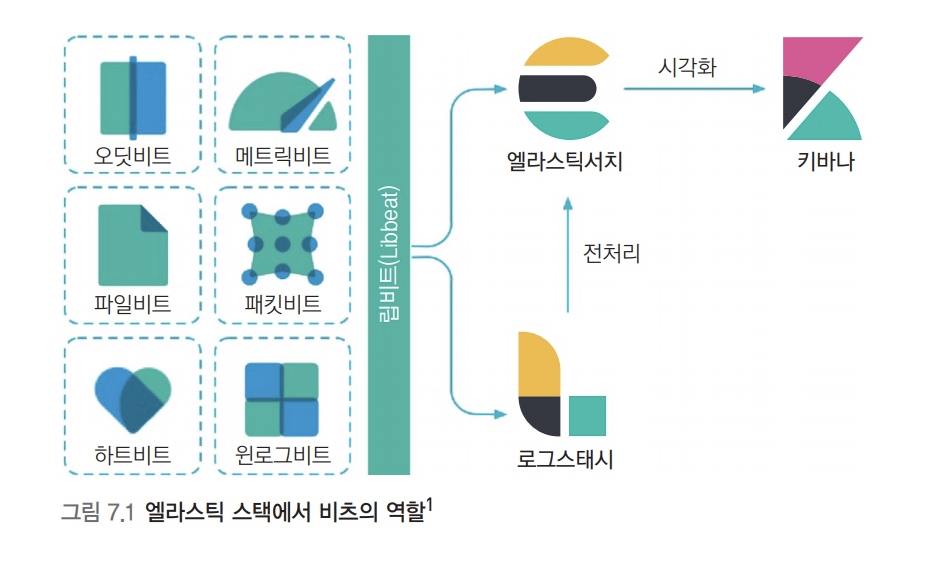

> [엘라스틱 스택 개발 부터 운영까지](http://www.yes24.com/Product/Goods/103030516) 정리

# 01 엘라스틱 스택 이란

## 엘라스틱 스택의 구성요소

엘라스틱 스택은 일반적으로 빅데이터 파이프라인을 구성하기 위한 데이터 수집, 가공, 저장 분석, 시각화에 필요한 모든 소프트웨어를 갖추고 있다. 비츠와 로그스태시는 데이터를 수집하고 가공 하는 역할을 맡으며, 엘라스틱서치는 저장하고 분석하는 역할을 담당하고, 키바나는 엘라스틱 서치에 저장된 데이터를 시작화하고 모니터링하는 역할을 수행한다.

### 엘라스틱서치: 분산 검색 엔진
엘라스틱서치 검색 엔진은 내부적으로 각 도큐먼트를 인덱싱 하고 빠르게 검색하는데 사용한다. 엘라스틱서치는 모든 레코드를 JSON 도큐먼트 형태로 입력하고 관리하며, 일반적인 데이터베이스와 마찬가지로, 쿼리한 결과에 대해 일치하는 원본 도큐먼트를 반환한다.
엘라스틱서치를 일종의 NoSQL 데이터베이스라고 생각하면 훨씬 더 큰 그림이 보얼것이다.

엘라스틱서치에 대한 기본적인 사용 경험은 몽고디비 같은 도큐먼트 기반의 NoSQL과 유사하다. 하지만 다른 NoSQL 제품을 압도하는 검색 기능과 엘라스틱서치의 가장 큰 특징이자 활용 먹적이라 볼 수 있다. 또한 검색 엔진으로서 엘라스틱서치의 중요한 특징 중 하나는 스코어링, 즉 연관도에 따른 정렬이다. 단순히 필드 값을 기준으로 한 정렬은 어떤 데이터 베이스라도 제공하지만, 엘라스틱서치는 검색어에 대한 유사도 스코어를 기반으로 한 정렬을 제공한다. 이는 특히 복잡한 문자열 콘텐츠에서 검색을 수행할 때 큰 효과를 보인다.

엘라스틱서치 클러스터는 분산 시스템으로 분산 시스템으로서 엘라스틱서치는 복수의 루씬 인스턴스를 병렬로 배치하고 분산 처리해 검색 속도를 무한히 확장할 수 있게 했다. 또 노드 간 복제 기능을 통해 일부 노드가 다운되더라도 정상적인 서비스를 지속할 수 있게 했다. 무엇보다도 REST API를 이용하도록 만들어 프로그래밍 언어와 무관하게 사용자가 쉽게 접근할 수 있도록 활용성을 높였다.

물론 단점도 있다. 저장공간이 크게 압축되지 않고 시스템 리소스를 많이 사용한다. 엘라스틱서치는 DSL 쿼리를 채용하는데 JSON 쿼리가 사실상 어렵기 때문에 반정규화를 기본으로 모델링 해야한다. 또한 인덱스가 불변의 자료구조이기 때문에 도큐먼트를 수정하가나 삭제할 경우에 비용이 저렴하지 않다. 하지만 이러한 단점들은 검색 기능을 끌어올리 기 위해 어느정도 트레이드오프가 이뤄진 것으로, 엘라스틱서치가 필요한 수준의 대량 데이터를 처리할 때는 일반적으로 용인이되는 제약들이다.

### 키바나: 시각화와 엘라스틱서치 관리도구
엘라스틱서치에 대한 대부분의 관리 기능, API를 실행할 수 있는 콘솔, 솔루 션 페이지들, 그리고 스택의 각 구성요소들을 위한 모니터링 페이지 등이 모두 키바나에 포함되 있다. 하지만 엘라스틱서치 기반의 시각화 도구로서 키바나의 가장 중요한 기능은 시각화와 대시보드라고 할 수 있다. 키바나는 일반적으로 많이 사용되는 라인 파츠, 파이 차트 등과 테이블 지도 등의 다양한 시각화 요소들을 클릭 몇 번으로 쉽게 구성할 수 있게 해준다.


### 로그스태시: 에빈트 수집과 정제를 위한 도구
대량의 데이터를 검색하기 위해 가장 먼저 선행돼야 할 작업은 데이터를 적재하는 것이다. 데이터 수집과 가공 기능을 제공하는 로그스태시를 사용하면 로그, 메트릭, 웹 애플리케이션 등 다양한 소스로부터 로그를 수집할 수 있다.

로그스태시는 별도의 코딩 없이 간단한 설정만으로 로그를 가공할 수 있다. 확장 가능한 200개의 이상의 플러그인 덕분에 설정이 대부분 플러그인 사용 방법인데 그 사용법이 크게 어렵지 않다.

로그스태시가 익숙하지 않다는 이유로 로그스태시가 아닌 커스텀 애플리케이션을 작성해 소스 데이터를 수집하려는 경우도 있다. 로그스테시는 진면목은 단순 소스 데이터 정제가 아니다. 엘라스틱서치의 인덱싱 성능을 최적화하기 위해 배치 처리와 병렬 처리가 가능하며, 영속적인 큐를 사용해 연재 처리 중인 이벤트의 최소 1회 전송을 보장해줄 뿐만 아니라. 유동적인 처리 방식으로 인해 수집 중인 데이터양이 급증하는 부하 상황에서도 안정성을 보장해 준다. 이를 커스텀 애플리케이션으로 구현할 경우 신겅 써야 할 부분이 많고 문제 발생 시 디버깅이나 튜닝이 쉽지 않다는 점에서 따라오기 어려운 로그스태시의 장점이라 할 수 있다.


### 비츠: 엣지단에서 동작하는 경량 수집 도구
로그스테시의 기능은 충분히 강력하다. 하지만 이벤트 정보를 수집하기 위해 실제 서비스가 동작하는 호스트에 수집기를 설치해야 하는 경우가 많은데 로그스태시는 다양한 필터와 설정을 지원하는 만큼 무겁기 때문에 이러한 목적으로 활용도가 떨어질 수 있다. 엘라스틱 스택에는 이를 위해 파일비츠, 메트릭비트 등 비츠라고 부르는 경량 수집기가 포함되어 있다. 각 비트는 로그수집, 시스템 지표 수집 등 특정 목적에 최적화된 에이전트이며, 가볍기로 유명한 고 프로그래밍 언어로 작성되어 있다. 또한 로그스태시 수준의 복잡한 이벤트 가공은 지원하지 않아 가벼우므로, 각 서비스 호스트에 비교적 부담 없이 설치 할 수 있다. 이러한 양쪽의 장점을 활용하기 위해 비츠와 로그스태시를 혼합해 많이 사용한다.


### 기타 솔루션
애플리케이션 성능 모니터링을 위한 APM, 보안 이벤트 분석을 위한 SIEM, 컨테이너 다수의 서비스를 쉽게 모니터링하기 위한 인프라 모니터링 등의 솔루션이 포함되어 있다.

## 엘라스틱 스택의 용도

### 전문 검색

엘라스틱 스택의 가장 기본적인 사용처는 바로 전문 검색 엔진 구현이다. 전문 검색은 단순한 문장부터 뉴스 기사나 논문 등 다양한 글의 전체 내용을 의미한다. 대상 도큐먼트가 많지 않는 다면 일반적인 관계형 데이터베이스의 LIKE 질의 검색으로도 충분히 가능하지만 도큐먼트 수가 조금만 늘어나도 인덱스의 도움 없이 빠른 검색은 불가능에 가깝다.

이러한 전문을 빠르고 정확하게 검색하기 위해 전문 용어를(terms) 단위로 분석해 인덱싱해 두고 이를 기반으로 검색을 수행하는 역인덱싱 기법이 많이 활용된다. 


* Discover 으로 사전에 등록한 인덱스 패턴 데시보드 지원

### 로그 통합 분석
엘라스틱 스택은 여러 장비와 서비스에서 발생하는 로그를 통합하고 검색하는 데 최적화된 솔루션이라 할 수 있다. 시스템과 호스트, 쿠버네티스, 아파치, MySQL 다양한 환경에서 생성되는 로그를 별도의 복잡한 구성 없이도 바로 수집 가능하다. 비츠를 사용하면 적은 리소스로 각 장비의 로그들을 빠르게 쉬집할 수 있고, 로그스태시는 다양한 필터를 통해 일원화된 형태로 가공을 도유며, 엘라스틱서치의 대용량 로그에 대한 빠른 인덱싱 성능과 텍스트 검색 능력은 여러 곳에 흩어진 서비스 로그들을 통합해서 연관 분석을 지원한다.


* Stream 형식으로 로그를 스트리밍 하여 실시간으로 확인 가능


### 보안 이벤트 분석
SIEM 등으로 불리는 솔루션은 조직 내에 속한 다양한 장비들로부터 보안 이벤트를 수집하고 분석 할 수 있게 하려는 목적으로 만들어 졌다. 키바나에서 제공하는 엘라스틱 이벤트 분석 화면에서 비츠에서 수집한 이벤트를 기반으로 엔드포인 활용, 인프라스트럭처, 클라우드, 네트워크 등 다양한 소스에서 수집한 이벤트를 기반으로 엔트포인트 활동, 인증 로그, DNS 트래픽, 네트워크 플로우에서 이상 징후, 불법적인 로그인 시도, 사용자 접근 패턴 등의 문제를 빠르게 찾아낼 뿐만 아니라, SIEM UI에서 분석을 비롯한 고유 탐지 규칙 관리 또한 가능하다.

### 애플리케이션 성능 분석
앨라스틱 스택의 애플리케이션 성능 모니터링 도구인 APM은 프로그래밍 언어별 에이전트를 통해 성능 지표를 수집하고 돕고 분석을 위한 UI를 제공한다. 그 뿐만 아니라 메트릭비트와 패킷비트를 사용하면 시스템을 비롯해 여기 연계된 다양한 서비스들의 성능 정보를 수집할 수 있게 도와준다.

유료서비스 크립션에 포함된 기능인 와처나 머신러닝 등의 기능과 연계하면 장애나 이상 상황을 빠르게 파악하고 원인을 효과적으로 분석할 수 있다.


* 위에 설정한 APM 서버 확인


* 해당 애플리케이션 트랜잭션 정보를 출력합니다. 보다 자세히 보고 싶으면 해당 트랜잭션을 클릭해서 자세한 내용을 확인할 수 있습니다.


* 해당 트랜잭션 내용을 살펴볼 수 있으며, HTTP 요청/응답에 대한 자세한 내용도 확인 가능합니다.


* 해당 쿼리 문의 상세한 내용도 확인할 수 있습니다.


* 해당 서버의 Error를 보여줍니다.
* 발생한 Error를 클릭하면 해당 오류의 더 많은 정보를 확인할 수 있습니다.


* 오류가 발생한 트랜잭션을 클릭하면 트래잭션 탭으로 이동되며, 해당 이슈의 원인을 파악을 도와줍니다.


* 현재 시스템 리소스에 대한 내용을 확인할 수 있습니다.


* query 통계
* slow query 분포도 및 정렬
* error query 획인


* CURD 쿼리 Count
* Threads created rate 
* Running threads
* Connections rate


## 빅데이터 플랫폼의 일부로 동작하는 엘라스틱 스택

### 엔터프라이즈 데이터 버스인 카프카와 연동
아파츠 카프카는 분산 데이터 스트리밍 플랫폼이다, 대량의 데이터를 실사간으로 배포하는 데 최적화되어 있어 많은 빅 데이터 플랫폼에서 기본적으로 채택하고 있다.

비츠에서 수집한 각 장비의 이벤트를 카프카로 전송 하고 이를 로그스태시로 다시 읽어 들이거나 카프카에 저장된 다른 시스템의 이벤트를 엘라스틱서치로 읽어 들이는 등의 구성으로 자주 사용된다.

### 하둡 생톄개와 연동
엘라스틱서치는 이미 인덱싱된 결과에 대해 빠른 검색을 제공하고 스파크는 기존에 인덱싱되지 않은 데이터에 대한 빠른 일괄 처리를 제공하기 때문에 엘라스틱서치를 중간 집계 엔진이나 결과를 저장해 재활용하는 용도 등으로 활용할 수 있다.

### 관계형 데이터베이스와 연동

관계형 데이터베이스에는 주로 레거시 데이터나 신뢰성이 중요한 데이터가 포함되어 있다. 로그스태시는 JDBC 입력 플러그인, 필터 등 관계형 데이터베이스와 연계할 수 있는 다양한 방법을 제공하고 있다. 기존 관계형 데이터베이스에 저장된 데이터를 인덱싱하거나 입력받은 이벤트에 정보를 중비하는 등 여러 용도로 사용된다. JDBC 입력 플러그인을 사용해 관계형 데이터베이스에 저장된 데이터를 엘라스틱서치로 이전할 경우, 엘라스틱 스택의 우수한 성능을 이용해 관계형 데이터베이스로는 처리하기 어려운 집계도 빠르고 정확하게 처리 할 수 있다. 또한 텍스트 데이터의 경우 엘라스틱서치에서는 색인만 수행하고 원문을 저장하지 않게 설정하는 방식을 이용해 저장소 용량을 아낄 수 있다. JDBC 필터를 사용하는 경우 관계형 데이터베이스에서 실 데이터를 불러와 매핑하는 용도로 이벤트에 ID 형태로만 기록되는 정보를 활용 할 수있다.


## 유사 제품과 비교

### 엘라스틱서치의 유사 제품군

특징 | 엘라스틱서치 | 몽고디비 | MySQL
--|--------|------|------
분류 | 검색 엔진 | 도큐먼트 저장소 | 관계형 데이터베이스
최초 릴리즈 | 2010 | 2009 | 1995
스키마 | 자동 생성 | 자유 | 필요
인터페이스 | REST API | 전용 프로토컬 | JDBC/ODBC
분산 저장 | 샤딩 | 샤딩 | 별도 제품으로 지원
트랜잭션 | 미지원 | 부분 지원 | 지원
Join | 미지원 | 최근 도큐먼트 단위로 지원 시작 | 지원
특징 | 다양한 데이터 유형에 대해 빠른 검색/집계 | 높은 활용성/범용성 | 뛰어난 데이터 무결성


### 로그스태시/비츠의 유사 제퓸군
데이터 플랫폼에 사용되는 유사한 제품으로 트레저 데이터에서 개발한 플루언트디 와 비교할 수 있는데, 플루언트디는 로그스태시와 설정의 형태만 다를 뿐 기능상으로 건의 동일한 역할을 수행 할 수 있다. 다만 엘라스틱 스택에 한정 지어 사영한다면 로그스태시는 엘라스틱서치, 키바나와 연계해 모니터링, 중앙 관리 등의 기능을 제공하는 한편, 플루언트디는 이러한 지원을 받을 수 없기 때문에 되도록 로그스태시와 비츠의 조합이 권장된다.

### 키바나의 유사 제품군

특징 | 키바나 | 그라파나 | 태블로
---|-----|------|----
실행환경 | 웹 서비스 | 웹 서비스 | 설치/웹 서비스 모두 제공
데이터 소스 | 엘라스틱서치 | 엘라스틱서치,그라파이트,몽고디비,프로메테우스 등 | 관계형 데이터베이스, 엑셀 파일, JOSN 파일, 드롭박스등
특징 | 실시간 대시보드 외에도 캔버스 지도, 비츠/로그스태시와 연계되어 제공되는 롯루션 등 엘라스틱 서치와의 기능을 십분 활용한 다양한 시각화 세트 제공 | 라인, 바 차트 등 기본적이지만 인프라 모니터링에 부족함이 없는 시각화 요소들 포함 | 실시간보다는 다양한 시각화 도구를 이용한 분석에 특화되어 있음
기타 기능 지원 | 스택 관리, 모니터링 등 엘라스틱 스택 특화 기능 지원, 알림이나 머신러닝 등 유료 기능 존재 | 알림 기능 지원 | -


# 03 엘라스틱서치 기본

## 엘라스틱서치 요청과 응답

엘라스틱서치는 모든 요청과 응답을 REST API 형태로 제공한다.

## 키바나 콘솔 사용법


키바나 콘솔을 시용하면 복잡한 앱 개발이나 프로그램 설치 없이 엘라스틱서치와 REST API로 통신 할 수 있다.

## 인덱스와 도큐먼트

일반적으로 엘라스틱을 이용해 시스템을 개발하면 하나의 프로젝트에서 하나의 클러스터를 생성한다. 그리고 클러스터 내부는 데이터 성격에 따라 여러 개의 인덱스를 생성한다.

### 도큐먼트

도큐먼트는 엘라스틱서치에서 데이터가 저장되는 기본 단위로 JSON 형태며, 하나의 도큐먼트는 여러 필드와 값을 갖는다. 엘라스틱서치가 도큐먼트에 데이터를 어떻게 저장하는지 알아보고, 우리가 흔히 아는 관계형 데이터베이스와 엘라스틱서치의 데이터 저장 방식도 비교해 보자.

```
name: mike
age: 25
genger: male
```
일반적인 관계형 데이터베이스는 SQL 문을 이용해 데이터를 저장한다.

```sql
CREATE TABLE meber (
    uuid int not null AUTO_INCREMENT PRIMARY KEY,
    name varchar(50) not null,
    age int not null,
    genger varchar(6) not null
)

INSERT INTO meber (name, age, genger) values ("moke", age, "male");
```

member라는 테이블에 name, age, genger 칼럼을 가진 스키마가 있어야 하고, 하나의 레코드로 데이터를 저장한다. 반면 엘라스틱서치는 데이터를 JSON 형태로 저장한다.

```json
{
    "name": "mike",
    "age": 25,
    "genger": "male"
}
```
name, age, genger를 필드라고 하며 "mike", 25, "male"을 값이라고 한다.

MySQL | 엘라스틱서치
------|-------
데이터베이스 | 인덱스
테이블 | 타입


### 인덱스

인덱스는 도큐먼트를 저장하는 논리적인 단위로, 관계형 데이터베이스의 테이블과 유사한 개념이다. 하나의 인덱스에 다수의 도큐먼트가 포함되는 구조인데, 동일한 인덱스에 있는 도큐먼컨트는 동일한 스키마를 갖는다. 그리고 모든 도큐먼트는 반드시 하나의 인덱스에 포함돼야 한다.


## 도큐먼트 CRUD

### 인덱스 생성/확인/삭제
도큐먼트 CURD 동작을 하기 위해서는 반드시 인덱스가 있어야 한다.

```
PUT index1

{
  "acknowledged" : true,
  "shards_acknowledged" : true,
  "index" : "index1"
}
```
index1 이라는 이름의 인덱스를 생성하는 API다.

```
GET index1

{
  "index1" : {
    "aliases" : { },
    "mappings" : { },
    "settings" : {
      "index" : {
        "creation_date" : "1644759999450",
        "number_of_shards" : "1",
        "number_of_replicas" : "1",
        "uuid" : "vgFoG30CR5mGPeg-i59_jQ",
        "version" : {
          "created" : "7060299"
        },
        "provided_name" : "index1"
      }
    }
  }
}

```
인덱스를 확인 하는 API이다. 

```
DELETE index1

{
  "acknowledged" : true
}
```
인덱스를 삭제하는 API이다. 인덱스를 삭제하면 인덱스에 저장되어 있는 도큐먼트들도 모두 삭제 되나 주의해야 한다.

### 도큐먼트 생성
엘라스틱서치에서 도큐먼트를 인덱스에 포함시키는 것을 인덱싱 이라고 한다.

```
PUT index2/_doc/1
{
  "name":"mike",
  "age": 25,
  "genger": "male"
}

{
  "_index" : "index2",
  "_type" : "_doc",
  "_id" : "1",
  "_version" : 1,
  "result" : "created",
  "_shards" : {
    "total" : 2,
    "successful" : 1,
    "failed" : 0
  },
  "_seq_no" : 0,
  "_primary_term" : 1
}
```
index2라는 인덱스를 생성하면서 동시에  index2 인덱스에 도큐먼트를 인덱싱한다. index2는 인덱스 이름, _doc은 엔드포인트 구분을 위한 예약어, 숫자 1은 인덱싱할 도큐먼트의 고유 아이디이다.

```
GET index2

{
  "index2" : {
    "aliases" : { },
    "mappings" : {
      "properties" : {
        "age" : {
          "type" : "long"
        },
        "genger" : {
          "type" : "text",
          "fields" : {
            "keyword" : {
              "type" : "keyword",
              "ignore_above" : 256
            }
          }
        },
        "name" : {
          "type" : "text",
          "fields" : {
            "keyword" : {
              "type" : "keyword",
              "ignore_above" : 256
            }
          }
        }
      }
    },
    "settings" : {
      "index" : {
        "creation_date" : "1644760221176",
        "number_of_shards" : "1",
        "number_of_replicas" : "1",
        "uuid" : "5P4QNPFrSZ2nepjUd7KhLg",
        "version" : {
          "created" : "7060299"
        },
        "provided_name" : "index2"
      }
    }
  }
}

```

index2 인덱스는 mappings에 age는 long 타입, genger와 name은 text, 타입으로 필드가 지정되어 있다. 우리가 데이터 타입을 지정하지 않아도 엘라스틱서치는 도큐먼트의 필드와 값을 보고 자동으로 지정하는데, 이런 기능을 다이내믹 매핑이라고 한다.


이번에는 index2 인덱스에 country라는 이름의 새로운 필드가 추가된 도큐먼트를 인덱싱 해보자

```
PUT index2/_doc/2
{
  "name":"jane",
  "country": "fracne"
}
```
2번 도큐먼트에는 country 필드가 추가되었고 기존에 있던 age, gender 필드는 사용하지 않지만 그래도 문제가 없이 인덱싱 된다.

이번에는 잘못된 데이터 타입을 입력한 도큐먼트를 인덱싱 해보자

```
PUT index2/_doc/3
{
  "name":"kim",
  "age": "25",
  "genger": "male"
}
```
관계형 데이터베이스라면 오류가 발생했겠지만 스키마에 유연하게 대응하는 엘라스틱서치는 타입을 변환해 저장한다.

3번 도큐먼트는 age 필드 값이 인덱싱 과정에서 상제로 숫자 타입으로 변경 ("20" -> 20)되었다.


### 도큐먼트 읽기

도큐먼트를 읽는 방법은 크게 도큐먼트 아이드를 이용해 조회하는 방법과 쿼리 DSL 이라는 엘라스틱서치가 제공하는 쿼리문을 이용해 검색하는 방법이 있다. 우선 도큐먼트 아이디를 사용해 조회하는 방법부터 살펴보자

```
GET index2/_doc/1

{
  "_index" : "index2",
  "_type" : "_doc",
  "_id" : "1",
  "_version" : 2,
  "_seq_no" : 2,
  "_primary_term" : 1,
  "found" : true,
  "_source" : {
    "name" : "kim",
    "age" : "25",
    "genger" : "male"
  }
}
```
인덱스명과 도큐먼트 아이디를 이용해 특정 도큐먼트의 데이터를 가져올 수 있다. 실제에서는 단일 조회보다는 search라는 DSL 쿼리를 이용해 도큐먼트를 읽어오는 방법을 많이 사용한다.

### 도큐먼트 수정

```
PUT index2/_doc/1
{
  "name": "park",
  "age": 45,
  "genger": "male"
}

{
  "_index" : "index2",
  "_type" : "_doc",
  "_id" : "1",
  "_version" : 3,
  "result" : "updated",
  "_shards" : {
    "total" : 2,
    "successful" : 1,
    "failed" : 0
  },
  "_seq_no" : 5,
  "_primary_term" : 1
}

```
기존 1번 도큐먼트의 name, age 필드의 값이 변경되 었다. 응답 결과 result 필드를 통해 도큐먼트라 생성되었고 업데이트되고 삭제 되는 상태를 알 수 있다.

Update API를 이용해 특정 도쿠먼트의 값을 업데이트할 수 있다.

```
POST index2/_update/1
{
  "doc":{
    "name": "lee"
  }
}

{
  "_index" : "index2",
  "_type" : "_doc",
  "_id" : "1",
  "_version" : 4,
  "result" : "updated",
  "_shards" : {
    "total" : 2,
    "successful" : 1,
    "failed" : 0
  },
  "_seq_no" : 6,
  "_primary_term" : 1
}

```
_update라는 엔드포인트를 추가해 특정 필드 값만 업데이트할 수 있다. 

엘라스틱서치 도큐먼트 수정 작업은 비용이 많이 들기 때문에 권장하지 않는다. 특히 엘라스틱서치를 로그 수집 용도로 사용한ㄷ가면 개별 도큐먼트를 수정할 일은 거의 없다. 개별 도큐먼트 수정이 많은 작업이라면 엘라스틱서치가 아닌 다른 데이터베이스를 이용하는 것이 좋다.

### 도큐먼트 삭제

index2 인덱스에 아이디 2번 도큐먼트가 삭제된다. 다만 도큐먼트 수정과 마찬가지로 개별 도큐먼트 삭제 또한 비용이 많이 들어가는 작업인 만큼 사용 시에 주의하자.

```
DELETE index2/_doc/2
{
  "_index" : "index2",
  "_type" : "_doc",
  "_id" : "2",
  "_version" : 2,
  "result" : "deleted",
  "_shards" : {
    "total" : 2,
    "successful" : 1,
    "failed" : 0
  },
  "_seq_no" : 7,
  "_primary_term" : 1
}

```

## 응답 메시지
HTTP Status Code        상태        해결 방법
200, 201        정상적으로 수행함       -
4xx     클라이언트 오류     클라언트에서 문세점 수정
404     요청한 리소스가 없음        인덱스나 도큐먼트가 존재하는지 체크
405     요청 메서드를 지원하지 않음         API 사용법 다시 확인
429     요청 과부화     재전송, 노드 추가 같은 조치
5xx     서버 오류       엘라스틱서치 로그 확인 후 조치

## 벌크 데이터
벌크 데이터는 대량의 데이터를 생성, 수정, 삭제를 하는 경우를 말한다. 각 줄 사이에는 쉼표 등 별도의 구분자가 없고 라인 사이 공백을 허용하지 않는다. JSON 문법 처럼 보이지만 복수의 JSON 구조를 줄바꿈 문자열로 구분하는 NDJSON 형태이다.

```
POST _bulk
{"index": {"_index": "index2", "_id": "4"}}
{"name": "park", "age": 30, "genger": "female"}
{"index": {"_index": "index2", "_id": "5"}}
{"name": "jung", "age": 50, "genger": "male"}
```

## 매핑
관계형 데이터베이스는 테이블을 만들 때 반드시 스카마 설계가 필요하다. 여기서 말하는 스키마는 테이블을 구성하는 구성요소 간의 논리적인 관계와 정의를 의미한다. 구조를 명확히 하지 않고는 테이블이 생성되지 않고, 추후에 인덱싱 칼럼이나 조인 칼럼 등에서도 문제가 발생하기 때문이다. 엘라스틱서치에서도 관계형 데이터베이스의 스키마외 비슷한 역할을 하는 것이 있는데 바로 매핑이다. 쉽게 말하면 JSON 형태의 데이터를 루씬이 이해할 수 있도록 바꿔주는 작업이다. 엘라스틱서치가 검색 엔진으로 전문 검색과 대량 데이터를 빠르게 실시간 검색할 수 있는 이유는 매핑이 있기 때문인데 매핑을 엘라스틱서치가 자동으로 하면 다이내믹 매핑, 사용자가 직접 설정하면 명시적 매핑이다. 

엘라스틱서치에서는 문자열을 텍스트와 키워드 타입으로 나눌 수 있는데, 전문 검색을 활용하려면 반드시 두 가지 타입을 이해하고 있어야 한다.

### 다이내믹 매핑
엘라스틱서치의 모든 인덱스는 매핑 정보를 갖고 있지만 유연한 활용을 위해 인덱스 생성 시 매핑 정의를 강제하지 않는다. 특별히 데이터 타입이나 스키마에 고민하지 않아도 JSON 도큐먼트의 데이터에 맞춰 엘라스틱서치가 자동으로 인덱스 매핑을 해주는 것이다.

##### 다이내믹 매핑 기준
원본 소스 데이터 타입 | 다이내믹 매핑으로 변환된 데이터 타입
-------------|---------------------
null | 필드를 추가하지 않음
boolean | boolean
float | float
integer | long
object | object
string | string 데이터 형태에 따라 date, text/keyword 필드

다이내믹 매핑이 적용된 index2 인덱스의 매핑을 확인해보자. 엘라스틱서치는 인덱스 매핑값을 확인할 수 있는 mappings API를 제공하고 있다.

```
GET index2/_mapping

{
  "index2" : {
    "mappings" : {
      "properties" : {
        "age" : {
          "type" : "long"
        },
        "country" : {
          "type" : "text",
          "fields" : {
            "keyword" : {
              "type" : "keyword",
              "ignore_above" : 256
            }
          }
        },
        "genger" : {
          "type" : "text",
          "fields" : {
            "keyword" : {
              "type" : "keyword",
              "ignore_above" : 256
            }
          }
        },
        "name" : {
          "type" : "text",
          "fields" : {
            "keyword" : {
              "type" : "keyword",
              "ignore_above" : 256
            }
          }
        }
      }
    }
  }
}
```

인덱스의 규모가 커진다면 효율이 떨어진다. 일례로 age 필드는 사람 나이인데 200 살을 넘는 데이터는 없기 때문에 long 타입 보다는 메모리를 조금쓰는 short 타입이 유리할 것이다. 또한 country나 gender 같은 범주형 데이터는 전문 검색보다는 일반적으로 집계나 정렬, 필터링을 위해서 사용되기 때문에 키워드 타입으로 지정되는 것이 좋다.

### 명시적 매핑
인덱스 매핑을 직접 정의하는 것을 명시적 매핑이라고 한다. 인덱스를 생성할 때 mappings 정의를 설정하거나 mapping API를 이용해 매핑을 지정할 수 있다.

```
PUT index3
{
  "mappings":{
    "properties": {
      "age": {"type": "short"},
      "name": {"type": "text"},
      "gender": {"type": "keyword"}
    }
  }
}

{
  "acknowledged" : true,
  "shards_acknowledged" : true,
  "index" : "index3"
}
```

```
GET index3/_mapping

{
  "index3" : {
    "mappings" : {
      "properties" : {
        "age" : {
          "type" : "short"
        },
        "gender" : {
          "type" : "keyword"
        },
        "name" : {
          "type" : "text"
        }
      }
    }
  }
}

```
지정된 필드명과 필드 타입으로 인덱스가 매핑되었다. 저장할 데이터를 확실히 알고 있다면 인덱스를 생성할 때 직접 매핑하는 것이 좋다. 인덱스 매핑이 정해지면 새로운 필드를 추가할 수 있으나, 이미 정의된 필드를 수정하거나 삭제할 수는 없다. 필드 이름을 변경하거나 데이터 타입을 변경하기 위해서는 새로운 인덱스를 만들거나 reindex API를 이용해야 하니 매핑 작업은 신중하게 하는 것이 좋다.


### 매핑 타입

데이터 형태 | 데이터 타입 | 설명
-------|--------|---
텍스트 | text | 전문 검색이 필요한 데이터로 텍스트 분석기가 텍스트를 작은 단위로 분리한다.
텍스트 | keyword | 정렬이나 집계에 사영되는 텍스트 데이터로 분석을 하지 않고 원문을 통쨰로 인덱싱 한다.
날짜 | date | 날짜/시간 데이터
정수 | byte,short,intger,long | * byte: 부호있는 8비트 데이터(-128~127) <br> * short: 부호 있는 16비트 (-32,768~32,767) <br> * integer: 부호 있는 32 비트 데이터<br> * long: 부호 있는 64 비트 데이터<br>
실수 | scaled_float, half_float, dobule, float | * scaled_float: float 데이터에 특정 값을 곱해서 정수형으로 바꾼 데이터, 정확도는 떨어지나 필요에 따라 집계 등에서 효율적으로 사용 가능하다.<br> * half_float: 16비트 부동소수점 실수 데이터<br> * dobule: 32비트 부동소수점 실수 데이터<br> * float: 64 비트 부동소수점 실수 데이터<br>
불린 | boolean | true/false
IP 주소 | ip | ipv4, ipv6 타입 IP 주소
위치 정보 | geo-point, geo-shape | * geo-point: 위도, 경도 값<br> * geo-shape: 하나의 위치 포인트가 아닌 임의의 지형<br>
범위 값 | integer_range, long_range, float_range, double_range, ip_range, date_ragne | 범위를 설정할 수 잇는 데이터, 범위 값을 저장하고 검색할 수 있게한다.
객체형 | object | 계층형 구조를 갖는 형태로 필드 안에 다른 필드들이 들어갈 수 있다. name: {"first": "kim", "last": "tony"}로 타입을 정의하면 name.fist, name.last 형태로 접근할 수 있다.
배열형 | nested | 배열형 객체를 저아한다. 객체를 따로 인덱싱하여 객체가 하나로 합쳐지는 것을 막고, 배열 내부에의 객체에서 쿼리로 접근할 수 있다.
배열형 | join | 부모/자식 관계를 표현할 수 있다.

### 멀티 필드를 활용한 문자열 처리
엘라스틱 서치 5.x 버전부터 문자열 타입이 텍스트와 키워드 두 가지 타입으로 분리되어 있다.

#### 텍스트 타입
엘리스틱서치에 텍스트 타입은 일반적으로 문장을 저장하는 매핑 타입으로 사용된다. 강제성은 없지만 일반적으로 문장이나 여러 단어가 나열된 문자열 텍스트 타입으로 지정한다.

> "This documentation is also available as PDF." 

텍스트 타입으로 지정된 문자열 분석기에 의해 토큰으로 분리되고, 이렇게 분리된 토큰들은 인덱싱되는데 이를 역인덱싱이라고 한다. 이때 역인덱싱에 저장된 토큰들을 용어 라고한다.

```
POST _analyze
{
  "analyzer": "standard",
  "text": "This documentation is also available as PDF."
}

{
  "tokens" : [
    {
      "token" : "this",
      "start_offset" : 0,
      "end_offset" : 4,
      "type" : "<ALPHANUM>",
      "position" : 0
    },
    {
      "token" : "documentation",
      "start_offset" : 5,
      "end_offset" : 18,
      "type" : "<ALPHANUM>",
      "position" : 1
    },
    {
      "token" : "is",
      "start_offset" : 19,
      "end_offset" : 21,
      "type" : "<ALPHANUM>",
      "position" : 2
    },
    {
      "token" : "also",
      "start_offset" : 22,
      "end_offset" : 26,
      "type" : "<ALPHANUM>",
      "position" : 3
    },
    {
      "token" : "available",
      "start_offset" : 27,
      "end_offset" : 36,
      "type" : "<ALPHANUM>",
      "position" : 4
    },
    {
      "token" : "as",
      "start_offset" : 37,
      "end_offset" : 39,
      "type" : "<ALPHANUM>",
      "position" : 5
    },
    {
      "token" : "pdf",
      "start_offset" : 40,
      "end_offset" : 43,
      "type" : "<ALPHANUM>",
      "position" : 6
    }
  ]
}
```
[this, documentation, is]와 같이 토큰으로 분리되고, 불필요한 토큰을 걸러내고 대소문자를 통일하는 등 가공 과정을 거쳐 용어가 된다. 이러한 용어들은 역인덱스에 저장되어 전문 검색을 할 수 있게 한다.

"documentation"를 검색하면 전체 문장을 검색할 수 있다. 일반적인 관계형 데이터베이스에 익숙할 경우 문자열 부분 검색으로 LIKE이 있지만 LIKE 검색은 인덱싱 되지 않아 엘라스틱서치처럼 많은 문서를 처리하기엔 무리가 있다.

```
PUT text_index
{
  "mappings": {
    "properties": {
      "contets": {
        "type": "text"
      }
    }
  }
}
```
text_index라는 인덱스를 생성하고 contets 필드 타입을 텍스트 타입으로 매핑한다.

```
PUT text_index/_doc/1
{
  "contets": "beatiful day"
}
```
"beatiful day"는 타입이 텍스트이기 때문에 분석기 의해 [beatiful, day]와 같은 용어 단어로 분리되어 역인덱스에 저장된다.

```
GET text_index/_search
{
  "query": {
    "match": {
      "contets": "day"
    }
  }
}

{
  "took" : 0,
  "timed_out" : false,
  "_shards" : {
    "total" : 1,
    "successful" : 1,
    "skipped" : 0,
    "failed" : 0
  },
  "hits" : {
    "total" : {
      "value" : 1,
      "relation" : "eq"
    },
    "max_score" : 0.2876821,
    "hits" : [
      {
        "_index" : "text_index",
        "_type" : "_doc",
        "_id" : "1",
        "_score" : 0.2876821,
        "_source" : {
          "contets" : "beatiful day"
        }
      }
    ]
  }
}
```
DSL 쿼리를 이용해 검색도 가능하다. match는 전문 검색을 할 수 있는 쿼리이며, contets 필드에 있는 역 인덱싱된 용어 중 일치하는 용어가 있는 도쿠먼트를 찾는 쿼리이다.

텍스트 타입의 경우 기본적으로 집계나 정렬을 지원하지 않으며, 매핑 파라미터로 집계나 정렬을 지원 할 수는 있으나 메모리를 많이 사용한다는 단점이 있다.


#### 키워드 타입
키워드 타입은 카테고리나 사람 이름, 브랜드 등 규칙성이 있거나 유의미한 값들의 집학, 즉 범주형 데이터에 주로 사용된다. 키워드 타입은 텍스트 타입과 다르게 분석기를 거치지 않고 문자열 전체가 하나의 용어로 인덱싱된다. 키워드 타입은 "beautiful day"라는 문자열을 [beautiful day] 라는 1개의 용어로 만든다. 따라서 키워드 타입으로 매핑된 데이터는 부분 일치 검색은 어렵지만 대신 완전 일치 검색을 위해 사용할 수 있으며 집계나 정렬에 사용할 수 있다.

#### 멀티 필드
멀티 필드는 단일 필드 입력에 대해 여러 하위 필드를 정의하는 기능으로, 이를 위해 fields라는 매핑 파라미터가 사용된다. fields는 하나의 필드를 여러 용도로 사용할 수 있게 만들어 준다. 처음 매핑할 때 텍스트와 키워드를 동시에 지원이 가능하다.

```
PUT multifield_index
{
  "mappings":{
    "properties": {
      "message": {
        "type": "text"
      },
      "contents": {
        "type": "text",
        "fields":{
          "keyword": {
            "type": "keyword"
          }
        }
      }
    }
  }
}
```

message, contents라는 2개의 필드를 가진 인덱스를 생성했다. 그중 contents 필드는 멀티 타입으로 설정하여 contents 필드는 텍스트 타입이면서 키워드 타입을 갖는다.

```
PUT multifield_index/_doc/1
{
  "message": "1 docuemnt",
  "contents": "beatiful day"
}

PUT multifield_index/_doc/2
{
  "message": "2 docuemnt",
  "contents": "beatiful day"
}

PUT multifield_index/_doc/3
{
  "message": "3 docuemnt",
  "contents": "worderful day"
}
```
match 쿼리를 이용해 도큐머트를 찾아 보자

```
GET multifield_index/_search
{
  "query": {
    "match": {
      "contents": "day"
    }
  }
}

{
  "took" : 998,
  "timed_out" : false,
  "_shards" : {
    "total" : 1,
    "successful" : 1,
    "skipped" : 0,
    "failed" : 0
  },
  "hits" : {
    "total" : {
      "value" : 3,
      "relation" : "eq"
    },
    "max_score" : 0.13353139,
    "hits" : [
      {
        "_index" : "multifield_index",
        "_type" : "_doc",
        "_id" : "1",
        "_score" : 0.13353139,
        "_source" : {
          "message" : "1 docuemnt",
          "contents" : "beatiful day"
        }
      },
      {
        "_index" : "multifield_index",
        "_type" : "_doc",
        "_id" : "2",
        "_score" : 0.13353139,
        "_source" : {
          "message" : "2 docuemnt",
          "contents" : "beatiful day"
        }
      },
      {
        "_index" : "multifield_index",
        "_type" : "_doc",
        "_id" : "3",
        "_score" : 0.13353139,
        "_source" : {
          "message" : "3 docuemnt",
          "contents" : "worderful day"
        }
      }
    ]
  }
}

```
3개의 도큐먼트가 모두 검색된다. contets는 멀티 필드이지만 기본적으로 텍스트 타입으로 매핑되어 있다. 텍스트 타입은 인덱싱 과정에서 분석기를 거치게 되는데 1번,번 도큐먼트는 [beauiful, day]로, 3번 도큐먼트는 [worderful, day]로 역인덱싱되었다. 모두 day라는 용어를 포함하기 때문에 검색이되었다. contents 필드의 키워드 타입으로 검색하는 경우 하위 필드이기 때문에 접근 방법이 다르다.

```
GET multifield_index/_search
{
  "query": {
    "term": {
      "contents.keyword": "day"
    }
  }
}


{
  "took" : 0,
  "timed_out" : false,
  "_shards" : {
    "total" : 1,
    "successful" : 1,
    "skipped" : 0,
    "failed" : 0
  },
  "hits" : {
    "total" : {
      "value" : 0,
      "relation" : "eq"
    },
    "max_score" : null,
    "hits" : [ ]
  }
}

```
contents 뒤에 keyword를 추가해 하위 필드를 참조할 수 있다. 다른 명칭으로 사용해도 되지만 통상적으로 keyword라는 이름을 많이 사용한다. 이 경우는 하나도 찾지 못한다. 해당 키워드와 일치하는 검색이 없기 때문이다. 이 때 worderful day 으로 변경한다면 조회가 가능하다. 

```
GET multifield_index/_search
{
  "size": 0,
  "aggs":{
    "contents":{
      "terms": {
        "field": "contents.keyword"
      }
    }
  }
}

{
  "took" : 0,
  "timed_out" : false,
  "_shards" : {
    "total" : 1,
    "successful" : 1,
    "skipped" : 0,
    "failed" : 0
  },
  "hits" : {
    "total" : {
      "value" : 4,
      "relation" : "eq"
    },
    "max_score" : null,
    "hits" : [ ]
  },
  "aggregations" : {
    "contents" : {
      "doc_count_error_upper_bound" : 0,
      "sum_other_doc_count" : 0,
      "buckets" : [
        {
          "key" : "beatiful day",
          "doc_count" : 2
        },
        {
          "key" : "worderful day",
          "doc_count" : 1
        }
      ]
    }
  }
}
```

aggs는 집계를 하기 위한 쿼리다. "beatiful day"는 2개와 "worderful day"라는 도큐먼트 2개가 그룹핑된다.

## 인덱스 템플릿

인덱스 템플릿은 주로 설정이 동일한 복수의 인덱스를 만들 때 사용한다. 관리 편의성, 성능 등을 위해 인덱스를 파티셔닝하는 일이 많은데 이때 파티셔닝되는 인덱스를은 설정이 같아야 한다. 설정이 동일한 인덱스를 직접 인덱스 템플릿을 만들어 편리하게 사용할 수 있다.


### 템플릿 확인
```
GET _index_template
GET _index_template/ilm-history
GET _index_template/ilm*
```

특정 인덱스 템플릿만 확인할 수 있과 와일드카드 표현식을 이용해 특정 인덱스 템플릿을 확인할 수 있다.


### 템플릿 설정

#### 템플릿 생성

```
PUT _template/test_template
{
  "index_patterns": ["test_*"],
  "template":{
    "settings":{
      "number_of_shards": 3,
      "number_of_replicas": 1
    },
    "mappings":{
      "properties":{
        "name": {"type": "text"},
        "age": {"type": "short"},
        "genger": {"type": "keyword"}
      }
    }
  }
}
```

test_template이라는 이름의 템플릿을 생성한다.

파라미터 | 설명
-----|---
index_patterns | 새로 만들어지는 인덱스 중에 인덱스 이름이 인덱스 패턴과 매칭되는 경우 이 템플릿이 적용된다. 여기서는 test_로 시작되는 이름을 가진 인덱스를 모두 test_template에 있는 매핑, 세팅 등이 적용 된다.
priority | 인덱스 생성 시 이름에 매칭되는 템플릿이 둘 이상일 때 템플릿 적용되는 우선순위를 정할 수 있다.
template | 새로 생성된 인덱스에 적용되는 settings.mappings 같은 인덱스 설정을 정의 한다.

#### 템플릿 적용
템플릿을 만들기 전에 이미 존재하던 인덱스는 템플릿 패턴과 일치하더라도 템플릿에 적용되지 않는다. 

```
PUT test_index/_doc/1
{
  "name": "kim",
  "age": 10,
  "genger": "male"
}


GET test_index/_mapping

{
  "test_index" : {
    "mappings" : {
      "properties" : {
        "age" : {
          "type" : "short"
        },
        "genger" : {
          "type" : "text",
          "fields" : {
            "keyword" : {
              "type" : "keyword",
              "ignore_above" : 256
            }
          }
        },
        "name" : {
          "type" : "text",
          "fields" : {
            "keyword" : {
              "type" : "keyword",
              "ignore_above" : 256
            }
          }
        }
      }
    }
  }
}

```
test_template 템프릿이 적용되어 다이내믹 매핑이 아닌 test_template에 정의되었던 매핑값이 적용되어있습니다. 템플릿이 없다면 다이내믹 매핑으로 동작하게 된다.


#### 템플릿 삭제
템플릿을 지워저도 기존 인덱스들은 영향을 받지 않는다. 이미 만들어진 인덱스를 변경 되는 것이 아니고 단순히 템플릿이 지워지는 것 뿐이다.

### 템플릿 우선순위
인덱스 템플릿 파라미터중 priority를 이용해 복수의 템플릿이 매칭될 경우 우선순위를 정할 수 있다. 숫자가 클수록 우선순위가 높다.

### 다이내믹 템플릿
다이내믹 템플릿은 매핑을 다이내믹하게 지정하는 템플릿 기술이다. 매핑은 인덱스 내부의 데이터 저장과 검색 등의 기초가 되기 때문에 매핑은 신중하게 작업 해야한다. 하지만 로그 시스템이나 비정형화된 데이터를 인덱싱하는 경우 로그 시스템 구조를 알지 못하기 때문에 필드 타입을 정확하게 정의하기 힘들고, 필드 개수를 정할 수 없는 경우도 있다. 다이내믹 템플릿은 이처럼 매핑을 정확하게 정할 수 없거나 대략적인 데이터 구조만 알고있는 경우 사용할수 있는 방법이다.

```
PUT dynamic_index1
{
  "mappings": {
    "dynamic_templates": [
      {
        "my_string_fields":{
          "match_mapping_type": "string",
          "mapping": {"type": "keyword"}
        }
        
      }
    ]
  }
}
```
dynamic_index1 인덱스는 다이내믹 템플릿을 사용한다. my_string_fields는 임의로 정의한 다이내믹 템플릿의 이름이다. match_mapping_type은 조건문 혹은 매핑 트리거다. 조건에 만족할 경우 트러거링이 된다. 문자열 타입의 데이터가 들어오면 키워드 타입으로 매핑한다.


```
PUT dynamic_index1/_doc/1
{
  "name": "mr. kim",
  "age": 40
}


GET dynamic_index1/_mapping

{
  "dynamic_index1" : {
    "mappings" : {
      "dynamic_templates" : [
        {
          "my_string_fields" : {
            "match_mapping_type" : "string",
            "mapping" : {
              "type" : "keyword"
            }
          }
        }
      ],
      "properties" : {
        "age" : {
          "type" : "long"
        },
        "name" : {
          "type" : "keyword"
        }
      }
    }
  }
}

```
다이내믹 템플릿에 의해 문자열을 가진 데이터는 모두 키워드가 타입으로 변경된다. name 필드가 이에 해당한다.(기본적으로 다이내믹 매핑을하게되면 문자열 타입은 keyword가 아닌 text로 결정됨)

```
PUT dynamic_index2
{
  "mappings": {
    "dynamic_templates": [
      {
        "my_long_fields":{
          "match": "long_*",
          "unmatch": "*_text",
          "mapping": {"type": "long"}
        }
        
      }
    ]
  }
}
```
match 라는 정규표현식을 이용햐 필드명을 검사할 수 있다. match 조건에 맞는 경우 mapping에 의해 필드들은 모두 숫자 타입을 갖는다.

```
PUT dynamic_index2/_doc/1
{
  "long_num": "5",
  "long_text": "170"
}

GET dynamic_index2/_mapping

{
  "dynamic_index2" : {
    "mappings" : {
      "dynamic_templates" : [
        {
          "my_long_fields" : {
            "match" : "long_*",
            "unmatch" : "*_text",
            "mapping" : {
              "type" : "long"
            }
          }
        }
      ],
      "properties" : {
        "long_num" : {
          "type" : "long"
        },
        "long_text" : {
          "type" : "text",
          "fields" : {
            "keyword" : {
              "type" : "keyword",
              "ignore_above" : 256
            }
          }
        }
      }
    }
  }
}

```

long_num 필드는 match 조건에 의해 문자열 숫자 타입으로 매핑되었지만 long_text는 match 조건에 부합하지만 unmatch 조건에 부합하여 다이내믹 템플릿에서 제외되어 다이내믹 매핑에 의해 테스트/키워드를 갖는 멀티 필드 타입이 되었다.

조건문 | 설명
----|---
match_mapping_type | 데이터 타입을 확인하고 타입들 중 일부를 지정한 매핑 타입으로 변경한다.
match, unmatch | match: 필드명이 패턴과 일치하는 경우 매핑 타입으로 변경한다.<br> unmatch: match 패턴과 일치하는 경우 제외할 패턴을 지정할 수 있다.
match_pattern | match 패턴에서 사용할 수 있는 파라미터를 조정한다. 정규식, 와일드 패턴 등을 지정할 수 있다.
path_match, path_unmatch | match,unmatch와 비슷하지만 `.`이 들어가는 필드명에서 사용한다.


## 분석기
엘라스틱서치는 전문 검색을 지원하기 위해 역인덱싱 기술을 사용한다. 전문 검색은 장문의 문자열에서  부분 검색을 수행하는 것이며, 역인덱싱은 장문의 문자열을 분석해 작은 단위로 쪼개어 인덱싱하는 기술이다. 역인덱싱을 이용한 전문 검색에서 양질의 결과를 얻기 위해서는 문자열을 나누는 기준이 중요하며, 이를 지원하기 위해 엘라스틱 서치는 캐릭터 필터, 토크나이저, 토큰 필더로 구성되어 분석기 모듈을 갖고 있다.


분석기에는 하나의 토크나이저가 반드시 포함돼야 하며, 캐릭터 필터와 토큰 필터는 옵션이다. 사용자는 엘라스틱서치에서 제공하는 분석기를 사용하거나 필터와 토크나이저를 조합하여 원하는 분석기를 직접 만들어 사용하기도 한다.


`Cute dog`라는 문자열 분석기르 거쳐 인덱스에 저장되는 경우 분석기는 먼저 캐릭터 필터를 통해 원문에서 불필요한 문자들을 제거한다. 이 과정까지는 문자열 자체가 분리되지 않기 때문에 그 필터링된 문자열 정도로 볼 수 있다. 이후 분석기는 토크나이저를 통해 필터링된 문자열을 자르게 되는데, 이때 잘린 단위를 토큰이라고 지칭한다. 이러한 토큰들은 복수의 토큰 필터를 거치며 정제되는데, 정제 후 최종적으로 역인덱스에 저장되는 상태의 토큰을 용어라고 한다. 토큰은 분석기 내부에 일시적으로 존재하는 상태이고, 인덱싱되어 있는 단위, 또 검색에 사용되는 단위는 모두 용어라고 할 수 있다.

### 분석기 구성

구성요소 | 설명
-----|---
캐릭터 필터 | 입력받은 문자열을 변경하거나 불필요한 문자들을 제거한다.
토크나이저 | 문자열을 토큰으로 분리한다. 분리할 때 토큰 순서나 시작, 끝 위치도 기록한다.
토큰 필터 | 분리된 토큰들의 필터 작업을 한다. 대소문자 구분, 형태소 분석 등의 작업이 가능하다.


#### 역인덱싱
분식기는 문자열을 토큰화하고 이를 인덱싱하는데 이를 역인덱싱이라고 한다. 책 뒷면에 있던 색인 처럼 가장 많이 쓰는 단어들을 선벌해 그 단어가 몇 페이지에 나와 있는지 알려주는 것을 색인(인덱스)라고 한다. 엘레스틱서치는 이와 비슷한 방법으로 단어들을 역인덱싱하여 도큐먼트를 손쉽게 찾을 수 있다.


2개의 문서가 분석기를 거치면서 역인덱싱되고 있다. 분석기는 여러 필터와 토크나이저로 이뤄져 있는데 여기서는 스탠다드 토크나이저와 스톱 필터, 소문자 변경 필터, 스테머 필터가 조합된 분석기를 사용 했다. 역인덱스 테이블은 용어가 어떤 문서에 속해 있는지 기록되어 있어 빠른 찾기가 가능하다.

#### 분석기 API
엘라스틱서치는 필터와 토크나이저를 텍스트해볼 수 있는 analyze REST API를 제공하고 있다.

```
POST _analyze
{
  "analyzer": "stop",
  "text": "The 10 most loving dog breeds."
}

{
  "tokens" : [
    {
      "token" : "most",
      "start_offset" : 7,
      "end_offset" : 11,
      "type" : "word",
      "position" : 1
    },
    {
      "token" : "loving",
      "start_offset" : 12,
      "end_offset" : 18,
      "type" : "word",
      "position" : 2
    },
    {
      "token" : "dog",
      "start_offset" : 19,
      "end_offset" : 22,
      "type" : "word",
      "position" : 3
    },
    {
      "token" : "breeds",
      "start_offset" : 23,
      "end_offset" : 29,
      "type" : "word",
      "position" : 4
    }
  ]
}
```
[most, loving, dog, breeds] 4개의 토큰으로 분리되었고, [the, 10] 등은 스톱 분석기에 의해 토큰으로 지정되지 않았다는 것을 확인할 수 있다. 스톱 분석기는 이후에 더 자세하게 살펴보자

#### 분석기 종류
엘라스틱서치는 다양한 분석기를 제공한다.

분석기 | 설명
----|---
standard | 특별한 설정이 없다면 엘라스틱서치가 기본적으로 사용하는 분석기다. 영문법을 기준으로 한 스탠다드 토크나이저와 소문자 변경 필터, 스톱 필터가 포함되어 있다. <br> [The, 10, most, loving, log, breeds]
simple | 문자만 토큰화한다. 공백, 숫자, 하이픈이나 작은 따음표 같은 무자는 토큰화하지 않는다. <br> [The, most, loving, dog, breeds]
whitespace | 공백을 기준으로 구분하여 토큰화한다. <br> [The, 10, most, loving, log, breeds]
stop | simple 분석기와 비슷하지만 스옵 필터가 포함되어 있다. 스톱 필터에 의해 `the`가 제거되었다. <br> [most, loving, dog, breeds]

만족하는 조합이 없는 경우 직접 만들어 사용하는 것도 방법이다.

### 토크나이저
분석기는 반드시 하나의 토크나이저를 포함해야 한다. 토크나이저는 문자열을 분리해 토큰화하는 역할을 한다.

토크나이저 | 설명
------|---
standard | 스탠다드 분석기가 사용하는 토크나이저로, 특별한 설정이 없으면 기본 토크나이저로 사용된다. 쉼표(,)나 점(.) 같은 기호를 제거하며 텍스트 기반으로 토큰화한다
lowercase | 텍스트 기반으로 토큰화하여 모든 문자를 소문자로 변경해 토큰화한다. | 
ngram | 원문으로부터 N개의 연속된 글자 단위를 모두 토큰화한다. `엘라스틱서치`라는 원문을 2gram으로 토큰화한다면 [엘라, 라스, 스틱, 틱서, 서치]와 같이 연속된 두 글자를 모두 추출한다. 사실상 원본으로부터 검색할 수 있는 거의 모든 조합을 얻어낼 수 있기때문에 정밀한 부분 검색에 장점이 있지만, 토크나이징을 수행한 N개의 이하의 글자 수로느 검색이 불가능하며 모든 조합을 추출하기 때문에 저장곤강을 많이 차지한다는 단점이 있다.
uax_url_email | 스탠다드 분석기와 비슷하지만 URL,이나 이메일을 토큰화 하는데 장점이 있다.

```

POST _analyze
{
  "tokenizer": "uax_url_email",
  "text": "elastic@elk-compay.com"
}

{
  "tokens" : [
    {
      "token" : "elastic@elk-compay.com",
      "start_offset" : 0,
      "end_offset" : 22,
      "type" : "<EMAIL>",
      "position" : 0
    }
  ]
}


POST _analyze
{
  "tokenizer": "standard",
  "text": "elastic@elk-compay.com"
}


{
  "tokens" : [
    {
      "token" : "elastic",
      "start_offset" : 0,
      "end_offset" : 7,
      "type" : "<ALPHANUM>",
      "position" : 0
    },
    {
      "token" : "elk",
      "start_offset" : 8,
      "end_offset" : 11,
      "type" : "<ALPHANUM>",
      "position" : 1
    },
    {
      "token" : "compay.com",
      "start_offset" : 12,
      "end_offset" : 22,
      "type" : "<ALPHANUM>",
      "position" : 2
    }
  ]
}


POST _analyze
{
  "tokenizer": "lowercase",
  "text": "elastic@elk-compay.com"
}

{
  "tokens" : [
    {
      "token" : "elastic",
      "start_offset" : 0,
      "end_offset" : 7,
      "type" : "word",
      "position" : 0
    },
    {
      "token" : "elk",
      "start_offset" : 8,
      "end_offset" : 11,
      "type" : "word",
      "position" : 1
    },
    {
      "token" : "compay",
      "start_offset" : 12,
      "end_offset" : 18,
      "type" : "word",
      "position" : 2
    },
    {
      "token" : "com",
      "start_offset" : 19,
      "end_offset" : 22,
      "type" : "word",
      "position" : 3
    }
  ]
}

POST _analyze
{
  "tokenizer": "ngram",
  "text": "elastic@elk-compay.com"
}

... default 1이기 때문에 모든 문자열 1개로 토큰 저장


```

### 필터
분석기는 하나는 토크나이저와 다수의 필터로 조합된다고 했다. 분석기에서 필터는 옵션으로 하나 이상을 포함할 수 있지만, 없어도 분석기를 돌리는 데는 문제는 없다. 필터가 없는 분석기는 토크나이저만 이용해 토큰화 작업을 진행하는데, 대부분 엘라스틱에서 제공하는 분석기들을 하나 이상의 필터를 포함하고 있다.

```
POST _analyze
{
  "tokenizer": "standard",
  "filter": ["uppercase"], 
  "text": "The 10 most loving dog breeds."
}

{
  "tokens" : [
    {
      "token" : "THE",
      "start_offset" : 0,
      "end_offset" : 3,
      "type" : "<ALPHANUM>",
      "position" : 0
    },
    {
      "token" : "10",
      "start_offset" : 4,
      "end_offset" : 6,
      "type" : "<NUM>",
      "position" : 1
    },
    {
      "token" : "MOST",
      "start_offset" : 7,
      "end_offset" : 11,
      "type" : "<ALPHANUM>",
      "position" : 2
    },
    {
      "token" : "LOVING",
      "start_offset" : 12,
      "end_offset" : 18,
      "type" : "<ALPHANUM>",
      "position" : 3
    },
    {
      "token" : "DOG",
      "start_offset" : 19,
      "end_offset" : 22,
      "type" : "<ALPHANUM>",
      "position" : 4
    },
    {
      "token" : "BREEDS",
      "start_offset" : 23,
      "end_offset" : 29,
      "type" : "<ALPHANUM>",
      "position" : 5
    }
  ]
}

```
스탠다드 토크나이저에 uppercase라는 토큰 필터를 적용하면 모든 결과가 대문자로 저장되는 것을 확인할 수 있다.

#### 캐릭터 필터
캐릭터 필터는 토크나이저 전에 위치하며 문자들을 전처리하는 역할을 하는데, HTML 문법을 제거/변경하거나 특정 문자가 왔을 때 다른 문자로 대체하는 일들을 한다. HTML에 `&nbsp;`(공백) 문자가 오면 공백으로 바꾸는 작업등 캐릭터 필터에서 진행하면 편리하다. 엘라스틱서치에서 제공하는 대부분의 분석기는 캐릭터 필터가 포함되어 있지 않다. 캐릭터 필터를 사용하기 위해서는 커스텀 분석기를 만들어 사용하는 것이 좋다.

#### 토큰 필터

토큰 필터는 토크나이저에 의해 토큰화되어 있는 문자들에 필터를 적용한다.

필터 | 설명
---|---
lowercase | 모든 문자를 소문자로 변환한다. 반대로 대문자로 변환하는 uppercase 필터가 있다.
stemmer | 영어 문법을 분석하는 필터 이다. 언어마다 고유한 문법이 있어서 필터 하나로 모든 언어에 대응하기는 힘들다. 한글의 경우 아리랑, 노리 같은 오픈소스가 있다.
stop | 기본 필터에서 제거하지 못하는 특정한 단어를 제거할 수 있다.

### 커스텀 분석기
커스텀 분석기는 엘라스틱서치에서 제공하는 내장 분석기 중 원하는 기능을 만족하는 분석기가 없을 때 사용자가 직접 토크나이저, 필터 등을 조합해 사용할 수 있는 분석기이다.


# 04 엘라스틱서치 검색
전문 쿼리, 매치 쿼리, 영어 쿼리, 멀티 매치 쿼리, 범위 쿼리, 논리 쿼리, 페탄 감섹 등을 살펴 볼 예정이다.

## 쿼리 컨텍스트와 필터 컨텍스트

* 쿼리 컨텍스트: 연관성을 계산하여 최대한 비슷한 도큐먼트들을 찾아 준다.
* 필터 컨텍스트: 결과가 맞는지 아닌지만 확인 하여 도큐먼트를 찾아 준다.

필터 컨텍스트는 스코어를 계산하지 않기 때문에 스코어 계산 과정을 생략할 수 있어 전체적인 쿼리 속도를 올릴 수 있다. 또 스코어 계산을 하지 않으면 결과에 대한 업데이트를 매번 수행할 필요가 없기 때문에 캐시를 이용할 수 있다. 엘라스틱서치는 기본적으로 힙 메모리의 10%를 캐시에 이용하고 있는데, 캐시를 이용한 빠른 검색을 하려면 필터 컨텍스트를 이용해야 한다.

```
쿼리 컨텍스트
GET kibana_sample_data_ecommerce/_search
{
  "query": {
    "match": {
      "category": "clothing"
    }
  }
}

{
  "took" : 1,
  "timed_out" : false,
  "_shards" : {
    "total" : 1,
    "successful" : 1,
    "skipped" : 0,
    "failed" : 0
  },
  "hits" : {
    "total" : {
      "value" : 3927,
      "relation" : "eq"
    },
    "max_score" : 0.20545526,
    ...
  }
}
```

_search는 검색 쿼리를 위해 엘라스틱에서 제공하는 REST API다. match는 전문 검색을 위한 쿼리로, 역인덱싱된 용어를 검색할 때 사용한다. 여기서 제시한 예는 kinans_sample_date_ecommerce 인덱스에 있는 category 필드의 역인덱스 테이블에 'clothing' 도큐먼트를 찾아달라는 요청이다.

`hits.total.value`은 인덱스에 3927개의 도큐먼트를 찾았음을 의미한다. `hits.total`에는 엘라스틱서치가 찾는 3927개의 도큐먼트가 높은 스코어 순으로 정렬되어 이싿. 쿼리 컨텍스트는 유사도 계산 알고리즘 의해 가장 여관성 높은 도큐먼트를 찾는다. `_socre` 값은 요청한 검색과 유사도를 나타내는 지표로, 일반적으로 값이 클수록 찾고자 하는 확율이 높다.

```
필터 컨텍스트 실행
GET kibana_sample_data_ecommerce/_search
{
  "query": {
    "bool": {
      "filter": [
        {
          "term": {
            "day_of_week": "Friday"
          }
        }
      ]
    }
  }
}

{
  "took" : 0,
  "timed_out" : false,
  "_shards" : {
    "total" : 1,
    "successful" : 1,
    "skipped" : 0,
    "failed" : 0
  },
  "hits" : {
    "total" : {
      "value" : 770,
      "relation" : "eq"
    },
    "max_score" : 0.0,
    "hits" : [
      {
        "_index" : "kibana_sample_data_ecommerce",
        "_type" : "_doc",
        "_id" : "Y-CuO38Bxb8gHJAofLhB",
        "_score" : 0.0,
        "_source" : {
          "category" : [
            "Women's Shoes",
            "Women's Clothing"
          ],
        }
      }
      ...
  }
}
```
`kibana_sample_data_ecommerce`인덱스의 `day_of_week`필드가 `Friday`인 도큐먼트를 찾아 달라는 요청이다. 770개의 도큐먼트를 찾았는데 응답 결과를 보면 스코어가 계산되지 않고 0.00 으로 나온다. `day_of_week`가 `Friday`인지 확인만 하면된다. 엘라스틱 1.x 이후 용어 검색과 필터 용어 필터 처럼 쿼리 컨텍스트와 필터 컨텍스트가 명확히 구분되어 문법상 쿼리와 필터 컨텍스트를 구분할 수 있었다. 하지만 논리 쿼리가 나오면서 필터 컨텍스트는 모두 논리 쿼리에 포함되어 있다. 이는 필터 컨텍스트를 단독으로 사요아기 보다는 쿼리/필터 컨텍스트를 조하뱋 사용하는 방향으로 가는 추세라고 생각하면 될것이다.


## 쿼리 스트링과 쿼리 DSL
엘라스틱서치에서 쿼리를 사용하는 방법은 쿼리 스트리밍, 쿼리 DSL 두 가지가 있다. 쿼리 스트리밍은 한 줄 정도로 간단한 쿼리에 사용하고 쿼리 DSL은 한 줄에 넣기 복잡한 쿼리에 사용하낟. 쿼리 DSL은 엘라스틱서치에서 제공하는 쿼리 전용 언어로, JSON 기반의 직관적인 언어다.


### 쿼리 스트리밍
쿼리 스트리밍은 REST API의 URI 주소에 쿼리문을 작성하는 방식으로 실행해 볼 수 있어 사용하기 쉽다. 하지만 복잡한 논리 조건에 해당 하는 경우 광로를 이용해야 하는데, 이는 조건이 복잡해지면 가독성도 좋지 않고 오류를 범하기 쉽다.

```
GET kibana_sample_data_ecommerce/_search?q=customer_full_name:Mary
```

`customer_full_name`필드에 `Mary`라는 용어가 포함된 도큐먼트를 검색한다. 간단한 검색을 살 때 사용하기 편리하고 curl 같은 툴에서 한 줄에 작성할 수 있어 타이핑하기 좋다.

### 쿼리 DSL
쿼리 DSL은 REST API 요청을 본문 안에 JSON 형태로 쿼리를 작성한다. 쿼리 DSL은 엘라스틱서치의 모든 쿼리 스팩을 지원하기 때문에 매우 강력하며 복잡한 쿼리를 구현할 수 있다.

```
GET kibana_sample_data_ecommerce/_search
{
  "query": {
    "match": {
      "customer_full_name": "Mary"
    }
  }
}
```
`customer_full_name`필드에 `Mary`라는 용어가 포함된 도큐먼트를 검색한다.

### 유사도 스코어
쿼리 컨텍스트는 엘라스틱에서 지원하는 다양한 스코어 알고리즘을 사용할 수 있는데 기본적으로 BM25 알고리즘을 이용해 유사도 스코어를 계산한다. 유사도 스코어는 질의문과 도큐먼트의 유사도를 표현하는 값으로, 스코어가 높을수록 찾고자 하는 도큐먼트에 가깝다는 사실을 의미한다.

```
GET kibana_sample_data_ecommerce/_search
{
  "query": {
    "match": {
      "products.product_name": "Pants"
    }
  },
  "explain": true
}
```

검색 시 explain: true를 추가하면 내부적인 최적화 방법과 어떤 경로를 통해 검색되었으며 어떤 기준으로 스코아가 계산되었는지 알 수 있다.


총 3개의 도큐먼트를 찾았는데 그중 스코어가 가장 높은 id가 `oeCuO38Bxb8gHJAofboR`인 첫 번째 도큐먼트를 가지고 스코어를 계산 해볼 것이다.


### 스코어 알고리즘 BM25 이해하기

### IDF 계산

### TF 계산

## 쿼리
엘라스틱서치는 검색을 위해 쿼리를 지원하는데, 크게 리프 쿼리와 복합 쿼리로 나눌 수 있다. 리프 쿼리는 특정 필드에서 용어를 찾는 쿼리로, 매치, 용어, 범위 쿼리 등이 있다. 반면 복합 쿼리는 쿼리를 조합해서 사용되는 쿼리로, 대표적으로 논리 쿼리 등이 있다. 

### 전문 쿼리 용어 수준 쿼리
전문 쿼리는 전문 검색을 하기 위해 사용되며, 전문 검색을 할 필드는 인덱스 매핑 시 텍스트 타입으로 매핑해야 한다. 반면 용어 수준 쿼리는 정확히 일치하는 용어를 찾기 위해 사용되며, 인덱스 매핑 시 필드를 키워드 타입으로 매핑 해야 한다. 강제는 아니지만 정확한 결과를 얻기 위한 권장사항이다.


#### 전문 쿼리 동작 과정


contents 필드는 텍스트 타입으로 매핑되어 있다.

1. qindex 인덱스를 생성하고 contents 필드를 갖는 도큐먼트를 인덱싱 한다.
2. contents 필드는 텍스트 타입으로 매핑 한다.
3. 텍스트 타입으로 매핑된 문자열을 분석기에 의해 [i, love, elastic, stack] 으로 토큰화 한다. 
4. 전문 검색시 전쿤 쿼리를 사용하게 되면 검색어인 'elastic world' 도 분석기에 의해 [elastic, world]으로 토큰화 되어 분리된다.
5. 토근화된 검색어 [elastic, world]와 토큰화된 도쿠먼트 용어들 [i, love, elastic, stack]이 매칭되어 스코어를 계산하고 검색한다. 전문 쿼리는 일반적으로 블로그처럼 텍스트가 많은 필드에서 특정 용어를 검색할 때 사용된다.

전문 쿼리 종류로는 매치 쿼리, 매치 플레이즈 쿼리, 멀티 매치 쿼리, 쿼리스트링 쿼리 등이 있다.

### 용어 수준 쿼리 동작 과정




1. category 필드는 키워드 타입으로 매핑하는데, 키워드 타입은 인덱싱 과정에서 분석기를 사용하지 않는다.
2. 검색은 용어 쿼리를 사용하는데 검색어 'tech'는 분석기를 거치지 않고 그대로 사용한다.
3. 이렇게 분석 되지 않은 검색와 분석되지 않은 도큐먼트 용어를 매칭 진행
4. 'Tech', 'tech' 대소문자 차이로 매칭에 실패한다. 용어 수준 쿼리는 전문 쿼리와 달리 정확한 용어를 검색할 때 사용 된다. 일반적으로 숫자 날짜, 범주형 데이터를 정확하게 검색할 때 사용되며 관계형 데이터베이스 where 절과 비슷하다.
  

용어 수준 쿼리는 키워드, 숮자형, 범위형 타입의 필드에서 검색어를 찾을 때 사용 한다. 정확히 일치하는 도큐먼트를 검색할 때 유용 하다. 용어 수준 쿼리에는 용어 쿼리, 용어들 쿼리, 퍼지 쿼리 등이 있다.


### 매치 쿼리
매치 쿼리는 대표적인 전문 쿼리다. 전문 쿼리의 가장 기본이 되는 쿼리로, 전체 텍스트 중에서 특정 용어나 용어들을 검색할 때 사용 한다. 

```
# 하나의 용어를 검색하는 쿼리 패치
GET kibana_sample_data_ecommerce/_search
{
  "_source": ["customer_full_name"],
  "query": {
    "match": {
      "customer_full_name": "Mary"
    }
  }
}
```

`_source`는 customer_full_name 필드만 보여달라는 의미이다. 전문 쿼리의 경우 검색어도 토큰화되기 때문에 검색어 Mary는 [mary]로 토큰화된다. 


```
# 복수 개의 용어를 검색하는 쿼리 패치
GET kibana_sample_data_ecommerce/_search
{
  "_source": ["customer_full_name"],
  "query": {
    "match": {
      "customer_full_name": "mary bailey"
    }
  }
}
```

분석기에 의해 [mary, bailey]로 토큰화된다. 그리고 매치 쿼리에 용어들 간 공백은 OR로 인식한다. 즉 mary, bailey가 하나라도 포함된 도큐먼트가 있다면 매칭되었다고 판단한다.

```
# operator를 and로 설정한 매치 검색
GET kibana_sample_data_ecommerce/_search
{
  "_source": ["customer_full_name"],
  "query": {
    "match": {
      "customer_full_name": {
        "query": "mary bailey",
        "operator": "and"
      }
    }
  }
}
```

operator를 and로 설정한 매치 검색을 하기 위해서는 위 처럼 진행하면 된다.

### 매치 프레이즈 쿼리
전문 쿼리의 한 종류로 매치 프레이즈 쿼리는 구를 검색할 때 사용 한다. 구는 동사가 아닌 2개 이상의 단어가 연결되어 만들어진 단어이다. '빨간 바지', '65 인치 텔레비전' 같이 여러 단어가 모여서 뜻을 이루는 단어다. 단어의 순서도 중요하다. 


```
# 매치 프레이즈 쿼리
GET kibana_sample_data_ecommerce/_search
{
  "_source": ["customer_full_name"],
  "query": {
    "match_phrase": {
      "customer_full_name": "mary bailey"
    }
  }
}
```

'mary bailey'가 [mary, bailey]로 토큰화되는 것까지는 매치 쿼리와 같지만, 매치 프레이즈 쿠ㅏ리는 검색어에 사용된 용어들 모두 포함되어 용어의 순서까지 맞아야 한다. 용어 순서가 바뀐 'bailey mary'나 중간에 다른 단어가 포함된 경우에는 매칭되지 않는다.

#### 용어 쿼리

용어 수준의 대표적인 쿼리다. 용어 검색은 용어 수준 쿼리에 속하기 때문에 검색어인 'mary bailey'가 분석기에 의해 토큰화되지 않는다. 즉 'mary bailey'와 정확하게 일치하는 경우에만 매핑된다.

```
# 텍스트 타입 필드에 대한 용어 쿼리
GET kibana_sample_data_ecommerce/_search
{
  "_source": ["customer_full_name"],
  "query": {
    "term": {
      "customer_full_name": "Mary Bailey"
    }
  }
}
```
customer_full_name은 분석기에 의해 대문자가 소문자로 변경되어 [mary, bailey]로 매피되어 있지만 용어 쿼리는 [Mary]를 찾기 때문애 매핑이 되지 않는다.


customer_full_name 필드는 텍스트 타입 customer_full_name.keyword 필드는 키워드 타입이다. 키워드 타입인 customer_full_name.keyword 필드에 요청할 수 있다.

```
# 키워드 타입 필드에 대한 용어 쿼리
GET kibana_sample_data_ecommerce/_search
{
  "_source": ["customer_full_name"],
  "query": {
    "term": {
      "customer_full_name.keyword": "Mary Bailey"
    }
  }
}
```

### 용어들 쿼리

용어들 쿼리는 용어 수준 쿼리의 일종이며 여러 용어들을 검색 해준다. 키워드 타입으로 매핑된 필드에서 사용해야 하며 분석기를 거치지 않았기 때문에 대소문자도 신경써야한다.


```
# 용어들 쿼리
GET kibana_sample_data_ecommerce/_search
{
  "_source": ["day_of_week"],
  "query": {
    "terms": {
      "day_of_week": ["Monday", "Sunday"]
    }
  }
}
```
day_of_week가 "Monday", "Sunday"인 도큐먼트를 검색할 수 있다.

### 멀티 매치 쿼리
검색하고자 하는 용어나 구절이 정확히 어떤 필드에 있는지 모르는 경우가 있다. 예를 들어 트럼프를 검색할 때 트럼프가 어떤 필드에 저장되어 있는지 정확히 알 수 있을까? 여러 개의 필드에서 검색하기 위한 멀티 매치 쿼리는 전문 검색 쿼리의 일종으로, 텍스트 타입으로 매핑된 필드에서 사용 하는 것이 좋다.

```
# 여러 필드에 쿼리 요청하기
GET kibana_sample_data_ecommerce/_search?explain=true
{
  "_source": ["customer_first_name", "customer_last_name", "customer_full_name"],
  "query": {
    "multi_match": {
      "query": "mary",
      "fields": [
        "customer_first_name",
        "customer_last_name",
        "customer_full_name"       
        ]
    }
  }
}
```
멀티 매치 쿼리는 1개 이상의 필드에 쿼리를 요청할 수 있다. 매치 쿼리를 하고 3개의 필드에서 개별 스코어를 구한 다음에 그중 가장 큰 값을 대표 스코어로 구분한다.

```
와일드카드를 이용한 멀티 필드에 쿼리 요청하기
GET kibana_sample_data_ecommerce/_search?explain=true
{
  "_source": ["customer_first_name", "customer_last_name", "customer_full_name"],
  "query": {
    "multi_match": {
      "query": "mary",
      "fields": 
        "customer_*_name"
      }
  }
}
```

#### 필드에 가중치 두기

```
# 가중치를 이용한 검색
GET kibana_sample_data_ecommerce/_search?explain=true
{
  "_source": ["customer_first_name", "customer_last_name", "customer_full_name"],
  "query": {
    "multi_match": {
      "query": "mary",
      "fields": [
        "customer_first_name^2",
        "customer_last_name",
        "customer_full_name"
        
        ]
    }
  }
}
```
특정 필드에 가중치를 줘서 트겆ㅇ 필드의 스코어 값을 n배 해주는 효과를 준다.

### 범위 쿼리

```
GET kibana_sample_data_flights/_search
{
  "query": {
    "range": {
      "tiemstamp": {
        "gte": "2020-12-15",
        "lt": "2020-12-16"
      }
    }
  }
}
```
tiemstamp라는 필드에서 2020-12-15 00:00:00 ~ 2020-12-16 :23:59:59인 데이터를 찾는다.


파라미터 | 설명
-----|---
gte | * gte: 10: 10과 같거나 보다 큰 값 <br> * gte: 2021-01-21 같거나 그이후 날짜
gt | * gte: 10: 10 보다 큰 값 <br> * gt: 2021-01-21 그 이후 날짜
lte | * lte: 20: 20과 같거나 보다 | 큰값 <br> * lte: 2021-01-21 같거나 그 이전의 날짜
lt | * lt: 20: 20 보다 큰 값 <br> * lt: 2021-01-21 이전의 날짜


#### 날짜/시가 데이터 타입

```
GET kibana_sample_data_flights/_search
{
  "query": {
    "range": {
      "tiemstamp": {
        "gte": "now-1M"
      }
    }
  }
}
```
tiemstamp 필드에서 현재 시각 기준으로 한 달 전까지의 모든 데이터를 가져오는 데, 현재 시각을 기준으로 날짜/시간 범위를 직관적으로 이해할 수 있다.

now | 현지 시각
----|------
now | 현재 시각 +1일
now+1h+30m+10s | 현재 시각 + 1시, 30분, 10초
2021-01-21|+M | 2021-01-21 + 1달

# 07 비츠

비츠는 가볍고 사용하기 쉬운 데이터 수집기다. 고 프로그래밍 언어로 작성된 경량 프로그램이기 때문에 로그 수집을 원하는 시스템에 큰 부담을 주지 않으며 로그스태시, 엘라스틱서치와 연계해 다양한 시스템의 이벤트를 수집할 수 있게 도와준다.


## 비츠 소개
비츠는 가벼운 프로그램을 지향하기 때문에 하나의 목적만을 수행한다. 그래서 비츠는 목적별로 다양한 비츠들이 존재한다. 또한 데이터를 수집하는 데 특화되어 있는데, 데이터를 수집하는 역할만을 보면 로그스태시와 유사해 보일 수 있으나 차이가 있다. 로그스태시는 다양한 플러그인을 포함해 범용성이 높은 만큼 무겁게 움직이는 반면, 비츠는 범용성을 포기하고 특정 목적만 수행하도록 가법게 구성되어 애플리케이션 성능에 영향을 ㅣㅊ지지 않고 필요한 이벤트를 수집할 수 있다.

비트명 | 설명
----|---
파일비트 | 로그 파일을 실시간으로 읽어 들여 전송한다. 로그스태시나 엘라스틱서치에 데이터 전달 시 부하 방지 기능을 지원한다.
하트비트 | 서비스가 살아 있는지 확인하고 모니터링한다. 서비스 체크 등 서비스 상태를 파악하기 위한 여러 방법들을 지원하며 크톤 스케쥴 표현식을 기반으로 주기적으로 서비스 활성 여부를 판단한다
메트릭비트 | 운영체제를 포함하여 서비스로부터 주기적으로 통계 지표를 수집힌다.
패킷비트 | 네트워크 패킷 분석기로 네트워크 데이터를 수집한다. 트래픽, 응답시간, 사용자 패턴 분석 같은 작업 등을 패킷비트를 이용해 할 수 있다.
오딧비트 | 리눅스의 시스템 보안 정보를 감시하는 auditd에서 생성하는 로그를 수집한다.
저널비트 | 리눅스 systemd로 실행되는 서비스들에 대한 로그를 수집한다.
펑션비트 | 클라우트의 서버리스 환경에서 사용할 수 있고 아마존 큐 데이터 등을 수집한다.
원로그비트 | 윈도우에서 발생하는 이벤트를 수집한다.
커스텀 비츠 | 오슨소스에서 만든 비츠다. 아파치, 카프카비트, 엔진엑스비트 등 공식 적으로 지원하지 않더라도 유용한 비츠들이 있다.

## 파일비트

### 바일비트 아키텍트



파일비트는 서버나 시스템에 대한 로그 파일을 쉽게 수집하도록 도와주며 궁극적으로 엘라스틱 키바나를 이용해 로그를 추적하고 통계를 만들어 활용할 수 있게 도와준다.

파일비트 구성요소

구성요소 | 내용
-----|---
입력 | 설정 파일에서 하베스터에 대한 입력 소스를 정한다. 파일비트는 하나 혹은 여러 개의 입력을 가질 수 있다.
하베스터 | 입력에 명시된 파일을 직접 수집하는 주체다. 파일은 하나의 하베스터를 가지며, 하베스터는 파일을 한 줄씩 읽고 내보내는 역할을한다. 또한 파일을 열고 닫는 역할도 한다. 하베스터가 실행되는 동안에는 파일 디스크럽터가 열려 있다.
스풀러 | 하베스터가 수집한 이벤트를 엘라스틱서치나 로그스태시 같은 장소로 전달한다.

```
filebeat.input:
  -type: log
   enabled: true
   path:
      - ...
output.elasticsearch:
  host: ["localhost:9200"]

setup:kibana
  host: "localhost:5601"
```

인풋타입 | 설명
-----|---
log | 가장 기본이 되는 타입으로, 파일시스템의 지정한 경로에서 로그 파일을 읽어 들인다.
contianer | 도커 같은 켄테이너의 로그를 수집하기 위한 입력으로, 파일을 읽어 들인다는 점에서 log와 유사하다.
s3 | log 타입과 유사하나, 아마존 웹 서비스의 S3 버킷에 위치한 파일을 읽어 들인다.
kafka 다른 타입과 다르게 파일을 읽어 들이는 대신 카프카의 토픽을 읽어 들인다.