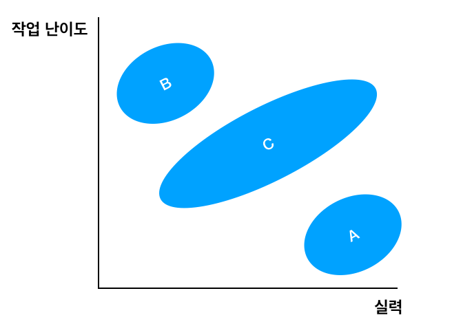

> [함께 자라기](http://www.yes24.com/Product/goods/67350256)을 보고 정리한 내용입니다.

# 자라기
* 야생 학습은 대부분 비순차적이다.
* 야생 학습은 대부분 자료에 한정이 없다.
* 야생 학습은 대부분 명확한 평가가 없다.
* 야생 학습은 대부분 목표가 불문명하고 바뀌기도 한다.

## 직무 성과와 상관 관계 
> 통상 0.5를 넘으면 강한 효과, 0.2 ~ 0.5 사이는 중간 정도라고 하며. 0.2 약한 효과라고 합니다.

경력 연차와의 상관성은 0.18 학력의 상관성은 0.10 입니다. 상관성이 0.20 이하이면 사회 과학에서도 꽤나 약한 상관성입니다. 관심사(취미 활동)조차도 직무 성과와 상관성이 0.10이 되는 수준입니다.

**연관성 높은 것들은 샘플 테스트 (실제로 채용 후에 해야 할 작업의 일부를 해보는 테스트) 0.54 아이큐 같은 지능 테스트가 0.51, 구조화된(직무 분석을 토대로한 질문) 0.51, 성실성이나 꼼꼼함 같은 성격 테스트도 0.41 ~ 0.31 상관성이 있었습니다.**

**대학교를 갓 졸업한 사람과 2년차 프로그래머 중에서 후자의 실력이 높을 확률이 크지만 5년 차와 10년 차의 연차 차이는 실력을 판단 하는 데 있어서 큰 의미는 없습니다.**

### 구조화된 인터뷰
실제 작업을 해보독하는 작업 샘플 테스트, 그리고 가능하다면 실제 업무를 주고 시험적으로 짧은 기간 동안 일을 해보게 하는 것 업무 성과가 뛰어난 개발자들이 이런 질문에 답을 더 잘할 수 있습니다.

#### 구조화된 인토뷰, 행동을 중심으로 인터뷰 하는 방식

* **지난 프로젝트에서 동료가 어려움을 껵을 때 어떤 행동을 하셨는지 구체적으로 예를 들어 주세요.**
* **업무적으로 꼭 해야하는 건 아니지만 당신이 도와주는 사람은 누구이고, 또 당신이 도움을 요청하는 사람은 누구입니까?**

## 능력 향상
최근 일주일 동안 업무 능력 향상을 위해 얼마나 시간을 쓰는지 물었는데 이 시간의 양과 직무 성과 간의 통계적으로 유의미한 양의 상관성이 있었습니다. 그 들이 자주 하는 수련으로 **머릿속에서 시뮬레이션하기, 피드백 요청 하기 등이 있습니다.**

## 개발자들이 할 수 있는 것
**자신이 즐기는 걸 한다고 해서 더 뛰어나게 될 것이라고 믿는 것은 미신입니다.** 1만 시간의 법칙에서 1만 시간은 **자신의 기량을 향상시킬 목적으로 반복적으로 하는 수련을 한 시간을 일컫습니다. 이러한 수련을 의도적 수련이라고합니다. 정말 기략을 향상을 목적으로 자신의 약점을 개선하려고 애쓰는 수련, 그것만이 의도적 수련입니다. 실력과 상관있는 것은 의도적 수련입니다.**

애자일 프로젝트에서는 지금 내가 한 행동의 피드백을 10분 후, 한 시간 후, 하루 후, 일주일 후 등 여러 주기를 톨해 지속적으로 얻을 수 있습니다. **인간의 경우도 피드백 주기가 길어지면 학습이 잘 안됩니다.** **무슨일이 끝나면 항상 회고 라는 활동을 해라**

## 달인 이되는 비결 

1. **실력을 개선하려는 동기가** 있어야 하고
2. **구체적인 피드백**을 적절한 시기(빠르게)에 받아야 한다.

단순히 반복만 한다고 해서 달인이 될수 없습니다. **특정 영역에서 개인이성취할 수 있는 최고 수준의 퍼포먼스는 경험을 오래 한다고 해서 자동으로 얻을 수 있는 것이 아닙니다.**

### 전문성 형성에 타당성과 피드백의 중요성
역사나 정치학의 전문가와 일반인이 장기적인 정치 판도를 예측했는데, 결과에는 별 차이가 없습니다. 주가를 예측한 실험에서도 펀드 매니저나 원숭이나 큰 차이가 없었고, 오히려 전문가가 더 못한 경우도 있습니다. 

**피드백 조건이 필요하다는 의미는 자신이 내린 직관적 판단에 대해 빨리 피드백을 받고 이를 통해 학습할 기회가 주어지는 환경이 갖춰져야 한다는 걸 말합니다. 수십 년 동안 한 가지 일을 하면서 전문가가 안되는 비결이 있다면 이 타탕성과 피드백이 부족한 환경에서 일하는 겁니다.**

### 당신이 제자리 걸음인 이유
실력을 높이기 위해서는 **의도적 수련이 중요합니다.** 의도적 수련의 필수조건, 적절한 난이도 의도적 수련이 되려면 나의 실력과 작업의 난이도가 비슷해야 합니다.

A 영역은 지루함을, B 영역은 불안함, 두려움을 느끼게됩니다. **C 영역은 난이도와 실력이 엇비슷하게 맞는 부분으로 이 부분에서 인간이 몰입을 결험한다고 합니다. 그리고 이때 최고 수준의 집중력을 보이고, 그 덕분에 퍼포먼스나 학습 능력이 최대치가 될 수 있다고 합니다. 또 한 그때 최고 수준의 행복감을 경험 한다는 흥미로운 사실을 발견하기도 했습니다.**

### 실력이 늘지 않은 이유
의도적 수련의 필수 요건 중 한가지는 **적절한 난이도 입니다.** **자신의 업무 시간 중에 불안함을이나 지루함을 느끼는 때가 대부분이라면, 실력이 도무지 늘지 않는 환경에 있는 겁니다.** 이런 환경에 익숙해지고 행동이 습관화된다는 점입니다.

### 고독한 전문가라는 미신
뛰어난 연구 자는 같은 부탁을 해도 **훨씬 더 짧은 시간 안에 타인의 도움을 얻습니다. 뛰어난 개밸자들은 약 70%가 동료와의 협력을 언급하는 반면, 실력이 그저 그런 개발자들은 20%도 안되는 사람들만 동료와의 협력을 언급합니다.**

# 함께 

## 커뮤니케이션과 협력
뛰어난 프로그래머일 수록 사회적인 면을 더 언급한다. 협력을 더 중요하게 여긴다는 것이다. 실력이 뛰어난 프로그래머는 커뮤니케이션과 협력에 더 오래 시간을 들입니다. 반면 설계나 코딩, 테스팅에 들이는 시간에는 통계적으로 큰차이는 없었습니다.

자신이 작성하는 코드의 추상성읖 높이고 싶다면 혼자서 고민하지 말고 다른 사람들과 협동하고, 대화하세요. 같이 그림도 그려보고 함께소스코드를 편집하세요. 인간에게는 다른 인간과 소통하고 협력할수 있는 놀라운 능력이 있습니다.

## 신뢰를 깍는 공유인가 신뢰를 쌓는 공유인가
신뢰 자산이 높은 조직은 커뮤니케이션 효율이나 생산성이 높다. 신뢰 자산이 높다는 것은 조직원들 간에 높은 수준의 신뢰가 기반되어 있는 걸 말합니다. 투명성과 공유, 인터랙션은 자신이 한 작업물을 투명하게 서로 공유하고 그에 대해 피드백을 주고 받으며 인터렉션을 하는 것이다. 

## 단수 공유 보단 복수 공유
하나의 공유나 최고 공유의 경우 우리는 공유자리에 기대감보다 불안감을 갖고 갖습니다. 상대가 부정적으로 들릴 만한 의견을 주면 그건 곧 나의 저문성에 대한 도전이 되는 겁니다. **나의 작품이 하나밖에 없으니 작업물 = 나가 되는 것이죠.** 반대로 복수 공유는 그런 공유감이 상대적으러 덜합니다. 또 부정적 피드백을 수용하려는 마음도 더 많죠. 여러 개를 준비했으니 그중 하나를 두고 뭐라고 해도 나에 대한 공격은 아닌겁니다. **복수 공유는 신뢰도가 높아지고 성과도 더 좋아집니다.**

## 객관성의 주관성
**팀장 자리에 있으면 새로운 아이더가 전파가 쉬울 거라고 생각하는 것은 환상입니다. 상대방에 대해 얼마나 이해를하고 계신가요? 얼마나 대화를 해보셨나요?** 사람들을 설득하기 위해 객관성이 필요하다고 생각합니다. 그런데 **이 객관성의 개념 자체가 매우 주관적입니다.** **결국 결정하는 것은 사람입니다. 마음에 들지 않으면 어떤 이유를 들어서든 반대하게 됩니다.** 마음에 안들면 어떤 객관적 자료를 갖다 줘도 설득할 수 없습니다. **특히 당신의 생각이 틀렸다 라는 암시가 강하게 있다면 더더욱 설득하기 어렵습니다.**

남을 설득하려면 논리성과 객관성에 대해 환상을 버려야 합니다. 그래야 현실적으로 설득이 가능합니다. 내가 설득하고 싶은 상대를 자주 만나서 신뢰를 쌓고, 그 사람이 무엇을 중요하게 여기는지. 어떤 설명 방식을 선호하는지 이해해야 합니다. **출발은 결국 내가 설득하려는 사람에게서 하는 것입니다. 자료에ㅐ서 출발하는 것이 아닙니다.**

## 이것도 모르세요?
누군가가 물어 본다면 이것도 모르세요? 라는 태도는 좋지 않습니다. **일단 용기를 내어 질문을 한 사람에게 박수를 처줍시다. 대부분의 경우 질문을 하지 않습니다.** 누군가가 질문 한다면 **공감하면서 들어주려 하고, 또 중요한 것은 상대가 어떤 멘탈 모델을 갖고 있는지 파악하려고 하는것이 좋습니다.**  코팅 멘토링 능력이 없는 팀장일수록 **비난**만 합니다. 그러면 나중에 비슷한 일이 또 생기게 되죠. 훌륭한 팀장이라면 먼저 그 사람의 사고 과정과 전력을 이해하려고 합니다.

## 탁월한 팀의 비밀
1. 팀에 누가 있는지(전문가, 내향/외향, 지능 등)보다 **팀원들이 서로 어떻게 상호작용 하고 자신의 일을 어떻게 바라보는지가 훨씬 중요했다.**
2. 5가지 성공적 팀의 특징을 찾았는데, 그중 앞도적으로 높은 예측력을 보인 변수는 **심리적 안전감**이었다.
3. 팀 토론 등 틸별히 고안된 활동을 통해 **심리적 안전감을 개선할 수 있었다.**

여기서 말하는 심리적 안전감이란, **내 생각이나 의견, 질문, 걱정 혹은 실수가 드러났을 때 처벌받거나 놀림받지 않을 거라는 믿음 이다.** 팀 토론 등 틱별히 고안된 활동을 통해 토론 주제를 안전한 환경에서 이야기하게 해주는 것 자체가 심리적 안전감을 높일수 있습니다.

## 현실에서 실천하기
우선 자신의 학습 환경을 만드세요. 거기서부터 출발입니다. 개별 기술이상으로 일하는 방식에 대해 실험을 해보세요. 실험이 실패한다고 좌절하지 마시고 **학습과 일을 굳이 분리하지 말고 공동체로 만드세요. 학습과 실행은 하나입니다. 진정한 학습은 실행 속에서 이뤄지고, 진정한 실행은 학습을 수반합니다.**

## 이번 프로젝트는 제때 끝낼 수 있을 것 같았는데
소프트웨어 공학 쪽의 연구에 따르면 사람들은 통상적으로 추정하는 소요 시간에 **적어도 2 ~ 3배를 해야 80% 정도의 확률도 마칠 수 있는 시간이 나온다고 합니다.** 게다가 일반적으로 **일의 소요 시간을 추정할 때 사람들이 난관적으로 추정한다는** 편향에 대한 연구 결과가 많다는 점까지 고려하면 상황은 더 심각해집니다.

학생들에게 논문 프로젝트의 완료 시기를 추정하게 했습니다. 99%의 확률로 언제까지 끝낼수 있다고 거의 모든 학생들이 대답했습니다. 하지만 **실제로 45% 학생만이 기간 내에 프로젝트을 완료할 수 있었습니다.** 또 다른 연구에 따르면 **사람들에게 가장 그럴싸한 추정을 부탁했을 때와 자신이 기대하는 최선의 상황을 상상해서 추정해보라고 부탁했을 때도 그 추정치는 큰차이가 없었습니다.**

# 애자일
당시 주도적인 소프트웨어 개발 방식은 계획주도 방식이었습니다. 초반 계획을 정교하고 꼼꼼하게 만들려고 엄청난 노력을합니다. 그러면 실행단계는 간단해지고 예측 가능해진 다고 생각하기 때문입니다. 하지만 **애자일은 불확실성을 크기 때문에 미리 분석하고 설계하는 데 한계가 있다고 봅니다. 사실 애자일은 불확실성이 클 때 우리가 어떻게 해야하는지 를 고민한 결과물입니다. 애자일이 불확실성을 다루는 방식은 좀 더 짧은 주기로 더 일찍부터 피드백을 받고, 더 다양한 사람으로부터 더 자주 그리고 더 일찍 피드백을 받는 것으로 정리할 수 있습니다.**

## 고객에게 매일 가치를 전하라
### 고갹에게
* 우리의 진짜 고객은 누구인가?

### 매일
* 어떻게 점진적으로 가치를 전할 것인가?
* 어떻게 보다 일찍, 그리고 보다 자주 가치를 전할 것인가?

### 가치를
* 무엇이 가치인가?
* 지금 우리가 하고 있는 일이 정말 가치를 만드는 일인가?
* 지금 가장 높은 가치는 무엇인가?
* 비슷한 수준의 가치를 더 갑싸게 전달하는 방법은?

### 전하라
* 가치를 우리가 갖고 있지 않고 고객에게 정말 전달하고 있는가?
* 고객이 정말 가치를 얻고 있는가?

## 애자일 도입 성공 요인 분석
애자일 초보팀과 애자일 전문가팀은 보면서 공통된 차이점을 발견했습니다. 초보팀일수록 처음에 쉽고 안심이 되는 것에서 시작합니다. 그것은 별 문제가 될것이 없스비다. 그렇게 해서 얻은 작은 성공의 시림리적 효과가 도움이되기 때문입니디. **여기서 중요한 건 어렵고 두렵지만 중요한 것을 얼마나 미루냐입니다.** 그런데 초보팀들은 프로젝트가 접하기 시작전까지 미룹니다. 저항이 적은 일만 하면서 **오순도순 영차영차 우리끼리 재미있게 하자 그러다가 우리들의 잔치로 끝나는 경우가 종종 있습니다.**

**전문가팀은 무섭고 두렵더라도 중요한 일이라면 그 일을 안하는 리스크를 인식하고 꾸준히 시도한다는 점에서 초보팀과 다릅니다. 두려워도 중요하다면 시도해봐야 합니다.**

## 성숙도가 낮다면 고객 참여는 필수
성숙도가 낮아도 고객 참여를 잘하면 프로젝트가 성공도가 올라갑니다. 애자일 성숙도가 낮다면 프로젝트 성공적으로 하기 위해서는 고객 참여가 좋습니다.

## 성숙도가 높다면 짧은 반복 주기
**애자일에 대해 어느정도 이해는 하고, 실험도 좀 해봤다 싶은 조직에서 성공 기여도를 높이려면 짧은 반복 개발 주기, 고객 참여, 코드 공유에 관심을 기울여야 합니다.**

## 애자일 코치의 특징
진정으로 중요한것은 프로젝트의 성패를 좌우하는 사람과 최대한 가까운 사람을 참여시키고 우리가 계속 노력하는 것입니다. 성공하는 조직에는 항상 뛰어난 애자일 코치가 있었습니다. 애자일 코치의 특징은 다음과 같습니다.

* 의사소통 스타일(팀원, 상사, 팀장과)
* EQ 및 스트레스하에서의 행동
* 리더십 및 코팅 스타일(동기부여 등)
* 회고를 통한 개인적 학습 능력
* 개인적 성장 의지, 성장 사고관, 자기효능감
* 관찰 및 상황 파악 능력
* 일치적 행동(믿는 것을 행동에 옮기는 능력)
* 기술적 능력

애자일 코치는 팀장일수도 있고 팀원일수도 있습니다. 조직적 정치적 위치와는 관계가 없습니다. **오로지 자신의 선택입니다.** 내가 애자일 코치가되어야지 결심하는 것이 가장 중요합니다. 이 사람이 어떻게 행동하고 의사소통하느냐에 따라 팀의 행동과 의사소통 방식이 바뀔 수 있습니다. 그리고 뛰어난 애자일 코치가 정해져 있다고 믿지 않습니다. **성장할 수 있다고 믿습니다. 누구나 뛰어난 애자일 코치가 될 수 있다고 믿습니다.**

## 당신의 조직에 새 방법론이 먹히지 않은 이유
애자일 방법론 도입을 원하는 팀장이라면 **나는 어떤 팀장인가**를 먼저 자문해봐야 하지 않을까 싶습니다. 내가 어떤 팀장인지 전혀 바뀌지 않으면서 새 방법론만 도입한다고 무슨 효과가 있을까요 반대로 항우울제보다 강력한 설탕물을 쑬 수 있는 의사처럼, **별 볼일 없어 보이는 방법론자일지라도 그걸 처방하는 팀장에 따라 전혀 다르 효과가 있을 겁니다**

